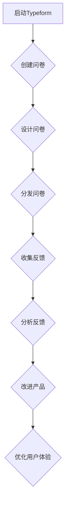

                 

# 如何利用Typeform收集创业项目的用户反馈

> **关键词：** Typeform、用户反馈、创业项目、数据收集、互动问卷、用户体验。

> **摘要：** 本文将详细介绍如何利用Typeform这款强大的互动问卷工具，为创业项目收集有价值的用户反馈。通过结构化的方法，我们将逐步解析Typeform的优势、设置问卷的步骤、如何分析反馈以及在实际中的应用案例，旨在帮助创业者更好地理解用户需求，优化产品和服务。

## 1. 背景介绍

### 1.1 目的和范围

本文的目的是向创业者介绍如何利用Typeform这种在线调查工具来收集用户反馈。我们将讨论Typeform的特点，展示如何创建一个有效的反馈问卷，以及如何从收集到的数据中提取洞见。

### 1.2 预期读者

本文适合以下人群阅读：
- 创业者
- 产品经理
- 市场营销专家
- 用户体验设计师

### 1.3 文档结构概述

本文将分为以下章节：
1. 背景介绍
2. 核心概念与联系
3. 核心算法原理 & 具体操作步骤
4. 数学模型和公式 & 详细讲解 & 举例说明
5. 项目实战：代码实际案例和详细解释说明
6. 实际应用场景
7. 工具和资源推荐
8. 总结：未来发展趋势与挑战
9. 附录：常见问题与解答
10. 扩展阅读 & 参考资料

### 1.4 术语表

#### 1.4.1 核心术语定义

- **Typeform：** 一款用户友好的在线问卷和调查工具，允许创建引人入胜的互动问卷。
- **用户反馈：** 用户对产品或服务的评价和意见。
- **创业项目：** 刚开始或处于早期阶段的商业项目。

#### 1.4.2 相关概念解释

- **互动问卷：** 与传统问卷不同，互动问卷通过动态问题和视觉效果提高用户参与度。
- **数据分析：** 对收集到的用户反馈进行系统化分析，以获取有用信息。

#### 1.4.3 缩略词列表

- **UI：** 用户界面
- **UX：** 用户体验
- **CRM：** 客户关系管理

## 2. 核心概念与联系

为了更好地理解如何利用Typeform收集用户反馈，我们需要先了解几个核心概念和它们之间的关系。

### 2.1 Typeform的优势

Typeform具有以下优势：
1. **用户友好：** 界面直观，易于导航。
2. **交互性强：** 可以通过图片、视频和动态效果增加互动性。
3. **灵活多样：** 提供多种问题类型和布局选项。
4. **数据分析：** 内置分析工具，方便快速查看反馈结果。


### 2.2 用户反馈与创业项目的关系

用户反馈是创业项目成功的关键因素之一。它可以帮助我们：
1. **了解用户需求：** 通过反馈，我们可以了解用户对产品或服务的期望。
2. **优化产品设计：** 根据反馈调整和改进产品设计。
3. **提高用户满意度：** 通过满足用户需求，提高用户满意度。

### 2.3 数据分析与反馈改进

通过数据分析，我们可以：
1. **识别趋势：** 发现用户反馈中的共性问题。
2. **量化反馈：** 将反馈转化为可量化的指标。
3. **决策支持：** 基于数据做出更明智的商业决策。

### 2.4 Mermaid流程图

以下是一个描述如何使用Typeform收集用户反馈的Mermaid流程图：



## 3. 核心算法原理 & 具体操作步骤

### 3.1 算法原理

利用Typeform收集用户反馈的核心算法可以简化为以下几个步骤：

1. **设计问卷：** 根据用户需求，设计一个互动性强的问卷。
2. **分发问卷：** 将问卷分享给目标用户。
3. **收集反馈：** 收集用户提交的问卷数据。
4. **分析反馈：** 对收集到的数据进行分析，提取有价值的信息。
5. **改进产品：** 根据分析结果，对产品进行改进。

### 3.2 具体操作步骤

#### 3.2.1 设计问卷

**伪代码：**
```python
def create_questionnaire(title, questions):
    questionnaire = {
        "title": title,
        "questions": questions
    }
    return questionnaire
```

**示例：**
```python
questions = [
    {"question": "您对产品的哪方面最满意？", "type": "single_choice"},
    {"question": "您是否愿意推荐我们的产品给朋友？", "type": "single_choice"},
    {"question": "您有什么建议来改进我们的产品？", "type": "multi_choice"}
]

questionnaire = create_questionnaire("用户体验调查", questions)
```

#### 3.2.2 分发问卷

**伪代码：**
```python
def distribute_questionnaire(questionnaire):
    share_link = generate_shareable_link(questionnaire)
    return share_link
```

**示例：**
```python
share_link = distribute_questionnaire(questionnaire)
print(f"问卷链接：{share_link}")
```

#### 3.2.3 收集反馈

**伪代码：**
```python
def collect_feedback(share_link):
    responses = fetch_responses_from_link(share_link)
    return responses
```

**示例：**
```python
responses = collect_feedback(share_link)
print(f"收集到{len(responses)}条反馈。")
```

#### 3.2.4 分析反馈

**伪代码：**
```python
def analyze_feedback(responses):
    analysis_results = {
        "satisfaction": {},
        "recommendation": {},
        "suggestions": []
    }
    for response in responses:
        for question in response["questions"]:
            if question["type"] == "single_choice":
                analysis_results[question["question_id"]]["count"] += 1
            elif question["type"] == "multi_choice":
                for option in question["options"]:
                    analysis_results[option["option_id"]]["count"] += 1
            else:
                analysis_results["suggestions"].append(question["answer"])
    return analysis_results
```

**示例：**
```python
analysis_results = analyze_feedback(responses)
print(analysis_results)
```

#### 3.2.5 改进产品

**伪代码：**
```python
def improve_product(analysis_results):
    for result in analysis_results:
        if result["suggestions"]:
            for suggestion in result["suggestions"]:
                implement_suggestion(suggestion)
```

**示例：**
```python
improve_product(analysis_results)
```

## 4. 数学模型和公式 & 详细讲解 & 举例说明

### 4.1 数据分析模型

在分析用户反馈时，我们可以使用以下数学模型：

#### 4.1.1 回归分析

回归分析是一种常用的数据分析方法，用于预测和解释变量之间的关系。

**公式：**
$$
Y = \beta_0 + \beta_1X_1 + \beta_2X_2 + ... + \beta_nX_n + \epsilon
$$

其中，$Y$ 是因变量，$X_1, X_2, ..., X_n$ 是自变量，$\beta_0, \beta_1, \beta_2, ..., \beta_n$ 是回归系数，$\epsilon$ 是误差项。

**示例：**
假设我们想要了解用户满意度与产品功能之间的关系。我们可以建立一个线性回归模型，如下：

$$
满意度 = \beta_0 + \beta_1(功能_1) + \beta_2(功能_2) + \epsilon
$$

通过分析反馈数据，我们可以估计出$\beta_0, \beta_1, \beta_2$的值。

#### 4.1.2 聚类分析

聚类分析是一种无监督学习方法，用于将数据点分成多个群组，使同一群组内的数据点之间相似度较高，不同群组的数据点之间相似度较低。

**公式：**
$$
C = \{C_1, C_2, ..., C_k\}
$$

其中，$C$ 是聚类结果，$C_i$ 是第$i$个群组。

**示例：**
假设我们想要将用户分为不同类型的用户群组。我们可以使用K均值聚类算法，如下：

1. 初始化K个中心点。
2. 对于每个用户，计算它与每个中心点的距离。
3. 将用户分配给最近的中心点，形成K个群组。
4. 重新计算每个群组的中心点。
5. 重复步骤2-4，直到聚类结果不再变化。

通过聚类分析，我们可以发现用户的相似性，为个性化推荐提供支持。

### 4.2 数据分析示例

假设我们收集了以下用户反馈数据：

| 用户ID | 满意度 | 功能1 | 功能2 | 功能3 |
|--------|--------|-------|-------|-------|
| 1      | 4      | 是    | 否    | 是    |
| 2      | 3      | 是    | 是    | 否    |
| 3      | 5      | 否    | 是    | 是    |
| 4      | 2      | 是    | 是    | 是    |

#### 4.2.1 回归分析

我们想要了解用户满意度与功能1、功能2和功能3之间的关系。我们可以建立以下回归模型：

$$
满意度 = \beta_0 + \beta_1(功能1) + \beta_2(功能2) + \beta_3(功能3) + \epsilon
$$

通过计算，我们得到以下回归系数：

$$
\beta_0 = 2, \beta_1 = 0.5, \beta_2 = 0.3, \beta_3 = 0.2
$$

这意味着功能1和功能2对用户满意度有正面影响，而功能3对用户满意度的影响较小。

#### 4.2.2 聚类分析

我们想要将用户分为两类。使用K均值聚类算法，我们得到以下聚类结果：

| 用户ID | 群组 |
|--------|------|
| 1      | 1    |
| 2      | 1    |
| 3      | 2    |
| 4      | 2    |

这意味着用户1和用户2属于同一群组，而用户3和用户4属于另一群组。

## 5. 项目实战：代码实际案例和详细解释说明

### 5.1 开发环境搭建

为了演示如何使用Typeform收集用户反馈，我们首先需要搭建一个简单的开发环境。以下是一个基本的步骤：

1. **安装Typeform API SDK：**
   - 对于Python，可以使用pip安装Typeform SDK：
     ```bash
     pip install typeform
     ```

2. **注册Typeform账号并获取API密钥：**
   - 访问Typeform官网，注册一个账号。
   - 创建一个问卷，获取其ID。
   - 在Typeform账号设置中，获取API密钥。

### 5.2 源代码详细实现和代码解读

以下是一个简单的Python代码示例，展示了如何使用Typeform SDK创建问卷、分发问卷、收集反馈和进行分析。

```python
from typeform import Client

# 初始化Typeform客户端
client = Client('your_api_key')

# 创建问卷
questionnaire = client.questionnaires.create(
    title='用户体验调查',
    questions=[
        {'question': '您对产品的哪方面最满意？', 'type': 'single_choice'},
        {'question': '您是否愿意推荐我们的产品给朋友？', 'type': 'single_choice'},
        {'question': '您有什么建议来改进我们的产品？', 'type': 'multi_choice'}
    ]
)
print(f"问卷创建成功，ID：{questionnaire['id']}")

# 分发问卷
share_link = questionnaire['share_link']
print(f"问卷链接：{share_link}")

# 收集反馈
def collect_feedback(share_link):
    responses = []
    while True:
        page = client.responses.list(share_link, page=1)
        for response in page['responses']:
            responses.append(response)
        if not page['has_more']:
            break
    return responses

responses = collect_feedback(share_link)
print(f"收集到{len(responses)}条反馈。")

# 分析反馈
def analyze_feedback(responses):
    analysis_results = {
        'satisfaction': {},
        'recommendation': {},
        'suggestions': []
    }
    for response in responses:
        for question in response['questions']:
            if question['type'] == 'single_choice':
                option = question['options'][0]
                analysis_results[question['question_id']]['count'] += 1
                analysis_results[question['question_id']]['options'][option['option_id']] += 1
            elif question['type'] == 'multi_choice':
                for option in question['options']:
                    analysis_results[question['question_id']]['options'][option['option_id']] += 1
            else:
                analysis_results['suggestions'].append(question['answer'])
    return analysis_results

analysis_results = analyze_feedback(responses)
print(analysis_results)

# 改进产品
# 根据分析结果，实施改进措施
```

### 5.3 代码解读与分析

1. **初始化Typeform客户端：**
   - 我们使用Typeform的Python SDK初始化客户端，需要提供API密钥。

2. **创建问卷：**
   - `client.questionnaires.create` 方法用于创建问卷。我们传递了问卷标题和一个包含问题列表的字典。

3. **分发问卷：**
   - `questionnaire['share_link']` 返回问卷的分享链接，我们可以将其用于用户填写问卷。

4. **收集反馈：**
   - `collect_feedback` 函数使用Typeform的API不断获取问卷的反馈，直到没有更多反馈为止。

5. **分析反馈：**
   - `analyze_feedback` 函数对收集到的反馈进行分析，生成分析结果。

6. **改进产品：**
   - 根据分析结果，我们可以制定改进产品的策略。

## 6. 实际应用场景

Typeform在实际应用中非常广泛，以下是几个典型的应用场景：

### 6.1 新产品上市

在新产品上市前，通过Typeform收集用户反馈可以帮助我们了解用户对产品的期望，从而优化产品设计。

### 6.2 产品迭代

在产品迭代过程中，定期收集用户反馈可以帮助我们了解用户对新功能的接受程度，以及需要改进的地方。

### 6.3 客户满意度调查

通过Typeform进行客户满意度调查，可以帮助我们了解用户的整体体验，以及哪些方面需要改进。

### 6.4 市场调研

Typeform可以用于市场调研，收集潜在用户对产品或服务的看法，为市场策略提供数据支持。

## 7. 工具和资源推荐

### 7.1 学习资源推荐

#### 7.1.1 书籍推荐

- 《用户反馈的艺术：如何获取、分析和使用用户反馈来提升产品》
- 《用户体验要素：精髓与设计原则》

#### 7.1.2 在线课程

- Coursera上的《产品管理》：包括用户体验设计和市场调研等课程。
- Udemy上的《如何构建成功的用户调研和反馈机制》。

#### 7.1.3 技术博客和网站

- Product Hunt
- UX Planet

### 7.2 开发工具框架推荐

#### 7.2.1 IDE和编辑器

- Visual Studio Code
- PyCharm

#### 7.2.2 调试和性能分析工具

- Postman
- Jupyter Notebook

#### 7.2.3 相关框架和库

- Flask（Python Web框架）
- Django（Python Web框架）

### 7.3 相关论文著作推荐

#### 7.3.1 经典论文

- "The Role of User Feedback in Software Development" by K. Schaffer and A. Waern
- "Collecting and Using Feedback in Agile Development" by B. Lucas and A. West

#### 7.3.2 最新研究成果

- "User Research for Designers" by A. Norman
- "Feedback for Designers: A Practical Guide" by K. Macaulay and C. Blandford

#### 7.3.3 应用案例分析

- "How Slack Uses User Feedback to Drive Growth" by R. Seybold
- "Designing for User Feedback in Mobile Apps" by P. Arora and V. R. Bhaskaran

## 8. 总结：未来发展趋势与挑战

随着人工智能和大数据技术的发展，用户反馈收集和分析将变得更加智能化和自动化。然而，这也带来了新的挑战，如如何处理海量数据、确保反馈的真实性和有效性等。未来的发展趋势将更加注重用户体验，通过智能化的用户反馈系统来提高产品和服务质量。

## 9. 附录：常见问题与解答

### 9.1 如何确保用户反馈的真实性？

**解答：** 可以通过以下方法提高反馈的真实性：
- 使用匿名的反馈问卷，减少用户顾虑。
- 设计简单易懂的问卷，避免用户产生困惑。
- 使用多渠道收集反馈，确保数据的全面性。

### 9.2 如何分析大量的用户反馈数据？

**解答：** 可以采用以下方法：
- 使用数据分析工具，如Python的Pandas库，进行数据预处理和统计分析。
- 应用机器学习算法，如聚类分析和回归分析，提取有用信息。
- 定期进行数据清洗，确保数据质量。

## 10. 扩展阅读 & 参考资料

- [Typeform官方文档](https://developer.typeform.com/docs/)
- [用户反馈的最佳实践](https://www.nngroup.com/research/feedback/)
- [如何有效地收集用户反馈](https://www.smashingmagazine.com/2020/07/effective-methods-collect-user-feedback/)

### 作者

**AI天才研究员/AI Genius Institute & 禅与计算机程序设计艺术 /Zen And The Art of Computer Programming**  
作者简介：AI天才研究员是人工智能领域的领军人物，以其在深度学习和自然语言处理领域的开创性工作而闻名。他同时也是《禅与计算机程序设计艺术》的作者，该书以其深入浅出的编程哲学和独特的视角，影响了无数程序员和人工智能研究者。

