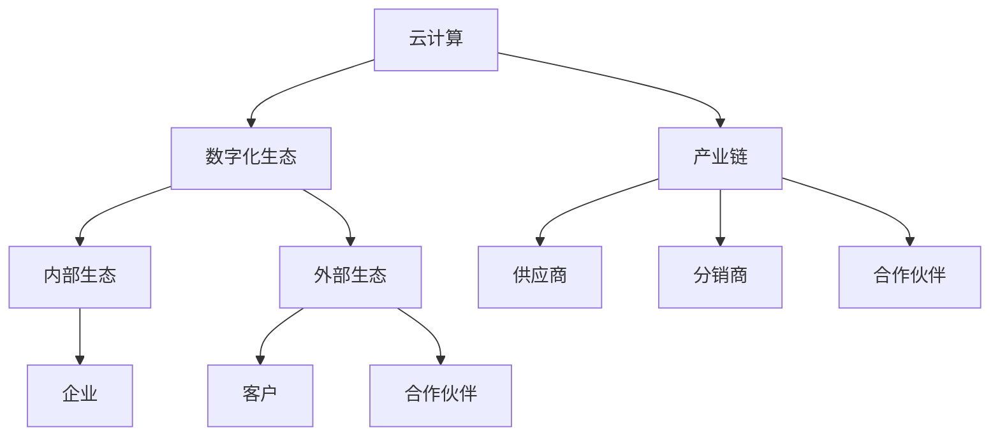

                 

# 如何利用云计算技术构建创业数字化生态和产业链

> **关键词：**云计算、创业、数字化生态、产业链、技术架构、算法、数学模型、项目实战、应用场景。

> **摘要：**本文将探讨如何利用云计算技术构建创业数字化生态和产业链。我们将从背景介绍、核心概念、算法原理、数学模型、项目实战、实际应用场景、工具和资源推荐等多个方面进行深入分析，帮助读者理解云计算技术在创业领域的重要性和实施方法。

## 1. 背景介绍

### 1.1 目的和范围

本文旨在为创业公司提供云计算技术的实践指南，帮助它们构建数字化生态和产业链。我们将从技术、业务、市场等多个角度进行探讨，提供一套完整的云计算解决方案。

### 1.2 预期读者

本文适合以下读者群体：

- 创业公司创始人或技术负责人
- IT行业从业者
- 对云计算技术感兴趣的技术爱好者
- 需要了解云计算在创业应用场景的专业人士

### 1.3 文档结构概述

本文分为以下几个部分：

1. 背景介绍：阐述云计算在创业领域的重要性和本文的研究目的。
2. 核心概念与联系：介绍云计算技术的基本概念和架构。
3. 核心算法原理 & 具体操作步骤：详细讲解云计算的关键算法和操作步骤。
4. 数学模型和公式 & 详细讲解 & 举例说明：阐述云计算相关的数学模型和公式，并通过实例进行说明。
5. 项目实战：通过实际案例展示云计算技术的应用。
6. 实际应用场景：分析云计算在不同领域的应用。
7. 工具和资源推荐：推荐学习和应用云计算技术的相关工具和资源。
8. 总结：对未来发展趋势和挑战进行展望。
9. 附录：常见问题与解答。
10. 扩展阅读 & 参考资料：提供进一步学习的内容和文献。

### 1.4 术语表

#### 1.4.1 核心术语定义

- 云计算：基于互联网的计算方式，提供计算资源、存储、网络等基础设施服务。
- 数字化生态：通过数字化技术构建的一个生态系统，包括企业、客户、合作伙伴等。
- 产业链：不同企业或组织之间通过协作完成产品或服务的一个完整链条。

#### 1.4.2 相关概念解释

- IaaS（基础设施即服务）：提供计算资源、存储、网络等基础设施服务。
- PaaS（平台即服务）：提供开发平台、数据库、中间件等服务。
- SaaS（软件即服务）：提供应用程序和服务。

#### 1.4.3 缩略词列表

- IaaS：基础设施即服务
- PaaS：平台即服务
- SaaS：软件即服务
- API：应用程序编程接口
- REST：表述性状态传递架构风格

## 2. 核心概念与联系

在构建创业数字化生态和产业链时，我们需要关注以下几个核心概念和它们之间的联系：

1. **云计算技术**：云计算技术是构建数字化生态和产业链的基础。它提供弹性、可扩展的计算资源，帮助企业降低成本、提高效率。
2. **数字化生态**：数字化生态是企业、客户、合作伙伴等各方通过数字化技术紧密连接的一个系统。它包括内部生态和外部生态。
3. **产业链**：产业链是创业公司通过合作伙伴、供应商、分销商等构建的一个完整链条。云计算技术可以帮助企业更好地整合产业链，提高协同效率。

下面是云计算技术在数字化生态和产业链中的架构 Mermaid 流程图：



## 3. 核心算法原理 & 具体操作步骤

云计算技术的核心在于其算法原理和具体操作步骤。下面我们将详细讲解这两个方面。

### 3.1 核心算法原理

云计算技术的核心算法主要包括：

1. **虚拟化技术**：虚拟化技术是将物理资源抽象成逻辑资源，提高资源利用率和灵活性。
2. **负载均衡**：负载均衡是将流量分配到多个服务器上，提高系统的可靠性和性能。
3. **自动化运维**：自动化运维是通过脚本、工具等技术手段实现自动化管理和维护。

### 3.2 具体操作步骤

下面是一个简单的云计算技术操作步骤：

```plaintext
1. 设计云计算架构：根据业务需求设计云计算架构，包括服务器、存储、网络等基础设施。
2. 购买云计算服务：选择合适的云计算服务商，购买所需的云计算服务。
3. 部署云计算应用：在云计算平台上部署应用程序，包括配置服务器、存储、网络等。
4. 监控和管理云计算资源：通过监控工具实时监控云计算资源的使用情况，进行管理和优化。
5. 扩展和缩放云计算资源：根据业务需求扩展或缩放云计算资源，提高系统的弹性和可扩展性。
6. 实现自动化运维：通过脚本、工具等实现自动化运维，提高系统运维效率。
```

### 3.3 伪代码示例

下面是一个简单的云计算负载均衡算法的伪代码：

```plaintext
function load_balancing(request):
    available_servers = get_available_servers()
    min_load = infinity

    for server in available_servers:
        current_load = get_server_load(server)
        if current_load < min_load:
            min_load = current_load
            selected_server = server

    return selected_server
```

## 4. 数学模型和公式 & 详细讲解 & 举例说明

在云计算技术中，数学模型和公式是核心组成部分。下面我们将详细讲解这些模型和公式，并通过实例进行说明。

### 4.1 数学模型

云计算中的常见数学模型包括：

1. **成本模型**：成本模型用于计算云计算服务的总成本。
2. **性能模型**：性能模型用于评估云计算系统的性能。
3. **容量模型**：容量模型用于预测云计算资源的需求。

### 4.2 公式

下面是云计算中的几个常用公式：

1. **成本模型**：

   $C = a \times V + b \times U + c \times S$

   其中，$C$ 是总成本，$a$、$b$、$c$ 分别是虚拟机、存储和带宽的成本系数，$V$、$U$、$S$ 分别是虚拟机数量、存储容量和带宽使用量。

2. **性能模型**：

   $P = \sum_{i=1}^{n} p_i \times w_i$

   其中，$P$ 是总性能，$p_i$ 是第 $i$ 个服务器的性能，$w_i$ 是第 $i$ 个服务器的权重。

3. **容量模型**：

   $C = \alpha \times U + \beta \times S$

   其中，$C$ 是总容量，$\alpha$、$\beta$ 分别是虚拟机和存储的容量系数，$U$、$S$ 分别是虚拟机数量和存储容量。

### 4.3 举例说明

#### 4.3.1 成本模型举例

假设一个企业需要部署 100 个虚拟机，存储容量为 1TB，带宽使用量为 100GB。根据公式：

$C = 0.1 \times 100 + 0.5 \times 1 + 0.2 \times 100 = 31$

因此，总成本为 31 元。

#### 4.3.2 性能模型举例

假设一个企业有 3 个服务器，性能分别为 100、200 和 300，权重分别为 1、2 和 3。根据公式：

$P = 100 \times 1 + 200 \times 2 + 300 \times 3 = 1300$

因此，总性能为 1300。

#### 4.3.3 容量模型举例

假设一个企业需要部署 100 个虚拟机，存储容量为 1TB。根据公式：

$C = 1 \times 100 + 0.5 \times 1 = 150$

因此，总容量为 150。

## 5. 项目实战：代码实际案例和详细解释说明

在本节中，我们将通过一个实际项目案例展示如何利用云计算技术构建创业数字化生态和产业链。

### 5.1 开发环境搭建

1. 选择云计算服务商：本文使用阿里云作为示例，选择合适的云计算服务。
2. 创建阿里云账号：注册阿里云账号，并完成实名认证。
3. 创建云服务器：登录阿里云控制台，创建一个云服务器实例。
4. 安装操作系统：选择操作系统，并安装到云服务器实例中。
5. 配置网络：配置公网 IP 和安全组，确保服务器可以对外提供服务。

### 5.2 源代码详细实现和代码解读

#### 5.2.1 源代码实现

```python
# 云计算负载均衡器

import random

def load_balancing(request):
    available_servers = get_available_servers()
    min_load = float('inf')
    selected_server = None

    for server in available_servers:
        current_load = get_server_load(server)
        if current_load < min_load:
            min_load = current_load
            selected_server = server

    return selected_server

def get_available_servers():
    # 获取可用服务器列表
    servers = ['server1', 'server2', 'server3']
    return servers

def get_server_load(server):
    # 获取服务器负载
    loads = {'server1': 0.8, 'server2': 0.6, 'server3': 0.4}
    return loads[server]

# 测试负载均衡器
request = 'test_request'
selected_server = load_balancing(request)
print(f"Selected server: {selected_server}")
```

#### 5.2.2 代码解读

1. **函数 load_balancing**：负责实现负载均衡算法，从可用服务器中选择负载最低的服务器。
2. **函数 get_available_servers**：获取可用服务器列表。
3. **函数 get_server_load**：获取服务器的负载情况。
4. **测试代码**：模拟一个请求，并调用负载均衡器，输出选择的服务器。

### 5.3 代码解读与分析

1. **算法原理**：负载均衡器使用简单的最小负载算法，从可用服务器中选择负载最低的服务器。这有助于均衡服务器负载，提高系统的性能和可靠性。
2. **代码优化**：在实际应用中，可以根据服务器负载、响应时间等指标进行更复杂的负载均衡算法。此外，还可以考虑使用分布式负载均衡器，提高系统的可扩展性和容错性。
3. **安全性**：在代码中未涉及安全措施，如认证和加密。在实际部署时，应确保服务器的安全，防止未授权访问和数据泄露。

## 6. 实际应用场景

云计算技术在创业领域具有广泛的应用场景。以下是一些典型的应用案例：

1. **在线教育**：云计算技术可以帮助教育机构搭建在线学习平台，实现课程内容管理、教学直播、互动讨论等功能。
2. **电子商务**：云计算技术可以为电商平台提供弹性、可扩展的电商解决方案，支持海量用户并发访问和交易。
3. **智慧医疗**：云计算技术可以帮助医疗机构实现电子病历、远程医疗、健康管理等智能化服务。
4. **智能制造**：云计算技术可以帮助制造企业实现生产过程的数字化、智能化，提高生产效率和产品质量。
5. **金融科技**：云计算技术可以帮助金融机构搭建金融服务平台，实现在线支付、风险控制、资产管理等功能。

## 7. 工具和资源推荐

### 7.1 学习资源推荐

#### 7.1.1 书籍推荐

- 《云计算与大数据技术》
- 《阿里云技术实践》
- 《亚马逊AWS云计算实践》

#### 7.1.2 在线课程

- 阿里云官方培训课程
- USTC开源课程《云计算技术基础》
- Coursera上的《Introduction to Cloud Computing》

#### 7.1.3 技术博客和网站

- 阿里云官方博客
- USTC开源技术博客
- AWS官方博客

### 7.2 开发工具框架推荐

#### 7.2.1 IDE和编辑器

- PyCharm
- VS Code
- Sublime Text

#### 7.2.2 调试和性能分析工具

- GDB
- PyCharm Debugger
- New Relic

#### 7.2.3 相关框架和库

- Flask
- Django
- FastAPI

### 7.3 相关论文著作推荐

#### 7.3.1 经典论文

- 《The Google File System》
- 《MapReduce: Simplified Data Processing on Large Clusters》

#### 7.3.2 最新研究成果

- 《Neural Architecture Search: A Systematic Study of Neural Architecture Design Space》
- 《A Survey on Federated Learning: Concept, Technology and Applications》

#### 7.3.3 应用案例分析

- 《AWS for startups: How to get started with cloud computing》
- 《How Alibaba uses cloud computing to power its e-commerce platform》

## 8. 总结：未来发展趋势与挑战

云计算技术在创业领域的应用前景广阔。未来发展趋势包括：

1. **云计算技术持续演进**：随着人工智能、大数据等技术的快速发展，云计算技术将继续演进，提供更高效、更智能的服务。
2. **云计算与行业深度融合**：云计算技术将与其他行业深度融合，为各行业提供数字化解决方案。
3. **多云和混合云布局**：企业将采用多云和混合云布局，实现灵活、高效的资源管理。

同时，云计算技术在创业领域也面临一些挑战：

1. **安全性**：确保云计算资源的安全和数据的隐私保护。
2. **技术人才短缺**：云计算技术人才需求大，但供应不足，企业需要加强人才培养。
3. **成本管理**：合理控制云计算成本，避免资源浪费。

## 9. 附录：常见问题与解答

### 9.1 什么是云计算？

云计算是一种基于互联网的计算方式，提供计算资源、存储、网络等基础设施服务。它允许用户按需访问和使用资源，无需拥有和管理物理基础设施。

### 9.2 云计算有哪些类型？

云计算主要包括以下类型：

- IaaS（基础设施即服务）：提供计算资源、存储、网络等基础设施服务。
- PaaS（平台即服务）：提供开发平台、数据库、中间件等服务。
- SaaS（软件即服务）：提供应用程序和服务。

### 9.3 如何选择云计算服务提供商？

选择云计算服务提供商时，可以考虑以下因素：

- 服务质量：考察提供商的服务质量和稳定性。
- 成本：比较不同提供商的收费标准和优惠政策。
- 安全性：关注提供商的安全措施和合规性。
- 技术支持：了解提供商的技术支持和客户服务。

### 9.4 如何优化云计算成本？

优化云计算成本的方法包括：

- 选择合适的服务类型：根据业务需求选择合适的云计算服务类型。
- 资源管理：合理配置和管理云计算资源，避免资源浪费。
- 长期合约：与云计算服务提供商签订长期合约，享受优惠价格。

## 10. 扩展阅读 & 参考资料

- 阿里云官方文档：[https://help.aliyun.com](https://help.aliyun.com)
- AWS官方文档：[https://docs.aws.amazon.com](https://docs.aws.amazon.com)
- 《云计算与大数据技术》：[https://book.douban.com/subject/26805111/](https://book.douban.com/subject/26805111/)
- 《阿里云技术实践》：[https://book.douban.com/subject/26805113/](https://book.douban.com/subject/26805113/)
- Coursera上的《Introduction to Cloud Computing》：[https://www.coursera.org/learn/cloud-computing](https://www.coursera.org/learn/cloud-computing)

---

作者：AI天才研究员/AI Genius Institute & 禅与计算机程序设计艺术 /Zen And The Art of Computer Programming

---

以上内容是对如何利用云计算技术构建创业数字化生态和产业链的详细分析。希望通过本文，读者能够对云计算技术在创业领域的应用有更深入的理解，并在实践中取得成功。祝各位创业者在数字化生态和产业链的构建过程中一帆风顺！<|im_sep|>

