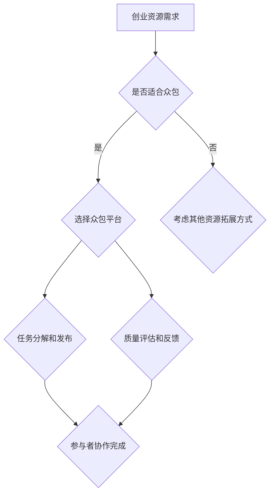

                 

# 如何利用众包模式拓展创业资源

> **关键词：** 众包，创业资源，商业模式，创新，协作，拓展

> **摘要：** 本文将探讨众包模式在创业资源拓展中的应用，从核心概念、算法原理、数学模型、实战案例等方面进行深入分析，旨在为创业者提供一套切实可行的策略和方法，以提升创业成功率。

## 1. 背景介绍

### 1.1 目的和范围

本文旨在为创业者提供一种利用众包模式拓展创业资源的系统方法。我们将从以下几个方面展开讨论：

1. 介绍众包模式的定义和基本原理。
2. 分析众包模式在创业资源拓展中的优势和挑战。
3. 阐述众包模式在创业中的应用场景。
4. 提供具体的众包实践步骤和策略。
5. 推荐相关的学习资源和工具。

### 1.2 预期读者

本文适合以下读者群体：

1. 初创企业的创始人或团队成员。
2. 有意尝试众包模式的企业家和投资者。
3. 对众包模式感兴趣的技术人员和研究人员。

### 1.3 文档结构概述

本文的结构如下：

1. 引言：介绍众包模式的背景和重要性。
2. 核心概念与联系：解释众包模式的基本原理和架构。
3. 核心算法原理 & 具体操作步骤：详细描述众包模式的实现过程。
4. 数学模型和公式：阐述众包模式中的数学原理和模型。
5. 项目实战：通过实际案例展示众包模式的应用。
6. 实际应用场景：分析众包模式在不同行业和领域的应用。
7. 工具和资源推荐：推荐相关的学习资源和工具。
8. 总结：展望众包模式在未来的发展趋势与挑战。
9. 附录：常见问题与解答。
10. 扩展阅读 & 参考资料：提供进一步的阅读材料。

### 1.4 术语表

#### 1.4.1 核心术语定义

- **众包（Crowdsourcing）**：一种将任务外包给广大公众完成的方式。
- **创业资源**：包括资金、人力、技术、市场等创业所需的资源。
- **协作（Collaboration）**：多个个体或组织共同合作完成某个任务或项目。
- **拓展（Expansion）**：扩大业务范围或规模。

#### 1.4.2 相关概念解释

- **开源（Open Source）**：软件的开发和分发遵循特定的许可证，允许公众自由使用、修改和分发。
- **众包平台**：提供众包服务的中介平台，如GitHub、Upwork等。
- **敏捷开发（Agile Development）**：一种软件开发方法，强调迭代和协作。

#### 1.4.3 缩略词列表

- **OSS（Open Source Software）**：开源软件。
- **API（Application Programming Interface）**：应用程序编程接口。
- **SDK（Software Development Kit）**：软件开发工具包。
- **UI（User Interface）**：用户界面。

## 2. 核心概念与联系

### 2.1 众包模式的定义和原理

**众包**是一种将任务或项目外包给广大公众来完成的方式。它利用互联网和社交媒体等工具，将复杂的任务分解成多个小任务，并通过众包平台发布给公众，吸引感兴趣的个体或团队参与。

众包模式的核心原理包括以下几点：

1. **任务分解**：将大任务分解成小任务，以便个体能够更高效地完成。
2. **公开征集**：通过众包平台公开征集任务参与者，吸引更多优秀的人才参与。
3. **协作完成**：参与者通过协作完成任务，共同为项目做出贡献。
4. **质量评估**：对参与者提交的结果进行质量评估，确保任务完成的质量。

### 2.2 众包模式在创业资源拓展中的应用架构

为了更好地理解众包模式在创业资源拓展中的应用，我们可以使用以下Mermaid流程图：



### 2.3 众包模式的优势和挑战

**优势：**

1. **高效性**：通过众包，创业者可以迅速获得所需资源，加快项目进度。
2. **成本效益**：众包模式可以大大降低创业成本，特别是人力资源成本。
3. **创新性**：众包模式能够吸引更多的创意和想法，有助于提升项目的创新性。
4. **全球范围**：众包模式不受地域限制，创业者可以吸引全球范围内的优秀人才。

**挑战：**

1. **质量控制**：由于参与者众多，质量难以保证，需要建立有效的质量评估体系。
2. **知识产权保护**：众包过程中可能涉及知识产权问题，需要制定相应的保护措施。
3. **协作管理**：参与者之间的协作管理是一个挑战，需要建立有效的沟通和协调机制。

## 3. 核心算法原理 & 具体操作步骤

### 3.1 众包平台的搭建

**算法原理：** 众包平台的搭建需要以下几个核心步骤：

1. **需求分析**：明确创业资源的需求，包括任务类型、任务量、资源需求等。
2. **平台设计**：设计众包平台的架构和功能模块，包括任务发布、参与者注册、任务执行、质量评估等。
3. **系统开发**：使用合适的编程语言和框架开发众包平台，确保平台的稳定性和可扩展性。
4. **测试与部署**：对平台进行全面的测试，确保功能正确无误，并部署上线。

**具体操作步骤：**

1. **需求分析**：与创业者或项目团队讨论，明确创业资源的需求，并确定使用众包模式的可行性和必要性。
2. **平台设计**：设计众包平台的整体架构，包括前端、后端、数据库等，确保平台的稳定性和安全性。
3. **系统开发**：使用合适的编程语言（如Java、Python等）和框架（如Spring Boot、Django等）进行开发，实现任务发布、参与者注册、任务执行、质量评估等功能。
4. **测试与部署**：对平台进行功能测试、性能测试和安全测试，确保平台的稳定性和可靠性，然后进行部署上线。

### 3.2 任务分解和发布

**算法原理：** 将大任务分解成小任务，并通过众包平台发布给参与者。

**具体操作步骤：**

1. **任务分解**：根据创业资源的需求，将大任务分解成多个小任务，确保每个任务都能够独立完成。
2. **任务发布**：在众包平台上创建任务，填写任务详情，包括任务描述、任务量、时间限制、报酬等，然后发布任务。
3. **任务分配**：平台自动或手动将任务分配给参与者，参与者可以接取任务并开始执行。
4. **任务监控**：创业者或项目团队对任务执行情况进行监控，确保任务按时完成。

### 3.3 参与者协作完成

**算法原理：** 利用协作机制，确保参与者能够高效完成任务。

**具体操作步骤：**

1. **协作平台**：提供协作平台，如聊天工具、文档共享等，供参与者沟通和协作。
2. **任务反馈**：参与者完成任务后，提交结果并进行反馈，创业者或项目团队对结果进行审核和评估。
3. **质量评估**：根据任务完成情况，对参与者进行评分和奖励，确保任务质量。
4. **持续改进**：根据反馈和评估结果，不断优化任务流程和协作机制。

## 4. 数学模型和公式 & 详细讲解 & 举例说明

### 4.1 众包任务分配的数学模型

为了确保任务能够高效分配给合适的参与者，我们可以使用以下数学模型：

$$
f(i, t) = \frac{w_i}{w_i + \sum_{j \neq i} w_j}
$$

其中，$f(i, t)$ 表示任务 $t$ 被参与者 $i$ 分配的概率，$w_i$ 表示参与者 $i$ 的权重，$w_i$ 可以根据参与者的历史表现、技能水平等因素计算。

### 4.2 举例说明

假设我们有三个参与者 $A$、$B$ 和 $C$，他们的权重分别为 $w_A = 2$、$w_B = 3$ 和 $w_C = 1$，现在有一个任务 $T$ 需要分配给这三个参与者。根据上述公式，我们可以计算每个参与者分配到任务的概率：

$$
f(A, T) = \frac{2}{2 + 3 + 1} = \frac{2}{6} = \frac{1}{3}
$$

$$
f(B, T) = \frac{3}{2 + 3 + 1} = \frac{3}{6} = \frac{1}{2}
$$

$$
f(C, T) = \frac{1}{2 + 3 + 1} = \frac{1}{6}
$$

根据计算结果，参与者 $B$ 分配到任务 $T$ 的概率最高，为 $\frac{1}{2}$。

## 5. 项目实战：代码实际案例和详细解释说明

### 5.1 开发环境搭建

在本案例中，我们将使用Python语言和Flask框架搭建一个简单的众包平台。以下是搭建开发环境所需的步骤：

1. 安装Python：从[Python官方网站](https://www.python.org/)下载并安装Python。
2. 安装Flask：在终端中运行以下命令安装Flask：

```bash
pip install flask
```

3. 创建一个名为`crowdsourcing`的虚拟环境，并在其中安装其他依赖项。

```bash
python -m venv crowdsourcing
source crowdsourcing/bin/activate
pip install flask
```

4. 创建一个名为`app.py`的文件，作为我们的主程序。

### 5.2 源代码详细实现和代码解读

以下是一个简单的众包平台实现的代码示例：

```python
from flask import Flask, request, jsonify
app = Flask(__name__)

tasks = [
    {
        'id': 1,
        'title': 'Task 1',
        'description': 'This is a simple task.',
        'status': 'pending'
    },
    {
        'id': 2,
        'title': 'Task 2',
        'description': 'This is another simple task.',
        'status': 'pending'
    }
]

@app.route('/tasks', methods=['GET', 'POST'])
def handle_tasks():
    if request.method == 'GET':
        return jsonify(tasks)
    elif request.method == 'POST':
        new_task = request.json
        tasks.append(new_task)
        return jsonify(tasks), 201

@app.route('/tasks/<int:task_id>', methods=['GET', 'PUT', 'DELETE'])
def handle_task(task_id):
    task = next((task for task in tasks if task['id'] == task_id), None)
    if task is None:
        return jsonify({'error': 'Task not found'}), 404

    if request.method == 'GET':
        return jsonify(task)
    elif request.method == 'PUT':
        updated_task = request.json
        task.update(updated_task)
        return jsonify(task)
    elif request.method == 'DELETE':
        tasks.remove(task)
        return '', 204

if __name__ == '__main__':
    app.run(debug=True)
```

**代码解读与分析：**

- **Flask应用搭建**：首先，我们导入了Flask模块，并创建了一个Flask实例。
- **任务数据结构**：我们使用一个列表来存储任务数据，每个任务包含`id`、`title`、`description`和`status`字段。
- **路由处理**：我们定义了三个路由：`/tasks`（处理所有任务的操作）、`/tasks/<int:task_id>`（处理单个任务的操作）。
- **GET请求处理**：当收到GET请求时，我们返回任务列表或单个任务的数据。
- **POST请求处理**：当收到POST请求时，我们解析请求中的JSON数据，并将新任务添加到任务列表中。
- **PUT请求处理**：当收到PUT请求时，我们更新任务数据。
- **DELETE请求处理**：当收到DELETE请求时，我们从任务列表中删除任务。

### 5.3 代码解读与分析

在上面的代码中，我们使用Flask框架实现了三个主要功能：

1. **任务列表获取**：当客户端发送GET请求到`/tasks`时，服务器会返回所有任务的数据。这可以帮助创业者查看当前的任务列表。

2. **任务创建**：当客户端发送POST请求到`/tasks`时，服务器会解析请求中的JSON数据，并将新任务添加到任务列表中。这可以帮助创业者创建新的任务，并将其发布给参与者。

3. **任务更新与删除**：当客户端发送GET、PUT或DELETE请求到`/tasks/<int:task_id>`时，服务器会处理单个任务的更新、删除等操作。这可以帮助创业者管理任务的状态和进度。

通过这个简单的案例，我们可以看到如何使用Python和Flask框架搭建一个基本的众包平台。在实际应用中，创业者可以根据自己的需求扩展这个平台，添加更多的功能和特性。

## 6. 实际应用场景

众包模式在创业资源拓展中具有广泛的应用场景，以下是几个典型的应用案例：

### 6.1 产品设计

在产品设计阶段，创业者可以通过众包平台征集全球范围内的设计师参与设计竞赛。这种模式可以迅速获得多种设计思路和创意，有助于提升产品的市场竞争力。

### 6.2 市场调研

创业者可以利用众包平台进行市场调研，通过发布问卷调查、用户访谈等任务，收集用户反馈和市场数据。这有助于创业者更好地了解市场需求，制定更精准的市场策略。

### 6.3 软件开发

在软件开发过程中，创业者可以通过众包平台招募开发者参与项目开发。这种模式可以迅速组建一个跨地域、多技能的团队，提高项目开发效率。

### 6.4 品牌推广

创业者可以利用众包平台进行品牌推广，发布社交媒体营销、内容创作等任务，吸引更多用户关注和参与。

### 6.5 咨询服务

创业者可以邀请行业专家通过众包平台提供咨询服务，解决项目中的专业难题，提升项目质量和成功率。

### 6.6 社区建设

创业者可以通过众包平台建立社区，吸引感兴趣的个体和团队加入，共同推动项目的进展和发展。

## 7. 工具和资源推荐

### 7.1 学习资源推荐

#### 7.1.1 书籍推荐

- 《众包：开启人类智慧的新平台》
- 《设计思维：如何创造突破性的创新解决方案》
- 《敏捷开发：实践指南》

#### 7.1.2 在线课程

- Coursera上的《众包与分布式问题求解》
- Udemy上的《敏捷开发与Scrum框架》
- edX上的《产品设计：从创意到原型》

#### 7.1.3 技术博客和网站

- Medium上的“众包与创业”专题
- TechCrunch上的创新与创业专栏
- HackerRank上的编程挑战与算法教程

### 7.2 开发工具框架推荐

#### 7.2.1 IDE和编辑器

- Visual Studio Code
- PyCharm
- IntelliJ IDEA

#### 7.2.2 调试和性能分析工具

- Jupyter Notebook
- Postman
- New Relic

#### 7.2.3 相关框架和库

- Flask
- Django
- React
- Angular

### 7.3 相关论文著作推荐

#### 7.3.1 经典论文

- How to Crowdsource Anything
- The Wisdom of Crowds
- Crowdsourcing in Business and Management

#### 7.3.2 最新研究成果

- The Impact of Crowdsourcing on Innovation
- Crowdsourcing in the Age of AI
- Social Crowdsourcing and Its Impact on Crowdsourced Product Development

#### 7.3.3 应用案例分析

- Crowdsourcing in Open Source Software Development
- Crowdsourcing for Social Good: A Review of Successes and Challenges
- Crowdsourcing in Environmental Science and Conservation

## 8. 总结：未来发展趋势与挑战

### 8.1 未来发展趋势

- **人工智能与众包结合**：随着人工智能技术的发展，众包模式将更加智能化，提高任务分配、质量评估等环节的效率。
- **全球协作**：众包将超越地域限制，实现全球范围内的协作，为创业者提供更广泛的资源和支持。
- **多样化应用场景**：众包模式将在更多领域得到应用，如健康医疗、环境保护、文化艺术等，为创业者提供更多创新机会。

### 8.2 挑战与对策

- **质量控制**：提高任务质量，建立有效的质量评估体系和激励机制。
- **知识产权保护**：加强对知识产权的保护，制定相应的法律法规和措施。
- **协作管理**：优化协作平台，提高参与者之间的沟通和协调效率。

## 9. 附录：常见问题与解答

### 9.1 众包模式适合所有创业项目吗？

**解答：** 并非所有创业项目都适合众包模式。众包模式适合那些可以分解成多个小任务、需要大量人力参与、具备明确目标的项目。对于技术密集型或需要高度专业化的项目，众包模式可能不太适用。

### 9.2 如何确保众包任务的质量？

**解答：** 确保众包任务的质量需要从多个方面入手。首先，在任务发布阶段，明确任务要求和标准；其次，建立质量评估机制，对参与者提交的结果进行审核和评估；最后，通过激励机制鼓励参与者提高任务质量。

### 9.3 众包模式是否会降低创业团队的凝聚力？

**解答：** 众包模式在一定程度上可能会分散创业团队的注意力，但如果管理得当，众包模式可以提高团队的整体效率和创新能力。关键在于建立有效的沟通和协调机制，确保团队目标的一致性。

## 10. 扩展阅读 & 参考资料

- [O’Reilly Media](https://www.oreilly.com/library/view/crowdsourcing/9781449390550/)
- [MIT Press](https://mitpress.mit.edu/books/crowdsourcing)
- [Google Scholar](https://scholar.google.com/scholar?q=crowdsourcing+for+startups)
- [LinkedIn Learning](https://www.linkedin.com/learning/topics/crowdsourcing)

## 作者信息

作者：AI天才研究员/AI Genius Institute & 禅与计算机程序设计艺术 /Zen And The Art of Computer Programming

