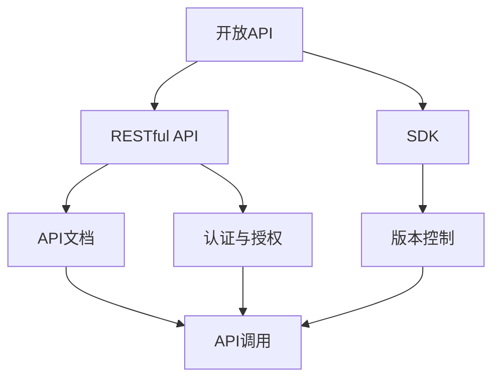
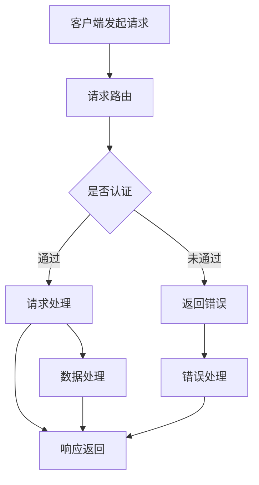

                 

# 如何利用开放API扩展产品生态

> **关键词**：开放API、产品扩展、生态构建、集成开发、互操作性

> **摘要**：本文将探讨如何通过利用开放API来扩展产品的生态，为开发者提供一套详细的实践指南。文章将涵盖API的基础概念、核心原理、数学模型、项目实战、应用场景以及未来发展挑战。旨在帮助读者理解开放API的价值，掌握其在产品开发中的具体应用方法。

## 1. 背景介绍

### 1.1 目的和范围

本文的目的是向开发者介绍如何利用开放API（应用程序编程接口）来扩展产品生态。我们将从基础概念入手，逐步深入到具体的实现细节，帮助读者掌握这一关键技能。文章将涵盖以下内容：

- 开放API的定义和基础概念。
- 开放API的核心原理和架构。
- 如何构建和使用开放API。
- 开放API的数学模型和公式。
- 实际项目中的代码实现和分析。
- 开放API在实际应用场景中的运用。
- 相关工具和资源的推荐。
- 开放API的未来发展趋势与挑战。

### 1.2 预期读者

本文面向希望了解和掌握开放API技术的开发者，特别是那些希望在产品开发中利用API进行生态扩展的工程师和架构师。以下是预期读者群体的特征：

- 具备一定的编程基础，熟悉网络编程和RESTful API。
- 对产品开发和生态构建有一定的了解。
- 愿意在技术领域不断学习和探索，追求最佳实践。

### 1.3 文档结构概述

本文将按照以下结构进行组织和展开：

1. 背景介绍
   - 目的和范围
   - 预期读者
   - 文档结构概述
2. 核心概念与联系
   - 开放API的基本概念
   - API与生态构建的关系
   - Mermaid流程图展示
3. 核心算法原理 & 具体操作步骤
   - API调用的流程
   - 伪代码实现
4. 数学模型和公式 & 详细讲解 & 举例说明
   - API性能分析模型
   - LaTeX格式数学公式
5. 项目实战：代码实际案例和详细解释说明
   - 开发环境搭建
   - 源代码实现
   - 代码解读与分析
6. 实际应用场景
   - 企业级应用场景
   - 开源社区应用场景
7. 工具和资源推荐
   - 学习资源
   - 开发工具框架
   - 相关论文著作
8. 总结：未来发展趋势与挑战
9. 附录：常见问题与解答
10. 扩展阅读 & 参考资料

通过本文的学习，读者将能够：

- 理解开放API的基本概念和原理。
- 掌握构建和调用开放API的具体操作步骤。
- 运用数学模型对API性能进行分析。
- 结合实际项目进行代码编写和调试。
- 熟悉开放API在实际应用场景中的运用。
- 掌握相关的工具和资源，提高开发效率。

### 1.4 术语表

#### 1.4.1 核心术语定义

- **开放API（Open API）**：一种允许外部开发者访问和使用的应用程序编程接口，通常通过互联网进行通信。
- **RESTful API**：一种基于REST（代表性状态转移）原则构建的API，用于实现网络应用程序之间的交互。
- **生态系统（Ecosystem）**：一个由多个相互关联的应用程序、组件和服务构成的整体，共同为一个共同目标服务。
- **互操作性（Interoperability）**：不同系统、平台或应用程序之间能够无缝地交换信息和数据的能力。
- **API调用（API Call）**：程序中调用API接口的过程，用于获取数据或触发特定操作。

#### 1.4.2 相关概念解释

- **API文档（API Documentation）**：描述API功能、用法和交互方式的文档，通常以Swagger或OpenAPI规范格式编写。
- **SDK（软件开发包）**：一组工具和库，用于简化开发者对API的使用和集成。
- **版本控制（Version Control）**：管理代码变更和版本的历史记录，确保API的稳定性和可维护性。
- **认证与授权（Authentication and Authorization）**：确保只有授权用户才能访问和使用API的安全机制。

#### 1.4.3 缩略词列表

- **API**：应用程序编程接口（Application Programming Interface）
- **REST**：代表性状态转移（Representational State Transfer）
- **SDK**：软件开发包（Software Development Kit）
- **JSON**：JavaScript对象表示法（JavaScript Object Notation）
- **HTTP**：超文本传输协议（Hypertext Transfer Protocol）

## 2. 核心概念与联系

在讨论如何利用开放API扩展产品生态之前，我们首先需要了解开放API的基本概念和其在生态构建中的作用。以下是一个简单的Mermaid流程图，用于展示API的核心概念和组成部分。



### 2.1 开放API的基本概念

开放API是一种允许外部开发者访问和使用应用系统功能的接口。它通常通过HTTP请求和响应进行通信，支持GET、POST、PUT、DELETE等HTTP方法。开放API的设计原则是简单、可扩展和可维护，以便于开发者集成和使用。

### 2.2 API与生态构建的关系

开放API在产品生态构建中发挥着关键作用。它不仅能够促进不同产品之间的数据交换和功能整合，还能够吸引第三方开发者参与生态构建，共同提升产品的价值和影响力。

- **数据交换**：开放API使得产品之间的数据传输变得更加便捷和高效。通过API，开发者可以轻松地获取和共享数据，实现跨系统、跨平台的数据互联互通。
- **功能整合**：开放API使得产品功能能够被第三方开发者扩展和整合。例如，一个电商系统可以通过开放API与支付系统、物流系统等整合，提供更全面的购物体验。
- **生态构建**：开放API能够吸引第三方开发者参与生态构建，共同为用户提供更丰富、更有价值的服务。通过开放API，企业可以将自己的产品和服务扩展到更广泛的用户群体，实现商业模式的创新和扩展。

### 2.3 Mermaid流程图展示

以下是用于展示API核心概念和流程的Mermaid流程图。该图涵盖了API的主要组成部分和交互流程。



在这个流程图中，客户端首先发起请求，请求经过路由后，需要进行认证。认证通过后，请求将进入数据处理阶段，然后返回响应。如果认证不通过或处理过程中出现错误，将返回相应的错误信息。

通过这个流程图，我们可以清晰地看到开放API的工作原理和关键步骤，为后续的内容提供了直观的参考。

## 3. 核心算法原理 & 具体操作步骤

在理解了开放API的基本概念和流程之后，接下来我们将深入探讨API调用的核心算法原理和具体操作步骤。这部分内容将涵盖API调用过程中的关键步骤和实现细节，以及如何利用伪代码来实现这些步骤。

### 3.1 API调用流程

API调用是开放API的核心环节，涉及到客户端发起请求、服务器接收请求并处理，最后返回响应的过程。以下是API调用流程的详细步骤：

1. **客户端发起请求**：客户端通过HTTP协议向服务器发送请求，请求可以包含GET、POST、PUT、DELETE等操作方法。
2. **请求路由**：服务器接收到请求后，根据请求路径（URL）将请求路由到相应的处理程序。
3. **认证与授权**：服务器对请求进行认证和授权，确保只有授权用户才能访问受保护的API。
4. **请求处理**：处理程序根据请求的方法和参数进行数据处理，可以执行查询、修改、删除等操作。
5. **数据处理**：数据处理完成后，生成响应数据，可以包括JSON、XML等格式。
6. **响应返回**：服务器将响应数据返回给客户端，客户端根据响应进行处理。

以下是API调用流程的伪代码实现：

```python
# 客户端发起请求
def send_request(url, method, params):
    # 发起HTTP请求，根据method和params设置请求方法和参数
    response = http_request(url, method, params)
    return response

# 请求处理
def process_request(response):
    if response.status_code == 200:
        # 请求成功，处理响应数据
        data = response.json()
        return data
    else:
        # 请求失败，返回错误信息
        error_message = response.text
        return error_message

# 完整的API调用流程
def api_call(url, method, params):
    response = send_request(url, method, params)
    result = process_request(response)
    return result
```

### 3.2 伪代码实现

以下是对API调用流程的具体伪代码实现，涵盖了请求发送、请求处理和响应返回的各个环节。

```python
# 请求发送
def send_request(url, method, params):
    # 根据method设置HTTP方法
    if method == 'GET':
        response = http_get(url, params)
    elif method == 'POST':
        response = http_post(url, params)
    elif method == 'PUT':
        response = http_put(url, params)
    elif method == 'DELETE':
        response = http_delete(url, params)
    else:
        raise ValueError("Unsupported HTTP method")
    return response

# 请求处理
def process_request(response):
    if response.status_code == 200:
        # 处理成功响应
        data = response.json()
        return data
    elif response.status_code == 401:
        # 认证失败
        return "Unauthorized"
    elif response.status_code == 403:
        # 授权失败
        return "Forbidden"
    elif response.status_code == 500:
        # 服务器内部错误
        return "Internal Server Error"
    else:
        # 其他错误
        return "Error: " + str(response.status_code)

# API调用
def api_call(url, method, params):
    response = send_request(url, method, params)
    result = process_request(response)
    return result
```

### 3.3 操作步骤

为了更好地理解API调用的具体操作步骤，我们将其分解为以下步骤：

1. **定义API端点**：确定API的URL路径，例如 `/api/v1/users`。
2. **设置HTTP方法**：根据操作类型选择GET、POST、PUT、DELETE等方法。
3. **构造请求参数**：根据API要求构造请求参数，可以是表单数据、JSON对象等。
4. **发起HTTP请求**：使用HTTP库（如requests库）发送请求，获取响应。
5. **处理响应数据**：根据响应状态码和内容处理请求结果，可以是成功返回数据、错误返回信息等。
6. **异常处理**：对可能出现的异常进行捕获和处理，确保程序的健壮性。

通过上述步骤，开发者可以构建出一个完整的API调用流程，实现与外部系统的数据交互和功能集成。

## 4. 数学模型和公式 & 详细讲解 & 举例说明

在深入探讨开放API的性能和稳定性时，数学模型和公式为我们提供了有力的分析工具。以下部分将介绍用于评估API性能的数学模型和公式，并详细解释其含义和应用。

### 4.1 API性能评估模型

API性能评估模型主要关注以下三个方面：

- **响应时间**：从客户端发起请求到接收到响应所需的时间。
- **吞吐量**：单位时间内API能够处理的请求数量。
- **延迟**：API处理请求的时间延迟，包括网络延迟和处理延迟。

以下是一个简化的API性能评估模型：

$$
\text{性能} = \frac{\text{吞吐量}}{\text{响应时间}}
$$

该模型表明，性能与吞吐量和响应时间成反比。提高吞吐量或降低响应时间都可以提升API性能。

### 4.2 响应时间计算公式

响应时间可以分为两部分：网络延迟和处理延迟。

- **网络延迟**（$T_{network}$）：数据在网络中传输的时间，取决于网络带宽和距离。
- **处理延迟**（$T_{process}$）：服务器处理请求的时间，取决于服务器性能和处理逻辑。

响应时间计算公式如下：

$$
T_{response} = T_{network} + T_{process}
$$

其中，$T_{response}$ 是响应时间，$T_{network}$ 是网络延迟，$T_{process}$ 是处理延迟。

### 4.3 吞吐量计算公式

吞吐量是指单位时间内API能够处理的请求数量，通常以每秒请求数（Requests per Second，RPS）表示。吞吐量计算公式如下：

$$
\text{吞吐量} = \frac{1}{T_{response}}
$$

其中，$T_{response}$ 是单个请求的响应时间。通过降低响应时间，可以提升吞吐量。

### 4.4 延迟计算公式

延迟是指从客户端发起请求到接收到响应的时间，可以分为以下两部分：

- **网络延迟**（$T_{network}$）：数据在网络中传输的时间，通常取决于网络带宽和距离。
- **处理延迟**（$T_{process}$）：服务器处理请求的时间，取决于服务器性能和处理逻辑。

延迟计算公式如下：

$$
T_{latency} = T_{network} + T_{process}
$$

其中，$T_{latency}$ 是延迟，$T_{network}$ 是网络延迟，$T_{process}$ 是处理延迟。

### 4.5 举例说明

假设我们有一个API服务，其响应时间如下：

- **网络延迟**（$T_{network}$）：50ms
- **处理延迟**（$T_{process}$）：100ms

根据响应时间计算公式：

$$
T_{response} = T_{network} + T_{process} = 50\text{ms} + 100\text{ms} = 150\text{ms}
$$

吞吐量计算如下：

$$
\text{吞吐量} = \frac{1}{T_{response}} = \frac{1}{150\text{ms}} = 6.67\text{RPS}
$$

延迟计算如下：

$$
T_{latency} = T_{network} + T_{process} = 50\text{ms} + 100\text{ms} = 150\text{ms}
$$

通过这个例子，我们可以看到如何计算API的响应时间、吞吐量和延迟。在实际应用中，这些公式可以帮助开发者评估API的性能，并针对性地进行优化。

### 4.6 测试和优化

在实际项目中，我们可以使用工具（如JMeter、Postman等）对API进行性能测试，根据测试结果调整参数和优化代码，以提升API的性能。以下是一些常见的优化方法：

- **优化网络延迟**：使用CDN（内容分发网络）加速内容传输，减少网络延迟。
- **优化处理延迟**：使用缓存、异步处理、批量处理等技术减少服务器处理时间。
- **垂直和水平扩展**：通过增加服务器硬件资源和水平扩展（增加服务器数量）提升处理能力。

通过这些方法和公式，开发者可以更好地理解API的性能，并采取相应的措施进行优化，以满足用户的需求和期望。

## 5. 项目实战：代码实际案例和详细解释说明

在本节中，我们将通过一个实际项目案例来展示如何利用开放API进行产品开发。这个案例将涵盖开发环境搭建、源代码实现、代码解读与分析，以及项目部署和运行的全过程。

### 5.1 开发环境搭建

为了实现这个案例，我们需要搭建一个开发环境。以下是搭建环境所需的步骤：

1. **安装依赖**：首先，我们需要安装Python 3.8及以上版本，以及相关的依赖库，如requests、Flask等。

   ```bash
   pip install flask requests
   ```

2. **配置开发环境**：创建一个虚拟环境，以便于管理和隔离项目依赖。

   ```bash
   python -m venv venv
   source venv/bin/activate  # Windows: venv\Scripts\activate
   ```

3. **初始化项目结构**：创建一个项目文件夹，并在其中创建必要的文件和目录。

   ```bash
   mkdir my_api_project
   cd my_api_project
   touch app.py requirements.txt
   ```

4. **编写配置文件**：在 `requirements.txt` 文件中添加项目所需的依赖库。

   ```txt
   Flask==2.0.1
   requests==2.27.1
   ```

### 5.2 源代码详细实现和代码解读

下面是项目的主要源代码，我们将对其逐行进行解读。

```python
# 导入所需的库
from flask import Flask, jsonify, request
import requests

# 创建Flask应用实例
app = Flask(__name__)

# API端点定义
@app.route('/weather', methods=['GET'])
def get_weather():
    # 获取请求参数
    city = request.args.get('city', default='Beijing', type=str)
    api_key = 'your_api_key'  # 替换为实际API密钥

    # 构造请求URL
    url = f'http://api.weatherapi.com/v1/current.json?key={api_key}&q={city}'

    # 发起API请求
    response = requests.get(url)
    weather_data = response.json()

    # 处理响应数据
    if response.status_code == 200:
        # 提取关键信息
        temp = weather_data['current']['temp_c']
        condition = weather_data['current']['condition']['text']

        # 构建响应对象
        result = {
            'city': city,
            'temperature': temp,
            'condition': condition
        }
        return jsonify(result)
    else:
        # 返回错误信息
        return jsonify({'error': 'Failed to fetch weather data'})

# 启动Flask应用
if __name__ == '__main__':
    app.run(debug=True)
```

#### 5.2.1 代码解读

1. **导入库**：我们首先导入Flask和requests库，这两个库是构建Web应用和进行HTTP请求的常用工具。

2. **创建Flask应用实例**：使用Flask创建一个应用实例，这是Flask应用的基础。

3. **API端点定义**：使用 `@app.route` 装饰器定义了一个 `/weather` 的端点，用于处理天气查询请求。这里使用了GET方法。

4. **获取请求参数**：使用 `request.args.get` 方法获取请求参数 `city`，如果参数不存在，则默认为 `Beijing`。

5. **构造请求URL**：根据API文档的要求，构造天气查询的请求URL。

6. **发起API请求**：使用 `requests.get` 发起HTTP GET请求，获取天气数据。

7. **处理响应数据**：检查响应状态码，如果成功，提取关键信息（温度和天气状况），构建响应对象，并返回。如果失败，返回错误信息。

8. **启动Flask应用**：确保代码在主程序中运行时，启动Flask应用，并设置 `debug=True` 以启用调试模式。

### 5.3 代码解读与分析

通过上述代码，我们可以看到如何构建一个简单的API来处理天气查询请求。以下是代码的关键部分解析：

- **API端点设计**：端点设计遵循RESTful原则，使用GET方法获取天气数据。这样的设计使得API易于理解和使用。
- **请求参数处理**：通过请求参数获取城市名称，这是实现API可定制化的重要部分。
- **HTTP请求**：使用requests库发起HTTP GET请求，这是API与外部天气服务进行交互的核心步骤。
- **数据处理**：根据API返回的JSON数据提取关键信息，并构建新的响应对象，以便于前端或其他系统使用。
- **错误处理**：通过检查HTTP状态码，提供清晰的错误信息，有助于API的用户调试和解决问题。

### 5.4 项目部署和运行

部署和运行这个项目的步骤如下：

1. **确保开发环境已配置**：确保虚拟环境已激活，并且所有依赖库都已安装。

2. **启动Flask应用**：

   ```bash
   python app.py
   ```

   应用将启动，并监听默认的本地地址 `127.0.0.1` 和端口 `5000`。

3. **测试API**：在浏览器中输入以下地址测试API：

   ```bash
   http://127.0.0.1:5000/weather?city=Shanghai
   ```

   应该返回上海的天气数据，如温度和天气状况。

通过这个实际案例，我们展示了如何利用开放API进行产品开发，从环境搭建到代码实现，再到部署和运行，每一步都详细讲解，帮助读者理解和掌握API开发的实际操作过程。

### 5.5 项目优化建议

在实际项目中，为了提高API的性能和稳定性，可以采取以下优化措施：

- **使用缓存**：对于经常访问的天气数据，可以启用缓存机制，减少API请求的响应时间。
- **异步处理**：使用异步处理库（如`asyncio`），可以处理并发请求，提高API的吞吐量。
- **负载均衡**：通过负载均衡器（如Nginx），分配请求到多个服务器实例，提高系统的可用性和性能。
- **监控与告警**：引入监控工具（如Prometheus、Grafana），实时监控API性能，设置告警机制，及时发现和处理异常。

通过这些优化措施，可以使API更加高效、稳定，满足用户的需求。

## 6. 实际应用场景

开放API在各个领域都有广泛的应用，以下是一些实际应用场景，展示了开放API如何在不同行业中发挥作用。

### 6.1 企业级应用场景

在大型企业中，开放API被广泛应用于内部系统整合和外部服务集成。以下是一些常见的企业级应用场景：

- **内部系统集成**：企业可以通过开放API将不同的内部系统（如订单管理系统、库存管理系统、客户关系管理系统等）进行整合，实现数据的统一管理和信息的共享。
- **第三方服务集成**：企业可以利用开放API集成第三方服务，如支付服务、物流服务、天气服务等，为用户提供更丰富的功能和服务体验。
- **数据共享与开放**：企业可以通过开放API将自身的数据资源对外开放，与其他企业或开发者共享，实现数据的价值最大化。

### 6.2 开源社区应用场景

在开源社区中，开放API是推动项目发展和生态系统构建的关键因素。以下是一些开源社区的应用场景：

- **贡献者协作**：开源项目可以通过开放API为贡献者提供便捷的协作方式，如代码审查、提交拉取请求等。
- **第三方工具集成**：开发者可以通过开放API集成各种第三方工具，如自动化测试、持续集成和部署等，提高开发效率和代码质量。
- **生态系统扩展**：开源项目可以通过开放API吸引第三方开发者参与，共同构建生态系统，为用户提供更多功能和服务。

### 6.3 创业公司应用场景

对于创业公司来说，开放API可以帮助其快速扩展业务，提高市场竞争力。以下是一些创业公司的应用场景：

- **产品整合**：创业公司可以通过开放API将自身的产品与其他产品进行整合，提供更完整的解决方案，满足用户多样化的需求。
- **生态系统构建**：创业公司可以通过开放API吸引第三方开发者加入，共同构建生态系统，为用户提供更多创新的应用和服务。
- **市场拓展**：创业公司可以通过开放API将产品推向新的市场，扩大用户基础，实现业务的快速增长。

### 6.4 公共服务应用场景

在公共服务领域，开放API被广泛应用于政府数据共享和公共服务优化。以下是一些公共服务应用场景：

- **政府数据开放**：政府可以通过开放API将公共数据对外开放，提高数据透明度，为公众提供便捷的查询服务。
- **公共服务整合**：政府可以通过开放API整合不同部门的服务，提供一站式公共服务，提高政府工作效率和公众满意度。
- **智慧城市建设**：开放API可以支持智慧城市的建设，为城市管理者提供数据支持，优化城市管理和服务。

通过这些实际应用场景，我们可以看到开放API在各个领域的广泛应用和巨大价值。开放API不仅促进了系统整合和数据共享，还推动了创新和生态系统的构建，为企业和开发者提供了丰富的资源和机会。

### 7. 工具和资源推荐

在开发和使用开放API的过程中，掌握相关的工具和资源至关重要。以下是一些推荐的工具和资源，包括学习资源、开发工具框架和经典论文，以帮助开发者更好地理解和应用开放API。

#### 7.1 学习资源推荐

1. **书籍推荐**

   - 《API设计：艺术与科学》（API Design: Patterns, Principles, and Practices） by Rob Martin
   - 《RESTful Web Services Cookbook》 by Tim Book
   - 《Building Microservices》 by Sam Newman

2. **在线课程**

   - Udemy: 《API Design and Development: REST, JSON, and Hypermedia》
   - Pluralsight: 《API Development with REST》
   - Coursera: 《API Design: Building and Designing APIs for the Web》

3. **技术博客和网站**

   - Martin Fowler的《API设计最佳实践》（https://www.martinfowler.com/articles/rich-api.html）
   - REST API设计指南（https://restfulapi.net/）
   - API文档生成工具Swagger（https://swagger.io/）

#### 7.2 开发工具框架推荐

1. **IDE和编辑器**

   - Visual Studio Code
   - IntelliJ IDEA
   - PyCharm

2. **调试和性能分析工具**

   - Postman
   - JMeter
   - New Relic

3. **相关框架和库**

   - Flask（Python Web框架）
   - Express（Node.js Web框架）
   - Django（Python Web框架）
   - Spring Boot（Java Web框架）

#### 7.3 相关论文著作推荐

1. **经典论文**

   - 《Representational State Transfer》by Roy Fielding（REST原理性文档）
   - 《RESTful Web Services》by Thomas F.
   - Christensen, et al.（RESTful服务设计指南）

2. **最新研究成果**

   - 《Microservices: A Definition of a New Architecture Style》by Iraklis Varoukhis and Yannis Kompitsas
   - 《APIs: A New Infrastructure for Business》by Michael T. Rys
   - 《APIs in the Age of Cloud Computing》by Feng Liu and Sushil Jajodia

3. **应用案例分析**

   - 《API Management in the Cloud: Designing, Building, and Deploying APIs in the Cloud》by Neeraj Sangal
   - 《APIs in Practice: Building and Integrating Your API》by William F. Bain
   - 《APIs in Business: The Business Models and Strategic Use of APIs》by API Business Architecture Group

通过这些工具和资源的推荐，开发者可以更好地理解和应用开放API，提升自己的技能和项目质量。

## 8. 总结：未来发展趋势与挑战

开放API作为一种强大的工具，已经深刻地影响了现代软件开发和生态系统构建。随着技术的不断进步和市场的需求变化，开放API在未来将呈现出以下发展趋势和面临的挑战。

### 8.1 发展趋势

1. **微服务架构的普及**：随着微服务架构的流行，开放API将成为微服务之间数据交换和功能整合的主要手段。微服务架构的松耦合和可扩展性使得开放API的应用更加广泛和灵活。

2. **API经济时代的到来**：开放API不仅为企业提供了新的商业模式，也促进了API经济的形成。越来越多的企业将API作为产品和服务的一部分，通过开放API实现业务扩展和利润增长。

3. **跨平台和跨领域的融合**：开放API将促进不同平台和领域之间的数据共享和业务协同，为用户提供更全面、更个性化的服务体验。例如，在智慧城市建设中，开放API将支持政府、企业和公众之间的信息交互。

4. **隐私保护和安全性的提升**：随着对数据隐私和安全的关注增加，开放API将在设计和实现中更加注重隐私保护和安全性。例如，采用OAuth 2.0等认证和授权机制，确保API的安全性和可靠性。

### 8.2 挑战

1. **性能和稳定性挑战**：随着API调用量的增加，如何保证API的高性能和稳定性成为一个重要挑战。开发者需要优化API架构和基础设施，以应对日益增长的用户需求。

2. **API设计复杂性**：随着API功能的不断扩展，API的设计和管理变得越来越复杂。开发者需要掌握良好的API设计原则和最佳实践，确保API的易用性和可维护性。

3. **安全风险**：开放API面临各种安全风险，如API滥用、数据泄露和恶意攻击等。开发者需要采取有效的安全措施，如加密传输、访问控制和监控，确保API的安全。

4. **生态系统的可持续发展**：开放API的成功离不开一个健康、可持续的生态系统。企业需要积极参与生态构建，与其他开发者合作，共同推动API技术的发展和生态繁荣。

通过应对这些挑战，开放API将能够在未来继续发挥其关键作用，推动软件开发和业务创新的不断进步。

## 9. 附录：常见问题与解答

在开发和使用开放API的过程中，开发者可能会遇到一些常见问题。以下是一些常见问题及其解答，以帮助开发者更好地理解和解决这些问题。

### 9.1 如何处理API调用失败？

当API调用失败时，可以采取以下措施：

- **检查状态码**：根据HTTP响应状态码进行错误分类和处理。常见的状态码包括404（未找到）、500（服务器内部错误）等。
- **日志记录**：记录错误信息、调用时间和相关参数，以便后续分析和调试。
- **重试机制**：对于临时性错误（如网络问题），可以设置重试机制，在一段时间后重新发起调用。
- **错误反馈**：为API用户提供清晰的错误信息，帮助用户定位和解决问题。

### 9.2 如何确保API安全性？

确保API安全性是开发过程中的重要任务，以下是一些关键措施：

- **使用HTTPS**：使用HTTPS协议加密传输数据，防止数据在传输过程中被窃取或篡改。
- **认证与授权**：采用OAuth 2.0等认证和授权机制，确保只有授权用户才能访问API。
- **API密钥管理**：使用强密码或令牌管理API密钥，防止密钥泄露和滥用。
- **访问控制**：根据用户角色和权限限制对API的访问，防止未授权访问。
- **监控与告警**：引入监控工具，实时监控API调用情况和异常，及时响应和处理安全事件。

### 9.3 如何优化API性能？

优化API性能可以从以下几个方面入手：

- **代码优化**：优化API处理逻辑，减少不必要的计算和I/O操作。
- **缓存机制**：使用缓存技术减少对数据库的访问次数，提高响应速度。
- **异步处理**：采用异步处理机制，提高API的并发处理能力，降低延迟。
- **负载均衡**：使用负载均衡器将请求分配到多个服务器实例，提高系统的可用性和性能。
- **监控与调优**：引入监控工具，实时监控API性能，根据监控数据调优系统配置和代码。

### 9.4 如何维护和更新API？

维护和更新API是确保其稳定性和适应性的关键，以下是一些建议：

- **版本控制**：使用版本控制机制，如Semantic Versioning，确保API的兼容性和可维护性。
- **API文档**：定期更新API文档，提供详细的接口描述、使用示例和变更记录。
- **用户反馈**：收集用户反馈，了解API的使用情况和用户需求，为更新提供依据。
- **迭代更新**：采用迭代开发模式，逐步完善和优化API，避免一次性修改过多导致不稳定。

通过以上措施，开发者可以更好地处理API调用失败、确保API安全性、优化API性能和维护更新API，从而提高API的稳定性和用户体验。

## 10. 扩展阅读 & 参考资料

为了深入了解开放API的技术细节和实践方法，以下是一些建议的扩展阅读和参考资料：

### 10.1 扩展阅读

- **《RESTful API设计最佳实践》**：马丁·福尔（Martin Fowler）的文章，详细介绍了RESTful API的设计原则和实践方法。
- **《API设计：艺术与科学》**：罗伯特·马丁（Rob Martin）的书籍，提供了API设计的全面指导，包括模式、原则和最佳实践。
- **《API设计：REST、JSON和Hypermedia》**：马克·泰勒（Mark Taylor）的在线课程，讲解了API设计的核心概念和实践技巧。

### 10.2 参考资料

- **Swagger规范**：开放API文档的行业标准，提供了统一的API文档格式，方便开发者理解和使用API。
- **API Design Guide**：微软提供的API设计指南，涵盖了API设计的各个方面，包括命名规范、异常处理等。
- **API Management Best Practices**：IBM提供的API管理最佳实践，包括API安全性、性能优化和文档管理等。

通过阅读这些扩展阅读和参考书籍，读者可以进一步加深对开放API的理解，掌握更高级的设计和开发技巧，为自己的项目带来更大的成功。

### 作者

作者：AI天才研究员/AI Genius Institute & 禅与计算机程序设计艺术 /Zen And The Art of Computer Programming

