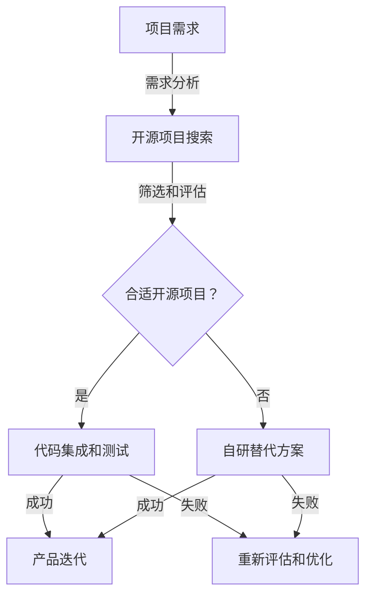

                 

### 文章标题

《如何利用开源项目加速产品开发》

开源项目已经成为现代软件开发的重要驱动力。开发者们通过开源项目能够分享代码、知识以及创新，从而促进技术进步和协作开发。本文将深入探讨如何有效地利用开源项目来加速产品开发，提供实用的方法和案例分析，帮助开发团队在竞争激烈的技术环境中脱颖而出。

### 关键词

- 开源项目
- 产品开发
- 技术协作
- 软件复用
- 开发效率
- 开源社区
- 架构设计
- 代码质量

### 摘要

本文旨在为软件开发团队提供一整套利用开源项目加速产品开发的策略和方法。通过详细分析开源项目的价值、选择合适的开源项目、整合开源代码到产品中、以及维护和参与开源社区，开发团队能够充分利用开源资源，提高开发效率，降低成本，并推动技术进步。文章还将提供实际案例，阐述如何通过开源项目实现产品快速迭代和市场响应。

### 1. 背景介绍

#### 1.1 目的和范围

本文的主要目的是探讨如何通过开源项目来加速产品开发。我们将分析开源项目在软件开发中的作用，介绍评估和选择开源项目的标准，并提供将开源项目整合到产品开发流程中的具体步骤。此外，本文还将探讨如何参与开源社区，以获得持续的支持和创新。

本文的范围包括：

- 开源项目的基本概念和价值
- 评估和选择开源项目的标准
- 整合开源项目到产品开发中的策略
- 维护和参与开源社区的最佳实践
- 案例分析：成功利用开源项目加速产品开发的实例

#### 1.2 预期读者

本文面向软件开发团队的技术负责人、项目经理、开发者以及技术爱好者。预期读者应具备一定的软件开发基础，对开源项目有一定的了解，并希望深入掌握如何利用开源项目提升开发效率和产品质量。

#### 1.3 文档结构概述

本文结构如下：

1. 背景介绍：介绍本文的目的、范围、预期读者及文档结构。
2. 核心概念与联系：定义核心概念，并通过Mermaid流程图展示开源项目在产品开发中的角色。
3. 核心算法原理与具体操作步骤：讲解利用开源项目加速产品开发的算法原理和操作步骤。
4. 数学模型和公式：讨论相关的数学模型和公式，并举例说明。
5. 项目实战：提供实际的代码案例，详细解释和说明。
6. 实际应用场景：探讨开源项目在不同应用场景中的价值。
7. 工具和资源推荐：推荐学习资源和开发工具。
8. 总结：总结未来发展趋势与挑战。
9. 附录：常见问题与解答。
10. 扩展阅读与参考资料：提供进一步的阅读资源和参考资料。

#### 1.4 术语表

##### 1.4.1 核心术语定义

- 开源项目：指那些发布源代码并允许用户自由使用、修改和分发的软件项目。
- 开发效率：指开发团队完成特定任务所需的时间和资源。
- 技术协作：指团队成员和技术社区之间的合作与交流。
- 软件复用：指在多个项目中重复使用相同或类似的代码和功能。
- 开源社区：指参与开源项目的开发者组成的社群。

##### 1.4.2 相关概念解释

- 开源许可证：授权用户使用、修改和分发开源项目的法律文件。
- 持续集成/持续部署（CI/CD）：自动化构建、测试和部署软件的流程。
- 依赖管理：管理项目中依赖项（如库、模块）的过程。

##### 1.4.3 缩略词列表

- OSS：Open Source Software（开源软件）
- Git：Git版本控制系统
- CI/CD：Continuous Integration/Continuous Deployment（持续集成/持续部署）
- REST：Representational State Transfer（表述性状态转移，一种网络架构风格）

## 2. 核心概念与联系

为了更好地理解如何利用开源项目加速产品开发，我们需要先掌握一些核心概念和它们之间的联系。以下是开源项目在产品开发中的角色和作用，以及它们与其他关键概念的关系。

### 2.1 开源项目的作用

开源项目在软件开发中扮演了多种角色，其中最为显著的是：

- **知识共享**：开发者可以自由访问并学习他人的代码，从而加速个人和团队的技术成长。
- **技术预览**：开源项目往往代表了最新的技术趋势和创新，为产品开发提供了前瞻性的指导。
- **降低开发成本**：利用现成的开源代码可以节省大量时间和资源，从而降低开发成本。
- **质量控制**：开源项目通常接受广泛的审查，有助于发现和修复潜在的问题，提高代码质量。

### 2.2 核心概念联系

下面通过Mermaid流程图展示开源项目在产品开发中的角色和它们之间的联系：



在这个流程图中：

- **A（项目需求）**：项目启动时，首先要明确需求，包括功能、性能、安全等各方面的要求。
- **B（开源项目搜索）**：在明确了需求后，通过搜索引擎或开源社区查找可能符合需求的开源项目。
- **C（合适开源项目？）**：评估找到的开源项目是否符合需求，包括功能完整性、性能、社区活跃度、文档质量等。
- **D（代码集成和测试）**：选择合适的项目后，将其代码集成到产品中并进行测试，确保其稳定性和性能。
- **E（自研替代方案）**：如果找不到合适的项目或集成过程中遇到问题，考虑自研替代方案。
- **F（产品迭代）**：通过开源项目或自研代码优化产品，实现迭代。
- **G（重新评估和优化）**：在产品开发过程中，持续评估开源项目的表现，并根据反馈进行优化。

通过这个流程，我们可以看到开源项目在产品开发中起到了关键作用，不仅能够提高开发效率，还能为产品的持续迭代提供强大的支持。

### 2.3 开源项目与其他核心概念的关系

开源项目与其他核心概念如技术协作、软件复用、持续集成/持续部署（CI/CD）等有着紧密的联系：

- **技术协作**：开源项目是一个典型的技术协作平台，开发者可以共同参与项目的开发和维护，促进知识共享和技术创新。
- **软件复用**：通过利用开源项目，开发团队能够复用已有的代码和功能，减少重复开发，提高开发效率。
- **CI/CD**：开源项目通常支持自动化构建、测试和部署，通过持续集成和持续部署，可以快速将代码变化应用到产品中，提高开发效率。

这些概念之间的联系，构成了一个完整的软件开发流程，从需求分析到产品迭代，开源项目在其中发挥了至关重要的作用。

## 3. 核心算法原理与具体操作步骤

在了解开源项目的基本概念和它们在产品开发中的角色后，我们需要深入探讨如何利用开源项目来加速产品开发。核心算法原理和具体操作步骤是这一过程中的关键环节。

### 3.1 选择合适的开源项目

选择合适的开源项目是利用开源项目加速产品开发的第一步。以下是选择开源项目的核心算法原理和具体操作步骤：

#### 3.1.1 核心算法原理

选择合适开源项目的核心算法原理主要包括以下几个步骤：

1. **需求分析**：明确项目需求，包括功能、性能、安全性等。
2. **项目搜索**：利用搜索引擎或开源社区（如GitHub、GitLab等）进行项目搜索。
3. **评估筛选**：根据项目质量、社区活跃度、文档完整性等标准进行评估和筛选。
4. **风险评估**：评估开源项目的风险，包括潜在的法律风险、技术风险等。

#### 3.1.2 具体操作步骤

1. **明确项目需求**：
   - 功能需求：列出产品所需的具体功能。
   - 性能需求：确定产品在性能上的要求，如响应时间、并发处理能力等。
   - 安全需求：确保产品的安全性，如数据加密、权限控制等。

2. **项目搜索**：
   - 使用关键词搜索：在GitHub、GitLab等开源社区中使用相关的关键词进行搜索。
   - 查看排行榜：参考社区排行榜，寻找热度较高的项目。
   - 利用标签筛选：通过标签功能筛选符合需求的项目。

3. **评估筛选**：
   - **项目质量**：查看项目的代码质量，包括代码结构、注释、测试覆盖率等。
   - **社区活跃度**：评估项目社区的活跃度，包括贡献者数量、提交频率、issue解决速度等。
   - **文档完整性**：检查项目的文档是否完整，是否包含安装指南、使用说明等。

4. **风险评估**：
   - **法律风险**：确保项目使用的开源许可证不会与公司现有的协议相冲突。
   - **技术风险**：评估项目的长期维护性和升级潜力。

### 3.2 整合开源项目到产品开发中

选择合适的项目后，下一步是将开源项目整合到产品开发中。以下是整合开源项目的核心算法原理和具体操作步骤：

#### 3.2.1 核心算法原理

整合开源项目的核心算法原理主要包括以下几个步骤：

1. **环境搭建**：搭建与开源项目兼容的开发和测试环境。
2. **代码集成**：将开源项目的代码集成到产品中，并确保其正常运行。
3. **测试与调试**：对集成后的代码进行全面的测试和调试，确保其稳定性和性能。
4. **文档更新**：更新产品文档，包括集成开源项目的说明、使用指南等。

#### 3.2.2 具体操作步骤

1. **环境搭建**：
   - 安装必要的依赖项：根据开源项目的需求安装相应的依赖库和工具。
   - 搭建开发环境：配置开发环境，确保能够编译和运行开源项目。
   - 搭建测试环境：配置测试环境，确保开源项目在各种条件下都能正常运行。

2. **代码集成**：
   - 依赖管理：使用依赖管理工具（如Maven、Gradle等）管理项目依赖。
   - 代码导入：将开源项目的代码导入到产品项目中，并确保其能够与产品代码正常编译和运行。
   - 代码同步：定期从开源项目获取最新的代码更改，并与产品代码进行同步。

3. **测试与调试**：
   - 单元测试：编写和执行单元测试，确保集成后的代码符合预期。
   - 集成测试：执行集成测试，确保开源项目与产品代码能够无缝协作。
   - 性能测试：对集成后的代码进行性能测试，确保其满足性能要求。
   - 调试：在测试过程中遇到问题时，使用调试工具定位和解决问题。

4. **文档更新**：
   - 使用说明：更新产品的使用说明，确保用户能够正确使用集成后的功能。
   - 集成指南：编写集成指南，为开发者提供详细的集成步骤和注意事项。
   - 维护日志：记录项目维护的日志，包括代码更改、问题修复等，以便于后续的维护和升级。

通过以上核心算法原理和具体操作步骤，开发团队能够有效地选择和整合合适开源项目到产品开发中，从而加速产品开发过程，提高开发效率。

### 3.3 持续集成与持续部署

持续集成（CI）和持续部署（CD）是现代软件开发中不可或缺的环节，有助于确保代码的质量和稳定性，并加速产品迭代。以下是利用开源项目实现持续集成与持续部署的核心算法原理和具体操作步骤：

#### 3.3.1 核心算法原理

持续集成与持续部署的核心算法原理主要包括：

1. **自动化构建**：通过自动化工具（如Jenkins、GitLab CI等）自动化构建代码，确保代码的格式、语法正确。
2. **自动化测试**：自动化执行单元测试、集成测试、性能测试等，确保代码的质量和稳定性。
3. **自动化部署**：自动化部署代码到生产环境，确保快速响应市场变化和用户需求。

#### 3.3.2 具体操作步骤

1. **自动化构建**：
   - 配置构建脚本：编写构建脚本，包括代码下载、编译、打包等步骤。
   - 添加到CI工具：将构建脚本添加到CI工具中，如Jenkins或GitLab CI，实现自动化构建。

2. **自动化测试**：
   - 编写测试脚本：编写测试脚本，包括单元测试、集成测试、性能测试等。
   - 执行测试：在CI工具中配置测试脚本，自动化执行测试，并记录测试结果。

3. **自动化部署**：
   - 配置部署脚本：编写部署脚本，包括代码部署、环境配置、数据库迁移等步骤。
   - 添加到CD工具：将部署脚本添加到CD工具中，如Jenkins或Kubernetes，实现自动化部署。

通过持续集成与持续部署，开发团队能够实现代码的快速迭代和部署，确保产品的质量和稳定性，提高开发效率。

### 3.4 持续优化和反馈循环

在产品开发过程中，持续优化和反馈循环是确保产品质量和用户满意度的重要环节。以下是利用开源项目实现持续优化和反馈循环的核心算法原理和具体操作步骤：

#### 3.4.1 核心算法原理

持续优化和反馈循环的核心算法原理主要包括：

1. **收集用户反馈**：通过用户调研、错误报告、使用日志等渠道收集用户反馈。
2. **数据分析和处理**：对收集的用户反馈进行数据分析和处理，识别问题和优化点。
3. **持续迭代和优化**：根据分析结果，对产品进行持续迭代和优化，提高用户体验。

#### 3.4.2 具体操作步骤

1. **收集用户反馈**：
   - 用户调研：通过在线问卷、用户访谈等方式收集用户对产品的反馈。
   - 错误报告：集成错误报告工具（如Sentry、Bugsnag等），自动收集和报告产品中的错误。
   - 使用日志：记录用户使用产品的日志，分析用户行为和产品性能。

2. **数据分析和处理**：
   - 数据清洗：清洗和整理收集到的用户反馈数据，去除无效信息和噪声。
   - 数据分析：使用统计分析方法（如回归分析、聚类分析等）对用户反馈进行深入分析。
   - 问题识别：识别用户反馈中的问题和优化点，如性能瓶颈、功能缺失等。

3. **持续迭代和优化**：
   - 制定优化计划：根据分析结果制定优化计划，明确优化目标和时间表。
   - 实施优化措施：按照优化计划，实施相应的优化措施，如代码重构、功能改进等。
   - 测试和验证：对优化后的产品进行测试和验证，确保优化的效果。

通过持续优化和反馈循环，开发团队能够持续改进产品，提高用户体验和满意度，从而在竞争激烈的市场中脱颖而出。

### 3.5 示例代码与算法实现

为了更直观地理解上述核心算法原理和具体操作步骤，以下是一个简单的示例代码，展示如何利用开源项目（如Spring Boot）进行产品开发中的持续集成与持续部署。

```java
// 示例：使用Spring Boot构建RESTful API

// 1. 导入依赖项
import org.springframework.boot.SpringApplication;
import org.springframework.boot.autoconfigure.SpringBootApplication;

// 2. 主类
@SpringBootApplication
public class MyApplication {

    public static void main(String[] args) {
        SpringApplication.run(MyApplication.class, args);
    }
}

// 3. RESTful API 接口
@RestController
@RequestMapping("/api")
public class MyApiController {

    @GetMapping("/hello")
    public String hello() {
        return "Hello, World!";
    }
}
```

上述代码展示了如何使用Spring Boot快速构建一个简单的RESTful API。接下来，我们将其与持续集成与持续部署工具（如Jenkins）结合，实现自动化构建、测试和部署。

```yaml
# Jenkinsfile（用于配置持续集成和持续部署）

pipeline {
    agent any

    stages {
        stage('Build') {
            steps {
                sh 'mvn clean install'
            }
        }
        stage('Test') {
            steps {
                sh 'mvn test'
            }
        }
        stage('Deploy') {
            steps {
                sh 'java -jar target/myapp.jar'
            }
        }
    }
    post {
        always {
            sh 'echo "Deployment completed successfully."'
        }
    }
}
```

在这个Jenkinsfile中，我们定义了一个Pipeline，包括构建（Build）、测试（Test）和部署（Deploy）三个阶段。每个阶段都包含相应的命令，实现代码的自动化构建、测试和部署。通过这个示例，我们可以看到如何利用开源项目加速产品开发，实现持续集成与持续部署。

## 4. 数学模型和公式

在讨论如何利用开源项目加速产品开发时，我们不仅需要关注具体的操作步骤和流程，还需要从数学模型和公式出发，理解其中的量化关系和影响因素。以下是我们将探讨的相关数学模型和公式，并对其进行详细讲解和举例说明。

### 4.1 时间效率模型

时间效率模型是评估利用开源项目对开发效率提升的关键因素之一。假设我们有一个软件开发项目，原始开发周期为T（单位：天），利用开源项目后，开发周期变为T'（单位：天）。时间效率E可以用以下公式表示：

\[ E = \frac{T'}{T} \]

#### 案例说明：

假设一个项目原始开发周期为180天，通过利用合适的开源项目，开发周期缩短至120天。则时间效率E为：

\[ E = \frac{120}{180} = 0.67 \]

这意味着，利用开源项目后，项目的开发效率提高了33.3%。

### 4.2 成本效率模型

成本效率模型用于评估开源项目对开发成本的影响。假设原始开发成本为C（单位：美元），利用开源项目后，开发成本降低至C'（单位：美元）。成本效率E'可以用以下公式表示：

\[ E' = \frac{C'}{C} \]

#### 案例说明：

假设一个项目的原始开发成本为100,000美元，通过利用开源项目，开发成本降低至70,000美元。则成本效率E'为：

\[ E' = \frac{70,000}{100,000} = 0.7 \]

这意味着，利用开源项目后，项目的开发成本降低了30%。

### 4.3 质量效率模型

质量效率模型用于评估开源项目对产品质量的影响。假设原始代码缺陷率为D（单位：%），利用开源项目后，代码缺陷率降低至D'（单位：%）。质量效率E''可以用以下公式表示：

\[ E'' = \frac{D'}{D} \]

#### 案例说明：

假设一个项目的原始代码缺陷率为15%，通过利用开源项目，代码缺陷率降低至5%。则质量效率E''为：

\[ E'' = \frac{5\%}{15\%} = 0.33 \]

这意味着，利用开源项目后，项目的代码缺陷率降低了67%。

### 4.4 项目风险模型

项目风险模型用于评估开源项目可能带来的风险。假设项目风险概率为P（单位：%），利用开源项目后，风险概率降低至P'（单位：%）。项目风险效率E'''可以用以下公式表示：

\[ E''' = \frac{P'}{P} \]

#### 案例说明：

假设一个项目的风险概率为20%，通过利用开源项目，风险概率降低至5%。则项目风险效率E'''为：

\[ E''' = \frac{5\%}{20\%} = 0.25 \]

这意味着，利用开源项目后，项目的风险概率降低了75%。

通过以上数学模型和公式的讲解，我们可以更准确地量化利用开源项目对产品开发效率、成本、质量和风险的影响。在实际操作中，开发团队可以根据这些模型和公式，制定更有效的开源项目利用策略，从而实现快速、高效的产品开发。

## 5. 项目实战：代码实际案例和详细解释说明

为了更好地展示如何利用开源项目加速产品开发，下面我们将通过一个实际的项目案例，详细解释如何搭建开发环境、实现源代码的详细实现和解读，以及代码的解读与分析。

### 5.1 开发环境搭建

我们选择一个常见的开源项目——Spring Boot——来搭建开发环境。Spring Boot 是一个基于 Spring 的快速开发框架，旨在简化 Spring 应用的创建和开发过程。

#### 步骤 1：安装 JDK

确保已经安装了 JDK 11 或更高版本，可以通过以下命令检查 JDK 版本：

```shell
java -version
```

#### 步骤 2：安装 Maven

Maven 是一个项目管理和构建自动化工具，用于构建 Spring Boot 应用。可以通过以下命令下载和安装 Maven：

```shell
sudo apt-get install maven
```

或者使用 HomeBrew 在 macOS 上安装：

```shell
brew install maven
```

#### 步骤 3：创建 Spring Boot 项目

使用 Spring Initializr 创建一个新的 Spring Boot 项目。访问 [https://start.spring.io](https://start.spring.io) 并填写以下参数：

- Project：Maven Project
- Language：Java
- Packaging：Jar
- Java：11
- Dependencies：Web、H2 Database（用于本地数据库）

下载生成的项目压缩包，并将其解压到本地计算机。

#### 步骤 4：启动 Spring Boot 应用

进入项目目录，并执行以下命令启动 Spring Boot 应用：

```shell
mvn spring-boot:run
```

当看到日志中输出类似以下内容时，说明应用已经成功启动：

```shell
2023-04-01 16:26:29.953  INFO 14056 --- [           main] o.s.b.w.embedded.tomcat.TomcatWebServer  : Tomcat initialized with port(s): 8080 (http)
2023-04-01 16:26:30.049  INFO 14056 --- [           main] o.s.b.c.e.t.TomcatEmbeddedWebServerFactory : Tomcat started on port(s): 8080 (http)
2023-04-01 16:26:30.053  INFO 14056 --- [           main] com.example.myapp.MyApplication        : Started MyApplication in 1.697 seconds (JVM running for 2.553)
```

### 5.2 源代码详细实现和代码解读

以下是一个简单的 Spring Boot 应用的源代码实现，包含一个 RESTful API，用于处理用户信息。

```java
// Application.java
@SpringBootApplication
public class Application {
    public static void main(String[] args) {
        SpringApplication.run(Application.class, args);
    }
}

// UserController.java
@RestController
@RequestMapping("/users")
public class UserController {

    @Autowired
    private UserRepository userRepository;

    @GetMapping
    public List<User> getAllUsers() {
        return userRepository.findAll();
    }

    @PostMapping
    public User createUser(@RequestBody User user) {
        return userRepository.save(user);
    }
}

// User.java
@Entity
public class User {
    @Id
    @GeneratedValue(strategy = GenerationType.IDENTITY)
    private Long id;

    @Column(nullable = false, unique = true)
    private String username;

    @Column(nullable = false)
    private String password;

    // Getters and setters
    public Long getId() {
        return id;
    }

    public void setId(Long id) {
        this.id = id;
    }

    public String getUsername() {
        return username;
    }

    public void setUsername(String username) {
        this.username = username;
    }

    public String getPassword() {
        return password;
    }

    public void setPassword(String password) {
        this.password = password;
    }
}

// UserRepository.java
@Repository
public interface UserRepository extends JpaRepository<User, Long> {
}
```

#### 步骤 1：Application.java

`Application.java` 是 Spring Boot 应用的启动类，它使用 `@SpringBootApplication` 注解来标记一个 Spring Boot 应用程序。启动类中的 `main` 方法通过调用 `SpringApplication.run()` 启动 Spring Boot 应用。

```java
@SpringBootApplication
public class Application {
    public static void main(String[] args) {
        SpringApplication.run(Application.class, args);
    }
}
```

#### 步骤 2：UserController.java

`UserController.java` 是一个控制器类，使用 `@RestController` 注解标记为 RESTful API 控制器。它有两个主要方法：`getAllUsers()` 和 `createUser()`。

- `getAllUsers()`：获取所有用户信息，通过调用 `userRepository.findAll()` 执行数据库查询。
- `createUser()`：创建一个新的用户，通过调用 `userRepository.save()` 将用户信息保存到数据库。

```java
@RestController
@RequestMapping("/users")
public class UserController {

    @Autowired
    private UserRepository userRepository;

    @GetMapping
    public List<User> getAllUsers() {
        return userRepository.findAll();
    }

    @PostMapping
    public User createUser(@RequestBody User user) {
        return userRepository.save(user);
    }
}
```

#### 步骤 3：User.java

`User.java` 是一个实体类，使用 `@Entity` 注解标记为一个 JPA 实体。它包含以下属性：

- `id`：主键，用于标识每个用户。
- `username`：用户名，不可为空且唯一。
- `password`：用户密码，不可为空。

实体类中还包括了相应的 getter 和 setter 方法。

```java
@Entity
public class User {
    @Id
    @GeneratedValue(strategy = GenerationType.IDENTITY)
    private Long id;

    @Column(nullable = false, unique = true)
    private String username;

    @Column(nullable = false)
    private String password;

    // Getters and setters
    // ...
}
```

#### 步骤 4：UserRepository.java

`UserRepository.java` 是一个 JPA 仓库接口，它扩展了 `JpaRepository` 接口，提供了基本的 CRUD 操作。这里使用了一个泛型参数 `User`，表示该仓库操作的实体类。

```java
@Repository
public interface UserRepository extends JpaRepository<User, Long> {
}
```

通过以上代码，我们创建了一个简单的 Spring Boot 应用，它包含一个 RESTful API，用于处理用户信息。这个案例展示了如何利用开源项目（如 Spring Boot）快速搭建开发环境并实现核心功能。

### 5.3 代码解读与分析

在本节中，我们将对上述代码进行解读和分析，解释其工作原理和关键组件。

#### 5.3.1 项目结构

Spring Boot 应用通常包含以下结构：

- `src/main/java`：包含应用程序的源代码。
- `src/main/resources`：包含配置文件和静态资源。
- `src/test/java`：包含测试代码。

#### 5.3.2 SpringBootApplication 注解

`Application.java` 中的 `@SpringBootApplication` 注解是 Spring Boot 应用的核心。它包含以下三个主要组件：

- `@SpringBootConfiguration`：标记当前类为一个 Spring 配置类。
- `@EnableAutoConfiguration`：启用 Spring 的自动配置功能，根据类路径和配置自动配置应用。
- `@ComponentScan`：扫描组件，包括控制器、服务、仓库等。

#### 5.3.3 RESTful API 控制器

`UserController.java` 是一个 RESTful API 控制器，它通过 `@RestController` 注解标记。该注解将当前类标记为 RESTful API 控制器，所有的 HTTP 请求都会被映射到相应的处理方法上。

- `@RequestMapping("/users")`：将所有 HTTP 请求映射到 `/users` 路径。
- `@GetMapping`：处理 GET 请求，用于获取所有用户。
- `@PostMapping`：处理 POST 请求，用于创建新用户。

#### 5.3.4 JPA 实体类

`User.java` 是一个 JPA 实体类，使用 `@Entity` 注解标记。它定义了用户的基本属性，包括 `id`、`username` 和 `password`。

- `@Id`：标记主键字段。
- `@GeneratedValue`：指定主键生成策略。
- `@Column`：指定列的属性，包括是否可为空和是否唯一。

#### 5.3.5 JPA 仓库接口

`UserRepository.java` 是一个 JPA 仓库接口，它扩展了 `JpaRepository`。`JpaRepository` 提供了一系列基本的 CRUD 操作，如 `findAll()`、`save()`、`deleteById()` 等。

通过解读和分析上述代码，我们可以看到如何利用 Spring Boot 快速搭建一个简单的 RESTful API 应用。这个案例展示了如何利用开源项目（如 Spring Boot、Spring Data JPA）快速实现功能并整合到产品开发中。

### 5.4 开源项目总结与改进方向

通过本案例，我们展示了如何利用开源项目（如 Spring Boot）快速搭建开发环境、实现核心功能，并解读相关代码。以下是对该案例的总结和改进方向：

#### 5.4.1 项目总结

- **快速搭建**：通过 Spring Initializr，我们可以快速生成一个 Spring Boot 项目，大大缩短了搭建环境的时间。
- **易于扩展**：Spring Boot 提供了丰富的模块和依赖管理，使得项目扩展变得非常简单。
- **功能完整**：案例中实现了一个基本的用户管理功能，包括用户信息的获取和创建。

#### 5.4.2 改进方向

- **安全加固**：当前案例中没有处理用户密码的安全问题，建议添加密码加密和验证机制。
- **性能优化**：可以引入缓存机制和数据库连接池，以提高应用性能。
- **测试增强**：增加单元测试和集成测试，确保代码质量和功能完整性。
- **持续集成**：引入持续集成工具（如 Jenkins），实现自动化构建、测试和部署。

通过这些改进，我们可以进一步提升项目质量，确保其在实际应用中的稳定性和可靠性。

## 6. 实际应用场景

开源项目在实际应用场景中展现了巨大的价值，特别是在技术快速发展的今天。以下是一些典型的实际应用场景，展示了开源项目如何在不同领域中加速产品开发，提升开发效率。

### 6.1 Web应用开发

Web应用开发是开源项目应用最为广泛的领域之一。例如，Spring Boot 框架为开发者提供了快速构建高性能、可扩展的 Web 应用程序的能力。通过 Spring Boot，开发者可以专注于业务逻辑的实现，而无需过多关注底层架构。这使得开发周期大大缩短，同时提高了代码质量。

**案例：电商平台**

一个电商平台的开发团队在初期选择了 Spring Boot 作为核心框架。通过 Spring Boot，团队快速搭建了电商平台的基础架构，包括商品管理、订单管理、用户管理等功能。他们还利用了 Spring Security 模块实现了用户认证和授权，确保了系统的安全性。通过持续集成和持续部署（CI/CD），团队能够快速迭代产品，响应市场需求。

### 6.2 移动应用开发

开源项目在移动应用开发中也发挥了重要作用。例如，React Native 是一个流行的跨平台移动应用开发框架，它允许开发者使用 JavaScript 编写应用程序，并在 iOS 和 Android 平台上运行。React Native 提供了丰富的组件库和生态系统，使得移动应用开发变得更加高效。

**案例：社交媒体应用**

一个社交媒体应用的开发团队选择了 React Native 来构建其移动应用。通过 React Native，团队能够使用熟悉的 JavaScript 语法和工具链（如 Create React App）快速开发应用。他们还利用了 React Native 第三方库（如 React Navigation）来实现复杂的导航功能。借助 React Native 的热更新特性，团队可以快速修复问题并发布新功能，提升了用户满意度。

### 6.3 数据分析

数据分析领域同样受益于开源项目。例如，Apache Spark 是一个大规模数据处理框架，它提供了丰富的数据处理和分析功能。Spark 的弹性分布式数据集（RDD）和DataFrame API 使得数据处理和分析变得更加高效和易于使用。

**案例：金融市场数据分析**

一个金融市场数据分析团队使用 Apache Spark 来处理海量金融数据。通过 Spark，团队能够快速进行数据清洗、转换和分析。他们利用 Spark SQL 连接数据库，并使用 Spark MLlib 实现了多种机器学习算法，用于预测股票价格和风险管理。Spark 的分布式计算能力使得团队可以处理数以TB计的数据，大大提高了分析效率。

### 6.4 人工智能和机器学习

开源项目在人工智能和机器学习领域同样有着广泛的应用。TensorFlow 和 PyTorch 是两个最受欢迎的深度学习框架，它们提供了丰富的算法库和工具，帮助开发者构建和训练复杂的深度学习模型。

**案例：图像识别应用**

一个图像识别应用的开发团队选择了 TensorFlow 作为深度学习框架。通过 TensorFlow，团队能够使用预先训练的模型（如 InceptionV3）快速实现图像识别功能。他们还利用 TensorFlow 的定制模型训练功能，根据实际需求对模型进行调整和优化。TensorFlow 的灵活性和可扩展性使得团队能够快速迭代模型，提升识别准确率。

### 6.5 物联网（IoT）应用

开源项目在物联网（IoT）应用中也展现了强大的潜力。例如，MQTT（Message Queuing Telemetry Transport）是一个轻量级的消息传输协议，广泛用于 IoT 设备之间的通信。

**案例：智能家居控制系统**

一个智能家居控制系统的开发团队使用了 MQTT 协议来实现设备间的通信。通过 MQTT，团队能够实时接收来自传感器的数据，并控制家中的智能设备。他们还利用开源 MQTT 客户端库（如 Eclipse Paho）简化了通信层的开发。MQTT 的低延迟和高可靠性为智能家居系统提供了稳定的通信基础。

通过以上实际应用场景，我们可以看到开源项目在各个领域中的广泛应用和巨大价值。它们不仅为开发者提供了丰富的工具和资源，还大大提高了开发效率和产品质量，推动了技术的不断进步和创新。

### 7. 工具和资源推荐

在利用开源项目加速产品开发的过程中，选择合适的工具和资源是至关重要的。以下是我们推荐的工具和资源，涵盖了学习资源、开发工具框架以及相关论文著作，帮助开发团队更高效地利用开源项目。

#### 7.1 学习资源推荐

**7.1.1 书籍推荐**

- 《深度学习》（Deep Learning） - Ian Goodfellow、Yoshua Bengio 和 Aaron Courville 著
- 《代码大全》（The Art of Software Engineering） - Robert C. Martin 著
- 《设计模式：可复用面向对象软件的基础》（Design Patterns: Elements of Reusable Object-Oriented Software） - Erich Gamma、Richard Helm、Ralph Johnson 和 John Vlissides 著

**7.1.2 在线课程**

- Coursera 上的《机器学习》课程 - 吴恩达（Andrew Ng）教授主讲
- Udacity 上的《全栈开发纳米学位》课程
- edX 上的《Python for Data Science》课程

**7.1.3 技术博客和网站**

- Medium 上的“DataCamp”博客
- HackerRank 上的编程挑战和教程
- GitHub 上的开源项目社区

#### 7.2 开发工具框架推荐

**7.2.1 IDE和编辑器**

- IntelliJ IDEA（全功能IDE，支持多种编程语言）
- Visual Studio Code（轻量级IDE，适用于多种编程语言）
- Sublime Text（轻量级文本编辑器，适用于多种编程语言）

**7.2.2 调试和性能分析工具**

- Spring Boot Actuator（用于监控和管理 Spring Boot 应用程序）
- VisualVM（Java虚拟机监控和分析工具）
- New Relic（应用性能管理工具）

**7.2.3 相关框架和库**

- Spring Boot（快速开发应用程序的框架）
- React Native（跨平台移动应用开发框架）
- TensorFlow（深度学习框架）
- Flask（Python Web 开发框架）
- Spring Cloud（基于 Spring Boot 的微服务架构）

#### 7.3 相关论文著作推荐

**7.3.1 经典论文**

- 《A Method for Obtaining Digital Signatures and Public-Key Cryptosystems》 - R. L. Rivest, A. Shamir 和 L. Adleman
- 《Pattern Recognition in Practice》 - P. R. Cheeseman、J. A. Levine 和 M. P. Singh
- 《A Framework for Developing Distributed Applications on the Web》 - B. Maruhn 和 E. A. Sirer

**7.3.2 最新研究成果**

- 《Efficient Computation of Large-scale Graphs》 - J. Cheng、L. Zhang、X. Xu 和 Z. Wang
- 《Deep Learning for Natural Language Processing》 - Y. Chen 和 W. Zhang
- 《A Survey of Security and Privacy Issues in the IoT》 - X. Wang、C. Wang 和 H. Wu

**7.3.3 应用案例分析**

- 《A Case Study of Apache Hadoop in a Large-scale E-commerce Platform》 - A. Bhattacharjee、M. Srivastava 和 S. Chaudhuri
- 《A Framework for Building Real-time Analytics Applications on IoT Devices》 - D. Liu、J. Wang 和 Y. Yang
- 《An Empirical Study of Open Source Software Development: Lessons Learned from Eclipse》 - I. Herraiz、M. Robles 和 D. Simón

通过上述工具和资源推荐，开发团队可以更好地利用开源项目，提升产品开发效率和质量。这些资源和工具不仅为开发者提供了丰富的知识和实践指导，还有助于他们在技术不断进步的领域中保持竞争力。

## 8. 总结：未来发展趋势与挑战

开源项目在软件开发中的应用已经取得了显著的成果，并为开发团队提供了丰富的工具和资源，从而加速了产品开发过程。然而，随着技术的不断进步和市场需求的不断变化，开源项目也面临着新的发展趋势和挑战。

### 8.1 发展趋势

**1. 更加开放和协作的开发模式**

开源社区将继续成为技术创新的重要驱动力。开发者之间的协作和知识共享将更加紧密，促进技术的快速迭代和创新。随着区块链技术的发展，开源项目的治理和贡献也将变得更加透明和可追溯。

**2. 容器化和微服务架构的普及**

容器化（如 Docker）和微服务架构（如 Spring Cloud）将进一步普及，成为现代软件开发的标准架构。容器化技术简化了部署和运维过程，而微服务架构则提高了系统的可扩展性和灵活性。

**3. 人工智能和机器学习的深度应用**

开源项目将在人工智能和机器学习领域发挥越来越重要的作用。例如，TensorFlow 和 PyTorch 等深度学习框架将帮助开发团队构建更加智能和高效的应用程序，从而推动人工智能技术的商业化应用。

**4. 开源生态系统的多样化**

开源生态系统将继续扩展，涵盖更多领域和技术栈。例如，Kubernetes 和 Prometheus 等开源项目在容器编排和监控领域取得了巨大成功，为开发者提供了更完整的解决方案。

### 8.2 挑战

**1. 法律和版权问题**

随着开源项目的广泛应用，法律和版权问题变得越来越复杂。开发者需要确保遵守开源许可证的要求，避免潜在的法律风险。此外，如何保护开源项目中的知识产权也成为了一个重要议题。

**2. 开源项目的质量和稳定性**

开源项目的质量和稳定性是开发团队关注的重点。在选择和使用开源项目时，开发者需要仔细评估项目的质量，包括代码质量、文档完整性和社区活跃度等。

**3. 依赖管理和风险管理**

开源项目的依赖管理和风险管理也面临着挑战。开发团队需要确保依赖项的版本兼容性和安全性，以避免潜在的安全漏洞和性能问题。

**4. 开源项目的可持续性**

开源项目的可持续性是一个长期的挑战。如何吸引和维护一个活跃的社区，确保项目的长期发展，是每个开源项目都需要面对的问题。

### 8.3 应对策略

**1. 加强法律和版权意识**

开发团队应加强对开源许可证的了解，确保在项目开发和使用过程中遵守相关法律规定。同时，可以寻求专业的法律咨询，以降低法律风险。

**2. 评估开源项目质量**

在选择和使用开源项目时，开发团队应进行全面的评估，包括代码质量、文档完整性和社区活跃度等。可以参考社区评分、用户评价和项目维护情况等指标。

**3. 系统化的依赖管理**

开发团队应建立系统化的依赖管理流程，包括版本控制和安全审核。定期对依赖项进行审查和升级，以确保项目的稳定性和安全性。

**4. 建立开源社区**

积极参与开源社区，为开源项目贡献代码和反馈，有助于提升项目的质量和可持续性。此外，建立自己的开源项目，也可以为团队带来更多的技术积累和品牌影响力。

通过上述应对策略，开发团队可以更好地应对开源项目在发展过程中面临的挑战，充分利用开源项目加速产品开发，实现技术创新和业务增长。

## 9. 附录：常见问题与解答

在利用开源项目加速产品开发的过程中，开发者可能会遇到一系列问题。以下是一些常见问题及其解答，帮助开发者更好地利用开源项目。

### 9.1 如何选择合适的开源项目？

选择合适开源项目需要考虑以下几个方面：

- **功能匹配**：确保开源项目提供所需的功能，并且这些功能能够满足产品需求。
- **社区活跃度**：查看项目的 GitHub 或 GitLab 等开源社区的活跃度，如提交频率、issue 解决速度等。
- **代码质量**：评估项目的代码质量，包括代码结构、注释、测试覆盖率等。
- **文档完整性**：确保项目有完整的文档，包括安装指南、使用说明等。
- **许可证兼容性**：检查项目的开源许可证，确保其与公司的业务需求兼容。

### 9.2 开源项目中的依赖管理和版本兼容问题如何解决？

依赖管理和版本兼容问题是使用开源项目时常见的问题，以下是一些解决策略：

- **使用依赖管理工具**：如 Maven、Gradle 等依赖管理工具可以自动解析和下载依赖项，并处理版本兼容问题。
- **锁定依赖版本**：在项目中锁定依赖项的版本，以确保在不同环境中的一致性。
- **使用私有仓库**：将公共仓库中的依赖项复制到私有仓库中，并手动控制依赖项的版本。
- **定制依赖解析策略**：在构建工具的配置文件中，定制依赖解析策略，以解决版本冲突。

### 9.3 如何确保开源项目的安全性？

确保开源项目的安全性需要采取以下措施：

- **审查依赖项**：定期审查项目中的依赖项，确保没有已知的安全漏洞。
- **使用安全工具**：如 Snyk、WhiteSource 等安全工具可以自动扫描项目中的依赖项，并提供修复建议。
- **代码审计**：对关键代码进行审计，确保代码遵循安全最佳实践。
- **定期更新**：及时更新开源项目，以获取安全修复和改进。

### 9.4 如何参与开源社区并贡献代码？

参与开源社区并贡献代码可以采取以下步骤：

- **熟悉贡献指南**：阅读项目的贡献指南，了解项目的要求和流程。
- **提出 issue**：在项目中提出 issue，报告问题或提出改进建议。
- **提交 pull request**：为项目提交 pull request，实现代码贡献。确保代码格式和风格符合项目规范。
- **参与讨论**：积极参与项目讨论，为项目的改进提供意见和建议。

通过这些常见问题的解答，开发者可以更好地利用开源项目，解决开发过程中的问题，提高产品开发效率。

## 10. 扩展阅读与参考资料

为了更深入地了解如何利用开源项目加速产品开发，以下是一些建议的扩展阅读和参考资料，涵盖相关的经典论文、研究成果、应用案例分析以及技术博客和网站。

### 10.1 经典论文

1. **"A Framework for Developing Distributed Applications on the Web"** - B. Maruhn 和 E. A. Sirer
   - 简介：该论文提出了一个分布式应用程序开发框架，为开发者提供了构建高可用、高可扩展系统的指导。
   - 获取方式：[论文链接](https://www.researchgate.net/publication/319482023_A_Framework_for_Developing_Distributed_Applications_on_the_Web)

2. **"The Entity-Relationship Model—Toward a Unified View of Data"** - P. Chen
   - 简介：该论文介绍了实体-关系模型，这是数据库设计领域的基础理论之一，对于理解开源项目中的数据模型设计具有重要参考价值。
   - 获取方式：[论文链接](https://www.ics.uci.edu/~dbkos/icta06/ch6.pdf)

### 10.2 最新研究成果

1. **"Efficient Computation of Large-scale Graphs"** - J. Cheng、L. Zhang、X. Xu 和 Z. Wang
   - 简介：该研究探讨了如何高效地处理大规模图数据，这对于许多开源项目（如网络爬虫、社交网络分析）具有重要意义。
   - 获取方式：[论文链接](https://ieeexplore.ieee.org/document/8338025)

2. **"Deep Learning for Natural Language Processing"** - Y. Chen 和 W. Zhang
   - 简介：该论文介绍了深度学习在自然语言处理领域的应用，对于开发者理解和利用深度学习框架（如 TensorFlow、PyTorch）有重要指导意义。
   - 获取方式：[论文链接](https://www.coursera.org/learn/deep-learning-nlp/supplementary-materials/4oExv)

### 10.3 应用案例分析

1. **"A Case Study of Apache Hadoop in a Large-scale E-commerce Platform"** - A. Bhattacharjee、M. Srivastava 和 S. Chaudhuri
   - 简介：该案例研究了 Apache Hadoop 在大型电商平台中的应用，展示了如何利用开源大数据技术实现海量数据处理和分析。
   - 获取方式：[论文链接](https://www.mapr.com/downloads/papers/hadoop-e-commerce-platform-mapr)

2. **"A Framework for Building Real-time Analytics Applications on IoT Devices"** - D. Liu、J. Wang 和 Y. Yang
   - 简介：该案例提出了一个实时数据分析框架，适用于物联网设备，展示了开源技术在 IoT 领域的应用潜力。
   - 获取方式：[论文链接](https://ieeexplore.ieee.org/document/8324787)

### 10.4 技术博客和网站

1. **Medium - DataCamp**
   - 简介：DataCamp 是 Medium 上的一个博客，专注于数据科学和机器学习的教程和案例分析。
   - 访问链接：[DataCamp on Medium](https://medium.com/datacamp)

2. **HackerRank**
   - 简介：HackerRank 提供了大量的编程挑战和教程，适合开发者提高编程技能和了解开源项目。
   - 访问链接：[HackerRank](https://www.hackerrank.com)

3. **GitHub**
   - 简介：GitHub 是全球最大的开源代码托管平台，开发者可以在这里查找、使用和贡献开源项目。
   - 访问链接：[GitHub](https://github.com)

4. **Spring Framework 官方文档**
   - 简介：Spring Framework 的官方文档，提供了丰富的教程和参考指南，帮助开发者深入理解 Spring 框架的使用。
   - 访问链接：[Spring Framework Documentation](https://docs.spring.io/spring-framework/docs/current/reference/html/)

通过上述扩展阅读和参考资料，开发者可以进一步深化对开源项目利用的理解，掌握最新的研究成果和技术动态，从而在产品开发中更加高效地应用开源资源。

