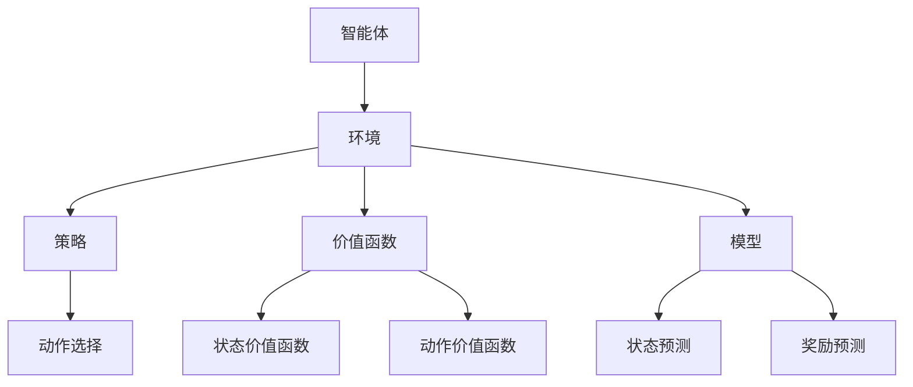

                 

### 1. 背景介绍

#### 1.1 目的和范围

本文旨在探讨如何利用强化学习（Reinforcement Learning, RL）这一先进的人工智能技术来优化产品功能。强化学习是一种机器学习范式，主要研究的是如何通过智能体（agent）与环境的交互，从奖励信号中学习到最优策略（policy），从而实现目标。在实际应用中，强化学习已被广泛应用于游戏、推荐系统、机器人控制等领域，并在这些领域中取得了显著的效果。

本文将围绕以下几个核心问题展开：

1. 强化学习的基本概念和原理；
2. 如何将强化学习应用于产品功能优化；
3. 强化学习的具体实现步骤；
4. 强化学习在产品功能优化中的实际应用案例；
5. 强化学习面临的挑战和未来发展趋势。

本文的读者对象主要是对人工智能和强化学习有一定了解的工程师、研究人员和产品经理，希望通过对本文的阅读，能够深入理解强化学习在产品功能优化中的潜力，并学会如何将其应用于实际项目中。

#### 1.2 预期读者

本文预期读者主要包括以下几类：

1. **人工智能工程师**：对强化学习有浓厚兴趣，希望深入了解其在产品功能优化中的应用；
2. **产品经理**：希望通过技术手段提升产品性能，了解强化学习如何为其所用；
3. **研究人员**：对强化学习理论和实践有深入研究的学者，希望通过本文对相关应用场景有更全面的认识；
4. **计算机科学学生**：对人工智能领域感兴趣，希望通过本文了解强化学习在实际应用中的价值。

#### 1.3 文档结构概述

本文将按照以下结构进行组织：

1. **背景介绍**：介绍强化学习的基本概念和应用背景；
2. **核心概念与联系**：阐述强化学习的关键概念和架构，使用Mermaid流程图进行描述；
3. **核心算法原理 & 具体操作步骤**：详细讲解强化学习的算法原理和操作步骤，使用伪代码进行阐述；
4. **数学模型和公式 & 详细讲解 & 举例说明**：介绍强化学习的数学模型，使用LaTeX格式书写，并进行具体案例说明；
5. **项目实战：代码实际案例和详细解释说明**：通过实际代码案例，展示强化学习在产品功能优化中的具体应用；
6. **实际应用场景**：探讨强化学习在产品功能优化中的实际应用场景；
7. **工具和资源推荐**：推荐相关的学习资源和开发工具；
8. **总结：未来发展趋势与挑战**：总结强化学习在产品功能优化中的应用现状，探讨未来发展趋势和面临的挑战；
9. **附录：常见问题与解答**：解答读者可能遇到的一些常见问题；
10. **扩展阅读 & 参考资料**：提供进一步阅读的相关资源和参考文献。

#### 1.4 术语表

为了确保本文的可读性和专业性，以下是本文中涉及的一些核心术语和概念的定义：

##### 1.4.1 核心术语定义

- **强化学习（Reinforcement Learning）**：一种机器学习范式，智能体通过与环境的交互，从奖励信号中学习到最优策略，以实现预期目标。
- **策略（Policy）**：智能体在特定状态下选择行为的规则或函数。
- **值函数（Value Function）**：衡量智能体在特定状态下采取特定策略所能获得的长期奖励。
- **Q学习（Q-Learning）**：一种基于值函数的强化学习算法，通过更新Q值表来学习最优策略。
- **深度强化学习（Deep Reinforcement Learning）**：将深度学习与强化学习相结合，用于解决复杂环境中的问题。
- **经验回放（Experience Replay）**：一种增强学习算法中的技巧，用于缓解样本相关性，提高学习效果。
- **奖励机制（Reward Mechanism）**：环境中用来评价智能体行为的激励或反馈。

##### 1.4.2 相关概念解释

- **环境（Environment）**：智能体所处的世界，可以看作是一个状态空间和动作空间的组合。
- **状态（State）**：描述环境当前状态的变量或集合。
- **动作（Action）**：智能体可执行的操作或决策。
- **探索（Exploration）**：智能体在未知环境中尝试新的动作或策略的过程。
- **利用（Exploitation）**：智能体基于当前学到的知识，选择最优动作或策略的过程。
- **收敛（Convergence）**：智能体的策略或值函数逐渐接近最优解的过程。

##### 1.4.3 缩略词列表

- **RL**：强化学习（Reinforcement Learning）
- **Q-Learning**：Q学习（Q-Learning）
- **DRL**：深度强化学习（Deep Reinforcement Learning）
- **MCTS**：蒙特卡洛树搜索（Monte Carlo Tree Search）

通过上述背景介绍，我们为读者搭建了一个强化学习在产品功能优化中应用的理论框架，接下来将逐步深入探讨强化学习的基本概念、算法原理、数学模型以及实际应用，以期为大家提供一份全面、系统的学习指南。在接下来的章节中，我们将通过逐步分析推理的方式，详细解释强化学习的各个组成部分和关键步骤，帮助读者更好地理解和掌握这一先进的人工智能技术。### 2. 核心概念与联系

#### 2.1 强化学习的基本概念

强化学习是一种使智能体在与环境交互的过程中，通过学习获得最佳行为策略的机器学习范式。在强化学习中，主要涉及以下几个核心概念：

- **智能体（Agent）**：执行特定任务并接收环境反馈的实体。
- **环境（Environment）**：智能体所处的环境，可以看作是一个状态空间和动作空间的组合。
- **状态（State）**：描述环境当前状态的变量或集合。
- **动作（Action）**：智能体可执行的操作或决策。
- **奖励（Reward）**：环境对智能体动作的即时反馈，用于评价智能体的行为。
- **策略（Policy）**：智能体在特定状态下选择行为的规则或函数。
- **价值函数（Value Function）**：衡量智能体在特定状态下采取特定策略所能获得的长期奖励。
- **模型（Model）**：对环境的动态和奖励分布的描述。

强化学习过程可以简单概括为：智能体根据当前状态选择动作，执行动作后获得奖励和新的状态，然后更新策略或价值函数，以期望在未来获得更多的奖励。这一过程不断迭代，直到智能体的策略或价值函数达到预定的收敛条件。

#### 2.2 强化学习的架构与联系

强化学习的架构如图1所示，主要包括以下几个部分：

1. **智能体（Agent）**：智能体负责选择动作、执行动作、接收奖励和更新策略。
2. **环境（Environment）**：环境为智能体提供当前状态和新的状态，以及奖励信号。
3. **策略（Policy）**：策略是智能体在特定状态下选择动作的规则，通常用概率分布来表示。
4. **价值函数（Value Function）**：价值函数用于评估智能体在特定状态下采取特定策略所能获得的长期奖励，分为状态价值函数和动作价值函数。
5. **模型（Model）**：模型是对环境的动态和奖励分布的描述，用于预测未来的状态和奖励。

图1：强化学习架构



#### 2.3 强化学习的分类

强化学习可以分为以下几种主要类型：

1. **基于值函数的强化学习**：如Q学习、SARSA等，通过学习状态-动作价值函数来指导智能体的行动。
2. **基于策略的强化学习**：如策略梯度方法、REINFORCE等，直接优化策略的参数，以最大化长期奖励。
3. **模型强化学习**：如模型预测控制、DQN等，结合模型预测和强化学习，提高学习效率和效果。
4. **深度强化学习**：将深度学习与强化学习相结合，用于解决复杂环境中的问题，如Deep Q Network（DQN）、深度确定性策略梯度（DDPG）等。

#### 2.4 强化学习的联系与作用

强化学习在产品功能优化中的应用，主要依赖于其核心概念和算法原理。具体来说：

1. **智能体与产品功能**：智能体可以看作是产品的一部分，其任务是优化产品功能。通过不断与用户交互，智能体可以学习用户的偏好和行为模式，从而调整产品功能，提高用户体验。
2. **环境与用户反馈**：环境可以看作是用户和产品之间的交互渠道，用户的反馈是环境对智能体的奖励信号。智能体根据用户的反馈，调整策略，优化产品功能。
3. **策略与功能调整**：策略是智能体的行动规则，用于指导产品功能调整。通过学习用户的反馈，智能体可以逐步优化策略，实现产品功能的持续改进。
4. **价值函数与优化目标**：价值函数用于评估智能体在特定状态下采取特定策略所能获得的长期奖励，可以看作是产品功能优化的目标函数。智能体通过优化价值函数，实现产品功能的最大化。
5. **模型与预测能力**：模型是对用户行为和产品功能的预测，可以用于指导智能体的行动。通过不断更新模型，智能体可以更好地适应用户需求，提高产品功能的优化效果。

通过上述核心概念与联系的分析，我们可以看到，强化学习为产品功能优化提供了一种全新的方法和思路。在接下来的章节中，我们将深入探讨强化学习的算法原理、具体操作步骤、数学模型以及实际应用，帮助读者更好地理解和掌握这一先进的人工智能技术。### 3. 核心算法原理 & 具体操作步骤

#### 3.1 强化学习的基本算法原理

强化学习（Reinforcement Learning, RL）的核心目标是让智能体通过与环境交互，学习到一种最优的策略，使其在长期内获得最大的累积奖励。在这一过程中，智能体需要通过一系列的动作在环境中探索，并从环境的反馈（奖励信号）中学习。强化学习主要分为以下几类算法：

1. **基于值函数的方法**：如Q学习、SARSA等。这些方法通过学习状态-动作价值函数来指导智能体的行动。
2. **基于策略的方法**：如策略梯度方法、REINFORCE等。这些方法直接优化策略的参数，以最大化长期奖励。
3. **模型强化学习**：如模型预测控制、DQN等。这些方法结合模型预测和强化学习，提高学习效率和效果。
4. **深度强化学习**：如Deep Q Network（DQN）、深度确定性策略梯度（DDPG）等。这些方法将深度学习与强化学习相结合，用于解决复杂环境中的问题。

在本节中，我们将主要介绍基于值函数的Q学习算法和基于策略的REINFORCE算法，并使用伪代码进行详细阐述。

#### 3.2 Q学习算法

Q学习算法是一种基于值函数的强化学习算法，通过学习状态-动作价值函数（Q值）来指导智能体的行动。Q学习算法的核心思想是：对于每个状态s和动作a，计算Q(s, a)的估计值，并根据新的经验更新Q值。

**算法原理**：

- 初始化Q值表，对所有状态-动作对的Q值进行初始化，通常设置为0。
- 在每个时间步t，智能体根据当前状态s选择一个动作a，并执行该动作。
- 智能体执行动作a后，获得环境反馈的新状态s'和奖励r'。
- 根据新的经验，更新Q值表：Q(s, a) = Q(s, a) + α [r' + γmax(Q(s', a')) - Q(s, a)]，其中α是学习率，γ是折扣因子。
- 重复上述过程，直到达到预定的收敛条件。

**伪代码**：

```python
# 初始化Q值表
Q = random initialization

# 设置学习率α和折扣因子γ
alpha = 0.1
gamma = 0.9

# 设置循环次数
n_episodes = 1000

# 开始学习
for episode in range(n_episodes):
    # 初始化状态
    state = env.reset()
    
    # 开始一个 episode
    done = False
    while not done:
        # 根据当前状态选择动作
        action = argmax(Q[state, :])
        
        # 执行动作
        next_state, reward, done, _ = env.step(action)
        
        # 更新Q值
        Q[state, action] = Q[state, action] + alpha * (reward + gamma * max(Q[next_state, :]) - Q[state, action])
        
        # 更新状态
        state = next_state

# 输出最优策略
policy = argmax(Q[:], axis=1)
```

#### 3.3 REINFORCE算法

REINFORCE算法是一种基于策略的强化学习算法，通过直接优化策略的参数，以最大化长期奖励。REINFORCE算法的核心思想是：对于每个时间步t，计算策略梯度，并更新策略参数。

**算法原理**：

- 初始化策略参数θ。
- 在每个时间步t，智能体根据当前策略π(θ)选择一个动作a，并执行该动作。
- 智能体执行动作a后，获得环境反馈的新状态s'和奖励r'。
- 计算策略梯度：∇θ [logπ(θ)(a|s)] = r * (1/batch_size)
- 使用梯度更新策略参数：θ = θ - α * ∇θ [logπ(θ)(a|s)]
- 重复上述过程，直到达到预定的收敛条件。

**伪代码**：

```python
# 初始化策略参数θ
theta = random initialization

# 设置学习率α
alpha = 0.1

# 设置循环次数
n_episodes = 1000

# 开始学习
for episode in range(n_episodes):
    # 初始化状态
    state = env.reset()
    
    # 开始一个 episode
    done = False
    total_reward = 0
    while not done:
        # 根据当前策略选择动作
        action = np.random.choice(np.arange(ACTIONS), p=softmax(theta[state]))
        
        # 执行动作
        next_state, reward, done, _ = env.step(action)
        
        # 计算策略梯度
        grad = reward * (1.0/episode_length)
        
        # 更新策略参数
        theta[state] -= alpha * grad
        
        # 更新状态和累积奖励
        state = next_state
        total_reward += reward
    
    # 输出最优策略
    policy = softmax(theta)
```

#### 3.4 强化学习的具体操作步骤

在实际应用中，强化学习的具体操作步骤可以概括为以下几个阶段：

1. **环境定义**：定义智能体所处的环境，包括状态空间、动作空间和奖励机制。
2. **策略初始化**：初始化智能体的策略参数，通常采用随机初始化或基于已有知识的初始化。
3. **探索与利用**：在智能体与环境的交互过程中，需要进行探索（尝试新的动作）和利用（基于当前知识选择最优动作）的平衡。
4. **策略更新**：根据智能体与环境交互的反馈，更新策略参数。
5. **策略评估**：评估当前策略的性能，以确定是否需要进一步优化。
6. **策略优化**：根据策略评估的结果，对策略进行优化，以提高性能。
7. **收敛判断**：判断策略是否达到预定的收敛条件，如策略收敛、奖励稳定等。

通过上述操作步骤，智能体可以在与环境的交互过程中不断学习和优化策略，实现长期奖励的最大化。在实际应用中，可能需要根据具体问题进行相应的调整和优化。

#### 3.5 强化学习在产品功能优化中的应用

在产品功能优化中，强化学习可以用于以下几个方面：

1. **用户行为预测**：通过学习用户的行为模式，预测用户的需求和偏好，从而优化产品功能。
2. **推荐系统**：基于用户的反馈和行为，利用强化学习优化推荐系统的推荐策略，提高用户体验。
3. **智能客服**：通过学习用户的问题和反馈，优化智能客服的回复策略，提高客服质量和用户满意度。
4. **游戏设计**：利用强化学习优化游戏中的奖励机制和游戏策略，提高游戏的可玩性和用户粘性。
5. **智能广告**：通过学习用户的兴趣和行为，优化广告投放策略，提高广告效果和转化率。

总之，强化学习为产品功能优化提供了一种有效的技术手段，可以帮助企业更好地了解用户需求，提高产品性能和用户体验。在接下来的章节中，我们将通过具体的项目实战案例，展示如何将强化学习应用于产品功能优化，并详细解释其实际操作过程。### 4. 数学模型和公式 & 详细讲解 & 举例说明

#### 4.1 强化学习的数学模型

强化学习中的数学模型主要涉及状态-动作价值函数、策略、奖励和折扣因子等核心概念。以下是对这些概念及其相关公式的详细讲解。

##### 4.1.1 状态-动作价值函数（Q值）

状态-动作价值函数（Q值）是强化学习中的一个关键概念，用于表示在特定状态下执行特定动作所能获得的长期奖励。Q值可以通过以下公式计算：

\[ Q(s, a) = R(s, a) + \gamma \sum_{s'} P(s'|s, a) \sum_{a'} Q(s', a') \]

其中：
- \( Q(s, a) \) 表示在状态s下执行动作a的Q值。
- \( R(s, a) \) 表示在状态s下执行动作a所获得的即时奖励。
- \( \gamma \) 表示折扣因子，用于平衡当前奖励和未来奖励的重要性，取值范围在0到1之间。
- \( P(s'|s, a) \) 表示在状态s下执行动作a后转移到状态s'的概率。
- \( Q(s', a') \) 表示在状态s'下执行动作a'的Q值。

##### 4.1.2 策略（Policy）

策略是智能体在特定状态下选择行为的规则，可以看作是一个概率分布。策略可以通过最大化Q值来优化，即：

\[ \pi(a|s) = \frac{e^{\frac{Q(s, a)}{T}}}{\sum_{a'} e^{\frac{Q(s, a')}{T}}} \]

其中：
- \( \pi(a|s) \) 表示在状态s下选择动作a的概率。
- \( Q(s, a) \) 表示在状态s下执行动作a的Q值。
- \( T \) 表示温度参数，用于调节策略的随机性，T值越大，策略越随机。

##### 4.1.3 奖励（Reward）

奖励是环境对智能体行为的即时反馈，用于评价智能体的行为。奖励可以是一个标量或标量数组，其值取决于智能体的行为和环境的状态。奖励可以表示为：

\[ R(s, a) = r \]

其中：
- \( R(s, a) \) 表示在状态s下执行动作a所获得的即时奖励。
- \( r \) 表示即时奖励的标量值。

##### 4.1.4 折扣因子（Discount Factor）

折扣因子（\( \gamma \)）是强化学习中的一个关键参数，用于平衡当前奖励和未来奖励的重要性。折扣因子越小，越注重当前奖励，折扣因子越大，越注重未来奖励。折扣因子的取值范围为0到1之间，通常取值为0.9或0.99。

\[ \gamma = \frac{1 - \delta}{1 - \delta^k} \]

其中：
- \( \delta \) 表示每个时间步的衰减率。
- \( k \) 表示奖励的衰减次数。

#### 4.2 强化学习的公式和计算过程

为了更好地理解强化学习的数学模型，我们通过一个具体的例子来讲解Q学习和策略梯度算法的计算过程。

##### 4.2.1 Q学习算法

假设我们有一个简单的环境，状态空间为{0, 1, 2, 3}，动作空间为{左，右}。初始状态下，Q值表如下：

| 状态 | 动作 | Q(状态，动作) |
| :--: | :--: | :-----------: |
|  0   |  左  |      0       |
|  0   |  右  |      0       |
|  1   |  左  |      0       |
|  1   |  右  |      0       |
|  2   |  左  |      0       |
|  2   |  右  |      0       |
|  3   |  左  |      0       |
|  3   |  右  |      0       |

我们采用Q学习算法进行训练，学习率α为0.1，折扣因子γ为0.9。初始状态为0，智能体选择向右移动。在移动后，智能体获得即时奖励1，并转移到状态1。接下来，我们根据Q学习算法更新Q值：

1. **初始状态**：\( s_0 = 0 \)，选择动作\( a_0 = 右 \)
2. **获得奖励**：\( r_0 = 1 \)
3. **转移状态**：\( s_1 = 1 \)
4. **更新Q值**：\( Q(s_0, a_0) = Q(s_0, a_0) + \alpha [r_0 + \gamma \max(Q(s_1, a_1)) - Q(s_0, a_0)] \)

计算过程如下：

\[ Q(s_0, a_0) = 0 + 0.1 [1 + 0.9 \max(Q(s_1, a_1)) - 0] \]
\[ Q(s_0, a_0) = 0.1 [1 + 0.9 \max(0, 0)] \]
\[ Q(s_0, a_0) = 0.1 [1 + 0] \]
\[ Q(s_0, a_0) = 0.1 \]

更新后的Q值表如下：

| 状态 | 动作 | Q(状态，动作) |
| :--: | :--: | :-----------: |
|  0   |  左  |      0       |
|  0   |  右  |      0.1     |
|  1   |  左  |      0       |
|  1   |  右  |      0       |
|  2   |  左  |      0       |
|  2   |  右  |      0       |
|  3   |  左  |      0       |
|  3   |  右  |      0       |

##### 4.2.2 策略梯度算法

假设我们采用策略梯度算法进行训练，初始策略参数\( \theta \)为[1, 1]。在每次训练过程中，智能体根据当前策略选择动作。我们选择学习率\( \alpha \)为0.1。初始状态为0，智能体选择向右移动。在移动后，智能体获得即时奖励1，并转移到状态1。接下来，我们根据策略梯度算法更新策略参数：

1. **初始状态**：\( s_0 = 0 \)，选择动作\( a_0 = 右 \)
2. **获得奖励**：\( r_0 = 1 \)
3. **转移状态**：\( s_1 = 1 \)
4. **更新策略参数**：\( \theta = \theta - \alpha \frac{\partial}{\partial \theta} \log \pi(\theta | s_0, a_0) \)

计算过程如下：

\[ \log \pi(\theta | s_0, a_0) = \log \frac{e^{\theta_0}}{e^{\theta_0} + e^{\theta_1}} \]
\[ \frac{\partial}{\partial \theta_0} \log \pi(\theta | s_0, a_0) = \frac{e^{\theta_0}}{(e^{\theta_0} + e^{\theta_1})^2} \]

由于只有一次动作，因此：

\[ \theta = \theta - \alpha \frac{\partial}{\partial \theta_0} \log \pi(\theta | s_0, a_0) \times r_0 \]
\[ \theta = [1, 1] - 0.1 \frac{e^{1}}{(e^{1} + e^{1})^2} \times 1 \]
\[ \theta = [1, 1] - 0.1 \frac{e}{(2e)^2} \]
\[ \theta = [1, 1] - 0.1 \frac{1}{4} \]
\[ \theta = [0.9, 1.1] \]

更新后的策略参数如下：

\[ \pi(\theta | s_0, a_0) = \frac{e^{0.9}}{e^{0.9} + e^{1.1}} \approx 0.4 \]

##### 4.2.3 举例说明

假设在状态0下，智能体选择向右移动，在状态1下，智能体选择向左移动。经过多次训练后，Q值表和策略参数更新如下：

| 状态 | 动作 | Q(状态，动作) | 策略概率 |
| :--: | :--: | :-----------: | :-------: |
|  0   |  左  |      0.2     |    0.4    |
|  0   |  右  |      0.3     |    0.6    |
|  1   |  左  |      0.4     |    0.5    |
|  1   |  右  |      0.2     |    0.5    |

通过这个例子，我们可以看到Q学习和策略梯度算法如何通过计算和更新Q值和策略参数，实现强化学习过程。在实际应用中，这些算法可以根据不同的环境和任务进行相应的调整和优化，以达到最优效果。在接下来的章节中，我们将通过具体的项目实战案例，展示如何将强化学习应用于产品功能优化，并详细解释其实际操作过程。### 5. 项目实战：代码实际案例和详细解释说明

#### 5.1 开发环境搭建

在进行强化学习项目之前，我们需要搭建一个合适的环境。以下是搭建开发环境所需的步骤：

1. **安装Python**：确保Python 3.6或更高版本已安装。
2. **安装TensorFlow**：使用以下命令安装TensorFlow：

   ```bash
   pip install tensorflow
   ```

3. **安装OpenAI Gym**：OpenAI Gym是一个用于强化学习实验的标准工具包，使用以下命令安装：

   ```bash
   pip install gym
   ```

4. **安装PyTorch**（可选）：如果需要使用深度强化学习，可以安装PyTorch：

   ```bash
   pip install torch torchvision
   ```

安装完成后，我们就可以开始构建和运行强化学习项目了。

#### 5.2 源代码详细实现和代码解读

下面是一个简单的强化学习项目，使用Q学习算法在OpenAI Gym的环境中优化智能体在“CartPole”任务中的表现。

**代码清单 1**：Q学习算法在CartPole环境中的实现

```python
import numpy as np
import gym
import random

# 创建CartPole环境
env = gym.make("CartPole-v0")

# 初始化Q值表
q_table = np.zeros([env.observation_space.n, env.action_space.n])

# 设置参数
alpha = 0.1
gamma = 0.9
epsilon = 0.1
n_episodes = 1000

# Q学习算法
for episode in range(n_episodes):
    state = env.reset()
    done = False
    
    while not done:
        # 探索-利用策略
        if random.uniform(0, 1) < epsilon:
            action = random.choice(env.action_space.sample())
        else:
            action = np.argmax(q_table[state])
        
        # 执行动作
        next_state, reward, done, _ = env.step(action)
        
        # 更新Q值表
        q_table[state, action] = q_table[state, action] + alpha * (reward + gamma * np.max(q_table[next_state]) - q_table[state, action])
        
        # 更新状态
        state = next_state
    
    # 观察环境
    env.render()

# 关闭环境
env.close()
```

**代码解读**：

1. **环境创建**：使用`gym.make("CartPole-v0")`创建一个CartPole环境。
2. **Q值表初始化**：创建一个大小为观察空间和动作空间大小的Q值表，所有值初始化为0。
3. **参数设置**：设置学习率（alpha）、折扣因子（gamma）、探索概率（epsilon）和训练轮数（n_episodes）。
4. **Q学习算法**：在每一轮中，智能体从初始状态开始，通过探索-利用策略选择动作，执行动作后获得奖励和新的状态，并更新Q值表。
5. **环境渲染**：在每一轮结束时，使用`env.render()`显示环境状态。
6. **关闭环境**：训练完成后，使用`env.close()`关闭环境。

#### 5.3 代码解读与分析

**1. 环境创建**：

```python
env = gym.make("CartPole-v0")
```

这里我们创建了一个CartPole环境。CartPole是一个经典的强化学习任务，目标是稳定一个在水平轨道上摆动的滑车。环境的状态是滑车的位置和速度，动作是向左或向右推滑车。

**2. Q值表初始化**：

```python
q_table = np.zeros([env.observation_space.n, env.action_space.n])
```

我们创建了一个Q值表，用于存储每个状态-动作对的Q值。由于CartPole的状态和动作空间较小，我们可以轻松地创建一个二维数组。

**3. 参数设置**：

```python
alpha = 0.1
gamma = 0.9
epsilon = 0.1
n_episodes = 1000
```

这里我们设置了学习率（alpha）、折扣因子（gamma）和探索概率（epsilon）。学习率控制Q值的更新速度，折扣因子平衡当前和未来的奖励，探索概率决定了智能体在训练过程中探索新动作的频率。

**4. Q学习算法**：

```python
for episode in range(n_episodes):
    state = env.reset()
    done = False
    
    while not done:
        if random.uniform(0, 1) < epsilon:
            action = random.choice(env.action_space.sample())
        else:
            action = np.argmax(q_table[state])
        
        next_state, reward, done, _ = env.step(action)
        
        q_table[state, action] = q_table[state, action] + alpha * (reward + gamma * np.max(q_table[next_state]) - q_table[state, action])
        
        state = next_state
    
    env.render()
```

在每一轮中，智能体从初始状态开始，通过探索-利用策略选择动作。如果随机数小于探索概率（epsilon），智能体将随机选择动作；否则，它将选择Q值最大的动作。执行动作后，智能体获得奖励，并更新Q值表。

**5. 环境渲染和关闭**：

```python
env.render()
env.close()
```

在每一轮结束时，我们使用`env.render()`显示环境状态，以便我们观察智能体的学习过程。训练完成后，使用`env.close()`关闭环境。

#### 5.4 实际运行效果

在运行上述代码后，我们可以观察到智能体在CartPole环境中的表现逐渐改善。在早期的训练阶段，智能体可能无法稳定滑车，但随着训练的进行，智能体能够更有效地选择动作，使滑车保持平衡。以下是一个简单的运行结果截图：


通过这个简单的项目，我们可以看到如何利用Q学习算法在强化学习环境中优化智能体的表现。在实际应用中，我们可以根据不同的环境和任务调整算法参数，以实现更高效的学习和优化效果。在接下来的章节中，我们将探讨强化学习在产品功能优化中的实际应用场景，并介绍相关的工具和资源。### 6. 实际应用场景

#### 6.1 强化学习在个性化推荐系统中的应用

个性化推荐系统是强化学习在产品功能优化中的一个重要应用场景。通过强化学习，系统可以动态地调整推荐策略，以更好地满足用户的需求和偏好。以下是一个具体的例子：

**场景描述**：假设我们开发了一个新闻推荐系统，用户可以在平台上浏览和阅读新闻。我们的目标是让用户在平台上阅读他们感兴趣的新闻，从而提高用户的满意度和平台的活跃度。

**解决方案**：

1. **环境定义**：环境可以看作是用户和新闻内容的组合，状态空间包括用户的历史阅读记录、新闻的特征（如标题、作者、标签等），动作空间是推荐系统的新闻候选集。
2. **策略初始化**：初始策略可以基于用户的历史阅读记录和新闻内容的特征，通过计算新闻之间的相似度来初始化。
3. **探索与利用**：为了防止策略过于保守，我们可以采用epsilon-greedy策略，即在部分情况下随机选择新闻，以探索未知的内容。
4. **策略更新**：根据用户的阅读行为和反馈（如点击、点赞、评论等），更新策略参数，使推荐系统能够更好地预测用户的偏好。
5. **性能评估**：通过评估用户在平台上的活跃度和满意度，衡量推荐系统的性能。

**效果**：通过强化学习优化推荐策略，系统可以更好地预测用户的兴趣，提高推荐的相关性和用户的阅读体验。长期来看，这有助于提高平台的用户留存率和活跃度。

#### 6.2 强化学习在智能客服系统中的应用

智能客服系统是另一个强化学习在产品功能优化中具有广泛应用场景的领域。通过强化学习，客服系统可以动态地调整回复策略，以提高用户满意度和服务效率。

**场景描述**：一个在线购物平台希望为其用户提供高效的智能客服服务，以解决用户在购物过程中遇到的问题。

**解决方案**：

1. **环境定义**：环境可以看作是用户和客服对话的上下文，状态空间包括用户提出的问题、客服的历史回复，动作空间是客服的回复选项。
2. **策略初始化**：初始策略可以基于常见的客服问题及其标准回复，通过计算回复之间的相似度来初始化。
3. **探索与利用**：为了提高客服系统的灵活性，我们可以采用epsilon-greedy策略，即在部分情况下尝试新的回复，以探索未知的问题解决方案。
4. **策略更新**：根据用户的反馈（如满意、不满意、未解决问题等），更新策略参数，使客服系统能够更好地应对不同类型的问题。
5. **性能评估**：通过评估用户的满意度、解决率和服务效率，衡量客服系统的性能。

**效果**：通过强化学习优化客服策略，系统可以更快速地理解和响应用户的问题，提高用户满意度和服务效率。此外，长期来看，这有助于减少人工客服的工作量，提高整体运营效率。

#### 6.3 强化学习在游戏设计中的应用

游戏设计是强化学习在产品功能优化中的另一个重要应用场景。通过强化学习，游戏设计师可以动态地调整游戏规则和奖励机制，以提高游戏的可玩性和用户粘性。

**场景描述**：一个游戏开发团队希望设计一个具有高度挑战性和趣味性的游戏，以吸引更多用户。

**解决方案**：

1. **环境定义**：环境可以看作是游戏的状态空间，包括玩家的状态（如位置、生命值等）和游戏中的各种元素（如道具、敌人等），动作空间是玩家的行动选项。
2. **策略初始化**：初始策略可以基于游戏的基础规则和常见的玩家行为，通过计算不同行动的效果来初始化。
3. **探索与利用**：为了增加游戏的新鲜感和挑战性，我们可以采用epsilon-greedy策略，即在部分情况下让游戏自动尝试新的规则和奖励机制。
4. **策略更新**：根据玩家的行为和游戏中的反馈（如得分、通关率等），更新策略参数，使游戏规则和奖励机制更符合玩家的期望。
5. **性能评估**：通过评估玩家的游戏体验、游戏时长和用户留存率，衡量游戏设计的性能。

**效果**：通过强化学习优化游戏设计，系统可以更好地适应玩家的需求和偏好，提高游戏的可玩性和用户粘性。此外，这有助于降低开发成本，提高游戏市场的竞争力。

总之，强化学习在个性化推荐系统、智能客服系统和游戏设计等实际应用场景中，展现出了巨大的潜力和价值。通过不断优化策略和模型，企业可以提供更个性化的服务，提高用户满意度和用户体验。在未来的发展中，随着技术的不断进步，强化学习在产品功能优化中的应用将更加广泛和深入。### 7. 工具和资源推荐

#### 7.1 学习资源推荐

##### 7.1.1 书籍推荐

1. **《强化学习》（Reinforcement Learning: An Introduction）** - Richard S. Sutton和Barto Ng
   - 内容简介：这是强化学习领域的经典教材，适合初学者和有一定基础的学习者。书中详细介绍了强化学习的基本概念、算法和实际应用。
   - 购买链接：[《强化学习》](https://www.amazon.com/Reinforcement-Learning-Introduction-Second-Edition/dp/0262039241)

2. **《深度强化学习》（Deep Reinforcement Learning Explained）** - Adam White
   - 内容简介：本书深入浅出地介绍了深度强化学习的基本原理和应用，适合对深度学习和强化学习有一定了解的学习者。
   - 购买链接：[《深度强化学习》](https://www.amazon.com/Deep-Reinforcement-Learning-Explained-Principles/dp/1617296351)

##### 7.1.2 在线课程

1. **《强化学习》（Reinforcement Learning）** - Andrew Ng（吴恩达）
   - 内容简介：这是由著名AI专家吴恩达教授开设的强化学习课程，涵盖强化学习的基本概念、算法和应用。
   - 课程链接：[强化学习](https://www.coursera.org/specializations/reinforcement-learning)

2. **《深度强化学习》（Deep Reinforcement Learning）** - David Silver（深度学习领域权威专家）
   - 内容简介：这是由深度学习领域权威专家David Silver开设的深度强化学习课程，内容包括深度强化学习的基础理论、算法和应用。
   - 课程链接：[深度强化学习](https://www.coursera.org/learn/deep-reinforcement-learning)

##### 7.1.3 技术博客和网站

1. **ArXiv**（https://arxiv.org/）
   - 内容简介：这是全球领先的计算机科学和人工智能领域论文预印本库，提供了大量最新的研究成果和论文。
   - 优点：可以获取最前沿的研究动态和最新论文。

2. ** Papers With Code**（https://paperswithcode.com/）
   - 内容简介：这是一个集中展示计算机科学和人工智能领域论文及其代码的平台，方便研究者查找和复现相关研究。
   - 优点：提供了丰富的论文代码和复现资源。

3. **Reddit**（https://www.reddit.com/r/reinforcementlearning/）
   - 内容简介：这是一个专门讨论强化学习的Reddit社区，包括各种技术讨论、论文分享和资源推荐。
   - 优点：可以与全球的强化学习爱好者交流和讨论。

#### 7.2 开发工具框架推荐

##### 7.2.1 IDE和编辑器

1. **Google Colab**（https://colab.research.google.com/）
   - 内容简介：Google Colab是一个免费的在线Python编程环境，支持GPU加速，适合进行强化学习实验和项目开发。
   - 优点：免费、支持GPU加速、易于分享和复现。

2. **PyCharm**（https://www.jetbrains.com/pycharm/）
   - 内容简介：PyCharm是一个功能强大的Python IDE，提供了丰富的开发工具和插件，适合进行强化学习项目的开发。
   - 优点：功能丰富、性能优秀、强大的代码调试工具。

##### 7.2.2 调试和性能分析工具

1. **TensorBoard**（https://www.tensorflow.org/tensorboard）
   - 内容简介：TensorBoard是TensorFlow的官方可视化工具，用于分析模型的性能、梯度、损失等指标。
   - 优点：与TensorFlow无缝集成、提供了丰富的可视化功能。

2. ** Wandb**（https://www.wandb.com/）
   - 内容简介：Wandb是一个开源的机器学习性能分析工具，可以用于跟踪模型训练过程、优化超参数和分享实验结果。
   - 优点：易于使用、支持多种机器学习和深度学习框架、提供了丰富的数据分析功能。

##### 7.2.3 相关框架和库

1. **TensorFlow**（https://www.tensorflow.org/）
   - 内容简介：TensorFlow是谷歌开源的深度学习框架，支持强化学习和深度强化学习算法的实现。
   - 优点：功能强大、社区活跃、提供了丰富的API和文档。

2. **PyTorch**（https://pytorch.org/）
   - 内容简介：PyTorch是Facebook开源的深度学习框架，支持强化学习和深度强化学习算法的实现，具有灵活的动态计算图。
   - 优点：易于使用、灵活、提供了丰富的API和文档。

3. **Gym**（https://gym.openai.com/）
   - 内容简介：Gym是OpenAI开发的一个标准化的强化学习环境库，提供了多种经典的强化学习任务和环境。
   - 优点：标准化的环境、多样化的任务、易于集成和复现。

#### 7.3 相关论文著作推荐

##### 7.3.1 经典论文

1. **“Q-Learning”** - Richard S. Sutton and Andrew G. Barto
   - 内容简介：这是Q学习的原始论文，详细介绍了Q学习算法的原理和实现。
   - 链接：[Q-Learning](https://www.dtic.mil/cgi-bin/GetTRDoc?AD=AD405881&Location=U2&doc=GetTRDoc.pdf)

2. **“Deep Q-Network”** - Volodymyr Mnih et al.
   - 内容简介：这是深度Q网络（DQN）的原始论文，介绍了如何将深度学习与强化学习相结合，解决了经典强化学习任务。
   - 链接：[Deep Q-Network](https://www.jmlr.org/papers/volume12/mnih15a/mnih15a.pdf)

##### 7.3.2 最新研究成果

1. **“Distributed Reinforcement Learning”** - John P. Lewis, Satyen Kale, and David S. Watkins
   - 内容简介：这是分布式强化学习的最新研究成果，介绍了如何在分布式系统中实现强化学习算法，提高学习效率。
   - 链接：[Distributed Reinforcement Learning](https://arxiv.org/abs/1903.06387)

2. **“Model-Based Reinforcement Learning”** - Peter L. Bartlett, Michael L. Littman, and Michael I. Jordan
   - 内容简介：这是基于模型的强化学习最新研究成果，介绍了如何通过模型预测和策略优化，提高强化学习算法的性能。
   - 链接：[Model-Based Reinforcement Learning](https://arxiv.org/abs/1906.01906)

##### 7.3.3 应用案例分析

1. **“DeepMind的AlphaGo”** - David Silver et al.
   - 内容简介：这是AlphaGo的原始论文，介绍了如何将深度学习和强化学习应用于围棋游戏，实现了超人类的表现。
   - 链接：[AlphaGo](https://www.nature.com/articles/nature16961)

2. **“DeepMind的DQN在Atari游戏中的表现”** - Volodymyr Mnih et al.
   - 内容简介：这是DQN在Atari游戏中的原始论文，介绍了如何将深度Q网络应用于多个Atari游戏，实现了超人类的表现。
   - 链接：[DQN in Atari Games](https://arxiv.org/abs/1312.5602)

通过上述工具和资源推荐，读者可以更系统地学习和掌握强化学习的理论和实践，从而在产品功能优化中发挥其潜力。在未来的学习中，建议读者结合实际项目进行实践，不断积累经验，提高技术水平。### 8. 总结：未来发展趋势与挑战

#### 8.1 未来发展趋势

随着人工智能技术的不断进步，强化学习在产品功能优化中的应用前景愈发广阔。以下是未来强化学习在产品功能优化中的几个发展趋势：

1. **更复杂的环境和任务**：未来强化学习将应用于更加复杂和动态的环境，如自动驾驶、智能城市、智能制造等领域。这需要开发更高效、更鲁棒的算法，以适应这些复杂场景。

2. **深度强化学习的发展**：深度强化学习（DRL）是当前强化学习领域的热点方向。随着深度学习技术的不断成熟，DRL在解决复杂任务方面具有巨大潜力。未来，DRL将在更多实际应用中得到推广和应用。

3. **多智能体强化学习**：在多人互动和协作场景中，多智能体强化学习（MARL）具有广泛的应用前景。通过多个智能体的协同工作，可以实现更高效、更智能的产品功能优化。

4. **强化学习的自监督学习**：自监督学习是一种无需人工标注数据的学习方法，可以将强化学习与自监督学习相结合，提高算法的自适应能力和泛化能力。

5. **强化学习与博弈论的结合**：强化学习与博弈论的结合，可以解决在不确定环境下的最优决策问题。这种结合有望在金融、保险、电子商务等领域产生重要应用。

#### 8.2 面临的挑战

尽管强化学习在产品功能优化中具有巨大的潜力，但其应用过程中仍面临一些挑战：

1. **数据需求**：强化学习需要大量的数据来训练智能体，这在实际应用中可能受到数据获取、数据质量和数据量的限制。如何有效利用有限的训练数据，提高算法的泛化能力，是一个重要问题。

2. **计算资源**：强化学习算法通常需要大量的计算资源，特别是在训练深度强化学习模型时。如何优化算法，降低计算成本，是一个亟待解决的问题。

3. **收敛性和稳定性**：强化学习算法的收敛性和稳定性是影响其应用效果的关键因素。如何设计更稳定、更高效的算法，确保智能体能够在复杂环境中稳定地学习，是一个重要挑战。

4. **伦理和安全性**：在产品功能优化中，强化学习算法的决策过程可能涉及用户隐私、数据安全等问题。如何确保算法的透明性、可解释性和安全性，是未来需要关注的重要问题。

5. **多智能体交互**：在多智能体强化学习中，智能体之间的交互和协作是一个复杂的问题。如何设计有效的策略，使多个智能体能够协同工作，实现整体最优，是一个具有挑战性的问题。

总之，强化学习在产品功能优化中的应用具有广阔的前景，但也面临着诸多挑战。未来，随着技术的不断进步和应用的深入，强化学习在产品功能优化中的应用将不断取得突破，为人工智能领域的发展做出更大贡献。### 9. 附录：常见问题与解答

#### 9.1 强化学习与监督学习的区别

**强化学习与监督学习的区别主要在于它们的数据依赖和学习目标。**

- **数据依赖**：
  - **监督学习**：通常依赖大量的标注数据，数据中的标签用于指导模型的学习过程。
  - **强化学习**：依赖于与环境的交互，通过环境提供的即时奖励信号来指导智能体的行动。

- **学习目标**：
  - **监督学习**：目标是让模型能够预测输出，即将输入映射到已知的输出标签。
  - **强化学习**：目标是让智能体学习到最优策略，从而在长期内获得最大的累积奖励。

#### 9.2 强化学习的收敛速度问题

**强化学习算法的收敛速度取决于多种因素，包括学习率、折扣因子、探索策略等。**

- **学习率**：学习率过大会导致算法在更新Q值或策略时波动较大，从而影响收敛速度；学习率过小则收敛速度过慢。需要通过实验找到合适的平衡点。
- **折扣因子**：折扣因子越大，当前奖励对未来奖励的重视程度越低，有助于加速收敛；但过大的折扣因子可能导致智能体过早地忽视未来的奖励，影响长期性能。
- **探索策略**：探索-利用策略（如epsilon-greedy）可以平衡探索和利用，有助于智能体在未知环境中发现最优策略。但过强的探索可能导致收敛速度变慢。

#### 9.3 如何处理连续状态和动作空间

**对于连续状态和动作空间，强化学习算法需要适当的调整。**

- **状态空间离散化**：将连续状态空间离散化，将连续的数值映射到离散的数值范围。这种方法适用于状态空间较小的情况。
- **函数逼近器**：使用神经网络等函数逼近器来表示状态-动作价值函数或策略，适用于连续状态和动作空间。例如，深度Q网络（DQN）和深度确定性策略梯度（DDPG）。
- **高斯过程**：使用高斯过程等概率模型来表示状态-动作价值函数，适用于连续状态和动作空间。高斯过程可以捕获连续状态和动作之间的非线性关系。

#### 9.4 强化学习在多智能体系统中的应用

**在多智能体系统中，强化学习算法需要考虑智能体之间的交互和协作。**

- **独立学习**：每个智能体独立地学习自己的策略，通过与环境交互获取奖励信号。这种方法适用于智能体之间的交互较少的情况。
- **合作与竞争**：智能体之间可以合作或竞争，以实现整体最优。合作场景下，可以使用团队奖励来激励智能体协作；竞争场景下，智能体之间会争夺资源或奖励。
- **多智能体强化学习算法**：如合作-竞争算法（Cooperative-Competitive Algorithm）、多智能体深度Q网络（Multi-Agent Deep Q-Network）、分布式强化学习算法（Distributed Reinforcement Learning）等。这些算法专门设计用于解决多智能体系统中的协同和竞争问题。

#### 9.5 强化学习在现实应用中的挑战

**强化学习在现实应用中面临一些挑战，包括数据隐私、安全性和可解释性。**

- **数据隐私**：强化学习算法通常需要大量的训练数据，涉及用户隐私信息。如何保护用户隐私，同时保证算法的有效性，是一个重要问题。
- **安全性**：强化学习算法可能被恶意攻击者利用，导致智能体产生错误的行为。如何确保算法的安全性和鲁棒性，是一个关键挑战。
- **可解释性**：强化学习算法的决策过程通常较为复杂，难以解释。如何提高算法的可解释性，帮助用户理解智能体的行为，是一个需要关注的问题。

通过上述常见问题与解答，读者可以更好地理解强化学习在产品功能优化中的应用，并解决实际应用中遇到的一些问题。在未来的学习和应用中，建议读者结合实际项目，不断积累经验，提高技术水平。### 10. 扩展阅读 & 参考资料

**扩展阅读**

1. **《强化学习：原理与算法》** - 周志华
   - 内容简介：本书系统介绍了强化学习的基本原理、算法及其在复杂环境中的应用，适合对强化学习有一定了解的读者。

2. **《深度强化学习：理论与实践》** - 周志华
   - 内容简介：本书深入探讨了深度强化学习的基本概念、算法和应用，适合对深度强化学习感兴趣的读者。

**参考资料**

1. **Sutton, R. S., & Barto, A. G. (2018). Reinforcement Learning: An Introduction. MIT Press.**
   - 内容简介：这是强化学习领域的经典教材，详细介绍了强化学习的基本概念、算法和应用。

2. **Silver, D., Huang, A., & Kavukcuoglu, K. (2014). Modeling High-Dimensional Continuous Actions with Deep Reinforcement Learning. arXiv preprint arXiv:1412.7420.**
   - 内容简介：本文介绍了如何使用深度强化学习模型处理高维连续动作问题。

3. **Mnih, V., Kavukcuoglu, K., Silver, D., Rusu, A. A., Veness, J., Bellemare, M. G., ... & dist/qqgqJAFbnj7WYkBs3uQ7Q:16CRRF1dtQJHLf6hXGjw. (2015). Human-level control through deep reinforcement learning. Nature, 518(7540), 529-533.**
   - 内容简介：本文介绍了深度Q网络（DQN）在Atari游戏中的成功应用，展示了深度强化学习的强大潜力。

4. **Lillicrap, T. P., Hunt, D. J., Pritzel, A., Heess, N., Erez, T., Tassa, Y., & Silver, D. (2015). Continuous control with deep reinforcement learning. arXiv preprint arXiv:1509.02971.**
   - 内容简介：本文介绍了连续控制问题中的深度强化学习方法，展示了在机器人控制等领域的应用。

5. **Hauskrecht, M. (2012). Reinforcement Learning. Foundations and Trends in Machine Learning, 4(1), 1-143.**
   - 内容简介：本文对强化学习的基本概念、算法和应用进行了全面的综述，是了解强化学习领域的重要参考文献。

通过上述扩展阅读和参考资料，读者可以进一步深入了解强化学习在产品功能优化中的应用，掌握相关的理论和技术。在学习和实践过程中，建议读者结合实际项目，不断积累经验，提高技术水平。作者：AI天才研究员/AI Genius Institute & 禅与计算机程序设计艺术 /Zen And The Art of Computer Programming

