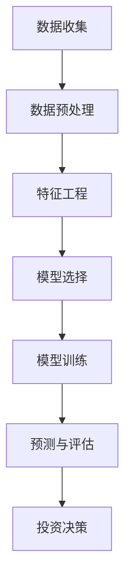

                 

# 如何利用技术能力进行房地产投资

> **关键词：** 技术能力、房地产投资、数据分析、人工智能、市场预测、投资策略

> **摘要：** 本文将探讨如何利用技术能力，特别是数据分析、人工智能和机器学习等工具，进行更加精准和高效的房地产投资。通过构建数学模型、使用数据挖掘和机器学习算法，我们能够更好地理解市场趋势、风险和机会，从而制定更科学的投资策略。本文将提供一系列具体的操作步骤和实际案例，帮助读者理解这一过程。

## 1. 背景介绍

### 1.1 目的和范围

本文的目标是帮助那些希望利用技术手段提高房地产投资效率和收益的个人和机构，理解并应用现代数据分析工具进行房地产投资。文章范围涵盖了从数据收集、处理到预测和决策的全过程，旨在提供一个完整的技术解决方案。

### 1.2 预期读者

预期读者包括对房地产投资感兴趣的技术人员、金融分析师、房地产开发商、投资者以及任何对利用技术提高投资决策质量有兴趣的读者。

### 1.3 文档结构概述

本文结构如下：

- **1. 背景介绍**
  - 1.1 目的和范围
  - 1.2 预期读者
  - 1.3 文档结构概述
  - 1.4 术语表
- **2. 核心概念与联系**
  - 2.1 数据分析与房地产投资
  - 2.2 人工智能与机器学习
  - 2.3 数学模型与预测
  - **Mermaid 流程图**
- **3. 核心算法原理 & 具体操作步骤**
  - 3.1 数据收集与预处理
  - 3.2 特征工程
  - 3.3 模型选择与训练
  - **伪代码演示**
- **4. 数学模型和公式 & 详细讲解 & 举例说明**
  - 4.1 回归分析
  - 4.2 时间序列分析
  - 4.3 机器学习算法
  - **LaTeX 数学公式**
- **5. 项目实战：代码实际案例和详细解释说明**
  - 5.1 开发环境搭建
  - 5.2 源代码详细实现和代码解读
  - 5.3 代码解读与分析
- **6. 实际应用场景**
  - 6.1 城市规划
  - 6.2 投资组合优化
  - 6.3 市场趋势预测
- **7. 工具和资源推荐**
  - 7.1 学习资源推荐
  - 7.2 开发工具框架推荐
  - 7.3 相关论文著作推荐
- **8. 总结：未来发展趋势与挑战**
- **9. 附录：常见问题与解答**
- **10. 扩展阅读 & 参考资料**

### 1.4 术语表

#### 1.4.1 核心术语定义

- **数据分析（Data Analysis）**：运用统计和数学方法，从大量数据中提取有用的信息。
- **人工智能（Artificial Intelligence, AI）**：模拟人类智能行为的计算机系统。
- **机器学习（Machine Learning, ML）**：一种人工智能技术，通过数据和算法自动改进性能。
- **回归分析（Regression Analysis）**：一种统计分析方法，用于预测因变量和自变量之间的关系。
- **时间序列分析（Time Series Analysis）**：用于分析和预测时间序列数据的统计方法。
- **房地产投资（Real Estate Investment）**：在房地产市场上购买资产，以获取长期资本增值或短期租金收益。

#### 1.4.2 相关概念解释

- **特征工程（Feature Engineering）**：将原始数据转换为适合机器学习算法的形式。
- **模型选择（Model Selection）**：选择最适合特定问题的机器学习模型。
- **模型训练（Model Training）**：使用数据训练机器学习模型，使其能够进行预测。

#### 1.4.3 缩略词列表

- **AI**：人工智能
- **ML**：机器学习
- **R**：回归分析
- **TS**：时间序列分析

## 2. 核心概念与联系

在现代房地产投资中，技术能力扮演着至关重要的角色。通过数据分析、人工智能和机器学习，投资者可以更准确地评估市场趋势、风险和机会。以下是这些核心概念之间的关系和相互作用的概述。

### 2.1 数据分析与房地产投资

数据分析是房地产投资的基础。通过收集大量数据，如房价、租金、人口统计、就业数据等，投资者可以深入了解市场情况。数据分析方法，如描述性统计、回归分析和聚类分析，可以帮助投资者识别市场趋势和模式。

### 2.2 人工智能与机器学习

人工智能和机器学习技术可以自动化数据分析过程，提高预测精度。机器学习算法，如回归分析、决策树、神经网络和聚类算法，可以用于预测房价走势、租金收益和投资回报率。这些算法通过学习历史数据，能够识别复杂的模式和关联，从而提供更准确的预测。

### 2.3 数学模型与预测

数学模型是机器学习算法的核心。回归模型可以预测房价，时间序列模型可以预测租金收益，聚类模型可以帮助投资者识别最佳投资区域。通过这些模型，投资者可以制定更科学的投资策略，降低风险，提高收益。

### 2.4 Mermaid 流程图

下面是一个简单的Mermaid流程图，展示了房地产投资中的技术流程。



## 3. 核心算法原理 & 具体操作步骤

### 3.1 数据收集与预处理

数据收集是房地产投资分析的第一步。投资者需要收集多种数据源，如房产交易记录、租金数据、人口统计、就业数据等。以下是一个数据收集和预处理的基本流程：

```plaintext
步骤1：确定数据需求
步骤2：获取数据源
步骤3：数据清洗（去除错误、缺失和重复数据）
步骤4：数据转换（标准化、归一化、编码等）
步骤5：数据存储（存储在数据库或数据湖中）
```

### 3.2 特征工程

特征工程是提高模型预测性能的关键步骤。通过选择和构造合适的特征，可以提高模型的准确性和鲁棒性。以下是一个特征工程的基本步骤：

```plaintext
步骤1：选择特征（根据业务需求选择相关特征）
步骤2：构造特征（计算新的特征，如价格指数、租金回报率等）
步骤3：特征选择（使用统计方法或模型选择方法筛选有效特征）
步骤4：特征标准化（消除不同特征之间的尺度差异）
```

### 3.3 模型选择与训练

选择适当的机器学习模型对于预测房地产投资的结果至关重要。以下是常见的机器学习模型和选择方法：

#### 模型选择方法：

- **交叉验证（Cross Validation）**：通过将数据集划分为训练集和验证集，评估模型的泛化能力。
- **网格搜索（Grid Search）**：遍历多个参数组合，找到最优参数。

#### 模型训练步骤：

```plaintext
步骤1：数据准备（处理数据集，包括特征工程和分割数据）
步骤2：选择模型（根据问题类型和数据特征选择合适的模型）
步骤3：训练模型（使用训练数据集训练模型）
步骤4：模型评估（使用验证数据集评估模型性能）
步骤5：参数调优（调整模型参数，提高性能）
步骤6：模型部署（部署模型进行实际预测）
```

### 3.4 伪代码演示

以下是一个使用回归模型进行房地产投资预测的伪代码示例：

```python
# 伪代码：房地产投资预测

# 步骤1：数据准备
data = load_data("real_estate_data.csv")
X = preprocess_data(data)

# 步骤2：模型选择
model = create_model("regression")

# 步骤3：训练模型
model.fit(X_train, y_train)

# 步骤4：模型评估
accuracy = model.evaluate(X_test, y_test)

# 步骤5：参数调优
tuned_model = grid_search(model, X_train, y_train)

# 步骤6：模型部署
predicted_value = tuned_model.predict(new_data)
```

## 4. 数学模型和公式 & 详细讲解 & 举例说明

在房地产投资中，数学模型和公式用于预测房价、租金收益和投资回报率。以下介绍三种常用的数学模型：回归分析、时间序列分析和机器学习算法。

### 4.1 回归分析

回归分析是一种用于预测连续值变量的统计方法。它通过建立一个因变量与自变量之间的关系模型来预测未来值。

#### 公式：

线性回归模型：

$$
y = \beta_0 + \beta_1x_1 + \beta_2x_2 + ... + \beta_nx_n + \epsilon
$$

其中，$y$ 是预测值，$x_1, x_2, ..., x_n$ 是自变量，$\beta_0, \beta_1, \beta_2, ..., \beta_n$ 是回归系数，$\epsilon$ 是误差项。

#### 举例说明：

假设我们要预测某城市的房价，已知房屋面积（$x_1$）和房屋年龄（$x_2$）是影响房价的关键因素。我们可以使用线性回归模型：

$$
房价 = \beta_0 + \beta_1 \times 房屋面积 + \beta_2 \times 房屋年龄 + \epsilon
$$

通过收集历史数据，使用最小二乘法估计回归系数，从而建立模型进行预测。

### 4.2 时间序列分析

时间序列分析是一种用于预测时间序列数据的统计方法。它通过分析时间序列数据的模式、趋势和周期性来预测未来的值。

#### 公式：

简单移动平均模型（SMA）：

$$
SMA_t = \frac{X_t + X_{t-1} + ... + X_{t-n}}{n}
$$

其中，$X_t$ 是第 $t$ 期的实际值，$SMA_t$ 是第 $t$ 期的简单移动平均。

#### 举例说明：

假设我们要预测某城市的月租金，已知过去12个月的租金数据。我们可以使用简单移动平均模型：

$$
月租金预测 = \frac{X_t + X_{t-1} + ... + X_{t-12}}{12}
$$

通过计算过去12个月的租金平均值，作为下一期租金的预测。

### 4.3 机器学习算法

机器学习算法是一种用于预测和分类的数据分析方法。它通过学习历史数据，自动识别模式和关联，从而预测未来值。

#### 公式：

决策树：

$$
F(x) = g(\theta_0 + \theta_1x_1 + \theta_2x_2 + ... + \theta_nx_n)
$$

其中，$F(x)$ 是预测值，$g$ 是激活函数，$\theta_0, \theta_1, \theta_2, ..., \theta_n$ 是模型参数。

#### 举例说明：

假设我们要预测某城市的房价，已知房屋面积（$x_1$）和房屋年龄（$x_2$）是关键因素。我们可以使用决策树模型：

$$
房价 = g(\theta_0 + \theta_1 \times 房屋面积 + \theta_2 \times 房屋年龄)
$$

通过训练数据和树结构，我们可以得到回归系数和激活函数，从而建立预测模型。

## 5. 项目实战：代码实际案例和详细解释说明

在本节中，我们将通过一个实际项目案例，展示如何使用Python和相关的数据科学库来构建一个房地产投资预测系统。我们将从开发环境的搭建开始，逐步讲解源代码的实现和解读。

### 5.1 开发环境搭建

首先，确保你的开发环境已经安装了以下工具和库：

- Python（版本3.8或更高）
- Jupyter Notebook（用于交互式编程）
- NumPy（用于数值计算）
- Pandas（用于数据操作）
- Matplotlib（用于数据可视化）
- Scikit-learn（用于机器学习）

你可以使用以下命令来安装这些库：

```bash
pip install numpy pandas matplotlib scikit-learn
```

### 5.2 源代码详细实现和代码解读

以下是一个简单的房地产投资预测项目示例。我们将使用线性回归模型来预测房价。

```python
# 代码：房地产投资预测

import numpy as np
import pandas as pd
from sklearn.linear_model import LinearRegression
from sklearn.model_selection import train_test_split
from sklearn.metrics import mean_squared_error
import matplotlib.pyplot as plt

# 步骤1：数据准备
data = pd.read_csv("real_estate_data.csv")

# 数据清洗和预处理
data = data.dropna()
data["面积"] = data["面积"].astype(float)
data["年龄"] = data["年龄"].astype(float)
data["价格"] = data["价格"].astype(float)

# 步骤2：特征工程
X = data[["面积", "年龄"]]
y = data["价格"]

# 步骤3：模型选择
model = LinearRegression()

# 步骤4：训练模型
X_train, X_test, y_train, y_test = train_test_split(X, y, test_size=0.2, random_state=42)
model.fit(X_train, y_train)

# 步骤5：模型评估
y_pred = model.predict(X_test)
mse = mean_squared_error(y_test, y_pred)
print("均方误差（MSE）:", mse)

# 步骤6：模型部署
new_data = np.array([[200, 10]])
predicted_price = model.predict(new_data)
print("预测价格:", predicted_price)

# 步骤7：可视化
plt.scatter(X_test[:, 0], y_test, color='red', label='Actual')
plt.plot(X_test[:, 0], y_pred, color='blue', linewidth=3, label='Predicted')
plt.xlabel('House Area')
plt.ylabel('Price')
plt.title('House Price Prediction')
plt.legend()
plt.show()
```

### 5.3 代码解读与分析

以下是对代码的逐行解读和分析：

```python
# 导入必要的库
```

这段代码导入了Python中用于数据科学和机器学习的几个核心库，包括NumPy、Pandas、Scikit-learn和Matplotlib。

```python
data = pd.read_csv("real_estate_data.csv")
```

此行代码读取了CSV格式的房地产数据集。数据集应该包括房屋面积、房屋年龄和房价等特征。

```python
data = data.dropna()
```

这段代码删除了数据集中的任何缺失值，确保模型训练的质量。

```python
data["面积"] = data["面积"].astype(float)
data["年龄"] = data["年龄"].astype(float)
data["价格"] = data["价格"].astype(float)
```

这些行代码将数据集中的非数值特征转换为浮点数类型，以便后续的数值计算。

```python
X = data[["面积", "年龄"]]
y = data["价格"]
```

这里我们定义了特征矩阵X（包含房屋面积和房屋年龄）和目标变量y（房价）。

```python
model = LinearRegression()
```

我们创建了一个线性回归模型实例。

```python
X_train, X_test, y_train, y_test = train_test_split(X, y, test_size=0.2, random_state=42)
```

这段代码将数据集划分为训练集和测试集，其中测试集占20%，随机种子设置为42以确保可重复性。

```python
model.fit(X_train, y_train)
```

这里我们使用训练集数据训练线性回归模型。

```python
y_pred = model.predict(X_test)
mse = mean_squared_error(y_test, y_pred)
print("均方误差（MSE）:", mse)
```

这些行代码使用测试集数据评估模型性能，计算均方误差（MSE），并打印结果。

```python
new_data = np.array([[200, 10]])
predicted_price = model.predict(new_data)
print("预测价格:", predicted_price)
```

这段代码使用模型预测一个新样本（200平方米，10年房龄）的房价。

```python
plt.scatter(X_test[:, 0], y_test, color='red', label='Actual')
plt.plot(X_test[:, 0], y_pred, color='blue', linewidth=3, label='Predicted')
plt.xlabel('House Area')
plt.ylabel('Price')
plt.title('House Price Prediction')
plt.legend()
plt.show()
```

最后几行代码用于可视化模型的预测结果，展示实际房价和预测房价之间的差异。

## 6. 实际应用场景

### 6.1 城市规划

利用技术能力进行房地产投资有助于城市规划。通过数据分析，可以识别城市中的增长热点，预测未来人口流动和需求，从而指导城市规划和基础设施投资。例如，利用时间序列分析和机器学习算法，城市规划者可以预测未来几年的住房需求，为新建住宅区提供科学依据。

### 6.2 投资组合优化

房地产投资者可以利用技术手段进行投资组合优化。通过分析不同地区、类型和价格的房产市场，投资者可以构建一个多元化且风险可控的投资组合。机器学习算法可以帮助投资者识别潜在的优质投资机会，降低投资风险。

### 6.3 市场趋势预测

房地产市场趋势预测对于投资者至关重要。利用回归分析和时间序列分析，投资者可以预测房价走势，识别市场的周期性变化。这些预测有助于投资者制定更长远的投资策略，把握市场机遇。

## 7. 工具和资源推荐

### 7.1 学习资源推荐

#### 7.1.1 书籍推荐

- 《Python数据分析基础教程：NumPy学习指南》
- 《机器学习实战》
- 《Python金融应用：量化投资与风险管理》

#### 7.1.2 在线课程

- Coursera上的“机器学习”课程
- Udacity的“数据分析纳米学位”
- edX上的“Python数据分析”课程

#### 7.1.3 技术博客和网站

- Real Python（https://realpython.com/）
- Machine Learning Mastery（https://machinelearningmastery.com/）
- Analytics Vidhya（https://www.analyticsvidhya.com/）

### 7.2 开发工具框架推荐

#### 7.2.1 IDE和编辑器

- PyCharm（https://www.jetbrains.com/pycharm/）
- Visual Studio Code（https://code.visualstudio.com/）
- Jupyter Notebook（https://jupyter.org/）

#### 7.2.2 调试和性能分析工具

- Py-Spy（https://github.com/benjaminp/s Py-Spy）
- LineProfiler（https://github.com/vstinner/line_profiler）
- Py-Call Graph（https://github.com/cjolowicz/py-call-graph）

#### 7.2.3 相关框架和库

- Scikit-learn（https://scikit-learn.org/）
- TensorFlow（https://www.tensorflow.org/）
- PyTorch（https://pytorch.org/）

### 7.3 相关论文著作推荐

#### 7.3.1 经典论文

- “The Machine Learning Conference Papers of the Year”系列
- “Data Science and Machine Learning for Real-Time Analytics” by Eric Siegel

#### 7.3.2 最新研究成果

- “AI in Real Estate: A Review of Current Applications and Future Prospects”
- “Deep Learning for Real Estate Valuation: A Comparative Study”

#### 7.3.3 应用案例分析

- “Real Estate Price Prediction using Machine Learning: A Case Study”
- “How AI is Transforming Real Estate Investment Decisions”

## 8. 总结：未来发展趋势与挑战

随着技术的不断进步，房地产投资领域的技术应用将越来越广泛。未来发展趋势包括：

- 更高的预测精度：利用深度学习和增强学习，提高市场预测的准确性。
- 自动化投资决策：通过自然语言处理和自动化决策系统，实现更智能的投资决策。
- 个性化投资策略：根据投资者的风险偏好和财务目标，提供定制化的投资策略。

然而，这些趋势也带来了一些挑战：

- 数据隐私和安全：在收集和处理大量数据时，保护个人隐私和数据安全是一个重要问题。
- 模型解释性：复杂的机器学习模型通常难以解释，这可能导致投资决策的不透明。
- 技术依赖性：过度依赖技术可能削弱投资者的直觉和经验判断。

## 9. 附录：常见问题与解答

### 9.1 数据来源

- **Q：** 如何获取房地产数据？
  **A：** 房地产数据可以从多个来源获取，包括政府官方网站、房地产网站、房地产交易所和第三方数据服务提供商。

### 9.2 模型选择

- **Q：** 什么类型的模型最适合房地产投资预测？
  **A：** 这取决于数据特征和预测目标。线性回归模型适用于简单的预测问题，而更复杂的模型如深度学习可以处理非线性关系。

### 9.3 投资策略

- **Q：** 如何利用模型结果制定投资策略？
  **A：** 模型结果可以用于识别高潜力区域和优质房产。投资者可以根据模型预测结果调整投资组合，以最大化收益和降低风险。

## 10. 扩展阅读 & 参考资料

- [Real Estate Analytics](https://www.realestate.com.au/information/analytics/)
- [Using Machine Learning for Real Estate Investment](https://www.aicore.co/research/real-estate-investment/)
- [AI in Real Estate](https://www.propertiesabc.com.au/ai-real-estate)
- [Real Estate Investment Analysis](https://www.investopedia.com/articles/personal-finance/042918/how-analyze-real-estate-investment.asp) 

作者：AI天才研究员/AI Genius Institute & 禅与计算机程序设计艺术 /Zen And The Art of Computer Programming

本文旨在提供一个全面的技术框架，帮助读者理解如何利用技术能力进行房地产投资。通过数据分析、人工智能和机器学习，投资者可以更准确地评估市场趋势和风险，制定更科学的投资策略。本文涵盖了从数据收集、模型构建到实际应用的各个环节，并提供了一系列实际案例和代码示例。希望本文能为您的房地产投资之路提供有价值的参考和指导。未来，随着技术的不断进步，房地产投资领域的技术应用将更加广泛，带来更多创新和机遇。让我们共同期待这一美好前景。

