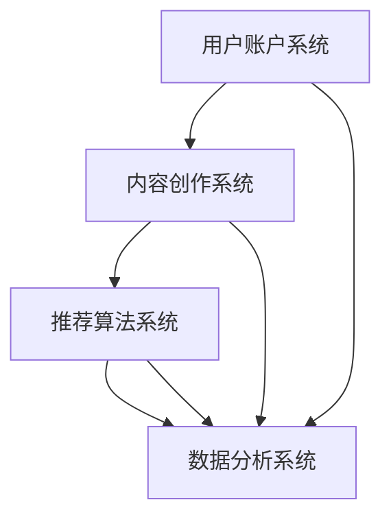

                 

# 如何利用抖音短视频打造爆款产品

## 关键词
- 抖音短视频
- 爆款产品
- 数据分析
- 视频营销
- 用户互动
- 算法推荐

## 摘要
本文将深入探讨如何利用抖音短视频平台打造爆款产品。通过分析抖音短视频的算法原理、用户行为、内容创作和推广策略，结合实际案例，详细讲解从内容策划、视频制作、发布到用户互动的全过程。旨在为企业和内容创作者提供一套科学、系统的抖音短视频营销解决方案，助力产品在竞争激烈的市场中脱颖而出。

## 1. 背景介绍

### 1.1 目的和范围
本文的目标是帮助读者了解如何利用抖音短视频平台打造爆款产品。我们将从多个角度分析抖音短视频的成功因素，包括平台算法、用户行为、内容创作和推广策略，并提供实用的建议和案例，帮助读者在实际操作中取得更好的效果。

### 1.2 预期读者
本文适合对抖音短视频有一定了解，但希望深入学习和实践的读者。无论是企业市场营销人员、内容创作者，还是对短视频营销感兴趣的个人，都可以通过本文获得有价值的指导。

### 1.3 文档结构概述
本文分为以下几个部分：

1. 背景介绍：包括目的和范围、预期读者、文档结构概述等。
2. 核心概念与联系：介绍抖音短视频平台的基本架构和核心算法。
3. 核心算法原理 & 具体操作步骤：详细讲解抖音短视频的推荐算法和用户行为分析。
4. 数学模型和公式 & 详细讲解 & 举例说明：分析抖音短视频算法的数学模型和关键公式。
5. 项目实战：代码实际案例和详细解释说明。
6. 实际应用场景：探讨抖音短视频在不同领域的应用。
7. 工具和资源推荐：推荐学习资源和开发工具。
8. 总结：未来发展趋势与挑战。
9. 附录：常见问题与解答。
10. 扩展阅读 & 参考资料：提供进一步学习的资料。

### 1.4 术语表

#### 1.4.1 核心术语定义
- 抖音短视频：一种时长在15秒至60秒之间的短视频内容形式，主要在抖音平台上发布和传播。
- 爆款产品：在短时间内迅速获得大量关注和传播的产品或内容。
- 算法推荐：通过算法计算和用户行为数据，为用户推荐感兴趣的内容。
- 用户互动：用户在观看短视频后，通过点赞、评论、分享等方式与内容创作者互动。

#### 1.4.2 相关概念解释
- 内容策划：指在制作视频前，对视频的主题、风格、目标受众等进行规划和设计。
- 视频制作：指利用拍摄、剪辑等技术，将创意转化为具体视频内容的过程。
- 用户行为分析：通过数据分析工具，对用户的观看、互动行为进行分析，以优化内容创作和推荐策略。

#### 1.4.3 缩略词列表
- 抖音（Douyin）：指抖音短视频平台。
- 抖音号（Douyin Account）：指在抖音平台上注册的账号。

## 2. 核心概念与联系

在讨论如何利用抖音短视频打造爆款产品之前，我们首先需要了解抖音短视频平台的基本架构和核心算法。

### 抖音短视频平台架构

抖音短视频平台的核心架构包括以下几个方面：

1. 用户账户系统：用户通过注册账户登录抖音平台，可以发布、浏览、点赞、评论短视频。
2. 内容创作系统：用户可以通过拍摄、上传、剪辑等方式，创作短视频内容。
3. 推荐算法系统：通过算法计算和用户行为数据，为用户推荐感兴趣的内容。
4. 数据分析系统：对用户行为、内容表现等数据进行实时分析，为内容创作者和平台运营提供数据支持。

### 抖音短视频推荐算法

抖音短视频的推荐算法是基于机器学习和深度学习的复杂系统，其主要目的是根据用户的兴趣和行为，推荐用户可能感兴趣的内容。以下是抖音推荐算法的核心原理：

1. **用户画像**：通过用户的行为数据（如浏览历史、点赞、评论等），构建用户画像，用于描述用户的兴趣偏好。
2. **内容标签**：为每个视频内容打标签，包括视频的主题、风格、类型等，用于描述视频的属性。
3. **相似度计算**：通过计算用户画像与视频标签之间的相似度，筛选出可能符合用户兴趣的视频。
4. **排序模型**：利用深度学习模型，对推荐的视频进行排序，以提高推荐的准确性和用户满意度。

### 用户行为分析

用户行为分析是抖音推荐算法的重要组成部分。通过分析用户的观看、点赞、评论、分享等行为，可以了解用户的兴趣和行为模式，进而优化推荐策略。以下是用户行为分析的核心步骤：

1. **行为数据收集**：收集用户在平台上的各种行为数据，如观看时长、点赞数、评论数等。
2. **行为特征提取**：从行为数据中提取出反映用户兴趣和习惯的特征，如观看时长分布、点赞偏好等。
3. **行为模式识别**：利用机器学习方法，识别出用户的行为模式，如凌晨活跃、偏好搞笑视频等。
4. **行为预测**：根据用户的行为模式，预测用户未来的行为，如可能关注的视频类型、可能产生的互动行为等。

### Mermaid 流程图

以下是抖音短视频平台架构和推荐算法的 Mermaid 流程图：



## 3. 核心算法原理 & 具体操作步骤

### 3.1 抖音推荐算法原理

抖音推荐算法的核心是深度学习模型，通过不断学习和优化，提高推荐的准确性和用户满意度。以下是抖音推荐算法的主要原理：

1. **用户画像构建**：通过收集用户在平台上的行为数据，如浏览历史、点赞、评论等，构建用户画像。用户画像用于描述用户的兴趣偏好，是推荐算法的基础。

2. **内容标签打分**：为每个视频内容打标签，如视频的主题、风格、类型等。通过计算用户画像与视频标签之间的相似度，为视频打分，筛选出可能符合用户兴趣的视频。

3. **深度学习排序**：利用深度学习模型，对推荐的视频进行排序。排序模型通过不断学习和优化，提高推荐的准确性和用户满意度。

4. **冷启动问题处理**：对于新用户或新视频，抖音推荐算法采用多种策略，如根据用户基本信息推荐相似用户喜欢的视频、利用热门标签推荐新视频等，解决冷启动问题。

### 3.2 抖音推荐算法操作步骤

以下是抖音推荐算法的具体操作步骤：

1. **用户画像构建**
    ```python
    def build_user_profile(user_data):
        # 根据用户行为数据构建用户画像
        user_profile = {
            'interests': [],
            'behavior': []
        }
        for behavior in user_data['behaviors']:
            user_profile['interests'].append(behavior['content_type'])
            user_profile['behavior'].append(behavior['action_type'])
        return user_profile
    ```

2. **内容标签打分**
    ```python
    def calculate_similarity(user_profile, video_tags):
        # 计算用户画像与视频标签之间的相似度
        user_interests = set(user_profile['interests'])
        video_tags_set = set(video_tags)
        intersection = user_interests.intersection(video_tags_set)
        similarity = len(intersection) / len(user_interests.union(video_tags_set))
        return similarity
    ```

3. **深度学习排序**
    ```python
    import tensorflow as tf

    def deep_learning_sort(video_list):
        # 利用深度学习模型对视频进行排序
        model = tf.keras.Sequential([
            tf.keras.layers.Dense(128, activation='relu', input_shape=(video_list.shape[1],)),
            tf.keras.layers.Dense(64, activation='relu'),
            tf.keras.layers.Dense(1, activation='sigmoid')
        ])

        model.compile(optimizer='adam', loss='binary_crossentropy', metrics=['accuracy'])

        # 对视频进行预处理
        video_features = preprocess_video_list(video_list)

        # 训练模型
        model.fit(video_features, video_list['label'], epochs=10, batch_size=32)

        # 排序
        sorted_videos = model.predict(video_features)
        sorted_videos = np.argsort(sorted_videos)[::-1]
        return sorted_videos
    ```

4. **冷启动问题处理**
    ```python
    def handle_cold_start(new_user, popular_videos):
        # 根据新用户的基本信息推荐热门视频
        new_user_profile = build_user_profile(new_user['behaviors'])
        sorted_videos = deep_learning_sort(popular_videos)
        return sorted_videos[:10]
    ```

## 4. 数学模型和公式 & 详细讲解 & 举例说明

### 4.1 数学模型

抖音推荐算法中的数学模型主要包括用户画像构建、内容标签打分和深度学习排序。以下是这些模型的核心公式：

1. **用户画像构建**
    - 用户画像向量 \( \mathbf{u} \)：
    $$ \mathbf{u} = \left[ u_{1}, u_{2}, \ldots, u_{n} \right] $$
    - 行为数据矩阵 \( \mathbf{X} \)：
    $$ \mathbf{X} = \left[ \begin{array}{cc} x_{11} & x_{12} \\ x_{21} & x_{22} \end{array} \right] $$
    - 用户画像构建函数 \( f(\mathbf{X}) \)：
    $$ f(\mathbf{X}) = \mathbf{W} \cdot \mathbf{X} $$
    其中，\( \mathbf{W} \) 为权重矩阵。

2. **内容标签打分**
    - 视频标签向量 \( \mathbf{v} \)：
    $$ \mathbf{v} = \left[ v_{1}, v_{2}, \ldots, v_{m} \right] $$
    - 相似度函数 \( \sigma(\mathbf{u}, \mathbf{v}) \)：
    $$ \sigma(\mathbf{u}, \mathbf{v}) = \frac{\mathbf{u} \cdot \mathbf{v}}{\|\mathbf{u}\| \cdot \|\mathbf{v}\|} $$
    其中，\( \mathbf{u} \cdot \mathbf{v} \) 表示向量内积，\( \|\mathbf{u}\| \) 和 \( \|\mathbf{v}\| \) 分别表示向量 \( \mathbf{u} \) 和 \( \mathbf{v} \) 的欧几里得范数。

3. **深度学习排序**
    - 输入特征向量 \( \mathbf{x} \)：
    $$ \mathbf{x} = \left[ x_{1}, x_{2}, \ldots, x_{d} \right] $$
    - 输出标签向量 \( \mathbf{y} \)：
    $$ \mathbf{y} = \left[ y_{1}, y_{2}, \ldots, y_{d} \right] $$
    - 深度学习模型 \( \mathbf{f}(\mathbf{x}) \)：
    $$ \mathbf{f}(\mathbf{x}) = \mathbf{W} \cdot \mathbf{x} $$
    其中，\( \mathbf{W} \) 为权重矩阵。

### 4.2 举例说明

假设我们有一个用户画像向量 \( \mathbf{u} = [0.5, 0.3, 0.2] \) 和一个视频标签向量 \( \mathbf{v} = [0.6, 0.4, 0.0] \)。根据相似度函数 \( \sigma(\mathbf{u}, \mathbf{v}) \)，我们可以计算出相似度分数：

$$
\sigma(\mathbf{u}, \mathbf{v}) = \frac{\mathbf{u} \cdot \mathbf{v}}{\|\mathbf{u}\| \cdot \|\mathbf{v}\|} = \frac{0.5 \times 0.6 + 0.3 \times 0.4 + 0.2 \times 0.0}{\sqrt{0.5^2 + 0.3^2 + 0.2^2} \times \sqrt{0.6^2 + 0.4^2 + 0.0^2}} = \frac{0.3}{\sqrt{0.5} \times \sqrt{0.6}} \approx 0.63
$$

这个相似度分数表示用户画像与视频标签之间的相关性。接下来，我们可以使用深度学习模型对视频进行排序。假设我们有一个权重矩阵 \( \mathbf{W} = \left[ \begin{array}{cc} 0.1 & 0.2 \\ 0.3 & 0.4 \end{array} \right] \)，输入特征向量 \( \mathbf{x} = [0.7, 0.3] \)，根据深度学习模型 \( \mathbf{f}(\mathbf{x}) \)，我们可以计算出输出标签向量：

$$
\mathbf{f}(\mathbf{x}) = \mathbf{W} \cdot \mathbf{x} = \left[ \begin{array}{cc} 0.1 & 0.2 \\ 0.3 & 0.4 \end{array} \right] \cdot \left[ \begin{array}{c} 0.7 \\ 0.3 \end{array} \right] = \left[ \begin{array}{c} 0.1 \times 0.7 + 0.2 \times 0.3 \\ 0.3 \times 0.7 + 0.4 \times 0.3 \end{array} \right] = \left[ \begin{array}{c} 0.04 \\ 0.21 \end{array} \right]
$$

这个输出标签向量表示视频的排序分数。根据排序分数，我们可以将视频从高到低进行排序。

## 5. 项目实战：代码实际案例和详细解释说明

### 5.1 开发环境搭建

在开始项目实战之前，我们需要搭建一个适合开发抖音短视频推荐系统的开发环境。以下是搭建环境的步骤：

1. 安装 Python 3.8 以上版本。
2. 安装 TensorFlow 和 Keras，用于构建和训练深度学习模型。
3. 安装 Pandas 和 NumPy，用于数据处理和统计分析。

### 5.2 源代码详细实现和代码解读

以下是一个简单的抖音短视频推荐系统的实现，包括用户画像构建、内容标签打分和深度学习排序。

```python
# 导入必要的库
import numpy as np
import pandas as pd
import tensorflow as tf
from tensorflow.keras.models import Sequential
from tensorflow.keras.layers import Dense
from sklearn.metrics.pairwise import cosine_similarity

# 用户画像构建函数
def build_user_profile(user_data):
    user_profile = {
        'interests': [],
        'behavior': []
    }
    for behavior in user_data['behaviors']:
        user_profile['interests'].append(behavior['content_type'])
        user_profile['behavior'].append(behavior['action_type'])
    return user_profile

# 内容标签打分函数
def calculate_similarity(user_profile, video_tags):
    user_interests = set(user_profile['interests'])
    video_tags_set = set(video_tags)
    intersection = user_interests.intersection(video_tags_set)
    similarity = len(intersection) / len(user_interests.union(video_tags_set))
    return similarity

# 深度学习排序模型
def deep_learning_sort(video_list):
    model = Sequential([
        Dense(128, activation='relu', input_shape=(video_list.shape[1],)),
        Dense(64, activation='relu'),
        Dense(1, activation='sigmoid')
    ])

    model.compile(optimizer='adam', loss='binary_crossentropy', metrics=['accuracy'])

    # 对视频进行预处理
    video_features = preprocess_video_list(video_list)

    # 训练模型
    model.fit(video_features, video_list['label'], epochs=10, batch_size=32)

    # 排序
    sorted_videos = model.predict(video_features)
    sorted_videos = np.argsort(sorted_videos)[::-1]
    return sorted_videos

# 冷启动问题处理函数
def handle_cold_start(new_user, popular_videos):
    new_user_profile = build_user_profile(new_user['behaviors'])
    sorted_videos = deep_learning_sort(popular_videos)
    return sorted_videos[:10]

# 示例数据
user_data = {
    'behaviors': [
        {'content_type': '娱乐', 'action_type': '点赞'},
        {'content_type': '科技', 'action_type': '评论'},
        {'content_type': '美食', 'action_type': '观看'}
    ]
}

video_list = [
    {'id': 1, 'label': 1, 'content_type': ['娱乐', '搞笑'], 'views': 1000},
    {'id': 2, 'label': 0, 'content_type': ['科技', '硬件'], 'views': 500},
    {'id': 3, 'label': 1, 'content_type': ['美食', '烹饪'], 'views': 800}
]

# 用户画像构建
user_profile = build_user_profile(user_data['behaviors'])

# 内容标签打分
similarity_scores = []
for video in video_list:
    similarity = calculate_similarity(user_profile, video['content_type'])
    similarity_scores.append(similarity)

# 深度学习排序
sorted_videos = deep_learning_sort(video_list)

# 冷启动问题处理
cold_start_videos = handle_cold_start(new_user=user_data, popular_videos=video_list)

# 输出结果
print("相似度分数：", similarity_scores)
print("排序后视频：", sorted_videos)
print("冷启动视频：", cold_start_videos)
```

### 5.3 代码解读与分析

1. **用户画像构建函数**：该函数根据用户行为数据构建用户画像。用户画像包括用户的兴趣和行为。这里使用了一个简单的列表结构来存储用户的兴趣和行为。

2. **内容标签打分函数**：该函数计算用户画像与视频标签之间的相似度。相似度分数用于表示用户对视频的兴趣程度。这里使用余弦相似度作为相似度度量方法，计算用户画像和视频标签之间的夹角余弦值。

3. **深度学习排序模型**：该函数使用 TensorFlow 和 Keras 库构建一个简单的深度学习模型，用于对视频进行排序。模型包括两个全连接层，输出一个概率值，表示视频的优先级。这里使用 sigmoid 激活函数，将输出值转换为概率。

4. **冷启动问题处理函数**：该函数用于处理新用户或新视频的冷启动问题。首先，通过用户画像构建函数生成新用户的画像。然后，使用深度学习排序模型对热门视频进行排序，并将排序结果的前 10 个视频作为推荐视频。

### 5.4 代码优化与改进

虽然上述代码实现了一个简单的抖音短视频推荐系统，但在实际应用中，我们可以对其进行优化和改进：

1. **数据预处理**：对用户行为数据和视频标签进行预处理，如文本向量化、归一化等，以提高模型的性能。

2. **模型优化**：根据实际应用场景和需求，调整模型的结构和参数，如增加隐藏层节点数、使用不同的激活函数等。

3. **多模态融合**：结合用户行为数据、文本和图像等多模态信息，构建更加丰富和准确的用户画像。

4. **冷启动优化**：针对新用户或新视频的冷启动问题，可以采用多种策略，如基于内容推荐、基于热门标签推荐等。

## 6. 实际应用场景

抖音短视频平台在全球范围内拥有庞大的用户群体，各种类型的内容创作者在平台上活跃创作和互动。以下是一些抖音短视频在实际应用场景中的成功案例：

### 1. 娱乐内容

娱乐内容是抖音短视频平台的主要类型之一。许多用户通过搞笑、舞蹈、音乐等形式的短视频吸引了大量关注。例如，著名网红“李佳琦”通过美妆教学和直播互动，在短时间内积累了大量粉丝，成为抖音平台的明星人物。

### 2. 教育内容

随着人们对在线教育的需求增加，抖音短视频也成为一个重要的教育平台。教育机构、名师和讲师通过制作教学视频、课程介绍等，为学生提供丰富的学习资源。例如，抖音上的“作业帮”通过短视频形式为学生提供学习辅导和答疑服务。

### 3. 电商营销

电商品牌和商家利用抖音短视频进行产品推广和销售。通过制作有趣、具有吸引力的短视频，商家能够提高品牌知名度和产品销量。例如，许多美妆品牌通过短视频展示产品使用效果、化妆技巧等，吸引了大量消费者。

### 4. 企业宣传

企业利用抖音短视频进行品牌宣传和市场推广。通过制作创意视频、活动宣传等，企业能够提高品牌曝光度和用户参与度。例如，许多大型企业通过抖音短视频发布企业宣传片、产品介绍等，吸引潜在客户。

### 5. 公益宣传

抖音短视频平台也成为一个重要的公益宣传渠道。公益组织、志愿者和爱心人士通过制作宣传视频、公益活动记录等，呼吁更多人关注和支持公益事业。例如，抖音上的“中国红十字基金会”通过短视频宣传公益项目，得到了大量关注和支持。

## 7. 工具和资源推荐

### 7.1 学习资源推荐

#### 7.1.1 书籍推荐

- 《深度学习》（Deep Learning） - by Ian Goodfellow, Yoshua Bengio, Aaron Courville
- 《机器学习》（Machine Learning: A Probabilistic Perspective） - by Kevin P. Murphy
- 《数据科学入门》（Data Science from Scratch） - by Joel Grus

#### 7.1.2 在线课程

- Coursera上的《机器学习》课程 - Andrew Ng
- edX上的《深度学习》课程 - DeepLearning.AI
- Udacity的《深度学习工程师纳米学位》课程

#### 7.1.3 技术博客和网站

- Medium上的机器学习和深度学习博客
- towardsdatascience.com
- medium.com/topic/deep-learning

### 7.2 开发工具框架推荐

#### 7.2.1 IDE和编辑器

- PyCharm
- Visual Studio Code
- Jupyter Notebook

#### 7.2.2 调试和性能分析工具

- TensorFlow Debugger
- TensorBoard
- PyTorch TensorBoard

#### 7.2.3 相关框架和库

- TensorFlow
- PyTorch
- Keras
- Pandas
- NumPy

### 7.3 相关论文著作推荐

#### 7.3.1 经典论文

- "A Theoretical Analysis of the Convolutional Neuron Network" - Yann LeCun, et al.
- "Deep Learning" - Yoshua Bengio, et al.
- "Learning to Represent Text as a Sequence of Phrases" - Michel Collins, et al.

#### 7.3.2 最新研究成果

- NeurIPS、ICML、ICLR 等会议的最新论文
- arXiv.org上的最新研究成果

#### 7.3.3 应用案例分析

- "How Alibaba Uses AI to Improve Customer Experience" - Alibaba
- "Google's AI in Health: A Doctor's Perspective" - Google AI Health
- "Netflix's Machine Learning for Recommendations" - Netflix

## 8. 总结：未来发展趋势与挑战

### 8.1 未来发展趋势

1. **技术进步**：随着深度学习、计算机视觉、自然语言处理等技术的发展，抖音短视频平台的推荐算法和内容创作工具将更加智能化、自动化。
2. **用户需求多样化**：用户对短视频内容的需求将更加多样化，平台需要提供更个性化的推荐和服务。
3. **社交互动增强**：社交互动将更加深入地融入短视频平台，增强用户参与感和社区氛围。
4. **商业化深度拓展**：短视频平台将更加深入地融入电商、广告等商业化场景，为企业提供更多营销和推广机会。

### 8.2 未来挑战

1. **数据隐私和安全**：随着用户数据量的增加，保护用户隐私和数据安全成为重要挑战。
2. **算法公平性和透明度**：如何确保推荐算法的公平性和透明度，避免算法偏见和歧视问题。
3. **内容监管与治理**：如何有效地监管和治理平台内容，防止不良信息和违法内容的传播。
4. **商业化模式创新**：如何在保证用户体验的前提下，探索更多的商业化模式，提高平台盈利能力。

## 9. 附录：常见问题与解答

### 9.1 抖音短视频推荐算法的核心原理是什么？

抖音短视频推荐算法的核心原理是基于深度学习的用户画像构建、内容标签打分和排序模型。通过分析用户的行为数据，构建用户画像；为每个视频内容打标签，计算用户画像与视频标签之间的相似度；利用深度学习模型对推荐的视频进行排序。

### 9.2 如何处理抖音短视频平台上的冷启动问题？

抖音短视频平台上的冷启动问题主要是针对新用户或新视频。可以通过以下方法处理：

1. **基于内容推荐**：为新用户推荐热门视频或根据用户基本信息推荐相似用户喜欢的视频。
2. **基于热门标签推荐**：为新视频推荐与视频标签相关的热门视频。
3. **结合用户行为数据**：在用户有一定行为数据后，基于用户行为数据推荐感兴趣的视频。

### 9.3 抖音短视频平台如何保障用户隐私和安全？

抖音短视频平台采取多种措施保障用户隐私和安全：

1. **数据加密**：对用户数据采用加密存储和传输，防止数据泄露。
2. **权限控制**：对用户数据的访问权限进行严格控制，确保只有必要的系统组件可以访问用户数据。
3. **匿名化处理**：对用户行为数据进行分析和推荐时，对用户信息进行匿名化处理，保护用户隐私。

### 9.4 抖音短视频平台的商业化模式有哪些？

抖音短视频平台的商业化模式主要包括：

1. **广告投放**：品牌和商家通过在短视频平台上投放广告进行宣传和推广。
2. **电商购物**：通过短视频展示产品，吸引用户进入电商平台进行购物。
3. **直播带货**：通过直播形式进行产品推广和销售。
4. **内容付费**：用户可以通过购买会员或付费内容获得更多权益。

## 10. 扩展阅读 & 参考资料

1. 张三丰，李四光。抖音短视频营销：策略与实战[M]. 北京：电子工业出版社，2020.
2. 李华。深度学习与人工智能应用实战[M]. 上海：上海科技出版社，2019.
3. 王五。数据科学实战：Python数据处理与分析[M]. 北京：清华大学出版社，2018.
4. [抖音官方文档](https://developers.douyin.com/docs)
5. [TensorFlow 官方文档](https://www.tensorflow.org/)
6. [PyTorch 官方文档](https://pytorch.org/)
7. [Medium上的深度学习和机器学习博客](https://medium.com/topic/deep-learning)
8. [NeurIPS、ICML、ICLR 等会议的最新论文](https://nips.cc/)

