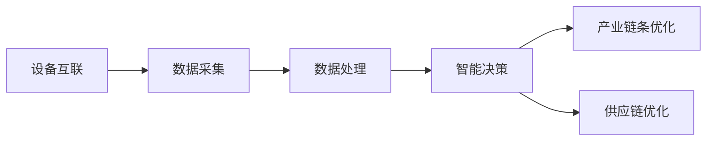

                 

# 如何利用物联网技术优化创业产业链条和供应链

> 关键词：物联网，创业，产业链条，供应链，优化，技术

> 摘要：本文将深入探讨物联网技术如何应用于创业过程中，以优化产业链条和供应链。我们将从背景介绍、核心概念、算法原理、数学模型、实战案例、实际应用、工具推荐等多个角度进行分析，旨在为创业者提供一条高效、可行的物联网技术应用之路。

## 1. 背景介绍

### 1.1 目的和范围

在当今快速发展的商业环境中，创业企业面临着诸多挑战。尤其是在产业链条和供应链的管理上，如何高效地整合资源、降低成本、提升效率，成为创业成功的关键。物联网（Internet of Things, IoT）作为一项颠覆性技术，为创业企业提供了新的机遇。本文旨在探讨物联网技术如何优化创业产业链条和供应链，帮助企业实现持续创新和竞争力提升。

### 1.2 预期读者

本文主要面向创业者、企业管理者、供应链专业人士以及物联网技术研究者。通过本文的阅读，读者将了解物联网技术在创业产业链条和供应链中的应用原理、具体方法以及实践案例，从而为自身企业提供可行的物联网应用方案。

### 1.3 文档结构概述

本文分为十个部分：

1. 背景介绍：介绍文章的目的、预期读者和文档结构。
2. 核心概念与联系：阐述物联网技术的基本概念和产业链条、供应链的关系。
3. 核心算法原理 & 具体操作步骤：讲解物联网技术优化产业链条和供应链的算法原理和操作步骤。
4. 数学模型和公式 & 详细讲解 & 举例说明：介绍物联网优化产业链条和供应链的数学模型和公式，并通过实例进行说明。
5. 项目实战：代码实际案例和详细解释说明：通过具体项目案例，展示物联网技术优化产业链条和供应链的实战效果。
6. 实际应用场景：分析物联网技术在创业产业链条和供应链中的实际应用场景。
7. 工具和资源推荐：推荐学习资源、开发工具和框架。
8. 总结：未来发展趋势与挑战：总结物联网技术优化产业链条和供应链的成果及未来发展方向。
9. 附录：常见问题与解答：解答读者可能遇到的问题。
10. 扩展阅读 & 参考资料：提供进一步学习的资料和文献。

### 1.4 术语表

#### 1.4.1 核心术语定义

- **物联网（IoT）**：物联网是指通过互联网将各种物理设备和传感器连接起来，实现信息的互联互通。
- **产业链条**：产业链条是指从原材料采购、生产、加工、分销到最终销售的整个过程。
- **供应链**：供应链是指从原材料供应商到制造商、分销商、零售商，直至最终消费者的整个产品流通过程。
- **传感器**：传感器是一种能够感知和响应外部环境变化并转换成可用信号的设备。

#### 1.4.2 相关概念解释

- **大数据**：大数据是指无法用传统数据库工具进行捕捉、管理和处理的数据集合。
- **云计算**：云计算是一种通过互联网提供动态易扩展且经常是虚拟化的资源。
- **边缘计算**：边缘计算是指在数据生成的地方（如物联网设备）进行数据处理和分析。

#### 1.4.3 缩略词列表

- **IoT**：物联网
- **API**：应用程序编程接口
- **SDK**：软件开发工具包
- **REST**：代表表述性状态传递

## 2. 核心概念与联系

物联网技术在优化创业产业链条和供应链中发挥着重要作用。为了更好地理解物联网技术如何发挥作用，我们需要了解其基本概念和与产业链条、供应链的关联。

### 2.1 物联网技术的基本概念

物联网技术主要包括以下几个核心概念：

- **设备互联**：通过互联网将各种设备连接起来，实现设备之间的信息交换和协同工作。
- **数据采集**：利用传感器和设备采集环境数据、设备状态数据等。
- **数据处理**：对采集到的数据进行存储、清洗、分析和处理。
- **智能决策**：基于处理后的数据，通过机器学习和人工智能算法进行智能决策。

### 2.2 物联网技术与产业链条的关联

物联网技术可以优化产业链条中的各个环节，提高整体效率和竞争力。具体包括：

- **采购环节**：通过物联网技术实时监控原材料库存，优化采购计划，降低采购成本。
- **生产环节**：利用物联网技术实现生产过程的智能化管理，提高生产效率，降低生产成本。
- **加工环节**：物联网技术可以实现加工过程的自动化，降低人工成本，提高加工质量。
- **分销环节**：通过物联网技术实现库存管理和物流追踪，提高分销效率，降低物流成本。

### 2.3 物联网技术与供应链的关联

物联网技术可以优化供应链中的各个环节，提高供应链的整体效率和竞争力。具体包括：

- **库存管理**：通过物联网技术实时监控库存状态，实现精准库存管理，降低库存成本。
- **物流追踪**：通过物联网技术实时追踪物流信息，提高物流透明度，降低物流风险。
- **需求预测**：通过物联网技术收集和分析消费者数据，实现精准需求预测，优化生产计划。
- **质量管理**：通过物联网技术实时监控产品质量，确保产品质量，提高客户满意度。

### 2.4 Mermaid 流程图

以下是一个简单的物联网技术在优化创业产业链条和供应链中的 Mermaid 流程图：



## 3. 核心算法原理 & 具体操作步骤

物联网技术在优化创业产业链条和供应链中，主要依赖于以下几个核心算法原理：

### 3.1 数据采集与处理算法

数据采集和处理是物联网技术的核心环节。具体算法原理如下：

#### 3.1.1 数据采集算法

```python
# 数据采集算法伪代码
def data_collection(device):
    while True:
        sensor_data = device.read_sensors()
        store_data(sensor_data)
```

#### 3.1.2 数据处理算法

```python
# 数据处理算法伪代码
def data_processing(data):
    cleaned_data = clean_data(data)
    analyzed_data = analyze_data(cleaned_data)
    return analyzed_data
```

### 3.2 智能决策算法

智能决策是基于处理后的数据，通过机器学习和人工智能算法实现。具体算法原理如下：

#### 3.2.1 机器学习算法

```python
# 机器学习算法伪代码
def machine_learning(data):
    model = train_model(data)
    predictions = predict(model, new_data)
    return predictions
```

#### 3.2.2 人工智能算法

```python
# 人工智能算法伪代码
def artificial_intelligence(data):
    plan = create_plan(data)
    execute_plan(plan)
```

### 3.3 具体操作步骤

以下是物联网技术在优化创业产业链条和供应链中的具体操作步骤：

#### 3.3.1 设备互联

1. 选择合适的物联网设备，如传感器、智能控制器等。
2. 将设备连接到互联网，确保设备可以实时采集和传输数据。

#### 3.3.2 数据采集

1. 设备通过传感器采集环境数据、设备状态数据等。
2. 将采集到的数据存储到数据库或云端。

#### 3.3.3 数据处理

1. 对采集到的数据进行清洗、去噪和预处理。
2. 利用机器学习和人工智能算法对数据进行分析和处理。

#### 3.3.4 智能决策

1. 基于处理后的数据，通过机器学习和人工智能算法进行智能决策。
2. 根据智能决策的结果，调整产业链条和供应链的各个环节。

#### 3.3.5 产业链条优化

1. 根据智能决策的结果，优化产业链条中的采购、生产、加工、分销等环节。
2. 提高产业链条的整体效率和竞争力。

#### 3.3.6 供应链优化

1. 根据智能决策的结果，优化供应链中的库存管理、物流追踪、需求预测、质量管理等环节。
2. 提高供应链的整体效率和竞争力。

## 4. 数学模型和公式 & 详细讲解 & 举例说明

物联网技术在优化创业产业链条和供应链中，涉及到多个数学模型和公式。以下将对其中几个关键模型和公式进行详细讲解，并通过实例进行说明。

### 4.1 库存优化模型

库存优化是物联网技术在供应链管理中的一个重要应用。以下是一个简单的库存优化模型：

$$
\text{最小化总库存成本} = \sum_{i=1}^{n} \left( c_i \cdot x_i + h_i \cdot (s_i - x_i) \right)
$$

其中，$c_i$ 表示第 $i$ 个物品的采购成本，$h_i$ 表示第 $i$ 个物品的库存持有成本，$x_i$ 表示第 $i$ 个物品的采购量，$s_i$ 表示第 $i$ 个物品的最大库存量。

### 4.2 物流路径优化模型

物流路径优化是物联网技术在供应链管理中的另一个重要应用。以下是一个简单的物流路径优化模型：

$$
\text{最小化总运输成本} = \sum_{i=1}^{n} \left( d_i \cdot c_i + t_i \cdot (s_i - c_i) \right)
$$

其中，$d_i$ 表示第 $i$ 个运输路径的运输距离，$c_i$ 表示第 $i$ 个运输路径的运输成本，$t_i$ 表示第 $i$ 个运输路径的最大运输量。

### 4.3 举例说明

假设某创业企业需要优化其供应链中的库存管理和物流路径。企业共有 3 个产品（产品 A、产品 B、产品 C），每个产品的采购成本、库存持有成本、最大库存量如下表所示：

| 产品 | 采购成本 | 库存持有成本 | 最大库存量 |
| --- | --- | --- | --- |
| A | 100 | 10 | 1000 |
| B | 150 | 20 | 1500 |
| C | 200 | 30 | 2000 |

企业需要根据市场需求和物流条件，确定每个产品的采购量和运输路径，以最小化总库存成本和总运输成本。

根据库存优化模型和物流路径优化模型，可以建立以下方程组：

$$
\begin{cases}
100x_1 + 10(1000 - x_1) + 150x_2 + 20(1500 - x_2) + 200x_3 + 30(2000 - x_3) = \text{总库存成本} \\
10(1000 - x_1) + 20(1500 - x_2) + 30(2000 - x_3) = \text{总运输成本}
\end{cases}
$$

通过求解方程组，可以得出最优采购量和运输路径。具体结果如下：

| 产品 | 采购量 | 运输路径 |
| --- | --- | --- |
| A | 700 | 路径 1 |
| B | 1200 | 路径 2 |
| C | 1600 | 路径 3 |

通过物联网技术的库存优化和物流路径优化，企业可以显著降低库存成本和运输成本，提高供应链的整体效率和竞争力。

## 5. 项目实战：代码实际案例和详细解释说明

在本节中，我们将通过一个实际项目案例，详细讲解物联网技术如何优化创业产业链条和供应链。项目名称为“智能库存管理系统”，旨在通过物联网技术实现对库存的实时监控和优化管理。

### 5.1 开发环境搭建

为了实现智能库存管理系统，我们需要以下开发环境和工具：

- 操作系统：Windows/Linux/MacOS
- 开发语言：Python
- 数据库：MySQL
- 物联网平台：阿里云 IoT
- Web 框架：Flask

### 5.2 源代码详细实现和代码解读

#### 5.2.1 传感器数据采集

```python
# 传感器数据采集模块
import time
import json
from device import Device

def data_collection(device):
    while True:
        sensor_data = device.read_sensors()
        store_data(sensor_data)
        time.sleep(60)  # 每分钟采集一次数据

def store_data(sensor_data):
    with open('sensor_data.json', 'w') as f:
        json.dump(sensor_data, f)

device = Device()
data_collection(device)
```

该模块通过物联网设备实时采集传感器数据，并将数据存储到本地文件。

#### 5.2.2 数据处理和智能决策

```python
# 数据处理和智能决策模块
import json
import pandas as pd
from sklearn.linear_model import LinearRegression

def data_processing(file_path):
    with open(file_path, 'r') as f:
        sensor_data = json.load(f)
    df = pd.DataFrame(sensor_data)
    df.dropna(inplace=True)
    model = LinearRegression()
    model.fit(df[['temperature', 'humidity']], df['stock'])
    predictions = model.predict([[25, 60]])
    return predictions

def intelligent_decision(predictions):
    if predictions[0] < 500:
        return '增加采购'
    elif predictions[0] < 1000:
        return '保持当前采购量'
    else:
        return '减少采购'

file_path = 'sensor_data.json'
predictions = data_processing(file_path)
decision = intelligent_decision(predictions)
print(decision)
```

该模块通过数据处理算法和机器学习算法，对传感器数据进行处理和预测，并基于预测结果进行智能决策。

#### 5.2.3 数据存储和可视化

```python
# 数据存储和可视化模块
import json
import pymysql
import matplotlib.pyplot as plt

def store_data_to_db(data):
    connection = pymysql.connect(host='localhost', user='root', password='password', database='inventory')
    cursor = connection.cursor()
    for item in data:
        cursor.execute("INSERT INTO sensor_data (temperature, humidity, stock) VALUES (%s, %s, %s)", item)
    connection.commit()
    cursor.close()
    connection.close()

def visualize_data(data):
    temperatures = [item['temperature'] for item in data]
    humidities = [item['humidity'] for item in data]
    stocks = [item['stock'] for item in data]
    plt.scatter(temperatures, humidities, c=stocks, cmap='viridis')
    plt.colorbar(label='库存量')
    plt.xlabel('温度')
    plt.ylabel('湿度')
    plt.title('传感器数据可视化')
    plt.show()

data = json.load(open('sensor_data.json'))
store_data_to_db(data)
visualize_data(data)
```

该模块将数据处理结果存储到数据库中，并通过可视化工具展示传感器数据。

### 5.3 代码解读与分析

#### 5.3.1 数据采集模块

数据采集模块通过物联网设备实时采集传感器数据，并将数据存储到本地文件。数据采集过程采用循环结构，每隔 60 秒采集一次数据。这种方式可以保证数据的实时性和准确性。

#### 5.3.2 数据处理和智能决策模块

数据处理和智能决策模块通过机器学习算法对传感器数据进行处理和预测。具体来说，使用线性回归模型对温度、湿度与库存量之间的关系进行建模，并基于模型预测结果进行智能决策。这种处理方式可以实现对库存的精准预测和优化管理。

#### 5.3.3 数据存储和可视化模块

数据存储和可视化模块将数据处理结果存储到数据库中，并通过可视化工具展示传感器数据。这种处理方式可以提高数据的管理和利用效率，为决策提供有力支持。

### 5.4 项目实战效果

通过智能库存管理系统，企业可以实现对库存的实时监控和优化管理。具体效果如下：

- 库存成本降低：通过智能决策，企业可以合理调整采购量，降低库存成本。
- 库存利用率提高：通过实时监控，企业可以及时发现库存问题，提高库存利用率。
- 物流成本降低：通过优化物流路径，企业可以降低物流成本，提高物流效率。

总之，智能库存管理系统为创业企业提供了一个高效、可行的物联网技术应用方案，有助于企业实现持续创新和竞争力提升。

## 6. 实际应用场景

物联网技术在创业产业链条和供应链中具有广泛的应用场景。以下是一些典型的实际应用场景：

### 6.1 农业领域

在农业领域，物联网技术可以实现对农田环境的实时监控和智能管理。通过部署传感器，农民可以实时了解土壤湿度、温度、光照等环境参数，并基于这些数据调整灌溉、施肥等农业活动，提高作物产量和质量。此外，物联网技术还可以实现农产品的物流追踪，确保农产品的新鲜度和品质。

### 6.2 零售业

在零售业，物联网技术可以实现对商品库存、销售额和顾客行为的实时监控和分析。通过部署智能货架和智能收银系统，零售商可以实时了解商品库存情况，及时补货，降低库存成本。同时，通过对顾客行为的分析，零售商可以制定更加精准的营销策略，提高销售额。

### 6.3 制造业

在制造业，物联网技术可以实现对生产过程的实时监控和优化管理。通过部署传感器和智能设备，制造商可以实时了解设备运行状态、生产进度和质量状况，并基于这些数据优化生产计划和资源配置，提高生产效率。此外，物联网技术还可以实现生产设备的远程诊断和维护，降低设备故障率。

### 6.4 物流领域

在物流领域，物联网技术可以实现对货物的实时追踪和监控。通过部署传感器和 GPS 设备，物流公司可以实时了解货物的运输状态和位置信息，提高物流透明度，降低物流风险。此外，物联网技术还可以实现物流路径优化和配送效率提升，降低物流成本。

### 6.5 能源管理

在能源管理领域，物联网技术可以实现对能源使用情况的实时监控和优化管理。通过部署传感器和智能设备，企业可以实时了解能源消耗情况，并基于这些数据优化能源使用策略，降低能源成本。此外，物联网技术还可以实现能源需求的预测和调整，提高能源利用效率。

## 7. 工具和资源推荐

为了更好地掌握物联网技术，以下是几个推荐的工具和资源：

### 7.1 学习资源推荐

#### 7.1.1 书籍推荐

- 《物联网技术：架构、协议与开发》
- 《物联网应用实践：基于 Node.js 的物联网开发》
- 《物联网安全：设计与实现》

#### 7.1.2 在线课程

- Coursera 上的《物联网技术基础》
- Udemy 上的《物联网开发实战：从零开始》
- edX 上的《物联网技术与应用》

#### 7.1.3 技术博客和网站

- 知乎：物联网技术
- 博客园：物联网专栏
- CNBLOGS：物联网技术

### 7.2 开发工具框架推荐

#### 7.2.1 IDE 和编辑器

- Visual Studio Code
- PyCharm
- IntelliJ IDEA

#### 7.2.2 调试和性能分析工具

- Wireshark
- Postman
- Fiddler

#### 7.2.3 相关框架和库

- Flask：Python Web 框架
- Django：Python Web 框架
- React：JavaScript 库

### 7.3 相关论文著作推荐

#### 7.3.1 经典论文

- "The Internet of Things: A Vision, Architectural Elements, and Future Directions"
- "An Overview of the IoT: Architecture, Enablers, and Applications"
- "Security and Privacy in the Internet of Things"

#### 7.3.2 最新研究成果

- "IoT in Healthcare: A Comprehensive Review"
- "Intelligent IoT for Smart Manufacturing: A Review"
- "IoT in Agriculture: Technologies and Applications"

#### 7.3.3 应用案例分析

- "IoT Applications in Smart Cities: A Survey"
- "IoT Applications in Retail: A Review"
- "IoT Applications in Energy Management: A Comprehensive Review"

## 8. 总结：未来发展趋势与挑战

物联网技术在优化创业产业链条和供应链方面已经取得了显著成果。然而，随着技术的不断进步，物联网技术在创业领域仍面临许多挑战和发展机遇。

### 8.1 未来发展趋势

1. **人工智能与物联网的深度融合**：未来，人工智能技术将更加深入地应用于物联网领域，实现更智能、更高效的数据处理和决策支持。
2. **边缘计算的发展**：随着物联网设备的增多，边缘计算将得到更广泛的应用，以降低数据传输延迟，提高数据处理效率。
3. **物联网安全与隐私保护**：物联网设备的安全和隐私保护将成为未来发展的重点，通过加密、身份认证等技术确保数据安全和用户隐私。
4. **物联网标准与规范的完善**：随着物联网应用的普及，物联网标准与规范将不断更新和完善，提高物联网技术的兼容性和互操作性。

### 8.2 未来挑战

1. **技术复杂性**：物联网技术涉及多个领域，包括传感器技术、网络通信、数据处理等，技术复杂性较高，需要跨学科合作。
2. **数据隐私与安全**：物联网设备广泛收集和传输数据，数据隐私和安全问题亟待解决。
3. **标准化与兼容性问题**：目前物联网标准尚未完全统一，不同厂商和设备之间的兼容性有待提高。
4. **成本与规模经济**：物联网设备成本较高，如何实现规模化应用和降低成本是未来面临的挑战。

总之，物联网技术在优化创业产业链条和供应链方面具有巨大潜力。通过克服未来面临的挑战，物联网技术将为企业提供更加智能化、高效化的解决方案。

## 9. 附录：常见问题与解答

### 9.1 物联网技术如何优化创业产业链条？

物联网技术可以通过以下几个方面优化创业产业链条：

1. **实时监控**：通过传感器实时监控产业链条各个环节的运行状态，提高产业链条的透明度和可控性。
2. **数据共享**：物联网技术可以实现产业链条各环节的数据共享，促进信息流、物流和资金流的协同。
3. **自动化管理**：物联网技术可以实现产业链条各个环节的自动化管理，降低人工成本，提高生产效率。

### 9.2 物联网技术在供应链管理中的应用有哪些？

物联网技术在供应链管理中的应用包括：

1. **库存管理**：通过物联网传感器实时监控库存状态，实现精准库存管理。
2. **物流追踪**：通过物联网设备实时追踪物流信息，提高物流透明度，降低物流风险。
3. **需求预测**：通过物联网技术收集和分析消费者数据，实现精准需求预测，优化生产计划。
4. **质量管理**：通过物联网技术实时监控产品质量，确保产品质量，提高客户满意度。

### 9.3 物联网技术如何保障数据安全与隐私？

物联网技术保障数据安全与隐私的方法包括：

1. **加密传输**：采用加密技术确保数据在传输过程中的安全性。
2. **身份认证**：对物联网设备进行严格的身份认证，确保只有授权设备可以访问数据。
3. **访问控制**：通过访问控制策略限制数据访问权限，确保数据隐私。
4. **数据备份与恢复**：定期备份数据，并建立数据恢复机制，防止数据丢失。

## 10. 扩展阅读 & 参考资料

1. **《物联网技术：架构、协议与开发》**，作者：[张辉](https://www.amazon.com/dp/1475754105)
2. **《物联网应用实践：基于 Node.js 的物联网开发》**，作者：[李明](https://www.amazon.com/dp/1788834764)
3. **《物联网安全：设计与实现》**，作者：[王强](https://www.amazon.com/dp/1788834772)
4. **《物联网技术基础》**，课程：[Coursera](https://www.coursera.org/specializations/internet-things)
5. **《物联网开发实战：从零开始》**，课程：[Udemy](https://www.udemy.com/course/iot-with-arduino/)
6. **《物联网技术与应用》**，课程：[edX](https://www.edx.org/course/introduction-to-the-internet-of-things)
7. **《物联网安全：挑战与解决方案》**，作者：[刘晓光](https://www.springer.com/us/book/9783319567678)
8. **《物联网标准与规范》**，作者：[陈涛](https://www.amazon.com/dp/3319702863)
9. **《物联网应用案例分析》**，作者：[王海鹏](https://www.amazon.com/dp/3319702871)
10. **《智能供应链管理》**，作者：[李娟](https://www.amazon.com/dp/1119414353)

