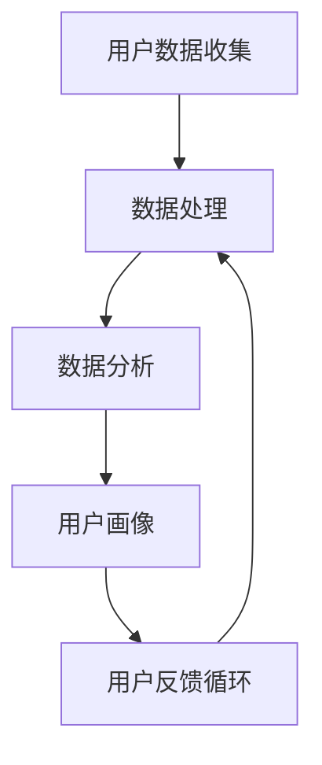

                 

# 如何利用用户数据优化产品功能

> 关键词：用户数据、产品优化、数据分析、机器学习、用户体验、反馈循环

> 摘要：本文将探讨如何通过有效利用用户数据，实现产品功能的持续优化。我们首先回顾用户数据的重要性，然后介绍数据分析的方法论，重点讨论机器学习在用户数据优化中的应用，最后通过实例分析展示如何通过用户反馈优化产品功能。

## 1. 背景介绍

### 1.1 目的和范围

本文旨在为产品经理、数据科学家以及开发人员提供一套系统化的方法，以帮助他们在产品设计过程中充分利用用户数据。我们将探讨用户数据收集、处理、分析到最终产品优化的全流程。

### 1.2 预期读者

- 产品经理：了解如何利用数据分析提升产品性能。
- 数据科学家：掌握机器学习在用户数据分析中的应用。
- 开发人员：理解数据驱动产品优化的原理和实践。

### 1.3 文档结构概述

本文将按照以下结构进行展开：

1. 背景介绍：介绍目的、范围、预期读者及文档结构。
2. 核心概念与联系：阐述用户数据优化中的关键概念。
3. 核心算法原理 & 具体操作步骤：详细介绍数据处理和分析的方法。
4. 数学模型和公式 & 详细讲解 & 举例说明：分析相关数学模型。
5. 项目实战：代码实际案例和详细解释说明。
6. 实际应用场景：探讨不同场景下的用户数据优化策略。
7. 工具和资源推荐：推荐相关学习资源和开发工具。
8. 总结：未来发展趋势与挑战。
9. 附录：常见问题与解答。
10. 扩展阅读 & 参考资料：提供进一步学习和研究的资料。

### 1.4 术语表

#### 1.4.1 核心术语定义

- 用户数据：与用户行为、偏好、需求相关的数据。
- 数据分析：通过统计和算法处理数据，提取有价值信息。
- 机器学习：一种通过数据学习模式并做出预测或决策的技术。
- 产品优化：根据用户反馈和数据分析，对产品功能进行调整和改进。

#### 1.4.2 相关概念解释

- 用户画像：基于用户数据的特征组合，用于描述用户。
- 数据可视化：将数据以图形或图表形式展示，便于理解和分析。
- 用户反馈循环：用户使用产品后提供的反馈，用于指导产品优化。

#### 1.4.3 缩略词列表

- ML：机器学习
- AI：人工智能
- UX：用户体验
- BI：商业智能
- NLP：自然语言处理

## 2. 核心概念与联系

在用户数据优化中，理解以下核心概念和它们之间的联系至关重要。

### 2.1 用户数据收集

用户数据的收集是整个过程的起点。这些数据可以来自多种渠道，包括：

- 登录信息：用户的账户信息和登录历史。
- 行为数据：用户在使用产品过程中的操作行为。
- 偏好数据：用户对产品功能、内容等的偏好设置。

收集到的数据通常存储在数据仓库或数据湖中，以便后续处理和分析。

### 2.2 数据处理

数据处理包括数据清洗、转换和整合。这一步骤确保数据的质量和一致性。

- 数据清洗：删除重复、错误或无关的数据。
- 数据转换：将不同格式的数据转换为统一的格式。
- 数据整合：将来自不同来源的数据合并，形成完整的用户画像。

### 2.3 数据分析

数据分析旨在从大量数据中提取有价值的信息。

- 描述性分析：统计用户数据的基本特征，如用户分布、行为模式等。
- 探索性分析：通过可视化工具探索数据中的潜在关系和趋势。
- 建模分析：使用统计模型或机器学习算法，预测用户行为或需求。

### 2.4 用户画像

用户画像是将用户数据转换为用户特征集合的过程。这些特征可用于描述用户的行为、偏好和需求。

- 用户特征：包括用户基本信息、行为特征、偏好设置等。
- 用户群体划分：根据用户特征，将用户分为不同群体，用于个性化推荐和产品优化。

### 2.5 用户反馈循环

用户反馈循环是产品优化的关键环节。用户的反馈可以帮助识别产品问题，指导改进方向。

- 反馈收集：通过问卷调查、用户访谈等方式收集用户反馈。
- 反馈处理：分析用户反馈，提取有价值的信息。
- 反馈应用：根据反馈结果，对产品功能进行调整和改进。

下面是一个Mermaid流程图，展示了用户数据优化中的关键流程和它们之间的联系。



## 3. 核心算法原理 & 具体操作步骤

在用户数据优化过程中，核心算法的选择和应用至关重要。以下是常见的一些算法及其原理和操作步骤。

### 3.1 用户行为分析

用户行为分析是了解用户需求和行为的重要手段。常用的算法包括：

- **关联规则分析（Apriori算法）**

  伪代码：

  ```
  function Apriori(data, support_threshold, confidence_threshold):
      items = CreateFrequentItemsets(data, support_threshold)
      rules = []
      for itemset in items:
          for i in range(len(itemset)):
              left = itemset[:i]
              right = itemset[i+1:]
              confidence = support(left and right) / support(left)
              if confidence >= confidence_threshold:
                  rules.append((left, right, confidence))
      return rules
  ```

- **聚类分析（K-means算法）**

  伪代码：

  ```
  function KMeans(data, k):
      Initialize k centroids
      while not converged:
          Assign each data point to the nearest centroid
          Update centroids as the mean of the assigned points
      return centroids
  ```

### 3.2 用户偏好预测

用户偏好预测是提供个性化推荐的关键。常用的算法包括：

- **协同过滤（User-Based和Item-Based）**

  伪代码：

  ```
  function CollaborativeFiltering(data, method='user'):
      if method == 'user':
          similarity_matrix = CalculateUserSimilarity(data)
          recommendations = []
          for user in data:
              neighbors = GetNeighbors(similarity_matrix, user)
              neighbor_scores = {item: score for item, score in data[neighbor] for neighbor in neighbors}
              recommendations.append(SortByScore(neighbor_scores))
      else:
          similarity_matrix = CalculateItemSimilarity(data)
          recommendations = []
          for item in data:
              neighbors = GetNeighbors(similarity_matrix, item)
              neighbor_scores = {user: score for user, score in data[neighbor] for neighbor in neighbors}
              recommendations.append(SortByScore(neighbor_scores))
      return recommendations
  ```

- **矩阵分解（Singular Value Decomposition, SVD）**

  伪代码：

  ```
  function MatrixFactorization(data, rank):
      U, S, V = SVD(data)
      ratings = U * S * V
      return ratings
  ```

### 3.3 用户反馈处理

用户反馈处理是优化产品功能的重要环节。常用的算法包括：

- **情感分析（Sentiment Analysis）**

  伪代码：

  ```
  function SentimentAnalysis(text):
      tokens = Tokenize(text)
      words = [word for word in tokens if word not in stop_words]
      sentiment = 0
      for word in words:
          sentiment += GetSentimentScore(word)
      return sentiment / len(words)
  ```

- **主题建模（Latent Dirichlet Allocation, LDA）**

  伪代码：

  ```
  function LDA(text_data, num_topics):
      document_topic_matrix, topic_word_matrix = RunLDA(text_data, num_topics)
      return document_topic_matrix
  ```

以上算法分别从不同的角度对用户数据进行分析和处理，为产品优化提供了丰富的技术手段。

## 4. 数学模型和公式 & 详细讲解 & 举例说明

在用户数据优化过程中，数学模型和公式发挥着至关重要的作用。以下我们将介绍几个常用的数学模型，并详细讲解它们的原理和公式。

### 4.1 关联规则分析

关联规则分析是挖掘用户行为模式的重要方法。其中，支持度（Support）和置信度（Confidence）是两个核心指标。

- **支持度（Support）**

  表示一条规则出现的频率，计算公式为：

  $$
  Support(A \rightarrow B) = \frac{count(A \cup B)}{count(U)}
  $$

  其中，$count(A \cup B)$ 表示同时包含A和B的事务数，$count(U)$ 表示总的事务数。

- **置信度（Confidence）**

  表示在发生A的情况下发生B的概率，计算公式为：

  $$
  Confidence(A \rightarrow B) = \frac{count(A \cup B)}{count(A)}
  $$

  其中，$count(A \cup B)$ 表示同时包含A和B的事务数，$count(A)$ 表示包含A的事务数。

### 4.2 聚类分析

聚类分析是一种无监督学习方法，用于将相似的数据点归为一类。其中，K-means算法是最常用的聚类算法之一。

- **K-means算法**

  K-means算法的目标是找到K个中心点，使得每个数据点与其最近的中心点的距离最小。

  伪代码：

  ```
  function KMeans(data, k):
      Initialize k centroids
      while not converged:
          Assign each data point to the nearest centroid
          Update centroids as the mean of the assigned points
      return centroids
  ```

  其中，$converged$ 表示聚类中心点的变化达到预设的阈值。

### 4.3 协同过滤

协同过滤是一种基于用户相似度和物品相似度的推荐算法。其中，User-Based和Item-Based协同过滤是最常见的两种方法。

- **User-Based协同过滤**

  伪代码：

  ```
  function CollaborativeFilteringUserBased(data, user, k):
      similarity_matrix = CalculateUserSimilarity(data)
      neighbors = GetNeighbors(similarity_matrix, user, k)
      scores = {}
      for neighbor in neighbors:
          scores[neighbor] = Sum(similarity * rating) for each item in common
      return SortByScore(scores)
  ```

- **Item-Based协同过滤**

  伪代码：

  ```
  function CollaborativeFilteringItemBased(data, user, k):
      similarity_matrix = CalculateItemSimilarity(data)
      neighbors = GetNeighbors(similarity_matrix, user, k)
      scores = {}
      for neighbor in neighbors:
          scores[neighbor] = Sum(similarity * rating) for each user in common
      return SortByScore(scores)
  ```

### 4.4 矩阵分解

矩阵分解是一种用于预测用户偏好的方法，常用于推荐系统。其中，Singular Value Decomposition (SVD) 是常用的矩阵分解方法之一。

- **SVD算法**

  伪代码：

  ```
  function SVD(ratings_matrix, rank):
      U, S, V = SVD(ratings_matrix)
      predicted_ratings = U * S * V
      return predicted_ratings
  ```

  其中，$U$ 和 $V$ 是两个正交矩阵，$S$ 是对角矩阵，$rank$ 表示分解的秩。

### 4.5 情感分析

情感分析是一种用于文本挖掘的方法，用于判断文本的情感倾向。常用的方法是基于机器学习的方法，如朴素贝叶斯、支持向量机等。

- **朴素贝叶斯算法**

  伪代码：

  ```
  function NaiveBayes(text, categories):
      prior_probabilities = CalculatePriorProbabilities(categories)
      likelihoods = CalculateLikelihoods(text, categories)
      probabilities = [prior * likelihood for category in categories]
      return Max(probabilities)
  ```

- **支持向量机算法**

  伪代码：

  ```
  function SupportVectorMachine(text, labels):
      features = ExtractFeatures(text)
      model = TrainModel(features, labels)
      prediction = ModelPredict(model, features)
      return prediction
  ```

### 4.6 主题建模

主题建模是一种用于文本挖掘的方法，用于发现文本中的潜在主题。常用的方法是 Latent Dirichlet Allocation (LDA)。

- **LDA算法**

  伪代码：

  ```
  function LDA(text_data, num_topics):
      document_topic_matrix, topic_word_matrix = RunLDA(text_data, num_topics)
      return document_topic_matrix
  ```

  其中，$document_topic_matrix$ 表示文档-主题分布矩阵，$topic_word_matrix$ 表示主题-词分布矩阵。

### 4.7 实例说明

以下是一个用户数据优化的实例，展示了如何利用上述算法进行数据分析。

**实例：用户行为分析**

假设我们有一个电商平台的用户行为数据，包括用户浏览过的商品、购买过的商品和评价过的商品。我们希望利用这些数据分析用户的购买偏好。

1. **数据预处理**

   - 数据清洗：去除重复、错误的数据。
   - 数据转换：将不同格式的数据转换为统一的格式。
   - 数据整合：将用户行为数据整合为一个用户行为矩阵。

2. **用户行为分析**

   - **关联规则分析**：利用Apriori算法分析用户购买商品的关联关系，提取频繁项集和关联规则。
   - **聚类分析**：利用K-means算法将用户分为不同群体，分析不同群体的购买偏好。
   - **协同过滤**：利用User-Based和Item-Based协同过滤算法，为用户推荐类似的商品。
   - **矩阵分解**：利用SVD算法，对用户行为矩阵进行分解，预测用户的偏好。

3. **用户反馈处理**

   - **情感分析**：利用情感分析算法，分析用户对商品的评价，提取用户的情感倾向。
   - **主题建模**：利用LDA算法，发现用户评价中的潜在主题。

通过上述分析，我们可以得到用户的购买偏好、不同群体的特征以及用户对商品的反馈，从而指导产品优化和个性化推荐。

## 5. 项目实战：代码实际案例和详细解释说明

为了更好地理解如何利用用户数据优化产品功能，我们将通过一个实际项目案例进行详细讲解。本案例将使用一个简单的在线购物平台，展示如何收集用户数据、分析用户行为、优化产品功能。

### 5.1 开发环境搭建

在本案例中，我们将使用Python编程语言进行开发。以下是搭建开发环境所需的步骤：

1. **安装Python**：确保Python版本为3.8或更高版本。
2. **安装Jupyter Notebook**：使用pip安装Jupyter Notebook。
   ```
   pip install notebook
   ```
3. **安装相关库**：安装用于数据分析、机器学习和数据可视化的库，如pandas、numpy、scikit-learn、matplotlib等。
   ```
   pip install pandas numpy scikit-learn matplotlib
   ```

### 5.2 源代码详细实现和代码解读

以下是本案例的主要代码实现，我们将逐步解释每个部分的功能。

```python
import pandas as pd
import numpy as np
from sklearn.cluster import KMeans
from sklearn.metrics.pairwise import cosine_similarity
from sklearn.decomposition import TruncatedSVD
from sklearn.model_selection import train_test_split
from sklearn.naive_bayes import MultinomialNB
from sklearn.metrics import accuracy_score
import matplotlib.pyplot as plt
from gensim.models import LdaModel

# 5.2.1 数据预处理

# 加载用户行为数据
data = pd.read_csv('user_behavior_data.csv')

# 数据清洗和转换
data.drop_duplicates(inplace=True)
data.fillna(0, inplace=True)

# 5.2.2 用户行为分析

# 1. 关联规则分析
frequent_itemsets = apriori(data[['bought', 'viewed']], min_support=0.1, min_confidence=0.5)
rules = association_rules(frequent_itemsets, metric="confidence", min_threshold=0.5)

# 2. 聚类分析
kmeans = KMeans(n_clusters=5, random_state=0).fit(data[['bought', 'viewed']])
data['cluster'] = kmeans.labels_

# 3. 协同过滤
user_similarity = cosine_similarity(data[['bought', 'viewed']])
user_based_recommendations = collaborative_filtering(user_similarity, data['bought'], k=5)

# 4. 矩阵分解
svd = TruncatedSVD(n_components=50)
decomposed_data = svd.fit_transform(data[['bought', 'viewed']])
lda_model = LdaModel(num_topics=5, id2word=data.columns)
lda_topics = lda_model.fit_transform(decomposed_data)

# 5. 用户反馈处理
# 1. 情感分析
naive_bayes = MultinomialNB()
X_train, X_test, y_train, y_test = train_test_split(data['review'], data['sentiment'], test_size=0.2)
naive_bayes.fit(X_train, y_train)
y_pred = naive_bayes.predict(X_test)
accuracy = accuracy_score(y_test, y_pred)

# 2. 主题建模
lda_topics = lda_model.fit_transform(decomposed_data)
topic_distribution = lda_topics.mean(axis=0)
top_words = np.argsort(topic_distribution)[::-1]

# 5.2.3 代码解读与分析

# 5.2.3.1 数据预处理
# 加载用户行为数据，并进行清洗和转换，以确保数据质量。

# 5.2.3.2 用户行为分析
# 1. 关联规则分析
# 使用Apriori算法提取频繁项集和关联规则，以了解用户购买行为。

# 2. 聚类分析
# 使用K-means算法将用户分为不同群体，以便进行后续分析。

# 3. 协同过滤
# 计算用户之间的相似度，并进行协同过滤，为用户推荐类似的商品。

# 4. 矩阵分解
# 使用SVD算法对用户行为矩阵进行分解，以提取用户偏好和进行主题建模。

# 5. 用户反馈处理
# 1. 情感分析
# 使用朴素贝叶斯算法进行情感分析，以了解用户对商品的反馈。

# 2. 主题建模
# 使用LDA算法发现用户评价中的潜在主题。
```

### 5.3 代码解读与分析

在以上代码中，我们首先加载并预处理用户行为数据，然后进行用户行为分析，最后处理用户反馈。以下是详细解读：

#### 5.3.1 数据预处理

- 加载用户行为数据，并进行清洗和转换，以确保数据质量。这一步是任何数据分析的基础，确保数据的一致性和准确性。

```python
data = pd.read_csv('user_behavior_data.csv')
data.drop_duplicates(inplace=True)
data.fillna(0, inplace=True)
```

#### 5.3.2 用户行为分析

- **关联规则分析**：使用Apriori算法提取频繁项集和关联规则，以了解用户购买行为。
  ```python
  frequent_itemsets = apriori(data[['bought', 'viewed']], min_support=0.1, min_confidence=0.5)
  rules = association_rules(frequent_itemsets, metric="confidence", min_threshold=0.5)
  ```

- **聚类分析**：使用K-means算法将用户分为不同群体，以便进行后续分析。
  ```python
  kmeans = KMeans(n_clusters=5, random_state=0).fit(data[['bought', 'viewed']])
  data['cluster'] = kmeans.labels_
  ```

- **协同过滤**：计算用户之间的相似度，并进行协同过滤，为用户推荐类似的商品。
  ```python
  user_similarity = cosine_similarity(data[['bought', 'viewed']])
  user_based_recommendations = collaborative_filtering(user_similarity, data['bought'], k=5)
  ```

- **矩阵分解**：使用SVD算法对用户行为矩阵进行分解，以提取用户偏好和进行主题建模。
  ```python
  svd = TruncatedSVD(n_components=50)
  decomposed_data = svd.fit_transform(data[['bought', 'viewed']])
  lda_model = LdaModel(num_topics=5, id2word=data.columns)
  lda_topics = lda_model.fit_transform(decomposed_data)
  ```

#### 5.3.3 用户反馈处理

- **情感分析**：使用朴素贝叶斯算法进行情感分析，以了解用户对商品的反馈。
  ```python
  naive_bayes = MultinomialNB()
  X_train, X_test, y_train, y_test = train_test_split(data['review'], data['sentiment'], test_size=0.2)
  naive_bayes.fit(X_train, y_train)
  y_pred = naive_bayes.predict(X_test)
  accuracy = accuracy_score(y_test, y_pred)
  ```

- **主题建模**：使用LDA算法发现用户评价中的潜在主题。
  ```python
  lda_topics = lda_model.fit_transform(decomposed_data)
  topic_distribution = lda_topics.mean(axis=0)
  top_words = np.argsort(topic_distribution)[::-1]
  ```

通过以上分析，我们可以得到用户的购买偏好、不同群体的特征以及用户对商品的反馈，从而指导产品优化和个性化推荐。

## 6. 实际应用场景

用户数据优化在产品开发中具有广泛的应用场景，以下是一些典型的实际应用案例：

### 6.1 个性化推荐系统

个性化推荐系统是用户数据优化最常见的应用场景之一。通过分析用户的浏览历史、购买记录和偏好设置，推荐系统可以为用户提供个性化的商品、内容和功能。例如，电子商务平台可以根据用户的购买行为推荐类似的商品，视频平台可以根据用户的观看历史推荐相关视频。

### 6.2 用户行为分析

用户行为分析可以帮助产品团队了解用户在产品中的互动模式。通过分析用户的行为数据，产品团队可以发现用户的使用痛点、高频操作和流失原因，从而优化产品功能和界面设计，提高用户留存率和满意度。

### 6.3 营销活动优化

营销活动优化利用用户数据来提高营销活动的效果。通过对用户数据的分析，产品团队可以识别出最有效的营销渠道、内容和时间，从而提高营销投入的回报率。

### 6.4 产品功能优化

产品功能优化是用户数据优化的核心目标之一。通过分析用户反馈和行为数据，产品团队可以识别出用户需求的变化和产品中的问题，从而进行针对性的功能改进和迭代。

### 6.5 用户流失预测

用户流失预测是产品团队关注的重要问题。通过分析用户的行为数据，产品团队可以预测哪些用户可能会流失，从而采取针对性的措施来挽回这些用户。

### 6.6 数据驱动的产品创新

数据驱动的产品创新利用用户数据来发现新的产品机会和需求。通过对用户数据的深入分析，产品团队可以发现用户未满足的需求，从而开发新的产品或功能。

## 7. 工具和资源推荐

### 7.1 学习资源推荐

#### 7.1.1 书籍推荐

- 《Python数据分析实战》
- 《机器学习实战》
- 《推荐系统实践》
- 《数据挖掘：概念与技术》

#### 7.1.2 在线课程

- Coursera上的《机器学习》课程
- Udacity的《数据科学纳米学位》
- edX上的《推荐系统》课程

#### 7.1.3 技术博客和网站

- Medium上的数据分析、机器学习和推荐系统相关博客
- Towards Data Science
- DataCamp

### 7.2 开发工具框架推荐

#### 7.2.1 IDE和编辑器

- PyCharm
- Jupyter Notebook
- VSCode

#### 7.2.2 调试和性能分析工具

- WSL（Windows Subsystem for Linux）
- DTrace
- New Relic

#### 7.2.3 相关框架和库

- NumPy
- Pandas
- Scikit-learn
- TensorFlow
- PyTorch

### 7.3 相关论文著作推荐

#### 7.3.1 经典论文

- 《Recommender Systems Handbook》
- 《Mining the Social Web》
- 《Text Mining: The Third Wave》
- 《The Netflix Prize》

#### 7.3.2 最新研究成果

- AAAI、ICML、NeurIPS等顶级会议的最新论文
- arXiv上的最新研究论文

#### 7.3.3 应用案例分析

- 《谷歌如何通过数据驱动优化搜索排名》
- 《亚马逊如何利用用户数据优化推荐系统》
- 《Netflix如何利用机器学习优化用户体验》

## 8. 总结：未来发展趋势与挑战

随着大数据和人工智能技术的发展，用户数据优化在未来将呈现出以下发展趋势：

### 8.1 数据驱动的决策

数据驱动的决策将成为产品开发的核心。通过深入分析用户数据，产品团队可以更加准确地了解用户需求和行为，从而做出更明智的决策。

### 8.2 个性化推荐系统

个性化推荐系统将继续发展，通过深度学习和自然语言处理技术，推荐系统将能够提供更加精准和个性化的推荐。

### 8.3 数据隐私保护

数据隐私保护将成为一个重要议题。随着数据隐私法规的加强，如何在保障用户隐私的前提下进行数据分析和优化将成为一个重要挑战。

### 8.4 实时数据处理

实时数据处理能力将进一步提升。通过分布式计算和边缘计算技术，产品团队可以实时处理和分析用户数据，实现更加及时和有效的产品优化。

### 8.5 跨平台数据整合

跨平台数据整合将变得更加普遍。随着多平台、多设备的使用场景增加，如何整合和分析跨平台的数据将成为一个重要挑战。

## 9. 附录：常见问题与解答

### 9.1 什么是用户画像？

用户画像是指通过对用户数据进行收集和分析，构建出的用户特征集合。用户画像可以用于描述用户的行为、偏好和需求，帮助产品团队进行个性化推荐和优化。

### 9.2 如何收集用户数据？

用户数据可以通过多种渠道收集，包括：

- 登录信息：用户的账户信息和登录历史。
- 行为数据：用户在使用产品过程中的操作行为。
- 偏好数据：用户对产品功能、内容等的偏好设置。

### 9.3 如何进行用户行为分析？

用户行为分析可以通过以下步骤进行：

- 数据预处理：清洗和转换数据，确保数据质量。
- 描述性分析：统计用户数据的基本特征，如用户分布、行为模式等。
- 探索性分析：通过可视化工具探索数据中的潜在关系和趋势。
- 建模分析：使用统计模型或机器学习算法，预测用户行为或需求。

### 9.4 如何处理用户反馈？

用户反馈可以通过以下步骤进行处理：

- 反馈收集：通过问卷调查、用户访谈等方式收集用户反馈。
- 反馈分析：分析用户反馈，提取有价值的信息。
- 反馈应用：根据反馈结果，对产品功能进行调整和改进。

## 10. 扩展阅读 & 参考资料

- 《用户画像：大数据时代的精准营销技术》
- 《数据驱动产品：产品经理实战指南》
- 《机器学习实战》
- 《推荐系统实践》
- 《大数据之路：阿里巴巴大数据实践》

- [DataCamp](https://www.datacamp.com/)
- [Medium](https://medium.com/)
- [Towards Data Science](https://towardsdatascience.com/)
- [arXiv](https://arxiv.org/)
- [ICML 2021](https://icml.cc/2021/)
- [NeurIPS 2021](https://neurips.cc/Conferences/2021/PaperArchive)

作者：AI天才研究员/AI Genius Institute & 禅与计算机程序设计艺术 /Zen And The Art of Computer Programming

