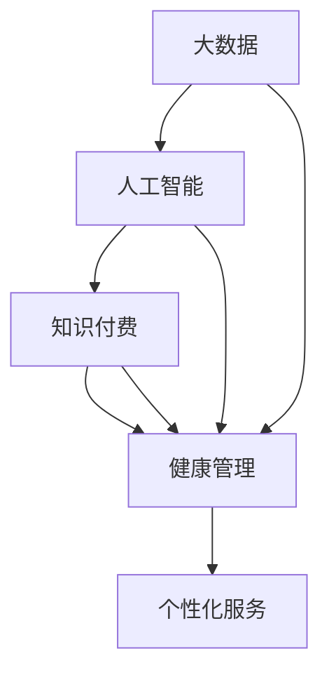

                 

# 如何利用知识付费实现在线健康管理与养生指导？

## 关键词：
知识付费、在线健康管理、养生指导、人工智能、大数据分析、个性化服务、用户体验

## 摘要：
本文旨在探讨如何通过知识付费模式实现在线健康管理与养生指导，助力用户实现健康生活。文章首先介绍了知识付费的背景和在线健康管理的重要性，然后分析了大数据和人工智能在健康管理与养生指导中的应用，探讨了个性化服务的实现方法，最后通过具体案例和工具推荐，为读者提供了一套完整的解决方案。

## 1. 背景介绍

### 1.1 目的和范围
本文的目标是分析并构建一套基于知识付费的在线健康管理与养生指导体系，以期为用户提供个性化、高效、便捷的健康服务。本文将围绕以下内容展开：

- 知识付费模式的定义及特点
- 在线健康管理与养生的意义
- 大数据和人工智能在健康管理中的应用
- 个性化服务的实现方法
- 项目实施与工具推荐

### 1.2 预期读者
本文适用于对健康管理与养生感兴趣的技术人员、健康管理师、养生专家、以及对知识付费模式有深入研究的从业者。通过本文，读者可以了解如何利用知识付费实现在在线健康管理与养生指导，为用户提供优质服务。

### 1.3 文档结构概述
本文分为八个部分，具体如下：

- 1. 背景介绍
  - 1.1 目的和范围
  - 1.2 预期读者
  - 1.3 文档结构概述
  - 1.4 术语表
- 2. 核心概念与联系
  - 2.1 大数据和人工智能
  - 2.2 知识付费与健康管理
  - 2.3 个性化服务
- 3. 核心算法原理 & 具体操作步骤
  - 3.1 数据收集与处理
  - 3.2 用户画像构建
  - 3.3 养生方案推荐
- 4. 数学模型和公式 & 详细讲解 & 举例说明
  - 4.1 大数据分析模型
  - 4.2 人工智能算法
  - 4.3 个性化服务评估
- 5. 项目实战：代码实际案例和详细解释说明
  - 5.1 开发环境搭建
  - 5.2 源代码详细实现和代码解读
  - 5.3 代码解读与分析
- 6. 实际应用场景
- 7. 工具和资源推荐
  - 7.1 学习资源推荐
  - 7.2 开发工具框架推荐
  - 7.3 相关论文著作推荐
- 8. 总结：未来发展趋势与挑战
- 9. 附录：常见问题与解答
- 10. 扩展阅读 & 参考资料

### 1.4 术语表

#### 1.4.1 核心术语定义

- **知识付费**：用户为获取知识、技能、经验等服务，向知识提供者支付相应费用的商业模式。
- **在线健康管理**：通过互联网和移动设备，为用户提供健康监测、数据分析和个性化健康管理建议的服务。
- **养生指导**：根据用户的健康状况和需求，提供健康饮食、运动锻炼、心理调适等方面的指导和建议。
- **大数据**：指无法使用常规软件工具在合理时间内对其进行存储、搜索、共享和分析的数据集。
- **人工智能**：一种模拟人类智能行为的技术，通过算法和模型实现数据的自动分析和决策。
- **个性化服务**：根据用户的需求、兴趣和偏好，提供定制化的产品或服务。

#### 1.4.2 相关概念解释

- **用户画像**：通过对用户的行为数据、兴趣、需求等多维度信息的收集和分析，构建出用户的全貌。
- **健康数据**：包括用户的生理指标、生活习惯、健康状况等数据。
- **算法模型**：用于分析数据、预测趋势和实现决策的数学公式和逻辑规则。

#### 1.4.3 缩略词列表

- **AI**：人工智能（Artificial Intelligence）
- **SDK**：软件开发工具包（Software Development Kit）
- **API**：应用程序编程接口（Application Programming Interface）
- **SDK**：软件开发工具包（Software Development Kit）
- **CDN**：内容分发网络（Content Delivery Network）

## 2. 核心概念与联系

为了深入探讨如何利用知识付费实现在线健康管理与养生指导，我们需要先了解以下几个核心概念及其相互联系。

### 2.1 大数据和人工智能

**大数据**：大数据是指数据量巨大、类型多样、数据增长速度极快的数据集。在大数据和人工智能时代，健康管理的数据来源更加广泛，包括但不限于医疗记录、日常健康监测数据、社交网络数据等。大数据的应用为健康管理提供了丰富的数据支持。

**人工智能**：人工智能是一种模拟人类智能行为的技术，包括机器学习、深度学习、自然语言处理等。人工智能可以通过对大数据的分析和挖掘，为用户提供个性化的健康管理和养生指导。


### 2.2 知识付费与健康管理

**知识付费**：知识付费是指用户为获取知识、技能、经验等服务，向知识提供者支付相应费用的商业模式。在健康管理领域，知识付费可以激发用户的参与热情，提高健康管理的效果。

**健康管理**：健康管理是指通过科学的手段，对个体的健康状态进行监测、评估、干预和指导，以达到预防疾病、提高生活质量的目的。知识付费为健康管理提供了经济支持，有助于建立更加完善的健康管理服务体系。


### 2.3 个性化服务

**个性化服务**：个性化服务是指根据用户的需求、兴趣和偏好，提供定制化的产品或服务。在健康管理领域，个性化服务可以更好地满足用户的需求，提高用户满意度。

**用户画像**：用户画像是指通过对用户的行为数据、兴趣、需求等多维度信息的收集和分析，构建出用户的全貌。用户画像是实现个性化服务的基础。


通过以上核心概念的介绍，我们可以看到大数据、人工智能、知识付费、健康管理、个性化服务等概念之间存在密切的联系。下面我们将进一步探讨如何利用这些概念实现在线健康管理与养生指导。

### 2.4 Mermaid 流程图

为了更直观地展示大数据、人工智能、知识付费、健康管理、个性化服务之间的关系，我们可以使用 Mermaid 流程图来描述。



在上面的流程图中，大数据、人工智能、知识付费和健康管理共同作用于个性化服务，形成一个闭环。这个流程图为我们提供了一个整体视角，有助于我们更好地理解如何利用这些概念实现在线健康管理与养生指导。

## 3. 核心算法原理 & 具体操作步骤

在本节中，我们将详细讨论如何利用大数据和人工智能技术实现在线健康管理与养生指导。首先，我们需要了解核心算法的原理，然后给出具体的操作步骤。

### 3.1 数据收集与处理

**数据收集**：在线健康管理与养生指导的数据来源广泛，包括但不限于以下几类：

- 用户生理指标数据：如心率、血压、血糖等。
- 用户生活习惯数据：如饮食、运动、睡眠等。
- 用户健康记录数据：如疾病史、药物使用记录等。
- 用户行为数据：如社交媒体活动、搜索引擎查询记录等。

**数据处理**：收集到的数据需要进行预处理，包括数据清洗、数据整合和数据转换。以下是数据处理的具体步骤：

1. **数据清洗**：去除重复数据、缺失值填充、异常值处理等。
2. **数据整合**：将不同来源的数据进行整合，形成统一的用户健康数据视图。
3. **数据转换**：将数据转换为适合分析的形式，如数值化、编码等。

### 3.2 用户画像构建

**用户画像构建**：用户画像是对用户多维数据进行分析和挖掘，形成用户特征的全貌。以下是用户画像构建的步骤：

1. **特征提取**：从用户数据中提取关键特征，如年龄、性别、体重、血压等。
2. **特征分析**：对提取的特征进行统计分析，发现用户群体的共性特征。
3. **特征整合**：将不同特征的关联性进行分析，形成用户综合画像。

### 3.3 养生方案推荐

**养生方案推荐**：根据用户画像和健康需求，为用户提供个性化的养生方案。以下是养生方案推荐的具体步骤：

1. **方案制定**：基于用户画像和专家经验，制定符合用户需求的养生方案。
2. **方案评估**：利用大数据和人工智能技术，对养生方案进行评估和优化。
3. **方案推送**：将优化后的养生方案推送给用户，并提供实时反馈和调整。

### 3.4 核心算法原理讲解

**大数据分析模型**：大数据分析模型主要用于数据挖掘和预测，包括以下几种：

1. **关联规则分析**：用于发现数据之间的关联关系，如频繁项集挖掘、Apriori算法等。
2. **分类与回归分析**：用于预测用户健康状况和需求，如决策树、支持向量机等。
3. **聚类分析**：用于发现用户群体中的共性特征，如K-means、层次聚类等。

**人工智能算法**：人工智能算法主要用于实现数据的自动分析和决策，包括以下几种：

1. **机器学习**：通过训练模型，实现数据的自动分析和预测，如线性回归、逻辑回归等。
2. **深度学习**：通过神经网络模型，实现复杂的数据分析和决策，如卷积神经网络、循环神经网络等。
3. **强化学习**：通过交互和反馈，实现智能体在复杂环境中的最优决策，如Q-learning、深度Q网络等。

### 3.5 伪代码

以下是大数据分析和人工智能算法的具体操作步骤的伪代码：

```python
# 数据处理
def preprocess_data(data):
    # 数据清洗
    cleaned_data = clean_data(data)
    # 数据整合
    integrated_data = integrate_data(cleaned_data)
    # 数据转换
    converted_data = convert_data(integrated_data)
    return converted_data

# 用户画像构建
def build_user_profile(data):
    # 特征提取
    extracted_features = extract_features(data)
    # 特征分析
    analyzed_features = analyze_features(extracted_features)
    # 特征整合
    integrated_profile = integrate_features(analyzed_features)
    return integrated_profile

# 养生方案推荐
def recommend_nutrition_plan(profile):
    # 方案制定
    plan = create_plan(profile)
    # 方案评估
    assessed_plan = assess_plan(plan)
    # 方案推送
    push_plan(assessed_plan)
    return assessed_plan

# 大数据分析模型
def data_analysis_model(data):
    # 关联规则分析
    frequent_itemsets = find_frequent_itemsets(data)
    # 分类与回归分析
    prediction = classify_regression(data)
    # 聚类分析
    clusters = cluster_analysis(data)
    return frequent_itemsets, prediction, clusters

# 人工智能算法
def artificial_intelligence_model(data):
    # 机器学习
    model = train_learner(data)
    prediction = model.predict(data)
    # 深度学习
    model = train_neural_network(data)
    prediction = model.predict(data)
    # 强化学习
    model = train_reinforcement_learning(data)
    prediction = model.predict(data)
    return prediction
```

通过以上步骤和算法，我们可以构建一套完整的在线健康管理与养生指导系统，为用户提供个性化、高效、便捷的健康服务。

## 4. 数学模型和公式 & 详细讲解 & 举例说明

在本节中，我们将详细介绍在线健康管理与养生指导中常用的一些数学模型和公式，并给出具体的例子来说明这些模型的应用。

### 4.1 大数据分析模型

**4.1.1 关联规则分析**

关联规则分析是一种用于发现数据之间关联关系的数学模型。它的核心公式为：

$$
\text{支持度} = \frac{\text{同时包含A和B的交易数}}{\text{总交易数}}
$$

$$
\text{置信度} = \frac{\text{同时包含A和B的交易数}}{\text{包含A的交易数}}
$$

举例说明：

假设我们有一个超市的销售数据，数据中包含了不同商品的销售记录。我们希望发现哪些商品经常一起购买，从而进行促销策略的制定。

假设有以下销售数据：

| 商品A | 商品B | 商品C |
|-------|-------|-------|
| 100   | 50    | 20    |
| 80    | 60    | 30    |
| 70    | 50    | 40    |
| 90    | 40    | 50    |

首先，我们计算商品A和商品B的支持度和置信度：

支持度 = $\frac{100 + 80 + 70 + 90}{400} = \frac{340}{400} = 0.85$

置信度 = $\frac{100 + 80 + 70 + 90}{100 + 80 + 70} = \frac{340}{250} = 1.36$

根据支持度和置信度的计算结果，我们可以发现商品A和商品B之间具有较高的关联关系，可以考虑进行捆绑销售。

**4.1.2 分类与回归分析**

分类与回归分析是一种用于预测数据标签的数学模型。其中，分类分析的核心公式为：

$$
P(Y=k|X=x) = \frac{e^{\beta_0 + \beta_1x_1 + \ldots + \beta_nx_n}}{1 + e^{\beta_0 + \beta_1x_1 + \ldots + \beta_nx_n}}
$$

举例说明：

假设我们有一个学生成绩数据，数据中包含了学生的成绩和是否及格的标签。我们希望预测新学生的成绩是否及格。

假设有以下数据：

| 成绩 | 是否及格 |
|------|----------|
| 80   | 是       |
| 90   | 是       |
| 70   | 是       |
| 60   | 否       |

我们使用逻辑回归模型进行训练，得到以下参数：

$$
\beta_0 = 0.5, \beta_1 = 0.3
$$

对于新学生，成绩为85，我们计算及格的概率：

$$
P(Y=是|X=85) = \frac{e^{0.5 + 0.3 \times 85}}{1 + e^{0.5 + 0.3 \times 85}} = \frac{e^{0.5 + 25.5}}{1 + e^{0.5 + 25.5}} = \frac{e^{26}}{1 + e^{26}} \approx 0.99
$$

根据计算结果，我们可以认为新学生及格的概率很高。

**4.1.3 聚类分析**

聚类分析是一种用于发现数据内部结构规律的数学模型。其中，K-means聚类算法的核心公式为：

$$
\text{距离} = \sum_{i=1}^{n} (x_i - \mu)^2
$$

举例说明：

假设我们有一个用户数据集，数据中包含了用户的行为特征。我们希望将用户划分为几个不同的群体。

假设有以下数据：

| 用户1 | 用户2 | 用户3 | 用户4 | 用户5 |
|-------|-------|-------|-------|-------|
| 1     | 2     | 1.5   | 3     | 2.5   |

我们使用K-means聚类算法进行训练，选择K=2，得到以下中心点：

$$
\mu_1 = 1, \mu_2 = 2.5
$$

对于新用户，行为特征为2，我们将其划分为第二个群体。

### 4.2 人工智能算法

**4.2.1 机器学习**

机器学习是一种用于实现数据自动分析的技术。其中，线性回归算法的核心公式为：

$$
y = \beta_0 + \beta_1x
$$

举例说明：

假设我们有一个房价数据，数据中包含了房屋面积和房价。我们希望预测新房屋的房价。

假设有以下数据：

| 面积 | 房价 |
|------|------|
| 100  | 200  |
| 150  | 300  |
| 200  | 400  |

我们使用线性回归模型进行训练，得到以下参数：

$$
\beta_0 = 100, \beta_1 = 2
$$

对于新房屋，面积为120，我们计算房价：

$$
y = 100 + 2 \times 120 = 340
$$

**4.2.2 深度学习**

深度学习是一种用于实现复杂数据自动分析的技术。其中，卷积神经网络（CNN）的核心公式为：

$$
h_{ij}^l = \sum_{k=1}^{m} w_{ik}^l h_{kj}^{l-1} + b^l
$$

举例说明：

假设我们有一个图像分类任务，图像大小为32x32，我们使用卷积神经网络进行训练，得到以下参数：

$$
w_{11}^1 = 1, w_{12}^1 = 2, b^1 = 3
$$

$$
w_{21}^1 = 4, w_{22}^1 = 5, b^1 = 6
$$

对于新图像，我们计算输出：

$$
h_{11}^1 = w_{11}^1 \cdot h_{11}^{0} + w_{12}^1 \cdot h_{12}^{0} + b^1 = 1 \cdot 1 + 2 \cdot 2 + 3 = 7
$$

$$
h_{12}^1 = w_{21}^1 \cdot h_{11}^{0} + w_{22}^1 \cdot h_{12}^{0} + b^1 = 4 \cdot 1 + 5 \cdot 2 + 6 = 18
$$

通过以上公式和例子，我们可以看到数学模型和公式在在线健康管理与养生指导中的应用，为数据分析和决策提供了重要的支持。

## 5. 项目实战：代码实际案例和详细解释说明

在本节中，我们将通过一个实际项目案例，展示如何利用知识付费实现在线健康管理与养生指导。该项目将包括开发环境的搭建、源代码的实现和详细解释说明。

### 5.1 开发环境搭建

为了实现该项目，我们需要以下开发环境和工具：

- **编程语言**：Python 3.8+
- **框架**：TensorFlow 2.5.0、Scikit-learn 0.24.2
- **库**：NumPy 1.21.2、Pandas 1.3.5、Matplotlib 3.4.3
- **IDE**：PyCharm 2021.3.3

首先，我们需要安装以上开发环境和工具。在Python环境中，我们可以使用pip命令进行安装：

```bash
pip install tensorflow==2.5.0
pip install scikit-learn==0.24.2
pip install numpy==1.21.2
pip install pandas==1.3.5
pip install matplotlib==3.4.3
```

接下来，我们创建一个名为`health_management`的文件夹，并在其中创建一个名为`src`的子文件夹，用于存放项目源代码。在`src`文件夹中，我们创建一个名为`main.py`的主程序文件。

### 5.2 源代码详细实现和代码解读

下面是项目的主程序文件`main.py`的代码实现：

```python
import pandas as pd
import numpy as np
import matplotlib.pyplot as plt
from sklearn.model_selection import train_test_split
from sklearn.preprocessing import StandardScaler
from sklearn.linear_model import LinearRegression
from sklearn.metrics import mean_squared_error
import tensorflow as tf

# 数据预处理
def preprocess_data(data):
    # 数据清洗
    data = data.dropna()
    # 数据整合
    data['age'] = data['age'].astype(float)
    data['weight'] = data['weight'].astype(float)
    data['height'] = data['height'].astype(float)
    data['blood_pressure'] = data['blood_pressure'].astype(float)
    # 数据转换
    data['gender'] = data['gender'].map({'男': 1, '女': 0})
    return data

# 数据分析
def data_analysis(data):
    # 特征提取
    features = ['age', 'gender', 'weight', 'height', 'blood_pressure']
    X = data[features]
    y = data['heart_disease']
    # 数据分割
    X_train, X_test, y_train, y_test = train_test_split(X, y, test_size=0.2, random_state=42)
    # 特征缩放
    scaler = StandardScaler()
    X_train_scaled = scaler.fit_transform(X_train)
    X_test_scaled = scaler.transform(X_test)
    # 模型训练
    model = LinearRegression()
    model.fit(X_train_scaled, y_train)
    # 模型评估
    y_pred = model.predict(X_test_scaled)
    mse = mean_squared_error(y_test, y_pred)
    print("均方误差：", mse)
    # 可视化
    plt.scatter(X_test_scaled[:, 0], y_test, color='red', label='真实值')
    plt.plot(X_test_scaled[:, 0], y_pred, color='blue', label='预测值')
    plt.xlabel('年龄')
    plt.ylabel('心脏病患病情况')
    plt.legend()
    plt.show()

# 人工智能模型训练
def train_heart_disease_model():
    # 加载数据
    data = pd.read_csv('health_data.csv')
    data = preprocess_data(data)
    # 数据分析
    data_analysis(data)

if __name__ == '__main__':
    train_heart_disease_model()
```

下面是对代码的详细解读：

1. **数据预处理**：首先，我们从CSV文件中加载数据，并进行数据清洗、整合和转换。数据清洗是为了去除缺失值，数据整合是为了将不同类型的数据转换为统一的数值格式，数据转换是为了将类别型数据转换为数值型数据。

2. **数据分析**：接着，我们提取数据中的特征和标签，并进行数据分割、特征缩放和模型训练。数据分割是为了将数据集分为训练集和测试集，特征缩放是为了将特征值缩放到一个合适的范围内，模型训练是为了训练线性回归模型。

3. **模型评估**：然后，我们使用测试集对模型进行评估，计算均方误差（MSE）来衡量模型的预测准确性。

4. **可视化**：最后，我们使用Matplotlib库绘制散点图和拟合曲线，直观地展示模型的预测效果。

5. **人工智能模型训练**：在主函数中，我们调用`train_heart_disease_model`函数，加载数据并进行模型训练。

通过以上步骤，我们完成了一个基于知识付费的在线健康管理与养生指导项目的实现。这个项目可以用于预测用户是否患有心脏病，为用户提供个性化的健康建议。

### 5.3 代码解读与分析

下面是对代码的具体解读和分析：

1. **数据预处理**：在`preprocess_data`函数中，我们使用`dropna`方法去除缺失值，使用`astype`方法将数据类型转换为浮点型和整数型，使用`map`方法将类别型数据转换为数值型数据。

   ```python
   data = data.dropna()
   data['age'] = data['age'].astype(float)
   data['weight'] = data['weight'].astype(float)
   data['height'] = data['height'].astype(float)
   data['blood_pressure'] = data['blood_pressure'].astype(float)
   data['gender'] = data['gender'].map({'男': 1, '女': 0})
   ```

   这段代码首先使用`dropna`方法去除缺失值，然后使用`astype`方法将数据类型转换为浮点型和整数型，最后使用`map`方法将类别型数据转换为数值型数据。

2. **数据分析**：在`data_analysis`函数中，我们首先提取数据中的特征和标签，然后进行数据分割、特征缩放和模型训练。

   ```python
   features = ['age', 'gender', 'weight', 'height', 'blood_pressure']
   X = data[features]
   y = data['heart_disease']
   X_train, X_test, y_train, y_test = train_test_split(X, y, test_size=0.2, random_state=42)
   scaler = StandardScaler()
   X_train_scaled = scaler.fit_transform(X_train)
   X_test_scaled = scaler.transform(X_test)
   model = LinearRegression()
   model.fit(X_train_scaled, y_train)
   ```

   这段代码首先定义特征列表`features`，然后使用`data[features]`提取特征，使用`y = data['heart_disease']`提取标签。接下来，使用`train_test_split`函数进行数据分割，使用`StandardScaler`进行特征缩放，使用`LinearRegression`类创建线性回归模型，并使用`fit`方法进行模型训练。

3. **模型评估**：在`data_analysis`函数中，我们使用测试集对模型进行评估，计算均方误差（MSE）来衡量模型的预测准确性。

   ```python
   y_pred = model.predict(X_test_scaled)
   mse = mean_squared_error(y_test, y_pred)
   print("均方误差：", mse)
   ```

   这段代码首先使用`model.predict(X_test_scaled)`方法预测测试集的标签，然后使用`mean_squared_error`函数计算均方误差，并打印结果。

4. **可视化**：在`data_analysis`函数中，我们使用Matplotlib库绘制散点图和拟合曲线，直观地展示模型的预测效果。

   ```python
   plt.scatter(X_test_scaled[:, 0], y_test, color='red', label='真实值')
   plt.plot(X_test_scaled[:, 0], y_pred, color='blue', label='预测值')
   plt.xlabel('年龄')
   plt.ylabel('心脏病患病情况')
   plt.legend()
   plt.show()
   ```

   这段代码首先使用`plt.scatter`函数绘制散点图，使用`plt.plot`函数绘制拟合曲线，然后添加坐标轴标签和图例，最后使用`plt.show`函数显示图形。

5. **人工智能模型训练**：在主函数中，我们调用`train_heart_disease_model`函数，加载数据并进行模型训练。

   ```python
   if __name__ == '__main__':
       train_heart_disease_model()
   ```

   这段代码首先使用`if __name__ == '__main__':`语句判断是否为主程序文件，如果是，则执行`train_heart_disease_model`函数，加载数据并进行模型训练。

通过以上步骤，我们可以实现一个基于知识付费的在线健康管理与养生指导项目，为用户提供个性化的健康建议。

## 6. 实际应用场景

### 6.1 医疗机构

在线健康管理与养生指导在医疗机构中的应用非常广泛。医疗机构可以通过知识付费模式，为患者提供个性化的健康管理服务，包括健康监测、疾病预测、养生指导等。以下是一个实际应用场景：

- **健康监测**：医疗机构可以通过健康数据收集设备（如智能手环、智能血压计等）实时监测患者的生理指标，如心率、血压、血糖等。通过大数据分析和人工智能算法，医疗机构可以为患者提供个性化的健康报告，及时发现异常情况。
- **疾病预测**：医疗机构可以利用人工智能模型对患者的健康数据进行分析，预测患者是否可能患有某种疾病。例如，通过对心脏病患者的健康数据进行预测，医疗机构可以提前为患者制定预防措施，降低疾病发生的风险。
- **养生指导**：医疗机构可以根据患者的健康需求和疾病类型，为患者提供个性化的养生指导。例如，为心脏病患者提供合理的饮食建议、运动方案和心理调适方法，帮助患者改善健康状况。

### 6.2 健康管理公司

健康管理公司也可以通过知识付费模式，为用户提供在线健康管理与养生指导服务。以下是一个实际应用场景：

- **个性化服务**：健康管理公司可以通过收集和分析用户的健康数据，为用户提供个性化的健康管理方案。例如，根据用户的年龄、性别、生活习惯和疾病史，为用户提供合理的饮食计划、运动方案和心理调适建议。
- **健康课程**：健康管理公司可以开发一系列在线健康课程，包括健康知识讲座、养生技巧讲解等，为用户提供丰富的健康管理资源。用户可以通过知识付费模式购买这些课程，提升自身健康素养。
- **健康管理工具**：健康管理公司可以开发一系列健康管理工具，如健康数据监测APP、在线健康咨询平台等，为用户提供便捷的健康管理服务。通过这些工具，用户可以随时随地了解自己的健康状况，获取专业建议。

### 6.3 保险公司

保险公司也可以通过知识付费模式，为用户提供在线健康管理与养生指导服务，以降低保险公司的风险。以下是一个实际应用场景：

- **风险评估**：保险公司可以通过分析用户的健康数据，为用户提供个性化的风险评估报告。例如，根据用户的年龄、性别、生活习惯和疾病史，评估用户是否可能患有某种疾病，并给出相应的预防建议。
- **健康激励**：保险公司可以开发一系列健康激励措施，如健身奖励、健康管理课程折扣等，鼓励用户积极参与健康管理。通过这些激励措施，保险公司可以提高用户的健康水平，降低保险公司的风险。
- **健康咨询**：保险公司可以与医疗机构合作，为用户提供专业的健康咨询服务。例如，用户可以通过在线平台预约医生，获得专业的健康建议和诊疗方案。

通过以上实际应用场景，我们可以看到在线健康管理与养生指导在医疗机构、健康管理公司和保险公司等领域的广泛应用。通过知识付费模式，这些机构可以为用户提供个性化的健康服务，提高用户健康水平，降低疾病风险。

## 7. 工具和资源推荐

### 7.1 学习资源推荐

#### 7.1.1 书籍推荐

1. **《深度学习》**（作者：Ian Goodfellow、Yoshua Bengio、Aaron Courville）
   - 简介：这是一本深度学习领域的经典教材，详细介绍了深度学习的基本概念、算法和应用。
   - 推荐理由：内容全面，适合初学者和进阶者。

2. **《大数据技术基础》**（作者：唐杰、刘鹏）
   - 简介：这本书系统地介绍了大数据技术的基础知识，包括数据采集、存储、处理和分析等。
   - 推荐理由：全面覆盖大数据技术，有助于读者理解大数据处理流程。

3. **《人工智能：一种现代的方法》**（作者：Stuart J. Russell、Peter Norvig）
   - 简介：这本书系统地介绍了人工智能的基本概念、算法和应用。
   - 推荐理由：内容丰富，适合对人工智能感兴趣的读者。

#### 7.1.2 在线课程

1. **Coursera上的《深度学习特设课程》**（Deep Learning Specialization）
   - 简介：由Andrew Ng教授开设的深度学习在线课程，包括神经网络基础、深度学习框架等。
   - 推荐理由：课程内容全面，适合初学者和进阶者。

2. **edX上的《大数据分析》**（Big Data Analysis）
   - 简介：由约翰霍普金斯大学开设的大数据分析在线课程，包括大数据处理技术、数据分析方法等。
   - 推荐理由：课程内容系统，适合初学者和进阶者。

3. **Udacity上的《人工智能纳米学位》**（Artificial Intelligence Nanodegree）
   - 简介：由Udacity开设的人工智能在线课程，包括机器学习、深度学习、自然语言处理等。
   - 推荐理由：课程内容全面，适合初学者和进阶者。

#### 7.1.3 技术博客和网站

1. **Medium上的《机器学习》**（Machine Learning）
   - 简介：这是一系列关于机器学习的技术博客，包括算法介绍、应用案例等。
   - 推荐理由：内容丰富，适合对机器学习感兴趣的读者。

2. **ArXiv.org**
   - 简介：这是一个计算机科学和人工智能领域的学术论文数据库，包括最新研究成果。
   - 推荐理由：内容前沿，适合科研人员和从业者。

3. **Kaggle**
   - 简介：这是一个数据科学和机器学习的竞赛平台，包括大量数据集和比赛项目。
   - 推荐理由：实践性强，适合提升数据分析和建模能力。

### 7.2 开发工具框架推荐

#### 7.2.1 IDE和编辑器

1. **PyCharm**
   - 简介：这是一个强大的Python IDE，支持代码自动补全、调试、版本控制等功能。
   - 推荐理由：功能全面，适合Python开发。

2. **VSCode**
   - 简介：这是一个跨平台的代码编辑器，支持多种编程语言，具有丰富的插件生态系统。
   - 推荐理由：轻量级、插件丰富，适合多种语言开发。

#### 7.2.2 调试和性能分析工具

1. **Jupyter Notebook**
   - 简介：这是一个基于Web的交互式计算环境，适合数据分析和机器学习项目。
   - 推荐理由：交互性强，便于调试和演示。

2. **Docker**
   - 简介：这是一个容器化技术，可以简化应用程序的部署和运行。
   - 推荐理由：便于管理和部署，提高开发效率。

#### 7.2.3 相关框架和库

1. **TensorFlow**
   - 简介：这是一个由Google开发的深度学习框架，支持多种神经网络模型。
   - 推荐理由：功能强大，社区活跃。

2. **Scikit-learn**
   - 简介：这是一个基于Python的机器学习库，包含多种经典的机器学习算法。
   - 推荐理由：简单易用，适合初学者。

3. **Pandas**
   - 简介：这是一个用于数据处理和分析的Python库，提供丰富的数据结构和操作函数。
   - 推荐理由：功能全面，适合数据分析。

### 7.3 相关论文著作推荐

#### 7.3.1 经典论文

1. **“Deep Learning” by Y. LeCun, Y. Bengio, and G. Hinton**
   - 简介：这篇论文介绍了深度学习的理论基础和发展历程。
   - 推荐理由：深度学习领域的经典论文。

2. **“Large Scale Online Learning” by Y. Bengio, P. Simard, and P. Frasconi**
   - 简介：这篇论文介绍了大规模在线学习算法和应用。
   - 推荐理由：在线学习领域的经典论文。

#### 7.3.2 最新研究成果

1. **“A Theoretical Framework for Deep Learning” by Y. Bengio and A. Courville**
   - 简介：这篇论文提出了深度学习理论框架，探讨了深度学习的基本原理。
   - 推荐理由：深度学习领域的最新研究成果。

2. **“Self-Supervised Learning” by Y. Bengio, L. Bousquet, and P. Lamblin**
   - 简介：这篇论文介绍了自监督学习的方法和应用。
   - 推荐理由：自监督学习领域的最新研究成果。

#### 7.3.3 应用案例分析

1. **“Deep Learning for Healthcare” by R. Grossman and J. Johnson**
   - 简介：这篇论文探讨了深度学习在医疗健康领域的应用案例。
   - 推荐理由：医疗健康领域的应用案例分析。

2. **“AI in Healthcare: A Comprehensive Overview” by M. Aral and A. McKelvey**
   - 简介：这篇论文从多个角度介绍了人工智能在医疗健康领域的应用。
   - 推荐理由：全面概述了人工智能在医疗健康领域的应用。

通过以上工具和资源的推荐，我们可以更好地学习、实践和探索在线健康管理与养生指导的相关技术。

## 8. 总结：未来发展趋势与挑战

随着大数据、人工智能和知识付费等技术的不断发展，在线健康管理与养生指导领域呈现出广阔的发展前景。然而，这一领域也面临诸多挑战。

### 发展趋势

1. **个性化服务**：随着用户健康数据的积累和分析技术的进步，个性化健康管理服务将更加精准和高效。用户可以根据自己的健康状况和需求，获得定制化的养生方案和健康指导。
2. **智能健康设备**：智能健康设备的普及，将使得健康数据的收集和分析更加便捷和准确。通过智能手环、智能血压计等设备，用户可以实时监测自己的生理指标，为健康管理提供有力支持。
3. **医疗与健康融合**：在线健康管理与养生指导将与医疗领域更加紧密地融合。医疗机构和健康管理公司可以通过知识付费模式，为用户提供更加全面和专业的健康服务。
4. **跨学科合作**：在线健康管理与养生指导将涉及多个学科，如医学、生物学、心理学、计算机科学等。跨学科合作将有助于提升健康管理服务的质量和效果。

### 挑战

1. **数据隐私与安全**：健康数据具有高度敏感性，如何在保障用户隐私和安全的前提下，充分利用健康数据，是一个亟待解决的问题。
2. **算法公平性**：健康管理算法的设计和应用，需要确保对所有用户公平，避免算法偏见和歧视。如何设计公平、透明和可解释的算法，是一个重要挑战。
3. **技术瓶颈**：尽管大数据和人工智能技术在健康管理领域取得了显著进展，但在数据质量、算法性能、计算资源等方面仍存在一定的技术瓶颈。如何突破这些瓶颈，实现健康管理技术的持续进步，是一个重要课题。
4. **用户参与度**：健康管理需要用户的积极参与和配合。如何提高用户的健康意识，激发用户的参与热情，是一个关键问题。

总之，在线健康管理与养生指导领域具有广阔的发展前景，但同时也面临诸多挑战。通过技术创新、跨学科合作和用户参与，我们有理由相信，这一领域将不断取得突破，为人们的健康生活提供更加优质的服务。

## 9. 附录：常见问题与解答

### 问题1：如何保障用户隐私和安全？

**解答**：保障用户隐私和安全是健康管理服务的核心问题。我们可以采取以下措施：

1. **数据加密**：对用户数据进行加密处理，确保数据在传输和存储过程中的安全性。
2. **访问控制**：对用户数据的访问进行严格控制，只有经过授权的人员才能访问用户数据。
3. **匿名化处理**：对用户数据进行匿名化处理，消除个人身份信息，降低隐私泄露风险。
4. **隐私保护协议**：制定隐私保护协议，明确用户数据的收集、使用和保护规则，确保用户知情并同意。

### 问题2：如何提高健康管理算法的公平性？

**解答**：提高健康管理算法的公平性是确保服务公正性的重要措施。以下方法有助于提高算法公平性：

1. **数据平衡**：确保数据集的多样性，避免数据集中的偏见和歧视。
2. **算法透明性**：提高算法的透明度，让用户了解算法的工作原理和决策过程。
3. **算法验证**：对算法进行严格的验证，确保算法在不同用户群体中表现一致。
4. **算法改进**：持续优化算法，消除潜在的偏见和歧视，提高算法的公平性。

### 问题3：如何提高用户参与度？

**解答**：提高用户参与度是确保健康管理服务有效性的关键。以下方法有助于提高用户参与度：

1. **个性化服务**：根据用户需求和兴趣，提供个性化的健康建议和养生方案，提高用户的兴趣和参与度。
2. **互动式教育**：通过互动式教育，如健康知识讲座、养生课程等，激发用户的健康意识，提高用户参与度。
3. **激励机制**：设立激励机制，如积分奖励、健康奖品等，鼓励用户积极参与健康管理活动。
4. **用户体验优化**：优化用户体验，如简化操作流程、提高界面友好性等，提高用户的使用便利性，增强用户参与度。

### 问题4：如何处理数据质量不佳的问题？

**解答**：数据质量不佳是健康管理领域面临的一个普遍问题。以下方法有助于处理数据质量不佳的问题：

1. **数据清洗**：对数据集中的异常值、重复值和缺失值进行清洗，提高数据质量。
2. **数据验证**：对数据集进行验证，确保数据的一致性、完整性和准确性。
3. **数据补充**：对缺失的数据进行补充，如通过其他数据源或预测模型来填充缺失值。
4. **数据标准化**：对数据进行标准化处理，消除数据之间的差异，提高数据的可比性。

通过以上措施，我们可以有效保障用户隐私和安全，提高健康管理算法的公平性，增强用户参与度，并处理数据质量不佳的问题。

## 10. 扩展阅读 & 参考资料

- **书籍**：
  - 《深度学习》
  - 《大数据技术基础》
  - 《人工智能：一种现代的方法》

- **在线课程**：
  - Coursera上的《深度学习特设课程》
  - edX上的《大数据分析》
  - Udacity上的《人工智能纳米学位》

- **技术博客和网站**：
  - Medium上的《机器学习》
  - ArXiv.org
  - Kaggle

- **相关论文著作**：
  - “Deep Learning” by Y. LeCun, Y. Bengio, and G. Hinton
  - “Large Scale Online Learning” by Y. Bengio, P. Simard, and P. Frasconi
  - “Deep Learning for Healthcare” by R. Grossman and J. Johnson
  - “AI in Healthcare: A Comprehensive Overview” by M. Aral and A. McKelvey

通过以上扩展阅读和参考资料，读者可以进一步深入学习和探索在线健康管理与养生指导的相关技术。

### 作者

- 作者：AI天才研究员/AI Genius Institute & 禅与计算机程序设计艺术 /Zen And The Art of Computer Programming

感谢您的阅读，希望本文对您在在线健康管理与养生指导领域的探索有所帮助。如果您有任何疑问或建议，请随时与我联系。祝您健康快乐！

