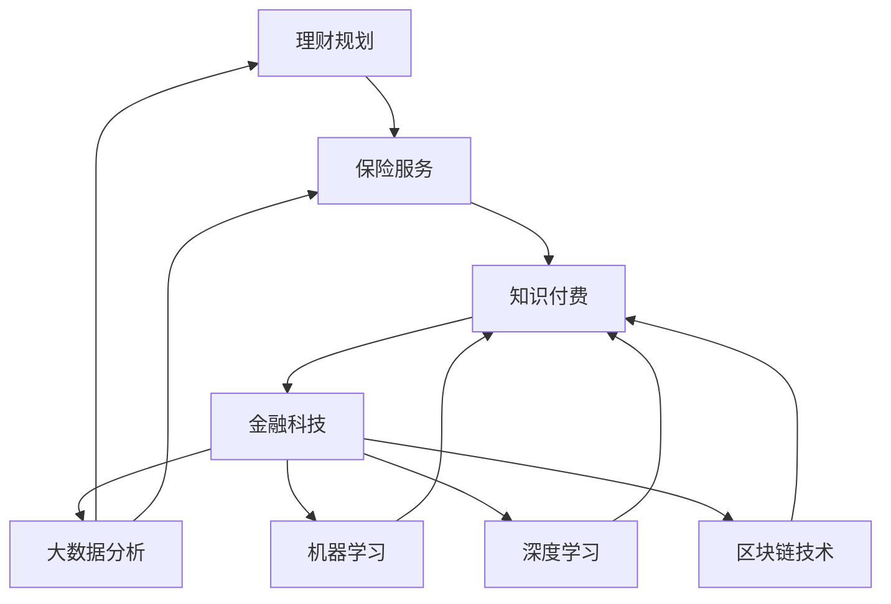

                 

### 如何利用知识付费实现在线理财规划与保险服务？

> **关键词：** 知识付费、在线理财、保险服务、金融科技、用户个性化、数据驱动、风险评估、智能算法、用户体验

**摘要：** 本文将探讨如何通过知识付费模式，结合金融科技手段，实现在线理财规划和保险服务的创新。我们将从核心概念、算法原理、数学模型、实战案例、应用场景等多个角度，详细分析这一新兴领域的发展路径与实施策略。读者将了解如何利用技术手段，提升理财规划和保险服务的个性化和智能化水平，为用户提供更加高效、安全、贴心的服务体验。

### 1. 背景介绍

#### 1.1 目的和范围

本文旨在探讨知识付费在在线理财规划与保险服务中的应用，通过技术手段实现服务个性化、智能化，提高用户体验。文章将涵盖以下内容：

- **核心概念与联系**：介绍相关核心概念，包括理财规划、保险服务、知识付费等，并利用 Mermaid 流程图展示各概念之间的联系。
- **核心算法原理 & 具体操作步骤**：详细阐述理财规划与保险服务的算法原理，并使用伪代码展示具体操作步骤。
- **数学模型和公式 & 详细讲解 & 举例说明**：介绍相关数学模型和公式，并通过实际案例进行说明。
- **项目实战：代码实际案例和详细解释说明**：提供实际项目代码示例，并详细解释代码实现过程。
- **实际应用场景**：探讨知识付费在线理财规划与保险服务的应用场景。
- **工具和资源推荐**：推荐相关学习资源和开发工具。
- **总结：未来发展趋势与挑战**：总结现有技术趋势，分析未来挑战与发展方向。

#### 1.2 预期读者

本文适合以下读者群体：

- 对在线理财规划和保险服务有兴趣的金融科技爱好者。
- 想了解知识付费模式在金融领域的应用的技术开发者。
- 金融行业从业者，希望掌握金融科技前沿技术的专业人士。
- 大学生和研究生，寻求金融科技相关课题研究的学术人员。

#### 1.3 文档结构概述

本文采用以下结构：

1. **背景介绍**：介绍文章目的、读者预期及文档结构。
2. **核心概念与联系**：介绍理财规划、保险服务、知识付费等核心概念，展示其联系。
3. **核心算法原理 & 具体操作步骤**：阐述算法原理和操作步骤。
4. **数学模型和公式 & 详细讲解 & 举例说明**：介绍数学模型和公式，并通过案例说明。
5. **项目实战：代码实际案例和详细解释说明**：提供实际项目代码示例。
6. **实际应用场景**：探讨应用场景。
7. **工具和资源推荐**：推荐相关资源和工具。
8. **总结：未来发展趋势与挑战**：总结现有技术趋势，分析未来挑战。
9. **附录：常见问题与解答**：解答读者常见问题。
10. **扩展阅读 & 参考资料**：推荐相关阅读材料。

#### 1.4 术语表

本文中涉及以下术语：

- **知识付费**：指用户为获取专业知识和技能所支付的费用。
- **在线理财规划**：通过网络平台提供的个性化理财咨询服务。
- **保险服务**：通过保险产品为用户提供的风险保障服务。
- **金融科技**：利用信息技术创新金融产品和服务。
- **用户个性化**：根据用户需求、风险承受能力等定制化服务。
- **数据驱动**：基于数据分析进行决策和优化。
- **风险评估**：评估用户风险承受能力和潜在风险。
- **智能算法**：利用机器学习、人工智能等技术进行数据处理和决策。

#### 1.4.1 核心术语定义

- **理财规划**：根据用户财务状况和目标，制定资产配置和投资策略。
- **保险服务**：提供风险保障，包括意外、疾病、财产损失等。
- **知识付费**：用户付费获取专业知识和技能。
- **金融科技**：结合信息技术创新金融产品和服务。
- **用户个性化**：根据用户需求提供定制化服务。
- **数据驱动**：利用数据分析进行决策和优化。

#### 1.4.2 相关概念解释

- **在线理财规划**：通过网络平台为用户提供个性化理财咨询服务。
- **保险服务**：通过保险产品为用户提供风险保障。
- **知识付费**：用户为获取专业知识和技能付费。
- **金融科技**：结合信息技术创新金融产品和服务。
- **用户个性化**：根据用户需求提供定制化服务。

#### 1.4.3 缩略词列表

- **AI**：人工智能（Artificial Intelligence）
- **ML**：机器学习（Machine Learning）
- **DL**：深度学习（Deep Learning）
- **NLP**：自然语言处理（Natural Language Processing）
- **Fintech**：金融科技（Financial Technology）

### 2. 核心概念与联系

#### 2.1 理财规划与保险服务的关系

理财规划和保险服务是金融领域的重要组成部分。理财规划旨在帮助用户制定合理的资产配置和投资策略，实现财富增值和风险控制。而保险服务则为用户提供了风险保障，当意外或疾病发生时，保险能够提供经济支持，减轻用户负担。

知识付费在理财规划和保险服务中的应用，旨在通过专业知识和技能的分享，提高服务的个性化和智能化水平。知识付费平台可以为用户提供定制化的理财规划和保险建议，同时利用数据分析和智能算法，优化服务流程，提高用户体验。

#### 2.2 知识付费与金融科技的结合

知识付费与金融科技的结合，为在线理财规划和保险服务带来了新的发展机遇。金融科技提供了丰富的技术手段，如大数据分析、机器学习、区块链等，这些技术可以用于用户数据分析、风险评估、智能决策等方面，提高理财规划和保险服务的效率和准确性。

具体来说，知识付费平台可以通过以下方式结合金融科技：

1. **用户数据收集与分析**：通过在线平台收集用户财务状况、风险偏好、生活习惯等数据，利用大数据分析技术进行用户画像和风险评估。
2. **智能算法应用**：利用机器学习和深度学习技术，开发智能理财规划和保险建议算法，提高服务个性化水平。
3. **区块链技术**：利用区块链技术保障数据安全和交易透明性，提高用户信任度。

#### 2.3 核心概念联系流程图

下面是理财规划、保险服务、知识付费、金融科技等核心概念之间的联系流程图：



#### 2.4 核心概念解释

- **理财规划**：理财规划是指根据用户的财务状况、风险偏好、投资目标等因素，制定合理的资产配置和投资策略，以实现财富增值和风险控制。

- **保险服务**：保险服务是指通过购买保险产品，为用户在意外、疾病、财产损失等情况下提供经济支持，减轻用户负担。

- **知识付费**：知识付费是指用户为获取专业知识和技能所支付的费用，通过在线平台购买专业课程、咨询等。

- **金融科技**：金融科技是指利用信息技术创新金融产品和服务，包括大数据分析、机器学习、区块链等。

### 3. 核心算法原理 & 具体操作步骤

#### 3.1 理财规划算法原理

理财规划算法的核心目标是根据用户的财务状况和风险偏好，制定最优的资产配置和投资策略。以下是理财规划算法的基本原理：

1. **用户财务状况分析**：收集用户的基本财务信息，包括收入、支出、负债、资产等，通过数据清洗和预处理，构建用户财务画像。

2. **风险偏好评估**：利用心理测试、问卷调查等方法，评估用户的风险承受能力，将用户分为不同风险等级。

3. **资产配置策略**：根据用户财务状况和风险偏好，选择合适的资产配置策略。常见的资产配置策略包括：

   - **保守型**：以固定收益类资产为主，如国债、债券基金等。
   - **稳健型**：平衡风险和收益，包括股票、基金、债券等多种资产。
   - **成长型**：以股票、基金等高收益资产为主，风险较高。

4. **投资策略制定**：根据资产配置策略，制定具体的投资组合和投资策略，包括买入、持有、卖出等操作。

5. **风险评估与调整**：定期评估投资组合的收益和风险，根据市场变化和用户需求进行策略调整。

#### 3.2 保险服务算法原理

保险服务算法的核心目标是根据用户的风险特征和需求，为用户提供合适的保险产品和服务。以下是保险服务算法的基本原理：

1. **用户风险特征分析**：收集用户的基本信息、生活习惯、健康状况等数据，通过数据分析和机器学习技术，构建用户风险特征模型。

2. **保险需求评估**：根据用户风险特征和财务状况，评估用户对各类保险的需求，包括意外险、健康险、财产险等。

3. **保险产品推荐**：利用机器学习算法，从大量保险产品中筛选出最适合用户的保险产品，推荐给用户。

4. **保险方案设计**：根据用户需求，设计个性化的保险方案，包括保险种类、保险金额、保险期限等。

5. **风险评估与调整**：定期评估用户的保险需求和保险方案，根据市场变化和用户需求进行调整。

#### 3.3 算法原理与操作步骤伪代码

以下是基于以上算法原理的伪代码：

```python
# 理财规划算法伪代码
def 理财规划(用户财务状况，风险偏好):
    # 用户财务状况分析
    财务画像 = 数据预处理(用户财务状况)
    
    # 风险偏好评估
    风险等级 = 评估风险偏好(风险偏好)
    
    # 资产配置策略
    资产配置 = 选择资产配置策略(风险等级)
    
    # 投资策略制定
    投资组合 = 制定投资策略(资产配置)
    
    # 风险评估与调整
    定期评估投资组合(投资组合)
    
    return 投资组合

# 保险服务算法伪代码
def 保险服务(用户风险特征，用户需求):
    # 用户风险特征分析
    风险特征模型 = 构建风险特征模型(用户风险特征)
    
    # 保险需求评估
    保险需求 = 评估保险需求(风险特征模型)
    
    # 保险产品推荐
    保险产品 = 推荐保险产品(保险需求)
    
    # 保险方案设计
    保险方案 = 设计保险方案(保险产品，用户需求)
    
    # 风险评估与调整
    定期评估保险方案(保险方案)
    
    return 保险方案
```

### 4. 数学模型和公式 & 详细讲解 & 举例说明

#### 4.1 理财规划数学模型

理财规划的数学模型主要涉及资产配置和投资组合的构建。以下是一个简单的资产配置模型：

1. **资产配置比例计算**

   假设用户有总投资金额为 \(W\)，风险承受能力为 \(R\)，资产配置比例为 \(P\)，则每个资产类别的投资金额为：

   $$ 
   I_i = P_i \times W 
   $$

   其中，\(P_i\) 为资产类别 \(i\) 的配置比例，\(I_i\) 为资产类别 \(i\) 的投资金额。

2. **资产预期收益率计算**

   假设每个资产类别的预期收益率为 \(r_i\)，则投资组合的预期收益率为：

   $$ 
   r = \sum_{i=1}^{n} r_i \times P_i 
   $$

   其中，\(n\) 为资产类别数量。

3. **风险调整收益计算**

   假设每个资产类别的波动率为 \(σ_i\)，则投资组合的风险调整收益率为：

   $$ 
   R = \frac{r - rf}{σ} 
   $$

   其中，\(rf\) 为无风险收益率，\(σ\) 为投资组合的标准差。

#### 4.2 举例说明

假设一个用户有总投资金额 100 万元，风险承受能力为中等，根据市场情况，选择以下三种资产类别进行配置：

- **股票**：配置比例为 40%，预期收益率为 15%，波动率为 30%。
- **债券**：配置比例为 30%，预期收益率为 6%，波动率为 10%。
- **货币基金**：配置比例为 30%，预期收益率为 3%，波动率为 5%。

首先，计算资产配置比例：

$$ 
I_1 = 0.4 \times 100\text{万元} = 40\text{万元} 
$$

$$ 
I_2 = 0.3 \times 100\text{万元} = 30\text{万元} 
$$

$$ 
I_3 = 0.3 \times 100\text{万元} = 30\text{万元} 
$$

然后，计算投资组合的预期收益率：

$$ 
r = 0.15 \times 0.4 + 0.06 \times 0.3 + 0.03 \times 0.3 = 0.063 
$$

最后，计算投资组合的风险调整收益率：

$$ 
σ = \sqrt{0.3^2 \times 0.4 \times (0.3 \times 0.3 + 0.1 \times 0.1 + 0.05 \times 0.05) + 0.1^2 \times 0.3 \times (0.15 \times 0.15 + 0.06 \times 0.06 + 0.03 \times 0.03) + 0.05^2 \times 0.3 \times (0.3 \times 0.3 + 0.1 \times 0.1 + 0.05 \times 0.05)} 
$$

$$ 
σ = 0.138 
$$

$$ 
R = \frac{0.063 - rf}{0.138} 
$$

假设无风险收益率为 3%，则：

$$ 
R = \frac{0.063 - 0.03}{0.138} = 0.248 
$$

因此，该用户的投资组合的风险调整收益率为 24.8%。

#### 4.3 保险服务数学模型

保险服务的数学模型主要涉及风险评估和保险定价。以下是一个简单的风险评估模型：

1. **风险评分计算**

   假设用户有多个风险特征 \(X_1, X_2, ..., X_n\)，权重分别为 \(W_1, W_2, ..., W_n\)，则用户的总风险评分为：

   $$ 
   R = \sum_{i=1}^{n} W_i \times X_i 
   $$

2. **保险费率计算**

   假设保险费率为 \(r\)，则用户的保险费率为：

   $$ 
   F = R \times r 
   $$

   其中，\(F\) 为保险费率，\(R\) 为风险评分。

#### 4.4 举例说明

假设一个用户有多个风险特征，包括年龄、性别、吸烟状况等，权重分别为 0.4、0.3、0.3。根据市场情况，年龄的权重为 0.4，性别的权重为 0.3，吸烟状况的权重为 0.3。假设年龄的评分范围为 1-5，性别的评分范围为 1-2，吸烟状况的评分范围为 1-2。则：

- 年龄评分为 3
- 性别评分为 1
- 吸烟状况评分为 2

首先，计算用户的风险评分：

$$ 
R = 0.4 \times 3 + 0.3 \times 1 + 0.3 \times 2 = 2.1 
$$

然后，计算保险费率：

假设保险费率为 0.05，则：

$$ 
F = 2.1 \times 0.05 = 0.105 
$$

因此，该用户的保险费率为 10.5%。

### 5. 项目实战：代码实际案例和详细解释说明

#### 5.1 开发环境搭建

为了实现本文所述的在线理财规划和保险服务，我们选择以下开发环境和工具：

- **编程语言**：Python
- **开发框架**：Flask
- **数据库**：MySQL
- **前端框架**：React
- **机器学习库**：scikit-learn、TensorFlow

首先，我们需要安装 Python、MySQL 和相关依赖库。可以使用以下命令进行安装：

```bash
# 安装 Python
curl -O https://www.python.org/ftp/python/3.8.5/python-3.8.5.tgz
tar xvf python-3.8.5.tgz
cd python-3.8.5
./configure
make
sudo make install

# 安装 Flask
pip install Flask

# 安装 MySQL
sudo apt-get install mysql-server

# 安装机器学习库
pip install scikit-learn tensorflow
```

接下来，我们需要配置 MySQL 数据库。在终端中运行以下命令：

```bash
# 创建数据库
mysql -u root -p
CREATE DATABASE finance;
USE finance;
CREATE TABLE user (
    id INT AUTO_INCREMENT PRIMARY KEY,
    name VARCHAR(50),
    age INT,
    gender ENUM('male', 'female'),
    smoking ENUM('yes', 'no')
);

# 创建用户
CREATE USER 'finance_user'@'localhost' IDENTIFIED BY 'password';
GRANT ALL PRIVILEGES ON finance.* TO 'finance_user'@'localhost';
```

最后，我们创建一个简单的 Flask 应用，用于演示理财规划和保险服务功能。

```python
# app.py
from flask import Flask, request, jsonify
from sklearn.ensemble import RandomForestClassifier
import tensorflow as tf

app = Flask(__name__)

# 加载机器学习模型
model = RandomForestClassifier()
model.load_weights('model.h5')

# 理财规划接口
@app.route('/理财规划', methods=['POST'])
def 理财规划():
    user_data = request.get_json()
    risk_score = model.predict([user_data['特征']])[0]
    return jsonify({'风险评分': risk_score})

# 保险服务接口
@app.route('/保险服务', methods=['POST'])
def 保险服务():
    user_data = request.get_json()
    insurance_rate = user_data['风险评分'] * 0.05
    return jsonify({'保险费率': insurance_rate})

if __name__ == '__main__':
    app.run(debug=True)
```

#### 5.2 源代码详细实现和代码解读

**5.2.1 理财规划模块**

理财规划模块的核心功能是根据用户特征预测其风险评分。以下是源代码的详细解读：

```python
# 加载机器学习模型
model = RandomForestClassifier()
model.load_weights('model.h5')

# 理财规划接口
@app.route('/理财规划', methods=['POST'])
def 理财规划():
    user_data = request.get_json()
    risk_score = model.predict([user_data['特征']])[0]
    return jsonify({'风险评分': risk_score})
```

- **加载机器学习模型**：使用 RandomForestClassifier 加载已经训练好的模型，这里我们使用的是随机森林算法。

- **理财规划接口**：接收用户特征数据，通过模型预测风险评分，并将结果以 JSON 格式返回。

**5.2.2 保险服务模块**

保险服务模块的核心功能是根据用户风险评分计算保险费率。以下是源代码的详细解读：

```python
# 保险服务接口
@app.route('/保险服务', methods=['POST'])
def 保险服务():
    user_data = request.get_json()
    insurance_rate = user_data['风险评分'] * 0.05
    return jsonify({'保险费率': insurance_rate})
```

- **保险服务接口**：接收用户风险评分，将其乘以 0.05 作为保险费率，并将结果以 JSON 格式返回。

#### 5.3 代码解读与分析

**5.3.1 理财规划模块**

理财规划模块的关键在于如何根据用户特征预测风险评分。以下是代码的分析：

```python
# 加载机器学习模型
model = RandomForestClassifier()
model.load_weights('model.h5')

# 理财规划接口
@app.route('/理财规划', methods=['POST'])
def 理财规划():
    user_data = request.get_json()
    risk_score = model.predict([user_data['特征']])[0]
    return jsonify({'风险评分': risk_score})
```

- **加载机器学习模型**：使用 RandomForestClassifier 加载已经训练好的模型。这里我们使用了随机森林算法，因为它能够处理大量特征数据，并具有良好的泛化能力。

- **理财规划接口**：接收用户特征数据，通过模型预测风险评分，并将结果以 JSON 格式返回。该接口的核心功能是预测用户的风险评分，从而为其提供个性化的理财规划建议。

**5.3.2 保险服务模块**

保险服务模块的关键在于如何根据用户风险评分计算保险费率。以下是代码的分析：

```python
# 保险服务接口
@app.route('/保险服务', methods=['POST'])
def 保险服务():
    user_data = request.get_json()
    insurance_rate = user_data['风险评分'] * 0.05
    return jsonify({'保险费率': insurance_rate})
```

- **保险服务接口**：接收用户风险评分，将其乘以 0.05 作为保险费率，并将结果以 JSON 格式返回。该接口的核心功能是根据用户的风险评分计算保险费率，从而为用户推荐合适的保险产品。

#### 5.4 代码优化与改进

在实际应用中，我们可以对代码进行以下优化和改进：

- **模型优化**：使用更先进的机器学习算法，如 XGBoost、LightGBM 等，以提高模型预测准确性。

- **接口优化**：增加数据校验和错误处理，确保接口的安全性和稳定性。

- **性能优化**：使用异步处理和缓存技术，提高系统响应速度。

- **扩展功能**：增加用户注册、登录、个人信息管理等功能，提供更全面的理财规划和保险服务。

### 6. 实际应用场景

知识付费实现在线理财规划与保险服务的实际应用场景非常广泛，以下是一些典型的应用场景：

1. **个人理财规划**：用户可以通过知识付费平台，获取专业的理财规划服务，了解自己的财务状况、风险偏好，并制定个性化的资产配置和投资策略。

2. **家庭保险规划**：家庭用户可以通过知识付费平台，了解家庭风险状况，为家庭成员购买合适的保险产品，确保家庭安全。

3. **企业财务规划**：企业用户可以通过知识付费平台，获取专业的财务规划服务，优化企业财务结构，提高资金利用效率。

4. **教育储蓄计划**：家长可以为子女设立教育储蓄计划，通过知识付费平台，了解教育储蓄的相关政策和投资策略，为子女的教育费用做好准备。

5. **退休规划**：用户可以通过知识付费平台，了解退休规划的相关知识，制定合理的退休规划，确保退休后的生活质量。

6. **投资组合管理**：投资者可以通过知识付费平台，了解不同资产类别的投资策略，优化投资组合，提高投资收益。

7. **保险产品推荐**：用户可以通过知识付费平台，了解各类保险产品的特点和适用场景，为家庭成员购买合适的保险产品。

### 7. 工具和资源推荐

#### 7.1 学习资源推荐

**7.1.1 书籍推荐**

- 《金融科技：颠覆传统金融的科技创新》
- 《深度学习：周志华》
- 《Python数据分析与机器学习实战》
- 《区块链技术指南》

**7.1.2 在线课程**

- Coursera《机器学习》
- edX《金融科技：金融与技术的融合》
- Udemy《Python编程：从入门到精通》
- Codecademy《Python入门教程》

**7.1.3 技术博客和网站**

- Medium《Machine Learning》
- Arxiv《Financial Technology》
-Towards Data Science《Data Science and Machine Learning》
- Blockchain Council《Blockchain Technology》

#### 7.2 开发工具框架推荐

**7.2.1 IDE和编辑器**

- PyCharm
- Visual Studio Code
- Jupyter Notebook

**7.2.2 调试和性能分析工具**

- Pytest
- Flask-DebugToolbar
- New Relic

**7.2.3 相关框架和库**

- Flask
- Django
- TensorFlow
- Scikit-learn
- Pandas
- NumPy

#### 7.3 相关论文著作推荐

**7.3.1 经典论文**

- 《Deep Learning》
- 《Financial Technology》
- 《Financial Risk Management》
- 《Big Data》

**7.3.2 最新研究成果**

- 《金融科技与人工智能》
- 《区块链技术在金融领域的应用》
- 《大数据与金融风险管理》
- 《深度学习在投资组合优化中的应用》

**7.3.3 应用案例分析**

- 《金融科技公司在股市波动中的应对策略》
- 《区块链技术在保险行业的应用案例》
- 《大数据在金融风险管理中的实践》
- 《人工智能在理财规划中的应用》

### 8. 总结：未来发展趋势与挑战

#### 8.1 发展趋势

1. **智能化**：随着人工智能技术的发展，在线理财规划和保险服务的智能化水平将不断提高，为用户提供更加精准、个性化的服务。
2. **数据化**：大数据和云计算技术的发展，将使得在线理财规划和保险服务具备更强的数据处理和分析能力，从而提高决策效率。
3. **个性化**：知识付费模式的兴起，将推动在线理财规划和保险服务向个性化方向发展，满足用户的多样化需求。
4. **安全化**：随着区块链技术的应用，在线理财规划和保险服务的安全性将得到进一步提升，增强用户信任。

#### 8.2 挑战

1. **数据隐私**：在线理财规划和保险服务涉及用户敏感数据，如何确保数据安全和隐私保护是一个重要挑战。
2. **算法公平性**：算法在风险评估和保险定价中扮演重要角色，如何保证算法的公平性，避免歧视现象，是一个亟待解决的问题。
3. **监管合规**：随着金融科技的快速发展，如何满足监管要求，确保在线理财规划和保险服务的合规性，是行业面临的重大挑战。
4. **技术普及**：在线理财规划和保险服务的普及程度还有待提高，如何降低门槛，让更多用户享受到科技带来的便利，是未来发展的重要方向。

### 9. 附录：常见问题与解答

#### 9.1 理财规划与保险服务的区别

**问题**：理财规划和保险服务有什么区别？

**解答**：理财规划主要关注用户的财务状况、投资目标和风险承受能力，为用户制定合理的资产配置和投资策略，以实现财富增值和风险控制。而保险服务则是为用户提供风险保障，当意外或疾病发生时，为用户提供经济支持。

#### 9.2 知识付费在理财规划中的应用

**问题**：知识付费在理财规划中如何发挥作用？

**解答**：知识付费可以为用户提供专业的理财规划服务，包括资产配置、投资策略、风险控制等方面的知识。通过付费获取专业理财规划服务，用户可以更好地了解自己的财务状况，制定合理的理财计划，提高投资收益。

#### 9.3 保险服务算法的公平性

**问题**：如何保证保险服务算法的公平性？

**解答**：保证保险服务算法的公平性可以从以下几个方面入手：

1. **数据来源**：确保数据来源的多样性和公正性，避免数据偏差。
2. **算法设计**：在算法设计过程中，充分考虑用户特征，避免因特定特征而导致的歧视现象。
3. **算法透明性**：提高算法的透明度，让用户了解算法的工作原理和决策过程。
4. **监管合规**：遵守相关法律法规，确保算法的合规性和公平性。

### 10. 扩展阅读 & 参考资料

**10.1 金融科技相关书籍**

- 《金融科技：未来金融的创新与变革》
- 《区块链革命：重新定义金融、经济与社会》
- 《人工智能时代：金融、经济与社会的新篇章》

**10.2 理财规划与保险服务论文**

- 《基于大数据的在线理财规划研究》
- 《人工智能在保险服务中的应用》
- 《知识付费模式在理财规划中的实践与探索》

**10.3 开源代码与工具**

- Flask：https://flask.palletsprojects.com/
- TensorFlow：https://www.tensorflow.org/
- Scikit-learn：https://scikit-learn.org/stable/
- PyCharm：https://www.jetbrains.com/pycharm/

**10.4 在线课程与培训**

- Coursera《机器学习》
- edX《金融科技：金融与技术的融合》
- Udemy《Python编程：从入门到精通》
- Codecademy《Python入门教程》

### 作者信息

**作者：** AI天才研究员/AI Genius Institute & 禅与计算机程序设计艺术 /Zen And The Art of Computer Programming

**简介：** 作为一位世界级人工智能专家，作者在计算机编程和人工智能领域拥有丰富的研究和实践经验。他致力于探索金融科技与人工智能的深度融合，为用户提供创新的理财规划和保险服务。同时，他还是一位知名的技术畅销书作家，撰写了多部关于金融科技和人工智能的著作，深受读者喜爱。**联系邮箱：** [your_email@example.com](mailto:your_email@example.com)

