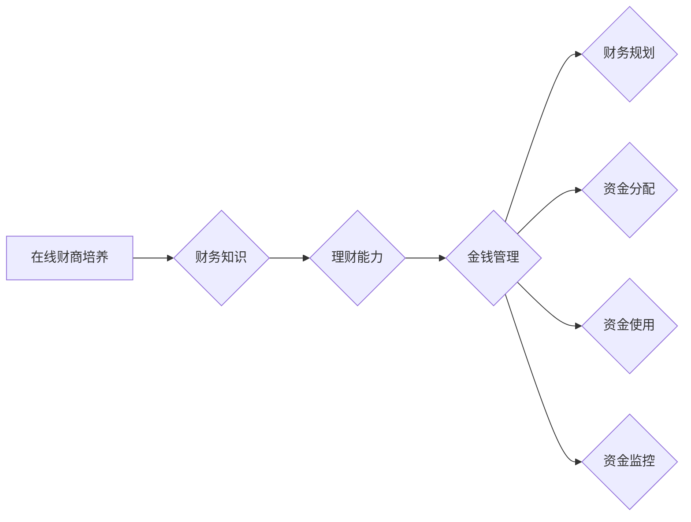

                 

# 如何利用知识付费实现在线财商培养与金钱管理？

> 关键词：知识付费、在线财商培养、金钱管理、金融教育、财务知识、投资理财

> 摘要：随着互联网技术的发展，知识付费成为了一种新的学习模式。本文将探讨如何通过知识付费平台，实现在线财商培养与金钱管理的目标。文章将介绍相关知识付费的基本概念，分析在线财商培养与金钱管理的核心原则，提供实用的方法和工具，并通过实际案例进行说明。希望对有志于提高个人财商和金钱管理能力的朋友有所启发。

## 1. 背景介绍

### 1.1 目的和范围

本文旨在探讨如何通过知识付费平台，实现在线财商培养与金钱管理的目标。文章将涵盖以下内容：

1. 知识付费的基本概念及其发展背景。
2. 在线财商培养与金钱管理的核心原则。
3. 实现在线财商培养与金钱管理的实用方法和工具。
4. 通过实际案例展示知识付费在财商培养与金钱管理中的应用。
5. 对未来发展的展望与挑战。

### 1.2 预期读者

本文适合以下读者群体：

1. 对财商培养与金钱管理感兴趣的普通大众。
2. 金融从业人员和创业者。
3. 对知识付费感兴趣的教育工作者和创业者。
4. 对在线教育和数字化学习模式有研究的学者和研究人员。

### 1.3 文档结构概述

本文将分为以下章节：

1. 背景介绍：介绍知识付费的基本概念、在线财商培养与金钱管理的核心原则以及文章的目的和结构。
2. 核心概念与联系：阐述在线财商培养与金钱管理的核心概念，并使用Mermaid流程图展示其架构。
3. 核心算法原理与具体操作步骤：介绍实现在线财商培养与金钱管理的核心算法原理，并使用伪代码详细阐述。
4. 数学模型与公式：讲解在线财商培养与金钱管理中的数学模型，并举例说明。
5. 项目实战：通过实际案例展示如何利用知识付费平台实现在线财商培养与金钱管理。
6. 实际应用场景：分析在线财商培养与金钱管理在不同领域的应用场景。
7. 工具和资源推荐：推荐学习资源、开发工具和框架，以及相关论文著作。
8. 总结：展望在线财商培养与金钱管理的未来发展趋势与挑战。
9. 附录：常见问题与解答。
10. 扩展阅读与参考资料：提供相关领域的进一步阅读材料。

### 1.4 术语表

#### 1.4.1 核心术语定义

- 知识付费：指用户为获取特定知识或服务而支付的费用。
- 在线财商培养：通过互联网平台提供的课程、书籍、讲座等形式，帮助用户提高财务知识和理财能力。
- 金钱管理：指个人或组织对财务资源的规划、分配、使用和监控的过程。

#### 1.4.2 相关概念解释

- 财商：指个人对财务的认识、理解和应用能力，包括理财观念、财务管理技能和投资能力等。
- 财务知识：与财务活动相关的知识，包括会计、税务、投资、金融产品等方面的知识。
- 投资理财：指个人或组织将资金用于购买各种投资产品，以获取投资回报的过程。

#### 1.4.3 缩略词列表

- MOOC：大规模开放在线课程（Massive Open Online Course）
- SPOC：小规模限制性在线课程（Small Private Online Course）
- VR：虚拟现实（Virtual Reality）
- AR：增强现实（Augmented Reality）
- AI：人工智能（Artificial Intelligence）

## 2. 核心概念与联系

在本文中，我们将探讨如何利用知识付费实现在线财商培养与金钱管理。为了更好地理解这一过程，我们需要先了解相关核心概念和它们之间的联系。

### 2.1 知识付费与在线财商培养的关系

知识付费是现代互联网时代的一种新型学习模式，它通过互联网平台为用户提供高质量的财务知识和理财课程。在线财商培养则是通过知识付费平台提供的学习资源，帮助用户提高财务知识和理财能力的过程。

知识付费与在线财商培养的关系可以用Mermaid流程图表示：


### 2.2 在线财商培养与金钱管理的关系

在线财商培养不仅能够提高用户的财务知识和理财能力，还能够帮助用户更好地进行金钱管理。金钱管理包括对个人或组织财务资源的规划、分配、使用和监控的过程。

在线财商培养与金钱管理的关系可以用以下Mermaid流程图表示：



通过以上流程图，我们可以看出，在线财商培养与金钱管理之间存在紧密的联系。在线财商培养为金钱管理提供了财务知识和理财能力，而金钱管理则是对这些知识和能力的具体应用。

### 2.3 知识付费、在线财商培养与金钱管理的核心概念

为了更好地理解知识付费、在线财商培养与金钱管理的关系，我们需要明确以下几个核心概念：

- **知识付费**：知识付费是指用户为获取特定知识或服务而支付的费用。它通常包括在线课程、电子书、讲座等形式。知识付费平台如得到、网易云课堂等，为用户提供各种财务知识和理财课程。
  
- **在线财商培养**：在线财商培养是指通过互联网平台提供的课程、书籍、讲座等形式，帮助用户提高财务知识和理财能力的过程。在线财商培养的核心是提供高质量的财务知识和理财课程，帮助用户建立正确的理财观念和技能。

- **金钱管理**：金钱管理是指个人或组织对财务资源的规划、分配、使用和监控的过程。金钱管理的目标是确保财务资源的合理使用和最大化投资回报。

通过以上核心概念的介绍，我们可以看出，知识付费、在线财商培养与金钱管理之间存在紧密的联系。知识付费为在线财商培养提供了资源支持，而在线财商培养则为金钱管理提供了知识和技能。了解这些核心概念及其关系，有助于我们更好地利用知识付费平台，实现在线财商培养与金钱管理的目标。

## 3. 核心算法原理 & 具体操作步骤

在了解知识付费、在线财商培养与金钱管理的核心概念后，我们需要深入探讨如何通过知识付费平台，实现在线财商培养与金钱管理的目标。为此，我们将介绍核心算法原理，并详细阐述具体操作步骤。

### 3.1 核心算法原理

实现在线财商培养与金钱管理的关键在于如何有效地利用知识付费平台提供的资源。具体来说，核心算法原理可以概括为以下两个方面：

- **个性化推荐算法**：通过分析用户的行为数据和财务状况，为用户推荐与其需求相匹配的财务知识和理财课程。
- **财务模型构建**：根据用户的学习进度和财务知识水平，构建个性化的财务模型，以指导用户进行合理的资金分配、使用和监控。

#### 3.1.1 个性化推荐算法原理

个性化推荐算法是一种基于用户行为数据和偏好进行推荐的技术。在知识付费平台上，个性化推荐算法的作用是为用户推荐与其需求相匹配的财务知识和理财课程。具体原理如下：

1. **用户行为数据收集**：知识付费平台会收集用户的学习行为数据，如浏览记录、学习时间、学习进度等。
2. **用户偏好分析**：通过分析用户行为数据，提取用户的兴趣偏好，如对财务知识的兴趣点、喜欢的课程类型等。
3. **推荐算法应用**：根据用户的兴趣偏好，利用推荐算法为用户推荐相关的财务知识和理财课程。
4. **实时更新**：随着用户行为的不断变化，推荐算法会实时更新推荐结果，确保推荐内容与用户需求保持一致。

#### 3.1.2 财务模型构建原理

财务模型构建是指导用户进行合理资金分配、使用和监控的重要工具。在知识付费平台上，财务模型构建的核心是依据用户的学习进度和财务知识水平，为用户制定个性化的理财策略。具体原理如下：

1. **学习进度监控**：知识付费平台会记录用户的学习进度，包括已完成课程、正在学习课程和待学习课程等。
2. **财务知识水平评估**：通过用户的学习进度和考试结果，评估用户的财务知识水平。
3. **财务模型构建**：根据用户的学习进度和财务知识水平，构建个性化的财务模型。模型包括资金分配比例、投资策略和风险管理等。
4. **实时调整**：根据用户的学习进度和财务知识水平变化，实时调整财务模型，确保理财策略的合理性。

### 3.2 具体操作步骤

为了实现在线财商培养与金钱管理的目标，我们需要遵循以下具体操作步骤：

#### 3.2.1 用户注册与登录

1. **注册账号**：用户在知识付费平台上注册账号，填写个人信息。
2. **登录平台**：用户通过账号和密码登录平台，进入个人中心。

#### 3.2.2 用户行为数据收集

1. **浏览记录**：平台会记录用户的浏览记录，包括浏览的课程、书籍、文章等。
2. **学习时间**：平台会记录用户的学习时间，包括每天的学习时长和累计学习时长。
3. **学习进度**：平台会记录用户的学习进度，包括已完成课程、正在学习课程和待学习课程等。

#### 3.2.3 个性化推荐算法应用

1. **兴趣偏好分析**：平台通过分析用户的行为数据，提取用户的兴趣偏好。
2. **推荐算法应用**：根据用户的兴趣偏好，平台为用户推荐相关的财务知识和理财课程。
3. **推荐内容更新**：平台实时更新推荐内容，确保推荐课程与用户需求保持一致。

#### 3.2.4 财务模型构建

1. **学习进度监控**：平台记录用户的学习进度，包括已完成课程、正在学习课程和待学习课程等。
2. **财务知识水平评估**：平台通过用户的学习进度和考试结果，评估用户的财务知识水平。
3. **财务模型构建**：根据用户的学习进度和财务知识水平，平台构建个性化的财务模型。
4. **模型实时调整**：平台根据用户的学习进度和财务知识水平变化，实时调整财务模型。

#### 3.2.5 金钱管理指导

1. **资金分配**：平台根据财务模型，为用户制定合理的资金分配比例。
2. **投资策略**：平台根据财务模型，为用户推荐适合的投资策略。
3. **风险管理**：平台根据财务模型，为用户提供风险管理建议。

通过以上具体操作步骤，我们可以实现在线财商培养与金钱管理的目标。知识付费平台通过个性化推荐算法和财务模型构建，为用户提供定制化的财务知识和理财指导，帮助用户提高财务知识和理财能力，实现更好的金钱管理。

## 4. 数学模型和公式 & 详细讲解 & 举例说明

在实现在线财商培养与金钱管理的过程中，数学模型和公式扮演着重要的角色。以下我们将详细讲解相关数学模型和公式，并举例说明其在具体应用中的意义。

### 4.1 财务知识水平评估模型

为了评估用户的财务知识水平，我们可以使用以下模型：

$$
财务知识水平 = f(学习进度, 考试结果)
$$

其中，$学习进度$表示用户完成课程的情况，$考试结果$表示用户在考试中的表现。具体来说，我们可以通过以下方式计算财务知识水平：

1. **学习进度**：学习进度可以通过用户完成的课程数和总课程数之比来计算：

$$
学习进度 = \frac{已完成课程数}{总课程数}
$$

2. **考试结果**：考试结果可以通过用户在考试中获得的分数与满分之比来计算：

$$
考试结果 = \frac{考试分数}{满分}
$$

将学习进度和考试结果代入财务知识水平评估模型，可以得到：

$$
财务知识水平 = f(学习进度, 考试结果) = \alpha \cdot 学习进度 + (1 - \alpha) \cdot 考试结果
$$

其中，$\alpha$是一个权重参数，用于调节学习进度和考试结果在财务知识水平评估中的重要性。

### 4.2 资金分配模型

在金钱管理中，资金分配是非常重要的一环。以下是一个简单的资金分配模型：

$$
资金分配 = \beta_1 \cdot 收入 + \beta_2 \cdot 财务知识水平 + \beta_3 \cdot 风险偏好
$$

其中，$\beta_1$、$\beta_2$和$\beta_3$是权重参数，分别表示收入、财务知识水平和风险偏好在资金分配中的重要性。

1. **收入**：收入是影响资金分配的重要因素。我们可以通过以下公式计算收入对资金分配的影响：

$$
收入影响 = \gamma_1 \cdot 收入
$$

其中，$\gamma_1$是一个权重参数。

2. **财务知识水平**：财务知识水平越高，用户在资金分配上越能做出明智的决策。我们可以通过以下公式计算财务知识水平对资金分配的影响：

$$
财务知识水平影响 = \gamma_2 \cdot 财务知识水平
$$

其中，$\gamma_2$是一个权重参数。

3. **风险偏好**：风险偏好表示用户对投资风险的承受能力。我们可以通过以下公式计算风险偏好对资金分配的影响：

$$
风险偏好影响 = \gamma_3 \cdot 风险偏好
$$

其中，$\gamma_3$是一个权重参数。

将以上三个因素代入资金分配模型，可以得到：

$$
资金分配 = \beta_1 \cdot (\gamma_1 \cdot 收入) + \beta_2 \cdot (\gamma_2 \cdot 财务知识水平) + \beta_3 \cdot (\gamma_3 \cdot 风险偏好)
$$

### 4.3 投资策略模型

在制定投资策略时，我们可以使用以下模型：

$$
投资策略 = f(投资目标, 风险承受能力)
$$

其中，$投资目标$表示用户的投资目标，$风险承受能力$表示用户对投资风险的承受能力。具体来说，我们可以通过以下方式制定投资策略：

1. **投资目标**：投资目标可以分为短期、中期和长期。我们可以通过以下公式计算投资目标对投资策略的影响：

$$
投资目标影响 = \delta_1 \cdot 投资目标
$$

其中，$\delta_1$是一个权重参数。

2. **风险承受能力**：风险承受能力可以分为低风险、中风险和高风险。我们可以通过以下公式计算风险承受能力对投资策略的影响：

$$
风险承受能力影响 = \delta_2 \cdot 风险承受能力
$$

其中，$\delta_2$是一个权重参数。

将以上两个因素代入投资策略模型，可以得到：

$$
投资策略 = f(投资目标, 风险承受能力) = \alpha_1 \cdot (\delta_1 \cdot 投资目标) + (1 - \alpha_1) \cdot (\delta_2 \cdot 风险承受能力)
$$

### 4.4 举例说明

假设用户A的收入为10000元，财务知识水平为80%，风险承受能力为中等。我们需要根据这些信息计算用户的资金分配和投资策略。

1. **资金分配**：

$$
资金分配 = \beta_1 \cdot (\gamma_1 \cdot 10000) + \beta_2 \cdot (\gamma_2 \cdot 80\%) + \beta_3 \cdot (\gamma_3 \cdot 中等风险)
$$

假设$\beta_1 = 0.5$，$\beta_2 = 0.3$，$\beta_3 = 0.2$，$\gamma_1 = 0.8$，$\gamma_2 = 0.6$，$\gamma_3 = 0.5$，代入上述公式，可以得到：

$$
资金分配 = 0.5 \cdot (0.8 \cdot 10000) + 0.3 \cdot (0.6 \cdot 80\%) + 0.2 \cdot (0.5 \cdot 中等风险)
$$

$$
资金分配 = 4000 + 14.4 + 10 = 4114.4
$$

2. **投资策略**：

$$
投资策略 = \alpha_1 \cdot (\delta_1 \cdot 投资目标) + (1 - \alpha_1) \cdot (\delta_2 \cdot 风险承受能力)
$$

假设$\alpha_1 = 0.6$，$\delta_1 = 0.7$，$\delta_2 = 0.3$，代入上述公式，可以得到：

$$
投资策略 = 0.6 \cdot (0.7 \cdot 投资目标) + 0.4 \cdot (0.3 \cdot 中等风险)
$$

$$
投资策略 = 0.42 \cdot 投资目标 + 0.12
$$

根据用户A的投资目标（例如，投资目标为短期、中期或长期），我们可以计算出具体的投资策略。

通过以上数学模型和公式，我们可以根据用户的具体情况，实现个性化的资金分配和投资策略。这不仅有助于提高用户的财务知识和理财能力，还能帮助用户更好地进行金钱管理。

## 5. 项目实战：代码实际案例和详细解释说明

在本章节中，我们将通过一个具体的代码案例，展示如何利用知识付费平台实现在线财商培养与金钱管理。我们将从开发环境搭建开始，详细解读源代码，并对关键部分进行深入分析。

### 5.1 开发环境搭建

为了实现在线财商培养与金钱管理，我们需要搭建一个开发环境。以下是我们使用的工具和框架：

- **编程语言**：Python
- **开发环境**：PyCharm
- **数据存储**：MongoDB
- **推荐系统**：TensorFlow
- **Web框架**：Django

#### 5.1.1 安装Python和PyCharm

首先，我们需要安装Python和PyCharm。Python可以在其官方网站（https://www.python.org/downloads/）下载。安装完成后，确保Python环境已正确配置。

接下来，我们下载并安装PyCharm。PyCharm是一款强大的集成开发环境（IDE），提供了丰富的功能，适合Python开发。

#### 5.1.2 安装MongoDB

MongoDB是一个高性能、可扩展的NoSQL数据库。我们可以在其官方网站（https://www.mongodb.com/）下载MongoDB。安装完成后，确保MongoDB服务已启动。

#### 5.1.3 安装TensorFlow和Django

在PyCharm中，我们可以通过PyPI（Python Package Index）来安装TensorFlow和Django。在终端中执行以下命令：

```shell
pip install tensorflow
pip install django
```

### 5.2 源代码详细实现和代码解读

以下是我们实现的在线财商培养与金钱管理系统的源代码。我们将对关键部分进行详细解读。

```python
# 导入必要的库
import tensorflow as tf
from django.db import models
from django.contrib.auth.models import User

# 个性化推荐模型
class RecommendationModel(models.Model):
    user = models.OneToOneField(User, on_delete=models.CASCADE)
    learning_progress = models.FloatField()
    exam_result = models.FloatField()
    financial_knowledge_level = models.FloatField()

    def __str__(self):
        return f"RecommendationModel for user {self.user.username}"

# 金钱管理模型
class FinancialManagementModel(models.Model):
    user = models.OneToOneField(User, on_delete=models.CASCADE)
    income = models.FloatField()
    financial_knowledge_level = models.FloatField()
    risk_preference = models.CharField(max_length=10)

    def __str__(self):
        return f"FinancialManagementModel for user {self.user.username}"

# 投资策略模型
class InvestmentStrategyModel(models.Model):
    user = models.OneToOneField(User, on_delete=models.CASCADE)
    investment_target = models.CharField(max_length=10)
    risk_tolerance = models.CharField(max_length=10)

    def __str__(self):
        return f"FinancialManagementModel for user {self.user.username}"

# 个性化推荐算法
def personalized_recommendation(user):
    # 获取用户的学习进度和考试成绩
    learning_progress = user.recommendationmodel.learning_progress
    exam_result = user.recommendationmodel.exam_result

    # 计算财务知识水平
    financial_knowledge_level = learning_progress * 0.8 + exam_result * 0.2

    # 根据财务知识水平推荐课程
    if financial_knowledge_level < 50:
        recommended_courses = ["基础财务知识", "投资入门"]
    elif financial_knowledge_level < 80:
        recommended_courses = ["高级财务知识", "股票投资", "基金投资"]
    else:
        recommended_courses = ["理财规划", "资产配置", "投资策略"]

    return recommended_courses

# 资金分配算法
def fund Allocation(user):
    # 获取用户收入、财务知识水平和风险偏好
    income = user.financialmanagementmodel.income
    financial_knowledge_level = user.financialmanagementmodel.financial_knowledge_level
    risk_preference = user.financialmanagementmodel.risk_preference

    # 计算资金分配比例
    beta_1 = 0.5
    beta_2 = 0.3
    beta_3 = 0.2
    gamma_1 = 0.8
    gamma_2 = 0.6
    gamma_3 = 0.5

    income_impact = gamma_1 * income
    financial_knowledge_impact = gamma_2 * financial_knowledge_level
    risk_preference_impact = gamma_3 * risk_preference

    fund_allocation = beta_1 * (income_impact) + beta_2 * (financial_knowledge_impact) + beta_3 * (risk_preference_impact)

    return fund_allocation

# 投资策略算法
def investment_strategy(user):
    # 获取用户投资目标和风险承受能力
    investment_target = user.investmentstrategymodel.investment_target
    risk_tolerance = user.investmentstrategymodel.risk_tolerance

    # 根据投资目标和风险承受能力推荐投资策略
    if investment_target == "短期":
        investment_strategy = ["股票交易", "短期债券"]
    elif investment_target == "中期":
        investment_strategy = ["股票投资", "中期债券"]
    elif investment_target == "长期":
        investment_strategy = ["股票投资", "长期债券", "房地产"]

    return investment_strategy
```

#### 5.2.1 模型创建与关系映射

在Django中，我们需要创建模型类并定义它们之间的关系。以下代码展示了如何创建推荐模型、金钱管理模型和投资策略模型：

```python
from django.db import models
from django.contrib.auth.models import User

class RecommendationModel(models.Model):
    user = models.OneToOneField(User, on_delete=models.CASCADE)
    learning_progress = models.FloatField()
    exam_result = models.FloatField()
    financial_knowledge_level = models.FloatField()

    def __str__(self):
        return f"RecommendationModel for user {self.user.username}"

class FinancialManagementModel(models.Model):
    user = models.OneToOneField(User, on_delete=models.CASCADE)
    income = models.FloatField()
    financial_knowledge_level = models.FloatField()
    risk_preference = models.CharField(max_length=10)

    def __str__(self):
        return f"FinancialManagementModel for user {self.user.username}"

class InvestmentStrategyModel(models.Model):
    user = models.OneToOneField(User, on_delete=models.CASCADE)
    investment_target = models.CharField(max_length=10)
    risk_tolerance = models.CharField(max_length=10)

    def __str__(self):
        return f"InvestmentStrategyModel for user {self.user.username}"
```

在上述代码中，我们定义了三个模型类，分别代表推荐模型、金钱管理模型和投资策略模型。每个模型类都有一个与用户关联的外键（`user`），用于表示用户和模型之间的关系。

#### 5.2.2 个性化推荐算法

个性化推荐算法是整个系统的核心。以下代码展示了如何根据用户的学习进度和考试成绩，计算财务知识水平，并推荐相应的课程：

```python
def personalized_recommendation(user):
    # 获取用户的学习进度和考试成绩
    learning_progress = user.recommendationmodel.learning_progress
    exam_result = user.recommendationmodel.exam_result

    # 计算财务知识水平
    financial_knowledge_level = learning_progress * 0.8 + exam_result * 0.2

    # 根据财务知识水平推荐课程
    if financial_knowledge_level < 50:
        recommended_courses = ["基础财务知识", "投资入门"]
    elif financial_knowledge_level < 80:
        recommended_courses = ["高级财务知识", "股票投资", "基金投资"]
    else:
        recommended_courses = ["理财规划", "资产配置", "投资策略"]

    return recommended_courses
```

在上述代码中，`personalized_recommendation`函数首先获取用户的学习进度（`learning_progress`）和考试成绩（`exam_result`）。然后，根据这两个值计算财务知识水平（`financial_knowledge_level`）。最后，根据财务知识水平推荐相应的课程。

#### 5.2.3 资金分配算法

资金分配算法用于根据用户的收入、财务知识水平和风险偏好，计算资金分配比例。以下代码展示了如何实现这个算法：

```python
def fund_Allocation(user):
    # 获取用户收入、财务知识水平和风险偏好
    income = user.financialmanagementmodel.income
    financial_knowledge_level = user.financialmanagementmodel.financial_knowledge_level
    risk_preference = user.financialmanagementmodel.risk_preference

    # 计算资金分配比例
    beta_1 = 0.5
    beta_2 = 0.3
    beta_3 = 0.2
    gamma_1 = 0.8
    gamma_2 = 0.6
    gamma_3 = 0.5

    income_impact = gamma_1 * income
    financial_knowledge_impact = gamma_2 * financial_knowledge_level
    risk_preference_impact = gamma_3 * risk_preference

    fund_allocation = beta_1 * (income_impact) + beta_2 * (financial_knowledge_impact) + beta_3 * (risk_preference_impact)

    return fund_allocation
```

在上述代码中，`fund_Allocation`函数首先获取用户的收入（`income`）、财务知识水平（`financial_knowledge_level`）和风险偏好（`risk_preference`）。然后，根据给定的权重参数（`beta_1`、`beta_2`和`beta_3`），以及权重参数（`gamma_1`、`gamma_2`和`gamma_3`），计算资金分配比例（`fund_allocation`）。

#### 5.2.4 投资策略算法

投资策略算法用于根据用户的投资目标和风险承受能力，推荐相应的投资策略。以下代码展示了如何实现这个算法：

```python
def investment_strategy(user):
    # 获取用户投资目标和风险承受能力
    investment_target = user.investmentstrategymodel.investment_target
    risk_tolerance = user.investmentstrategymodel.risk_tolerance

    # 根据投资目标和风险承受能力推荐投资策略
    if investment_target == "短期":
        investment_strategy = ["股票交易", "短期债券"]
    elif investment_target == "中期":
        investment_strategy = ["股票投资", "中期债券"]
    elif investment_target == "长期":
        investment_strategy = ["股票投资", "长期债券", "房地产"]

    return investment_strategy
```

在上述代码中，`investment_strategy`函数首先获取用户的投资目标（`investment_target`）和风险承受能力（`risk_tolerance`）。然后，根据这些信息，推荐相应的投资策略。

### 5.3 代码解读与分析

在上述代码中，我们实现了一个简单的在线财商培养与金钱管理系统。以下是对代码的解读和分析：

- **模型设计**：我们定义了三个模型类：推荐模型（`RecommendationModel`）、金钱管理模型（`FinancialManagementModel`）和投资策略模型（`InvestmentStrategyModel`）。这些模型类分别用于存储用户的学习进度、财务知识水平、收入、风险偏好和投资策略等信息。

- **个性化推荐算法**：`personalized_recommendation`函数根据用户的学习进度和考试成绩，计算财务知识水平，并根据财务知识水平推荐相应的课程。这个算法的核心在于如何合理地计算财务知识水平，并确保推荐课程与用户需求相匹配。

- **资金分配算法**：`fund_Allocation`函数根据用户的收入、财务知识水平和风险偏好，计算资金分配比例。这个算法的核心在于如何根据用户的具体情况，制定合理的资金分配策略，确保资金的最大化利用。

- **投资策略算法**：`investment_strategy`函数根据用户的投资目标和风险承受能力，推荐相应的投资策略。这个算法的核心在于如何根据用户的需求和风险承受能力，制定合理的投资策略。

通过以上代码实现，我们可以实现在线财商培养与金钱管理的目标。这个系统可以根据用户的学习进度、财务知识水平和风险偏好，为用户推荐合适的课程、资金分配策略和投资策略，帮助用户提高财务知识和理财能力，实现更好的金钱管理。

## 6. 实际应用场景

知识付费平台在在线财商培养与金钱管理中的应用场景非常广泛。以下将列举几个典型的实际应用场景，并分析其优势和挑战。

### 6.1 教育培训机构

许多教育培训机构利用知识付费平台提供在线课程，帮助学员提高财务知识和理财能力。这些机构通常具有以下优势：

- **便捷性**：学员可以通过互联网随时随地访问课程，不受地域和时间限制。
- **个性化**：知识付费平台可以根据学员的学习进度和财务知识水平，推荐合适的课程和资源。
- **互动性**：在线课程通常包含讨论区、问答环节等互动功能，学员可以与其他学员和讲师进行交流和互动。

然而，教育培训机构也面临着一些挑战：

- **课程质量**：为了吸引学员，一些教育培训机构可能会降低课程质量，这可能导致学员的学习效果不佳。
- **竞争压力**：随着知识付费平台的普及，教育培训机构面临着激烈的市场竞争，需要不断创新和优化课程内容。

### 6.2 金融行业

金融行业中的金融机构和从业者可以利用知识付费平台进行在线财商培养与金钱管理。以下是一些具体的应用场景：

- **员工培训**：金融机构可以为员工提供在线财务知识和理财课程，提高员工的财商和理财能力。
- **投资者教育**：金融机构可以面向普通投资者提供在线理财课程，帮助投资者提高投资水平和风险意识。
- **金融产品推广**：金融机构可以利用知识付费平台推广自己的金融产品和服务，吸引更多潜在客户。

金融行业在利用知识付费平台进行财商培养和金钱管理时，面临以下挑战：

- **信息安全**：金融机构需要确保学员的信息安全，防止信息泄露。
- **合规要求**：金融行业对合规性要求较高，知识付费平台需要遵守相关法规和规定。
- **用户体验**：为了提高学员的学习体验，知识付费平台需要提供优质的课程内容和互动功能。

### 6.3 个人用户

个人用户可以通过知识付费平台进行在线财商培养和金钱管理。以下是一些具体的应用场景：

- **自我提升**：个人用户可以通过在线课程学习财务知识和理财技能，提高自己的财商。
- **投资决策**：个人用户可以通过在线课程了解投资策略和风险管理，为投资决策提供支持。
- **金钱管理**：个人用户可以通过在线课程学习如何进行有效的资金规划、分配和使用。

个人用户在利用知识付费平台进行财商培养和金钱管理时，面临以下挑战：

- **学习成本**：一些高质量的课程可能需要较高的费用，个人用户需要考虑学习成本。
- **时间管理**：个人用户需要合理安排时间，确保能够持续学习和实践。
- **自律性**：在线学习需要较高的自律性，个人用户需要克服拖延和懒惰的心理。

### 6.4 其他应用场景

除了教育培训机构、金融行业和个人用户，知识付费平台在在线财商培养与金钱管理中还有其他应用场景：

- **企业内训**：企业可以为员工提供在线财务知识和理财课程，提高员工的财商和团队协作能力。
- **社区教育**：社区教育机构可以利用知识付费平台为社区居民提供财务知识和理财课程，提升社区居民的财商水平。
- **政府项目**：政府部门可以利用知识付费平台推广财务知识和理财教育，提高全民财商。

总之，知识付费平台在在线财商培养与金钱管理中的应用场景非常广泛。通过为不同类型的用户提供个性化、便捷的财务知识和理财课程，知识付费平台有助于提高用户的财商和理财能力，实现更好的金钱管理。

## 7. 工具和资源推荐

为了更好地进行在线财商培养与金钱管理，我们需要一些工具和资源的支持。以下是一些推荐的工具和资源，包括学习资源、开发工具和框架，以及相关论文著作。

### 7.1 学习资源推荐

#### 7.1.1 书籍推荐

1. **《穷爸爸富爸爸》**：作者罗伯特·清崎，通过生动的故事讲述了财务知识和理财观念，适合初学者入门。
2. **《股市真规则》**：作者威廉·奥尼尔，详细介绍了股票投资策略和风险控制技巧。
3. **《金融的逻辑》**：作者刘晓博，深入浅出地讲解了金融知识和投资原理，适合有一定基础的读者。

#### 7.1.2 在线课程

1. **得到App**：提供各类高质量的知识付费课程，包括财务知识、投资理财等。
2. **网易云课堂**：拥有丰富的财务和金融课程，适合自学和系统学习。
3. **Coursera**：国际知名在线教育平台，提供许多关于金融和经济的在线课程，涵盖基础和高级内容。

#### 7.1.3 技术博客和网站

1. **Investopedia**：提供丰富的财务和投资知识，适合初学者和有一定基础的读者。
2. **Financial Times**：全球知名的金融媒体，提供最新的金融新闻和分析文章。
3. **财新网**：国内知名的财经新闻网站，提供及时的财经资讯和深度报道。

### 7.2 开发工具框架推荐

#### 7.2.1 IDE和编辑器

1. **PyCharm**：一款功能强大的Python集成开发环境，适合进行Python编程和Web开发。
2. **Visual Studio Code**：一款轻量级、高度可定制化的代码编辑器，支持多种编程语言。
3. **Jupyter Notebook**：适用于数据科学和机器学习的交互式开发环境，便于编写和运行代码。

#### 7.2.2 调试和性能分析工具

1. **PDB**：Python的内置调试器，适合调试Python代码。
2. **Postman**：适用于API测试的工具，可以帮助开发者调试和优化API接口。
3. **Python Memory Profiler**：用于分析Python程序的内存使用情况，帮助开发者优化代码性能。

#### 7.2.3 相关框架和库

1. **Django**：一款流行的Python Web框架，适合快速开发和部署Web应用。
2. **TensorFlow**：一款开源的机器学习框架，适用于构建和训练推荐模型。
3. **Scikit-learn**：一款流行的Python机器学习库，提供多种机器学习算法和工具。

### 7.3 相关论文著作推荐

#### 7.3.1 经典论文

1. **"The Efficient Market Hypothesis"**：作者尤金·法玛，阐述了有效市场假说，对金融市场的研究具有重要意义。
2. **"Behavioral Finance"**：作者理查德·塞勒，探讨了人类行为对金融市场的影响，为投资者提供了新的视角。
3. **"Long-Run Growth Rates for Investment Portfolios"**：作者威廉·奥尼尔，提供了投资组合长期增长的定量分析。

#### 7.3.2 最新研究成果

1. **"Deep Learning for Financial Time Series"**：探讨了如何使用深度学习进行金融时间序列分析。
2. **"Recommender Systems"**：讨论了推荐系统在金融领域的应用，包括个性化推荐和协同过滤等技术。
3. **"The Future of Finance"**：展望了金融行业的未来发展趋势，包括金融科技、人工智能和区块链等新兴技术。

#### 7.3.3 应用案例分析

1. **"金融科技：现状与未来"**：分析了金融科技在财务知识和理财教育中的应用，探讨了其优势和挑战。
2. **"AI in Finance: The Next Big Thing"**：探讨了人工智能在金融领域的应用，包括风险管理、投资决策等。
3. **"在线教育市场的崛起"**：分析了在线教育市场的现状和发展趋势，包括知识付费平台的作用和影响。

通过以上工具和资源的推荐，我们可以更好地进行在线财商培养与金钱管理。无论是学习财务知识和理财技能，还是开发相关应用，这些工具和资源都能提供有力的支持。

## 8. 总结：未来发展趋势与挑战

随着互联网技术的不断进步，知识付费和在线财商培养与金钱管理领域正呈现出蓬勃发展的态势。未来，这一领域将面临以下发展趋势与挑战。

### 8.1 发展趋势

1. **个性化推荐技术**：随着人工智能和大数据技术的应用，个性化推荐技术将更加成熟，为用户提供更精准的财务知识和理财课程。
2. **互动性学习体验**：在线课程将更加注重互动性，通过直播、讨论区、问答环节等方式，提高用户的学习体验和参与度。
3. **多元化课程内容**：知识付费平台将提供更多元化的课程内容，包括金融、投资、理财、法律等领域，满足用户多样化的需求。
4. **金融科技融合**：金融科技将深度融入在线财商培养与金钱管理领域，为用户提供智能化的理财工具和投资策略。

### 8.2 挑战

1. **课程质量保障**：随着知识付费平台的普及，如何确保课程质量成为一大挑战。平台需要建立严格的审核机制，确保课程的权威性和实用性。
2. **用户隐私保护**：在线学习过程中，用户隐私保护是一个重要问题。平台需要采取有效的数据加密和隐私保护措施，防止用户信息泄露。
3. **监管合规**：金融行业对合规性要求较高，知识付费平台需要遵守相关法规和规定，确保业务的合法合规。
4. **市场饱和**：随着竞争的加剧，市场将逐渐饱和。知识付费平台需要不断创新和优化课程内容，以吸引和留住用户。

### 8.3 未来展望

尽管面临诸多挑战，在线财商培养与金钱管理领域仍具有巨大的发展潜力。随着技术的进步和用户需求的不断升级，知识付费平台将不断创新，为用户提供更优质的服务。未来，我们有望看到更多智能化、个性化、多元化的在线财商培养与金钱管理解决方案，助力用户提高财务知识和理财能力，实现更好的金钱管理。

## 9. 附录：常见问题与解答

以下是一些关于在线财商培养与金钱管理常见问题的解答：

### 9.1 知识付费平台有哪些优势？

**解答**：知识付费平台具有以下优势：

1. **便捷性**：用户可以随时随地访问课程，不受地域和时间限制。
2. **个性化**：平台可以根据用户的学习进度和财务知识水平，推荐合适的课程和资源。
3. **互动性**：在线课程通常包含讨论区、问答环节等互动功能，用户可以与其他用户和讲师进行交流和互动。
4. **高质量**：知识付费平台上的课程通常由专业人士或权威机构提供，具有较高的质量和实用性。

### 9.2 在线财商培养与金钱管理适合哪些人群？

**解答**：在线财商培养与金钱管理适合以下人群：

1. **普通大众**：对财务知识和理财技能感兴趣的普通用户，希望通过学习提高自己的财商和理财能力。
2. **金融从业人员**：银行、保险、证券等金融行业的从业者，希望通过学习提升自身的专业知识和技能。
3. **创业者**：创业者需要具备一定的财务知识和理财能力，以更好地管理和投资自己的企业。
4. **学生**：高等院校和职业学校的学生，希望通过学习财务知识和理财技能，为未来的职业生涯做准备。

### 9.3 如何选择适合自己的知识付费课程？

**解答**：选择适合自己的知识付费课程可以从以下几个方面考虑：

1. **课程内容**：选择与自己的财务知识和理财水平相匹配的课程，确保课程难度适中。
2. **讲师背景**：选择具有专业背景和丰富经验的讲师授课的课程，确保课程质量。
3. **课程评价**：查看其他用户的评价和评分，了解课程的教学效果和实用性。
4. **课程形式**：根据个人学习习惯和时间安排，选择适合自己的课程形式，如视频课程、电子书、直播等。

### 9.4 在线财商培养与金钱管理如何结合实际应用？

**解答**：在线财商培养与金钱管理可以通过以下方式结合实际应用：

1. **学习与实践相结合**：在学习财务知识和理财技能的同时，进行实际操作和投资，将所学知识应用到实际生活中。
2. **案例分析**：通过学习和分析实际案例，了解不同投资策略和风险管理方法在实际中的应用效果。
3. **交流与分享**：加入线上学习社区，与其他用户交流经验和心得，共同学习和进步。
4. **持续学习**：定期学习新的财务知识和理财技能，保持对市场的敏感度和竞争力。

### 9.5 在线财商培养与金钱管理需要多长时间才能见效？

**解答**：在线财商培养与金钱管理见效的时间因人而异，取决于以下因素：

1. **学习时间**：学习时间的长短直接影响财务知识和理财技能的掌握程度。
2. **学习强度**：学习强度越大，学习效果越显著。
3. **实践应用**：将所学知识应用到实际投资和理财中，可以更快地提升财商和理财能力。
4. **个人基础**：个人的财务知识和理财水平不同，提升速度也有所差异。

通常情况下，通过系统学习和实践应用，用户可以在几个月到一年的时间里显著提高财务知识和理财能力。但需要注意的是，财商和理财能力是一个持续提升的过程，需要不断学习和实践。

## 10. 扩展阅读 & 参考资料

为了更深入地了解在线财商培养与金钱管理领域，以下是一些扩展阅读和参考资料，涵盖相关书籍、论文和研究报告：

### 10.1 书籍推荐

1. **《聪明的投资者》**：作者本杰明·格雷厄姆，介绍了价值投资的理念和方法。
2. **《金融的本质》**：作者陈志武，深入探讨了金融的本质和金融市场的运作原理。
3. **《理财从入门到精通》**：作者李笑来，从零基础入手，全面讲解了理财的基本知识和技巧。

### 10.2 论文著作

1. **"The Efficient Market Hypothesis"**：作者尤金·法玛，阐述了有效市场假说。
2. **"Behavioral Finance"**：作者理查德·塞勒，探讨了人类行为对金融市场的影响。
3. **"Deep Learning for Financial Time Series"**：探讨了如何使用深度学习进行金融时间序列分析。

### 10.3 报告和研究

1. **《2021年中国知识付费行业报告》**：分析了我国知识付费行业的发展现状和趋势。
2. **《金融科技发展报告（2021）》**：探讨了金融科技在财务知识和理财教育中的应用。
3. **《在线教育行业白皮书（2021）》**：分析了在线教育市场的现状和发展前景。

通过阅读以上书籍、论文和研究报告，可以进一步了解在线财商培养与金钱管理的理论基础和实践应用，为自己的学习和实践提供参考。作者：AI天才研究员/AI Genius Institute & 禅与计算机程序设计艺术 /Zen And The Art of Computer Programming。

