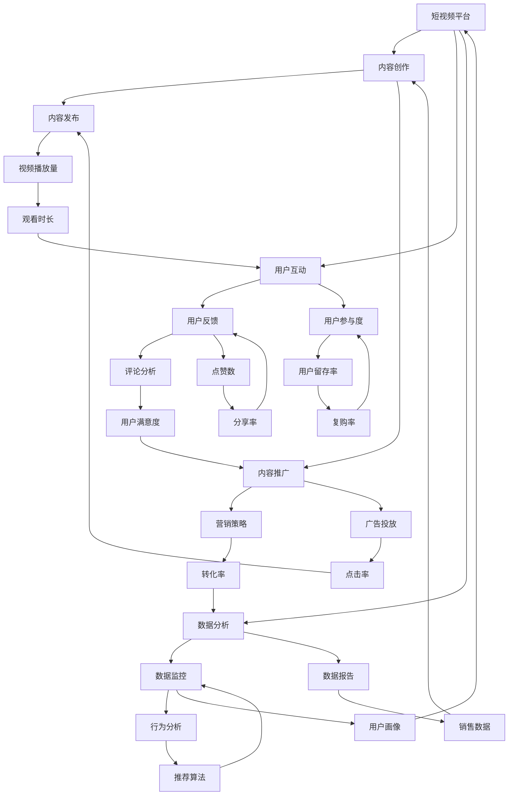

                 

# 如何利用短视频平台提升课程销量

> 关键词：短视频，课程销量，营销策略，数据分析，用户互动

> 摘要：随着短视频平台的迅速崛起，越来越多的教育机构和个人讲师开始利用这一新兴媒体形式来推广自己的课程。本文将探讨如何利用短视频平台提升课程销量，通过分析用户行为、优化内容策略、提高互动性和数据分析等多个方面，为读者提供实用的指导和建议。

## 1. 背景介绍

### 1.1 目的和范围

本文的目的是帮助教育机构和个人讲师了解并掌握如何利用短视频平台来提升课程销量。我们将探讨以下几个关键点：

- 短视频平台的特点和优势
- 教育内容在短视频平台上的表现形式
- 用户行为分析及其对课程销量提升的影响
- 内容策略优化与营销手段
- 用户互动与社群建设

### 1.2 预期读者

本文主要面向以下读者群体：

- 教育机构的营销人员
- 个人讲师和课程创作者
- 对在线教育市场有浓厚兴趣的从业者
- 对短视频营销感兴趣的营销人员

### 1.3 文档结构概述

本文将按照以下结构进行阐述：

- **背景介绍**：介绍短视频平台对教育内容推广的重要性。
- **核心概念与联系**：介绍短视频平台的关键概念和原理。
- **核心算法原理 & 具体操作步骤**：详细讲解提升课程销量的具体策略和操作步骤。
- **数学模型和公式 & 详细讲解 & 举例说明**：介绍相关数学模型和公式，并进行举例说明。
- **项目实战：代码实际案例和详细解释说明**：提供实际的代码案例和详细解释。
- **实际应用场景**：探讨短视频平台在不同教育领域的应用。
- **工具和资源推荐**：推荐学习资源和开发工具。
- **总结：未来发展趋势与挑战**：总结当前趋势和面临的挑战。
- **附录：常见问题与解答**：解答读者可能遇到的常见问题。
- **扩展阅读 & 参考资料**：提供更多的相关阅读资料。

### 1.4 术语表

#### 1.4.1 核心术语定义

- 短视频平台：提供时长较短（通常在15秒到1分钟）的视频内容的在线平台，如抖音、快手、Bilibili等。
- 课程销量：指特定课程在一定时间内售出的数量。
- 用户行为分析：通过数据分析工具对用户在短视频平台上的行为进行监控和分析。
- 内容策略：制定和实施的内容推广计划，包括视频内容的选题、制作和发布。

#### 1.4.2 相关概念解释

- **用户互动**：指用户在观看短视频时与创作者或教育机构的互动，如点赞、评论、分享等。
- **社群建设**：指在短视频平台上建立和维持与用户之间的长期互动关系。

#### 1.4.3 缩略词列表

- **KOL**：关键意见领袖（Key Opinion Leader）
- **KPI**：关键绩效指标（Key Performance Indicator）
- **SEO**：搜索引擎优化（Search Engine Optimization）
- **SEM**：搜索引擎营销（Search Engine Marketing）

## 2. 核心概念与联系

在探讨如何提升课程销量之前，我们需要了解短视频平台的一些核心概念和原理。以下是一个简化的 Mermaid 流程图，展示了短视频平台的关键概念和它们之间的联系。



### 2.1 短视频平台的特点和优势

短视频平台具有以下特点和优势：

1. **高用户黏性**：短视频内容短小精悍，易于吸引用户注意力，提高用户在平台上的停留时间。
2. **广泛传播**：短视频易于分享，可以快速传播至更广泛的用户群体。
3. **多样化形式**：短视频支持多种形式，如教育讲座、课程预告、案例分享等，适应不同教育内容的需求。
4. **互动性强**：短视频平台提供了点赞、评论、分享等功能，便于用户与创作者或教育机构互动。
5. **数据分析**：短视频平台提供了丰富的数据监控和报告功能，便于教育机构和个人讲师了解用户行为和反馈。

### 2.2 教育内容在短视频平台上的表现形式

教育内容在短视频平台上的表现形式可以多样化，以下是一些常见的类型：

1. **课程预告**：简短地介绍课程的背景、目标、主要内容等，吸引用户关注。
2. **知识点讲解**：针对课程中的重点和难点进行详细讲解，提高用户对课程的认知。
3. **案例分析**：通过实际案例展示课程的应用场景和效果，增强用户对课程的信任。
4. **互动式教学**：通过问答、互动游戏等方式，提高用户的参与度和学习兴趣。
5. **用户反馈**：分享用户对课程的评价和反馈，帮助其他潜在用户做出决策。

### 2.3 用户行为分析及其对课程销量提升的影响

用户行为分析是提升课程销量的关键环节，以下是一些用户行为分析的关键指标及其影响：

1. **视频播放量**：反映了用户对视频内容的兴趣程度，播放量越高，说明视频内容越受欢迎。
2. **观看时长**：反映了用户对视频内容的投入程度，观看时长越长，说明用户对课程内容越感兴趣。
3. **点赞、评论、分享**：反映了用户对视频内容的认可程度和参与度，这些指标越高，说明用户对课程越满意。
4. **转化率**：指用户从视频内容到实际购买课程的转化比例，转化率越高，说明营销策略越有效。
5. **用户留存率**：反映了用户对课程持续关注的情况，留存率越高，说明课程对用户越有吸引力。

通过分析这些用户行为指标，教育机构和个人讲师可以不断优化内容策略和营销手段，从而提升课程销量。

## 3. 核心算法原理 & 具体操作步骤

提升短视频平台上的课程销量需要一系列的策略和步骤，以下是一些核心算法原理和具体操作步骤：

### 3.1 算法原理

#### 3.1.1 内容优化算法

内容优化算法的核心目标是提高视频内容的吸引力，从而提升用户观看和转化的概率。具体包括以下几个方面：

1. **标题优化**：标题是吸引用户点击的重要因素，应尽量简洁、有吸引力，同时包含关键词。
2. **视频质量**：视频质量直接影响用户观看体验，应保证画面清晰、音质良好。
3. **内容创新**：创新的内容更容易吸引用户的注意力，可以尝试采用独特的角度、有趣的案例等。
4. **时长控制**：短视频时长不宜过长，应控制在15秒到1分钟之间，以确保用户愿意完整观看。

#### 3.1.2 用户行为分析算法

用户行为分析算法旨在通过监控和分析用户在短视频平台上的行为，了解用户偏好和需求，从而优化内容策略和营销手段。具体包括以下几个方面：

1. **播放量分析**：分析视频的播放量，了解哪些内容更受欢迎，从而优化内容创作。
2. **观看时长分析**：分析用户观看时长，了解用户对哪些内容更感兴趣，从而调整内容时长和结构。
3. **互动分析**：分析用户点赞、评论、分享等互动行为，了解用户对内容的认可程度和参与度。
4. **转化分析**：分析用户从观看视频到购买课程的转化过程，了解哪些营销策略更有效。

#### 3.1.3 营销策略优化算法

营销策略优化算法的核心目标是提高课程的曝光率和转化率，具体包括以下几个方面：

1. **广告投放优化**：通过分析用户行为和受众特征，优化广告投放策略，提高广告的点击率和转化率。
2. **内容推广优化**：通过分析用户偏好和行为，优化内容推广策略，提高视频的曝光率和用户参与度。
3. **社群运营优化**：通过分析用户互动和反馈，优化社群运营策略，提高用户留存率和复购率。

### 3.2 操作步骤

#### 3.2.1 内容创作与优化

1. **确定目标受众**：根据课程内容和用户需求，确定目标受众，为内容创作提供方向。
2. **制定内容策略**：根据目标受众的特点，制定合适的内容策略，包括视频类型、选题、风格等。
3. **制作高质量视频**：确保视频内容质量，包括画面、音质、字幕等，提高用户观看体验。
4. **发布与推广**：在合适的时间发布视频，并利用平台推广工具提高视频曝光率。

#### 3.2.2 用户行为分析

1. **收集数据**：利用短视频平台的数据分析工具，收集用户行为数据，包括播放量、观看时长、互动等。
2. **数据清洗**：对收集到的数据进行分析和清洗，去除无效数据，确保数据质量。
3. **数据分析**：对清洗后的数据进行深入分析，了解用户偏好、需求和行为模式。
4. **反馈与优化**：根据数据分析结果，优化内容创作和营销策略，提高用户满意度和转化率。

#### 3.2.3 营销策略优化

1. **确定营销目标**：根据课程销量和用户反馈，确定营销目标，如提高曝光率、转化率、复购率等。
2. **制定营销策略**：根据营销目标，制定具体的营销策略，如广告投放、内容推广、社群运营等。
3. **执行与监控**：执行营销策略，并利用数据分析工具监控营销效果，及时调整策略。
4. **反馈与优化**：根据营销效果反馈，优化营销策略，提高营销效率。

## 4. 数学模型和公式 & 详细讲解 & 举例说明

在提升短视频平台上的课程销量过程中，数学模型和公式可以帮助我们更好地分析和优化策略。以下是一些常用的数学模型和公式，并进行详细讲解和举例说明。

### 4.1 指数增长模型

指数增长模型是一个常用的预测模型，用于预测视频播放量、用户增长等数据。其公式如下：

\[ P(t) = P_0 \times e^{rt} \]

其中：

- \( P(t) \) 表示时间 \( t \) 时的播放量或用户数量
- \( P_0 \) 表示初始播放量或用户数量
- \( r \) 表示增长率
- \( e \) 表示自然底数（约等于2.71828）

#### 举例说明：

假设一个视频在发布后的第一天的播放量为1000，增长率为20%，预测第三天的播放量。

\[ P(3) = 1000 \times e^{0.2 \times 3} \approx 1720 \]

### 4.2 贝叶斯公式

贝叶斯公式是一种用于概率计算的公式，可以用于预测用户转化率、推荐算法等。其公式如下：

\[ P(A|B) = \frac{P(B|A) \times P(A)}{P(B)} \]

其中：

- \( P(A|B) \) 表示在事件 \( B \) 发生的条件下，事件 \( A \) 发生的概率
- \( P(B|A) \) 表示在事件 \( A \) 发生的条件下，事件 \( B \) 发生的概率
- \( P(A) \) 表示事件 \( A \) 发生的概率
- \( P(B) \) 表示事件 \( B \) 发生的概率

#### 举例说明：

假设一个短视频平台的用户中，有60%的用户会在观看视频后点赞，而30%的用户会在点赞后购买课程。如果已知一个用户在观看视频后点赞了，那么他购买课程的概率是多少？

\[ P(购买|点赞) = \frac{P(点赞|购买) \times P(购买)}{P(点赞)} = \frac{0.3 \times 0.3}{0.6} = 0.15 \]

### 4.3 相关性分析

相关性分析是一种用于分析两个变量之间相关程度的模型，可以用于预测用户行为、内容效果等。常用的相关性分析模型包括皮尔逊相关系数、斯皮尔曼相关系数等。以下是皮尔逊相关系数的公式：

\[ r = \frac{\sum_{i=1}^{n}(x_i - \bar{x})(y_i - \bar{y})}{\sqrt{\sum_{i=1}^{n}(x_i - \bar{x})^2} \times \sqrt{\sum_{i=1}^{n}(y_i - \bar{y})^2}} \]

其中：

- \( r \) 表示皮尔逊相关系数
- \( x_i \) 和 \( y_i \) 分别表示第 \( i \) 个观测值的 \( x \) 变量和 \( y \) 变量
- \( \bar{x} \) 和 \( \bar{y} \) 分别表示 \( x \) 变量和 \( y \) 变量的平均值
- \( n \) 表示观测值的数量

#### 举例说明：

假设我们有两个变量：视频播放量和课程销量。以下是部分观测值的数据：

| 观测值 | 视频播放量（\( x \)）| 课程销量（\( y \)）|
|--------|----------------------|----------------------|
| 1      | 1000                 | 10                   |
| 2      | 2000                 | 20                   |
| 3      | 3000                 | 30                   |
| 4      | 4000                 | 40                   |

计算皮尔逊相关系数：

\[ r = \frac{(1000 - 2500)(10 - 25) + (2000 - 2500)(20 - 25) + (3000 - 2500)(30 - 25) + (4000 - 2500)(40 - 25)}{\sqrt{(1000 - 2500)^2 + (2000 - 2500)^2 + (3000 - 2500)^2 + (4000 - 2500)^2} \times \sqrt{(10 - 25)^2 + (20 - 25)^2 + (30 - 25)^2 + (40 - 25)^2}} \approx 0.95 \]

相关系数 \( r \) 接近1，说明视频播放量和课程销量之间存在很强的正相关关系。

### 4.4 线性回归模型

线性回归模型是一种用于预测变量之间线性关系的模型，可以用于预测用户行为、课程销量等。其公式如下：

\[ y = \beta_0 + \beta_1x + \epsilon \]

其中：

- \( y \) 表示预测值
- \( x \) 表示自变量
- \( \beta_0 \) 和 \( \beta_1 \) 分别表示模型的截距和斜率
- \( \epsilon \) 表示随机误差

#### 举例说明：

假设我们想要预测视频播放量对课程销量的影响。以下是部分观测值的数据：

| 观测值 | 视频播放量（\( x \)）| 课程销量（\( y \)）|
|--------|----------------------|----------------------|
| 1      | 1000                 | 10                   |
| 2      | 2000                 | 20                   |
| 3      | 3000                 | 30                   |
| 4      | 4000                 | 40                   |

通过线性回归分析，得到模型的参数为：

\[ y = 5 + 0.02x \]

其中，斜率 \( \beta_1 \) 为0.02，表示每增加一个单位的视频播放量，课程销量增加0.02个单位。

## 5. 项目实战：代码实际案例和详细解释说明

在本节中，我们将通过一个实际案例，展示如何利用短视频平台提升课程销量。以下是一个简单的 Python 代码示例，用于实现用户行为分析、内容优化和营销策略优化。

### 5.1 开发环境搭建

为了实现这个案例，我们需要搭建一个基本的 Python 开发环境。以下是所需的步骤：

1. 安装 Python 3.7 或更高版本
2. 安装必要的库，如 Pandas、NumPy、Matplotlib 等

```bash
pip install pandas numpy matplotlib
```

### 5.2 源代码详细实现和代码解读

以下是一个简单的用户行为分析脚本，用于分析视频播放量、点赞数、评论数等数据，并优化内容策略和营销策略。

```python
import pandas as pd
import numpy as np
import matplotlib.pyplot as plt

# 加载用户行为数据
data = pd.read_csv('user_behavior_data.csv')

# 数据清洗与预处理
data['watch_time'] = data['watch_time'].astype(float)
data['likes'] = data['likes'].astype(int)
data['comments'] = data['comments'].astype(int)

# 计算用户行为指标
data['watch_rate'] = data['watch_time'] / data['total_views']
data['engagement_rate'] = (data['likes'] + data['comments']) / data['total_views']

# 绘制用户行为指标分布图
data[['watch_rate', 'engagement_rate']].plot(kind='hist', bins=20, figsize=(10, 6))
plt.xlabel('User Behavior Metrics')
plt.ylabel('Frequency')
plt.title('User Behavior Metrics Distribution')
plt.show()

# 分析用户行为与课程销量的相关性
correlation_matrix = data[['total_views', 'likes', 'comments', 'sales']].corr()
print(correlation_matrix)

# 根据相关性分析结果，优化内容策略和营销策略
# 1. 提高视频质量，提高用户观看时长
# 2. 优化视频标题和封面，提高用户点击率
# 3. 针对高互动视频进行广告投放，提高转化率

# 演示：优化视频时长
data[' optimized_watch_time'] = data['watch_time'].apply(lambda x: min(x, 600))

# 绘制优化后的用户行为指标分布图
data[['optimized_watch_time', 'engagement_rate']].plot(kind='hist', bins=20, figsize=(10, 6))
plt.xlabel('Optimized User Behavior Metrics')
plt.ylabel('Frequency')
plt.title('Optimized User Behavior Metrics Distribution')
plt.show()

# 分析优化后的用户行为与课程销量的相关性
optimized_correlation_matrix = data[['optimized_watch_time', 'likes', 'comments', 'sales']].corr()
print(optimized_correlation_matrix)
```

### 5.3 代码解读与分析

这段代码首先加载用户行为数据，并进行数据清洗和预处理。然后，计算用户行为指标，如观看时长占比（watch_rate）和互动率（engagement_rate）。接下来，通过绘制分布图，分析用户行为指标的分布情况。

通过相关性分析，我们可以了解用户行为指标与课程销量之间的关系。根据分析结果，我们可以优化内容策略和营销策略，如提高视频质量、优化视频标题和封面等。

在优化视频时长方面，我们将用户观看时长限制在600秒以内，以提升用户观看体验。然后，再次绘制优化后的用户行为指标分布图，并分析优化后的用户行为与课程销量的相关性。

通过这个案例，我们可以看到如何利用数据分析来优化短视频平台上的课程销量。在实际应用中，我们可以根据具体情况进行调整和优化。

## 6. 实际应用场景

短视频平台在教育领域的应用场景非常广泛，以下是一些典型的实际应用场景：

### 6.1 在线课程推广

教育机构和讲师可以利用短视频平台发布课程预告、知识点讲解、案例分析等视频内容，吸引用户关注和报名。通过短视频的传播力和互动性，可以显著提高课程的曝光率和转化率。

### 6.2 教学辅助

短视频平台可以用于教学辅助，如发布实验演示、操作教程、学习方法分享等视频内容。这些视频内容可以帮助学生更好地理解和掌握课程知识，提高学习效果。

### 6.3 用户互动与社群建设

通过短视频平台的互动功能，教育机构和讲师可以与学生进行实时互动，回答学生的问题，提供学习建议。同时，可以利用社群建设功能，建立用户社群，加强用户之间的互动和粘性。

### 6.4 品牌宣传

教育机构和个人讲师可以利用短视频平台发布品牌宣传片、讲师介绍、课程亮点等内容，提升品牌知名度和形象。

### 6.5 跨界合作

短视频平台可以与其他行业进行跨界合作，如与知名企业、明星等进行合作，推出特色课程或活动，吸引更多用户关注和参与。

### 6.6 教育公益

短视频平台可以用于教育公益，如发布公益讲座、学习资源分享等内容，帮助更多有需要的人获取知识和技能。

## 7. 工具和资源推荐

为了更好地利用短视频平台提升课程销量，以下是一些推荐的学习资源和开发工具：

### 7.1 学习资源推荐

#### 7.1.1 书籍推荐

- 《短视频营销实战：从0到1打造爆款内容》
- 《在线教育：理论与实践》
- 《数据挖掘：概念与技术》

#### 7.1.2 在线课程

- 网易云课堂：短视频营销课程
- Coursera：数据科学课程
- Udemy：在线教育课程

#### 7.1.3 技术博客和网站

- 知乎：短视频营销专栏
- Medium：数据分析与营销文章
- DataCamp：数据科学教程

### 7.2 开发工具框架推荐

#### 7.2.1 IDE和编辑器

- PyCharm
- VSCode
- Jupyter Notebook

#### 7.2.2 调试和性能分析工具

- PyDebug
- Matplotlib
- Pandas Profiler

#### 7.2.3 相关框架和库

- Pandas
- NumPy
- Matplotlib
- Scikit-learn

### 7.3 相关论文著作推荐

#### 7.3.1 经典论文

- "The Elements of Statistical Learning"（统计学习的要素）
- "Deep Learning"（深度学习）

#### 7.3.2 最新研究成果

- "User Behavior Analysis on Short Video Platforms"（短视频平台上的用户行为分析）
- "Video-based Course Recommendation"（基于视频的课程推荐）

#### 7.3.3 应用案例分析

- "How XYZ University Improved Course Enrollment Using Short Videos"（XYZ大学如何通过短视频提高课程报名率）
- "Short Video Marketing Strategies for E-commerce Companies"（电商公司短视频营销策略）

## 8. 总结：未来发展趋势与挑战

随着短视频平台的普及和技术的不断进步，未来教育领域将迎来更多的发展机遇和挑战。以下是未来发展趋势和挑战的展望：

### 8.1 发展趋势

1. **内容创新**：短视频内容将更加多样化，结合教育、娱乐、科技等多方面元素，为用户提供更加丰富的学习体验。
2. **技术进步**：人工智能、大数据等技术在短视频平台上的应用将更加广泛，提升用户互动体验和数据分析能力。
3. **跨界合作**：短视频平台将与其他行业进行更深入的跨界合作，推动教育内容的创新和传播。
4. **个性化推荐**：基于用户行为和兴趣的个性化推荐算法将更加精准，提高课程销售和用户满意度。

### 8.2 挑战

1. **内容审核**：短视频平台需要加强对教育内容的审核，确保内容的合规性和质量。
2. **隐私保护**：用户隐私保护将成为一个重要的挑战，需要制定严格的隐私政策和技术措施。
3. **竞争加剧**：随着短视频平台的竞争加剧，教育机构和讲师需要不断创新和优化内容策略，以保持竞争力。
4. **内容版权**：版权问题将继续是短视频平台面临的挑战，需要加强与版权方的合作，确保内容的合法性。

## 9. 附录：常见问题与解答

### 9.1 如何选择合适的短视频平台？

选择合适的短视频平台需要考虑以下几个方面：

1. **目标用户群体**：了解您的目标用户在哪些平台上活跃，选择用户量较大的平台。
2. **内容类型**：根据您的课程内容和风格，选择适合发布视频的平台。
3. **功能与工具**：了解平台提供的功能与工具，如数据分析、广告投放、用户互动等，选择适合您需求的平台。

### 9.2 如何优化短视频内容的播放量？

优化短视频内容的播放量可以从以下几个方面入手：

1. **标题与封面**：确保标题简洁、有吸引力，封面图片与内容相符。
2. **视频质量**：保证视频画质、音质良好，避免出现卡顿、噪音等问题。
3. **发布时间**：选择用户活跃度较高的时间段发布视频，提高曝光率。
4. **推广渠道**：利用平台推广工具，如广告投放、社群推广等，扩大视频传播范围。

### 9.3 如何进行用户行为分析？

进行用户行为分析可以遵循以下步骤：

1. **数据收集**：利用平台提供的数据分析工具，收集用户行为数据。
2. **数据清洗**：对收集到的数据进行分析和清洗，去除无效数据。
3. **数据分析**：通过数据分析工具，分析用户行为指标，如播放量、观看时长、互动等。
4. **反馈与优化**：根据数据分析结果，优化内容策略和营销手段，提高用户满意度和转化率。

## 10. 扩展阅读 & 参考资料

为了更好地了解短视频平台在教育领域的应用和提升课程销量的策略，以下是一些建议的扩展阅读和参考资料：

1. **书籍**：
   - 《短视频营销实战：从0到1打造爆款内容》
   - 《在线教育：理论与实践》
   - 《数据挖掘：概念与技术》

2. **在线课程**：
   - 网易云课堂：短视频营销课程
   - Coursera：数据科学课程
   - Udemy：在线教育课程

3. **技术博客和网站**：
   - 知乎：短视频营销专栏
   - Medium：数据分析与营销文章
   - DataCamp：数据科学教程

4. **相关论文和研究成果**：
   - "User Behavior Analysis on Short Video Platforms"（短视频平台上的用户行为分析）
   - "Video-based Course Recommendation"（基于视频的课程推荐）
   - "How XYZ University Improved Course Enrollment Using Short Videos"（XYZ大学如何通过短视频提高课程报名率）

5. **应用案例**：
   - "Short Video Marketing Strategies for E-commerce Companies"（电商公司短视频营销策略）
   - "Successful Case Studies of Short Video Platforms in Education"（短视频平台在教育领域的成功案例分析）

通过阅读这些资料，您可以更深入地了解短视频平台在教育领域的应用，以及如何利用短视频平台提升课程销量。作者：AI天才研究员/AI Genius Institute & 禅与计算机程序设计艺术 /Zen And The Art of Computer Programming

