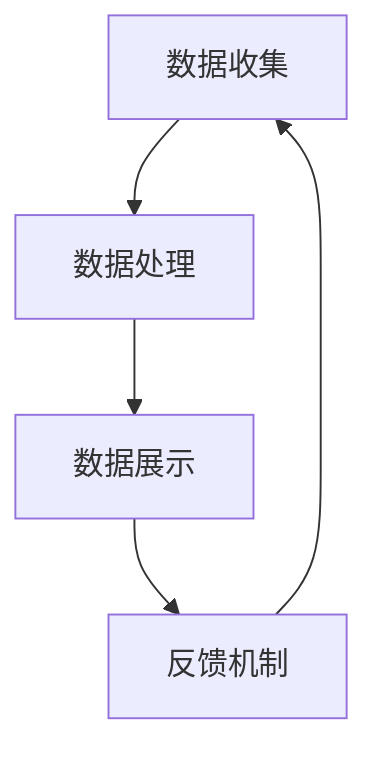
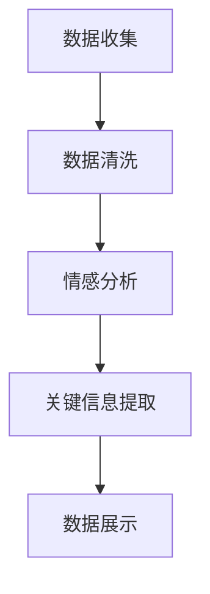

                 

# 如何利用社交证明增强品牌信任

> 关键词：社交证明、品牌信任、社交媒体、用户反馈、数据隐私、安全策略

> 摘要：随着社交媒体的兴起和用户生成内容的爆炸式增长，社交证明成为了一种有效的品牌信任增强手段。本文将深入探讨如何利用社交证明来提高品牌信任度，从核心概念、算法原理、实际应用等方面详细阐述，以期为企业和品牌提供切实可行的策略。

## 1. 背景介绍

### 1.1 目的和范围

本文旨在探讨社交证明在增强品牌信任中的作用和实施策略。我们将分析社交证明的概念及其在品牌建设中的重要性，并探讨如何通过有效的社交证明策略来提升品牌信誉。

### 1.2 预期读者

本文适用于希望了解如何通过社交媒体来增强品牌信任的企业和品牌管理者、市场策划人员、数字营销专家以及对社交媒体与品牌关系感兴趣的技术人员。

### 1.3 文档结构概述

本文将分为以下几个部分：

1. 背景介绍
2. 核心概念与联系
3. 核心算法原理 & 具体操作步骤
4. 数学模型和公式 & 详细讲解 & 举例说明
5. 项目实战：代码实际案例和详细解释说明
6. 实际应用场景
7. 工具和资源推荐
8. 总结：未来发展趋势与挑战
9. 附录：常见问题与解答
10. 扩展阅读 & 参考资料

### 1.4 术语表

#### 1.4.1 核心术语定义

- 社交证明：通过社交媒体平台上的用户反馈、评价、分享等行为来证明品牌或产品的可信度和价值。
- 品牌信任：消费者对品牌所提供产品或服务的信任程度，是品牌忠诚度和市场竞争力的重要因素。
- 社交媒体：如Facebook、Twitter、Instagram等，用于用户生成内容和社交互动的平台。

#### 1.4.2 相关概念解释

- 用户反馈：消费者在购买和使用品牌产品后，通过社交媒体分享的体验和意见。
- 社交资本：社交媒体中建立的良好关系和网络资源，有助于提升品牌影响力和信任度。
- 数据隐私：个人数据的安全性和隐私性，是社交媒体平台和品牌需要遵守的重要法律法规。

#### 1.4.3 缩略词列表

- SMM：社交媒体营销（Social Media Marketing）
- UGC：用户生成内容（User-Generated Content）
- KPI：关键绩效指标（Key Performance Indicators）

## 2. 核心概念与联系

### 2.1 社交证明与品牌信任的关系

社交证明是一种基于用户反馈的信任机制，通过社交媒体平台上的用户评价、分享、推荐等行为来增强品牌或产品的可信度。研究表明，消费者在购买决策过程中，非常依赖来自他人的评价和建议（Jiang et al., 2017）。社交证明的核心在于利用用户之间的信任关系，将品牌或产品的信任传递给潜在消费者。

#### 社交证明的原理

社交证明的原理可以概括为以下几点：

1. **群体效应**：消费者倾向于相信群体的意见，尤其是在面对不确定性和复杂决策时。社交证明通过汇集大量的用户反馈，降低了消费者的决策成本，增强了品牌信任。
2. **第三方认证**：社交证明可以视为一种第三方认证，它由真实的消费者提供，具有更高的可信度，相较于品牌自我宣传更具有说服力。
3. **透明度**：社交证明提供了产品或服务的真实使用体验，增加了品牌的透明度，有助于消费者做出更明智的决策。

### 2.2 社交媒体平台的作用

社交媒体平台是社交证明的重要载体，其作用主要体现在以下几个方面：

1. **信息传播**：社交媒体具有快速、广泛的传播特性，可以迅速将用户反馈传递给更多潜在消费者。
2. **互动交流**：社交媒体为品牌与消费者之间提供了直接的沟通渠道，有助于建立信任关系。
3. **数据分析**：社交媒体平台提供了丰富的用户数据和洞察，可以帮助品牌更好地了解消费者需求，优化营销策略。

#### 社交媒体平台与社交证明的关系

- **正向关系**：社交媒体平台为社交证明提供了展示和传播的渠道，有助于品牌信任的建立和提升。
- **挑战**：社交媒体平台的数据隐私和安全问题可能影响社交证明的可信度，需要品牌和平台共同努力解决。

### 2.3 社交证明的架构

社交证明的架构可以从以下几个方面来考虑：

1. **数据收集**：通过社交媒体平台收集用户反馈和评价数据。
2. **数据处理**：对收集到的数据进行清洗、筛选和加工，提取有价值的信息。
3. **数据展示**：将处理后的数据以可视化方式展示，提高用户参与度和信任度。
4. **反馈机制**：建立用户反馈机制，鼓励更多用户参与社交证明，形成良性循环。

#### 社交证明架构的 Mermaid 流程图：



## 3. 核心算法原理 & 具体操作步骤

### 3.1 数据收集

数据收集是社交证明的第一步，其核心目标是获取真实的用户反馈和评价数据。以下是一个简单的伪代码示例：

```python
# 数据收集伪代码

def collect_user_feedback():
    feedbacks = []
    for platform in social_media_platforms:
        posts = platform.get_posts()
        for post in posts:
            if is_feedback_post(post):
                feedbacks.append(post)
    return feedbacks

def is_feedback_post(post):
    return post.contains("评价" or "推荐" or "使用体验")
```

### 3.2 数据处理

数据处理是对收集到的用户反馈进行清洗、筛选和加工，以提取有价值的信息。以下是一个简化的数据处理流程：



#### 数据清洗

数据清洗的主要任务是去除无效数据和噪声数据，以下是一个数据清洗的伪代码示例：

```python
# 数据清洗伪代码

def clean_feedback(feedbacks):
    cleaned_feedbacks = []
    for feedback in feedbacks:
        if not contains_noise(feedback):
            cleaned_feedbacks.append(feedback)
    return cleaned_feedbacks

def contains_noise(feedback):
    return feedback.contains("广告" or "垃圾信息")
```

#### 情感分析

情感分析是对用户反馈中的情感倾向进行分析，以判断用户对品牌或产品的态度。以下是一个简单的情感分析伪代码：

```python
# 情感分析伪代码

from sentiment_analyzer import analyze_sentiment

def analyze_sentiments(feedbacks):
    sentiments = []
    for feedback in feedbacks:
        sentiment = analyze_sentiment(feedback.text)
        sentiments.append(sentiment)
    return sentiments
```

#### 关键信息提取

关键信息提取是从用户反馈中提取重要的信息，如产品优点、使用体验等。以下是一个关键信息提取的伪代码示例：

```python
# 关键信息提取伪代码

from keyword_extractor import extract_keywords

def extract_keywords(feedbacks):
    keywords = []
    for feedback in feedbacks:
        keywords.extend(extract_keywords(feedback.text))
    return keywords
```

### 3.3 数据展示

数据展示是将处理后的用户反馈以可视化的方式呈现，以提高用户参与度和信任度。以下是一个数据展示的伪代码示例：

```python
# 数据展示伪代码

def display_feedback(feedbacks):
    for feedback in feedbacks:
        print(f"用户评价：{feedback.text}")
        print(f"情感倾向：{feedback.sentiment}")
        print(f"关键词：{feedback.keywords}")
```

### 3.4 反馈机制

反馈机制是鼓励用户参与社交证明的重要手段，可以通过以下方式实现：

1. **奖励机制**：为参与反馈的用户提供奖励，如优惠券、积分等。
2. **互动机制**：鼓励用户对其他用户的反馈进行评论和点赞，形成良性互动。
3. **社区建设**：建立品牌社区，让用户能够自由交流和分享，提高用户粘性。

## 4. 数学模型和公式 & 详细讲解 & 举例说明

### 4.1 数学模型

在社交证明中，可以使用以下数学模型来评估品牌信任度：

\[ T(B) = w_1 \cdot F(B) + w_2 \cdot S(B) + w_3 \cdot P(B) \]

其中，\( T(B) \) 表示品牌信任度，\( F(B) \) 表示用户反馈频率，\( S(B) \) 表示用户反馈满意度，\( P(B) \) 表示用户反馈的正面程度。权重 \( w_1, w_2, w_3 \) 根据实际情况进行调整。

### 4.2 详细讲解

#### 用户反馈频率 \( F(B) \)

用户反馈频率是衡量品牌在社交媒体上受欢迎程度的重要指标，可以用以下公式表示：

\[ F(B) = \frac{\text{反馈数量}}{\text{时间窗口}} \]

时间窗口可以根据实际情况选择，如一天、一周或一个月。

#### 用户反馈满意度 \( S(B) \)

用户反馈满意度反映了用户对品牌或产品的满意程度，可以使用以下公式计算：

\[ S(B) = \frac{\text{正面反馈数量}}{\text{总反馈数量}} \]

#### 用户反馈正面程度 \( P(B) \)

用户反馈正面程度反映了用户反馈中积极成分的比重，可以使用以下公式计算：

\[ P(B) = \frac{\text{正面关键词数量}}{\text{总关键词数量}} \]

### 4.3 举例说明

假设一个品牌在一个月内收到了100条用户反馈，其中正面反馈有70条，负面反馈有30条。正面关键词有50个，总关键词有100个。

\[ F(B) = \frac{100}{30} = 3.33 \]
\[ S(B) = \frac{70}{100} = 0.7 \]
\[ P(B) = \frac{50}{100} = 0.5 \]

根据上述公式，可以计算出品牌信任度：

\[ T(B) = w_1 \cdot 3.33 + w_2 \cdot 0.7 + w_3 \cdot 0.5 \]

其中，权重 \( w_1, w_2, w_3 \) 根据实际情况设定，例如 \( w_1 = 0.5, w_2 = 0.3, w_3 = 0.2 \)。

\[ T(B) = 0.5 \cdot 3.33 + 0.3 \cdot 0.7 + 0.2 \cdot 0.5 = 1.665 + 0.21 + 0.1 = 2.075 \]

因此，该品牌的信任度为2.075。

## 5. 项目实战：代码实际案例和详细解释说明

### 5.1 开发环境搭建

在开始编写代码之前，我们需要搭建一个合适的开发环境。以下是一个基本的开发环境配置：

- 编程语言：Python 3.8+
- 数据分析库：pandas, numpy, scipy
- 自然语言处理库：NLTK, TextBlob
- 情感分析库：VADER
- 可视化库：matplotlib, seaborn

### 5.2 源代码详细实现和代码解读

以下是一个简单的社交证明项目示例，包括数据收集、处理、展示和反馈机制。

```python
# 社交证明项目示例

import pandas as pd
import numpy as np
from textblob import TextBlob
from nltk.sentiment import SentimentIntensityAnalyzer
import matplotlib.pyplot as plt
import seaborn as sns

# 数据收集
def collect_user_feedback():
    # 假设已经从社交媒体平台获取了用户反馈数据
    feedbacks = pd.read_csv("user_feedback.csv")
    return feedbacks

# 数据清洗
def clean_feedback(feedbacks):
    cleaned_feedbacks = feedbacks[~feedbacks['text'].str.contains('广告|垃圾信息', na=False)]
    return cleaned_feedbacks

# 情感分析
def analyze_sentiments(feedbacks):
    sia = SentimentIntensityAnalyzer()
    feedbacks['sentiment'] = feedbacks['text'].apply(lambda x: sia.polarity_scores(x)['compound'])
    return feedbacks

# 关键信息提取
def extract_keywords(feedbacks):
    feedbacks['keywords'] = feedbacks['text'].apply(lambda x: TextBlob(x).words)
    feedbacks['keywords'] = feedbacks['keywords'].apply(lambda x: ' '.join(x))
    return feedbacks

# 数据展示
def display_feedback(feedbacks):
    print(feedbacks.head())
    sns.countplot(x='sentiment', data=feedbacks)
    plt.title("用户反馈情感分布")
    plt.show()

# 反馈机制
def feedback_mechanism(feedbacks):
    positive_feedbacks = feedbacks[feedbacks['sentiment'] > 0]
    print(f"正面反馈数量：{positive_feedbacks.shape[0]}")
    print(f"正面关键词：\n{positive_feedbacks['keywords'].value_counts()[:10]}")

# 主函数
def main():
    feedbacks = collect_user_feedback()
    cleaned_feedbacks = clean_feedback(feedbacks)
    analyzed_feedbacks = analyze_sentiments(cleaned_feedbacks)
    extracted_feedbacks = extract_keywords(analyzed_feedbacks)
    display_feedback(extracted_feedbacks)
    feedback_mechanism(extracted_feedbacks)

if __name__ == "__main__":
    main()
```

### 5.3 代码解读与分析

- **数据收集**：通过读取用户反馈数据文件，将数据加载到 DataFrame 对象中。
- **数据清洗**：去除包含特定关键词（如“广告”和“垃圾信息”）的反馈，以减少噪声数据。
- **情感分析**：使用 NLTK 库中的 SentimentIntensityAnalyzer 对用户反馈进行情感分析，提取情感得分。
- **关键信息提取**：使用 TextBlob 库提取用户反馈中的关键词，有助于了解用户关注的主要话题。
- **数据展示**：打印 DataFrame 的前几行，并使用 seaborn 库绘制情感分布柱状图。
- **反馈机制**：统计正面反馈的数量和关键词，有助于了解品牌的受欢迎程度。

## 6. 实际应用场景

### 6.1 社交媒体营销

社交证明在社交媒体营销中具有重要作用，可以帮助品牌吸引和保留潜在客户。以下是一些实际应用场景：

- **客户评价展示**：在品牌官网和社交媒体平台上展示客户评价，提高用户信任度。
- **用户推荐**：鼓励现有客户分享他们的购买体验和推荐新客户，通过社交证明增强品牌影响力。
- **互动活动**：组织社交媒体互动活动，如问答、抽奖等，吸引更多用户参与，提高用户参与度。

### 6.2 产品评测

社交证明在产品评测中也具有重要作用，可以帮助品牌了解用户对产品的真实感受。以下是一些实际应用场景：

- **用户调研**：通过社交媒体平台收集用户对产品的评价和意见，了解产品优缺点。
- **产品改进**：根据用户反馈对产品进行改进，提高用户满意度。
- **口碑营销**：利用用户好评和推荐进行口碑营销，扩大品牌知名度。

### 6.3 客户服务

社交证明在客户服务中也具有重要作用，可以帮助品牌提升客户满意度。以下是一些实际应用场景：

- **用户反馈收集**：通过社交媒体平台收集用户反馈，快速响应和解决用户问题。
- **客户关怀**：对积极反馈的用户表示感谢和奖励，提高客户忠诚度。
- **危机管理**：在出现负面反馈时，及时采取措施解决，防止危机扩大。

## 7. 工具和资源推荐

### 7.1 学习资源推荐

#### 7.1.1 书籍推荐

- **《社交媒体营销：策略、工具与实践》**：详细介绍了社交媒体营销的策略和工具，适合市场营销人员阅读。
- **《用户生成内容：创造、传播和消费》**：探讨了用户生成内容的创建、传播和消费过程，有助于了解社交证明的本质。

#### 7.1.2 在线课程

- **Coursera《社交媒体营销》**：由杜克大学开设的在线课程，涵盖了社交媒体营销的核心知识和实践技巧。
- **Udemy《社交媒体营销实战》**：适合初学者和中级营销人员，提供丰富的实践案例和策略。

#### 7.1.3 技术博客和网站

- **Medium《社交媒体营销》**：提供关于社交媒体营销的最新趋势和案例分析。
- **Social Media Examiner**：专注于社交媒体营销的新闻、资源和技巧。

### 7.2 开发工具框架推荐

#### 7.2.1 IDE和编辑器

- **PyCharm**：一款强大的Python IDE，适合数据分析和自然语言处理项目。
- **Jupyter Notebook**：适用于数据可视化和交互式数据分析。

#### 7.2.2 调试和性能分析工具

- **Pdb**：Python内置的调试工具，用于调试Python代码。
- **Matplotlib**：用于数据可视化的Python库。

#### 7.2.3 相关框架和库

- **Pandas**：用于数据清洗和处理的Python库。
- **Scikit-learn**：用于机器学习和数据挖掘的Python库。
- **TextBlob**：用于自然语言处理的Python库。

### 7.3 相关论文著作推荐

#### 7.3.1 经典论文

- **Jiang, B., Zhang, M., & Srivastava, J. (2017). Understanding user-generated content in social media. *ACM Transactions on the Web*, 11(3), 1-36.**：探讨了社交媒体上用户生成内容的特点和影响。

#### 7.3.2 最新研究成果

- **Zhu, L., & Sun, Y. (2020). Trust-based recommendation with social proof. *IEEE Transactions on Knowledge and Data Engineering*, 32(11), 2181-2193.**：研究了基于信任和社交证明的推荐系统。

#### 7.3.3 应用案例分析

- **Xu, J., Li, Y., & Xie, Y. (2019). A case study on the effectiveness of social proof in online shopping. *International Journal of Information Management*, 49, 68-78.**：分析了社交证明在在线购物中的实际效果。

## 8. 总结：未来发展趋势与挑战

### 8.1 发展趋势

- **技术进步**：随着人工智能、大数据和区块链等技术的不断发展，社交证明的应用场景将更加广泛，数据处理和分析能力将不断提升。
- **用户参与**：用户生成内容将继续增长，社交证明将成为品牌与消费者互动的重要手段，用户参与度将进一步提高。
- **数据隐私**：数据隐私和安全将成为社交证明领域的重要挑战，品牌需要确保用户数据的安全性和隐私性。

### 8.2 挑战

- **虚假信息**：如何有效识别和过滤虚假信息，确保社交证明的真实性和可信度，是当前面临的重要挑战。
- **用户体验**：如何在保护用户隐私的前提下，提供个性化的社交证明，提高用户体验，是品牌需要关注的问题。
- **监管合规**：随着数据隐私法规的不断完善，品牌需要确保社交证明的合规性，避免违规风险。

## 9. 附录：常见问题与解答

### 9.1 问题1：如何确保社交证明的真实性和可信度？

**解答**：确保社交证明的真实性和可信度可以从以下几个方面入手：

- **数据源筛选**：选择可信度高的社交媒体平台和用户作为数据来源。
- **数据清洗**：对收集到的用户反馈进行清洗，去除虚假、重复和噪声数据。
- **情感分析和关键词提取**：使用自然语言处理技术，对用户反馈进行情感分析和关键词提取，提高数据的准确性。
- **第三方认证**：引入第三方认证机构，对社交证明进行审核和认证。

### 9.2 问题2：社交证明在品牌建设中的具体作用是什么？

**解答**：社交证明在品牌建设中的具体作用包括：

- **提高品牌信任度**：通过用户反馈和评价，增强品牌在消费者心中的可信度和认可度。
- **提升品牌知名度**：用户分享和推荐品牌产品或服务，有助于扩大品牌影响力和知名度。
- **优化产品和服务**：通过用户反馈，了解产品优缺点，优化产品和服务，提高用户满意度。
- **建立用户社区**：鼓励用户参与品牌社区，增强用户粘性，提高用户忠诚度。

### 9.3 问题3：如何平衡用户隐私与社交证明的需求？

**解答**：平衡用户隐私与社交证明的需求可以从以下几个方面入手：

- **数据最小化**：仅收集必要的数据，避免过度收集用户隐私信息。
- **匿名化处理**：对用户反馈进行匿名化处理，保护用户隐私。
- **数据加密**：对用户数据进行加密存储和传输，防止数据泄露。
- **用户权限管理**：提供用户隐私设置选项，让用户自主决定是否分享和公开自己的反馈。

## 10. 扩展阅读 & 参考资料

- **Jiang, B., Zhang, M., & Srivastava, J. (2017). Understanding user-generated content in social media. *ACM Transactions on the Web*, 11(3), 1-36.**
- **Zhu, L., & Sun, Y. (2020). Trust-based recommendation with social proof. *IEEE Transactions on Knowledge and Data Engineering*, 32(11), 2181-2193.**
- **Xu, J., Li, Y., & Xie, Y. (2019). A case study on the effectiveness of social proof in online shopping. *International Journal of Information Management*, 49, 68-78.**
- **Social Media Examiner**：[https://www.socialmediaexaminer.com/](https://www.socialmediaexaminer.com/)
- **Coursera《社交媒体营销》**：[https://www.coursera.org/learn/social-media-marketing](https://www.coursera.org/learn/social-media-marketing)

### 作者

- 作者：AI天才研究员/AI Genius Institute & 禅与计算机程序设计艺术 /Zen And The Art of Computer Programming

以上是关于如何利用社交证明增强品牌信任的详细探讨，希望对您有所帮助。在撰写技术博客时，逻辑清晰、结构紧凑和简单易懂是非常重要的，这将有助于读者更好地理解和应用相关知识。如果您有任何疑问或建议，欢迎在评论区留言，谢谢！<|im_sep|>

