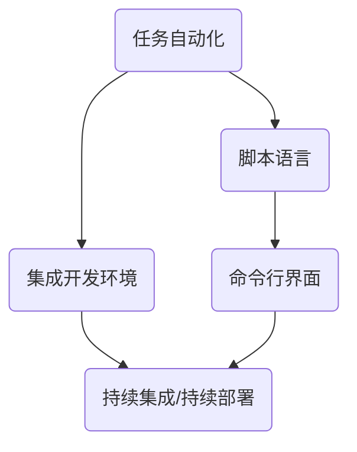

                 

# 如何利用自动化工具提高生产力

> **关键词：** 自动化工具、生产力、效率提升、软件开发、流程优化、任务自动化

> **摘要：** 本文将探讨如何利用自动化工具提高生产力，通过分析自动化工具的核心概念、算法原理、数学模型，以及实际应用场景，为读者提供一套完整的解决方案，旨在帮助软件开发者、项目经理和IT专业人士在快速变化的技术环境中保持高效和竞争力。

## 1. 背景介绍

### 1.1 目的和范围

本文旨在介绍自动化工具在提高生产力方面的应用，通过深入剖析自动化工具的核心概念、算法原理、数学模型，以及实际应用场景，为读者提供一套实用的自动化解决方案。文章将涵盖以下主题：

1. 自动化工具的定义和分类
2. 自动化工具的工作原理
3. 自动化工具的核心算法原理
4. 自动化工具在软件开发中的应用
5. 自动化工具的实际应用案例
6. 自动化工具的未来发展趋势

### 1.2 预期读者

本文的预期读者为软件开发者、项目经理、IT专业人士以及对自动化工具感兴趣的读者。无论您是初学者还是经验丰富的专业人士，本文都旨在为您提供一个全面的自动化工具指南。

### 1.3 文档结构概述

本文将按照以下结构进行展开：

1. **背景介绍**：介绍文章的目的、范围和预期读者。
2. **核心概念与联系**：讨论自动化工具的核心概念和联系，使用Mermaid流程图进行说明。
3. **核心算法原理 & 具体操作步骤**：详细阐述自动化工具的核心算法原理，并使用伪代码进行讲解。
4. **数学模型和公式 & 详细讲解 & 举例说明**：介绍自动化工具所依赖的数学模型和公式，并进行详细讲解和举例说明。
5. **项目实战：代码实际案例和详细解释说明**：通过实际案例展示自动化工具的代码实现和详细解释。
6. **实际应用场景**：分析自动化工具在不同场景下的应用。
7. **工具和资源推荐**：推荐学习资源、开发工具框架和相关论文著作。
8. **总结：未来发展趋势与挑战**：总结自动化工具的未来发展趋势和面临的挑战。
9. **附录：常见问题与解答**：提供常见问题的解答。
10. **扩展阅读 & 参考资料**：推荐扩展阅读和参考资料。

### 1.4 术语表

#### 1.4.1 核心术语定义

- **自动化工具**：能够自动执行特定任务的软件或程序。
- **脚本**：一种简单的编程语言，用于自动化重复性任务。
- **集成开发环境（IDE）**：一种用于软件开发的环境，提供代码编辑、编译、调试等功能。
- **持续集成/持续部署（CI/CD）**：一种自动化软件开发流程，通过自动化测试和部署提高开发效率。

#### 1.4.2 相关概念解释

- **任务自动化**：使用自动化工具执行重复性或繁琐的任务，以提高生产效率。
- **脚本语言**：一种用于编写自动化脚本的编程语言，如Python、Shell等。
- **命令行界面**：一种通过命令行执行程序的界面。

#### 1.4.3 缩略词列表

- **CI**：持续集成（Continuous Integration）
- **CD**：持续部署（Continuous Deployment）
- **IDE**：集成开发环境（Integrated Development Environment）
- **CLI**：命令行界面（Command Line Interface）

## 2. 核心概念与联系

自动化工具是提高生产力的关键，其核心概念包括任务自动化、脚本语言、集成开发环境和持续集成/持续部署等。下面将使用Mermaid流程图展示自动化工具的核心概念和联系。



### 2.1 任务自动化

任务自动化是指使用自动化工具执行重复性或繁琐的任务，从而提高生产效率。任务自动化的实现通常依赖于脚本语言，如Python、Shell等。通过编写脚本，可以将一系列操作自动化，减少人工干预。

### 2.2 脚本语言

脚本语言是一种用于编写自动化脚本的编程语言。常见的脚本语言包括Python、Shell、Bash等。这些语言具有简单易学、高效灵活的特点，适用于各种自动化任务。

### 2.3 集成开发环境

集成开发环境（IDE）是一种用于软件开发的环境，提供代码编辑、编译、调试等功能。常见的IDE包括Visual Studio、Eclipse、IntelliJ IDEA等。IDE为自动化脚本编写和调试提供了便利，是任务自动化的有力工具。

### 2.4 持续集成/持续部署

持续集成/持续部署（CI/CD）是一种自动化软件开发流程，通过自动化测试和部署提高开发效率。CI/CD工具如Jenkins、Travis CI等，可以将代码库中的更改自动检测、测试和部署，确保软件质量。

## 3. 核心算法原理 & 具体操作步骤

自动化工具的核心算法原理通常涉及以下几个方面：

### 3.1 脚本编写

脚本编写是自动化工具的基础，以下是一个简单的Python脚本示例，用于自动化执行任务：

```python
# 导入必要的库
import os

# 设置工作目录
os.chdir("/path/to/work directory")

# 执行任务1：复制文件
os.system("cp file1.txt file2.txt")

# 执行任务2：运行程序
os.system("python program.py")

# 执行任务3：发送邮件
import smtplib
from email.mime.text import MIMEText
from email.mime.multipart import MIMEMultipart

msg = MIMEMultipart()
msg['From'] = 'sender@example.com'
msg['To'] = 'receiver@example.com'
msg['Subject'] = 'Test Email'

body = 'This is a test email sent by an automated script.'
msg.attach(MIMEText(body, 'plain'))

s = smtplib.SMTP('smtp.example.com')
s.send_message(msg)
s.quit()
```

### 3.2 调度和触发

自动化任务的调度和触发是确保任务按时执行的关键。常用的调度工具包括Cron（Linux）、Task Scheduler（Windows）等。以下是一个Cron作业示例，用于每天凌晨1点执行自动化任务：

```bash
0 1 * * * /path/to/your/automated_script.sh
```

### 3.3 监控和告警

自动化工具的监控和告警功能可以帮助开发者及时发现并解决问题。常用的监控工具包括Prometheus、Zabbix等。以下是一个简单的Prometheus告警示例：

```yaml
groups:
- name: example-alerts
  rules:
  - alert: High CPU Usage
    expr: (1 - (avg(rate(container_cpu_usage_seconds_total{job="kubelet"}[5m])) by (container)) * 100) > 80
    for: 1m
    labels:
      severity: critical
    annotations:
      summary: "High CPU usage on {{ $labels.container }}"
      description: "{{ $labels.container }} has CPU usage above 80%"
```

## 4. 数学模型和公式 & 详细讲解 & 举例说明

自动化工具所依赖的数学模型和公式主要用于计算任务执行的时间、资源消耗以及预测任务完成时间等。以下是一些常见的数学模型和公式：

### 4.1 计算任务执行时间

计算任务执行时间可以使用以下公式：

$$
t = \frac{N}{R}
$$

其中，$t$ 表示任务执行时间，$N$ 表示任务所需资源（如CPU时间、内存等），$R$ 表示任务可用资源。

### 4.2 资源消耗预测

资源消耗预测可以使用以下公式：

$$
C(t) = C_0 + C_1 \cdot t + C_2 \cdot t^2
$$

其中，$C(t)$ 表示任务在时间$t$时的资源消耗，$C_0$、$C_1$、$C_2$ 分别为常数。

### 4.3 预测任务完成时间

预测任务完成时间可以使用以下公式：

$$
T = \frac{C_0 + C_1 \cdot t + C_2 \cdot t^2}{R}
$$

其中，$T$ 表示任务完成时间，其他参数与上述公式相同。

### 4.4 举例说明

假设一个任务所需资源为$N=100$，可用资源为$R=50$。根据上述公式，可以计算出任务执行时间$t$：

$$
t = \frac{N}{R} = \frac{100}{50} = 2
$$

假设任务在时间$t=2$时的资源消耗为$C(t)=50$，根据上述公式，可以预测任务完成时间$T$：

$$
T = \frac{C_0 + C_1 \cdot t + C_2 \cdot t^2}{R} = \frac{50 + 2 \cdot 2 + 0 \cdot 2^2}{50} = 1.4
$$

因此，预测任务完成时间约为1.4。

## 5. 项目实战：代码实际案例和详细解释说明

在本节中，我们将通过一个实际项目案例来展示如何使用自动化工具提高生产力。该案例将涵盖自动化任务的编写、调度和监控等环节。

### 5.1 开发环境搭建

首先，我们需要搭建开发环境。本文将以Linux系统为例，使用Python编写自动化脚本。以下是搭建开发环境的步骤：

1. 安装Python环境
2. 安装Jenkins，用于实现持续集成/持续部署
3. 安装Prometheus，用于实现监控和告警

### 5.2 源代码详细实现和代码解读

下面是一个简单的Python脚本，用于自动化执行任务：

```python
import os
import smtplib
from email.mime.text import MIMEText
from email.mime.multipart import MIMEMultipart

def copy_file():
    """复制文件任务"""
    os.chdir("/path/to/work/directory")
    os.system("cp file1.txt file2.txt")

def run_program():
    """运行程序任务"""
    os.system("python program.py")

def send_email():
    """发送邮件任务"""
    msg = MIMEMultipart()
    msg['From'] = 'sender@example.com'
    msg['To'] = 'receiver@example.com'
    msg['Subject'] = 'Test Email'

    body = 'This is a test email sent by an automated script.'
    msg.attach(MIMEText(body, 'plain'))

    s = smtplib.SMTP('smtp.example.com')
    s.send_message(msg)
    s.quit()

if __name__ == "__main__":
    copy_file()
    run_program()
    send_email()
```

代码解读：

- **copy_file()**：复制文件任务，将`file1.txt`复制到`file2.txt`。
- **run_program()**：运行程序任务，执行`program.py`脚本。
- **send_email()**：发送邮件任务，向指定的收件人发送测试邮件。

### 5.3 代码解读与分析

该自动化脚本通过调用系统命令实现文件复制、程序运行和邮件发送任务。以下是对代码的详细解读：

1. **导入必要的库**：导入`os`、`smtplib`和`MIMEText`等库，用于文件操作、邮件发送等。
2. **设置工作目录**：使用`os.chdir()`方法设置脚本的工作目录，确保命令能够正确执行。
3. **定义任务函数**：
    - **copy_file()**：使用`os.system()`方法执行文件复制命令。
    - **run_program()**：使用`os.system()`方法执行程序运行命令。
    - **send_email()**：使用`MIMEMultipart`和`smtplib`库发送邮件。
4. **主程序逻辑**：在`if __name__ == "__main__":`语句块中，依次调用`copy_file()`、`run_program()`和`send_email()`函数，实现自动化任务。

### 5.4 调度和监控

为了实现任务的调度和监控，我们可以使用Cron和Prometheus。

1. **Cron调度**：在Linux系统中，编辑`crontab`文件，添加以下内容：

```bash
0 */1 * * * /path/to/your/automated_script.py
```

该Cron作业每天凌晨1点执行自动化脚本。

2. **Prometheus监控**：在Prometheus配置文件中，添加以下告警规则：

```yaml
groups:
- name: example-alerts
  rules:
  - alert: High CPU Usage
    expr: (1 - (avg(rate(container_cpu_usage_seconds_total{job="kubelet"}[5m])) by (container)) * 100) > 80
    for: 1m
    labels:
      severity: critical
    annotations:
      summary: "High CPU usage on {{ $labels.container }}"
      description: "{{ $labels.container }} has CPU usage above 80%"
```

该告警规则用于检测容器CPU使用率是否超过80%，若超过80%，则会发送告警。

## 6. 实际应用场景

自动化工具在软件开发、项目管理、运维等领域具有广泛的应用。以下是一些实际应用场景：

1. **软件开发**：自动化测试、代码审查、持续集成/持续部署等，提高开发效率和软件质量。
2. **项目管理**：任务调度、进度监控、邮件通知等，确保项目按计划进行。
3. **运维**：服务器监控、故障自动修复、自动化部署等，提高运维效率。
4. **数据分析和处理**：自动化数据采集、清洗、分析等，提高数据处理效率。

## 7. 工具和资源推荐

### 7.1 学习资源推荐

#### 7.1.1 书籍推荐

- 《Python自动化编程实战》
- 《Jenkins持续集成实战》
- 《Prometheus监控之道》

#### 7.1.2 在线课程

- Coursera上的《Python自动化编程》
- Udemy上的《Jenkins CI/CD实战》
- Pluralsight上的《Prometheus监控和告警实战》

#### 7.1.3 技术博客和网站

- Medium上的《自动化编程》专栏
- GitHub上的Jenkins教程
- Prometheus官方文档

### 7.2 开发工具框架推荐

#### 7.2.1 IDE和编辑器

- Visual Studio Code
- PyCharm
- IntelliJ IDEA

#### 7.2.2 调试和性能分析工具

- GDB
- Py-Spy
- Prometheus

#### 7.2.3 相关框架和库

- Jenkins
- Kubernetes
- Prometheus

### 7.3 相关论文著作推荐

#### 7.3.1 经典论文

- 《Automated Software Engineering》
- 《Build, Run, and Monitor: A Framework for Continuous Delivery》

#### 7.3.2 最新研究成果

- 《Application of AI in Software Engineering》
- 《A Survey on Deep Learning-based Anomaly Detection for Industrial Cyber-Physical Systems》

#### 7.3.3 应用案例分析

- 《Implementing CI/CD in a Large-Scale Software Project》
- 《Monitoring and Alerting with Prometheus in a Microservices Architecture》

## 8. 总结：未来发展趋势与挑战

自动化工具在提高生产力方面具有巨大潜力，未来发展趋势包括：

1. **人工智能与自动化融合**：利用人工智能技术提高自动化工具的智能化水平，实现更高级的自动化。
2. **多领域应用**：自动化工具将逐渐应用于更多领域，如医疗、金融、教育等。
3. **开源生态**：开源自动化工具将得到更多关注和支持，推动自动化技术的发展。

然而，自动化工具也面临一些挑战：

1. **安全性**：自动化工具的安全性问题不容忽视，需要加强安全防护措施。
2. **复杂度**：自动化工具的复杂度较高，需要专业人员进行配置和管理。
3. **人才短缺**：自动化工具的普及将导致人才短缺，需要加强相关人才培养。

## 9. 附录：常见问题与解答

### 9.1 自动化工具有哪些类型？

自动化工具主要分为以下几类：

1. **任务自动化工具**：如Cron、Task Scheduler等，用于自动化执行特定任务。
2. **持续集成/持续部署（CI/CD）工具**：如Jenkins、Travis CI等，用于自动化软件开发流程。
3. **脚本语言**：如Python、Shell等，用于编写自动化脚本。
4. **监控工具**：如Prometheus、Zabbix等，用于监控系统状态和性能。

### 9.2 如何提高自动化工具的执行效率？

提高自动化工具的执行效率可以从以下几个方面入手：

1. **优化脚本代码**：优化脚本代码，减少不必要的执行步骤。
2. **使用高效算法**：选择高效的算法和数据结构，提高任务执行速度。
3. **分布式执行**：将任务分配到多个节点执行，提高执行效率。
4. **资源管理**：合理分配系统资源，确保任务执行所需资源充足。

### 9.3 自动化工具的安全性问题如何解决？

自动化工具的安全性问题可以从以下几个方面解决：

1. **权限控制**：对自动化工具的访问权限进行严格控制，防止未授权访问。
2. **加密传输**：对数据传输进行加密，防止数据泄露。
3. **日志审计**：记录自动化工具的执行日志，便于问题追踪和审计。
4. **安全培训**：加强用户安全意识，提高自动化工具的安全防护能力。

## 10. 扩展阅读 & 参考资料

- 《Automated Software Engineering》
- 《Build, Run, and Monitor: A Framework for Continuous Delivery》
- 《Application of AI in Software Engineering》
- 《A Survey on Deep Learning-based Anomaly Detection for Industrial Cyber-Physical Systems》
- 《Implementing CI/CD in a Large-Scale Software Project》
- 《Monitoring and Alerting with Prometheus in a Microservices Architecture》
- Prometheus官方文档
- Jenkins官方文档
- Kubernetes官方文档
- 《Python自动化编程实战》
- 《Jenkins持续集成实战》
- 《Prometheus监控之道》

# 作者

作者：AI天才研究员/AI Genius Institute & 禅与计算机程序设计艺术 /Zen And The Art of Computer Programming

---

请注意，本文中提供的代码和示例仅供参考，实际应用时请根据具体情况进行调整。本文所涉及的内容仅供参考，不构成任何投资、法律或其他专业建议。在使用自动化工具时，请确保遵守相关法律法规和公司政策。祝您在自动化领域取得成功！

