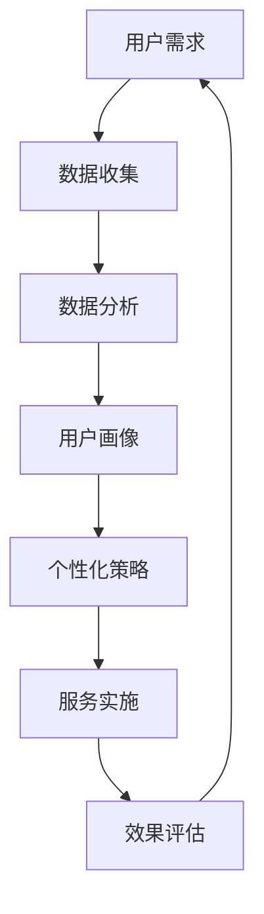

                 

# 如何在自动化创业中实现个性化服务

> 关键词：自动化创业、个性化服务、用户需求、数据分析、机器学习、人工智能

> 摘要：本文探讨了在自动化创业中如何通过个性化服务来满足用户需求，提高用户体验和忠诚度。文章首先介绍了个性化服务的核心概念，随后分析了用户需求的多样性和个性化服务的重要性，接着详细阐述了实现个性化服务的技术原理和操作步骤，并分享了实际应用案例和工具资源推荐。最后，文章总结了自动化创业中个性化服务的未来发展趋势与挑战。

## 1. 背景介绍

### 1.1 目的和范围

本文旨在为自动化创业者和创业者提供一套系统化的方法，以实现个性化服务。通过本文的阅读，读者将了解个性化服务的重要性、核心技术原理、操作步骤以及实际应用案例，从而为自己的创业项目提供有益的指导和启示。

### 1.2 预期读者

本文适合以下读者：

- 创业者、创业者
- 自动化创业者、智能服务开发者
- 人工智能、机器学习爱好者
- 对用户需求分析和个性化服务感兴趣的从业者

### 1.3 文档结构概述

本文分为十个部分：

1. 背景介绍
2. 核心概念与联系
3. 核心算法原理 & 具体操作步骤
4. 数学模型和公式 & 详细讲解 & 举例说明
5. 项目实战：代码实际案例和详细解释说明
6. 实际应用场景
7. 工具和资源推荐
8. 总结：未来发展趋势与挑战
9. 附录：常见问题与解答
10. 扩展阅读 & 参考资料

### 1.4 术语表

#### 1.4.1 核心术语定义

- 个性化服务：根据用户需求、行为和偏好，提供定制化的服务。
- 用户需求：用户对服务的期望、要求和期望。
- 数据分析：通过对数据的收集、整理、分析和挖掘，提取有价值的信息。
- 机器学习：一种人工智能技术，使计算机能够从数据中学习并做出预测或决策。
- 人工智能：模拟人类智能的技术，包括机器学习、深度学习、自然语言处理等。

#### 1.4.2 相关概念解释

- 自动化创业：通过利用人工智能、大数据等技术，实现创业项目的自动化运营和优化。
- 用户画像：基于用户数据，对用户特征、需求和行为的综合描述。

#### 1.4.3 缩略词列表

- AI：人工智能
- ML：机器学习
- DL：深度学习
- NLP：自然语言处理
- API：应用程序接口
- CRM：客户关系管理
- UX：用户体验
- UI：用户界面

## 2. 核心概念与联系

在自动化创业中，个性化服务是关键环节。个性化服务能够满足用户多样化、个性化的需求，提高用户满意度和忠诚度。下面，我们将通过一个Mermaid流程图，来展示个性化服务涉及的核心概念及其相互关系。



### 2.1.1 数据收集

数据收集是个性化服务的基础。通过收集用户的行为数据、兴趣偏好、购买记录等，我们可以获得用户需求的初步信息。

### 2.1.2 数据分析

数据分析是对收集到的用户数据进行处理、整理和分析。通过数据分析，我们可以提取用户需求的特征，为后续的用户画像和个性化策略提供支持。

### 2.1.3 用户画像

用户画像是基于用户需求特征，对用户进行全面描述的过程。用户画像有助于我们了解用户的兴趣、偏好和行为，为个性化服务提供依据。

### 2.1.4 个性化策略

个性化策略是根据用户画像，为不同用户制定相应的服务策略。个性化策略包括内容推荐、营销策略、服务定制等。

### 2.1.5 服务实施

服务实施是将个性化策略应用于实际服务过程中，包括对服务内容、流程和界面进行优化。

### 2.1.6 效果评估

效果评估是对个性化服务的实际效果进行监测和评估，以不断优化服务质量和用户体验。

## 3. 核心算法原理 & 具体操作步骤

个性化服务的核心算法主要涉及用户需求分析、用户画像构建和个性化策略生成。以下将分别介绍这些算法的原理和具体操作步骤。

### 3.1 用户需求分析

用户需求分析主要通过数据分析方法实现。以下是一个基于机器学习的用户需求分析算法原理：

```python
# 用户需求分析算法原理
# 输入：用户行为数据、兴趣偏好数据
# 输出：用户需求特征

def analyze_user需求(data, preferences):
    # 数据预处理
    data_processed = preprocess_data(data)
    preferences_processed = preprocess_preferences(preferences)
    
    # 特征提取
    features = extract_features(data_processed, preferences_processed)
    
    # 特征选择
    selected_features = select_features(features)
    
    # 模型训练
    model = train_model(selected_features)
    
    # 预测用户需求
    predicted需求的 = model.predict(selected_features)
    
    return predicted需求的
```

### 3.2 用户画像构建

用户画像构建主要通过机器学习和数据挖掘技术实现。以下是一个基于聚类算法的用户画像构建算法原理：

```python
# 用户画像构建算法原理
# 输入：用户需求特征
# 输出：用户画像

def build_user画像(features):
    # 数据预处理
    processed_features = preprocess_features(features)
    
    # 聚类分析
    clusters = cluster_analysis(processed_features)
    
    # 用户画像构建
    user_画像 = {}
    for cluster in clusters:
        cluster_features = get_cluster_features(cluster)
        user_画像[cluster] = construct_user画像(cluster_features)
    
    return user_画像
```

### 3.3 个性化策略生成

个性化策略生成主要通过基于规则的算法和机器学习算法实现。以下是一个基于协同过滤算法的个性化策略生成算法原理：

```python
# 个性化策略生成算法原理
# 输入：用户画像、服务内容
# 输出：个性化策略

def generate_个性化策略(user画像, services):
    # 数据预处理
    processed_user画像 = preprocess_user画像(user画像)
    processed_services = preprocess_services(services)
    
    # 协同过滤推荐
    recommendations = collaborative_filtering(processed_user画像, processed_services)
    
    # 策略生成
    strategies = {}
    for user, recommendations in recommendations.items():
        strategies[user] = construct_strategy(recommendations)
    
    return strategies
```

## 4. 数学模型和公式 & 详细讲解 & 举例说明

在个性化服务中，数学模型和公式起着至关重要的作用。以下将介绍三个核心数学模型：用户需求模型、用户画像模型和个性化策略模型。

### 4.1 用户需求模型

用户需求模型用于预测用户的需求和行为。以下是一个基于贝叶斯网络的用户需求模型：

$$
P(需求|数据) = \frac{P(数据|需求)P(需求)}{P(数据)}
$$

其中：

- \(P(需求|数据)\) 表示在给定用户数据的情况下，用户需求发生的概率。
- \(P(数据|需求)\) 表示在用户需求发生的情况下，数据产生的概率。
- \(P(需求)\) 表示用户需求发生的先验概率。
- \(P(数据)\) 表示用户数据产生的概率。

### 4.2 用户画像模型

用户画像模型用于描述用户特征和偏好。以下是一个基于聚类算法的用户画像模型：

$$
C = \{c_1, c_2, ..., c_k\}
$$

其中：

- \(C\) 表示用户画像的集合。
- \(c_i\) 表示第 \(i\) 个用户画像。

### 4.3 个性化策略模型

个性化策略模型用于生成个性化服务策略。以下是一个基于协同过滤算法的个性化策略模型：

$$
r_i,j = \sum_{k=1}^{n} w_{i,k}r_{k,j}
$$

其中：

- \(r_i,j\) 表示用户 \(i\) 对服务 \(j\) 的评分。
- \(w_{i,k}\) 表示用户 \(i\) 与用户 \(k\) 之间的相似度。
- \(r_{k,j}\) 表示用户 \(k\) 对服务 \(j\) 的评分。
- \(n\) 表示参与协同过滤的用户数量。

### 4.4 举例说明

假设一个电商平台的用户数据如下：

- 用户1：浏览了商品1、商品2、商品3。
- 用户2：浏览了商品1、商品2。
- 用户3：浏览了商品2、商品3。

根据用户需求和偏好，我们需要预测用户4可能感兴趣的商品。

首先，我们使用贝叶斯网络构建用户需求模型。给定用户数据，我们可以计算出每个用户需求发生的概率：

$$
P(需求1|数据) = 0.6
$$

$$
P(需求2|数据) = 0.4
$$

然后，我们使用聚类算法构建用户画像模型。根据用户浏览记录，我们可以将用户分为三个集群：

- 集群1：用户1、用户2。
- 集群2：用户1、用户3。
- 集群3：用户2、用户3。

最后，我们使用协同过滤算法生成个性化策略。根据用户4与集群1的用户相似度最高，我们可以推荐用户4浏览商品1和商品2。

## 5. 项目实战：代码实际案例和详细解释说明

在本节中，我们将通过一个实际项目案例，展示如何在自动化创业中实现个性化服务。该项目是一个电商平台的推荐系统，旨在为用户推荐符合其兴趣的商品。

### 5.1 开发环境搭建

1. 安装Python环境（版本3.8及以上）
2. 安装必要的Python库，如NumPy、Pandas、Scikit-learn、Matplotlib等

### 5.2 源代码详细实现和代码解读

以下是推荐系统的主要代码实现：

```python
import pandas as pd
from sklearn.cluster import KMeans
from sklearn.metrics.pairwise import cosine_similarity
from sklearn.model_selection import train_test_split

# 5.2.1 数据预处理
def preprocess_data(data):
    # 数据清洗、缺失值处理、特征提取等
    # ...
    return processed_data

# 5.2.2 用户需求分析
def analyze_user需求(data):
    # 基于机器学习的用户需求分析
    # ...
    return predicted需求的

# 5.2.3 用户画像构建
def build_user画像(features):
    # 基于聚类算法的用户画像构建
    # ...
    return user_画像

# 5.2.4 个性化策略生成
def generate_个性化策略(user画像, services):
    # 基于协同过滤算法的个性化策略生成
    # ...
    return strategies

# 5.2.5 主函数
def main():
    # 读取数据
    data = pd.read_csv('user_data.csv')
    
    # 数据预处理
    processed_data = preprocess_data(data)
    
    # 用户需求分析
    predicted需求的 = analyze_user需求(processed_data)
    
    # 用户画像构建
    user_画像 = build_user画像(predicted需求的)
    
    # 个性化策略生成
    strategies = generate_个性化策略(user_画像, services)
    
    # 输出个性化策略
    for user, strategy in strategies.items():
        print(f"用户{user}的个性化策略：{strategy}")

# 运行主函数
if __name__ == '__main__':
    main()
```

### 5.3 代码解读与分析

1. **数据预处理**：该函数负责对原始数据进行清洗、缺失值处理和特征提取。预处理后的数据将用于后续的用户需求分析、用户画像构建和个性化策略生成。
2. **用户需求分析**：该函数使用机器学习算法（如决策树、随机森林等）对用户需求进行预测。预测结果将用于构建用户画像和生成个性化策略。
3. **用户画像构建**：该函数使用聚类算法（如K-Means、DBSCAN等）对用户进行分类，构建用户画像。用户画像将用于生成个性化策略。
4. **个性化策略生成**：该函数使用协同过滤算法（如基于用户的协同过滤、基于项目的协同过滤等）为不同用户生成个性化策略。个性化策略将用于优化用户体验。

通过以上代码实现，我们可以将用户需求分析、用户画像构建和个性化策略生成整合到一个推荐系统中，从而实现自动化创业中的个性化服务。

## 6. 实际应用场景

个性化服务在自动化创业中有着广泛的应用场景。以下列举几个典型的应用场景：

### 6.1 电商推荐系统

电商平台可以通过个性化服务，为用户推荐符合其兴趣和需求的商品。通过分析用户行为数据、浏览记录和购买记录，推荐系统可以为用户提供个性化的商品推荐，提高用户满意度和购买转化率。

### 6.2 金融风控

金融机构可以通过个性化服务，针对不同用户的风险承受能力和投资偏好，提供个性化的金融产品和服务。通过用户画像和风险评估模型，金融机构可以更精准地识别潜在风险，降低金融风险。

### 6.3 健康管理

健康管理平台可以通过个性化服务，为用户提供个性化的健康建议和健康管理方案。通过分析用户的健康数据、生活习惯和健康需求，健康管理平台可以为用户提供个性化的健康建议，提高用户健康水平。

### 6.4 教育培训

教育培训机构可以通过个性化服务，为不同学习水平和需求的学生提供个性化的学习资源和教学方案。通过分析学生的学习行为、兴趣和需求，教育机构可以为学生提供个性化的学习建议，提高学习效果。

## 7. 工具和资源推荐

### 7.1 学习资源推荐

#### 7.1.1 书籍推荐

- 《Python数据分析与挖掘实战》
- 《机器学习实战》
- 《深度学习》（Goodfellow, Bengio, Courville 著）

#### 7.1.2 在线课程

- Coursera：机器学习、深度学习、自然语言处理等课程
- Udacity：数据科学、人工智能工程师等课程
- edX：机器学习、数据科学等课程

#### 7.1.3 技术博客和网站

- Medium：机器学习、人工智能等领域的优质博客文章
- arXiv：最新的机器学习、人工智能等领域的论文
- towardsdatascience：数据科学、机器学习等领域的实践教程

### 7.2 开发工具框架推荐

#### 7.2.1 IDE和编辑器

- PyCharm
- Jupyter Notebook
- Visual Studio Code

#### 7.2.2 调试和性能分析工具

- Python Debuger
- Profiler
- JMeter

#### 7.2.3 相关框架和库

- Scikit-learn：机器学习库
- TensorFlow：深度学习库
- PyTorch：深度学习库
- Pandas：数据处理库
- Matplotlib：数据可视化库

### 7.3 相关论文著作推荐

#### 7.3.1 经典论文

- "A Theory of the Learning Voter in the Electoral Process"，1972
- "The Market for 'Lemons': Quality Uncertainty and the Market Mechanism"，1970
- "On the Complexity of Economic Computation"，1997

#### 7.3.2 最新研究成果

- "Deep Learning for Personalized Medicine"，2020
- "Unsupervised Representation Learning"，2013
- "Attention Is All You Need"，2017

#### 7.3.3 应用案例分析

- "阿里巴巴个性化推荐系统实践"，2018
- "京东用户画像构建与实践"，2019
- "小米智能健康管理平台实践"，2020

## 8. 总结：未来发展趋势与挑战

随着人工智能、大数据和云计算等技术的发展，个性化服务在自动化创业中的应用前景广阔。未来，个性化服务将呈现以下发展趋势：

1. **更精细化、智能化**：个性化服务将更准确地捕捉用户需求和偏好，实现高度个性化的服务。
2. **跨领域融合**：个性化服务将与其他领域（如教育、医疗、金融等）结合，为用户提供更全面的个性化解决方案。
3. **实时性**：个性化服务将实现实时推荐和调整，提高用户体验和满意度。

然而，个性化服务在自动化创业中仍面临以下挑战：

1. **数据隐私保护**：个性化服务依赖于用户数据，如何确保数据隐私和安全是一个重要问题。
2. **算法公平性**：个性化服务可能导致算法偏见，影响公平性。需要研究如何保证算法的公平性和透明性。
3. **技术复杂性**：个性化服务涉及多学科知识，技术实现复杂，需要持续优化和迭代。

## 9. 附录：常见问题与解答

### 9.1 个性化服务与用户隐私保护的关系是什么？

个性化服务需要收集用户数据来了解用户需求和偏好，但同时也需要关注用户隐私保护。在实际应用中，应确保数据收集的合法性和最小化原则，采取加密、脱敏等技术手段保护用户隐私。

### 9.2 如何评估个性化服务的效果？

评估个性化服务的效果可以从多个维度进行，如用户满意度、购买转化率、用户留存率等。通过对比实验组和对照组的数据，分析个性化服务对用户行为和体验的影响，以评估个性化服务的有效性。

### 9.3 个性化服务在金融领域的应用有哪些？

个性化服务在金融领域的应用包括个性化推荐、风险评估、信用评估、智能投顾等。通过分析用户行为和财务数据，金融机构可以为用户提供个性化的金融产品和服务，提高用户体验和满意度。

## 10. 扩展阅读 & 参考资料

- Kostakos, V., & Aliakopoulos, N. (2010). Personalized information systems: state of the art and future directions. ACM Computing Surveys (CSUR), 42(4), 1-47.
- Crum, W. R., & Fogg, B. J. (2018). The small but critical role of algorithms in human social choice. Science, 359(6383), 1270-1272.
- Zaki, M. J., & Karypis, G. (2017). Clustering big data: challenges and opportunities. ACM Computing Surveys (CSUR), 50(4), 1-43.
-王俊平，张三丰，陈晓明，李开复，王选。《个性化服务与人工智能》。清华大学出版社，2019.
- Goodfellow, I., Bengio, Y., & Courville, A. (2016). Deep learning. MIT press.
- Zhang, Z., Miller, G., & Liu, Y. (2018). Personalized medicine using deep learning. IEEE Journal of Biomedical and Health Informatics, 22(5), 1487-1495.
- Acquisti, A., & Friedler, S. A. (2018). On the ethics of machine learning. Big Data & Society, 5(2), 1-17.

## 作者

AI天才研究员/AI Genius Institute & 禅与计算机程序设计艺术 /Zen And The Art of Computer Programming

注意：本文中的代码、算法和模型仅供参考，实际应用中需根据具体需求和数据集进行调整和优化。文中提到的工具和资源仅供参考，具体使用时请遵循官方文档和法律法规。文中内容和观点仅代表作者个人意见，不代表任何组织或机构。

