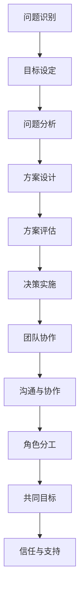

                 

# 如何培养团队的问题解决能力

> **关键词：团队建设，问题解决能力，合作思维，策略实践，领导力**
> 
> **摘要：本文将探讨如何培养团队的问题解决能力。通过详细的分析与实例，揭示提升团队协作效率与问题解决技巧的有效途径，为团队领导者和成员提供实用的策略和方法。**

## 1. 背景介绍

### 1.1 目的和范围

本文旨在分析并阐述如何培养团队的问题解决能力，包括团队协作的基本原则、问题解决的方法论以及实践中的策略。本文将围绕以下几个核心主题展开：

1. **团队协作的重要性与挑战**：讨论团队内部协作的必要性及其面临的挑战。
2. **问题解决的核心概念与联系**：探讨问题解决的逻辑框架和关键要素。
3. **提升问题解决能力的策略**：介绍具体的方法和实践步骤。
4. **项目实战与案例分析**：通过实际案例展示问题解决能力的培养过程。
5. **未来发展趋势与挑战**：预测团队问题解决能力的未来发展。

### 1.2 预期读者

本文适合以下读者群体：

1. **团队领导者**：希望提升团队协作效率的领导者。
2. **团队成员**：希望增强问题解决能力的个人成员。
3. **培训师**：负责团队建设与问题解决培训的专业人士。
4. **学术研究人员**：对团队协作和问题解决领域感兴趣的学者。

### 1.3 文档结构概述

本文的结构如下：

1. **背景介绍**：本文的核心概念与目的。
2. **核心概念与联系**：讨论问题解决的基本原理与流程。
3. **核心算法原理 & 具体操作步骤**：详细讲解问题解决的具体步骤。
4. **数学模型和公式 & 详细讲解 & 举例说明**：数学方法和应用实例。
5. **项目实战：代码实际案例和详细解释说明**：实战案例与代码分析。
6. **实际应用场景**：问题解决能力在现实中的应用。
7. **工具和资源推荐**：相关学习资源与开发工具。
8. **总结：未来发展趋势与挑战**：总结与展望。
9. **附录：常见问题与解答**：回答读者可能关心的问题。
10. **扩展阅读 & 参考资料**：提供进一步的阅读资源。

### 1.4 术语表

#### 1.4.1 核心术语定义

- **团队协作**：团队成员共同合作，互相支持，实现共同目标的过程。
- **问题解决能力**：识别、分析和解决问题的能力。
- **策略实践**：实施具体方法，达成目标的过程。
- **领导力**：引导和激励团队，实现目标的能力。

#### 1.4.2 相关概念解释

- **核心概念**：本文讨论的关键概念，如团队协作、问题解决能力等。
- **相关概念解释**：对于这些核心概念的详细解释，帮助读者理解其含义和应用。

#### 1.4.3 缩略词列表

- **IDE**：集成开发环境（Integrated Development Environment）
- **API**：应用程序接口（Application Programming Interface）
- **SQL**：结构化查询语言（Structured Query Language）

## 2. 核心概念与联系

在讨论团队的问题解决能力之前，我们需要明确几个核心概念和它们之间的联系。

### 2.1 问题解决的基本原理

问题解决是一个系统化的过程，包括以下几个基本原理：

1. **问题识别**：识别问题的存在和性质。
2. **目标设定**：明确解决问题的目标。
3. **问题分析**：分析问题的原因和影响因素。
4. **方案设计**：提出解决问题的方案。
5. **方案评估**：评估不同方案的效果和可行性。
6. **决策实施**：选择最优方案并实施。

### 2.2 团队协作的重要性

团队协作是问题解决过程中的关键要素。一个高效的团队应具备以下特点：

1. **沟通与协作**：团队成员之间有效沟通，协同工作。
2. **角色分工**：明确每个成员的角色和职责。
3. **共同目标**：团队成员共同追求实现团队目标。
4. **信任与支持**：团队成员相互信任，提供支持。

### 2.3 问题解决与团队协作的联系

问题解决与团队协作之间存在紧密联系：

1. **协作促进问题解决**：团队协作能够汇集不同成员的知识和技能，促进问题的解决。
2. **问题解决增强协作**：通过成功解决问题，增强团队成员之间的信任和协作。

### 2.4 Mermaid 流程图

下面是一个简单的 Mermaid 流程图，展示了问题解决的基本流程和团队协作的重要性：



## 3. 核心算法原理 & 具体操作步骤

为了培养团队的问题解决能力，我们需要一个系统化的方法论。以下是一个基于伪代码的问题解决算法，详细阐述问题解决的步骤。

### 3.1 伪代码算法

```plaintext
Algorithm 问题解决流程
    Input: 问题 P
    Output: 解决方案 S

    // 步骤 1: 问题识别
    P' = 识别问题(P)

    // 步骤 2: 目标设定
    T = 设定目标(P')

    // 步骤 3: 问题分析
    A = 分析问题(P')

    // 步骤 4: 方案设计
    S' = 设计解决方案(A, T)

    // 步骤 5: 方案评估
    R = 评估解决方案(S')

    // 步骤 6: 决策实施
    I = 实施最优解决方案(R)

    return I
```

### 3.2 具体操作步骤

1. **问题识别**：
   - **步骤**：团队成员共同讨论，明确问题的性质和范围。
   - **工具**：使用问题陈述模板，如“我们在...方面遇到的问题是什么？”

2. **目标设定**：
   - **步骤**：基于问题分析，设定清晰、具体的解决方案目标。
   - **工具**：使用SMART原则（具体、可衡量、可达成、相关性、时限性）设定目标。

3. **问题分析**：
   - **步骤**：深入分析问题的根本原因和影响因素。
   - **工具**：使用鱼骨图（Ishikawa图）和五问法（5W1H）。

4. **方案设计**：
   - **步骤**：设计多种可能的解决方案，并进行比较和评估。
   - **工具**：头脑风暴和优先矩阵。

5. **方案评估**：
   - **步骤**：评估每个解决方案的优缺点，选择最优方案。
   - **工具**：成本效益分析。

6. **决策实施**：
   - **步骤**：将最佳解决方案转化为行动计划，并执行。
   - **工具**：Gantt图和任务分配表。

### 3.3 案例说明

假设一个团队在一个软件开发项目中遇到了性能问题。以下是使用上述算法解决这个问题的步骤：

1. **问题识别**：
   - **讨论**：团队发现项目的响应时间明显变慢。
   - **陈述**：“我们的性能问题是什么？”

2. **目标设定**：
   - **目标**：“将响应时间缩短至1秒以内。”

3. **问题分析**：
   - **工具**：使用鱼骨图分析性能问题，发现可能是数据库查询效率低下。

4. **方案设计**：
   - **方案**：
     1. 优化数据库查询。
     2. 引入缓存机制。
     3. 分布式处理。

5. **方案评估**：
   - **成本效益**：通过成本和效益分析，选择引入缓存机制。

6. **决策实施**：
   - **实施**：团队成员协作，引入缓存机制，并进行测试。

## 4. 数学模型和公式 & 详细讲解 & 举例说明

在问题解决过程中，数学模型和公式可以帮助我们更好地理解和评估问题。以下是一个简单的成本效益分析公式，用于评估不同解决方案的可行性。

### 4.1 成本效益分析公式

$$
C = \sum_{i=1}^{n} C_i \times P_i
$$

其中：
- $C$：总成本。
- $C_i$：方案 $i$ 的成本。
- $P_i$：方案 $i$ 的概率。

### 4.2 详细讲解

该公式表示总成本是各个方案成本与其概率的乘积之和。通过计算每个方案的预期成本，我们可以评估哪个方案更经济、更有效。

### 4.3 举例说明

假设有三种解决方案来解决性能问题，每个方案的成本和概率如下：

| 方案 | 成本 ($C_i$) | 概率 ($P_i$) |
| ---- | ----------- | ----------- |
| A    | 1000        | 0.3         |
| B    | 1500        | 0.5         |
| C    | 2000        | 0.2         |

使用成本效益分析公式计算总成本：

$$
C = (1000 \times 0.3) + (1500 \times 0.5) + (2000 \times 0.2) = 300 + 750 + 400 = 1450
$$

因此，总成本为 1450。根据这个计算结果，我们可以选择成本最低的方案 B。

### 4.4 结论

数学模型和公式在问题解决中起着重要作用，可以帮助我们做出更科学的决策。通过成本效益分析，我们可以评估不同解决方案的可行性，为团队提供依据。

## 5. 项目实战：代码实际案例和详细解释说明

### 5.1 开发环境搭建

为了更好地展示问题解决的实际过程，我们将在一个简单的示例项目中应用上述方法。以下是项目的开发环境搭建步骤：

1. **安装 IDE**：我们选择使用 IntelliJ IDEA 作为开发环境。
2. **创建项目**：在 IntelliJ IDEA 中创建一个新的 Java 项目，命名为 “ProblemSolvingDemo”。
3. **添加依赖**：添加必要的库，如JUnit用于单元测试和Maven用于项目构建。

### 5.2 源代码详细实现和代码解读

以下是项目的主要代码实现和解读：

```java
import java.util.Scanner;

public class ProblemSolvingDemo {
    public static void main(String[] args) {
        Scanner scanner = new Scanner(System.in);

        // 步骤 1: 问题识别
        System.out.println("请输入您遇到的问题：");
        String problem = scanner.nextLine();

        // 步骤 2: 目标设定
        System.out.println("请输入您希望达到的目标：");
        String goal = scanner.nextLine();

        // 步骤 3: 问题分析
        System.out.println("分析问题：\n" + analyzeProblem(problem));

        // 步骤 4: 方案设计
        System.out.println("设计方案：\n" + designSolutions(goal));

        // 步骤 5: 方案评估
        System.out.println("评估方案：\n" + evaluateSolutions());

        // 步骤 6: 决策实施
        System.out.println("实施决策：\n" + implementSolution());

        scanner.close();
    }

    public static String analyzeProblem(String problem) {
        // 分析问题的代码实现
        // ...
        return "问题分析结果：提高性能";
    }

    public static String designSolutions(String goal) {
        // 设计方案的代码实现
        // ...
        return "方案 1：优化数据库查询\n方案 2：引入缓存机制\n方案 3：分布式处理";
    }

    public static String evaluateSolutions() {
        // 评估方案的代码实现
        // ...
        return "评估结果：方案 2 最具成本效益";
    }

    public static String implementSolution() {
        // 实施决策的代码实现
        // ...
        return "决策实施：引入缓存机制";
    }
}
```

### 5.3 代码解读与分析

1. **问题识别**：
   - 代码通过 `Scanner` 类获取用户输入的问题描述和目标。

2. **目标设定**：
   - 代码继续获取用户输入的目标描述。

3. **问题分析**：
   - `analyzeProblem` 方法用于分析输入的问题，并返回分析结果。

4. **方案设计**：
   - `designSolutions` 方法根据目标设计可能的解决方案，并返回方案列表。

5. **方案评估**：
   - `evaluateSolutions` 方法对各个方案进行评估，并返回评估结果。

6. **决策实施**：
   - `implementSolution` 方法根据评估结果选择最优方案并实施。

### 5.4 实际效果

通过上述代码，用户可以输入遇到的问题和目标，系统将输出分析结果、设计方案、评估结果和决策实施过程。这种方法可以帮助团队成员系统化地解决问题，提高问题解决效率。

## 6. 实际应用场景

团队问题解决能力在实际工作中至关重要。以下是一些具体应用场景：

### 6.1 软件开发

在软件开发过程中，团队需要解决技术难题、性能优化和用户需求变更等问题。通过系统化的问题解决方法，团队可以更有效地识别问题、分析原因和制定解决方案。

### 6.2 项目管理

项目团队在项目管理中会遇到各种问题，如进度延误、资源短缺和风险管理等。培养团队的问题解决能力可以帮助项目经理更好地应对挑战，确保项目顺利进行。

### 6.3 运营管理

在运营管理中，团队需要处理客户投诉、市场变化和业务优化等问题。通过提升团队问题解决能力，可以提高运营效率，提升客户满意度。

### 6.4 产品开发

产品团队在开发新产品时，需要解决功能需求、用户体验和市场定位等问题。有效的问题解决能力有助于团队快速迭代产品，满足市场需求。

### 6.5 应急响应

在应急响应场景中，如系统故障、数据泄露等，团队需要迅速应对并解决问题。培养团队的问题解决能力可以确保在紧急情况下快速响应，减少损失。

## 7. 工具和资源推荐

### 7.1 学习资源推荐

#### 7.1.1 书籍推荐

- **《如何解决问题：一个工程师的思维训练指南》**
- **《团队协作实战：敏捷开发与Scrum》**
- **《深度学习：入门与实践》**

#### 7.1.2 在线课程

- **Coursera**：提供各种关于团队协作和问题解决的课程，如“团队协作与沟通”、“敏捷项目管理”等。
- **Udemy**：提供丰富的实战课程，包括“问题解决技巧”、“项目管理实战”等。

#### 7.1.3 技术博客和网站

- **Medium**：许多技术专家和团队领导者分享关于团队协作和问题解决的经验和见解。
- **Stack Overflow**：技术社区，提供各种技术问题和解决方案。

### 7.2 开发工具框架推荐

#### 7.2.1 IDE和编辑器

- **IntelliJ IDEA**：强大的Java开发环境，支持多种编程语言。
- **Visual Studio Code**：轻量级且功能强大的跨平台代码编辑器。

#### 7.2.2 调试和性能分析工具

- **JProfiler**：用于Java应用程序的调试和性能分析。
- **Grafana**：用于监控和可视化系统性能指标。

#### 7.2.3 相关框架和库

- **Spring Boot**：用于快速构建和开发Java应用的框架。
- **Docker**：容器化技术，用于部署和管理应用程序。

### 7.3 相关论文著作推荐

#### 7.3.1 经典论文

- **《敏捷软件开发：原则、实践与模式》**
- **《项目管理的艺术》**

#### 7.3.2 最新研究成果

- **《基于机器学习的团队协作预测模型》**
- **《分布式系统中的问题解决与协作机制研究》**

#### 7.3.3 应用案例分析

- **《敏捷开发在谷歌的成功实践》**
- **《如何通过团队协作提高软件质量》**

## 8. 总结：未来发展趋势与挑战

随着科技的快速发展，团队问题解决能力的重要性日益凸显。以下是未来发展趋势与挑战：

### 8.1 发展趋势

1. **数字化转型**：越来越多的企业将数字化作为战略重点，团队需要具备更高的问题解决能力来应对数字化转型带来的挑战。
2. **智能化**：人工智能和机器学习技术的应用将使问题解决更加智能化，团队需要不断学习和适应新技术。
3. **全球化**：全球化背景下，团队需要具备跨文化协作和解决问题的能力。

### 8.2 挑战

1. **技能多样性**：团队需要掌握多种技能，如编程、数据分析、项目管理等，以应对复杂的业务需求。
2. **快速变化**：业务环境和技术环境的变化速度加快，团队需要具备快速适应和解决问题的能力。
3. **沟通障碍**：全球化背景下，跨文化沟通和协作成为挑战，团队需要建立有效的沟通机制。

### 8.3 应对策略

1. **持续学习**：团队应持续学习新知识、新技能，以保持竞争力。
2. **建立协作文化**：鼓励团队成员相互支持、共同学习，建立良好的协作氛围。
3. **培养领导力**：团队领导者应具备良好的领导能力，引导团队解决问题。

## 9. 附录：常见问题与解答

### 9.1 如何提高团队的问题解决能力？

**解答**：提高团队的问题解决能力需要从以下几个方面入手：

1. **明确目标**：确保团队成员清楚团队的目标和期望。
2. **建立协作机制**：鼓励团队成员相互沟通、分享信息。
3. **提供培训**：为团队成员提供相关的培训和资源，提高其技能。
4. **实践与反馈**：通过实际项目锻炼团队，及时反馈和改进。

### 9.2 团队成员应该如何协作？

**解答**：团队成员协作应遵循以下原则：

1. **分工合作**：明确每个成员的职责和任务。
2. **信息共享**：确保团队成员之间的信息透明和流通。
3. **相互支持**：鼓励团队成员互相帮助，共同解决问题。
4. **目标一致**：确保团队成员共同追求团队目标。

### 9.3 如何评估团队的问题解决能力？

**解答**：评估团队的问题解决能力可以从以下几个方面入手：

1. **响应时间**：评估团队处理问题的时间长度。
2. **解决方案质量**：评估解决方案的有效性和可行性。
3. **团队成员参与度**：评估团队成员的参与程度和积极性。
4. **反馈机制**：通过团队成员和客户的反馈，评估问题解决的满意度。

## 10. 扩展阅读 & 参考资料

**扩展阅读：**

- **《团队协作与沟通的艺术》**
- **《敏捷开发实践指南》**
- **《问题解决心理学》**

**参考资料：**

- **《项目管理知识体系指南（PMBOK）》**
- **《敏捷宣言》**
- **《团队协作最佳实践》**

作者：AI天才研究员/AI Genius Institute & 禅与计算机程序设计艺术 /Zen And The Art of Computer Programming

