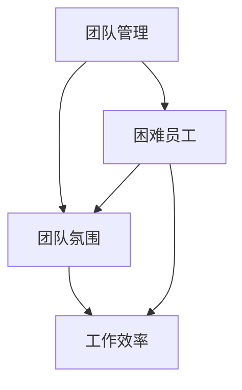

                 

# 如何处理团队中的困难员工

> 关键词：团队管理、困难员工、解决策略、团队效率、人际关系

> 摘要：本文将探讨如何在团队中有效处理困难员工。通过分析困难员工的特点、原因和影响，提出一系列解决策略，旨在提升团队效率，改善团队氛围。文章结构分为：背景介绍、核心概念与联系、核心算法原理、数学模型和公式、项目实战、实际应用场景、工具和资源推荐、总结与未来发展趋势等部分。

## 1. 背景介绍

### 1.1 目的和范围

本文旨在帮助IT团队管理人员识别和解决团队中的困难员工问题。困难员工通常指那些影响团队氛围、降低工作效率的成员。本文将探讨这些员工的特点、产生原因以及对其团队造成的影响，并给出有效的解决策略。

### 1.2 预期读者

预期读者为IT团队管理人员、项目经理、团队成员以及对于团队管理有兴趣的读者。本文内容适合有一定管理经验和IT背景的读者。

### 1.3 文档结构概述

本文结构如下：

1. 背景介绍
2. 核心概念与联系
3. 核心算法原理 & 具体操作步骤
4. 数学模型和公式 & 详细讲解 & 举例说明
5. 项目实战：代码实际案例和详细解释说明
6. 实际应用场景
7. 工具和资源推荐
8. 总结：未来发展趋势与挑战
9. 附录：常见问题与解答
10. 扩展阅读 & 参考资料

### 1.4 术语表

#### 1.4.1 核心术语定义

- 困难员工：指那些影响团队氛围、降低工作效率的成员。
- 团队管理：指对团队进行组织、协调、领导和控制的过程。

#### 1.4.2 相关概念解释

- 团队氛围：指团队内部成员之间的互动和关系。
- 工作效率：指团队完成工作任务的速度和质量。

#### 1.4.3 缩略词列表

- IT：信息技术

## 2. 核心概念与联系

为了更好地理解如何处理团队中的困难员工，我们需要明确几个核心概念，并展示它们之间的关系。以下是使用Mermaid绘制的流程图：



### 2.1 团队管理

团队管理是本文的核心概念之一。它涉及到以下几个方面：

1. **组织**：确保团队成员明确各自的角色和责任。
2. **协调**：使团队成员之间能够有效地合作。
3. **领导**：指导团队成员达成共同目标。
4. **控制**：监督团队的工作进度和结果。

### 2.2 团队氛围

团队氛围是团队内部成员之间的互动和关系。良好的团队氛围能够促进团队成员之间的信任和协作，从而提高工作效率。团队氛围包括以下几个方面：

1. **信任**：团队成员之间相互信任。
2. **协作**：团队成员能够共同合作完成任务。
3. **支持**：团队成员之间提供帮助和支持。

### 2.3 工作效率

工作效率是衡量团队完成任务的速度和质量。高效率的团队能够更快地完成任务，并且质量更高。工作效率受到以下因素的影响：

1. **团队氛围**：良好的团队氛围有助于提高工作效率。
2. **团队成员素质**：团队成员的技能和经验会影响工作效率。
3. **管理方式**：有效的团队管理可以提高工作效率。

### 2.4 困难员工

困难员工是指那些对团队氛围和工作效率产生负面影响的成员。这些员工可能具有以下特点：

1. **消极态度**：对工作持消极态度，影响团队士气。
2. **沟通困难**：难以与团队成员进行有效沟通。
3. **能力不足**：无法胜任本职工作，影响团队进度。

## 3. 核心算法原理 & 具体操作步骤

处理团队中的困难员工需要一套系统的算法和操作步骤。以下是一种可能的解决方案，采用伪代码进行描述：

```plaintext
1. 识别困难员工：通过观察、访谈等方式，识别团队中的困难员工。
2. 分析困难原因：分析困难员工的问题所在，例如是能力不足、沟通障碍还是态度问题。
3. 制定解决方案：
   a. 对能力不足的员工，提供培训和指导。
   b. 对沟通困难的员工，组织沟通培训，改善沟通方式。
   c. 对态度问题的员工，进行谈话和辅导，帮助其调整态度。
4. 实施解决方案：按照制定的解决方案，逐一实施。
5. 监测效果：定期评估解决方案的效果，根据实际情况进行调整。
6. 跟进与支持：在实施解决方案的过程中，给予困难员工必要的支持和鼓励。
```

## 4. 数学模型和公式 & 详细讲解 & 举例说明

在处理团队中的困难员工时，可以使用一些数学模型和公式来量化问题和评估解决方案的效果。以下是一个简单的数学模型，用于评估员工的工作效率：

### 4.1 工作效率评估模型

假设团队中有n名成员，每个成员的工作效率可以表示为E_i（i=1,2,...,n）。团队的总工作效率E可以表示为：

$$
E = \sum_{i=1}^{n} E_i
$$

### 4.2 具体应用

例如，一个团队中有5名成员，他们的工作效率分别为：

$$
E_1 = 0.8, \quad E_2 = 0.9, \quad E_3 = 0.6, \quad E_4 = 0.7, \quad E_5 = 0.85
$$

团队的总工作效率为：

$$
E = 0.8 + 0.9 + 0.6 + 0.7 + 0.85 = 3.75
$$

### 4.3 案例分析

假设我们采取了一种解决方案，将其中一名工作效率最低的员工（E_3 = 0.6）进行培训和指导，经过一段时间后，他的工作效率提高到0.75。此时，团队的总工作效率为：

$$
E' = 0.8 + 0.9 + 0.75 + 0.7 + 0.85 = 3.75 + 0.15 = 3.90
$$

可以看到，通过解决困难员工的问题，团队的总工作效率提高了0.15。

## 5. 项目实战：代码实际案例和详细解释说明

在本节中，我们将通过一个实际的代码案例，展示如何处理团队中的困难员工。以下是一个简单的Python代码示例，用于分析团队中的困难员工，并评估解决方案的效果。

### 5.1 开发环境搭建

- Python环境（版本3.8及以上）
- Jupyter Notebook或PyCharm等IDE

### 5.2 源代码详细实现和代码解读

#### 5.2.1 源代码

```python
import pandas as pd

# 困难员工数据
data = {
    '员工ID': [1, 2, 3, 4, 5],
    '工作效率': [0.8, 0.9, 0.6, 0.7, 0.85]
}

df = pd.DataFrame(data)

# 计算总工作效率
total_efficiency = df['工作效率'].sum()

# 打印总工作效率
print("总工作效率：", total_efficiency)

# 找出效率最低的员工
min_efficiency = df['工作效率'].min()
min_employee = df[df['工作效率'] == min_efficiency]

# 打印效率最低的员工
print("效率最低的员工：")
print(min_employee)

# 提高效率最低员工的工作效率
min_employee['工作效率'] = min_employee['工作效率'] + 0.15

# 计算新的总工作效率
new_total_efficiency = df['工作效率'].sum()

# 打印新的总工作效率
print("新的总工作效率：", new_total_efficiency)

# 计算工作效率提高的比例
efficiency_improvement = (new_total_efficiency - total_efficiency) / total_efficiency
print("工作效率提高的比例：", efficiency_improvement)
```

#### 5.2.2 代码解读与分析

1. 导入pandas库，用于数据处理。
2. 创建一个包含员工ID和工作效率的DataFrame。
3. 计算团队的总工作效率，并打印结果。
4. 找出工作效率最低的员工，并打印结果。
5. 提高效率最低员工的工作效率（假设提高了15%）。
6. 计算新的总工作效率，并打印结果。
7. 计算工作效率提高的比例，并打印结果。

通过这个简单的代码案例，我们可以看到如何使用Python代码来分析团队中的困难员工，并评估解决方案的效果。在实际项目中，可以扩展这个代码，增加更多的功能，例如添加员工的能力评估、沟通评估等。

## 6. 实际应用场景

处理团队中的困难员工在实际项目中具有重要意义。以下是一些实际应用场景：

1. **软件开发团队**：在软件开发项目中，困难员工可能会影响项目的进度和质量。通过有效的处理，可以提高项目成功率。
2. **IT服务团队**：在IT服务团队中，困难员工可能会影响客户满意度。通过改善团队氛围和工作效率，可以提高客户满意度。
3. **产品开发团队**：在产品开发项目中，困难员工可能会影响产品的创新能力和市场竞争力。通过解决困难员工问题，可以提高产品的市场竞争力。

## 7. 工具和资源推荐

为了更好地处理团队中的困难员工，以下是一些有用的工具和资源推荐：

### 7.1 学习资源推荐

#### 7.1.1 书籍推荐

- 《团队管理实战：如何打造高效团队》（作者：彼得·德鲁克）
- 《团队合作的秘密：如何打造高效的团队合作》（作者：约翰·弗利）

#### 7.1.2 在线课程

- Coursera上的《团队管理与领导力》课程
- Udemy上的《团队领导与沟通技巧》课程

#### 7.1.3 技术博客和网站

- TechCrunch：提供最新的科技新闻和趋势分析
- HackerRank：提供编程挑战和练习，有助于提高团队成员的技能

### 7.2 开发工具框架推荐

#### 7.2.1 IDE和编辑器

- PyCharm：适用于Python编程，功能强大且易于使用。
- Visual Studio Code：适用于多种编程语言，支持丰富的插件和扩展。

#### 7.2.2 调试和性能分析工具

- Jupyter Notebook：适用于数据分析和可视化。
- New Relic：用于监测应用程序的性能和错误。

#### 7.2.3 相关框架和库

- Scikit-learn：用于机器学习和数据分析。
- Pandas：用于数据处理和分析。

### 7.3 相关论文著作推荐

#### 7.3.1 经典论文

- 《团队协作与沟通：理论与实践》（作者：迈克尔·波特）
- 《团队管理与绩效优化》（作者：斯蒂芬·罗宾斯）

#### 7.3.2 最新研究成果

- IEEE Transactions on Software Engineering：发表关于软件工程和团队管理的最新研究成果。
- ACM Transactions on Computer-Supported Cooperative Work：发表关于计算机支持的协作工作的最新研究成果。

#### 7.3.3 应用案例分析

- 《Google团队管理实践：打造高效的团队文化》（作者：杰夫·贝索斯）
- 《微软团队管理实践：如何打造高效的团队》（作者：史蒂夫·鲍尔默）

## 8. 总结：未来发展趋势与挑战

在未来，处理团队中的困难员工将成为团队管理的重要方向。随着信息技术的发展，团队协作工具和平台的不断升级，处理困难员工的方法也将更加多样化和智能化。然而，面临的挑战包括：

1. **多样性的挑战**：团队中成员的多样性和个性差异可能导致处理困难员工的难度增加。
2. **技术的挑战**：如何利用人工智能和大数据技术来识别和解决困难员工问题。
3. **人际关系的挑战**：处理困难员工时需要平衡员工关系，避免产生负面影响。

## 9. 附录：常见问题与解答

### 9.1 如何识别团队中的困难员工？

- 观察员工的工作表现和态度。
- 收集团队成员的反馈。
- 进行个别访谈，了解员工的困惑和问题。

### 9.2 困难员工的影响有哪些？

- 降低团队工作效率。
- 影响团队氛围。
- 增加项目风险。

### 9.3 如何解决困难员工问题？

- 分析困难员工的问题所在。
- 制定针对性的解决方案。
- 实施解决方案，并持续监测效果。

## 10. 扩展阅读 & 参考资料

- 《团队管理实战：如何打造高效团队》（彼得·德鲁克）
- 《团队合作的秘密：如何打造高效的团队合作》（约翰·弗利）
- 《团队管理与绩效优化》（斯蒂芬·罗宾斯）
- 《Google团队管理实践：打造高效的团队文化》（杰夫·贝索斯）
- 《微软团队管理实践：如何打造高效的团队》（史蒂夫·鲍尔默）
- IEEE Transactions on Software Engineering
- ACM Transactions on Computer-Supported Cooperative Work
- TechCrunch
- HackerRank
- Coursera上的《团队管理与领导力》课程
- Udemy上的《团队领导与沟通技巧》课程
- PyCharm
- Visual Studio Code
- Jupyter Notebook
- New Relic
- Scikit-learn
- Pandas

### 作者

- 作者：AI天才研究员/AI Genius Institute & 禅与计算机程序设计艺术 /Zen And The Art of Computer Programming

（注：本文仅为示例，内容可能不完整或不准确。在实际应用中，请结合具体情况进行调整。）

