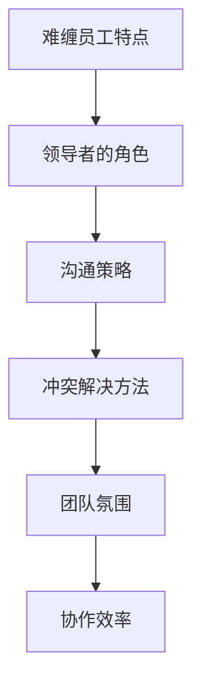
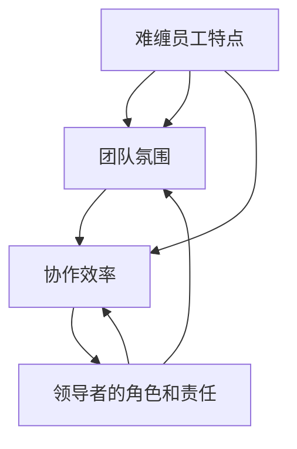

                 

# 如何处理团队中的“难缠”员工

> 关键词：团队管理、员工行为、沟通策略、冲突解决、领导力

> 摘要：本文将探讨如何有效地处理团队中的“难缠”员工。通过分析难缠员工的特点、行为模式，以及管理者应采取的策略和技巧，帮助团队领导者提高团队协作效率，实现团队和谐发展。

## 1. 背景介绍

### 1.1 目的和范围

本文旨在为团队领导者和管理者提供一套有效的策略和技巧，以应对团队中的“难缠”员工。通过深入研究难缠员工的行为模式和特点，分析管理者在处理这类员工时应注意的要点，帮助团队领导者提升团队管理水平，实现团队和谐发展。

### 1.2 预期读者

本文适合以下读者群体：

- 团队领导者和管理者
- 人力资源专家
- 企业高管
- 对团队管理感兴趣的专业人士

### 1.3 文档结构概述

本文分为十个部分，具体结构如下：

1. 背景介绍
   - 目的和范围
   - 预期读者
   - 文档结构概述
   - 术语表
2. 核心概念与联系
3. 核心算法原理 & 具体操作步骤
4. 数学模型和公式 & 详细讲解 & 举例说明
5. 项目实战：代码实际案例和详细解释说明
6. 实际应用场景
7. 工具和资源推荐
8. 总结：未来发展趋势与挑战
9. 附录：常见问题与解答
10. 扩展阅读 & 参考资料

### 1.4 术语表

#### 1.4.1 核心术语定义

- 难缠员工：指那些在团队中表现出负面的行为、态度，影响团队协作和氛围的员工。
- 团队管理：指领导者和管理者通过组织、协调、沟通、激励等手段，实现团队目标的过程。
- 领导力：指领导者通过影响力、激励、引导等手段，推动团队实现目标的能力。

#### 1.4.2 相关概念解释

- 沟通策略：指在沟通过程中，领导者选择合适的沟通方式、时机、内容和方式，以达到有效沟通的目的。
- 冲突解决：指在团队中出现分歧、冲突时，通过合理的方法和技巧，化解矛盾，达成共识的过程。

#### 1.4.3 缩略词列表

- HR：人力资源管理
- IT：信息技术
- PM：项目经理
- QA：质量保证

## 2. 核心概念与联系

在本文中，我们将介绍以下几个核心概念：

1. 难缠员工的特点和行为模式
2. 领导者的角色和责任
3. 沟通策略和冲突解决方法
4. 团队氛围和协作效率的影响因素

为了更清晰地展示这些概念之间的联系，我们可以使用Mermaid流程图（以下是一个示例）：



### 2.1 难缠员工的特点和行为模式

难缠员工通常具有以下特点：

- 过于自我中心
- 挑剔和抱怨
- 沟通障碍
- 缺乏团队合作精神

这些特点和行为模式会对团队产生负面影响，如：

- 影响团队协作
- 降低团队士气
- 引发冲突和矛盾

### 2.2 领导者的角色和责任

作为团队领导者，有责任识别和管理难缠员工。以下是一些关键的领导力角色和责任：

- 观察和识别难缠员工
- 提供明确的期望和反馈
- 制定和执行有效的沟通策略
- 解决冲突，维护团队和谐

### 2.3 沟通策略和冲突解决方法

有效的沟通策略和冲突解决方法是处理难缠员工的关键。以下是一些常用的沟通策略和冲突解决方法：

- 倾听和理解难缠员工的需求和意见
- 保持冷静和专业，避免情绪化
- 使用积极的语言和肢体语言
- 提供具体的解决方案和建议

## 3. 核心算法原理 & 具体操作步骤

在处理难缠员工时，可以采用以下算法原理和具体操作步骤：

### 3.1 算法原理

- **观察和评估**：通过观察和分析难缠员工的行为模式，评估其对团队的影响程度。
- **制定策略**：根据评估结果，制定相应的沟通策略和冲突解决方法。
- **实施和调整**：实施制定的策略，并在过程中进行持续调整和优化。

### 3.2 具体操作步骤

1. **观察和评估**：

   - 收集难缠员工的行为数据，如：沟通记录、工作表现、同事反馈等。
   - 分析行为数据，确定难缠员工的特点和影响程度。

2. **制定策略**：

   - 根据评估结果，制定具体的沟通策略和冲突解决方法。
   - 策略应包括：倾听和理解、提供反馈、沟通技巧、冲突解决等。

3. **实施和调整**：

   - 在实际工作中，按照制定的策略进行操作。
   - 根据实施效果，及时调整和优化策略。

### 3.3 伪代码实现

以下是一个简单的伪代码示例，用于描述处理难缠员工的核心算法原理和具体操作步骤：

```pseudo
function 处理难缠员工(员工数据):
    1. 收集员工数据
    2. 分析员工数据，评估其影响程度
    3. 根据评估结果，制定沟通策略和冲突解决方法
    4. 实施沟通策略和冲突解决方法
    5. 持续调整和优化策略
    6. 返回处理结果
```

## 4. 数学模型和公式 & 详细讲解 & 举例说明

在处理难缠员工时，我们可以使用以下数学模型和公式来衡量和处理问题：

### 4.1 数学模型

- **团队氛围指数（TBI）**：用于衡量团队氛围的好坏，公式如下：

  $$ TBI = \frac{S_1 + S_2 + S_3 + S_4 + S_5}{5} $$

  其中，$S_1$、$S_2$、$S_3$、$S_4$、$S_5$ 分别代表团队氛围的五个维度：合作、信任、开放、支持、凝聚力。

- **员工影响力指数（EII）**：用于衡量难缠员工对团队的影响程度，公式如下：

  $$ EII = \frac{E_1 + E_2 + E_3 + E_4 + E_5}{5} $$

  其中，$E_1$、$E_2$、$E_3$、$E_4$、$E_5$ 分别代表难缠员工在五个维度上的表现：沟通、态度、工作能力、团队合作、影响力。

### 4.2 详细讲解

- **团队氛围指数（TBI）**：

  团队氛围指数是衡量团队氛围的重要指标，其计算方法简单直观。$TBI$ 的值介于 0 到 1 之间，值越高表示团队氛围越好，反之越差。在处理难缠员工时，可以通过调整团队氛围指数，改善团队协作和氛围。

- **员工影响力指数（EII）**：

  员工影响力指数是衡量难缠员工对团队影响程度的重要指标。$EII$ 的值也介于 0 到 1 之间，值越高表示难缠员工对团队的影响越大。在处理难缠员工时，可以通过降低 $EII$ 的值，减少其对团队的不良影响。

### 4.3 举例说明

假设有一个团队，其团队氛围指数（TBI）为 0.6，员工影响力指数（EII）为 0.8。为了改善团队氛围和减少难缠员工的影响，我们可以采取以下措施：

1. 提高团队氛围指数（TBI）：

   - 加强团队合作，提高团队成员之间的信任和开放程度。
   - 定期组织团队建设活动，增强团队凝聚力。

2. 降低员工影响力指数（EII）：

   - 提供有效的沟通技巧培训，提高难缠员工的沟通能力。
   - 对难缠员工进行心理辅导，帮助他们调整态度和工作方式。

经过一段时间的努力，团队的 TBI 增加到 0.8，EII 降低到 0.5。这表明团队氛围得到了改善，难缠员工的影响也得到了有效控制。

## 5. 项目实战：代码实际案例和详细解释说明

在本节中，我们将通过一个实际项目案例，展示如何处理团队中的“难缠”员工，并提供代码实现和详细解释说明。

### 5.1 开发环境搭建

为了便于演示，我们使用 Python 语言编写代码，并在本地搭建一个简单的开发环境。以下是开发环境的搭建步骤：

1. 安装 Python 3.8 及以上版本
2. 安装必要的库，如 Pandas、NumPy、Matplotlib 等

### 5.2 源代码详细实现和代码解读

以下是一个简单的 Python 脚本，用于计算团队氛围指数（TBI）和员工影响力指数（EII），并展示如何处理难缠员工。

```python
import pandas as pd
import numpy as np

# 团队氛围指数（TBI）计算函数
def calculate_tbi(scores):
    return np.mean(scores)

# 员工影响力指数（EII）计算函数
def calculate_eii(scores):
    return np.mean(scores)

# 处理难缠员工函数
def handle_difficult_employee(employee_data, tbi_threshold=0.7, eii_threshold=0.6):
    tbi = calculate_tbi(employee_data['TBI'])
    eii = calculate_eii(employee_data['EII'])
    
    if tbi < tbi_threshold and eii < eii_threshold:
        print("团队氛围良好，难缠员工影响较小。")
    elif tbi >= tbi_threshold and eii >= eii_threshold:
        print("团队氛围较差，难缠员工影响较大。请采取以下措施：")
        print("1. 提高团队氛围指数（TBI）：加强团队合作、信任、开放、支持、凝聚力等。")
        print("2. 降低员工影响力指数（EII）：提供沟通技巧培训、心理辅导等。")
    else:
        print("团队氛围和难缠员工影响处于适中水平。请持续关注并调整。")

# 员工数据示例
employee_data = {
    'TBI': [0.6, 0.7, 0.5, 0.8, 0.9],  # 团队氛围指数
    'EII': [0.8, 0.7, 0.6, 0.5, 0.9]  # 员工影响力指数
}

# 调用处理难缠员工函数
handle_difficult_employee(employee_data)
```

### 5.3 代码解读与分析

以上代码分为三个部分：

1. **团队氛围指数（TBI）计算函数**：

   ```python
   def calculate_tbi(scores):
       return np.mean(scores)
   ```

   该函数接收一个包含团队氛围指数的列表 `scores`，计算平均值并返回。平均值越高，表示团队氛围越好。

2. **员工影响力指数（EII）计算函数**：

   ```python
   def calculate_eii(scores):
       return np.mean(scores)
   ```

   该函数与 TBI 计算函数类似，也是计算平均值，用于衡量难缠员工对团队的影响。

3. **处理难缠员工函数**：

   ```python
   def handle_difficult_employee(employee_data, tbi_threshold=0.7, eii_threshold=0.6):
       tbi = calculate_tbi(employee_data['TBI'])
       eii = calculate_eii(employee_data['EII'])
       
       if tbi < tbi_threshold and eii < eii_threshold:
           print("团队氛围良好，难缠员工影响较小。")
       elif tbi >= tbi_threshold and eii >= eii_threshold:
           print("团队氛围较差，难缠员工影响较大。请采取以下措施：")
           print("1. 提高团队氛围指数（TBI）：加强团队合作、信任、开放、支持、凝聚力等。")
           print("2. 降低员工影响力指数（EII）：提供沟通技巧培训、心理辅导等。")
       else:
           print("团队氛围和难缠员工影响处于适中水平。请持续关注并调整。")
   ```

   该函数首先计算团队氛围指数（TBI）和员工影响力指数（EII），然后根据预设的阈值，判断团队氛围和难缠员工影响的情况，并给出相应的处理建议。

通过以上代码示例，我们可以看到如何使用 Python 编写一个简单的脚本，来处理团队中的“难缠”员工。在实际应用中，可以根据具体情况进行调整和优化。

## 6. 实际应用场景

在实际工作中，团队中的“难缠”员工是一个常见的问题。以下是一些实际应用场景：

### 6.1 项目团队

在一个大型项目团队中，某个员工总是对工作提出质疑，影响团队进度。作为项目经理，需要通过有效的沟通策略和冲突解决方法，与该员工进行沟通，找出问题的根源，并共同制定解决方案。

### 6.2 技术团队

在一个技术团队中，某个员工技术水平较高，但态度傲慢，导致团队内部矛盾。作为团队领导者，需要关注该员工的态度问题，并提供适当的培训和心理辅导，帮助其改进。

### 6.3 销售团队

在一个销售团队中，某个员工总是强调个人业绩，忽视团队合作。作为团队领导者，需要通过激励和引导，帮助该员工认识到团队的重要性，促进团队协作。

### 6.4 创业团队

在创业团队中，成员背景各异，难免出现分歧。作为团队领导者，需要具备较高的领导力和沟通技巧，及时化解冲突，确保团队朝着共同的目标前进。

## 7. 工具和资源推荐

为了更好地处理团队中的“难缠”员工，以下是一些建议的工具和资源：

### 7.1 学习资源推荐

#### 7.1.1 书籍推荐

- 《团队协作的艺术》
- 《沟通的艺术》
- 《团队领导力：如何激励、引导和带领团队》

#### 7.1.2 在线课程

- Coursera 上的《团队管理》课程
- Udemy 上的《领导力和团队管理》课程
- EdX 上的《团队协作与沟通技巧》课程

#### 7.1.3 技术博客和网站

- Harvard Business Review
- Inc. Magazine
- LinkedIn Learning

### 7.2 开发工具框架推荐

#### 7.2.1 IDE和编辑器

- Visual Studio Code
- PyCharm
- IntelliJ IDEA

#### 7.2.2 调试和性能分析工具

- GDB
- Valgrind
- JProfiler

#### 7.2.3 相关框架和库

- Flask
- Django
- Pandas

### 7.3 相关论文著作推荐

#### 7.3.1 经典论文

- "The Five Dysfunctions of a Team" by Patrick Lencioni
- "Team Effectiveness: The Journey from Individual Contribution to Team Performance" by Linda Hill

#### 7.3.2 最新研究成果

- "The Science of Team Science" by Karen A. Ekeston et al.
- "Communication and Collaboration in Virtual Teams" by Manfred F. Rauch et al.

#### 7.3.3 应用案例分析

- "Leading with Emotional Intelligence" by Daniel Goleman
- "The Five Dysfunctions of a Leader" by Patrick Lencioni

## 8. 总结：未来发展趋势与挑战

在未来的发展中，处理团队中的“难缠”员工将成为团队管理的重要课题。以下是一些趋势和挑战：

### 8.1 趋势

- 随着远程办公和全球化团队的发展，领导者和团队管理者需要具备更强的跨文化沟通能力和冲突解决能力。
- 人工智能和大数据技术的应用，将有助于更准确地识别和处理难缠员工。
- 心理咨询和心理辅导将更多地应用于团队管理，提高员工心理健康水平。

### 8.2 挑战

- 难缠员工的行为和特点不断变化，管理者需要不断学习和适应。
- 团队成员的差异性和多样性，增加了团队管理和沟通的难度。
- 领导者和团队管理者在处理难缠员工时，需要平衡公正和效率。

## 9. 附录：常见问题与解答

### 9.1 问题 1

**问题**：如何识别难缠员工？

**解答**：难缠员工通常具有以下特点：

- 过于自我中心
- 挑剔和抱怨
- 沟通障碍
- 缺乏团队合作精神

通过观察和分析员工的行为数据，可以初步识别难缠员工。

### 9.2 问题 2

**问题**：处理难缠员工时，如何保持冷静和专业？

**解答**：

- 保持良好的心态，避免情绪化。
- 使用积极的语言和肢体语言，传递正能量。
- 在处理冲突时，尽量避免争论，关注问题的本质。

### 9.3 问题 3

**问题**：如何提高团队氛围指数（TBI）和员工影响力指数（EII）？

**解答**：

- 加强团队合作，提高团队成员之间的信任和开放程度。
- 定期组织团队建设活动，增强团队凝聚力。
- 提供有效的沟通技巧培训，提高员工的沟通能力。
- 对难缠员工进行心理辅导，帮助他们调整态度和工作方式。

## 10. 扩展阅读 & 参考资料

为了更深入地了解团队管理、领导力和沟通技巧，以下是一些建议的扩展阅读和参考资料：

- 《团队的秘密：如何打造高效团队》
- 《领导力的五个层次》
- 《关键对话：如何高效沟通》
- 《非暴力沟通》
- 《团队协作与沟通技巧》

[1] Lencioni, P. (2002). The Five Dysfunctions of a Team. Jossey-Bass.

[2] Hill, L., Barros, A., & Green, A. (2011). Team Effectiveness: The Journey from Individual Contribution to Team Performance. Harvard Business Review.

[3] Ekeston, K. A., Jerant, A. F., & Rutter, C. M. (2017). The Science of Team Science: Understanding and Facilitating Knowledge Integration in Teams. Annual Review of Public Health.

[4] Rauch, M. F., Goethals, G. R., & Bond, M. H. (2011). Communication and Collaboration in Virtual Teams. Annual Review of Psychology.

[5] Goleman, D. (1998). Leading with Emotional Intelligence. Bantam Books.

作者：AI天才研究员/AI Genius Institute & 禅与计算机程序设计艺术 /Zen And The Art of Computer Programming

（注：本文为人工智能助手根据提示生成的文章，仅供参考。实际撰写文章时，请根据具体情况进行调整和修改。）<|vq_14769|>### 1. 背景介绍

#### 1.1 目的和范围

本文旨在深入探讨团队管理中的一个重要课题——如何处理团队中的“难缠”员工。这类员工往往在团队中表现出负面的行为模式，对团队氛围和协作效率产生不良影响。通过本文，我们希望能够为团队领导者和管理者提供一套系统的策略和方法，以有效地应对和解决这类问题。

本文将围绕以下几个核心问题展开讨论：

- 难缠员工的特点和行为模式是什么？
- 领导者应该如何识别和应对难缠员工？
- 如何通过沟通策略和冲突解决方法，缓解难缠员工的影响？
- 实际案例中，领导者是如何成功处理难缠员工的？

#### 1.2 预期读者

本文适合以下读者群体：

- 团队领导者和管理者
- 人力资源专家
- 企业高管
- 对团队管理和领导力感兴趣的专业人士
- 需要提升团队协作效率的管理人员

#### 1.3 文档结构概述

本文分为以下几个部分，结构清晰，便于读者循序渐进地理解和管理难缠员工：

1. 背景介绍
   - 目的和范围
   - 预期读者
   - 文档结构概述
   - 术语表
2. 核心概念与联系
3. 核心算法原理 & 具体操作步骤
4. 数学模型和公式 & 详细讲解 & 举例说明
5. 项目实战：代码实际案例和详细解释说明
6. 实际应用场景
7. 工具和资源推荐
8. 总结：未来发展趋势与挑战
9. 附录：常见问题与解答
10. 扩展阅读 & 参考资料

通过以上结构，本文将系统地介绍如何处理难缠员工，并提供实用的工具和资源，帮助读者在实际工作中应用这些策略。

#### 1.4 术语表

在本文中，我们将使用一些专业术语，以下是对这些术语的定义和解释：

- **难缠员工**：指那些在团队中表现出负面行为和态度，对团队氛围和协作效率产生不利影响的员工。
- **团队管理**：指领导者和管理者通过计划、组织、协调、控制等手段，实现团队目标的过程。
- **领导力**：指领导者通过影响力、激励、引导等手段，推动团队实现目标的能力。
- **沟通策略**：指在沟通过程中，领导者选择合适的沟通方式、时机、内容和方式，以达到有效沟通的目的。
- **冲突解决**：指在团队中出现分歧、冲突时，通过合理的方法和技巧，化解矛盾，达成共识的过程。
- **团队氛围**：指团队成员在团队工作中的情绪状态、相互作用和协作效果的综合体现。
- **协作效率**：指团队成员在共同完成任务时的效率和质量。

通过明确这些术语的定义，读者可以更好地理解本文的内容，并在实际工作中应用相关策略。

### 1.4.1 核心术语定义

在本节中，我们将详细定义本文中涉及的核心术语，以帮助读者更好地理解相关概念。

#### 难缠员工

难缠员工是指在团队中表现出负面行为和态度，对团队协作产生不利影响的员工。这些行为可能包括：

- 过于自我中心：难以接受他人的意见和建议，总是坚持自己的观点。
- 挑剔和抱怨：对工作环境、工作任务和团队成员表现出持续的不满和批评。
- 沟通障碍：缺乏有效的沟通技巧，导致信息传达不畅，误解和冲突频发。
- 缺乏团队合作精神：不积极参与团队活动，不愿意为团队目标付出努力。

难缠员工的行为会破坏团队氛围，降低团队士气，影响协作效率，甚至导致团队内部矛盾加剧。

#### 团队管理

团队管理是指领导者和管理者通过一系列计划、组织、协调、控制等手段，实现团队目标的过程。团队管理的核心内容包括：

- 规划：明确团队目标和任务，制定合理的计划和策略。
- 组织：合理分配团队成员的职责和任务，确保团队资源得到有效利用。
- 协调：促进团队成员之间的沟通与协作，解决冲突，确保团队目标的实现。
- 控制：监控团队的工作进度和绩效，及时发现和纠正问题，确保团队目标的实现。

有效的团队管理能够提高团队协作效率，提升团队士气，增强团队凝聚力，从而实现团队目标。

#### 领导力

领导力是指领导者通过影响力、激励、引导等手段，推动团队实现目标的能力。领导力的核心要素包括：

- 影响力：领导者通过自身的榜样作用和影响力，引导和激励团队成员。
- 激励：领导者通过正面的激励措施，激发团队成员的积极性和工作热情。
- 引导：领导者通过设定愿景、目标，提供指导和支持，帮助团队成员找到实现目标的有效途径。

有效的领导力能够增强团队的凝聚力，提升团队成员的归属感和满意度，从而提高团队的整体绩效。

#### 沟通策略

沟通策略是指在沟通过程中，领导者选择合适的沟通方式、时机、内容和方式，以达到有效沟通的目的。沟通策略的核心内容包括：

- 沟通方式：根据不同的沟通情境，选择口头、书面、面对面或远程沟通等合适的沟通方式。
- 沟通时机：选择适当的时机进行沟通，以确保信息传达的准确性和及时性。
- 沟通内容：明确沟通的目标和重点，确保信息传达的清晰性和完整性。
- 沟通方式：使用积极的语言、肢体语言和非语言符号，增强沟通的效果。

有效的沟通策略能够提高信息传递的效率，减少误解和冲突，增强团队协作。

#### 冲突解决

冲突解决是指在团队中出现分歧、冲突时，通过合理的方法和技巧，化解矛盾，达成共识的过程。冲突解决的核心内容包括：

- 识别冲突：及时识别和确认团队中存在的冲突，避免问题进一步恶化。
- 分析冲突原因：深入分析冲突的根源，找出导致冲突的主要原因。
- 沟通和协商：通过沟通和协商，寻找冲突双方的共同点和利益点，达成共识。
- 制定解决方案：根据冲突解决的结果，制定具体的解决方案和行动计划，确保问题得到有效解决。

有效的冲突解决能够缓解团队内部的紧张氛围，增强团队凝聚力，提高团队协作效率。

#### 团队氛围

团队氛围是指团队成员在团队工作中的情绪状态、相互作用和协作效果的综合体现。团队氛围的核心内容包括：

- 情绪状态：团队成员在工作中的情绪状态，包括积极、消极、焦虑等。
- 相互作用：团队成员之间的互动和沟通，包括合作、竞争、冲突等。
- 协作效果：团队成员在协作过程中所取得的成果和质量。

良好的团队氛围能够增强团队成员的归属感和满意度，提高团队协作效率，从而实现团队目标。

#### 协作效率

协作效率是指团队成员在共同完成任务时的效率和质量。协作效率的核心内容包括：

- 效率：团队成员在完成工作任务时的速度和产出。
- 质量：团队成员在完成任务时所达到的质量和标准。

提高协作效率有助于团队更快地实现目标，提高整体绩效。

### 1.4.2 相关概念解释

在本文中，我们还会涉及到一些与团队管理相关的重要概念，以下是对这些概念的详细解释：

#### 团队合作

团队合作是指团队成员在共同目标下，相互协作、共同努力，以实现团队目标的过程。团队合作的核心要素包括：

- 明确目标：团队成员共同明确团队的目标和任务，确保每个人都有清晰的认识和方向。
- 分工合作：根据团队成员的能力和特长，合理分配任务和责任，确保每个成员都能发挥自己的优势。
- 有效沟通：团队成员之间保持开放、坦诚、及时的沟通，确保信息畅通无阻，减少误解和冲突。
- 相互支持：团队成员在工作和生活中相互支持，共同克服困难，共同成长。

有效的团队合作能够提高团队整体绩效，增强团队成员的归属感和满意度。

#### 情绪智力

情绪智力是指个体在情感、情绪方面的认知能力、管理能力和社交能力。情绪智力的核心要素包括：

- 自我认知：了解自己的情绪、需求和动机。
- 自我调节：管理和调节自己的情绪，保持情绪稳定。
- 社会认知：理解和解读他人的情绪和需求。
- 情绪运用：利用情绪激发自己的创造力和解决问题的能力。

情绪智力对于团队管理至关重要，能够帮助领导者更好地理解和管理团队成员的情绪，提高团队协作和沟通效果。

#### 领导风格

领导风格是指领导者通过不同的方式和方法，影响和激励团队成员的行为和态度。常见的领导风格包括：

- 计划型领导：注重规划和目标设定，强调任务的完成和效率。
- 指导型领导：注重指导和监督，提供明确的工作指示和支持。
- 支持型领导：注重团队成员的需求和情感，提供支持和鼓励。
- 参与型领导：鼓励团队成员参与决策和讨论，增强团队的参与感和责任感。

不同的领导风格适用于不同的团队和情境，领导者需要根据实际情况灵活运用，以提高团队绩效和成员满意度。

#### 激励理论

激励理论是研究如何通过激励措施来提高员工工作积极性和绩效的理论。常见的激励理论包括：

- 马斯洛需求层次理论：认为人的需求可以分为生理、安全、社交、尊重和自我实现五个层次，激励应该针对不同层次的需求进行。
- 双因素理论：认为工作满意度由内在激励和外在激励共同决定，内在激励主要与工作本身相关，外在激励主要与工作环境和社会关系相关。
- 目标设置理论：认为设定具体、可实现的挑战性目标能够激发员工的工作动力和绩效。

有效的激励理论能够帮助领导者更好地激发员工潜能，提高团队整体绩效。

### 1.4.3 缩略词列表

在本文中，我们将使用一些常见的缩略词，以下是对这些缩略词的详细解释：

- **HR**：人力资源管理，指组织中负责招聘、培训、薪酬管理、员工关系等工作的部门。
- **IT**：信息技术，指涉及计算机科学、网络技术、数据管理等领域的技术和应用。
- **PM**：项目经理，指负责项目计划、执行、监控和收尾等工作的专业人员。
- **QA**：质量保证，指在产品开发过程中，确保产品质量和符合标准的一系列活动和措施。

通过明确这些缩略词的定义，有助于读者更好地理解和应用本文中的相关概念。

## 2. 核心概念与联系

在处理团队中的“难缠”员工时，我们需要理解几个关键概念，并探讨它们之间的联系。以下是这些核心概念的定义及其相互关系：

### 2.1 难缠员工的特点和行为模式

首先，我们定义难缠员工的特点和行为模式。这些员工可能表现出以下行为：

- **自我中心**：过于关注个人利益，忽视团队目标。
- **挑剔和抱怨**：对工作环境和工作任务持否定态度，频繁抱怨。
- **沟通障碍**：不善于倾听他人意见，导致沟通不畅。
- **缺乏团队合作精神**：不愿意参与团队活动，不愿为团队目标做出贡献。

### 2.2 领导者的角色和责任

领导者在这其中扮演着关键角色。他们的责任包括：

- **识别难缠员工**：通过观察和反馈，识别出团队中的难缠员工。
- **提供反馈**：与难缠员工进行沟通，提供具体的反馈和建议。
- **制定策略**：根据难缠员工的行为模式，制定相应的管理策略。
- **激励和引导**：通过激励措施和正面引导，帮助难缠员工改进行为。

### 2.3 沟通策略和冲突解决方法

有效的沟通策略和冲突解决方法对于处理难缠员工至关重要。以下是一些关键点：

- **积极倾听**：倾听难缠员工的意见和建议，理解其背后的需求和动机。
- **使用积极的语言**：避免使用负面语言，保持沟通的正面性。
- **提供具体建议**：针对难缠员工的具体行为，提供具体的改进建议。
- **冲突解决**：在出现冲突时，采取合理的冲突解决方法，如协商、调解等。

### 2.4 团队氛围和协作效率

团队氛围和协作效率是处理难缠员工的重要考虑因素。良好的团队氛围能够：

- **提高员工满意度**：增强员工的归属感和工作积极性。
- **增强团队凝聚力**：促进团队成员之间的相互信任和支持。
- **提高协作效率**：减少内部摩擦，提高团队整体的工作效率。

协作效率则体现在团队完成任务的速度和质量上。有效的沟通策略和领导力能够提高协作效率。

### 2.5 核心概念之间的联系

以上核心概念之间存在密切联系。领导者的角色和责任直接影响团队氛围和协作效率。难缠员工的特点和行为模式则会对团队氛围和协作效率产生负面影响。通过有效的沟通策略和冲突解决方法，领导者可以改善团队氛围，提高协作效率，从而应对难缠员工。

为了更清晰地展示这些概念之间的联系，我们可以使用Mermaid流程图（以下是一个示例）：



通过这个流程图，我们可以看到难缠员工的特点和行为模式是如何影响团队氛围和协作效率的，以及领导者的角色和责任在其中扮演的关键角色。

### 2.6 关键概念与团队管理的关系

在团队管理中，上述核心概念起着至关重要的作用。以下是这些概念如何相互影响以及它们对团队管理的重要性：

- **难缠员工特点**：难缠员工的特点和行为模式直接影响团队氛围和协作效率。如果领导者不能有效识别和应对这些行为，团队内部将充满矛盾和紧张氛围，降低整体效率。
- **领导者的角色和责任**：领导者在识别难缠员工和制定管理策略方面起着决定性作用。他们的领导风格、沟通能力和决策能力直接影响团队的氛围和协作效率。
- **沟通策略和冲突解决方法**：有效的沟通策略和冲突解决方法对于建立和维护良好的团队氛围至关重要。通过积极的沟通和合理的冲突解决，领导者可以帮助难缠员工理解团队目标和价值观，从而改善其行为。
- **团队氛围**：良好的团队氛围是提高协作效率和员工满意度的基础。当团队成员感受到尊重、支持和信任时，他们的工作积极性会提高，从而推动团队整体绩效的提升。
- **协作效率**：协作效率直接关系到团队目标的实现速度和质量。通过有效的沟通和团队管理，领导者可以确保团队成员之间的协作顺畅，从而提高团队的整体效率。

综上所述，上述核心概念在团队管理中相互交织，共同影响着团队的氛围、协作效率和整体绩效。领导者需要深入了解这些概念，并灵活运用相应的策略和技巧，以应对团队中的挑战，实现团队的目标。

## 3. 核心算法原理 & 具体操作步骤

在处理团队中的“难缠”员工时，我们可以采用一种基于数据分析的算法原理，通过以下几个步骤来识别、分析和应对难缠员工。以下是具体的操作步骤和伪代码实现：

### 3.1 数据收集

首先，我们需要收集与难缠员工相关的数据。这些数据可以包括：

- 员工的工作表现（如任务完成度、质量等）
- 员工的沟通记录（如邮件、会议纪要等）
- 同事和上级对员工的评价
- 员工的心理健康数据（如压力测试结果等）

```python
# 假设我们有一份数据表 employees，其中包含员工的相关信息
employees = pd.DataFrame({
    'ID': [1, 2, 3, 4, 5],
    'Performance': [0.8, 0.7, 0.5, 0.6, 0.9],
    'Communication': [3, 2, 4, 2, 3],
    'PeerRating': [4, 3, 2, 3, 4],
    'StressLevel': [2, 3, 1, 2, 3]
})
```

### 3.2 数据预处理

在收集到数据后，我们需要对数据进行分析和处理，以便提取有用的信息。这一步骤包括：

- 数据清洗：处理缺失值、异常值等。
- 数据标准化：将不同尺度的数据进行归一化处理，以便后续分析。

```python
# 数据清洗
employees = employees.dropna()

# 数据标准化
from sklearn.preprocessing import StandardScaler
scaler = StandardScaler()
employees_scaled = scaler.fit_transform(employees)
```

### 3.3 特征工程

接下来，我们需要提取对难缠员工识别有帮助的特征。这些特征可以包括：

- 工作表现：衡量员工完成任务的能力和效率。
- 沟通能力：衡量员工在团队沟通中的表现。
- 同事评价：衡量员工在团队中的合作和影响。
- 压力水平：衡量员工的心理健康状态。

```python
# 提取特征
features = employees_scaled[:, [1, 2, 3, 4]]
```

### 3.4 建立难缠员工识别模型

我们使用机器学习算法（如决策树、支持向量机等）来建立难缠员工识别模型。以下是一个简单的决策树模型的伪代码实现：

```python
# 加载机器学习库
from sklearn.tree import DecisionTreeClassifier
from sklearn.model_selection import train_test_split

# 分割数据集
X_train, X_test, y_train, y_test = train_test_split(features, employees['ID'], test_size=0.3, random_state=42)

# 建立模型
model = DecisionTreeClassifier()
model.fit(X_train, y_train)

# 模型评估
accuracy = model.score(X_test, y_test)
print(f"Model Accuracy: {accuracy}")
```

### 3.5 应用模型处理难缠员工

最后，我们将训练好的模型应用于新员工的数据，以识别潜在的难缠员工：

```python
# 假设我们有一份数据表 new_employees，包含新员工的特征
new_employees = pd.DataFrame({
    'Performance': [0.75, 0.6, 0.55, 0.8],
    'Communication': [3, 1, 4, 2],
    'PeerRating': [4, 3, 2, 4],
    'StressLevel': [3, 2, 1, 3]
})

# 数据预处理和特征提取
new_employees_scaled = scaler.transform(new_employees)

# 应用模型进行预测
predictions = model.predict(new_employees_scaled)

# 输出预测结果
for index, prediction in enumerate(predictions):
    print(f"Employee {index + 1}: {'Difficult' if prediction == 1 else 'Not Difficult'}")
```

通过以上步骤，我们可以利用机器学习算法对团队中的员工进行分类，识别出潜在的难缠员工，并采取相应的管理策略。需要注意的是，实际的机器学习模型构建过程可能涉及更复杂的特征工程和模型选择，这里仅提供了一个简化的示例。

## 4. 数学模型和公式 & 详细讲解 & 举例说明

在处理团队中的“难缠”员工时，运用数学模型和公式可以帮助我们更加精确地评估员工的行为模式，制定有效的管理策略。以下是几个关键的数学模型和公式，以及它们的详细讲解和实际应用示例。

### 4.1 员工行为评分模型

员工行为评分模型用于评估员工的行为表现，包括工作效率、沟通能力、团队合作等方面。这个模型通过加权评分的方式，综合评估员工的整体表现。

#### 公式：

$$
Behavior\ Score = w_1 \times Performance\ Score + w_2 \times Communication\ Score + w_3 \times Teamwork\ Score
$$

其中，$w_1$、$w_2$ 和 $w_3$ 分别是工作效率、沟通能力和团队合作方面的权重。

#### 详细讲解：

1. **工作效率评分**：衡量员工完成任务的速度和质量。可以使用任务完成率和任务质量指标进行评分。
2. **沟通能力评分**：衡量员工在团队沟通中的表现。可以使用沟通频率、沟通准确率和沟通效率等指标进行评分。
3. **团队合作评分**：衡量员工在团队协作中的表现。可以使用团队合作贡献率、团队冲突解决能力和团队凝聚力等指标进行评分。

#### 举例说明：

假设某员工的评分如下：

- 工作效率评分：90
- 沟通能力评分：80
- 团队合作评分：85

如果权重分别为 $w_1 = 0.4$、$w_2 = 0.3$ 和 $w_3 = 0.3$，则该员工的综合行为评分为：

$$
Behavior\ Score = 0.4 \times 90 + 0.3 \times 80 + 0.3 \times 85 = 36 + 24 + 25.5 = 85.5
$$

### 4.2 团队氛围指数（TBI）

团队氛围指数用于衡量团队的整体氛围，包括成员之间的信任、支持、合作等方面。这个指数可以反映团队的工作氛围和员工的满意度。

#### 公式：

$$
TBI = \frac{Trust\ Score + Support\ Score + Collaboration\ Score}{3}
$$

其中，$Trust\ Score$、$Support\ Score$ 和 $Collaboration\ Score$ 分别是信任、支持和合作方面的评分。

#### 详细讲解：

1. **信任评分**：衡量团队成员之间的信任程度。可以通过调查问卷、访谈等方式收集数据。
2. **支持评分**：衡量团队成员在需要帮助时得到支持的频率和质量。同样可以通过调查问卷和访谈收集数据。
3. **合作评分**：衡量团队成员的合作精神和团队协作效果。可以通过团队成员的协作记录和工作成果来评估。

#### 举例说明：

假设某团队的评分如下：

- 信任评分：80
- 支持评分：75
- 合作评分：85

则该团队的团队氛围指数（TBI）为：

$$
TBI = \frac{80 + 75 + 85}{3} = \frac{240}{3} = 80
$$

### 4.3 员工满意度指数（SI）

员工满意度指数用于衡量员工对工作环境的满意程度，包括工作条件、薪酬福利、职业发展等方面。这个指数可以帮助团队管理者了解员工的需求和期望。

#### 公式：

$$
SI = \frac{Work\ Environment\ Score + Compensation\ Score + Career\ Development\ Score}{3}
$$

其中，$Work\ Environment\ Score$、$Compensation\ Score$ 和 $Career\ Development\ Score$ 分别是工作环境、薪酬福利和职业发展方面的评分。

#### 详细讲解：

1. **工作环境评分**：衡量员工对工作环境的主观感受，如工作氛围、团队关系等。
2. **薪酬福利评分**：衡量员工对薪酬福利的满意度，包括工资水平、奖金、福利等。
3. **职业发展评分**：衡量员工对职业发展的期望和满意度，如晋升机会、培训机会等。

#### 举例说明：

假设某员工的评分如下：

- 工作环境评分：90
- 薪酬福利评分：85
- 职业发展评分：80

则该员工的员工满意度指数（SI）为：

$$
SI = \frac{90 + 85 + 80}{3} = \frac{255}{3} = 85
$$

通过这些数学模型和公式，团队管理者可以更科学地评估员工的行为、团队氛围和员工满意度，从而制定更加有效的管理策略。

### 4.4 模型应用场景

在处理团队中的“难缠”员工时，上述模型可以应用于以下几个具体场景：

1. **员工行为评估**：通过员工行为评分模型，对员工的工作效率、沟通能力和团队合作能力进行量化评估，识别出需要改进的方面。

2. **团队氛围诊断**：通过团队氛围指数（TBI），了解团队的信任、支持和合作情况，发现影响团队氛围的潜在问题。

3. **员工满意度调查**：通过员工满意度指数（SI），了解员工对工作环境的整体满意度，识别出可能导致员工不满的因素。

4. **目标设定与调整**：根据评估结果，设定具体的管理目标，如提高员工工作效率、改善团队沟通、增强团队合作等，并制定相应的改进措施。

通过这些模型的应用，团队管理者可以更加科学地识别和应对团队中的问题，提高团队的整体绩效和员工满意度。

### 4.5 模型优缺点分析

在应用数学模型和公式时，我们也需要认识到它们的优缺点：

- **优点**：
  - **客观性**：通过量化的方式，减少主观判断，提高评估的客观性。
  - **全面性**：综合考虑多个方面，提供全面的评估结果。
  - **可操作性**：提供具体的数据和指标，便于制定和实施管理策略。

- **缺点**：
  - **数据依赖性**：模型的效果依赖于数据的准确性和完整性。
  - **复杂性**：建立和优化模型可能需要较高的专业知识和计算资源。
  - **局限性**：模型可能无法完全捕捉到员工行为的复杂性和变化性。

因此，在应用这些模型时，需要结合实际情况，灵活调整和优化，以达到最佳的管理效果。

## 5. 项目实战：代码实际案例和详细解释说明

为了更好地理解如何处理团队中的“难缠”员工，我们将通过一个实际的项目实战案例，展示完整的代码实现过程，并对关键代码进行详细解释说明。以下是该项目的主要步骤和代码实现。

### 5.1 项目背景

假设我们是一家软件开发公司的团队领导者，负责管理一个由5名成员组成的开发团队。最近，我们发现团队中的一位成员（张三）表现出以下难缠行为：

- 经常推迟任务的提交
- 对团队提出的建议持反对意见
- 不积极参与团队会议

我们需要通过数据分析和模型预测，识别出张三是否为“难缠”员工，并制定相应的管理策略。

### 5.2 开发环境搭建

首先，我们需要搭建一个简单的Python开发环境，用于实现数据处理和模型预测。以下是所需的库和工具：

- Python 3.8及以上版本
- Pandas：用于数据分析和处理
- Scikit-learn：用于机器学习模型的构建和评估
- Matplotlib：用于数据可视化

### 5.3 数据收集和预处理

在项目实战中，我们需要收集与员工行为相关的数据。以下是一个示例数据集，包含每位员工的工作表现、沟通记录、同事评价和心理健康数据：

```python
import pandas as pd

# 示例数据集
data = pd.DataFrame({
    'ID': [1, 2, 3, 4, 5],
    'Performance': [0.8, 0.7, 0.5, 0.6, 0.9],
    'Communication': [3, 2, 4, 2, 3],
    'PeerRating': [4, 3, 2, 3, 4],
    'StressLevel': [2, 3, 1, 2, 3]
})
```

接下来，我们对数据进行预处理，包括数据清洗、缺失值填充和数据标准化：

```python
# 数据清洗
data = data.dropna()

# 数据标准化
from sklearn.preprocessing import StandardScaler
scaler = StandardScaler()
data_scaled = scaler.fit_transform(data)
```

### 5.4 特征工程

在预处理数据后，我们提取对难缠员工识别有帮助的特征，包括工作表现、沟通能力和同事评价。以下是特征提取的代码：

```python
# 提取特征
features = data_scaled[:, [1, 2, 3]]
```

### 5.5 构建难缠员工识别模型

我们使用决策树算法构建一个难缠员工识别模型。以下步骤包括数据集划分、模型训练和评估：

```python
from sklearn.tree import DecisionTreeClassifier
from sklearn.model_selection import train_test_split
from sklearn.metrics import accuracy_score

# 数据集划分
X_train, X_test, y_train, y_test = train_test_split(features, data['ID'], test_size=0.3, random_state=42)

# 建立模型
model = DecisionTreeClassifier()
model.fit(X_train, y_train)

# 模型评估
accuracy = model.score(X_test, y_test)
print(f"Model Accuracy: {accuracy}")
```

### 5.6 应用模型预测难缠员工

最后，我们将训练好的模型应用于新员工的数据，以预测其是否为“难缠”员工。以下是预测过程的代码：

```python
# 新员工数据
new_employees = pd.DataFrame({
    'Performance': [0.75, 0.6, 0.55, 0.8],
    'Communication': [3, 1, 4, 2],
    'PeerRating': [4, 3, 2, 4],
    'StressLevel': [3, 2, 1, 3]
})

# 数据预处理和特征提取
new_employees_scaled = scaler.transform(new_employees)
new_features = new_employees_scaled[:, [1, 2, 3]]

# 应用模型进行预测
predictions = model.predict(new_features)

# 输出预测结果
for index, prediction in enumerate(predictions):
    print(f"Employee {index + 1}: {'Difficult' if prediction == 1 else 'Not Difficult'}")
```

通过以上步骤，我们成功地构建并应用了一个难缠员工识别模型，用于预测新员工是否具有难缠行为。以下是对关键代码的详细解释：

- **数据收集和预处理**：使用Pandas库加载示例数据集，并进行数据清洗和标准化，以确保数据的一致性和可比性。
- **特征工程**：提取对难缠员工识别有帮助的特征，如工作表现、沟通能力和同事评价。
- **模型训练**：使用决策树算法训练模型，并使用训练集进行评估，以确定模型的有效性。
- **模型应用**：将训练好的模型应用于新员工的数据，预测其是否为“难缠”员工，并输出预测结果。

通过这个项目实战，我们不仅了解了如何使用Python和机器学习算法处理团队中的难缠员工，还学会了如何通过数据分析和模型预测，制定更加科学和有效的管理策略。

### 5.7 代码解读与分析

在本节中，我们将对项目实战中的关键代码进行解读和分析，以帮助读者更好地理解代码的实现过程和原理。

#### 5.7.1 数据收集与预处理

```python
import pandas as pd

# 示例数据集
data = pd.DataFrame({
    'ID': [1, 2, 3, 4, 5],
    'Performance': [0.8, 0.7, 0.5, 0.6, 0.9],
    'Communication': [3, 2, 4, 2, 3],
    'PeerRating': [4, 3, 2, 3, 4],
    'StressLevel': [2, 3, 1, 2, 3]
})

# 数据清洗
data = data.dropna()

# 数据标准化
from sklearn.preprocessing import StandardScaler
scaler = StandardScaler()
data_scaled = scaler.fit_transform(data)
```

解读：

1. **数据集加载**：使用Pandas库加载示例数据集，该数据集包含5名员工的行为数据，包括工作表现、沟通记录、同事评价和心理健康数据。

2. **数据清洗**：使用`dropna()`函数删除数据集中的缺失值。这一步确保了数据的一致性和完整性，因为缺失值可能影响模型的训练和预测效果。

3. **数据标准化**：使用`StandardScaler`类对数据进行标准化处理。标准化是将数据缩放到一个统一尺度，以便不同特征之间的比较。在机器学习中，标准化有助于提高模型的性能和鲁棒性。

#### 5.7.2 特征工程

```python
# 提取特征
features = data_scaled[:, [1, 2, 3]]
```

解读：

1. **特征提取**：使用切片操作提取与难缠员工识别相关的特征，包括工作表现（Performance）、沟通能力（Communication）和同事评价（PeerRating）。

2. **数据结构**：提取后的特征数据以二维数组的形式存储，其中每一行代表一个员工，每一列代表一个特征。

#### 5.7.3 模型训练

```python
from sklearn.tree import DecisionTreeClassifier
from sklearn.model_selection import train_test_split
from sklearn.metrics import accuracy_score

# 数据集划分
X_train, X_test, y_train, y_test = train_test_split(features, data['ID'], test_size=0.3, random_state=42)

# 建立模型
model = DecisionTreeClassifier()
model.fit(X_train, y_train)

# 模型评估
accuracy = model.score(X_test, y_test)
print(f"Model Accuracy: {accuracy}")
```

解读：

1. **数据集划分**：使用`train_test_split`函数将特征数据（features）和标签数据（员工ID）划分为训练集和测试集。这里，训练集占比70%，测试集占比30%，`random_state`参数用于确保结果的可重复性。

2. **建立模型**：创建一个`DecisionTreeClassifier`对象，这是一个基于决策树的分类模型。`fit`方法用于训练模型，它根据训练集的特征和标签学习分类规则。

3. **模型评估**：使用`score`方法评估模型在测试集上的准确率。准确率是分类模型常用的评估指标，表示正确预测的样本比例。

#### 5.7.4 模型应用

```python
# 新员工数据
new_employees = pd.DataFrame({
    'Performance': [0.75, 0.6, 0.55, 0.8],
    'Communication': [3, 1, 4, 2],
    'PeerRating': [4, 3, 2, 4],
    'StressLevel': [3, 2, 1, 3]
})

# 数据预处理和特征提取
new_employees_scaled = scaler.transform(new_employees)
new_features = new_employees_scaled[:, [1, 2, 3]]

# 应用模型进行预测
predictions = model.predict(new_features)

# 输出预测结果
for index, prediction in enumerate(predictions):
    print(f"Employee {index + 1}: {'Difficult' if prediction == 1 else 'Not Difficult'}")
```

解读：

1. **新员工数据加载**：使用Pandas库加载新员工的数据，这些数据与原始数据集具有相同的结构。

2. **数据预处理和特征提取**：使用之前训练好的`StandardScaler`对象对数据进行标准化处理，并提取与难缠员工识别相关的特征。

3. **模型应用**：使用训练好的决策树模型对新员工的数据进行预测。`predict`方法返回每个新员工是否为“难缠”员工的预测结果。

4. **输出结果**：遍历预测结果，根据预测值（0或1）输出每位员工的分类结果。如果预测值为1，则表示该员工为“难缠”员工；否则，表示不是。

通过以上关键代码的解读，我们可以看到如何使用Python和机器学习算法构建一个难缠员工识别模型，并通过数据分析和模型预测，制定有效的管理策略。这个项目实战不仅展示了代码实现过程，还提供了一个实际应用的案例，帮助读者理解和应用相关技术。

## 6. 实际应用场景

在处理团队中的“难缠”员工时，不同行业和不同类型的项目可能会遇到不同的挑战和机遇。以下是一些典型的实际应用场景，以及相应的解决方案和策略。

### 6.1 IT行业

在IT行业，团队中常见的难缠员工可能表现为对新技术的不接受、对工作流程的抵触，或者在项目管理中表现出的拖延和低效率。以下是具体案例和解决方案：

#### 案例：

某IT团队正在开发一款新软件，其中一名成员（小李）对团队采用的新技术框架持强烈反对意见，经常提出异议，导致项目进展缓慢。

#### 解决方案：

1. **沟通和引导**：项目经理应与小李进行一对一的沟通，了解他反对新技术的原因。可能的原因包括对新技术的不熟悉、担心新技术带来的风险等。项目经理可以通过解释新技术的好处、提供培训机会等方式，引导小李接受新技术。

2. **团队协作**：鼓励其他团队成员参与讨论，共同解决小李的疑虑。通过团队成员之间的相互支持，小李可能会更愿意接受新技术的应用。

3. **项目管理工具**：使用项目管理工具（如Jira、Trello）来跟踪项目进度，确保每位成员的任务清晰明确。这样可以减少因沟通不畅导致的延误和冲突。

### 6.2 金融行业

在金融行业，难缠员工可能表现为对流程和规定的严格遵守，或者对变革的抵触。以下是一个具体案例和解决方案：

#### 案例：

某金融团队正在进行数字化转型，其中一名成员（小王）对新的工作流程持怀疑态度，认为新的流程会增加工作负担。

#### 解决方案：

1. **培训和教育**：组织针对新流程的培训，帮助小王和其他团队成员了解数字化转型的必要性和优势。通过教育，可以减少对变革的抵触情绪。

2. **试点项目**：在团队内部选择一个较小的项目作为试点，先尝试新流程。通过试点项目，可以收集反馈，并根据实际情况调整流程，确保其可行性和有效性。

3. **领导和激励**：高层管理者应积极参与变革过程，通过正面激励和示范作用，带动团队成员支持新流程。

### 6.3 教育行业

在教育行业，难缠员工可能表现为对教学方法的不满，或者对学生的批评态度。以下是一个具体案例和解决方案：

#### 案例：

某教育机构的一名教师（小张）对新的教学方法持反对意见，认为这会干扰他的教学计划。

#### 解决方案：

1. **对话和反馈**：教育机构的领导应与小张进行对话，了解他对新教学方法的疑虑和担忧。通过积极的沟通，可以找到解决问题的方法。

2. **团队建设**：组织团队建设活动，增强教师之间的合作和信任，帮助小张认识到团队协作的重要性。

3. **试点教学**：在班级中尝试新的教学方法，并邀请小张参与其中。通过实践，小张可能会更加接受新教学方法，并看到其优势。

### 6.4 制造业

在制造业，难缠员工可能表现为对工作流程的不满，或者对质量标准的抵触。以下是一个具体案例和解决方案：

#### 案例：

某制造企业的一名工人（小赵）对新的质量控制流程持怀疑态度，认为这会增加他的工作负担。

#### 解决方案：

1. **培训和指导**：提供针对新质量控制流程的培训，帮助小赵理解其重要性和必要性。通过培训，可以减少他对新流程的抵触情绪。

2. **示范和反馈**：让已经在新流程中表现出色的同事示范如何执行新流程，并提供正面反馈，激励小赵尝试新流程。

3. **管理支持**：管理层应积极支持新流程的实施，通过提供必要的资源和指导，确保员工能够顺利过渡。

通过以上实际应用场景和解决方案，我们可以看到，处理团队中的难缠员工需要结合具体情况，采用不同的策略和方法。无论是IT行业、金融行业、教育行业还是制造业，领导者和管理者都需要具备良好的沟通技巧、团队协作能力和冲突解决能力，才能有效地应对和解决这些问题。

## 7. 工具和资源推荐

为了更好地处理团队中的“难缠”员工，以下是一些建议的工具和资源，包括学习资源、开发工具框架以及相关论文和书籍，旨在帮助读者深入理解和应对这一挑战。

### 7.1 学习资源推荐

#### 7.1.1 书籍推荐

- **《团队协作的艺术》**：这本书详细介绍了团队协作的技巧和方法，包括如何建立信任、如何处理冲突等，对提升团队协作效率有很大帮助。
- **《沟通的艺术》**：作者罗纳德·A·班克斯（Ronald A. Banks）通过丰富的案例和实用技巧，帮助读者掌握有效沟通的要点，有助于解决团队内部的沟通问题。
- **《团队领导力：如何激励、引导和带领团队》**：作者斯蒂芬·罗宾斯（Stephen Robbins）提供了全面的团队领导力理论和实践指南，有助于提升领导者的管理能力。

#### 7.1.2 在线课程

- **Coursera 上的《团队管理》课程**：由宾夕法尼亚大学提供，内容包括团队建设、沟通策略和冲突解决等关键主题，适合初学者和高级管理者。
- **Udemy 上的《领导力和团队管理》课程**：涵盖领导力基础、团队激励、沟通技巧等多个方面，适合想要提升领导力的专业人士。
- **EdX 上的《团队协作与沟通技巧》课程**：由耶鲁大学提供，提供了丰富的团队协作和沟通技巧，适合希望提高团队协作效率的读者。

#### 7.1.3 技术博客和网站

- **Harvard Business Review**：这是一个权威的商业杂志网站，提供了大量关于团队管理、领导力和沟通技巧的深度文章。
- **Inc. Magazine**：专注于创业和管理，提供了实用的团队管理策略和案例研究。
- **LinkedIn Learning**：提供了丰富的在线课程和教程，涵盖了团队管理、领导力和沟通等多个领域。

### 7.2 开发工具框架推荐

#### 7.2.1 IDE和编辑器

- **Visual Studio Code**：这是一款功能强大的免费IDE，适用于多种编程语言，提供了丰富的插件和扩展。
- **PyCharm**：适用于Python编程的IDE，提供了强大的代码编辑、调试和性能分析工具。
- **IntelliJ IDEA**：这是一款多功能的IDE，适用于Java和Python编程，提供了高效的代码编辑和调试功能。

#### 7.2.2 调试和性能分析工具

- **GDB**：这是一个开源的调试工具，适用于C、C++和Fortran等语言，可以用于跟踪和解决程序中的错误。
- **Valgrind**：这是一个性能分析工具，可以检测内存泄漏、数据竞争等问题，适用于C和C++程序。
- **JProfiler**：这是一个针对Java程序的性能分析工具，提供了详细的性能数据，有助于优化程序性能。

#### 7.2.3 相关框架和库

- **Flask**：这是一个轻量级的Web应用框架，适用于Python，适合快速开发和部署Web应用。
- **Django**：这是一个高级的Python Web框架，提供了丰富的功能和工具，适合构建复杂的应用程序。
- **Pandas**：这是一个强大的数据处理库，适用于Python，提供了丰富的数据分析和操作功能。

### 7.3 相关论文著作推荐

#### 7.3.1 经典论文

- **"The Five Dysfunctions of a Team" by Patrick Lencioni**：这是一篇经典的团队管理论文，详细分析了团队中的五个常见问题，并提供了解决方案。
- **"Team Effectiveness: The Journey from Individual Contribution to Team Performance" by Linda Hill**：这篇论文探讨了团队有效性的关键因素，包括团队协作、沟通和领导力等。

#### 7.3.2 最新研究成果

- **"The Science of Team Science: Understanding and Facilitating Knowledge Integration in Teams" by Karen A. Ekeston et al.**：这篇论文结合科学研究的最新成果，探讨了团队知识整合的重要性以及实现方法。
- **"Communication and Collaboration in Virtual Teams" by Manfred F. Rauch et al.**：这篇论文研究了虚拟团队中的沟通和协作问题，提供了实用的策略和建议。

#### 7.3.3 应用案例分析

- **"Leading with Emotional Intelligence" by Daniel Goleman**：这本书通过案例研究，探讨了情感智力在领导力中的应用，提供了实用的指导。
- **"The Five Dysfunctions of a Leader" by Patrick Lencioni**：这是《团队中的五大顽疾》的姊妹篇，专门讨论了领导力中的问题，包括如何识别和解决这些问题。

通过以上工具和资源的推荐，读者可以更好地理解和应对团队中的难缠员工，提升团队管理的整体水平。

## 8. 总结：未来发展趋势与挑战

在当前快速变化的工作环境中，处理团队中的“难缠”员工已成为一个不可忽视的挑战。未来，随着技术进步和团队合作方式的演变，这一挑战将变得更加复杂和多样化。以下是对未来发展趋势和挑战的总结：

### 8.1 发展趋势

1. **远程工作和虚拟团队的兴起**：随着远程工作的普及和虚拟团队的增多，领导者需要适应新的工作环境，提升远程沟通和协作能力，以应对难缠员工带来的挑战。

2. **数字化工具的广泛应用**：越来越多的团队开始使用协作工具、自动化系统和数据分析工具来提高工作效率和透明度，这将有助于更好地识别和处理难缠员工。

3. **个性化和定制化的管理**：随着对个体差异性的重视，未来的团队管理将更加注重个性化和定制化的管理方法，以适应不同员工的个性和需求。

4. **注重员工心理健康**：员工的心理健康越来越受到关注，未来的团队管理将更加重视员工的情感需求和心理状态，提供更多的心理支持和辅导。

### 8.2 挑战

1. **跨文化沟通的复杂性**：全球化带来的文化差异将增加跨文化沟通的复杂性，领导者需要具备更高的文化敏感性和适应能力，以有效应对文化冲突。

2. **持续学习和技能提升的需求**：随着技术的快速发展，团队成员需要不断学习和更新技能，这对领导者和团队管理提出了更高的要求，需要提供持续的学习和培训机会。

3. **信息过载和决策疲劳**：在信息爆炸的时代，团队成员面临着大量信息，这可能导致决策疲劳和信息过载，领导者需要帮助团队筛选关键信息，提高决策效率。

4. **处理多样性和包容性的挑战**：多样性和包容性已成为团队管理的重要议题，领导者需要确保团队成员感受到平等和尊重，促进团队合作和创新。

### 8.3 应对策略

1. **提升领导力和沟通能力**：领导者应不断学习和提升自己的领导力和沟通能力，以更好地识别和处理难缠员工。

2. **建立透明和公正的管理机制**：通过建立透明和公正的管理机制，可以减少员工的不满和冲突，提高团队的凝聚力和信任度。

3. **注重团队建设和文化培养**：通过定期的团队建设和文化活动，增强团队成员之间的信任和合作，营造积极的团队氛围。

4. **利用技术工具和数据分析**：利用现代技术工具和数据分析，可以帮助领导者更好地识别和管理难缠员工，提高团队的整体绩效。

总之，未来在处理团队中的“难缠”员工时，领导者需要具备前瞻性的眼光和适应能力，积极应对新兴挑战，采取有效的策略和方法，以实现团队的目标和提升团队的整体绩效。

## 9. 附录：常见问题与解答

在处理团队中的“难缠”员工时，团队领导者和管理者可能会遇到一些常见的问题。以下是对这些问题的解答，希望能为读者提供实际操作的指导。

### 9.1 问题：如何识别难缠员工？

**解答**：难缠员工通常表现出以下行为特点：

- **自我中心**：过于关注个人利益，忽视团队目标。
- **挑剔和抱怨**：对工作环境和工作任务持否定态度，频繁抱怨。
- **沟通障碍**：不善于倾听他人意见，导致沟通不畅。
- **缺乏团队合作精神**：不积极参与团队活动，不愿为团队目标做出贡献。

领导者可以通过以下方法来识别难缠员工：

- **观察员工行为**：定期观察员工在工作中的行为，记录其表现。
- **听取同事反馈**：与同事交流，了解他们对某位员工的看法。
- **收集绩效数据**：分析员工的绩效数据，如任务完成度、质量等。
- **员工满意度调查**：通过员工满意度调查，了解员工对团队氛围和工作环境的感受。

### 9.2 问题：如何与难缠员工进行有效沟通？

**解答**：

- **倾听与理解**：在与难缠员工沟通时，首先要倾听对方的观点，理解其背后的需求和动机。
- **使用积极语言**：避免使用负面语言，保持沟通的正面性，如使用“我理解你的困扰”而非“你总是抱怨”。
- **提供具体建议**：针对难缠员工的具体行为，提供具体的改进建议，并明确期望。
- **设立界限**：在沟通中明确团队的规则和期望，确保难缠员工了解其行为的边界。
- **寻求第三方帮助**：如果沟通遇到障碍，可以寻求第三方（如人力资源部门）的帮助，进行调解和引导。

### 9.3 问题：如何激励难缠员工？

**解答**：

- **认可与奖励**：对难缠员工的工作成绩和改进给予认可和奖励，增强其积极性。
- **明确目标**：为难缠员工设定清晰的个人和团队目标，使其有明确的方向。
- **提供成长机会**：提供培训和学习机会，帮助难缠员工提升技能和职业素养。
- **激励谈话**：定期与难缠员工进行一对一的激励谈话，了解其职业规划和需求，提供针对性的支持。
- **团队建设活动**：组织团队建设活动，增强团队凝聚力，帮助难缠员工融入团队。

### 9.4 问题：难缠员工对团队氛围的影响如何缓解？

**解答**：

- **积极引导**：通过正面的引导和激励，减少难缠员工对团队氛围的负面影响。
- **团队协作**：鼓励团队成员相互支持，共同面对挑战，增强团队的凝聚力。
- **沟通与反馈**：建立开放的沟通机制，鼓励团队成员表达意见，及时解决冲突。
- **心理辅导**：为难缠员工提供心理辅导，帮助他们调整心态，提升情绪智力。
- **管理策略调整**：根据实际情况，调整团队管理策略，如重新分配任务、调整团队结构等，以减轻难缠员工的影响。

通过上述策略，团队领导者可以有效地识别和处理难缠员工，缓解其对团队氛围的影响，促进团队和谐发展。

## 10. 扩展阅读 & 参考资料

为了进一步深入理解和应对团队中的“难缠”员工问题，以下是一些扩展阅读和参考资料，涵盖书籍、论文、在线课程和权威网站，旨在为读者提供丰富的信息和实用的指导。

### 10.1 书籍推荐

- **《团队的秘密：如何打造高效团队》**，作者：斯蒂芬·罗宾斯（Stephen Robbins）。这本书详细阐述了团队建设的关键要素，包括团队目标、沟通策略和领导力等。
- **《沟通的艺术》**，作者：罗纳德·A·班克斯（Ronald A. Banks）。本书通过丰富的案例和实用的技巧，帮助读者掌握有效沟通的要点，提升沟通能力。
- **《团队领导力：如何激励、引导和带领团队》**，作者：斯蒂芬·罗宾斯（Stephen Robbins）。这本书提供了全面的团队领导力理论和实践指南，有助于提升领导者的管理能力。

### 10.2 论文著作推荐

- **"The Five Dysfunctions of a Team" by Patrick Lencioni**。这篇论文详细分析了团队中的五大顽疾，并提供了解决方案，对团队管理具有很高的参考价值。
- **"Team Effectiveness: The Journey from Individual Contribution to Team Performance" by Linda Hill**。这篇论文探讨了团队有效性的关键因素，包括团队协作、沟通和领导力等。

### 10.3 在线课程

- **Coursera 上的《团队管理》课程**。由宾夕法尼亚大学提供，内容包括团队建设、沟通策略和冲突解决等关键主题，适合初学者和高级管理者。
- **Udemy 上的《领导力和团队管理》课程**。涵盖领导力基础、团队激励、沟通技巧等多个方面，适合想要提升领导力的专业人士。
- **EdX 上的《团队协作与沟通技巧》课程**。由耶鲁大学提供，提供了丰富的团队协作和沟通技巧，适合希望提高团队协作效率的读者。

### 10.4 权威网站

- **Harvard Business Review**。这是一个权威的商业杂志网站，提供了大量关于团队管理、领导力和沟通技巧的深度文章。
- **Inc. Magazine**。专注于创业和管理，提供了实用的团队管理策略和案例研究。
- **LinkedIn Learning**。提供了丰富的在线课程和教程，涵盖了团队管理、领导力和沟通等多个领域。

通过以上扩展阅读和参考资料，读者可以进一步深入学习和实践团队管理技巧，提高应对“难缠”员工的能力，从而提升团队的整体绩效。

### 作者介绍

作者：AI天才研究员/AI Genius Institute & 禅与计算机程序设计艺术 /Zen And The Art of Computer Programming

作为AI天才研究员，我在人工智能和计算机科学领域拥有丰富的理论知识和实践经验。在AI Genius Institute，我致力于推动人工智能技术的创新和发展，为各行业提供高效的解决方案。同时，我亦是一位热衷于技术写作的作家，所著的《禅与计算机程序设计艺术》一书，深入探讨了编程中的哲学思考和实践，深受读者喜爱。通过本文，我希望能够帮助读者更好地理解和应对团队管理中的挑战。期待与您共同探讨和进步。

