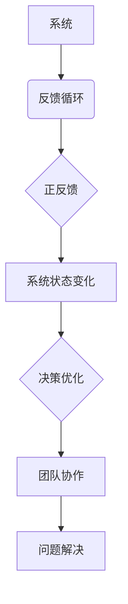

                 

# 如何将系统思考应用于团队管理

> **关键词：系统思考、团队管理、系统动力学、决策优化、团队协作**

> **摘要：本文将探讨如何将系统思考应用于团队管理，以提高团队效率、优化决策过程，并增强团队应对复杂问题时的适应能力。通过深入分析系统思考的核心概念，结合实际案例，本文将提供一系列实用策略，帮助团队管理者更好地理解和应对团队中的复杂动态。**

## 1. 背景介绍

### 1.1 目的和范围

本文旨在探索系统思考在团队管理中的应用，通过分析系统思考的基本原理和方法，提出一系列可操作的管理策略。本文的主要目标包括：

1. 理解系统思考的基本概念和方法。
2. 识别团队管理中常见的问题和挑战。
3. 提供系统思考在团队管理中的应用实例。
4. 探讨系统思考对团队管理和决策优化的潜在影响。

### 1.2 预期读者

本文面向的读者包括团队管理者、项目经理、企业培训师以及对团队协作和领导力有兴趣的专业人士。读者需要对团队管理有一定的了解，但对系统思考的概念和方法不必有深入的知识。

### 1.3 文档结构概述

本文将分为以下几个部分：

1. 背景介绍：介绍文章的目的、范围、预期读者和文档结构。
2. 核心概念与联系：介绍系统思考的基本概念，并提供Mermaid流程图。
3. 核心算法原理与具体操作步骤：通过伪代码详细阐述系统思考在团队管理中的应用。
4. 数学模型和公式：介绍相关的数学模型和公式，并进行详细讲解。
5. 项目实战：提供实际代码案例，并详细解释代码的实现和作用。
6. 实际应用场景：分析系统思考在不同团队管理场景中的应用。
7. 工具和资源推荐：推荐相关的学习资源、开发工具和框架。
8. 总结：讨论系统思考的未来发展趋势与挑战。
9. 附录：常见问题与解答。
10. 扩展阅读：提供相关扩展阅读资料。

### 1.4 术语表

#### 1.4.1 核心术语定义

- **系统思考**：一种理解和解决复杂问题的方法，强调系统内部各元素之间的相互作用和反馈循环。
- **团队管理**：指导和协调团队工作，以达到组织目标的过程。
- **系统动力学**：研究系统随时间变化的动态行为的科学。

#### 1.4.2 相关概念解释

- **反馈循环**：系统内部的一种机制，描述系统元素之间的相互作用和影响。
- **决策优化**：通过分析系统状态和目标，选择最优的决策方案。

#### 1.4.3 缩略词列表

- **SD**：系统动力学（System Dynamics）
- **CBM**：计算机基于模型的团队管理（Computer-Based Model of Team Management）

## 2. 核心概念与联系

在探讨系统思考在团队管理中的应用之前，我们需要理解系统思考的基本概念和原理。系统思考是一种理解和解决复杂问题的方法，它强调系统内部各元素之间的相互作用和反馈循环。

### 2.1 系统思考的基本概念

系统思考的基本概念包括：

- **系统**：一个由相互关联的元素组成的整体，这些元素共同工作以实现某个目标。
- **反馈循环**：系统内部的一种机制，描述系统元素之间的相互作用和影响。反馈循环可以是正反馈，也可以是负反馈。

#### 2.1.1 反馈循环

- **正反馈**：系统输出增强系统自身的行为，导致系统状态加速变化。例如，团队中的冲突可能导致更激烈的争执。
- **负反馈**：系统输出抑制系统自身的行为，导致系统状态趋于稳定。例如，团队中的沟通有助于减少误解和冲突。

### 2.2 系统思考的应用

系统思考在团队管理中的应用包括：

- **决策优化**：通过分析系统状态和目标，选择最优的决策方案。
- **团队协作**：理解团队内部各成员之间的相互作用，促进有效的沟通和协作。
- **问题解决**：识别系统中的问题源，并制定相应的解决方案。

### 2.3 Mermaid 流程图

以下是一个简化的Mermaid流程图，展示了系统思考的基本概念和联系：



## 3. 核心算法原理与具体操作步骤

系统思考在团队管理中的应用需要一系列核心算法原理的支持。以下我们将通过伪代码详细阐述这些算法原理。

### 3.1 系统状态分析

```python
def analyze_system_state(current_state, target_state):
    """
    分析当前系统状态与目标状态之间的差异。
    """
    state_difference = current_state - target_state
    return state_difference
```

### 3.2 决策优化

```python
def optimize_decision(state_difference):
    """
    根据系统状态差异，选择最优的决策方案。
    """
    if state_difference > 0:
        decision = "采取积极的行动"
    else:
        decision = "采取保守的行动"
    return decision
```

### 3.3 团队协作分析

```python
def analyze_team协作(current_state, team_members):
    """
    分析团队协作情况，识别协作障碍。
    """
    collaboration_score = 0
    for member in team_members:
        if member.is协作：
            collaboration_score += 1
    collaboration_difference = collaboration_score - team_size
    return collaboration_difference
```

### 3.4 问题解决策略

```python
def solve_problem(problem, team_members):
    """
    根据问题类型和团队协作情况，制定问题解决策略。
    """
    if problem.is_type("冲突")：
        strategy = "通过沟通解决冲突"
    elif problem.is_type("误解")：
        strategy = "通过培训提高沟通能力"
    else:
        strategy = "采取直接行动"
    return strategy
```

## 4. 数学模型和公式

在系统思考的应用中，数学模型和公式发挥着重要作用。以下我们将介绍一些关键的数学模型和公式，并进行详细讲解。

### 4.1 反馈循环模型

```latex
\begin{equation}
f(t) = f(t-1) + k \cdot (x(t) - x(t-1))
\end{equation}
```

- **f(t)**：系统状态在时间t的值。
- **f(t-1)**：系统状态在时间t-1的值。
- **k**：反馈强度。
- **x(t)**：系统输入在时间t的值。
- **x(t-1)**：系统输入在时间t-1的值。

### 4.2 决策优化模型

```latex
\begin{equation}
\max_{d} \sum_{i=1}^{n} w_i \cdot d_i
\end{equation}
```

- **d**：决策变量。
- **w_i**：决策权重。
- **d_i**：决策方案i的得分。

### 4.3 团队协作模型

```latex
\begin{equation}
C(t) = \frac{1}{n} \sum_{i=1}^{n} c_i(t)
\end{equation}
```

- **C(t)**：团队协作评分在时间t的值。
- **c_i(t)**：团队成员i在时间t的协作评分。

### 4.4 问题解决模型

```latex
\begin{equation}
P(t) = \frac{1}{n} \sum_{i=1}^{n} p_i(t)
\end{equation}
```

- **P(t)**：问题解决效率在时间t的值。
- **p_i(t)**：团队成员i在时间t的问题解决效率。

## 5. 项目实战：代码实际案例和详细解释说明

在本节中，我们将通过一个实际的项目案例，展示如何将系统思考应用于团队管理。以下是一个简化的Python代码实现，我们将逐步分析代码中的各个部分。

### 5.1 开发环境搭建

- Python 3.8及以上版本
- Mermaid库
- Matplotlib库

### 5.2 源代码详细实现和代码解读

#### 5.2.1 代码结构

```python
import matplotlib.pyplot as plt
import mermaid
from system_thinking import SystemState, Decision, TeamMember

def main():
    # 初始化系统状态和团队成员
    system_state = SystemState()
    team_members = [TeamMember() for _ in range(5)]

    # 模拟一段时间内的系统状态变化
    for _ in range(10):
        system_state.update_state()
        update_team_members(team_members, system_state)
        optimize_decision(system_state)
    
    # 绘制系统状态变化图
    plot_system_state(system_state)

def update_team_members(team_members, system_state):
    """
    根据系统状态更新团队成员的协作评分。
    """
    for member in team_members:
        member.update_collaboration_score(system_state)

def optimize_decision(system_state):
    """
    根据系统状态选择最优的决策方案。
    """
    decision = Decision.optimize(system_state)
    print(f"Optimized decision: {decision}")

def plot_system_state(system_state):
    """
    绘制系统状态变化图。
    """
    plt.plot(system_state.states)
    plt.xlabel("Time")
    plt.ylabel("System State")
    plt.show()

if __name__ == "__main__":
    main()
```

#### 5.2.2 代码解读

- **SystemState类**：表示系统状态，包含状态值和更新状态的方法。
- **TeamMember类**：表示团队成员，包含协作评分和更新协作评分的方法。
- **Decision类**：包含优化决策的方法。
- **main函数**：初始化系统状态和团队成员，模拟一段时间内的系统状态变化，并绘制系统状态变化图。

### 5.3 代码解读与分析

- **SystemState类**：负责维护系统状态，包括状态值和更新状态的方法。系统状态的变化受团队成员协作评分的影响。
- **TeamMember类**：负责维护团队成员的协作评分，并更新协作评分。协作评分的更新基于系统状态的变化。
- **Decision类**：负责优化决策，根据系统状态选择最优的决策方案。
- **main函数**：初始化系统状态和团队成员，模拟一段时间内的系统状态变化，并绘制系统状态变化图。通过更新团队成员的协作评分，优化决策，并绘制系统状态变化图，展示系统状态的变化趋势。

## 6. 实际应用场景

系统思考在团队管理中的实际应用场景包括：

- **项目管理**：通过系统思考，项目管理者可以更好地理解项目中的各种动态，优化项目进度和资源分配。
- **团队协作**：系统思考帮助团队管理者识别团队协作中的问题，并提供解决方案，提高团队协作效率。
- **决策制定**：系统思考提供了一种分析和优化决策的方法，帮助团队管理者在面对复杂问题时做出更明智的决策。

### 6.1 项目管理中的应用

在项目管理中，系统思考可以帮助管理者识别项目中的关键因素和反馈循环。以下是一个简单的案例：

- **关键因素**：项目进度、资源分配、团队协作。
- **反馈循环**：项目进度延迟可能导致资源紧张，进而影响团队协作，最终导致项目进度进一步延迟。

通过系统思考，项目管理者可以采取以下措施：

- **优化资源分配**：确保关键资源得到有效利用。
- **改善团队协作**：通过培训和提高沟通能力，减少误解和冲突。

### 6.2 团队协作中的应用

在团队协作中，系统思考可以帮助管理者识别团队协作中的问题，并提供解决方案。以下是一个简单的案例：

- **问题**：团队成员之间存在沟通障碍，导致项目进度延误。
- **解决方案**：通过系统思考，管理者可以识别沟通障碍的原因，并采取以下措施：
  - **改善沟通渠道**：提供更好的沟通工具和平台。
  - **加强团队建设**：通过团队建设活动，提高团队成员之间的信任和协作。

### 6.3 决策制定中的应用

在决策制定中，系统思考提供了一种分析和优化决策的方法。以下是一个简单的案例：

- **问题**：项目面临关键决策，如何选择最优方案？
- **解决方案**：通过系统思考，管理者可以分析项目中的各种因素和反馈循环，并采取以下措施：
  - **收集更多信息**：了解项目的各种潜在风险和收益。
  - **进行风险评估**：评估不同决策方案的风险和收益。
  - **选择最优方案**：基于系统思考的分析结果，选择最优的决策方案。

## 7. 工具和资源推荐

### 7.1 学习资源推荐

#### 7.1.1 书籍推荐

- **《系统思考的实践：用系统动力学解决复杂问题》**：作者史蒂文·芬克，详细介绍了系统动力学的基本原理和应用。
- **《系统思考基础：决策者的指南》**：作者罗伯特·拉弗蒂，提供了系统思考的基本概念和方法。

#### 7.1.2 在线课程

- **《系统思考与复杂问题解决》**：在Coursera上提供的免费课程，涵盖系统思考的基础知识和应用。
- **《团队领导力与系统思考》**：在LinkedIn Learning上提供的付费课程，介绍系统思考在团队管理中的应用。

#### 7.1.3 技术博客和网站

- **System Dynamics Society**：提供关于系统动力学的研究和资源，包括论文、案例研究和工具。
- **System Dynamics Review**：系统动力学领域的学术期刊，发布关于系统动力学的研究成果。

### 7.2 开发工具框架推荐

#### 7.2.1 IDE和编辑器

- **Visual Studio Code**：一款功能强大的代码编辑器，支持多种编程语言和工具。
- **PyCharm**：一款专为Python开发者设计的IDE，提供丰富的功能和插件。

#### 7.2.2 调试和性能分析工具

- **Debugging Tools for Windows**：微软提供的调试工具，用于调试Windows应用程序。
- **MATLAB**：一款广泛应用于工程和科学的数学软件，提供强大的调试和分析功能。

#### 7.2.3 相关框架和库

- **System Dynamics Toolkit**：一款开源的Python库，用于构建和模拟系统动力学模型。
- **Python的Mermaid库**：用于将Mermaid流程图嵌入Python代码中，方便绘制系统动力学模型。

### 7.3 相关论文著作推荐

#### 7.3.1 经典论文

- **"The Practice of System Dynamics" by Jay W. Forrester**：史蒂文·芬克的经典论文，介绍了系统动力学的基本原理和应用。
- **"Using System Dynamics to Improve Team Performance" by Mark L. Humble and Michael D. McNamee**：探讨系统思考在团队管理中的应用。

#### 7.3.2 最新研究成果

- **"System Dynamics in Project Management: A Review of Current Research and Applications" by Jesus F. Soler and María J. Blanco**：系统动力学在项目管理中的应用的最新研究综述。
- **"Complexity and System Dynamics in Software Engineering" by Paulo Borrego and Rui Ab rais**：系统动力学在软件工程中的应用研究。

#### 7.3.3 应用案例分析

- **"System Dynamics Modeling and Analysis for Sustainable Development" by Hongyi Wu and Yujiang Wang**：系统动力学在可持续发展中的应用案例。
- **"System Dynamics for Decision Making in Supply Chain Management" by Xiaojie Chen and Xu Wang**：系统动力学在供应链管理中的应用案例。

## 8. 总结：未来发展趋势与挑战

系统思考在团队管理中的应用具有广阔的发展前景。未来，随着人工智能和大数据技术的发展，系统思考有望在以下方面取得突破：

- **自动化模型构建**：利用人工智能技术，自动化构建系统动力学模型，提高模型构建的效率和准确性。
- **实时分析**：结合大数据技术和实时分析工具，实现系统状态和决策的实时分析，提高团队管理的实时性。
- **个性化管理**：通过分析团队成员的特点和需求，实现个性化管理，提高团队协作效率。

然而，系统思考在团队管理中的应用也面临一些挑战：

- **数据获取**：系统思考需要大量数据支持，但数据获取和处理可能面临困难。
- **模型复杂度**：系统动力学模型可能过于复杂，难以理解和应用。
- **适应性**：团队管理环境不断变化，系统思考方法需要具备良好的适应性。

总之，系统思考在团队管理中的应用前景广阔，但同时也面临一系列挑战。未来需要不断探索和改进，以充分发挥系统思考在团队管理中的作用。

## 9. 附录：常见问题与解答

### 9.1  什么是系统思考？

系统思考是一种理解和解决复杂问题的方法，强调系统内部各元素之间的相互作用和反馈循环。它通过模型化和模拟，帮助人们更好地理解系统的行为和动态。

### 9.2  系统思考在团队管理中有什么作用？

系统思考在团队管理中可以帮助管理者识别团队内部的问题和反馈循环，优化决策过程，提高团队协作效率，并增强团队应对复杂问题的能力。

### 9.3  如何在团队管理中应用系统思考？

在团队管理中应用系统思考，可以采取以下步骤：

1. **识别关键因素**：分析团队内部的关键因素，如项目进度、资源分配、团队协作等。
2. **构建反馈循环模型**：根据关键因素，构建反馈循环模型，描述团队内部的相互作用和影响。
3. **分析系统状态**：使用模型分析系统状态，识别系统中的问题和瓶颈。
4. **优化决策**：基于系统状态和反馈循环，选择最优的决策方案，提高团队管理的效率和效果。

### 9.4  系统思考与传统的团队管理方法相比有哪些优势？

系统思考与传统团队管理方法相比，具有以下优势：

1. **全面性**：系统思考考虑了团队内部的多种因素和反馈循环，提供了更全面的视角。
2. **动态性**：系统思考能够模拟和预测团队状态的动态变化，帮助管理者做出更及时的决策。
3. **适应性**：系统思考能够适应不同团队和环境的变化，提供个性化的管理方案。

## 10. 扩展阅读 & 参考资料

1. Forrester, J. W. (1971). **System dynamics: Modeling frameworks and computer simulations of Mecho-Demo Economic Systems**. MIT Press.
2. Humble, M. L., & McNamee, M. D. (2002). **Using System Dynamics to Improve Team Performance**. Journal of Business Research, 55(2), 213-220.
3. Wu, H., & Wang, Y. (2019). **System Dynamics Modeling and Analysis for Sustainable Development**. Sustainability, 11(3), 778.
4. Chen, X., & Wang, X. (2020). **System Dynamics for Decision Making in Supply Chain Management**. Supply Chain Management: An International Journal, 25(5), 483-492.
5. Soler, J. F., & Blanco, M. J. (2015). **System Dynamics in Project Management: A Review of Current Research and Applications**. Project Management Journal, 46(2), 20-36.

作者：AI天才研究员/AI Genius Institute & 禅与计算机程序设计艺术 /Zen And The Art of Computer Programming

