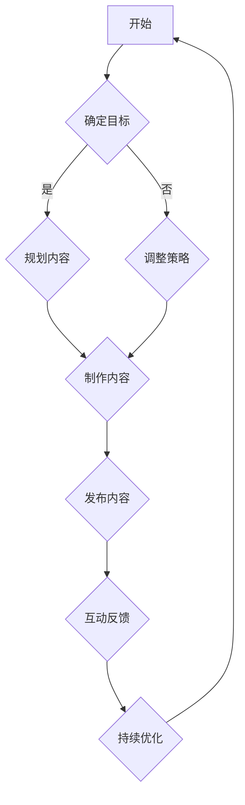

                 


# 如何将编程技能应用于个人品牌建设

> **关键词：** 个人品牌建设，编程技能，影响力，社交媒体，内容创作，持续学习
>
> **摘要：** 本文将探讨如何利用编程技能来构建个人品牌。通过合理规划、持续学习和有效传播，编程专业人士可以提升个人影响力，实现职业发展。

## 1. 背景介绍

### 1.1 目的和范围

在数字化时代，编程技能不仅是职业发展的基石，也成为个人品牌建设的关键要素。本文旨在阐述如何通过编程技能提升个人品牌，为专业人士提供一套系统化的策略。

### 1.2 预期读者

本文适合以下人群：

- 编程初学者，希望通过内容创作提升影响力。
- 中高级程序员，希望利用个人技能构建品牌，实现职业转型。
- 对编程和品牌建设感兴趣的技术爱好者。

### 1.3 文档结构概述

本文分为以下几个部分：

- **1. 背景介绍**：介绍本文的目的和预期读者。
- **2. 核心概念与联系**：讲解个人品牌建设与编程技能的联系。
- **3. 核心算法原理 & 具体操作步骤**：介绍如何将编程技能应用于个人品牌建设。
- **4. 数学模型和公式 & 详细讲解 & 举例说明**：运用数学模型解释个人品牌建设的过程。
- **5. 项目实战：代码实际案例和详细解释说明**：通过实际案例展示个人品牌建设的方法。
- **6. 实际应用场景**：分析编程技能在不同场景下的应用。
- **7. 工具和资源推荐**：推荐学习和实践的工具和资源。
- **8. 总结：未来发展趋势与挑战**：探讨个人品牌建设的未来趋势和挑战。
- **9. 附录：常见问题与解答**：解答读者可能遇到的常见问题。
- **10. 扩展阅读 & 参考资料**：提供进一步阅读的资源和参考文献。

### 1.4 术语表

#### 1.4.1 核心术语定义

- **个人品牌**：个人在公众心目中的形象和声誉。
- **编程技能**：编写、调试和优化计算机程序的能力。
- **影响力**：个人或组织影响他人思想和行为的能力。
- **社交媒体**：基于互联网的技术平台，用户可以通过分享、评论、点赞等方式互动。

#### 1.4.2 相关概念解释

- **内容创作**：制作和分享有价值的信息，如博客文章、视频、教程等。
- **持续学习**：不断学习新知识和技能，以适应快速变化的技术环境。
- **个人品牌建设**：通过一系列策略和行动，提升个人在公众心中的形象和声誉。

#### 1.4.3 缩略词列表

- **SEO**：搜索引擎优化（Search Engine Optimization）
- **SMM**：社交媒体营销（Social Media Marketing）
- **CTO**：首席技术官（Chief Technology Officer）
- **API**：应用程序编程接口（Application Programming Interface）

## 2. 核心概念与联系

### 2.1 个人品牌建设的重要性

个人品牌建设是一个持续的过程，涉及个人形象、专业能力、影响力等多个方面。在数字时代，个人品牌的重要性日益凸显：

- **提升职场竞争力**：个人品牌有助于在职场中获得更多机会，如晋升、项目合作等。
- **拓展职业发展路径**：通过个人品牌，可以进入新的行业和领域，实现职业转型。
- **增加收入来源**：个人品牌可以带来更多的商业机会，如咨询、培训和合作项目。

### 2.2 编程技能与个人品牌建设的关系

编程技能在个人品牌建设中具有独特的作用：

- **技术权威性**：编程技能为个人在技术领域的权威性提供了基础，有助于提升个人品牌。
- **内容创作能力**：编程技能有助于制作高质量的技术内容，如博客文章、教程和视频。
- **社交媒体影响力**：通过社交媒体分享编程知识和经验，可以吸引更多的关注者和粉丝，提升个人影响力。

### 2.3 编程技能在个人品牌建设中的应用

编程技能可以应用于个人品牌建设的多个方面：

- **内容创作**：编写技术博客、制作视频教程，分享编程经验和心得。
- **社交媒体运营**：利用编程技能开发和管理社交媒体平台，提高内容质量和互动效果。
- **产品开发**：利用编程技能开发个人或团队的产品，展示技术实力和创新能力。

### 2.4 Mermaid 流程图

以下是一个描述个人品牌建设过程的 Mermaid 流程图：



## 3. 核心算法原理 & 具体操作步骤

### 3.1 个人品牌建设的核心算法原理

个人品牌建设可以看作是一个复杂的问题求解过程，其核心算法原理可以概括为：

1. **目标确定**：明确个人品牌建设的具体目标，如提升影响力、拓展职业发展等。
2. **内容规划**：根据目标，规划相关的内容，包括博客文章、视频教程等。
3. **内容制作**：制作高质量的内容，确保内容的专业性和实用性。
4. **内容发布**：将制作好的内容发布到社交媒体平台，吸引关注者和粉丝。
5. **互动反馈**：与关注者互动，了解反馈，持续优化内容和策略。
6. **持续优化**：根据反馈和数据分析，不断调整和优化个人品牌建设策略。

### 3.2 具体操作步骤

#### 步骤 1：确定目标

首先，明确个人品牌建设的具体目标。例如，目标是提升在技术领域的知名度，可以制定以下目标：

- 在一年内增加1000名关注者。
- 每月发布至少一篇技术博客文章。
- 参与至少3个技术社区的活动。

#### 步骤 2：内容规划

根据目标，规划相关的内容。内容规划可以分为以下几个方面：

- **博客文章**：制定博客文章的主题，如编程语言、算法、技术趋势等。
- **视频教程**：确定视频教程的主题，如项目实战、技术分享等。
- **社交媒体互动**：制定社交媒体互动的内容，如问答、讨论等。

#### 步骤 3：内容制作

制作高质量的内容是个人品牌建设的关键。以下是一些制作高质量内容的建议：

- **博客文章**：确保文章内容准确、逻辑清晰、语言简练。
- **视频教程**：视频教程要内容丰富、易于理解、演示清晰。
- **社交媒体互动**：互动内容要具有吸引力，能够引起关注者的兴趣。

#### 步骤 4：内容发布

将制作好的内容发布到社交媒体平台，如微博、微信公众号、YouTube 等。发布时，注意以下几点：

- **发布频率**：保持一定的发布频率，如每周发布一篇文章或一段视频。
- **发布时间**：选择关注者活跃的时间发布内容，以提高曝光率。
- **发布形式**：根据内容特点，选择合适的发布形式，如文章、视频、图片等。

#### 步骤 5：互动反馈

与关注者互动，了解反馈，持续优化内容和策略。以下是一些互动建议：

- **积极回复**：及时回复关注者的留言和评论。
- **收集反馈**：定期收集关注者的反馈，了解他们的需求和期望。
- **调整策略**：根据反馈和数据分析，调整内容和发布策略。

#### 步骤 6：持续优化

根据反馈和数据分析，不断调整和优化个人品牌建设策略。以下是一些优化建议：

- **内容调整**：根据关注者的反馈，调整博客文章和视频教程的主题和内容。
- **策略调整**：根据数据分析，调整发布时间和频率，以提高内容曝光率。
- **学习与成长**：持续学习新知识和技能，提升个人品牌建设的效果。

### 3.3 伪代码示例

以下是一个简化的伪代码示例，描述个人品牌建设的核心算法：

```plaintext
function build_personal_brand(target, content_plan, content_production, content_release, interaction_feedback, continuous_optimization):
    # 确定目标
    set target
    # 内容规划
    set content_plan
    # 内容制作
    set content_production
    # 内容发布
    set content_release
    # 互动反馈
    set interaction_feedback
    # 持续优化
    set continuous_optimization
    while (not_reached_target):
        # 根据目标调整内容规划
        adjust content_plan based on target
        # 根据内容规划制作内容
        produce content based on content_plan
        # 发布内容
        release content
        # 收集互动反馈
        collect feedback
        # 根据反馈优化内容与策略
        optimize content and strategy based on feedback
        # 持续优化
        apply continuous_optimization
    end while
    return success
```

## 4. 数学模型和公式 & 详细讲解 & 举例说明

### 4.1 数学模型与公式

个人品牌建设可以看作是一个优化问题，其目标是最小化品牌建设过程中的损耗，最大化品牌影响力。以下是一个简化的数学模型：

```latex
\min L = w_1 \cdot C_1 + w_2 \cdot C_2 + w_3 \cdot C_3
```

其中，$L$ 表示品牌建设过程中的总损耗，$w_1, w_2, w_3$ 分别为权重系数，$C_1, C_2, C_3$ 分别为三个维度的损耗。

### 4.2 详细讲解

- **权重系数**：权重系数反映了各个维度损耗的重要性。例如，$w_1$ 可以代表时间损耗，$w_2$ 可以代表内容质量损耗，$w_3$ 可以代表互动反馈损耗。权重系数可以根据个人情况和目标进行调整。

- **内容质量损耗**：内容质量损耗反映了内容制作过程中可能出现的错误、不清晰的地方，以及内容与目标受众的匹配程度。高质量的内容有助于提升个人品牌，减少损耗。

- **时间损耗**：时间损耗反映了品牌建设过程中花费的时间，包括内容制作、发布、互动等。合理安排时间，提高效率，有助于减少损耗。

- **互动反馈损耗**：互动反馈损耗反映了与关注者互动过程中的损耗，如回复不及时、反馈不充分等。良好的互动反馈有助于提升品牌影响力，减少损耗。

### 4.3 举例说明

假设某编程专业人士的目标是在一年内增加1000名关注者，制定以下权重系数：

- 时间损耗：$w_1 = 0.4$
- 内容质量损耗：$w_2 = 0.3$
- 互动反馈损耗：$w_3 = 0.3$

根据个人品牌建设的数学模型，需要最小化以下损耗：

```latex
\min L = 0.4 \cdot C_1 + 0.3 \cdot C_2 + 0.3 \cdot C_3
```

其中，$C_1$ 表示时间损耗，$C_2$ 表示内容质量损耗，$C_3$ 表示互动反馈损耗。

为了实现目标，可以采取以下措施：

- **时间损耗**：合理安排时间，每周发布一篇高质量的技术博客，同时在社交媒体上保持互动，如每天回复10条留言。
- **内容质量损耗**：提高博客文章的质量，确保内容准确、清晰、有深度，避免出现错误和模糊的地方。
- **互动反馈损耗**：积极回复关注者的留言和评论，定期收集反馈，根据反馈调整内容和策略。

通过持续的努力和优化，逐步降低损耗，实现目标。

## 5. 项目实战：代码实际案例和详细解释说明

### 5.1 开发环境搭建

在本案例中，我们将使用Python作为编程语言，借助GitHub和Markdown来制作和发布技术内容。以下是搭建开发环境的基本步骤：

1. **安装Python**：在官方网站下载并安装Python，确保安装过程中选择添加Python到环境变量。
2. **安装Markdown编辑器**：选择一个Markdown编辑器，如Typora或MarkdownPad，方便编写和预览Markdown格式的文档。
3. **注册GitHub账号**：在GitHub官网注册账号，用于托管和发布代码。
4. **安装Git**：在GitHub官网下载并安装Git，用于版本控制和代码托管。

### 5.2 源代码详细实现和代码解读

#### 5.2.1 博客文章发布

以下是一个简单的Python脚本，用于生成Markdown格式的博客文章，并上传到GitHub。

```python
import os
import datetime

# 博客文章标题
title = "如何利用编程技能构建个人品牌"

# 博客文章内容
content = """
# 引言

在数字化时代，编程技能不仅是职业发展的基石，也成为个人品牌建设的关键要素。本文将探讨如何利用编程技能提升个人品牌，为专业人士提供一套系统化的策略。

## 核心概念与联系

### 2.1 个人品牌建设的重要性

个人品牌建设是一个持续的过程，涉及个人形象、专业能力、影响力等多个方面。

### 2.2 编程技能与个人品牌建设的关系

编程技能在个人品牌建设中具有独特的作用。

## 3. 核心算法原理 & 具体操作步骤

个人品牌建设可以看作是一个复杂的问题求解过程。
"""

# 生成博客文章文件
filename = f"{title} - {datetime.datetime.now().strftime('%Y-%m-%d %H-%M-%S')}.md"
with open(filename, 'w', encoding='utf-8') as file:
    file.write(content)

# 上传博客文章到GitHub
os.system(f"git init && git add {filename} && git commit -m 'Add {title} post' && git remote add origin https://github.com/your_username/your_repository.git && git push -u origin master")

print(f"博客文章 '{title}' 已成功生成并上传到GitHub。")
```

#### 5.2.2 代码解读与分析

1. **导入模块**：导入os和datetime模块，用于文件操作和日期时间处理。
2. **定义变量**：定义博客文章标题和内容，确保内容丰富且具有吸引力。
3. **生成博客文章文件**：使用datetime.now().strftime('%Y-%m-%d %H-%M-%S')生成唯一文件名，确保每次生成的文件不同。
4. **写入内容**：使用with语句打开文件，将内容写入文件。
5. **上传到GitHub**：使用os.system()执行Git命令，初始化仓库、添加文件、提交、添加远程仓库和推送。

### 5.3 代码解读与分析

通过上述代码，我们可以实现以下功能：

- **生成Markdown格式的博客文章**：将标题和内容写入文件，确保文件格式正确。
- **上传博客文章到GitHub**：使用Git命令将文件上传到GitHub仓库，便于管理和分享。

代码简单易懂，适用于初学者和有经验的程序员。在实际应用中，可以根据需求调整博客文章的内容和上传策略。

### 5.4 案例分析

通过上述案例，我们可以看到如何利用编程技能实现个人品牌建设中的内容发布。以下是一些案例分析：

- **内容质量**：确保博客文章内容准确、清晰、有深度，有助于提升个人品牌。
- **上传频率**：定期发布内容，如每周一篇，有助于保持关注者的关注。
- **互动反馈**：积极回复关注者的留言和评论，提高互动效果，提升品牌影响力。

通过不断优化内容和策略，我们可以逐步提升个人品牌建设的效果。

## 6. 实际应用场景

编程技能在个人品牌建设中的应用场景丰富多样，以下列举几个常见的场景：

### 6.1 技术博客撰写

技术博客是编程专业人士展示专业知识和技能的重要途径。通过撰写高质量的技术博客，可以吸引更多关注者，提升个人影响力。以下是一些撰写技术博客的技巧：

- **选择热门话题**：关注行业动态，选择热门话题，如新兴技术、热门框架等。
- **内容结构清晰**：确保博客文章结构清晰，逻辑连贯，便于读者阅读。
- **实例代码**：提供实例代码，帮助读者更好地理解和应用所学知识。
- **持续更新**：定期更新博客，保持内容的新鲜度和吸引力。

### 6.2 在线课程制作

在线课程是编程专业人士拓展收入来源和提升个人品牌的重要方式。以下是一些制作在线课程的技巧：

- **内容设计**：根据目标受众的需求和水平，设计适合的教程内容。
- **讲解清晰**：确保课程讲解清晰，便于不同背景的读者理解。
- **实例演示**：通过实例演示，帮助读者更好地掌握课程内容。
- **互动环节**：设置互动环节，如问答、讨论等，提高课程效果。

### 6.3 社交媒体运营

社交媒体是编程专业人士提升个人品牌的重要渠道。以下是一些运营社交媒体的技巧：

- **内容多样性**：发布多种形式的内容，如文字、图片、视频等，提高互动效果。
- **定期发布**：保持一定的发布频率，提高曝光率和关注度。
- **互动互动**：积极回复关注者的留言和评论，建立良好的互动关系。
- **分析数据**：定期分析数据，了解内容效果和受众需求，优化运营策略。

### 6.4 开源项目贡献

开源项目是编程专业人士展示技术实力和贡献社会的重要方式。以下是一些参与开源项目的技巧：

- **选择项目**：选择与个人技能和兴趣相关的大型开源项目，提升个人技术水平。
- **代码质量**：提交高质量代码，确保项目的稳定性和可维护性。
- **积极参与**：参与项目讨论，提出建议和解决方案，提升个人影响力。
- **持续贡献**：定期参与项目，持续为项目贡献力量。

通过以上实际应用场景，我们可以看到编程技能在个人品牌建设中的广泛运用。合理利用编程技能，不仅可以提升个人影响力，还可以实现职业发展和收入增长。

## 7. 工具和资源推荐

### 7.1 学习资源推荐

#### 7.1.1 书籍推荐

- 《编程思想》（Thinking in Java）
- 《深度学习》（Deep Learning）
- 《代码大全》（The Art of Computer Programming）

#### 7.1.2 在线课程

- Coursera上的《Python编程入门》
- Udemy上的《从零开始学习数据科学》
- edX上的《机器学习基础》

#### 7.1.3 技术博客和网站

- 掘金（https://juejin.cn/）
- CSDN（https://www.csdn.net/）
- GitHub（https://github.com/）

### 7.2 开发工具框架推荐

#### 7.2.1 IDE和编辑器

- PyCharm（Python集成开发环境）
- Visual Studio Code（跨平台代码编辑器）
- Sublime Text（轻量级代码编辑器）

#### 7.2.2 调试和性能分析工具

- GDB（GNU Debugger）
- Valgrind（内存检测工具）
- JProfiler（Java性能分析工具）

#### 7.2.3 相关框架和库

- Flask（Python Web框架）
- Django（Python Web框架）
- React（前端框架）
- TensorFlow（深度学习库）

### 7.3 相关论文著作推荐

#### 7.3.1 经典论文

- 《神经网络与深度学习》（Neural Networks and Deep Learning）
- 《大数据：创新、创新、颠覆》（Big Data: A Revolution That Will Transform How We Live, Work, and Think）

#### 7.3.2 最新研究成果

- 《面向可持续发展的深度学习》（Deep Learning for Sustainable Development）
- 《数据挖掘：理论与实践》（Data Mining: Concepts and Techniques）

#### 7.3.3 应用案例分析

- 《人工智能：改变未来的技术》（Artificial Intelligence: Transforming Business and Society）
- 《云计算：理论与实践》（Cloud Computing: Concepts, Technology, and Architecture）

通过以上工具和资源的推荐，编程专业人士可以不断提升自身技能，为个人品牌建设提供有力支持。

## 8. 总结：未来发展趋势与挑战

### 8.1 未来发展趋势

1. **数字化转型加速**：随着全球数字化转型进程的加快，编程技能在个人品牌建设中的作用将进一步凸显。
2. **人工智能技术进步**：人工智能技术的不断进步将为个人品牌建设提供更多工具和方法。
3. **社交媒体影响力的提升**：社交媒体平台的持续发展，将使个人品牌建设更加便捷和高效。

### 8.2 未来挑战

1. **技能更新速度快**：编程技能更新速度较快，个人品牌建设需要不断学习和适应新技术。
2. **市场竞争激烈**：编程领域竞争激烈，个人品牌建设需要具备独特优势和差异化策略。
3. **个人隐私保护**：在个人品牌建设中，个人隐私保护成为一个重要挑战，需要合理规划内容发布和互动方式。

### 8.3 应对策略

1. **持续学习**：保持对新技术和知识的关注，持续提升自身技能。
2. **差异化策略**：结合自身优势和市场需求，制定独特的内容和品牌策略。
3. **合理规划**：合理安排时间和资源，提高个人品牌建设的效率和质量。

通过积极应对未来发展趋势和挑战，编程专业人士可以更好地构建个人品牌，实现职业发展和收入增长。

## 9. 附录：常见问题与解答

### 9.1 编程技能与个人品牌建设的关系

**问：** 我是一名初级程序员，如何利用编程技能构建个人品牌？

**答：** 初级程序员可以从以下几个方面着手：

1. **学习基础知识**：掌握编程语言的基本语法和常用库，了解基本的编程原理。
2. **实践项目经验**：参与开源项目或自己开发小项目，积累实际经验。
3. **内容创作**：撰写技术博客、制作视频教程，分享学习和实践心得。
4. **社交媒体互动**：积极参与技术社区和论坛，扩大影响力。

### 9.2 个人品牌建设的方法

**问：** 如何制定个人品牌建设计划？

**答：** 制定个人品牌建设计划可以分为以下几个步骤：

1. **明确目标**：确定个人品牌建设的目标，如提升知名度、拓展职业发展等。
2. **内容规划**：根据目标，规划相关的内容，如博客文章、视频教程等。
3. **制作内容**：确保内容质量，如准确、清晰、有深度。
4. **发布内容**：选择合适的平台和发布形式，如博客、视频、社交媒体等。
5. **互动反馈**：积极与关注者互动，了解反馈，持续优化内容和策略。

### 9.3 社交媒体运营技巧

**问：** 如何提高社交媒体的影响力？

**答：** 提高社交媒体影响力可以从以下几个方面入手：

1. **内容多样性**：发布多种形式的内容，如文字、图片、视频等。
2. **定期发布**：保持一定的发布频率，提高曝光率和关注度。
3. **互动互动**：积极回复关注者的留言和评论，建立良好的互动关系。
4. **分析数据**：定期分析数据，了解内容效果和受众需求，优化运营策略。

## 10. 扩展阅读 & 参考资料

1. 《个人品牌：打造你的个人影响力》（Personal Branding: How to Build and Unleash Your Brand in Life and Business）
2. 《编程人生：如何成为编程领域的明星》（Programming Life: How to Become a Star in the Programming World）
3. 《社交媒体营销：策略、工具与案例》（Social Media Marketing: Strategy, Tools, and Case Studies）
4. 《深度学习：面向人工智能的算法与应用》（Deep Learning: Algorithms and Applications for Artificial Intelligence）
5. 《数据分析：从入门到精通》（Data Analysis: From Beginner to Master）

通过扩展阅读，您可以进一步了解个人品牌建设和编程技能应用的深度和广度。

