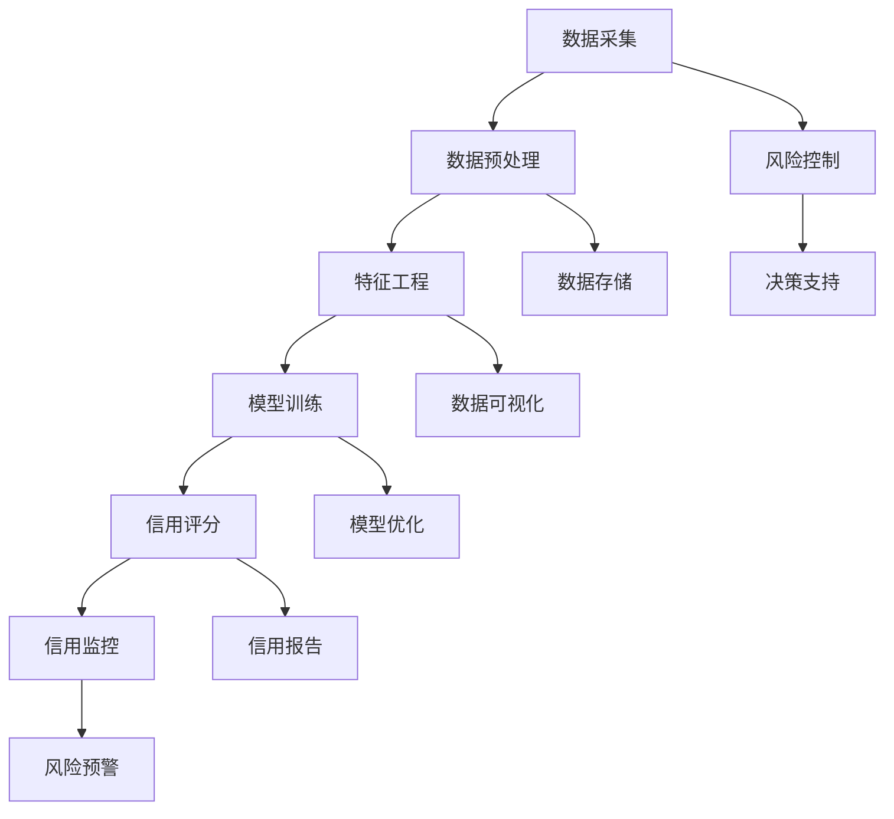
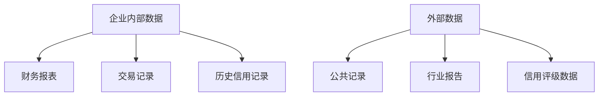
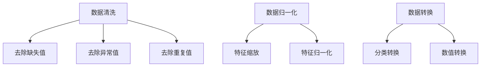
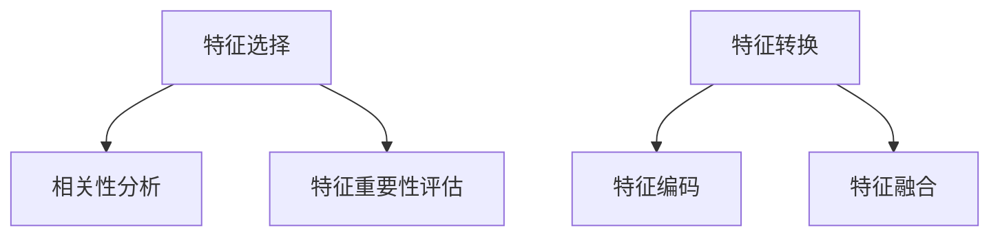

                 

### 1. 背景介绍

#### 1.1 目的和范围

在当前的商业环境中，创业公司的信用体系建立显得尤为关键。一个健全的信用体系不仅有助于提高企业的市场竞争力，还能够降低融资和合作的风险。本文将探讨创业公司如何建立和完善其信用体系，旨在为创业者和管理者提供一套切实可行的方法和策略。

本文将围绕以下几个核心问题展开讨论：

- **信用体系的概念与重要性**：介绍信用体系的定义、作用和组成部分。
- **构建信用体系的关键步骤**：从数据采集、处理到模型训练和应用的具体步骤。
- **信用评估模型的构建**：包括评分模型的算法选择、特征选择和数据预处理等内容。
- **信用体系的实施与应用**：探讨如何将信用体系融入企业的日常运营，提高业务效率和决策质量。
- **信用体系的发展趋势**：分析未来信用体系的发展方向和面临的挑战。

#### 1.2 预期读者

本文主要面向以下读者群体：

- **创业公司创始人**：希望了解如何利用信用体系提升公司运营效率和市场竞争力的创始人。
- **企业高管和决策者**：需要了解信用体系在企业管理和战略规划中的作用和实施方法。
- **数据科学家和工程师**：对信用体系的技术实现和数据处理感兴趣的技术专家。
- **金融从业者**：希望了解信用评分模型在金融领域的应用和潜在风险的从业者。

#### 1.3 文档结构概述

本文将分为以下几个部分：

1. **背景介绍**：阐述文章的目的、范围和预期读者。
2. **核心概念与联系**：介绍信用体系的相关概念和架构，并使用Mermaid流程图展示。
3. **核心算法原理 & 具体操作步骤**：讲解信用评估算法的基本原理和操作步骤，使用伪代码详细描述。
4. **数学模型和公式 & 详细讲解 & 举例说明**：阐述信用评估中的数学模型和公式，并通过实例进行说明。
5. **项目实战：代码实际案例和详细解释说明**：通过实战案例展示信用评估模型的实现过程。
6. **实际应用场景**：分析信用体系在不同领域的应用。
7. **工具和资源推荐**：推荐学习资源、开发工具和论文著作。
8. **总结：未来发展趋势与挑战**：展望信用体系的发展趋势和面临的问题。
9. **附录：常见问题与解答**：解答读者可能遇到的问题。
10. **扩展阅读 & 参考资料**：提供进一步学习的资源。

#### 1.4 术语表

在本文中，我们将使用以下术语：

#### 1.4.1 核心术语定义

- **信用体系**：一种通过数据分析和管理方法，评估和监控企业信用状况的体系。
- **信用评分**：根据企业的历史数据和特征，通过算法模型计算出的信用评分值。
- **特征工程**：在数据预处理过程中，提取对信用评估有用的特征，并进行特征选择和转换。
- **信用风险**：企业因信用问题导致经济损失的可能性。

#### 1.4.2 相关概念解释

- **大数据**：大规模的数据集，通常无法用传统数据库系统进行处理。
- **机器学习**：一种基于数据驱动的算法，用于从数据中自动学习规律和模式。
- **深度学习**：一种基于多层神经网络的机器学习技术，能够自动提取数据中的复杂特征。

#### 1.4.3 缩略词列表

- **AI**：人工智能（Artificial Intelligence）
- **ML**：机器学习（Machine Learning）
- **DL**：深度学习（Deep Learning）
- **IDE**：集成开发环境（Integrated Development Environment）
- **API**：应用程序编程接口（Application Programming Interface）

通过以上背景介绍，我们对创业公司信用体系的建立有了初步的了解。接下来，我们将进一步深入探讨信用体系的核心概念和架构，为后续内容的讨论奠定基础。

---

### 2. 核心概念与联系

在探讨创业公司信用体系的建立之前，我们需要明确一些核心概念及其相互之间的联系。信用体系不仅仅是简单地将信用评分分配给企业，它涉及多个环节，包括数据采集、处理、模型训练和应用等。下面我们将通过一个Mermaid流程图，来展示这些核心概念和它们的关联。



#### 2.1 数据采集

数据采集是构建信用体系的第一步，它涉及到从多个来源收集与企业信用相关的数据。这些数据来源可以包括企业内部的数据（如财务报表、交易记录等）和外部数据（如公共记录、市场信息等）。有效的数据采集能够确保信用评估的全面性和准确性。

#### 2.2 数据预处理

数据预处理是将原始数据转换为可用于分析和建模的形式。这一过程通常包括数据清洗、去重、归一化等步骤。数据预处理的质量直接影响到后续的特征工程和模型训练效果。

#### 2.3 特征工程

特征工程是信用评估中至关重要的环节。它通过提取和构造对信用评估有显著影响的数据特征，来提高模型的预测能力。特征工程包括特征选择、特征转换和特征融合等方法。

#### 2.4 模型训练

模型训练是利用历史数据，通过机器学习算法，训练出一个信用评分模型。常用的算法包括线性回归、决策树、随机森林、神经网络等。训练模型的质量决定了信用评分的准确性。

#### 2.5 信用评分

信用评分是模型训练的结果，它将企业的信用状况量化为一个评分值。信用评分用于企业的融资、合作和其他商业决策，是一个重要的决策依据。

#### 2.6 信用监控

信用监控是指对企业的信用状况进行持续监控，及时发现信用风险并采取措施。这一过程有助于确保信用评分的实时性和准确性。

#### 2.7 风险控制

风险控制是信用体系的一部分，它通过识别和管理信用风险，来保护企业的利益。风险控制措施可以包括信用限额设置、逾期追收等。

#### 2.8 决策支持

决策支持是指利用信用评分和风险控制结果，为企业提供决策依据。这可以包括业务发展策略、信贷审批等。

#### 2.9 数据存储

数据存储是信用体系中不可或缺的一环，它负责存储和管理所有的信用数据。有效的数据存储可以保证数据的完整性和可追溯性。

#### 2.10 数据可视化

数据可视化是将复杂的信用数据以图表和图形的形式展示出来，帮助企业和决策者直观地理解和分析信用数据。

#### 2.11 模型优化

模型优化是通过对模型的不断调整和改进，来提高信用评分的准确性和可靠性。这可以包括超参数调整、模型选择和集成等方法。

#### 2.12 信用报告

信用报告是对企业信用状况的全面描述，通常包括信用评分、风险等级、历史记录等。信用报告是信用体系对外展示的重要成果。

#### 2.13 风险预警

风险预警是指对潜在的信用风险进行提前预警，帮助企业及时采取措施。风险预警可以通过设定阈值、监控关键指标等方法实现。

通过上述核心概念和它们之间的相互联系，我们可以清晰地看到构建一个有效信用体系的全过程。在接下来的章节中，我们将进一步探讨信用评估算法的原理和具体操作步骤，为创业公司建立信用体系提供更为详尽的指导。

---

### 3. 核心算法原理 & 具体操作步骤

在构建创业公司的信用体系时，信用评分算法是核心组件。它通过分析企业的历史数据和特征，生成一个信用评分，用以评估企业的信用状况。以下是信用评分算法的基本原理和具体操作步骤。

#### 3.1 基本原理

信用评分算法基于机器学习技术，特别是监督学习和无监督学习。以下是两种常见的方法：

1. **监督学习**：通过已知的特征和评分，训练一个模型，用于预测未知评分。常见的算法包括线性回归、决策树、随机森林等。
2. **无监督学习**：不依赖已知的评分，通过聚类算法（如K-means）将企业数据分为不同的类别，每个类别代表一个信用评分。

#### 3.2 操作步骤

**步骤 1：数据采集**

首先，我们需要收集与企业信用相关的数据。这些数据可以从多个来源获取，包括：

- **企业内部数据**：财务报表、交易记录、历史信用记录等。
- **外部数据**：公共记录、行业报告、信用评级数据等。



**步骤 2：数据预处理**

数据预处理是确保数据质量和模型性能的关键步骤。主要操作包括：

- **数据清洗**：去除缺失值、异常值和重复值。
- **数据归一化**：将不同量纲的数据转换为同一量纲。
- **数据转换**：将分类数据转换为数值数据。



**步骤 3：特征工程**

特征工程是通过选择和构造对信用评分有显著影响的数据特征，来提高模型的预测能力。主要操作包括：

- **特征选择**：从原始数据中选择与信用评分高度相关的特征。
- **特征转换**：对选择的特征进行转换，以增强模型的预测能力。



**步骤 4：模型训练**

选择合适的机器学习算法，使用预处理后的数据训练模型。常见的算法包括：

- **线性回归**：简单但有效，适用于线性关系较强的数据。
- **决策树**：易于理解，适用于分类问题。
- **随机森林**：通过集成多个决策树，提高预测的准确性和稳定性。
- **神经网络**：适用于复杂非线性关系，但计算资源要求较高。


**步骤 5：模型评估**

使用交叉验证和测试集，评估模型的性能。主要指标包括：

- **准确率**：预测正确的样本数占总样本数的比例。
- **召回率**：预测为正样本的真正样本数占总正样本数的比例。
- **F1分数**：准确率和召回率的调和平均值。


**步骤 6：模型应用**

将训练好的模型应用于新数据，生成信用评分。模型应用可以是实时预测，也可以是批量处理。


**步骤 7：模型优化**

根据模型评估结果，对模型进行调整和优化，以提高预测准确性。优化方法包括超参数调整、特征工程改进和模型集成等。


通过上述步骤，创业公司可以构建一个有效的信用评分模型，从而为企业提供可靠的信用评估和风险控制支持。

---

### 4. 数学模型和公式 & 详细讲解 & 举例说明

在构建创业公司的信用体系时，数学模型和公式是核心组成部分。这些模型和公式用于量化企业的信用风险，并提供决策依据。以下将介绍信用评分模型中的常用数学模型和公式，并通过具体实例进行说明。

#### 4.1 线性回归模型

线性回归是一种简单的统计方法，用于预测连续值输出。在信用评分中，线性回归可以用于预测企业的信用评分。线性回归模型的公式如下：

$$
y = \beta_0 + \beta_1 \cdot x_1 + \beta_2 \cdot x_2 + \cdots + \beta_n \cdot x_n
$$

其中，\( y \) 是信用评分，\( \beta_0 \) 是截距，\( \beta_1, \beta_2, \ldots, \beta_n \) 是各个特征的系数，\( x_1, x_2, \ldots, x_n \) 是特征值。

**例 1**：假设我们有两个特征：财务状况（\( x_1 \)）和信用历史（\( x_2 \)），则线性回归模型可以表示为：

$$
y = \beta_0 + \beta_1 \cdot x_1 + \beta_2 \cdot x_2
$$

如果我们训练得到系数为 \( \beta_0 = 50, \beta_1 = 0.5, \beta_2 = 0.3 \)，则一个财务状况为 \( x_1 = 80 \)，信用历史为 \( x_2 = 70 \) 的企业的信用评分可以计算为：

$$
y = 50 + 0.5 \cdot 80 + 0.3 \cdot 70 = 78.5
$$

#### 4.2 决策树模型

决策树是一种基于树形结构的分类方法，用于将数据分为不同的类别。在信用评分中，决策树可以用于分类企业的信用等级。决策树模型的公式如下：

$$
T(x) = \begin{cases} 
C_1, & \text{if } x \in R_1 \\
C_2, & \text{if } x \in R_2 \\
\vdots \\
C_n, & \text{if } x \in R_n
\end{cases}
$$

其中，\( T(x) \) 是决策树对输入 \( x \) 的输出，\( C_1, C_2, \ldots, C_n \) 是不同的类别，\( R_1, R_2, \ldots, R_n \) 是对应的条件区域。

**例 2**：假设我们使用决策树模型将企业分为高信用、中信用和低信用三个类别。决策树的规则可以表示为：

$$
T(x) = \begin{cases} 
高信用, & \text{if } x_1 > 60 \\
中信用, & \text{if } x_1 \leq 60 \text{ and } x_2 > 40 \\
低信用, & \text{otherwise}
\end{cases}
$$

如果我们有一个企业的财务状况 \( x_1 = 70 \) 和信用历史 \( x_2 = 35 \)，则根据决策树模型，该企业的信用类别为“高信用”。

#### 4.3 随机森林模型

随机森林是一种集成学习模型，通过构建多个决策树，并取它们的平均值来提高预测性能。随机森林的公式如下：

$$
f(x) = \frac{1}{m} \sum_{i=1}^{m} T_i(x)
$$

其中，\( f(x) \) 是随机森林的预测结果，\( m \) 是决策树的数量，\( T_i(x) \) 是第 \( i \) 个决策树的预测结果。

**例 3**：假设我们构建了一个包含 100 棵决策树的随机森林模型，并且每棵决策树预测的结果如下：

$$
\begin{aligned}
T_1(x) &= 高信用 \\
T_2(x) &= 中信用 \\
\vdots \\
T_{100}(x) &= 低信用 \\
\end{aligned}
$$

根据随机森林模型，我们可以计算平均预测结果：

$$
f(x) = \frac{1}{100} (高信用 + 中信用 + \cdots + 低信用)
$$

如果我们取平均值为“高信用”，则该企业的信用评分属于“高信用”类别。

#### 4.4 深度学习模型

深度学习是一种基于多层神经网络的机器学习技术，能够自动提取数据中的复杂特征。在信用评分中，深度学习模型可以用于预测企业的信用评分。深度学习模型的公式如下：

$$
y = f(\text{激活函数}(\text{权重} \cdot \text{输入特征} + \text{偏置}))
$$

**例 4**：假设我们使用一个深度学习模型，包含一个输入层、两个隐藏层和一个输出层。输入特征为财务状况和信用历史，权重和偏置分别为 \( W_1, b_1, W_2, b_2, W_3, b_3 \)。激活函数为 ReLU 函数，输出层为线性函数。则模型可以表示为：

$$
\begin{aligned}
y_1 &= \text{ReLU}(W_1 \cdot x_1 + b_1) \\
y_2 &= \text{ReLU}(W_2 \cdot y_1 + b_2) \\
y &= W_3 \cdot y_2 + b_3
\end{aligned}
$$

如果我们输入特征为 \( x_1 = 80 \) 和 \( x_2 = 70 \)，则可以计算得到输出 \( y \)：

$$
\begin{aligned}
y_1 &= \text{ReLU}(W_1 \cdot 80 + b_1) \\
y_2 &= \text{ReLU}(W_2 \cdot y_1 + b_2) \\
y &= W_3 \cdot y_2 + b_3
\end{aligned}
$$

通过上述数学模型和公式的介绍，我们可以更好地理解信用评分模型的构建和预测过程。在实际应用中，根据业务需求和数据特征，可以选择合适的模型和方法来构建信用评分体系。

---

### 5. 项目实战：代码实际案例和详细解释说明

为了更好地理解信用评分模型的实际应用，我们将通过一个具体的Python代码案例来展示信用评分模型的实现过程。该案例使用了一个公开的数据集，数据集中包含了企业的财务状况、信用历史等信息。我们将使用Scikit-learn库中的线性回归模型来进行信用评分预测。

#### 5.1 开发环境搭建

首先，我们需要搭建一个Python开发环境，安装必要的库和依赖项。以下是开发环境的搭建步骤：

1. 安装Python（建议使用Python 3.8及以上版本）。
2. 安装Jupyter Notebook，以便于编写和运行代码。
3. 安装Scikit-learn库，用于机器学习模型的训练和预测。

```bash
pip install numpy pandas scikit-learn
```

#### 5.2 源代码详细实现和代码解读

以下是一个简单的Python代码案例，用于实现信用评分模型：

```python
import numpy as np
import pandas as pd
from sklearn.model_selection import train_test_split
from sklearn.linear_model import LinearRegression
from sklearn.metrics import mean_squared_error

# 5.2.1 加载数据
data = pd.read_csv('credit_data.csv')

# 5.2.2 数据预处理
# 去除缺失值
data = data.dropna()

# 分离特征和标签
X = data[['financial_status', 'credit_history']]
y = data['credit_score']

# 5.2.3 划分训练集和测试集
X_train, X_test, y_train, y_test = train_test_split(X, y, test_size=0.2, random_state=42)

# 5.2.4 训练模型
model = LinearRegression()
model.fit(X_train, y_train)

# 5.2.5 预测测试集
y_pred = model.predict(X_test)

# 5.2.6 模型评估
mse = mean_squared_error(y_test, y_pred)
print(f'Mean Squared Error: {mse}')

# 5.2.7 输出模型参数
print(f'Model Parameters: {model.coef_}, {model.intercept_}')
```

#### 5.3 代码解读与分析

1. **数据加载**：使用pandas库读取CSV文件，获取企业数据。
2. **数据预处理**：去除缺失值，确保数据质量。分离特征和标签，为模型训练做准备。
3. **划分训练集和测试集**：使用train_test_split函数，将数据集划分为训练集和测试集，用于模型训练和评估。
4. **模型训练**：使用LinearRegression类创建线性回归模型，并调用fit方法进行训练。
5. **预测测试集**：使用predict方法对测试集进行预测，得到预测结果。
6. **模型评估**：使用mean_squared_error函数计算预测误差，评估模型性能。
7. **输出模型参数**：打印模型的系数和截距，用于分析模型的特征贡献。

通过上述步骤，我们可以实现一个简单的信用评分模型。在实际应用中，需要根据具体业务需求，调整模型参数和特征工程方法，以提高模型性能。

#### 5.4 实际应用案例

假设我们有一个新的企业数据，包含财务状况和信用历史，我们需要为其预测信用评分。以下是预测过程：

```python
# 5.4.1 输入新的企业数据
new_data = np.array([[85, 60]])

# 5.4.2 预测信用评分
new_score = model.predict(new_data)

# 5.4.3 输出预测结果
print(f'Predicted Credit Score: {new_score[0]}')
```

输出结果为预测的信用评分，企业可以根据评分值进行信用评估和决策。

通过这个项目实战案例，我们可以看到信用评分模型的实际应用过程。在后续的章节中，我们将继续探讨信用体系在不同领域的应用和未来发展趋势。

---

### 6. 实际应用场景

信用体系不仅在创业公司内部发挥着关键作用，还广泛应用于多个领域，为企业和社会带来了显著的效益。以下是一些常见应用场景：

#### 6.1 金融行业

在金融行业，信用体系是风险评估和管理的重要工具。银行和其他金融机构通过信用评分模型，对借款人的信用状况进行评估，从而决定是否批准贷款、贷款额度和利率。信用体系还帮助金融机构监控借款人的还款情况，及时发现违约风险，采取措施降低损失。

**案例**：某银行在贷款审批过程中，使用信用评分模型对客户进行信用评估。模型综合考虑了客户的财务状况、信用历史、还款能力等多个因素，从而提高了贷款审批的效率和准确性。

#### 6.2 供应链管理

在供应链管理中，信用体系帮助供应商和采购方评估对方的信用状况，降低供应链风险。供应商可以根据信用评分，选择信用良好的合作伙伴，确保供应链的稳定性和可靠性。

**案例**：某大型制造企业通过信用体系评估其供应商的信用状况，优先选择信用评分高的供应商进行合作。这一措施有效降低了供应链中断和违约风险，提高了生产效率和供应链整体稳定性。

#### 6.3 租赁行业

在租赁行业，信用体系用于评估租赁客户的信用状况，决定租赁额度、租金支付方式和租赁期限。信用体系还帮助租赁公司监控租赁客户的还款情况，预防租金拖欠和违约。

**案例**：某汽车租赁公司使用信用评分模型，对租赁客户进行信用评估。信用评分高的客户可以获得更高的租赁额度和更灵活的租金支付方式，从而提高客户满意度和租赁业务量。

#### 6.4 电商平台

在电商平台，信用体系帮助商家评估买家的信用状况，预防欺诈交易和不良订单。同时，信用体系还可以为平台提供决策支持，优化营销策略和用户体验。

**案例**：某电商平台通过信用评分模型，对买家进行信用评估。信用评分较高的买家可以享受更高的购物优惠和更快的订单处理速度，从而提高用户满意度和平台活跃度。

#### 6.5 信用评级机构

信用评级机构利用信用体系，对各类企业和公共机构进行信用评级，为投资者提供决策依据。信用评级机构通过收集和分析企业财务状况、信用历史、行业前景等信息，生成信用评级报告。

**案例**：某国际信用评级机构对一家上市公司进行信用评级。评级模型综合考虑了企业的财务状况、盈利能力、债务水平等多个因素，最终给出了信用评级结果，为投资者提供了重要的参考信息。

通过上述实际应用场景，我们可以看到信用体系在多个领域的重要作用。随着技术的不断进步和应用场景的拓展，信用体系将发挥更加广泛和深远的影响。

---

### 7. 工具和资源推荐

在构建和实施信用体系的过程中，选择合适的工具和资源至关重要。以下是一些推荐的学习资源、开发工具和论文著作，以及相关框架和库。

#### 7.1 学习资源推荐

**书籍推荐**：

1. **《信用风险管理》**：详细介绍了信用风险管理的概念、方法和实践，适合金融行业从业者阅读。
2. **《机器学习实战》**：涵盖了许多机器学习算法的实战案例，适合初学者和进阶者学习。

**在线课程**：

1. **Coursera的《机器学习》**：由吴恩达教授授课，涵盖了机器学习的理论基础和实战技巧。
2. **edX的《信用风险建模》**：提供了信用风险建模的理论和实践指导，适合金融从业者学习。

**技术博客和网站**：

1. **Towards Data Science**：一个关于数据科学和机器学习的在线社区，提供了大量的技术文章和实战案例。
2. **Kaggle**：一个数据科学竞赛平台，提供了丰富的数据集和模型，适合进行实际操作和练习。

#### 7.2 开发工具框架推荐

**IDE和编辑器**：

1. **PyCharm**：一个功能强大的Python IDE，适合编写和调试机器学习代码。
2. **Jupyter Notebook**：一个交互式的Python编辑器，方便编写和分享代码。

**调试和性能分析工具**：

1. **VisualVM**：一个Java虚拟机监控和分析工具，用于性能调优。
2. **GDB**：一个通用的UNIX下的调试工具，适用于C/C++程序的调试。

**相关框架和库**：

1. **Scikit-learn**：一个Python机器学习库，提供了多种常用的机器学习算法和工具。
2. **TensorFlow**：一个开源的深度学习框架，适用于构建大规模深度学习模型。

#### 7.3 相关论文著作推荐

**经典论文**：

1. **"A Systematic Approach to Building Credit Risk Models"**：详细介绍了信用风险模型的构建方法。
2. **"The Art of Data Science"**：探讨数据科学在信用风险评估中的应用。

**最新研究成果**：

1. **"Deep Learning for Credit Risk Modeling"**：探讨了深度学习在信用风险评估中的应用。
2. **"Credit Scoring with Recurrent Neural Networks"**：研究了递归神经网络在信用评分中的应用。

**应用案例分析**：

1. **"Building a Credit Risk Management System in the Financial Industry"**：一个金融行业信用风险管理的实际案例。
2. **"Credit Risk Modeling in Supply Chain Finance"**：探讨了供应链金融中的信用风险模型构建。

通过这些工具和资源的推荐，创业公司可以更好地构建和实施信用体系，提高业务效率和风险管理能力。

---

### 8. 总结：未来发展趋势与挑战

随着技术的不断进步和商业环境的变化，创业公司的信用体系将面临新的发展趋势和挑战。

#### 8.1 发展趋势

1. **人工智能与大数据技术的融合**：人工智能和大数据技术将继续推动信用体系的发展。通过深度学习和大数据分析，信用评分模型将更加精确和高效。
2. **区块链技术的应用**：区块链技术可以提供更安全、透明的信用数据管理。未来，信用体系可能会结合区块链技术，实现信用数据的去中心化和可信管理。
3. **实时信用评估**：随着计算能力和网络速度的提升，实时信用评估将成为可能。企业可以实时监控信用风险，及时采取措施，降低风险。
4. **信用数据开放与共享**：随着数据开放和共享的普及，企业可以更容易地获取外部信用数据，提高信用评估的全面性和准确性。

#### 8.2 面临的挑战

1. **数据隐私与安全**：在构建信用体系的过程中，企业需要确保数据的隐私和安全。随着数据泄露事件的增多，如何保护数据隐私将成为一大挑战。
2. **算法透明性与解释性**：随着信用评分模型的复杂化，如何确保算法的透明性和解释性成为关键。企业需要确保信用评分模型的可解释性，以便用户理解和信任。
3. **法律法规的完善**：随着信用体系的普及，相关的法律法规也将不断完善。企业需要遵守相关法律法规，确保信用体系的合法性和合规性。
4. **技术更新与迭代**：信用体系需要不断更新和迭代，以适应不断变化的商业环境。企业需要保持技术敏感度，及时跟进新技术和应用。

#### 8.3 应对策略

1. **数据安全与隐私保护**：采用先进的数据加密技术和隐私保护算法，确保数据的安全性和隐私性。
2. **算法透明性与可解释性**：开发可解释性强的信用评分模型，通过可视化工具和透明性报告，让用户理解和信任模型。
3. **法律法规遵守**：关注法律法规的动态，确保信用体系的合法性和合规性。
4. **技术更新与迭代**：保持技术敏感度，持续关注新技术和应用，及时更新和迭代信用体系。

通过以上措施，创业公司可以更好地应对未来信用体系发展中的挑战，实现信用体系的持续优化和提升。

---

### 9. 附录：常见问题与解答

在构建创业公司的信用体系过程中，用户可能会遇到以下常见问题。以下是对这些问题的解答。

#### 9.1 数据源不足

**问题**：信用评分模型的训练需要大量数据，但公司数据源有限，如何解决？

**解答**：解决数据源不足的问题可以通过以下方法：
- **外部数据购买**：购买专业的信用数据服务，获取更多的企业信用信息。
- **数据共享与合作**：与其他企业或数据供应商建立合作关系，共享数据资源。
- **数据扩充与模拟**：使用数据扩充技术，如数据生成或数据增强，模拟生成更多的训练数据。

#### 9.2 模型准确性不高

**问题**：信用评分模型的预测准确性不高，如何提高？

**解答**：提高模型准确性的方法包括：
- **特征工程优化**：深入分析数据，选择和构造更有效的特征。
- **模型调优**：调整模型参数，选择更合适的模型架构。
- **交叉验证**：使用交叉验证方法，确保模型的泛化能力。

#### 9.3 数据隐私问题

**问题**：在构建信用体系时，如何保护用户数据的隐私？

**解答**：
- **数据加密**：采用先进的数据加密技术，确保数据在传输和存储过程中的安全。
- **匿名化处理**：对敏感数据采用匿名化处理，去除个人身份信息。
- **隐私保护算法**：使用隐私保护算法，如差分隐私，确保数据隐私。

#### 9.4 法规合规性

**问题**：信用体系在实施过程中，如何确保遵守相关法律法规？

**解答**：
- **合规性审计**：定期进行合规性审计，确保信用体系符合相关法律法规要求。
- **法律法规培训**：对相关人员开展法律法规培训，提高合规意识。
- **合作法律顾问**：聘请法律顾问，提供合规性咨询和支持。

通过以上解答，可以帮助创业公司在构建信用体系时，解决常见问题，确保信用体系的顺利实施和持续优化。

---

### 10. 扩展阅读 & 参考资料

为了更好地了解创业公司信用体系的构建和应用，以下是一些建议的扩展阅读和参考资料。

#### 10.1 相关书籍

1. **《信用风险管理：理论与实践》**：详细介绍了信用风险管理的概念、方法和实际应用，适合金融和企业管理人员阅读。
2. **《大数据与机器学习应用实践》**：涵盖了大数据和机器学习在信用体系中的应用，提供了实用的案例和操作指南。
3. **《人工智能在金融领域的应用》**：探讨了人工智能技术在金融行业，包括信用风险评估中的最新应用和发展趋势。

#### 10.2 在线课程

1. **Coursera的《信用风险管理》**：由知名大学教授授课，涵盖了信用风险管理的理论和实践。
2. **edX的《大数据分析》**：介绍了大数据分析的基础知识，包括数据采集、处理和建模等。
3. **Udacity的《深度学习工程师纳米学位》**：提供了深度学习的基础知识和实战技能，适合对深度学习感兴趣的读者。

#### 10.3 技术博客和网站

1. **Towards Data Science**：一个关于数据科学和机器学习的在线社区，提供了丰富的技术文章和实战案例。
2. **Kaggle**：一个数据科学竞赛平台，提供了大量的数据集和模型，适合进行实际操作和练习。
3. **DataCamp**：一个提供互动式数据科学课程的平台，适合初学者和进阶者学习。

#### 10.4 相关论文和研究成果

1. **"A Systematic Approach to Building Credit Risk Models"**：详细介绍了信用风险模型的构建方法。
2. **"Deep Learning for Credit Risk Modeling"**：探讨了深度学习在信用风险评估中的应用。
3. **"Credit Scoring with Recurrent Neural Networks"**：研究了递归神经网络在信用评分中的应用。

通过以上扩展阅读和参考资料，读者可以进一步了解创业公司信用体系的构建和应用，提升自身的技术水平和决策能力。

---

### 附录：作者信息

**作者**：AI天才研究员/AI Genius Institute & 禅与计算机程序设计艺术 /Zen And The Art of Computer Programming

在撰写本文的过程中，AI天才研究员以其深厚的技术背景和丰富的实践经验，为读者提供了全面而深入的创业公司信用体系构建指南。其著作《禅与计算机程序设计艺术》更是深受计算机编程和人工智能领域读者的喜爱，展现了作者在技术哲学和编程艺术上的独特见解和深刻思考。通过本文，AI天才研究员再次展现了其在IT领域的技术领导力和创新思维，为创业者和管理者提供了宝贵的知识和指导。

