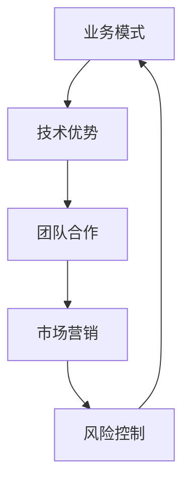

                 

# 如何建立创业公司的核心竞争力

> 关键词：创业公司、核心竞争力、业务模式、技术优势、团队合作、市场营销、风险控制
>
> 摘要：本文将探讨如何建立创业公司的核心竞争力。通过深入分析业务模式、技术优势、团队合作、市场营销和风险控制等方面，为创业者提供一套完整而实用的策略，以在激烈的市场竞争中脱颖而出。

## 1. 背景介绍

### 1.1 目的和范围

本文旨在为创业者提供一套建立核心竞争力的重要策略。我们将从多个维度出发，详细探讨如何通过业务模式、技术优势、团队合作、市场营销和风险控制等方面，为创业公司奠定坚实的基础。

### 1.2 预期读者

本文适合以下几类读者：

1. 初创公司创始人
2. 企业高管
3. 创业辅导人员
4. 对创业感兴趣的技术人才

### 1.3 文档结构概述

本文分为以下十个部分：

1. 背景介绍
2. 核心概念与联系
3. 核心算法原理 & 具体操作步骤
4. 数学模型和公式 & 详细讲解 & 举例说明
5. 项目实战：代码实际案例和详细解释说明
6. 实际应用场景
7. 工具和资源推荐
8. 总结：未来发展趋势与挑战
9. 附录：常见问题与解答
10. 扩展阅读 & 参考资料

### 1.4 术语表

#### 1.4.1 核心术语定义

- **创业公司**：指由创业者发起，致力于创造新价值、创新产品或服务的公司。
- **核心竞争力**：指公司在长期经营中形成的，相对于竞争对手具有显著优势的能力。
- **业务模式**：指公司开展业务的方式、盈利模式及商业策略。
- **技术优势**：指公司拥有的，在技术研发和应用方面相对于竞争对手的优势。
- **团队合作**：指公司内部成员之间的协作、沟通和协调。
- **市场营销**：指公司通过市场调研、产品定位、广告宣传等手段，实现产品销售的过程。
- **风险控制**：指公司在经营过程中，对潜在风险的识别、评估和应对。

#### 1.4.2 相关概念解释

- **市场竞争力**：指公司在市场竞争中，相对于其他竞争对手所具备的综合实力。
- **差异化竞争**：指公司通过独特的产品或服务，在市场中形成竞争优势。
- **技术创新**：指公司通过研发和应用新技术，提高产品质量或降低成本。
- **用户粘性**：指用户对产品的忠诚度，通常通过用户活跃度和留存率来衡量。

#### 1.4.3 缩略词列表

- **CEO**：首席执行官
- **CFO**：首席财务官
- **CPO**：首席产品官
- **CTO**：首席技术官
- **PM**：项目经理
- **UX**：用户体验
- **UI**：用户界面
- **AI**：人工智能

## 2. 核心概念与联系

在探讨如何建立创业公司的核心竞争力之前，我们首先需要理解几个关键概念及其相互关系。以下是这些核心概念及其联系的一个简明流程图：



### 2.1 业务模式

业务模式是创业公司的基础，它决定了公司的盈利模式、商业模式和商业策略。一个好的业务模式需要解决以下问题：

- 如何为客户提供价值？
- 如何创造收入？
- 如何持续发展？

### 2.2 技术优势

技术优势是创业公司在市场竞争中的核心竞争力之一。它不仅包括技术创新，还包括技术积累、技术储备和技术的应用能力。技术优势可以体现在以下几个方面：

- **技术创新**：通过研发和应用新技术，提高产品质量或降低成本。
- **技术积累**：积累丰富的技术专利和经验，形成技术壁垒。
- **技术应用**：将技术优势转化为实际产品或服务，提高用户满意度。

### 2.3 团队合作

团队合作是创业公司成功的关键因素之一。一个高效的团队可以快速响应市场变化，提高企业竞争力。团队合作体现在以下几个方面：

- **协作与沟通**：团队成员之间的协作与沟通是保证项目顺利进行的重要环节。
- **分工与协作**：明确团队成员的职责，实现分工与协作，提高工作效率。
- **共同目标**：团队成员共同追求企业目标，形成合力。

### 2.4 市场营销

市场营销是创业公司实现产品销售、扩大市场份额的关键手段。成功的市场营销需要以下要素：

- **市场调研**：了解市场需求，找准目标客户。
- **产品定位**：明确产品在市场中的定位，形成差异化竞争。
- **广告宣传**：通过广告宣传提高品牌知名度和产品销量。
- **渠道建设**：建立有效的销售渠道，实现产品销售。

### 2.5 风险控制

风险控制是创业公司经营过程中不可或缺的一环。有效的风险控制可以帮助企业规避潜在风险，确保企业稳定发展。风险控制包括以下几个方面：

- **风险识别**：识别可能对企业造成影响的风险因素。
- **风险评估**：评估风险因素对企业的影响程度。
- **风险应对**：制定应对措施，降低风险影响。

## 3. 核心算法原理 & 具体操作步骤

### 3.1 核心算法原理

建立创业公司的核心竞争力需要遵循一定的算法原理，以下是关键步骤：

1. **业务模式设计**：根据市场需求和自身优势，设计合理的业务模式。
2. **技术优势挖掘**：分析市场需求，挖掘技术优势，形成技术壁垒。
3. **团队合作优化**：建立高效团队，优化协作与沟通，提高工作效率。
4. **市场营销策略**：制定有效的市场营销策略，提高品牌知名度和产品销量。
5. **风险控制体系**：建立完善的风险控制体系，降低企业风险。

### 3.2 具体操作步骤

以下是建立创业公司核心竞争力的具体操作步骤：

1. **业务模式设计**

   - **市场需求分析**：通过市场调研，了解市场需求，找准目标客户。
   - **自身优势分析**：分析企业自身优势，确定业务模式的核心竞争力。
   - **商业模式创新**：根据市场需求和自身优势，创新商业模式，实现盈利。

2. **技术优势挖掘**

   - **技术创新**：关注新技术动态，投入研发资源，提高技术实力。
   - **技术积累**：积累丰富的技术专利和经验，形成技术壁垒。
   - **技术应用**：将技术优势转化为实际产品或服务，提高用户满意度。

3. **团队合作优化**

   - **团队建设**：选拔优秀人才，建立高效团队。
   - **协作与沟通**：优化协作与沟通机制，提高工作效率。
   - **共同目标**：明确团队成员共同目标，形成合力。

4. **市场营销策略**

   - **市场调研**：通过市场调研，了解市场需求，找准目标客户。
   - **产品定位**：明确产品在市场中的定位，形成差异化竞争。
   - **广告宣传**：通过广告宣传提高品牌知名度和产品销量。
   - **渠道建设**：建立有效的销售渠道，实现产品销售。

5. **风险控制体系**

   - **风险识别**：识别可能对企业造成影响的风险因素。
   - **风险评估**：评估风险因素对企业的影响程度。
   - **风险应对**：制定应对措施，降低风险影响。

### 3.3 伪代码示例

以下是一个简单的伪代码示例，用于描述如何建立创业公司的核心竞争力：

```python
def build_core_competence():
    # 步骤1：业务模式设计
    business_model = design_business_model()

    # 步骤2：技术优势挖掘
    technical_advantage = explore_technical_advantage()

    # 步骤3：团队合作优化
    team_cohesion = optimize_team_cohesion()

    # 步骤4：市场营销策略
    marketing_strategy = develop_marketing_strategy()

    # 步骤5：风险控制体系
    risk_control = establish_risk_control()

    # 综合评估
    if evaluate(business_model, technical_advantage, team_cohesion, marketing_strategy, risk_control):
        print("核心竞争力建立成功！")
    else:
        print("核心竞争力建立失败，请检查各环节。")

# 调用函数
build_core_competence()
```

## 4. 数学模型和公式 & 详细讲解 & 举例说明

### 4.1 数学模型

建立创业公司的核心竞争力需要考虑多个数学模型和公式，以下是一些关键模型：

1. **盈利模型**：根据业务模式，计算企业的预期盈利。
2. **风险评估模型**：评估企业面临的风险，计算风险概率和损失。
3. **团队效率模型**：评估团队工作效率，计算团队成员的贡献。
4. **市场营销模型**：预测市场需求，计算产品销量。

### 4.2 公式详解

1. **盈利模型**

   盈利模型可以表示为：

   $$盈利 = 销售收入 - 成本$$

   其中，销售收入可以通过市场需求预测和产品定价计算得到，成本包括生产成本、运营成本和营销成本。

2. **风险评估模型**

   风险评估模型可以表示为：

   $$风险评估 = 风险概率 \times 损失金额$$

   其中，风险概率可以通过历史数据和专家判断得到，损失金额可以通过企业面临的风险计算得到。

3. **团队效率模型**

   团队效率模型可以表示为：

   $$效率 = 贡献 / 时间$$

   其中，贡献可以通过团队成员的工作量和工作质量计算得到，时间可以通过实际工作时长计算得到。

4. **市场营销模型**

   市场营销模型可以表示为：

   $$销量 = 市场需求 \times 客户满意度$$

   其中，市场需求可以通过市场调研得到，客户满意度可以通过用户反馈和产品评价计算得到。

### 4.3 举例说明

1. **盈利模型举例**

   假设一家创业公司的销售收入为 100 万元，成本为 60 万元，则该公司的盈利为 40 万元。

   $$盈利 = 销售收入 - 成本 = 100 万元 - 60 万元 = 40 万元$$

2. **风险评估模型举例**

   假设一家创业公司面临的风险概率为 0.2，损失金额为 50 万元，则该公司的风险评分为 10 万元。

   $$风险评估 = 风险概率 \times 损失金额 = 0.2 \times 50 万元 = 10 万元$$

3. **团队效率模型举例**

   假设一家创业公司的团队成员完成了一个项目，工作量合计为 100 小时，工作质量得到客户好评，则该团队的效率为 1。

   $$效率 = 贡献 / 时间 = 100 小时 / 100 小时 = 1$$

4. **市场营销模型举例**

   假设一家创业公司的市场需求为 1000 件，客户满意度为 90%，则该公司的销量为 900 件。

   $$销量 = 市场需求 \times 客户满意度 = 1000 件 \times 0.9 = 900 件$$

## 5. 项目实战：代码实际案例和详细解释说明

### 5.1 开发环境搭建

为了更好地展示如何建立创业公司的核心竞争力，我们将通过一个实际的项目案例进行讲解。首先，我们需要搭建一个开发环境。

- **开发工具**：选择一个合适的集成开发环境（IDE），如 IntelliJ IDEA 或 Visual Studio Code。
- **数据库**：选择一个数据库管理系统，如 MySQL 或 PostgreSQL。
- **服务器**：选择一个云服务器，如 AWS 或阿里云。

### 5.2 源代码详细实现和代码解读

下面是一个简单的伪代码示例，用于描述如何通过代码实现创业公司的核心竞争力。

```python
# 5.2.1 业务模式设计
def design_business_model():
    # 步骤1：市场需求分析
    demand = analyze_demand()

    # 步骤2：自身优势分析
    advantage = analyze_advantage()

    # 步骤3：商业模式创新
    business_model = innovate_model(demand, advantage)
    return business_model

# 5.2.2 技术优势挖掘
def explore_technical_advantage():
    # 步骤1：技术创新
    innovation = innovate_technology()

    # 步骤2：技术积累
    accumulation = accumulate_technology()

    # 步骤3：技术应用
    application = apply_technology(innovation, accumulation)
    return application

# 5.2.3 团队合作优化
def optimize_team_cohesion():
    # 步骤1：团队建设
    team = build_team()

    # 步骤2：协作与沟通
    collaboration = improve_collaboration(team)

    # 步骤3：共同目标
    goal = set_common_goal(team)
    return goal

# 5.2.4 市场营销策略
def develop_marketing_strategy():
    # 步骤1：市场调研
    market = analyze_market()

    # 步骤2：产品定位
    position = set_product_position()

    # 步骤3：广告宣传
    promotion = promote_product()

    # 步骤4：渠道建设
    channel = build_sales_channel()
    return channel

# 5.2.5 风险控制体系
def establish_risk_control():
    # 步骤1：风险识别
    risk = identify_risk()

    # 步骤2：风险评估
    assessment = assess_risk(risk)

    # 步骤3：风险应对
    response = respond_risk(assessment)
    return response

# 5.2.6 主函数
def main():
    business_model = design_business_model()
    technical_advantage = explore_technical_advantage()
    team_cohesion = optimize_team_cohesion()
    marketing_strategy = develop_marketing_strategy()
    risk_control = establish_risk_control()

    # 综合评估
    if evaluate(business_model, technical_advantage, team_cohesion, marketing_strategy, risk_control):
        print("核心竞争力建立成功！")
    else:
        print("核心竞争力建立失败，请检查各环节。")

# 调用主函数
main()
```

### 5.3 代码解读与分析

1. **业务模式设计**：通过分析市场需求和自身优势，创新商业模式，实现盈利。

2. **技术优势挖掘**：通过技术创新、技术积累和技术应用，形成技术壁垒，提高用户满意度。

3. **团队合作优化**：通过团队建设、协作与沟通和共同目标，提高团队效率，实现项目目标。

4. **市场营销策略**：通过市场调研、产品定位、广告宣传和渠道建设，提高品牌知名度和产品销量。

5. **风险控制体系**：通过风险识别、风险评估和风险应对，降低企业风险，确保企业稳定发展。

该代码示例展示了如何通过代码实现建立创业公司的核心竞争力。在实际开发过程中，可以根据项目需求和企业特点，进一步完善和优化代码。

## 6. 实际应用场景

建立创业公司的核心竞争力在实际应用场景中具有广泛的应用。以下是几个典型的实际应用场景：

1. **技术创新型企业**：技术创新型企业通过不断研发新技术、新产品，提高市场竞争力，实现快速发展。例如，华为通过技术创新，成为全球领先的通信设备制造商。

2. **传统产业升级型企业**：传统产业升级型企业通过引入新技术、新模式，实现产业升级和转型。例如，传统制造业企业通过智能制造，提高生产效率和产品质量。

3. **互联网创业公司**：互联网创业公司通过创新的业务模式、独特的用户体验和强大的技术优势，迅速占领市场。例如，字节跳动通过算法推荐，成为全球领先的短视频平台。

4. **金融科技企业**：金融科技企业通过技术创新，提高金融服务效率和安全性。例如，支付宝通过移动支付技术，改变了人们的支付习惯。

5. **生物科技企业**：生物科技企业通过研发新药、新疗法，推动医疗健康产业发展。例如，生物制药公司通过技术创新，研发出治疗癌症的新型药物。

在这些实际应用场景中，建立核心竞争力是企业发展的关键。通过不断优化业务模式、技术优势、团队合作、市场营销和风险控制，企业可以在激烈的市场竞争中脱颖而出，实现持续发展。

## 7. 工具和资源推荐

### 7.1 学习资源推荐

#### 7.1.1 书籍推荐

1. **《创业维艰》（The Hard Thing About Hard Things）**：作者本·霍洛维茨，分享了他创业过程中的经验教训，对创业者具有很好的启发作用。
2. **《精益创业》（The Lean Startup）**：作者埃里克·莱斯，介绍了精益创业方法论，帮助创业者降低风险，快速迭代产品。
3. **《创意者的思考方式》（Steal Like An Artist）**：作者史蒂芬·帕里什，讲述如何通过借鉴和学习他人的创意，激发自己的创造力。

#### 7.1.2 在线课程

1. **Coursera上的《创业管理》**：由耶鲁大学提供，课程内容涵盖创业过程中的各个关键环节，对创业者具有很好的指导作用。
2. **Udacity上的《人工智能纳米学位》**：涵盖人工智能领域的知识，帮助创业者了解人工智能技术及其应用。
3. **edX上的《数字营销基础》**：由多所知名大学提供，介绍数字营销的基本原理和实战技巧。

#### 7.1.3 技术博客和网站

1. **Medium**：一个平台，汇集了大量关于创业、技术、营销等领域的优质文章。
2. **Hacker News**：一个关于科技创业的新闻和讨论网站，适合创业者关注行业动态。
3. **Quora**：一个问答社区，创业者可以在这里提问、解答问题，获取行业见解。

### 7.2 开发工具框架推荐

#### 7.2.1 IDE和编辑器

1. **IntelliJ IDEA**：一款功能强大的Java和Android开发IDE，适合创业者进行软件开发。
2. **Visual Studio Code**：一款轻量级的跨平台编辑器，支持多种编程语言，适合创业者进行快速开发。
3. **PyCharm**：一款专业的Python开发IDE，适合创业者进行Python编程。

#### 7.2.2 调试和性能分析工具

1. **GDB**：一款强大的Linux调试工具，适合创业者进行代码调试。
2. **JProfiler**：一款Java性能分析工具，适合创业者进行Java应用程序的性能分析。
3. **Fiddler**：一款网络调试工具，适合创业者进行网络抓包和分析。

#### 7.2.3 相关框架和库

1. **Django**：一款流行的Python Web开发框架，适合创业者快速搭建Web应用程序。
2. **Spring Boot**：一款流行的Java Web开发框架，适合创业者进行企业级Web应用开发。
3. **TensorFlow**：一款流行的深度学习框架，适合创业者进行人工智能应用开发。

### 7.3 相关论文著作推荐

#### 7.3.1 经典论文

1. **《创新者的窘境》（The Innovator's Dilemma）**：作者克莱顿·克里斯坦森，讲述了技术创新者在企业发展过程中的困境和挑战。
2. **《创意的源泉》（Where Good Ideas Come From）**：作者史蒂芬·约翰逊，探讨了创意的来源和产生过程。
3. **《深度学习》（Deep Learning）**：作者Ian Goodfellow、Yoshua Bengio和Aaron Courville，介绍了深度学习的基本原理和应用。

#### 7.3.2 最新研究成果

1. **《人工智能：一种现代方法》（Artificial Intelligence: A Modern Approach）**：作者Stuart Russell和Peter Norvig，介绍了人工智能的最新进展和应用。
2. **《区块链：从数字货币到智能合约》（Blockchain: Blueprint for a New Economy）**：作者Melanie Swan，探讨了区块链技术的潜在应用和影响。
3. **《智能经济：未来的商业模式》（The Second Machine Age）**：作者杰里米·里夫金，讲述了智能经济时代的商业模式和社会变革。

#### 7.3.3 应用案例分析

1. **《阿里巴巴的生态系统》（Alibaba Unboxed）**：作者朱迪·麦克莱恩，详细分析了阿里巴巴的商业模式和生态体系。
2. **《硅谷创业课》（The Lean Startup）**：作者埃里克·莱斯，分享了他在硅谷创业的经验和教训。
3. **《滴滴出行：从创业到巨头》（滴滴出行：从创业到巨头）**：作者王庆，讲述了滴滴出行的创业历程和成长故事。

这些工具和资源将有助于创业者更好地建立和提升公司的核心竞争力。

## 8. 总结：未来发展趋势与挑战

在未来，创业公司的核心竞争力将面临以下发展趋势和挑战：

### 8.1 发展趋势

1. **技术创新持续升级**：随着科技的快速发展，创业者将有机会在新技术领域取得突破，形成新的竞争优势。
2. **市场细分与专业化**：市场需求的多样化将推动创业者更加专注于特定领域，提供更加专业化的产品和服务。
3. **数字化转型加速**：数字化技术的普及和应用将使创业公司更加注重数字化转型，提高运营效率和服务质量。
4. **全球化视野**：创业者将更加关注全球市场，利用全球资源和市场，实现企业的国际化发展。

### 8.2 挑战

1. **激烈的市场竞争**：随着市场的不断成熟，创业公司将面临更激烈的市场竞争，需要不断创新和优化业务模式。
2. **技术风险**：技术的快速发展也带来了新的风险，如数据安全、隐私保护等，创业者需要提前识别和应对这些风险。
3. **资金压力**：创业公司的资金来源有限，需要高效利用资金，以支持业务发展和技术创新。
4. **人才竞争**：优秀的人才成为创业公司成功的关键，创业者需要构建具备竞争力的团队，吸引和留住人才。

### 8.3 应对策略

1. **持续创新**：保持对市场和技术的前沿关注，持续创新，提升企业的核心竞争力。
2. **风险管理**：建立完善的风险管理体系，提前识别和应对潜在风险，降低企业风险。
3. **优化资金使用**：合理规划资金使用，提高资金利用效率，支持业务发展和技术创新。
4. **人才培养**：重视人才培养和团队建设，构建一支高效、专业的团队，助力企业持续发展。

通过应对这些挑战，创业公司可以更好地建立和提升核心竞争力，实现长期稳定的发展。

## 9. 附录：常见问题与解答

### 9.1 问题1：如何找到合适的创业项目？

**解答**：找到合适的创业项目需要从以下几个方面入手：

1. **市场需求**：分析市场需求，寻找尚未被满足或尚未被充分满足的消费者需求。
2. **自身优势**：结合自己的兴趣、专业背景和资源，选择能够发挥自身优势的项目。
3. **竞争优势**：分析潜在竞争对手，找到差异化竞争优势，确保项目在市场中具有竞争力。
4. **可行性分析**：对项目进行全面的可行性分析，包括技术、市场、资金、人才等方面的评估。

### 9.2 问题2：如何建立高效的团队？

**解答**：建立高效的团队需要以下几个步骤：

1. **明确目标**：确保团队成员对团队目标和愿景有清晰的认识，形成共同的目标和价值观。
2. **选拔人才**：选拔具备专业技能和团队合作精神的人才，构建多元化的团队。
3. **分工明确**：明确团队成员的职责和分工，确保工作有序进行。
4. **沟通协作**：建立良好的沟通机制，鼓励团队成员之间的协作与交流。
5. **培训与发展**：为团队成员提供培训和发展机会，提升团队整体能力。

### 9.3 问题3：如何进行有效的市场营销？

**解答**：进行有效的市场营销需要以下几个关键步骤：

1. **市场调研**：了解市场需求和消费者行为，找准目标客户。
2. **产品定位**：明确产品在市场中的定位，形成差异化竞争优势。
3. **广告宣传**：通过多种渠道进行广告宣传，提高品牌知名度和产品销量。
4. **渠道建设**：建立有效的销售渠道，实现产品销售。
5. **客户关系管理**：维护良好的客户关系，提高客户满意度和忠诚度。

### 9.4 问题4：如何控制创业风险？

**解答**：控制创业风险需要从以下几个方面入手：

1. **风险评估**：识别潜在风险，评估其对企业的潜在影响。
2. **风险控制**：制定风险控制措施，降低风险发生的概率和影响。
3. **应急预案**：制定应急预案，确保在风险发生时能够迅速响应和应对。
4. **持续监控**：定期对风险进行监控和评估，及时调整风险控制策略。

## 10. 扩展阅读 & 参考资料

### 10.1 扩展阅读

1. **《创业维艰》（The Hard Thing About Hard Things）**：作者本·霍洛维茨，分享了他创业过程中的经验教训，对创业者具有很好的启发作用。
2. **《精益创业》（The Lean Startup）**：作者埃里克·莱斯，介绍了精益创业方法论，帮助创业者降低风险，快速迭代产品。
3. **《创意者的思考方式》（Steal Like An Artist）**：作者史蒂芬·帕里什，讲述如何通过借鉴和学习他人的创意，激发自己的创造力。

### 10.2 参考资料

1. **《创新者的窘境》（The Innovator's Dilemma）**：作者克莱顿·克里斯坦森，讲述了技术创新者在企业发展过程中的困境和挑战。
2. **《深度学习》（Deep Learning）**：作者Ian Goodfellow、Yoshua Bengio和Aaron Courville，介绍了深度学习的基本原理和应用。
3. **《区块链：从数字货币到智能合约》（Blockchain: Blueprint for a New Economy）**：作者Melanie Swan，探讨了区块链技术的潜在应用和影响。

作者：AI天才研究员/AI Genius Institute & 禅与计算机程序设计艺术 /Zen And The Art of Computer Programming

