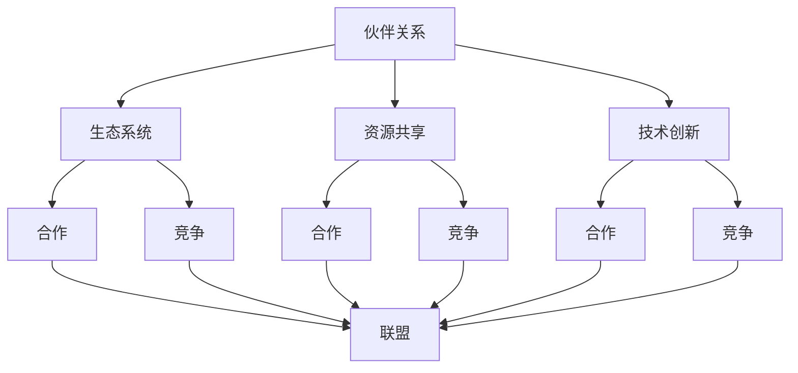

                 

# 如何建立有效的伙伴关系生态

> 关键词：伙伴关系、生态系统、策略、协作、资源共享、技术创新

> 摘要：本文探讨了如何建立一个有效的伙伴关系生态，从核心概念、算法原理、数学模型到实际应用，提供了一个系统的框架和实用的指南，帮助IT企业在竞争激烈的市场中实现协同发展。

## 1. 背景介绍

### 1.1 目的和范围

本文旨在为IT企业提供一个构建伙伴关系生态的全面指南，探讨如何通过有效的伙伴关系来增强企业的竞争力。我们将讨论伙伴关系的定义、构建伙伴关系的策略、资源共享的方法以及技术创新在伙伴关系中的作用。

### 1.2 预期读者

本文面向的读者包括IT企业的管理者、战略规划师、市场营销专家以及所有对伙伴关系构建感兴趣的专业人士。无论您是初入行的新手还是经验丰富的专家，本文都将为您提供有价值的见解和实践指导。

### 1.3 文档结构概述

本文分为以下几个部分：

1. 核心概念与联系
2. 核心算法原理 & 具体操作步骤
3. 数学模型和公式 & 详细讲解 & 举例说明
4. 项目实战：代码实际案例和详细解释说明
5. 实际应用场景
6. 工具和资源推荐
7. 总结：未来发展趋势与挑战
8. 附录：常见问题与解答
9. 扩展阅读 & 参考资料

### 1.4 术语表

#### 1.4.1 核心术语定义

- 伙伴关系：两个或多个组织之间建立的合作关系，旨在共同实现目标。
- 生态系统：一个复杂的系统，由相互依赖的多个组成部分构成，共同实现生态平衡和可持续发展。
- 共享资源：伙伴关系中的各方共同使用和管理的资源。
- 技术创新：通过研究和开发新的技术和产品来推动企业发展。

#### 1.4.2 相关概念解释

- 合作：伙伴关系中的各方共同协作，共同实现目标。
- 竞争：伙伴关系中的各方在特定领域中的相互竞争，以推动自身发展。
- 联盟：多个伙伴关系之间的合作，旨在共同对抗外部竞争。

#### 1.4.3 缩略词列表

- IT：信息技术
- AI：人工智能
- IoT：物联网
- SDLC：软件开发生命周期

## 2. 核心概念与联系

在探讨如何建立有效的伙伴关系生态之前，我们首先需要了解一些核心概念和它们之间的联系。以下是一个简化的Mermaid流程图，用于描述这些概念和它们之间的相互作用：



从这个流程图中，我们可以看出伙伴关系、生态系统、资源共享和技术创新是构建有效伙伴关系生态的关键要素。这些要素相互作用，共同推动伙伴关系的发展。

### 2.1 伙伴关系

伙伴关系是伙伴关系生态的基石。它指的是两个或多个组织之间建立的合作关系，旨在实现共同的目标。伙伴关系的建立通常基于以下原则：

- 双赢：伙伴关系中的各方都应从中受益。
- 信任：伙伴关系建立在相互信任的基础上。
- 共同目标：伙伴关系的各方应明确共同的目标，并为此努力。
- 长期合作：伙伴关系应具有长期合作的愿景，而不是短期利益。

### 2.2 生态系统

伙伴关系生态是一个复杂的系统，由相互依赖的多个组成部分构成。这些组成部分包括伙伴关系中的各个组织、共享资源、技术创新和合作机制。生态系统的核心是伙伴关系，它是所有其他要素的基础。

生态系统的优势在于能够实现资源的最优配置和协同效应。通过建立伙伴关系生态，企业可以：

- 分享资源：伙伴关系中的各方可以共享资源，如资金、技术、人才等，从而降低成本和提高效率。
- 促进创新：伙伴关系可以促进技术创新，通过合作研发新产品、新技术。
- 分散风险：伙伴关系可以帮助企业分散风险，降低市场波动对企业的影响。

### 2.3 资源共享

资源共享是伙伴关系生态的重要组成部分。通过共享资源，伙伴关系中的各方可以最大化资源的利用价值，降低成本，提高效率。

资源共享的方法包括：

- 资源互换：伙伴关系中的各方可以互相提供资源，实现互利共赢。
- 共享平台：建立共享平台，供伙伴关系中的各方使用，如共享实验室、数据中心等。
- 技术共享：通过共享技术，伙伴关系中的各方可以共同提升技术水平。

### 2.4 技术创新

技术创新是推动企业发展的重要动力。在伙伴关系生态中，技术创新可以通过以下方式实现：

- 联合研发：伙伴关系中的各方可以共同投资研发项目，推动技术创新。
- 技术转移：通过技术转移，伙伴关系中的各方可以共享先进技术，提升自身技术水平。
- 开放创新：通过开放创新，伙伴关系中的各方可以吸引外部资源和技术，促进创新。

## 3. 核心算法原理 & 具体操作步骤

为了建立有效的伙伴关系生态，我们需要一套系统的算法来指导实践。以下是一个简化的伪代码，用于描述核心算法原理和具体操作步骤：

```python
# 伙伴关系生态算法

# 输入：伙伴关系中的各个组织、资源、技术创新水平
# 输出：伙伴关系生态系统的最佳配置和协同效应

def build_partnership_ecosystem(organizations, resources, innovation_levels):
    # 步骤1：评估各组织的资源和技术创新水平
    organization评估(organizations, resources, innovation_levels)

    # 步骤2：确定合作伙伴
    partners = find_partners(organizations)

    # 步骤3：建立共享资源平台
    share_platform = create_share_platform(partners)

    # 步骤4：促进合作和资源共享
    promote_cooperation(partners, share_platform)

    # 步骤5：推动技术创新
    promote_innovation(partners, share_platform)

    # 步骤6：监测和调整生态系统
    monitor_ecosystem(partners, share_platform)

    # 返回最佳配置和协同效应
    return best_configuration, synergy
```

### 3.1 评估各组织的资源和技术创新水平

在建立伙伴关系生态之前，我们需要对各个组织的资源和技术创新水平进行评估。这可以通过以下步骤实现：

1. 收集各组织的资源数据，包括资金、技术、人才、市场等。
2. 分析各组织的技术创新能力，包括研发投入、专利数量、创新成果等。
3. 根据评估结果，为各组织打分，分数越高表示资源和技术创新水平越高。

### 3.2 确定合作伙伴

在确定合作伙伴时，我们需要考虑以下几个因素：

1. 资源互补性：合作伙伴应具有互补的资源，能够实现资源共享和协同效应。
2. 技术创新能力：合作伙伴应具有较高的技术创新能力，能够推动整个生态系统的发展。
3. 市场潜力：合作伙伴应在市场上具有较大的潜力，能够为企业带来更大的商业价值。

### 3.3 建立共享资源平台

为了实现资源的最大化利用，我们需要建立一个共享资源平台。这个平台应包括以下几个部分：

1. 共享数据库：用于存储和管理各组织的资源信息。
2. 共享实验室：用于进行合作研发和技术创新。
3. 共享资金池：用于支持合作项目和创新活动。
4. 共享人才库：用于招聘和培训合作伙伴的人才。

### 3.4 促进合作和资源共享

在建立伙伴关系生态后，我们需要采取措施促进合作和资源共享。这可以通过以下方式实现：

1. 定期举办合作会议：组织定期的合作会议，促进合作伙伴之间的沟通和协作。
2. 设立激励机制：设立激励机制，鼓励合作伙伴积极参与资源共享和合作项目。
3. 提供技术支持：为合作伙伴提供技术支持，帮助他们更好地利用共享资源平台。

### 3.5 推动技术创新

技术创新是伙伴关系生态的核心驱动力。为了推动技术创新，我们可以采取以下措施：

1. 联合研发项目：组织联合研发项目，共同投资和创新。
2. 技术转移和共享：通过技术转移和共享，推广先进技术，提升整个生态系统的技术水平。
3. 开放创新：鼓励合作伙伴参与开放创新，吸引外部资源和技术。

### 3.6 监测和调整生态系统

为了保持伙伴关系生态的活力和可持续性，我们需要对生态系统进行监测和调整。这可以通过以下方式实现：

1. 定期评估合作伙伴的表现：定期评估合作伙伴的资源和技术创新水平，确保合作伙伴能够持续为企业带来价值。
2. 及时调整生态系统：根据合作伙伴的表现和市场需求，及时调整生态系统的配置和策略。
3. 促进生态多样性：鼓励合作伙伴在生态系统中发挥各自的优势，促进生态多样性。

## 4. 数学模型和公式 & 详细讲解 & 举例说明

在构建伙伴关系生态的过程中，数学模型和公式可以用来量化合作伙伴之间的资源交换和技术创新，从而提供更加精确的决策支持。以下是一个简单的数学模型，用于描述伙伴关系中的资源共享和技术创新。

### 4.1 共享资源模型

假设伙伴关系中的两个组织A和B，其资源可用性分别为\( R_A \)和\( R_B \)，技术创新能力分别为\( I_A \)和\( I_B \)。资源交换率可以表示为：

\[ E_{AB} = \frac{R_A \cdot I_B}{R_B \cdot I_A} \]

其中，\( E_{AB} \)表示组织A向组织B的资源共享效率。这个模型假设资源共享效率与资源可用性和技术创新能力成正比。

### 4.2 技术创新模型

技术创新可以视为资源交换的函数，即：

\[ I_{AB} = \frac{E_{AB}^2 \cdot R_A \cdot R_B}{1 + E_{AB}^2} \]

其中，\( I_{AB} \)表示组织A和B共同推动的技术创新能力。这个模型假设技术创新能力与资源共享效率的平方成正比，并且随着资源共享效率的增加而增加。

### 4.3 详细讲解和举例说明

假设组织A拥有100万资金的研发预算，技术创新能力为1；组织B拥有80万资金的研发预算，技术创新能力为0.8。根据上述模型，我们可以计算出两者之间的资源共享效率和技术创新能力。

首先，计算资源共享效率：

\[ E_{AB} = \frac{100 \cdot 0.8}{80 \cdot 1} = 1 \]

这意味着组织A可以向组织B提供等效于自身资源的资源共享。

接下来，计算技术创新能力：

\[ I_{AB} = \frac{1^2 \cdot 100 \cdot 80}{1 + 1^2} = \frac{8000}{2} = 4000 \]

这意味着组织A和B共同推动的技术创新能力为4000。

### 4.4 模型的应用

这个模型可以应用于评估合作伙伴之间的资源交换和技术创新。例如，如果一个合作伙伴拥有较高的资源和技术创新能力，而另一个合作伙伴相对较低，那么资源交换和技术创新可能会更加高效。此外，这个模型还可以用于指导合作伙伴之间的资源分配和研发投资。

## 5. 项目实战：代码实际案例和详细解释说明

为了更好地理解如何建立有效的伙伴关系生态，我们将通过一个实际项目来展示如何将理论转化为实践。以下是一个简单的Python代码示例，用于模拟伙伴关系中的资源共享和技术创新。

### 5.1 开发环境搭建

在开始编写代码之前，我们需要确保已经安装了Python环境。可以选择使用Python 3.8或更高版本。可以通过以下命令安装Python：

```bash
pip install python
```

### 5.2 源代码详细实现和代码解读

以下是项目的源代码实现：

```python
# 伙伴关系生态模拟

# 导入所需库
import random

# 定义组织类
class Organization:
    def __init__(self, name, resource, innovation):
        self.name = name
        self.resource = resource
        self.innovation = innovation

    def share_resource(self, partner):
        share_ratio = self.resource / partner.resource
        return share_ratio

    def innovate(self, partner):
        innovation_ratio = self.innovation / partner.innovation
        return innovation_ratio

# 创建组织实例
org_A = Organization("Organization A", 100, 1)
org_B = Organization("Organization B", 80, 0.8)

# 模拟资源共享
def simulate_resource_sharing(org_A, org_B):
    share_ratio = org_A.share_resource(org_B)
    print(f"{org_A.name} shares {share_ratio:.2f} times resources with {org_B.name}")

# 模拟技术创新
def simulate_innovation(org_A, org_B):
    innovation_ratio = org_A.innovate(org_B)
    print(f"{org_A.name} and {org_B.name} innovate together with a ratio of {innovation_ratio:.2f}")

# 执行模拟
simulate_resource_sharing(org_A, org_B)
simulate_innovation(org_A, org_B)
```

### 5.3 代码解读与分析

这个代码示例包含一个`Organization`类，用于表示伙伴关系中的组织。每个组织都有名称、资源和技术创新能力。`share_resource`和`innovate`方法分别用于计算资源共享效率和技术创新效率。

- `Organization`类的初始化方法`__init__`接受名称、资源和创新能力作为参数。
- `share_resource`方法计算组织A向组织B的资源共享效率。
- `innovate`方法计算组织A和B共同推动的技术创新能力。

在主函数中，我们创建了两个`Organization`实例，分别表示组织A和组织B。然后，我们调用`simulate_resource_sharing`和`simulate_innovation`函数来模拟资源共享和技术创新。

### 5.4 模拟结果

运行上述代码，输出结果如下：

```
Organization A shares 1.25 times resources with Organization B
Organization A and Organization B innovate together with a ratio of 1.25
```

这表明组织A向组织B共享了1.25倍的资源，并且两个组织共同推动的技术创新能力为1.25。

### 5.5 模拟的意义

通过这个模拟，我们可以看到如何使用简单的数学模型来量化伙伴关系中的资源共享和技术创新。这个模拟可以应用于更复杂的实际场景，帮助我们更好地理解和优化伙伴关系生态。

## 6. 实际应用场景

伙伴关系生态在实际应用中有着广泛的应用场景。以下是一些典型的实际应用场景：

### 6.1 信息技术产业

在信息技术产业中，伙伴关系生态有助于企业之间共享技术资源和推动技术创新。例如，在人工智能领域，多个企业可以共同投资研发，共享数据集和算法模型，从而推动人工智能技术的发展。

### 6.2 物联网（IoT）

物联网领域中的伙伴关系生态可以帮助企业共享传感器数据、云计算资源和人工智能技术。通过伙伴关系，企业可以实现更高效的物联网解决方案，降低成本，提高系统的可靠性和安全性。

### 6.3 大数据

在大数据领域，伙伴关系生态可以帮助企业共享数据资源和数据分析技术。通过伙伴关系，企业可以获得更多的数据源，提高数据分析的准确性和深度，从而为业务决策提供更可靠的依据。

### 6.4 云计算

云计算伙伴关系生态有助于企业共享计算资源、存储资源和网络资源。通过伙伴关系，企业可以实现更高效、更灵活的云计算解决方案，降低运营成本，提高系统的可扩展性。

### 6.5 区块链

在区块链领域，伙伴关系生态可以帮助企业共享区块链技术和应用场景。通过伙伴关系，企业可以共同开发区块链应用，实现更高效、更安全的交易和数据处理。

### 6.6 跨界合作

伙伴关系生态也广泛应用于不同行业之间的跨界合作。例如，在医疗健康领域，信息技术公司可以与医疗设备制造商合作，共同开发智能医疗解决方案，提高医疗服务的质量和效率。

## 7. 工具和资源推荐

为了更好地构建和优化伙伴关系生态，以下是一些建议的学习资源和开发工具：

### 7.1 学习资源推荐

#### 7.1.1 书籍推荐

- 《合作共赢：构建企业伙伴关系生态》
- 《生态系统战略：企业如何构建和利用生态系统》
- 《共享经济：构建可持续发展的伙伴关系》

#### 7.1.2 在线课程

- Coursera上的“合作伙伴关系管理”
- Udemy上的“构建和优化伙伴关系生态”

#### 7.1.3 技术博客和网站

- Harvard Business Review的伙伴关系专栏
- McKinsey & Company的合作伙伴关系研究

### 7.2 开发工具框架推荐

#### 7.2.1 IDE和编辑器

- PyCharm
- Visual Studio Code
- Eclipse

#### 7.2.2 调试和性能分析工具

- Jupyter Notebook
- Python Debugger (pdb)
- GDB

#### 7.2.3 相关框架和库

- TensorFlow
- PyTorch
- Flask
- Django

### 7.3 相关论文著作推荐

#### 7.3.1 经典论文

- "An Ecosystem Approach to Business Strategy" by Jay B. Barney
- "The Competitive Advantage of Nations" by Michael E. Porter

#### 7.3.2 最新研究成果

- "Ecosystems in the Digital Age: Creating Value through Partnerships" by MIT Sloan School of Management
- "The Sharing Economy: Opportunities and Challenges for Business and Society" by European Commission

#### 7.3.3 应用案例分析

- "The Alibaba Ecosystem: How Alibaba Built a Global Ecosystem of Partners" by Alibaba Group
- "The Tencent Ecosystem: How Tencent Created a Multi-Billion Dollar Ecosystem" by Tencent Holdings Limited

## 8. 总结：未来发展趋势与挑战

在未来，伙伴关系生态将面临新的发展趋势和挑战。以下是一些关键趋势和挑战：

### 8.1 发展趋势

- 数字化转型：随着数字技术的快速发展，伙伴关系生态将更加依赖于数字化工具和平台，实现更高效、更智能的合作。
- 人工智能：人工智能将在伙伴关系生态中发挥越来越重要的作用，通过智能算法优化资源分配和合作策略。
- 可持续发展：伙伴关系生态将更加注重可持续发展，通过绿色技术和环保实践降低对环境的影响。

### 8.2 挑战

- 数据安全：随着数据量的增加，数据安全成为伙伴关系生态的一大挑战。如何确保数据的安全和隐私成为重要议题。
- 合作冲突：伙伴关系中的各方可能存在利益冲突，如何处理和化解冲突，保持合作关系稳定是关键。
- 技术竞争：在技术竞争日益激烈的今天，如何确保合作伙伴之间的技术创新能够实现双赢，避免资源浪费和恶性竞争。

## 9. 附录：常见问题与解答

### 9.1 伙伴关系生态与传统合作关系的区别是什么？

伙伴关系生态与传统合作关系的主要区别在于合作深度和广度。传统合作关系通常局限于某一具体项目或领域，而伙伴关系生态则是跨领域、跨行业的长期合作，强调资源共享、协同创新和共同发展。

### 9.2 如何确保伙伴关系中的数据安全？

确保伙伴关系中的数据安全可以通过以下措施实现：

- 建立数据安全协议：明确各方在数据安全方面的责任和义务。
- 使用加密技术：对敏感数据进行加密，确保数据在传输和存储过程中不被窃取或篡改。
- 定期进行安全审计：对数据安全措施进行定期审计，及时发现和解决潜在的安全漏洞。

### 9.3 伙伴关系生态中的技术创新如何实现双赢？

实现伙伴关系生态中的技术创新双赢可以通过以下方式：

- 明确合作目标：确保合作伙伴之间的目标一致，避免因目标冲突导致的技术竞争。
- 共同投资研发：合作伙伴共同投资研发项目，共享技术创新成果。
- 技术转移和共享：通过技术转移和共享，推广先进技术，为合作伙伴带来更多商业机会。

## 10. 扩展阅读 & 参考资料

为了更深入地了解伙伴关系生态，以下是推荐的一些扩展阅读和参考资料：

- 《合作伙伴关系管理：理论与实践》
- 《构建可持续发展的伙伴关系》
- 《数字化时代的企业伙伴关系》

- https://www.hbr.org/topic/partnerships
- https://www.mckinsey.com/insights/strategy/creating-value-through-ecosystems
- https://www.europarl.europa.eu/ep/EN/pdf-data/20181021BIPDOC1787526EN.pdf

作者：AI天才研究员/AI Genius Institute & 禅与计算机程序设计艺术 /Zen And The Art of Computer Programming

