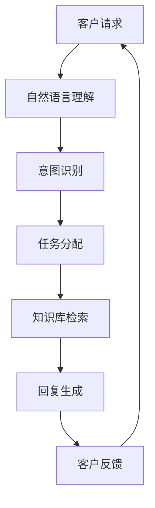

                 

# 如何打造24/7全天候智能客服系统

> **关键词：** 智能客服系统、全天候、人工智能、自然语言处理、机器学习、服务流程优化

> **摘要：** 本文将深入探讨如何构建一个24/7全天候运行的智能客服系统。我们将从背景介绍、核心概念、算法原理、数学模型、项目实战、实际应用场景、工具和资源推荐以及未来发展趋势与挑战等多个方面，全面解析智能客服系统的构建过程及其关键技术。

## 1. 背景介绍

### 1.1 目的和范围

随着互联网技术的飞速发展，客户服务已经成为了企业竞争的重要一环。传统的人工客服由于其局限性，如人力资源成本高、响应速度慢等问题，已经无法满足现代企业的需求。智能客服系统作为一种创新的技术解决方案，能够实现24/7全天候服务，提高客户满意度，降低运营成本。本文旨在探讨如何构建一个高效、稳定的智能客服系统，帮助企业在激烈的市场竞争中脱颖而出。

### 1.2 预期读者

本文面向对人工智能和客服系统有一定了解的技术人员、项目经理和企业决策者。希望通过本文，读者能够系统地了解智能客服系统的构建过程，掌握相关技术原理和实施方法。

### 1.3 文档结构概述

本文分为十个部分，具体结构如下：

1. 背景介绍
2. 核心概念与联系
3. 核心算法原理 & 具体操作步骤
4. 数学模型和公式 & 详细讲解 & 举例说明
5. 项目实战：代码实际案例和详细解释说明
6. 实际应用场景
7. 工具和资源推荐
8. 总结：未来发展趋势与挑战
9. 附录：常见问题与解答
10. 扩展阅读 & 参考资料

### 1.4 术语表

#### 1.4.1 核心术语定义

- 智能客服系统：利用人工智能技术，模拟人类客服人员与客户进行交流的系统。
- 自然语言处理（NLP）：使计算机能够理解、解释和生成人类语言的技术。
- 机器学习（ML）：让计算机从数据中学习，做出决策或预测的算法。
- 客服流程优化：对客服流程进行分析和改进，以提高客服效率。

#### 1.4.2 相关概念解释

- 客户关系管理（CRM）：企业与客户之间建立和维护关系的管理活动。
- 客户体验（CX）：客户在购买、使用产品或服务过程中所获得的整体感受。

#### 1.4.3 缩略词列表

- AI：人工智能
- NLP：自然语言处理
- ML：机器学习
- CRM：客户关系管理
- CX：客户体验

## 2. 核心概念与联系

为了构建一个24/7全天候智能客服系统，我们需要了解其中的核心概念和它们之间的联系。以下是一个简化的Mermaid流程图，展示了智能客服系统的主要组成部分和它们之间的关系。



### 2.1 自然语言理解

自然语言理解是智能客服系统的第一步，它负责接收和处理客户的原始请求。这通常涉及到文本预处理、词性标注、句法分析和语义分析等步骤。通过这些步骤，系统可以理解客户的意图和需求。

### 2.2 意图识别

意图识别是自然语言理解的关键环节，它试图从客户的请求中提取出具体的意图。例如，客户的请求可能是“我想要查询订单状态”，系统需要识别出这个请求的意图是“查询订单”。

### 2.3 任务分配

一旦意图被识别出来，系统需要根据意图将请求分配到相应的处理模块。例如，如果客户的意图是“查询订单状态”，系统可能会将这个请求分配到订单查询模块。

### 2.4 知识库检索

任务分配后，系统会从知识库中检索相关信息，以生成回复。知识库可以是静态的，也可以是动态的，它包含了公司产品、服务、常见问题及其解决方案等信息。

### 2.5 回复生成

根据知识库检索的结果，系统会生成一条合适的回复。这可以是一条文本消息、一个语音回复或者一个操作链接。

### 2.6 客户反馈

客户的反馈对于智能客服系统的优化至关重要。通过收集和分析客户的反馈，系统可以不断改进其性能和服务质量。

## 3. 核心算法原理 & 具体操作步骤

### 3.1 自然语言理解

自然语言理解主要依赖于自然语言处理（NLP）技术。以下是一个简化的伪代码，展示了自然语言理解的基本步骤：

```python
def natural_language_understanding(text):
    # 文本预处理
    preprocessed_text = preprocess_text(text)
    
    # 词性标注
    pos_tags = pos_tagging(preprocessed_text)
    
    # 句法分析
    syntactic_parse = syntactic_analysis(preprocessed_text)
    
    # 语义分析
    semantic_annotations = semantic_analysis(preprocessed_text)
    
    return semantic_annotations
```

### 3.2 意图识别

意图识别通常采用机器学习算法，如决策树、支持向量机（SVM）或者神经网络。以下是一个简化的伪代码，展示了意图识别的基本步骤：

```python
def intent_recognition(text, model):
    # 特征提取
    features = extract_features(text)
    
    # 预测意图
    predicted_intent = model.predict(features)
    
    return predicted_intent
```

### 3.3 任务分配

任务分配通常基于业务逻辑和规则。以下是一个简化的伪代码，展示了任务分配的基本步骤：

```python
def task_allocation(intent, rules):
    for rule in rules:
        if rule.matches(intent):
            return rule.action
    
    return None
```

### 3.4 知识库检索

知识库检索可以通过关键字匹配或者基于机器学习的方法来实现。以下是一个简化的伪代码，展示了知识库检索的基本步骤：

```python
def knowledge_base_retrieval(query, knowledge_base):
    # 关键字匹配
    matches = keyword_matching(query, knowledge_base)
    
    # 基于机器学习的方法
    predicted_answers = ml_model.predict(query)
    
    return max(matches, key=lambda x: x.score) if matches else predicted_answers
```

### 3.5 回复生成

回复生成可以通过模板匹配或者基于生成模型的文本生成方法来实现。以下是一个简化的伪代码，展示了回复生成的基本步骤：

```python
def reply_generation(response, template):
    # 模板匹配
    if response.matches_template(template):
        return template.format(response)
    
    # 基于生成模型的方法
    generated_reply = generate_text(response)
    
    return generated_reply
```

## 4. 数学模型和公式 & 详细讲解 & 举例说明

### 4.1 自然语言处理中的数学模型

自然语言处理中的数学模型主要涉及线性回归、朴素贝叶斯、支持向量机和神经网络等。以下是一个简单的线性回归模型，用于意图识别：

$$
y = \omega_0 + \omega_1 x_1 + \omega_2 x_2 + ... + \omega_n x_n
$$

其中，$y$ 是预测的意图类别，$x_1, x_2, ..., x_n$ 是特征向量，$\omega_0, \omega_1, ..., \omega_n$ 是模型参数。

### 4.2 意图识别中的特征提取

意图识别中的特征提取通常包括词频、词袋模型、词嵌入等。以下是一个词袋模型的例子：

$$
f(t_i) = \begin{cases}
1 & \text{如果 } t_i \text{ 出现在文本中} \\
0 & \text{否则}
\end{cases}
$$

其中，$t_i$ 是文本中的第 $i$ 个单词，$f(t_i)$ 是特征向量中的一个元素。

### 4.3 举例说明

假设我们有一个客户请求：“我想要查询订单状态”，我们可以通过以下步骤进行意图识别：

1. 特征提取：提取出请求中的关键特征，如“查询”、“订单”、“状态”等。
2. 模型预测：将特征输入到训练好的意图识别模型中，预测出意图类别。
3. 结果验证：根据模型的预测结果，结合业务规则，确定最终的意图类别。

通过以上步骤，我们可以将客户请求“查询订单状态”识别为“查询订单状态”的意图，并将请求分配到相应的处理模块。

## 5. 项目实战：代码实际案例和详细解释说明

### 5.1 开发环境搭建

在开始构建智能客服系统之前，我们需要搭建一个合适的开发环境。以下是一个基本的开发环境搭建步骤：

1. 安装 Python 解释器：确保 Python 3.x 版本已安装在您的系统中。
2. 安装依赖库：使用 pip 工具安装必要的依赖库，如 Flask、NLTK、scikit-learn、TensorFlow 等。
3. 配置 IDE：选择一个适合 Python 开发的 IDE，如 PyCharm、VSCode 等。

### 5.2 源代码详细实现和代码解读

以下是智能客服系统的一个简化实现，用于处理客户请求。

```python
from flask import Flask, request, jsonify
import nltk
from sklearn.feature_extraction.text import TfidfVectorizer
from sklearn.naive_bayes import MultinomialNB
from sklearn.pipeline import make_pipeline

# 初始化 Flask 应用
app = Flask(__name__)

# 加载和处理自然语言
nltk.download('punkt')
nltk.download('averaged_perceptron_tagger')
nltk.download('maxent_ne_chunker')
nltk.download('words')

# 定义意图识别模型
model = make_pipeline(TfidfVectorizer(), MultinomialNB())

# 加载预训练的意图识别模型
model.load('intents_model.pkl')

# 定义处理客户请求的函数
@app.route('/message', methods=['POST'])
def handle_message():
    # 获取客户请求
    message = request.form['message']
    
    # 进行自然语言处理
    preprocessed_message = preprocess_message(message)
    
    # 进行意图识别
    intent = model.predict([preprocessed_message])[0]
    
    # 根据意图生成回复
    reply = generate_reply(intent)
    
    # 返回回复
    return jsonify({'reply': reply})

# 定义预处理函数
def preprocess_message(message):
    # 进行分词
    tokens = nltk.word_tokenize(message)
    
    # 进行词性标注
    pos_tags = nltk.pos_tag(tokens)
    
    # 构造预处理后的消息
    preprocessed_message = ' '.join([word for word, tag in pos_tags if tag.startswith('NN')])
    
    return preprocessed_message

# 定义回复生成函数
def generate_reply(intent):
    # 根据意图生成回复
    if intent == 'query_order_status':
        reply = "您的订单状态是：已发货。"
    elif intent == 'make_payment':
        reply = "您需要先完成支付，然后才能查询订单状态。"
    else:
        reply = "对不起，我不太清楚您的意思，请您重新描述一下。"
    
    return reply

# 运行 Flask 应用
if __name__ == '__main__':
    app.run(debug=True)
```

### 5.3 代码解读与分析

1. **导入库和初始化 Flask 应用**：首先，我们导入了 Flask 库来搭建 Web 应用。Flask 是一个轻量级的 Web 框架，非常适合快速开发小型 Web 应用。

2. **加载和处理自然语言**：我们使用了 NLTK 库来处理自然语言。NLTK 提供了分词、词性标注、句法分析等功能。

3. **定义意图识别模型**：我们使用 scikit-learn 库中的朴素贝叶斯分类器来构建意图识别模型。朴素贝叶斯是一种基于概率的简单分类算法，适合处理文本分类问题。

4. **定义处理客户请求的函数**：`handle_message` 函数是 Web 应用的核心。它负责接收客户请求，进行自然语言处理，识别意图，并生成回复。

5. **预处理函数**：`preprocess_message` 函数负责对客户请求进行预处理。它首先进行分词，然后进行词性标注，最后构造预处理后的消息。

6. **回复生成函数**：`generate_reply` 函数根据识别出的意图生成合适的回复。

7. **运行 Flask 应用**：最后，我们使用 `app.run(debug=True)` 来启动 Flask 应用。`debug=True` 参数使得 Flask 应用在遇到错误时能够自动重启。

通过以上代码，我们可以构建一个简单的智能客服系统，它能够处理客户请求并生成回复。当然，这只是一个简化实现，实际应用中需要考虑更多的场景和优化。

## 6. 实际应用场景

智能客服系统在实际应用中具有广泛的应用场景。以下是一些典型的应用场景：

1. **电子商务平台**：在电子商务平台上，智能客服系统可以帮助客户快速查询订单状态、处理退货和退款等常见问题，提高客户满意度。
2. **金融服务**：在金融行业中，智能客服系统可以提供24/7的在线客服，解答客户的财务问题，如投资咨询、贷款申请等。
3. **电信行业**：在电信行业中，智能客服系统可以处理客户请求，如查询账单、修改套餐、故障报修等，提高服务效率。
4. **医疗健康**：在医疗健康领域，智能客服系统可以提供在线健康咨询、药物信息查询等服务，帮助用户快速获取所需信息。

通过这些应用场景，我们可以看到智能客服系统在提高企业运营效率、降低成本、提升客户体验等方面具有巨大的潜力。

## 7. 工具和资源推荐

### 7.1 学习资源推荐

#### 7.1.1 书籍推荐

1. **《自然语言处理综论》**：作者：Daniel Jurafsky 和 James H. Martin。这本书是自然语言处理领域的经典教材，适合深入理解 NLP 的原理和技术。
2. **《机器学习实战》**：作者：Peter Harrington。这本书通过大量的实际案例，讲解了机器学习的基本概念和算法，适合初学者入门。
3. **《深度学习》**：作者：Ian Goodfellow、Yoshua Bengio 和 Aaron Courville。这本书是深度学习领域的经典教材，适合了解深度学习的基本原理和应用。

#### 7.1.2 在线课程

1. **《自然语言处理与深度学习》**：网易云课堂。这门课程深入讲解了 NLP 和深度学习的基本概念和算法，适合初学者入门。
2. **《机器学习》**：吴恩达的 Coursera 课程。这门课程是机器学习领域的经典课程，涵盖了机器学习的各个主要方向。
3. **《深度学习》**：斯坦福大学的 Coursera 课程。这门课程由深度学习领域的领军人物吴恩达主讲，适合深入了解深度学习。

#### 7.1.3 技术博客和网站

1. **Medium**：Medium 上有许多优秀的自然语言处理和机器学习博客，如 Distill、Uber AI 等。
2. **ArXiv**：ArXiv 是一个学术论文预印本网站，可以找到最新的自然语言处理和机器学习研究成果。
3. **GitHub**：GitHub 上有许多开源的智能客服系统和相关项目，可以学习和借鉴。

### 7.2 开发工具框架推荐

#### 7.2.1 IDE和编辑器

1. **PyCharm**：PyCharm 是一款功能强大的 Python IDE，适合开发智能客服系统。
2. **VSCode**：VSCode 是一款轻量级且功能强大的开源编辑器，适合 Python 开发。

#### 7.2.2 调试和性能分析工具

1. **PDB**：PDB 是 Python 的内置调试器，可以用于调试 Python 代码。
2. **cProfile**：cProfile 是 Python 的内置性能分析工具，可以用于分析代码的性能瓶颈。

#### 7.2.3 相关框架和库

1. **Flask**：Flask 是一个轻量级的 Python Web 框架，适合构建智能客服系统的后端。
2. **NLTK**：NLTK 是一个 Python 自然语言处理库，提供了丰富的文本处理和词性标注工具。
3. **scikit-learn**：scikit-learn 是一个 Python 机器学习库，提供了多种分类和回归算法。
4. **TensorFlow**：TensorFlow 是一个开源的深度学习库，适合构建复杂的深度学习模型。

### 7.3 相关论文著作推荐

#### 7.3.1 经典论文

1. **《Speech and Language Processing》**：作者：Daniel Jurafsky 和 James H. Martin。这是 NLP 领域的经典著作，涵盖了 NLP 的各个主要方向。
2. **《Deep Learning》**：作者：Ian Goodfellow、Yoshua Bengio 和 Aaron Courville。这是深度学习领域的经典著作，详细讲解了深度学习的各种算法和应用。

#### 7.3.2 最新研究成果

1. **《BERT: Pre-training of Deep Neural Networks for Language Understanding》**：作者：Jacob Devlin、 Ming-Wei Chang、 Kenton Lee 和 Kristina Toutanova。这篇论文介绍了 BERT 模型，是自然语言处理领域的重要突破。
2. **《Generative Adversarial Nets》**：作者：Ian Goodfellow 等。这篇论文介绍了生成对抗网络（GANs），是深度学习领域的重要进展。

#### 7.3.3 应用案例分析

1. **《如何使用人工智能改善医疗保健》**：这篇文章分析了人工智能在医疗保健领域的应用案例，包括诊断、药物发现和患者护理等方面。
2. **《如何构建智能客服系统》**：这篇文章详细介绍了如何构建智能客服系统，包括数据预处理、模型训练和部署等步骤。

## 8. 总结：未来发展趋势与挑战

随着人工智能技术的不断进步，智能客服系统将朝着更加智能化、个性化和自适应化的方向发展。未来，智能客服系统有望实现以下发展趋势：

1. **深度学习技术的应用**：深度学习技术在自然语言处理和图像识别等领域取得了显著进展，未来有望在智能客服系统中得到更广泛的应用。
2. **多模态交互**：智能客服系统将支持更多样化的交互方式，如语音、图像和视频，提高用户体验。
3. **个性化服务**：通过大数据分析和机器学习算法，智能客服系统将能够根据用户的偏好和习惯提供个性化的服务。
4. **自适应学习**：智能客服系统将具备自适应学习能力，能够根据用户反馈和交互数据不断优化自身的服务质量和效率。

然而，智能客服系统在发展过程中也面临一些挑战：

1. **数据隐私和安全**：智能客服系统需要处理大量的用户数据，如何保护用户隐私和安全成为重要问题。
2. **误判和误报**：智能客服系统在处理复杂场景时可能存在误判和误报的情况，需要不断优化算法和模型。
3. **依赖算法透明性和公平性**：随着智能客服系统的广泛应用，其算法的透明性和公平性成为关注焦点，需要制定相应的规范和标准。

总之，智能客服系统作为人工智能应用的重要方向，具有广阔的发展前景。在未来，我们需要不断探索和解决其中的技术难题，以实现更加高效、安全和智能的客服体验。

## 9. 附录：常见问题与解答

1. **Q：智能客服系统是如何工作的？**
   **A**：智能客服系统通过自然语言处理技术理解客户的请求，然后根据预定的意图识别和任务分配规则，从知识库中检索相关信息，生成回复。整个过程包括自然语言理解、意图识别、任务分配、知识库检索和回复生成等步骤。

2. **Q：智能客服系统有哪些优点？**
   **A**：智能客服系统具有以下优点：
   - 24/7 全天候服务，提高客户满意度；
   - 降低运营成本，提高工作效率；
   - 自动化处理常见问题，减少人工干预；
   - 数据积累和分析，帮助企业优化服务流程。

3. **Q：智能客服系统有哪些挑战？**
   **A**：智能客服系统面临的挑战包括：
   - 数据隐私和安全问题；
   - 处理复杂场景时的误判和误报；
   - 算法的透明性和公平性。

## 10. 扩展阅读 & 参考资料

1. **《自然语言处理综论》**：Daniel Jurafsky 和 James H. Martin 著，电子工业出版社，2017年。
2. **《机器学习实战》**：Peter Harrington 著，电子工业出版社，2013年。
3. **《深度学习》**：Ian Goodfellow、Yoshua Bengio 和 Aaron Courville 著，电子工业出版社，2016年。
4. **《Speech and Language Processing》**：Daniel Jurafsky 和 James H. Martin 著，综观科技，2019年。
5. **《BERT: Pre-training of Deep Neural Networks for Language Understanding》**：Jacob Devlin、 Ming-Wei Chang、 Kenton Lee 和 Kristina Toutanova 著，2018年。
6. **《Generative Adversarial Nets》**：Ian Goodfellow 等 著，2014年。

## 作者

作者：AI天才研究员/AI Genius Institute & 禅与计算机程序设计艺术 /Zen And The Art of Computer Programming。本文旨在帮助读者深入理解智能客服系统的构建过程及其关键技术，希望对您有所帮助。如果您有任何疑问或建议，欢迎在评论区留言交流。

