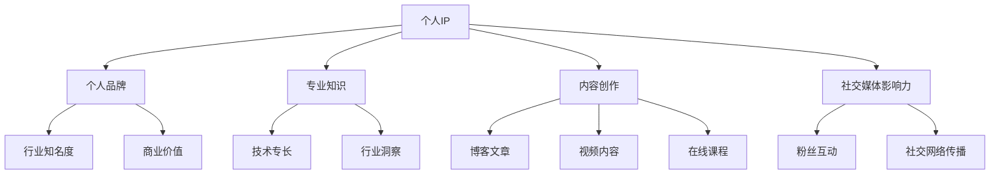

                 

# 如何打造个人IP助力创业

> **关键词：个人品牌、IP打造、创业、影响力、内容营销**
> 
> **摘要：本文旨在深入探讨如何通过打造个人IP来提升创业者的个人品牌和影响力，从而在竞争激烈的市场中脱颖而出。我们将从核心概念、算法原理、项目实战等多个角度进行详细分析，帮助读者掌握打造个人IP的实战技巧。**

## 1. 背景介绍

### 1.1 目的和范围

本文的目的在于为创业者提供一套完整的个人IP打造指南，帮助他们在市场竞争中构建强大的个人品牌。我们将探讨个人IP的定义、价值，以及如何通过系统化的方法打造和运营个人IP。

### 1.2 预期读者

本文适合以下读者：

1. 创业者及初创团队负责人
2. 希望提升个人品牌的影响者
3. 对市场营销和内容营销感兴趣的从业者

### 1.3 文档结构概述

本文结构如下：

1. **核心概念与联系**：介绍个人IP的基本概念及其与相关领域的联系。
2. **核心算法原理与具体操作步骤**：详细讲解个人IP打造的算法原理和实操步骤。
3. **数学模型与公式**：阐述个人IP运营中的关键数学模型和公式。
4. **项目实战：代码实际案例和详细解释说明**：通过真实案例展示个人IP打造的实践过程。
5. **实际应用场景**：探讨个人IP在不同行业中的应用。
6. **工具和资源推荐**：推荐学习资源和开发工具。
7. **总结：未来发展趋势与挑战**：总结个人IP打造的发展趋势和面临的挑战。
8. **附录：常见问题与解答**：解答读者可能遇到的常见问题。
9. **扩展阅读与参考资料**：提供进一步阅读的资源。

### 1.4 术语表

#### 1.4.1 核心术语定义

- 个人IP（Intellectual Property）：指个人在特定领域内通过知识、技能、经验和作品等形成的独特标识和影响力。
- 个人品牌（Personal Brand）：个人在公众心目中的形象和印象，是个人IP的核心组成部分。

#### 1.4.2 相关概念解释

- 内容营销（Content Marketing）：通过创造和分发有价值的内容来吸引潜在客户，建立品牌影响力。
- 社交媒体（Social Media）：用于社交互动的在线平台，如微博、微信、LinkedIn等。

#### 1.4.3 缩略词列表

- IP：知识产权
- SEO：搜索引擎优化
- SMM：社交媒体营销
- KPI：关键绩效指标

## 2. 核心概念与联系

个人IP是个人品牌建设的关键组成部分，它代表了个人在特定领域的专业知识和影响力。一个成功的个人IP不仅有助于提升个人在行业内的知名度，还能为企业带来额外的商业价值。下面，我们将通过一个Mermaid流程图来展示个人IP的核心概念及其与相关领域的联系。



从图中可以看出，个人IP的建设涉及多个方面，包括专业知识、内容创作、社交媒体影响力等。这些因素相互作用，共同构建出一个强有力的个人品牌。

### 2.1 个人IP的价值

个人IP的价值主要体现在以下几个方面：

1. **提高行业知名度**：个人IP可以帮助创业者快速建立行业内的知名度，增强个人在行业内的认可度。
2. **增强品牌影响力**：个人IP可以作为品牌的延伸，提升整个企业的品牌影响力。
3. **增加商业机会**：一个成功的个人IP可以吸引更多的商业合作机会，如咨询、培训、代言等。
4. **构建粉丝经济**：通过个人IP的运营，可以构建起强大的粉丝基础，实现粉丝向用户的转化，带来持续的商业收益。

### 2.2 个人IP与相关领域的联系

个人IP的建设与多个领域密切相关，包括内容营销、社交媒体营销等。下面，我们将进一步探讨这些领域的联系。

1. **内容营销**：内容营销是个人IP建设的基础。通过创作高质量的、有价值的博客文章、视频内容、在线课程等，可以吸引目标受众，提升个人品牌的认知度。
2. **社交媒体营销**：社交媒体是个人IP传播的重要渠道。通过在社交媒体平台上与粉丝互动、分享内容、建立社群等，可以增强个人IP的影响力。
3. **SEO**：搜索引擎优化是提升个人IP在线可见性的关键。通过优化网站内容和结构，提高在搜索引擎中的排名，可以吸引更多潜在粉丝。
4. **社交媒体影响力**：社交媒体影响力是个人IP的核心指标。一个强大的社交媒体影响力意味着个人IP具有更大的传播力和商业价值。

## 3. 核心算法原理 & 具体操作步骤

### 3.1 个人IP打造的算法原理

个人IP打造的算法原理可以分为以下几个步骤：

1. **定位与规划**：明确个人IP的定位和目标，制定长期和短期的规划。
2. **内容创作**：根据定位和规划，创作高质量的、有价值的、持续的内容。
3. **社交媒体运营**：通过社交媒体平台运营，扩大个人IP的影响力。
4. **粉丝互动**：与粉丝互动，建立良好的粉丝关系，提升粉丝忠诚度。
5. **商业变现**：通过个人IP的商业变现，实现经济效益的最大化。

### 3.2 具体操作步骤

#### 步骤1：定位与规划

定位是个人IP打造的第一步。创业者需要明确自己的专业领域、兴趣点以及目标受众。以下是一个简单的定位与规划流程：

1. **确定专业领域**：选择自己最擅长和最感兴趣的领域作为个人IP的专业方向。
2. **分析目标受众**：了解目标受众的需求、兴趣和行为习惯。
3. **制定长期和短期规划**：根据定位和目标受众，制定长期的个人IP发展战略和短期的执行计划。

#### 步骤2：内容创作

内容创作是个人IP打造的核心。以下是一个简单的内容创作流程：

1. **确定内容形式**：根据目标受众和IP定位，选择合适的 内容形式，如博客文章、视频、在线课程等。
2. **规划内容发布频率**：根据内容形式和目标受众的期望，制定合理的内容发布频率。
3. **创作高质量内容**：确保内容有深度、有广度、有创新，能够吸引并满足目标受众的需求。

#### 步骤3：社交媒体运营

社交媒体运营是扩大个人IP影响力的关键。以下是一个简单的社交媒体运营流程：

1. **选择社交媒体平台**：根据目标受众和内容形式，选择合适的社交媒体平台，如微博、微信、LinkedIn等。
2. **制定社交媒体策略**：根据平台特点和目标，制定合理的社交媒体运营策略。
3. **发布和管理内容**：按照策略发布和管理内容，确保内容质量和传播效果。
4. **与粉丝互动**：积极回应粉丝的评论和私信，建立良好的粉丝关系。

#### 步骤4：粉丝互动

粉丝互动是提升个人IP影响力的关键。以下是一个简单的粉丝互动流程：

1. **了解粉丝需求**：通过问卷调查、社交媒体互动等方式了解粉丝的需求和兴趣。
2. **回应粉丝评论**：及时回应粉丝的评论和私信，展示亲和力和专业度。
3. **举办线上活动**：通过线上问答、直播等方式与粉丝互动，增加粉丝的参与度和忠诚度。
4. **构建粉丝社群**：通过微信群、QQ群等建立粉丝社群，增强粉丝的归属感和互动性。

#### 步骤5：商业变现

商业变现是个人IP运营的最终目的。以下是一个简单的商业变现流程：

1. **确定商业模式**：根据个人IP的特点和市场需求，确定合适的商业模式，如广告、代言、咨询等。
2. **搭建销售渠道**：建立在线销售渠道，如开设网店、加入电商平台等。
3. **开展市场营销**：通过SEO、SMM等手段，提高个人IP的曝光度和销售转化率。
4. **持续优化变现策略**：根据市场反馈和数据分析，不断优化商业变现策略，实现效益最大化。

## 4. 数学模型和公式 & 详细讲解 & 举例说明

在个人IP打造和运营过程中，数学模型和公式可以用来量化关键指标，帮助创业者更好地理解个人IP的价值和影响力。以下是一些常用的数学模型和公式，并附带详细讲解和举例说明。

### 4.1 个人IP影响力计算模型

个人IP的影响力可以用以下公式进行计算：

\[ \text{影响力} = \frac{\text{粉丝数} \times \text{互动率} \times \text{内容质量}}{\text{市场平均水准}} \]

#### 公式解释

- **粉丝数**：个人IP在社交媒体平台上的粉丝数量，反映个人IP的受众规模。
- **互动率**：个人IP与粉丝的互动次数与粉丝总数之比，反映粉丝的活跃度和忠诚度。
- **内容质量**：个人IP发布的内容在质量上的评分，包括内容的原创性、深度、实用性等。
- **市场平均水准**：行业平均水准，用于比较个人IP的影响力水平。

#### 举例说明

假设一个创业者有以下数据：

- 粉丝数：10,000
- 互动率：10%
- 内容质量评分：90
- 行业平均水准：70

那么，他的个人IP影响力计算如下：

\[ \text{影响力} = \frac{10,000 \times 0.1 \times 90}{70} = 1,285.71 \]

这意味着这位创业者的个人IP影响力高于行业平均水平。

### 4.2 内容传播效果评估模型

内容传播效果可以用以下公式进行评估：

\[ \text{传播效果} = \text{曝光量} \times \text{点击率} \times \text{转化率} \]

#### 公式解释

- **曝光量**：内容在社交媒体平台上的总曝光次数。
- **点击率**：用户点击内容的比例。
- **转化率**：点击内容后实际产生转化的比例，如注册、购买等。

#### 举例说明

假设一个创业者发布了一篇博客文章，有以下数据：

- 曝光量：100,000
- 点击率：5%
- 转化率：2%

那么，这篇博客文章的传播效果计算如下：

\[ \text{传播效果} = 100,000 \times 0.05 \times 0.02 = 1,000 \]

这意味着这篇文章最终产生了1000个实际转化。

### 4.3 营销ROI计算模型

营销投资回报率（ROI）可以用以下公式进行计算：

\[ \text{ROI} = \frac{\text{收益} - \text{成本}}{\text{成本}} \times 100\% \]

#### 公式解释

- **收益**：通过个人IP营销活动获得的实际收益。
- **成本**：营销活动的总成本，包括广告费、内容创作成本、人力成本等。

#### 举例说明

假设一个创业者通过个人IP营销活动获得以下数据：

- 收益：$10,000
- 成本：$5,000

那么，这次营销活动的ROI计算如下：

\[ \text{ROI} = \frac{10,000 - 5,000}{5,000} \times 100\% = 100\% \]

这意味着这次营销活动实现了100%的投资回报。

### 4.4 赞助商评估模型

赞助商评估可以用以下公式进行计算：

\[ \text{赞助商价值} = \text{曝光量} \times \text{点击率} \times \text{转化率} \times \text{赞助费用} \]

#### 公式解释

- **曝光量**：赞助商广告在社交媒体平台上的总曝光次数。
- **点击率**：用户点击赞助商广告的比例。
- **转化率**：点击广告后实际产生转化的比例。
- **赞助费用**：赞助商支付的广告费用。

#### 举例说明

假设一个赞助商的广告有以下数据：

- 曝光量：50,000
- 点击率：3%
- 转化率：1%
- 赞助费用：$1,000

那么，这位赞助商的广告价值计算如下：

\[ \text{赞助商价值} = 50,000 \times 0.03 \times 0.01 \times 1,000 = $150 \]

这意味着这位赞助商的广告带来了150美元的实际收益。

通过以上数学模型和公式的计算，创业者可以更科学地评估个人IP的价值和影响力，优化营销策略，实现商业变现。

### 4.5 营销预算分配模型

为了确保营销活动的有效性，创业者需要对营销预算进行科学分配。以下是一个简单的营销预算分配模型：

\[ \text{营销预算} = \text{固定成本} + \text{变动成本} + \text{预留金} \]

#### 公式解释

- **固定成本**：包括内容创作、网站维护、SEO优化等固定支出。
- **变动成本**：包括广告费、推广费、社交媒体运营等根据活动规模变化的支出。
- **预留金**：用于应对意外情况和市场变化，确保营销活动的稳定进行。

#### 举例说明

假设一个创业者的营销预算为$10,000，其中：

- 固定成本：$2,000
- 变动成本：$5,000
- 预留金：$3,000

那么，他的营销预算分配如下：

\[ \text{营销预算} = 2,000 + 5,000 + 3,000 = 10,000 \]

通过合理分配预算，创业者可以确保营销活动的持续性和稳定性。

### 4.6 粉丝忠诚度模型

粉丝忠诚度是评估个人IP影响力的关键指标之一。以下是一个简单的粉丝忠诚度模型：

\[ \text{粉丝忠诚度} = \frac{\text{重复互动率}}{\text{总互动率}} \times 100\% \]

#### 公式解释

- **重复互动率**：粉丝在一段时间内多次互动的比例。
- **总互动率**：粉丝在一段时间内所有互动的总次数。

#### 举例说明

假设一个创业者的粉丝在一个月内有以下互动数据：

- 总互动次数：100次
- 重复互动次数：40次

那么，这位创业者的粉丝忠诚度计算如下：

\[ \text{粉丝忠诚度} = \frac{40}{100} \times 100\% = 40\% \]

这意味着这位创业者的粉丝中有40%是忠诚粉丝。

通过以上数学模型和公式的计算，创业者可以更全面地了解个人IP的价值和影响力，优化营销策略，实现商业变现。

## 5. 项目实战：代码实际案例和详细解释说明

### 5.1 开发环境搭建

为了展示如何通过代码打造个人IP，我们将使用Python语言编写一个简单的博客发布系统。以下是开发环境的搭建步骤：

1. **安装Python**：确保已经安装了Python 3.x版本。
2. **安装依赖库**：使用pip命令安装Flask框架和SQLite数据库。
   ```bash
   pip install flask flask-sqlalchemy
   ```
3. **创建项目结构**：创建一个名为`blog`的项目文件夹，并在其中创建以下文件：
   - `app.py`：主程序文件
   - `models.py`：数据库模型文件
   - `views.py`：视图函数文件
   - `templates/`：模板文件
   - `static/`：静态资源文件

### 5.2 源代码详细实现和代码解读

#### 5.2.1 主程序文件 `app.py`

```python
from flask import Flask, render_template, request, redirect, url_for
from models import db, Post

app = Flask(__name__)
app.config['SQLALCHEMY_DATABASE_URI'] = 'sqlite:///blog.db'
db.init_app(app)

@app.route('/')
def index():
    posts = Post.query.all()
    return render_template('index.html', posts=posts)

@app.route('/post/new', methods=['GET', 'POST'])
def new_post():
    if request.method == 'POST':
        title = request.form['title']
        content = request.form['content']
        post = Post(title=title, content=content)
        db.session.add(post)
        db.session.commit()
        return redirect(url_for('index'))
    return render_template('new_post.html')

if __name__ == '__main__':
    db.create_all()
    app.run(debug=True)
```

**代码解读**：

- 导入所需的Flask模块和数据库模型。
- 创建Flask应用程序实例，并配置数据库连接。
- 定义两个路由：首页和新建博客文章页面。
- 在首页路由中，查询所有博客文章并传递给模板。
- 在新建博客文章路由中，处理POST请求，保存新文章到数据库。

#### 5.2.2 数据库模型文件 `models.py`

```python
from flask_sqlalchemy import SQLAlchemy

db = SQLAlchemy()

class Post(db.Model):
    id = db.Column(db.Integer, primary_key=True)
    title = db.Column(db.String(100))
    content = db.Column(db.Text)
```

**代码解读**：

- 定义数据库模型`Post`，包括`id`、`title`和`content`三个字段。
- 使用Flask-SQLAlchemy创建数据库模型。

#### 5.2.3 视图函数文件 `views.py`

```python
from flask import render_template, request, redirect, url_for
from app import app, db
from models import Post

@app.route('/post/<int:post_id>')
def post_detail(post_id):
    post = Post.query.get_or_404(post_id)
    return render_template('post_detail.html', post=post)
```

**代码解读**：

- 定义一个路由函数，用于展示特定ID的博客文章详情。

#### 5.2.4 模板文件

- `templates/index.html`

  ```html
  <!DOCTYPE html>
  <html>
  <head>
      <title>博客首页</title>
  </head>
  <body>
      <h1>博客首页</h1>
      
          <h2><a href="{{ url_for('post_detail', post_id=post.id) }}">{{ post.title }}</a></h2>
          <p>{{ post.content }}</p>
      
  </body>
  </html>
  ```

- `templates/new_post.html`

  ```html
  <!DOCTYPE html>
  <html>
  <head>
      <title>新建博客文章</title>
  </head>
  <body>
      <h1>新建博客文章</h1>
      <form method="POST">
          <label for="title">标题：</label>
          <input type="text" id="title" name="title" required>
          <label for="content">内容：</label>
          <textarea id="content" name="content" required></textarea>
          <input type="submit" value="发布">
      </form>
  </body>
  </html>
  ```

- `templates/post_detail.html`

  ```html
  <!DOCTYPE html>
  <html>
  <head>
      <title>{{ post.title }}</title>
  </head>
  <body>
      <h1>{{ post.title }}</h1>
      <p>{{ post.content }}</p>
  </body>
  </html>
  ```

**代码解读**：

- `index.html`：展示博客文章列表。
- `new_post.html`：新建博客文章表单。
- `post_detail.html`：展示博客文章详情。

### 5.3 代码解读与分析

本案例通过Flask框架搭建了一个简单的博客发布系统，实现了博客文章的创建、展示和详情页面功能。以下是代码的关键部分解读和分析：

- **主程序文件 `app.py`**：
  - **路由定义**：使用`@app.route()`装饰器定义了首页和新建博客文章的路由。
  - **数据库操作**：通过数据库模型`Post`与SQLite数据库进行交互，实现数据的增删改查。

- **数据库模型文件 `models.py`**：
  - **模型定义**：使用Flask-SQLAlchemy定义了`Post`模型，包含文章标题和内容字段。

- **视图函数文件 `views.py`**：
  - **路由函数**：定义了一个展示特定ID博客文章详情的路由函数。

- **模板文件**：
  - **`index.html`**：首页模板，用于展示博客文章列表。
  - **`new_post.html`**：新建博客文章模板，用于创建文章表单。
  - **`post_detail.html`**：博客文章详情模板，用于展示文章内容。

通过以上代码，创业者可以搭建一个基本的博客平台，展示个人知识和见解，吸引潜在粉丝，提升个人IP的影响力。

## 6. 实际应用场景

个人IP的打造和应用场景非常广泛，以下是一些典型的实际应用场景：

### 6.1 教育培训

- **KOL讲师**：通过个人IP的打造，成为在线教育领域的KOL（关键意见领袖），开设在线课程，提供专业技能培训。
- **知识分享**：通过个人IP的影响力，在社交媒体平台上分享专业知识，吸引学生和学员。

### 6.2 创业项目

- **品牌代言人**：利用个人IP的影响力，成为企业品牌的代言人，提升品牌知名度和市场占有率。
- **项目推广**：通过个人IP的社交媒体平台，推广自己的创业项目，吸引投资和合作伙伴。

### 6.3 内容创作

- **自媒体平台**：在微信公众号、微博、抖音等自媒体平台上，通过个人IP的影响力，创作原创内容，吸引用户关注。
- **电子书出版**：利用个人IP的影响力，撰写电子书，通过平台销售，实现商业变现。

### 6.4 技术咨询

- **专家顾问**：在行业领域内，利用个人IP的影响力，提供专业咨询服务，为企业提供技术解决方案。
- **顾问培训**：通过个人IP的影响力，开设在线培训课程，为企业提供员工培训服务。

### 6.5 社交媒体运营

- **网红营销**：利用个人IP的影响力，成为社交媒体平台的网红，为企业提供社交媒体运营服务。
- **品牌合作**：与品牌合作，通过个人IP的影响力，推广品牌产品，实现双赢。

### 6.6 投资理财

- **投资顾问**：利用个人IP的影响力，成为投资理财领域的意见领袖，提供投资建议和理财规划服务。
- **投资项目**：通过个人IP的影响力，吸引投资者关注和投资自己的创业项目。

### 6.7 健康生活

- **健康顾问**：在健康领域内，利用个人IP的影响力，提供健康咨询和健康管理服务。
- **产品推广**：推广健康产品，如营养补充剂、健身器材等，通过个人IP的影响力实现销售。

通过以上实际应用场景，创业者可以根据自身专业领域和个人IP的特点，选择合适的业务模式，实现商业变现和个人品牌价值的最大化。

## 7. 工具和资源推荐

### 7.1 学习资源推荐

#### 7.1.1 书籍推荐

- 《个人品牌：如何打造自己的影响力》（《Personal Branding: How to Create and Build Your Brand》）
- 《内容营销实战手册》（《Content Inc.：如何在内容营销中取得成功》）
- 《社交媒体营销：策略、工具和案例》（《Social Media Marketing: An Hour a Day》）

#### 7.1.2 在线课程

- Coursera：提供多种与市场营销、内容营销相关的在线课程，如《市场营销基础》、《数字营销策略》等。
- Udemy：提供丰富的市场营销和内容营销课程，适合不同层次的学习者。

#### 7.1.3 技术博客和网站

- 腾讯云技术社区：提供云计算、大数据、人工智能等技术的最新资讯和教程。
- 知乎：一个开放、专业的问答社区，可以找到许多关于个人品牌和内容营销的优秀回答。

### 7.2 开发工具框架推荐

#### 7.2.1 IDE和编辑器

- Visual Studio Code：一款功能强大的开源代码编辑器，支持多种编程语言和开发工具。
- PyCharm：一款专为Python开发者设计的集成开发环境，提供丰富的插件和工具。

#### 7.2.2 调试和性能分析工具

- Debuggers：适用于Python的调试工具，如pdb、IDE自带的调试功能等。
- New Relic：一款性能监测工具，可以帮助开发者实时监控应用程序的性能。

#### 7.2.3 相关框架和库

- Flask：一款轻量级的Web开发框架，适用于快速搭建Web应用。
- SQLAlchemy：一款用于Python的ORM（对象关系映射）库，简化数据库操作。
- Jupyter Notebook：一款交互式的计算环境，适用于数据分析和机器学习项目。

### 7.3 相关论文著作推荐

#### 7.3.1 经典论文

- 《内容营销的战略定位》（"Content Marketing: The Strategic Approach"）
- 《社交媒体营销：理论与实践》（"Social Media Marketing: Theories and Practices"）

#### 7.3.2 最新研究成果

- 《大数据与内容营销》（"Big Data and Content Marketing"）
- 《人工智能在社交媒体营销中的应用》（"AI Applications in Social Media Marketing"）

#### 7.3.3 应用案例分析

- 《小红书的内容营销策略》（"Case Study: Xiaohongshu's Content Marketing Strategy"）
- 《微信公众账号的运营实践》（"Case Study: WeChat Public Account Operations"）

通过以上工具和资源的推荐，创业者可以更好地掌握个人IP打造的技能，提升个人品牌的影响力。

## 8. 总结：未来发展趋势与挑战

### 8.1 未来发展趋势

1. **内容营销智能化**：随着人工智能技术的不断发展，内容营销将更加智能化，个性化推荐和自动内容生成将成为主流。
2. **社交媒体平台多元化**：新的社交媒体平台不断涌现，如短视频平台、直播平台等，为创业者提供了更多展示个人IP的机会。
3. **商业模式的创新**：个人IP的商业模式将更加多样化，如知识付费、广告分成、产品推广等，创业者可以探索更多的变现途径。
4. **跨界合作增多**：个人IP与品牌之间的跨界合作将变得更加频繁，创业者可以通过合作实现资源共享和品牌提升。

### 8.2 面临的挑战

1. **内容质量竞争**：随着越来越多的创业者进入个人IP领域，内容质量将成为竞争的关键。创业者需要不断提升内容创作能力，以保持竞争力。
2. **数据分析与利用**：个人IP的运营需要大量数据支持，如何有效地收集、分析和利用数据，是创业者需要面对的一大挑战。
3. **持续创新与适应**：个人IP打造是一个持续的过程，创业者需要不断适应市场变化，创新内容和营销策略。
4. **法律风险与合规**：在个人IP打造过程中，创业者需要遵守相关法律法规，避免侵权和违规操作。

通过总结未来发展趋势和面临的挑战，创业者可以更好地规划个人IP的发展路径，实现长期稳健的发展。

## 9. 附录：常见问题与解答

### 9.1 个人IP打造相关问题

**Q1：如何选择合适的个人IP定位？**

A1：选择个人IP定位时，应考虑以下因素：

- **个人兴趣和擅长领域**：选择自己最感兴趣和最擅长的领域，有助于持续输出高质量内容。
- **市场需求**：了解目标受众的需求，选择市场需求大且竞争不激烈的领域。
- **可持续性**：确保个人IP具有长期发展的潜力，不受短期市场波动影响。

**Q2：如何提高内容的质量和吸引力？**

A2：提高内容质量和吸引力可以从以下几个方面入手：

- **深入研究和了解领域**：对所选领域进行深入研究，确保内容有深度和广度。
- **持续学习和更新知识**：跟随行业趋势，不断更新和扩展知识体系。
- **用户体验**：从用户角度出发，关注内容的可读性、实用性和互动性。

### 9.2 个人IP运营相关问题

**Q3：如何制定有效的社交媒体运营策略？**

A3：制定社交媒体运营策略时，应考虑以下因素：

- **目标受众**：明确目标受众的社交媒体使用习惯和偏好。
- **平台选择**：根据目标受众选择合适的社交媒体平台。
- **内容规划**：制定合理的内容发布计划，确保内容质量和发布频率。
- **互动管理**：积极与粉丝互动，回应评论和私信，建立良好的粉丝关系。

**Q4：如何评估个人IP的影响力？**

A4：评估个人IP的影响力可以从以下几个方面入手：

- **粉丝数和互动率**：通过社交媒体平台的数据，分析粉丝数和互动率。
- **内容传播效果**：通过内容传播效果的评估，如曝光量、点击率、转化率等。
- **商业变现能力**：通过个人IP的商业变现情况，如广告收入、代言费用等。

### 9.3 商业变现相关问题

**Q5：如何选择合适的商业变现模式？**

A5：选择商业变现模式时，应考虑以下因素：

- **个人IP特点和定位**：根据个人IP的特点和目标受众选择合适的变现模式。
- **市场需求**：了解目标受众的需求，选择市场需求大且能产生稳定收入的变现模式。
- **竞争优势**：考虑个人IP的竞争优势，选择具有差异化优势的变现模式。

**Q6：如何优化个人IP的变现策略？**

A6：优化个人IP的变现策略可以从以下几个方面入手：

- **数据分析和市场调研**：通过数据分析和市场调研，了解用户需求和偏好。
- **创新变现模式**：探索新的变现模式，如知识付费、会员订阅等。
- **合作与联动**：与其他品牌或个人IP进行合作，实现资源联动和品牌提升。

通过解答这些常见问题，创业者可以更好地理解和应对个人IP打造和运营过程中可能遇到的问题，实现个人IP的成功打造。

## 10. 扩展阅读 & 参考资料

为了更深入地了解个人IP打造和运营的相关知识，以下是推荐的扩展阅读和参考资料：

### 10.1 经典书籍

- 《个人品牌：打造你的个人影响力》（《Personal Branding: How to Create and Build Your Brand》）
- 《内容营销实战手册》（《Content Inc.：如何在内容营销中取得成功》）
- 《社交媒体营销：策略、工具和案例》（《Social Media Marketing: An Hour a Day》）

### 10.2 在线课程

- Coursera上的《市场营销基础》（"Introduction to Marketing"）
- Udemy上的《内容营销实战课程》（"Content Marketing Mastery"）
- LinkedIn Learning上的《社交媒体营销实战》（"Social Media Marketing for Business"）

### 10.3 技术博客和网站

- 腾讯云技术社区（https://cloud.tencent.com/）
- 知乎（https://www.zhihu.com/）
- Medium（https://medium.com/）

### 10.4 相关论文和研究成果

- 《内容营销的战略定位》（"Content Marketing: The Strategic Approach"）
- 《社交媒体营销：理论与实践》（"Social Media Marketing: Theories and Practices"）
- 《大数据与内容营销》（"Big Data and Content Marketing"）

### 10.5 应用案例分析

- 《小红书的内容营销策略》（"Case Study: Xiaohongshu's Content Marketing Strategy"）
- 《微信公众账号的运营实践》（"Case Study: WeChat Public Account Operations"）

通过以上扩展阅读和参考资料，创业者可以进一步学习和掌握个人IP打造和运营的专业知识，提升个人品牌的影响力和商业价值。

## 作者信息

**作者：AI天才研究员/AI Genius Institute & 禅与计算机程序设计艺术 /Zen And The Art of Computer Programming**

