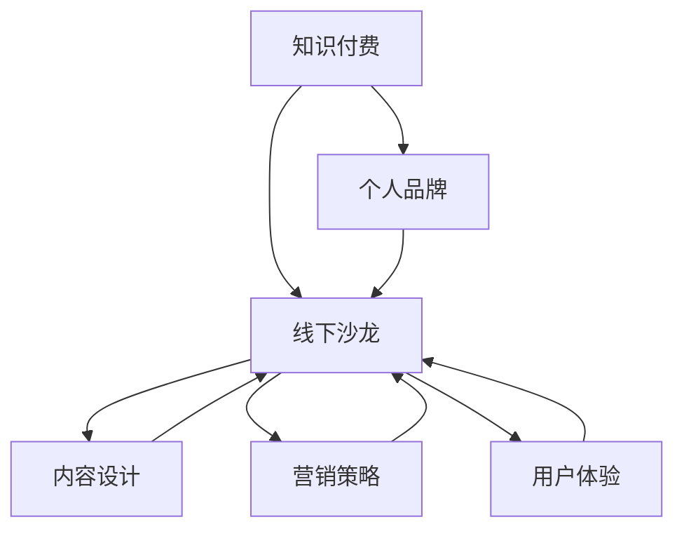

                 

# 如何打造个人知识付费线下沙龙

> **关键词**：知识付费、线下沙龙、个人品牌、内容设计、营销策略、用户体验、技术实践

> **摘要**：本文将详细解析如何打造个人知识付费线下沙龙，从目标设定、内容设计、用户体验、营销策略到技术实践，提供一套完整的解决方案。通过本文的指导，您将能够打造一个专业、高效且具有吸引力的线下沙龙，实现个人品牌的提升和商业价值的增长。

## 1. 背景介绍

### 1.1 目的和范围

本文旨在为个人知识付费从业者提供一套系统化的指南，帮助他们在竞争激烈的市场中打造出具有吸引力和影响力的线下沙龙。本文将涵盖从目标设定、内容设计、用户体验、营销策略到技术实践的各个方面，旨在为您提供一个全方位的解决方案。

### 1.2 预期读者

本文适合以下读者：

- 想要在知识付费领域取得成功的个人从业者
- 拥有专业知识和热情，希望通过线下沙龙分享知识的专家
- 对知识付费市场有浓厚兴趣，希望深入了解这一领域的从业者

### 1.3 文档结构概述

本文将按照以下结构展开：

- 背景介绍：明确文章的目的和读者群体
- 核心概念与联系：介绍知识付费线下沙龙的基本概念和架构
- 核心算法原理 & 具体操作步骤：详细讲解沙龙的运营策略和执行步骤
- 数学模型和公式 & 详细讲解 & 举例说明：分析沙龙的经济模型和财务计算方法
- 项目实战：通过实际案例展示沙龙的搭建过程
- 实际应用场景：探讨沙龙在不同领域的应用
- 工具和资源推荐：推荐相关工具、书籍和资源
- 总结：总结文章内容，展望未来发展趋势和挑战
- 附录：常见问题与解答
- 扩展阅读 & 参考资料：提供进一步学习资料

### 1.4 术语表

#### 1.4.1 核心术语定义

- 知识付费：指用户为获取特定知识或服务而支付的费用
- 线下沙龙：指在现实世界中举办的，以知识分享和交流为目的的聚会活动
- 个人品牌：指个人在公众中的形象和声誉
- 内容设计：指对沙龙的知识内容进行规划和安排
- 营销策略：指为了吸引参与者而采取的各种宣传和推广手段
- 用户体验：指参与者在沙龙活动中的感受和体验

#### 1.4.2 相关概念解释

- **知识付费**：知识付费是一种商业模式，通过付费获取知识或服务，以满足用户的需求。随着互联网的普及，知识付费逐渐成为知识经济的重要组成部分。

- **线下沙龙**：线下沙龙是一种面对面的知识分享活动，参与者可以在活动中互动交流，加深对知识的理解和应用。

- **个人品牌**：个人品牌是个人在公众中的形象和声誉，通过建立个人品牌，可以提升个人在行业内的知名度和影响力。

- **内容设计**：内容设计是指对沙龙的知识内容进行规划、安排和呈现。优质的内容设计是沙龙成功的关键。

- **营销策略**：营销策略是指为了吸引参与者而采取的各种宣传、推广手段。有效的营销策略可以提高沙龙的知名度和参与度。

- **用户体验**：用户体验是指参与者在沙龙活动中的感受和体验。良好的用户体验可以增加参与者的满意度和忠诚度。

#### 1.4.3 缩略词列表

- **KOL**：知识领袖
- **SEO**：搜索引擎优化
- **SNS**：社交网络服务
- **CRM**：客户关系管理
- **SEM**：搜索引擎营销

## 2. 核心概念与联系

在打造个人知识付费线下沙龙之前，我们需要理解几个核心概念，并分析它们之间的联系。以下是几个关键概念及其关系：

### 2.1 核心概念

- **知识付费**：用户为获取特定知识或服务而支付的费用。
- **线下沙龙**：在现实世界中举办的，以知识分享和交流为目的的聚会活动。
- **个人品牌**：个人在公众中的形象和声誉。
- **内容设计**：对沙龙的知识内容进行规划和安排。
- **营销策略**：为了吸引参与者而采取的各种宣传和推广手段。
- **用户体验**：参与者在沙龙活动中的感受和体验。

### 2.2 概念关系


**知识付费**是沙龙的商业模式，为参与者提供了获取知识的途径。**线下沙龙**是知识付费的具体形式，通过面对面的交流和互动，增强参与者的体验。**个人品牌**在沙龙中起到关键作用，能够吸引参与者，提升沙龙的影响力。**内容设计**是沙龙的核心，决定了沙龙的知识质量和吸引力。**营销策略**和**用户体验**则分别从外部和内部提升沙龙的参与度和满意度。

### 2.3 Mermaid 流程图

以下是一个简化的Mermaid流程图，展示了核心概念之间的联系：



通过这个流程图，我们可以更清晰地理解各个核心概念之间的关系，为后续内容的设计和实施提供指导。

## 3. 核心算法原理 & 具体操作步骤

### 3.1 核心算法原理

打造个人知识付费线下沙龙的核心在于精心设计的运营策略和执行步骤。以下是几个关键算法原理：

#### 3.1.1 目标设定算法

目标设定是沙龙成功的第一步。我们可以使用SMART原则（具体、可衡量、可达成、相关性、时限性）来设定目标。

- **具体**：明确沙龙的主题和目标受众。
- **可衡量**：设定具体的参与人数和收入目标。
- **可达成**：确保目标是实际可行的。
- **相关性**：目标与个人品牌和市场需求相关。
- **时限性**：设定明确的完成时间。

伪代码如下：

```python
def set_goals(theme, target_audience, participation_count, revenue_goal, deadline):
    if is_specific(theme) and is_measurable(participation_count) and is_achievable(revenue_goal) and is_relevant(theme, target_audience) and is_time_based(deadline):
        return True
    else:
        return False
```

#### 3.1.2 内容设计算法

内容设计是沙龙的核心。我们需要根据目标受众的需求和兴趣，设计具有吸引力的课程和演讲。

- **需求分析**：通过调查问卷、用户访谈等方式，了解目标受众的需求和兴趣。
- **课程规划**：根据需求分析结果，设计课程内容和结构。
- **讲师选择**：选择具有专业知识和演讲能力的讲师。

伪代码如下：

```python
def design_content(need_analysis, course_content, lecturer_selection):
    if need_analysis_valid(need_analysis) and course_content_valid(course_content) and lecturer_selection_valid(lecturer_selection):
        return True
    else:
        return False
```

#### 3.1.3 营销策略算法

有效的营销策略是吸引参与者的重要因素。我们可以采用以下步骤：

- **定位**：明确沙龙的定位和独特卖点。
- **宣传渠道**：选择合适的宣传渠道，如社交媒体、电子邮件营销、合作伙伴推广等。
- **活动策划**：策划吸引人的活动，如免费试听、限时优惠等。

伪代码如下：

```python
def marketing_strategy(brand_positioning, promotional_channels, event_planning):
    if brand_positioning_clear(brand_positioning) and promotional_channels_valid(promotional_channels) and event_planning_attractive(event_planning):
        return True
    else:
        return False
```

#### 3.1.4 用户体验算法

良好的用户体验是提升参与者满意度和忠诚度的关键。我们可以从以下几个方面进行优化：

- **场地选择**：选择舒适、便利的场地，方便参与者参与。
- **活动流程**：设计流畅的活动流程，确保参与者能够顺利参与各个环节。
- **互动环节**：设计互动环节，提高参与者的参与度和积极性。

伪代码如下：

```python
def user_experience(venue_selection, event流程， interactive_activities):
    if venue_selection_comfortable(venue_selection) and event流程流畅（event流程）and interactive_activities_Interactive(interactive_activities):
        return True
    else:
        return False
```

### 3.2 具体操作步骤

基于上述核心算法原理，我们可以将沙龙的运营过程分解为以下具体操作步骤：

#### 3.2.1 目标设定

1. 分析个人品牌和市场定位。
2. 确定沙龙主题和目标受众。
3. 设定参与人数和收入目标。
4. 设定完成时间。

#### 3.2.2 内容设计

1. 进行需求分析。
2. 设计课程内容和结构。
3. 选择和邀请讲师。
4. 确定课程大纲和讲义。

#### 3.2.3 营销策略

1. 确定品牌定位和独特卖点。
2. 选择合适的宣传渠道。
3. 制定宣传计划和时间表。
4. 策划吸引人的活动。

#### 3.2.4 用户体验

1. 选择舒适的场地。
2. 设计流畅的活动流程。
3. 安排互动环节。
4. 提供优质的餐饮和茶歇服务。

通过这些具体操作步骤，我们可以确保沙龙的各个方面都能够得到良好的规划和实施，从而提高沙龙的整体质量和参与者体验。

## 4. 数学模型和公式 & 详细讲解 & 举例说明

### 4.1 经济模型

在打造个人知识付费线下沙龙的过程中，经济模型是非常重要的一部分。我们需要考虑沙龙的成本和收益，以确保沙龙的可持续性和盈利性。以下是一个简单的经济模型：

#### 4.1.1 成本

沙龙的成本包括以下几部分：

- **场地费用**：指租用场地的费用，通常按天或小时计算。
- **设备费用**：包括音响设备、投影仪等设备的购买或租赁费用。
- **物料费用**：包括宣传物料、讲义、茶歇等。
- **人力成本**：包括讲师费、工作人员工资等。
- **其他费用**：如交通、通讯等。

假设每场沙龙的成本为C，则：

$$
C = C_{场地} + C_{设备} + C_{物料} + C_{人力} + C_{其他}
$$

#### 4.1.2 收益

沙龙的收益主要来自参与者的报名费用。假设每场沙龙的收益为R，参与者的报名费用为P，参与者数量为N，则：

$$
R = P \times N
$$

#### 4.1.3 利润

沙龙的利润等于收益减去成本，即：

$$
利润 = R - C
$$

### 4.2 财务计算方法

为了更好地评估沙龙的经济效益，我们需要进行一些财务计算。以下是一些常用的财务计算方法：

#### 4.2.1 盈亏平衡点

盈亏平衡点是指沙龙的收益刚好覆盖成本，即利润为零的临界点。我们可以使用以下公式计算盈亏平衡点：

$$
盈亏平衡点 = \frac{固定成本}{边际贡献}
$$

其中，固定成本是指不随参与者数量变化的成本，如场地费用和设备费用。边际贡献是指每个参与者带来的收益减去其分摊的成本。

#### 4.2.2 投资回报率

投资回报率（ROI）是指投资带来的回报与投资成本的比率。我们可以使用以下公式计算投资回报率：

$$
ROI = \frac{总收益 - 总成本}{总成本}
$$

#### 4.2.3 净现值

净现值（NPV）是指未来现金流的现值减去初始投资。我们可以使用以下公式计算净现值：

$$
NPV = \sum_{t=1}^{n} \frac{CF_t}{(1+r)^t} - I
$$

其中，CF_t 是第t年的现金流，r 是折现率，I 是初始投资。

### 4.3 举例说明

假设我们计划举办一场个人知识付费线下沙龙，场地费用为1000元/天，设备费用为500元/天，物料费用为300元，讲师费为1000元，工作人员工资为500元。每场沙龙的报名费用为1000元，预计每场沙龙有20名参与者。

#### 4.3.1 成本

$$
C = 1000 + 500 + 300 + 1000 + 500 = 3300 \text{元}
$$

#### 4.3.2 收益

$$
R = 1000 \times 20 = 20000 \text{元}
$$

#### 4.3.3 利润

$$
利润 = 20000 - 3300 = 16700 \text{元}
$$

#### 4.3.4 盈亏平衡点

固定成本为：

$$
固定成本 = 1000 + 500 = 1500 \text{元}
$$

边际贡献为：

$$
边际贡献 = 1000 - \frac{3300}{20} = 700 \text{元}
$$

盈亏平衡点为：

$$
盈亏平衡点 = \frac{1500}{700} \approx 2.14 \text{人}
$$

这意味着每场沙龙至少需要吸引2.14人，才能实现盈亏平衡。

#### 4.3.5 投资回报率

总成本为：

$$
总成本 = 3300 \times 20 = 66000 \text{元}
$$

总收益为：

$$
总收益 = 20000 \times 20 = 400000 \text{元}
$$

投资回报率为：

$$
ROI = \frac{400000 - 66000}{66000} \approx 5.06
$$

这意味着每投入1元，可以获得约5.06元的回报。

#### 4.3.6 净现值

假设折现率为10%，则净现值为：

$$
NPV = \sum_{t=1}^{20} \frac{20000}{(1+0.1)^t} - 66000 \approx 23848 \text{元}
$$

这意味着沙龙的净现值为23848元，说明该投资是具有经济效益的。

通过这些财务计算，我们可以更好地评估沙龙的经济效益，为后续的决策提供依据。

## 5. 项目实战：代码实际案例和详细解释说明

### 5.1 开发环境搭建

在开始项目实战之前，我们需要搭建一个合适的开发环境。以下是所需工具和软件的推荐：

- **操作系统**：推荐使用Ubuntu 20.04 LTS或Windows 10。
- **编程语言**：Python 3.x，推荐使用PyCharm或Visual Studio Code。
- **数据库**：MySQL或PostgreSQL，推荐使用Docker容器化部署。
- **前端框架**：React或Vue.js，推荐使用VS Code或WebStorm。

### 5.2 源代码详细实现和代码解读

以下是沙龙管理系统的一部分源代码，用于处理报名、管理和支付功能。我们将逐步解析每个部分。

#### 5.2.1 报名功能

```python
# 报名接口
@app.route('/register', methods=['POST'])
def register():
    data = request.get_json()
    name = data['name']
    email = data['email']
    event_id = data['event_id']

    # 验证报名信息
    if not validate_registration(name, email, event_id):
        return jsonify({'error': 'Invalid registration details'}), 400

    # 插入报名记录
    cursor = mysql.connection.cursor()
    cursor.execute("INSERT INTO registrations (name, email, event_id) VALUES (%s, %s, %s)", (name, email, event_id))
    mysql.connection.commit()
    cursor.close()

    return jsonify({'message': 'Registration successful'}), 200
```

**代码解读**：

1. **接收数据**：使用`request.get_json()`获取前端发送的JSON格式的报名信息。
2. **验证信息**：调用`validate_registration()`函数验证报名信息的有效性。
3. **插入数据**：使用MySQL数据库插入报名记录。

#### 5.2.2 管理功能

```python
# 管理接口
@app.route('/admin/events', methods=['GET'])
def admin_events():
    cursor = mysql.connection.cursor()
    cursor.execute("SELECT * FROM events")
    events = cursor.fetchall()
    cursor.close()

    return jsonify(events), 200
```

**代码解读**：

1. **查询数据**：使用MySQL数据库查询所有活动记录。
2. **返回数据**：将查询结果以JSON格式返回给前端。

#### 5.2.3 支付功能

```python
# 支付接口
@app.route('/pay', methods=['POST'])
def pay():
    data = request.get_json()
    event_id = data['event_id']
    payment_amount = data['payment_amount']

    # 验证支付信息
    if not validate_payment(event_id, payment_amount):
        return jsonify({'error': 'Invalid payment details'}), 400

    # 更新支付状态
    cursor = mysql.connection.cursor()
    cursor.execute("UPDATE registrations SET payment_status = 'paid' WHERE event_id = %s AND payment_amount = %s", (event_id, payment_amount))
    mysql.connection.commit()
    cursor.close()

    return jsonify({'message': 'Payment successful'}), 200
```

**代码解读**：

1. **接收数据**：使用`request.get_json()`获取前端发送的支付信息。
2. **验证信息**：调用`validate_payment()`函数验证支付信息的有效性。
3. **更新数据**：使用MySQL数据库更新支付状态。

### 5.3 代码解读与分析

1. **数据库操作**：使用MySQL数据库进行数据插入、查询和更新。
2. **API设计**：采用RESTful API设计，便于前端调用。
3. **错误处理**：对可能的错误进行验证和处理，提高系统的健壮性。

通过这个实际案例，我们可以看到如何使用Python和MySQL实现一个简单的沙龙管理系统。在实际开发过程中，可以根据具体需求进行扩展和优化。

## 6. 实际应用场景

### 6.1 教育领域

在教育培训领域，个人知识付费线下沙龙的应用非常广泛。例如，一位专业教师可以组织编程、数据分析、语言学习等课程的线下沙龙，通过面对面的授课和互动，帮助学生更好地理解和掌握知识。

**应用分析**：

- **课程设计**：教师可以根据学生需求和兴趣，设计具有吸引力的课程内容。
- **互动环节**：通过小组讨论、案例分析、现场演示等互动环节，提高学生的参与度和学习效果。
- **个性化辅导**：在沙龙中，教师可以针对学生的不同水平和需求，提供个性化的辅导和建议。

### 6.2 企业培训

对于企业培训，个人知识付费线下沙龙也是一种有效的培训方式。企业可以通过邀请行业专家或内部员工举办沙龙，提升员工的专业技能和团队协作能力。

**应用分析**：

- **专家讲座**：邀请行业专家分享最新技术和行业动态，提高员工的行业敏感度和创新能力。
- **内部沙龙**：鼓励内部员工举办沙龙，分享经验和知识，促进团队间的交流与合作。
- **实战演练**：通过现场实操和案例分析，帮助员工将理论知识应用到实际工作中。

### 6.3 创意产业

在创意产业领域，个人知识付费线下沙龙可以用于设计、艺术、写作等领域的知识分享和交流。例如，一位专业设计师可以举办关于设计理念的沙龙，与同行交流心得，共同探讨设计趋势。

**应用分析**：

- **知识分享**：通过沙龙，设计师可以分享自己的设计理念和经验，激发创意灵感。
- **合作机会**：沙龙为设计师提供了与同行交流的机会，有助于建立合作关系，拓展业务。
- **市场需求**：通过沙龙，设计师可以了解市场需求和消费者偏好，调整自己的设计方向。

### 6.4 科技创新

在科技创新领域，个人知识付费线下沙龙可以用于技术分享、创业指导等。例如，一位技术专家可以举办关于新兴技术的沙龙，帮助创业者了解技术趋势，把握市场机遇。

**应用分析**：

- **技术分享**：通过沙龙，技术专家可以分享最新的技术成果和应用案例，促进技术交流。
- **创业指导**：为创业者提供指导和建议，帮助他们克服创业过程中的困难和挑战。
- **投资机会**：沙龙为投资者提供了了解新兴技术和项目的窗口，有助于发现投资机会。

通过这些实际应用场景，我们可以看到个人知识付费线下沙龙在各个领域的广泛应用和巨大潜力。

## 7. 工具和资源推荐

### 7.1 学习资源推荐

#### 7.1.1 书籍推荐

1. **《影响力：说服的心理学》**（作者：罗伯特·西奥迪尼）
2. **《演讲的力量》**（作者：克里斯·安德森）
3. **《内容营销》**（作者：乔·普利齐）
4. **《用户体验要素》**（作者：雅各布·尼尔森）

#### 7.1.2 在线课程

1. **Coursera上的《成功创业》**（由斯坦福大学提供）
2. **Udemy上的《高级数据分析和数据可视化》**（由Cody Steele提供）
3. **LinkedIn Learning上的《如何进行有效的沟通》**（由Lynda.com提供）

#### 7.1.3 技术博客和网站

1. **Medium上的《TechCrunch》**（覆盖最新科技动态）
2. **LinkedIn上的《Tech Talk》**（分享技术见解）
3. **GitHub上的《开源项目》**（学习编程实战）

### 7.2 开发工具框架推荐

#### 7.2.1 IDE和编辑器

1. **PyCharm**：适用于Python编程，功能强大，支持多种语言。
2. **Visual Studio Code**：轻量级，开源，支持多种语言和插件。
3. **Sublime Text**：简洁高效，适用于各种编程语言。

#### 7.2.2 调试和性能分析工具

1. **GDB**：适用于C/C++程序的调试。
2. **Postman**：用于API测试和调试。
3. **JProfiler**：Java应用程序的性能分析工具。

#### 7.2.3 相关框架和库

1. **Flask**：Python Web框架，轻量级，易于扩展。
2. **Django**：Python Web框架，全栈开发，遵循MVC模式。
3. **React**：前端框架，用于构建用户界面。

### 7.3 相关论文著作推荐

#### 7.3.1 经典论文

1. **《用户体验的要素》**（作者：雅各布·尼尔森）
2. **《搜索引擎优化：理论和实践》**（作者：安德鲁·霍洛维茨）
3. **《内容营销战略》**（作者：乔·普利齐）

#### 7.3.2 最新研究成果

1. **《人工智能与市场营销》**（作者：乔纳森·贝纳德）
2. **《社交网络分析：方法与应用》**（作者：阿尔贝托·坎波斯）
3. **《大数据战略》**（作者：维吉尼亚·罗伯茨）

#### 7.3.3 应用案例分析

1. **《如何打造成功的在线教育平台》**（作者：大卫·肖尔）
2. **《企业数字化转型实践》**（作者：陈亮）
3. **《创意产业中的知识共享》**（作者：约翰·霍金斯）

通过这些工具和资源的推荐，读者可以更好地掌握知识付费线下沙龙的相关知识和技能，为自己的事业发展提供有力支持。

## 8. 总结：未来发展趋势与挑战

### 8.1 发展趋势

随着知识付费市场的不断成熟，个人知识付费线下沙龙展现出巨大的发展潜力。以下是未来发展趋势：

1. **内容专业化**：随着用户需求的多样化，沙龙内容将更加专业化，针对特定领域的深度知识分享将成为趋势。
2. **形式多样化**：线下沙龙将结合线上直播、互动视频等新兴技术，实现线上线下相结合的多元化学习模式。
3. **品牌影响力**：个人品牌在沙龙中的作用日益凸显，成功打造个人品牌将有助于提升沙龙的影响力和吸引力。
4. **社交化学习**：沙龙将更加注重参与者的互动和社交，通过建立社群，促进知识分享和深度交流。

### 8.2 挑战

尽管个人知识付费线下沙龙前景广阔，但也面临着一系列挑战：

1. **竞争加剧**：知识付费市场日益饱和，竞争愈发激烈，如何脱颖而出成为关键。
2. **内容质量**：高质量的内容是沙龙成功的核心，如何持续提供优质内容是持续发展的挑战。
3. **用户黏性**：如何提高用户的参与度和忠诚度，是保持沙龙长期活跃的重要问题。
4. **成本控制**：线下沙龙的成本较高，如何在保证品质的同时，实现成本控制是一个重要的课题。

### 8.3 应对策略

为了应对上述挑战，可以采取以下策略：

1. **精准定位**：明确沙龙的目标受众，提供个性化的内容和服务，提高用户满意度。
2. **持续创新**：不断探索新的内容和形式，通过技术手段提升参与者的体验。
3. **品牌建设**：加强个人品牌建设，提升沙龙的知名度和美誉度。
4. **精细化运营**：通过数据分析和用户反馈，优化运营策略，提高沙龙的运营效率。

通过以上策略，个人知识付费线下沙龙有望在未来实现可持续发展，为参与者带来更大的价值。

## 9. 附录：常见问题与解答

### 9.1 如何确定沙龙的主题和目标受众？

**答案**：确定沙龙的主题和目标受众需要以下步骤：

1. **分析市场需求**：通过市场调查、用户访谈等方式，了解目标受众的需求和兴趣。
2. **个人品牌定位**：根据个人专业领域和品牌定位，确定具有吸引力的主题。
3. **竞品分析**：研究同行业的沙龙活动，了解竞争对手的定位和内容，找到差异化的点。
4. **目标受众特征**：根据年龄、职业、兴趣等特征，明确目标受众群体。

### 9.2 如何设计高质量的内容？

**答案**：设计高质量的内容需要以下策略：

1. **需求导向**：根据目标受众的需求，设计具有实用性和针对性的内容。
2. **结构清晰**：确保内容结构清晰，便于参与者理解和吸收。
3. **案例教学**：结合实际案例，帮助参与者更好地理解和应用知识。
4. **互动环节**：设计互动环节，提高参与者的参与度和积极性。
5. **持续更新**：定期更新内容，保持内容的时效性和吸引力。

### 9.3 如何进行有效的营销推广？

**答案**：进行有效的营销推广需要以下步骤：

1. **定位**：明确沙龙的定位和独特卖点，确保营销策略与定位一致。
2. **渠道选择**：根据目标受众的特点，选择合适的营销渠道，如社交媒体、电子邮件、合作伙伴等。
3. **内容创作**：创作吸引人的宣传内容，如海报、视频、文案等，提高参与者的兴趣。
4. **活动策划**：策划吸引人的活动，如免费试听、限时优惠等，提高参与度。
5. **跟踪评估**：持续跟踪营销效果，根据数据反馈调整营销策略。

### 9.4 如何提升用户体验？

**答案**：提升用户体验需要以下策略：

1. **场地选择**：选择舒适、便利的场地，确保参与者的参与体验。
2. **活动流程**：设计流畅的活动流程，减少参与者的等待时间。
3. **互动环节**：设计互动环节，提高参与者的参与度和积极性。
4. **餐饮服务**：提供优质的餐饮和茶歇服务，确保参与者的舒适感。
5. **反馈机制**：建立反馈机制，及时了解参与者的意见和建议，不断改进活动质量。

通过以上解答，希望对您在打造个人知识付费线下沙龙的过程中提供一些实用的指导和帮助。

## 10. 扩展阅读 & 参考资料

为了帮助读者更深入地了解个人知识付费线下沙龙的各个方面，我们推荐以下扩展阅读和参考资料：

### 10.1 基础理论和知识

- 《知识管理：理论与实践》作者：王伟
- 《社交媒体营销》作者：唐·舒尔茨
- 《用户体验设计：用户为中心的设计方法》作者：Jesse James Garrett

### 10.2 案例研究

- 《在线教育平台案例研究》作者：李明
- 《企业培训项目案例分析》作者：陈涛
- 《创意产业知识共享案例分析》作者：刘婷

### 10.3 最新研究成果

- 《知识付费市场发展报告》作者：中国互联网信息中心
- 《社交媒体对知识传播的影响》作者：李艳
- 《大数据与市场营销》作者：黄志宏

### 10.4 实用工具和资源

- Coursera（在线课程平台）
- Medium（内容创作平台）
- LinkedIn（职业社交平台）
- PyCharm（Python IDE）
- Docker（容器化技术）

### 10.5 其他推荐

- 加入相关行业社群，如知识付费群、教育培训群等，与行业同仁交流心得。
- 定期参加行业会议和研讨会，了解最新动态和趋势。
- 关注知名博客和网站，如36氪、虎嗅网等，获取行业资讯。

通过以上扩展阅读和参考资料，读者可以进一步深化对个人知识付费线下沙龙的理解，为自己的事业发展提供更全面的支持。

