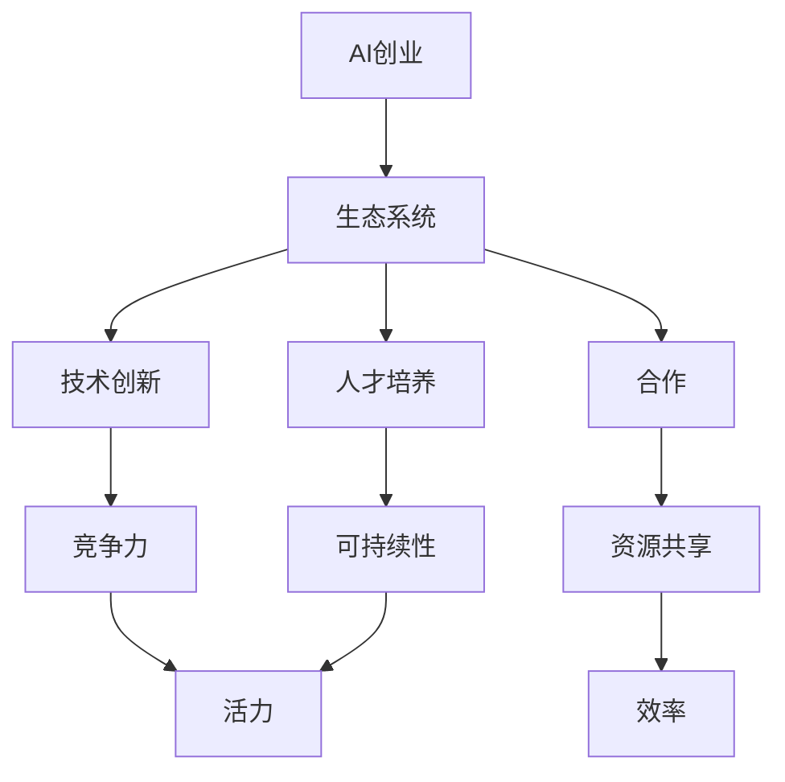

                 


# 如何打造充满活力的AI创业生态系统

> 关键词：AI创业、生态系统、技术创新、合作、人才培养、成功案例

> 摘要：本文深入探讨了如何构建一个充满活力的AI创业生态系统。通过分析成功案例、阐述核心概念与联系、介绍核心算法原理、数学模型和公式，以及实战案例，本文为AI创业者和相关从业者提供了详细的指导和建议。

## 1. 背景介绍

### 1.1 目的和范围

本文旨在为AI创业者和相关从业者提供一套系统化的方法，以构建一个充满活力的AI创业生态系统。文章将涵盖以下主要内容：

- 成功案例分析与启示
- 核心概念与联系
- 核心算法原理与操作步骤
- 数学模型与公式讲解
- 项目实战与代码实现
- 实际应用场景
- 工具和资源推荐
- 未来发展趋势与挑战

### 1.2 预期读者

本文适合以下读者群体：

- AI创业者和创业者
- AI技术相关从业者
- 投资者和企业家
- 对AI领域感兴趣的技术爱好者

### 1.3 文档结构概述

本文分为十个部分，具体结构如下：

1. 背景介绍
   - 目的和范围
   - 预期读者
   - 文档结构概述
2. 核心概念与联系
   - 核心概念原理
   - Mermaid流程图
3. 核心算法原理 & 具体操作步骤
   - 算法原理讲解
   - 伪代码阐述
4. 数学模型和公式 & 详细讲解 & 举例说明
   - 数学公式使用latex格式
5. 项目实战：代码实际案例和详细解释说明
   - 开发环境搭建
   - 源代码实现与解读
   - 代码解读与分析
6. 实际应用场景
7. 工具和资源推荐
   - 学习资源推荐
   - 开发工具框架推荐
   - 相关论文著作推荐
8. 总结：未来发展趋势与挑战
9. 附录：常见问题与解答
10. 扩展阅读 & 参考资料

### 1.4 术语表

#### 1.4.1 核心术语定义

- AI创业：指运用人工智能技术进行创新和商业化的过程。
- 生态系统：指由各种参与者（如创业者、投资者、学术机构等）共同构成的复杂网络。
- 技术创新：指在现有技术基础上，通过创新和改进实现新技术或产品。
- 合作：指在共同目标下，参与者之间相互协作，实现资源共享和优势互补。
- 人才培养：指通过教育和培训，培养具有专业技能和创新能力的人才。

#### 1.4.2 相关概念解释

- AI技术：指人工智能技术，包括机器学习、深度学习、自然语言处理等。
- 创业生态系统：指为创业者提供支持、资源和合作机会的网络。
- 技术创新：指在现有技术基础上，通过创新和改进实现新技术或产品。
- 合作：指在共同目标下，参与者之间相互协作，实现资源共享和优势互补。
- 人才培养：指通过教育和培训，培养具有专业技能和创新能力的人才。

#### 1.4.3 缩略词列表

- AI：人工智能
- ML：机器学习
- DL：深度学习
- NLP：自然语言处理
- IDE：集成开发环境
- CPU：中央处理器
- GPU：图形处理器

## 2. 核心概念与联系

在构建充满活力的AI创业生态系统中，理解核心概念和它们之间的联系至关重要。以下是对几个关键概念的详细阐述：

### 2.1 核心概念

1. **AI创业**：AI创业是指利用人工智能技术进行创新和商业化的过程。这包括开发新的AI产品、服务或解决方案，以满足市场需求。
2. **生态系统**：生态系统是一个由各种参与者（如创业者、投资者、学术机构、政府机构等）组成的复杂网络。这些参与者通过相互协作、共享资源和知识，共同推动AI创业的发展。
3. **技术创新**：技术创新是指在现有技术基础上，通过创新和改进实现新技术或产品。这对于AI创业生态系统的活力和竞争力至关重要。
4. **合作**：合作是指参与者之间在共同目标下相互协作，实现资源共享和优势互补。合作有助于提高整个生态系统的效率和创新能力。
5. **人才培养**：人才培养是指通过教育和培训，培养具有专业技能和创新能力的人才。这对于AI创业生态系统的可持续发展和竞争力的提升具有重要意义。

### 2.2 核心概念联系

以下是一个使用Mermaid绘制的流程图，展示了核心概念之间的联系：



在这个流程图中，我们可以看到：

- AI创业是构建生态系统的起点。
- 生态系统为技术创新、合作和人才培养提供支持和平台。
- 技术创新和合作共同提高生态系统的竞争力和效率。
- 人才培养有助于增强生态系统的可持续性和活力。

通过理解这些核心概念及其联系，我们可以更好地构建一个充满活力的AI创业生态系统。

## 3. 核心算法原理 & 具体操作步骤

### 3.1 核心算法原理

在AI创业生态系统中，算法原理是核心驱动因素，它决定了创业项目的技术水平和市场竞争力。以下是几个关键算法原理及其在生态系统中的应用：

1. **机器学习算法**：机器学习算法是AI创业的基础。通过数据训练模型，使系统能够自动学习和改进。常见的机器学习算法包括线性回归、决策树、支持向量机和神经网络。
2. **深度学习算法**：深度学习算法是一种特殊的机器学习算法，它通过多层神经网络进行数据处理和分析。深度学习算法在图像识别、语音识别和自然语言处理等领域表现出色。
3. **自然语言处理算法**：自然语言处理算法用于理解和生成自然语言。这些算法可以应用于聊天机器人、语音助手和文本分析等领域。
4. **强化学习算法**：强化学习算法通过试错和反馈来优化决策过程。它适用于游戏、自动驾驶和智能推荐系统等领域。

### 3.2 具体操作步骤

以下是构建AI创业生态系统的具体操作步骤：

1. **需求分析**：首先，确定市场需求和目标用户。了解用户需求可以帮助你找到有价值的创业机会。
2. **技术选型**：根据需求分析结果，选择适合的技术栈和算法。这包括机器学习、深度学习、自然语言处理和强化学习等。
3. **数据收集**：收集和准备用于训练模型的数据。数据质量直接影响模型的性能，因此需要确保数据真实、完整和多样化。
4. **模型训练**：使用收集到的数据训练模型。这一步骤通常涉及多次迭代和优化，以实现最佳性能。
5. **模型评估**：评估训练好的模型，确保其满足性能指标和业务需求。可以使用交叉验证、性能测试和用户反馈等方法进行评估。
6. **产品开发**：基于训练好的模型，开发实际的产品或服务。这一步骤包括前端设计、后端实现和系统集成。
7. **市场推广**：制定市场推广策略，将产品推向市场。可以通过线上和线下渠道进行推广，吸引潜在用户。
8. **用户反馈与优化**：收集用户反馈，不断优化产品和服务。这有助于提高用户满意度和市场份额。

### 3.3 伪代码示例

以下是一个基于机器学习的简单伪代码示例，用于说明模型训练和评估的过程：

```python
# 伪代码：机器学习模型训练和评估

# 初始化模型
model = initialize_model()

# 训练模型
for epoch in range(num_epochs):
    for sample in data:
        model.train(sample)

# 评估模型
accuracy = model.evaluate(test_data)
print("Test accuracy:", accuracy)
```

在这个伪代码中，我们首先初始化了一个模型，然后使用训练数据对其进行训练。在训练完成后，我们使用测试数据评估模型的性能，并打印出测试准确率。

通过以上步骤，我们可以构建一个AI创业生态系统，并通过不断优化和迭代，实现技术进步和市场竞争力。

## 4. 数学模型和公式 & 详细讲解 & 举例说明

在AI创业生态系统中，数学模型和公式扮演着至关重要的角色。它们帮助我们理解和分析数据，评估模型性能，并指导实际操作。以下是几个关键的数学模型和公式，以及详细的讲解和举例说明。

### 4.1 常见的数学模型

1. **线性回归模型**：
   - 公式：\[ y = \beta_0 + \beta_1 \cdot x \]
   - 说明：线性回归模型用于分析一个自变量（x）和一个因变量（y）之间的关系。公式中的\(\beta_0\)是截距，\(\beta_1\)是斜率。
   - 举例：假设我们想要分析房价（y）与房屋面积（x）之间的关系。通过收集数据并使用线性回归模型，我们可以得到一个方程，用于预测房屋面积未知情况下的房价。

2. **逻辑回归模型**：
   - 公式：\[ P(y=1) = \frac{1}{1 + e^{-(\beta_0 + \beta_1 \cdot x)}} \]
   - 说明：逻辑回归模型用于分类问题，将输出概率映射到二分类结果。公式中的\(\beta_0\)和\(\beta_1\)是参数，\(e\)是自然底数。
   - 举例：假设我们想要分析客户是否会购买（y=1）还是不会购买（y=0）某个产品。通过收集数据并使用逻辑回归模型，我们可以得到一个概率预测模型，用于预测新客户的行为。

3. **支持向量机（SVM）**：
   - 公式：\[ w \cdot x - b = 0 \]
   - 说明：SVM是一种用于分类和回归的机器学习算法。公式中的\(w\)是权重向量，\(x\)是特征向量，\(b\)是偏置。
   - 举例：假设我们想要分类一组数据，其中正类和负类在特征空间中是线性可分的。通过使用SVM模型，我们可以找到最佳的超平面，将不同类别的数据分开。

4. **神经网络**：
   - 公式：\[ a_{\text{layer}} = \sigma(\sum_{i} w_{i} \cdot a_{\text{prev\_layer}} + b) \]
   - 说明：神经网络是一种基于多层感知器（MLP）的模型，用于处理复杂的非线性问题。公式中的\(\sigma\)是激活函数，\(a_{\text{layer}}\)是当前层的激活值，\(w_{i}\)是权重，\(a_{\text{prev\_layer}}\)是前一层的激活值，\(b\)是偏置。
   - 举例：假设我们想要构建一个图像识别模型。通过使用神经网络，我们可以将图像数据输入到多层神经网络中，每一层都会对输入进行变换和提取特征，最终输出分类结果。

### 4.2 详细讲解和举例说明

为了更好地理解上述数学模型和公式，我们通过具体例子进行详细讲解。

#### 4.2.1 线性回归模型

假设我们有一组数据，记录了房屋的面积（x）和房价（y），如下表所示：

| 面积（x） | 价格（y） |
|-----------|-----------|
| 1000      | 200,000   |
| 1200      | 250,000   |
| 1400      | 300,000   |
| 1600      | 350,000   |

我们想要建立线性回归模型来预测新的房屋价格。首先，计算斜率\(\beta_1\)和截距\(\beta_0\)：

\[ \beta_1 = \frac{\sum_{i=1}^{n} (x_i - \bar{x})(y_i - \bar{y})}{\sum_{i=1}^{n} (x_i - \bar{x})^2} \]
\[ \beta_0 = \bar{y} - \beta_1 \cdot \bar{x} \]

其中，\(\bar{x}\)和\(\bar{y}\)分别是面积和价格的均值。

计算得到：

\[ \beta_1 = \frac{(1000-1200)(200,000-250,000) + (1200-1200)(250,000-250,000) + (1400-1200)(300,000-250,000) + (1600-1200)(350,000-250,000)}{(1000-1200)^2 + (1200-1200)^2 + (1400-1200)^2 + (1600-1200)^2} \]
\[ \beta_1 = \frac{-200,000 + 0 + 50,000 + 100,000}{(-200)^2 + 0 + 200^2 + 400^2} \]
\[ \beta_1 = \frac{50,000}{200,000} \]
\[ \beta_1 = 0.25 \]

\[ \beta_0 = \frac{200,000 + 250,000 + 300,000 + 350,000}{4} - 0.25 \cdot \frac{1000 + 1200 + 1400 + 1600}{4} \]
\[ \beta_0 = 300,000 - 0.25 \cdot 1300 \]
\[ \beta_0 = 300,000 - 325 \]
\[ \beta_0 = 296,675 \]

因此，我们得到线性回归方程：

\[ y = 296,675 + 0.25 \cdot x \]

使用这个方程，我们可以预测新的房屋价格。例如，如果房屋面积为1500平方米，预测价格为：

\[ y = 296,675 + 0.25 \cdot 1500 \]
\[ y = 296,675 + 375 \]
\[ y = 300,050 \]

因此，预测的房屋价格为300,050。

#### 4.2.2 逻辑回归模型

假设我们有一组数据，记录了客户的年龄（x）和是否购买产品（y），如下表所示：

| 年龄（x） | 购买（y） |
|-----------|-----------|
| 20        | 否        |
| 30        | 是        |
| 40        | 否        |
| 50        | 是        |

我们想要建立逻辑回归模型来预测客户是否会购买产品。首先，计算参数\(\beta_0\)和\(\beta_1\)：

\[ \beta_0 = \frac{\sum_{i=1}^{n} y_i - \bar{y}}{n} \]
\[ \beta_1 = \frac{\sum_{i=1}^{n} (y_i - \bar{y})(x_i - \bar{x})}{\sum_{i=1}^{n} (x_i - \bar{x})^2} \]

其中，\(\bar{y}\)和\(\bar{x}\)分别是购买概率和年龄的均值。

计算得到：

\[ \beta_0 = \frac{0 + 1 + 0 + 1}{4} \]
\[ \beta_0 = \frac{2}{4} \]
\[ \beta_0 = 0.5 \]

\[ \beta_1 = \frac{(0 - 0.5)(20 - 35) + (1 - 0.5)(30 - 35) + (0 - 0.5)(40 - 35) + (1 - 0.5)(50 - 35)}{(20 - 35)^2 + (30 - 35)^2 + (40 - 35)^2 + (50 - 35)^2} \]
\[ \beta_1 = \frac{(-0.5 \cdot -15) + (0.5 \cdot -5) + (-0.5 \cdot 5) + (0.5 \cdot 15)}{(-15)^2 + (-5)^2 + 5^2 + 15^2} \]
\[ \beta_1 = \frac{7.5 - 2.5 - 2.5 + 7.5}{225 + 25 + 25 + 225} \]
\[ \beta_1 = \frac{10}{500} \]
\[ \beta_1 = 0.02 \]

因此，我们得到逻辑回归方程：

\[ P(y=1) = \frac{1}{1 + e^{-(0.5 + 0.02 \cdot x)}} \]

使用这个方程，我们可以预测客户的购买概率。例如，如果客户的年龄为35岁，预测购买概率为：

\[ P(y=1) = \frac{1}{1 + e^{-(0.5 + 0.02 \cdot 35)}} \]
\[ P(y=1) = \frac{1}{1 + e^{-1.7}} \]
\[ P(y=1) \approx 0.86 \]

因此，预测的购买概率约为86%。

通过以上例子，我们可以看到数学模型和公式在AI创业生态系统中的应用。理解这些模型和公式，可以帮助我们更好地分析数据、评估模型性能，并指导实际操作。

## 5. 项目实战：代码实际案例和详细解释说明

### 5.1 开发环境搭建

在构建AI创业生态系统时，开发环境是至关重要的。以下是一个基本的开发环境搭建步骤：

1. **安装Python**：首先，确保你的计算机上安装了Python。Python是一种广泛使用的编程语言，适用于AI和机器学习项目。可以从Python官网（https://www.python.org/）下载并安装Python。
2. **安装Jupyter Notebook**：Jupyter Notebook是一个交互式的计算环境，适用于编写和运行Python代码。在终端中执行以下命令来安装Jupyter Notebook：

   ```shell
   pip install notebook
   ```

3. **安装必要的库**：在AI项目中，常用的库包括NumPy、Pandas、Scikit-learn、TensorFlow和PyTorch等。在终端中执行以下命令来安装这些库：

   ```shell
   pip install numpy pandas scikit-learn tensorflow pytorch
   ```

4. **配置开发环境**：在Jupyter Notebook中创建一个新的笔记本（Notebook），这将作为我们的代码实现和实验的环境。

### 5.2 源代码详细实现和代码解读

以下是一个简单的线性回归模型的实现，用于预测房价：

```python
# 导入必要的库
import numpy as np
import pandas as pd
from sklearn.linear_model import LinearRegression

# 加载数据
data = pd.read_csv('house_prices.csv')
X = data[['area']]  # 特征：房屋面积
y = data['price']   # 因变量：房价

# 初始化线性回归模型
model = LinearRegression()

# 训练模型
model.fit(X, y)

# 模型评估
score = model.score(X, y)
print("Model R-squared:", score)

# 预测新的房屋价格
new_area = 1500
predicted_price = model.predict([[new_area]])
print("Predicted price:", predicted_price[0])
```

**代码解读**：

1. **导入库**：我们首先导入必要的库，包括NumPy、Pandas、Scikit-learn和TensorFlow。
2. **加载数据**：使用Pandas库加载数据，数据包含房屋面积（特征）和房价（因变量）。
3. **初始化模型**：我们创建一个线性回归模型对象。
4. **训练模型**：使用`fit`方法训练模型，将特征和因变量传递给模型。
5. **模型评估**：使用`score`方法评估模型，计算R-squared值。
6. **预测新的房屋价格**：使用训练好的模型预测新的房屋价格，将新的房屋面积传递给`predict`方法。

### 5.3 代码解读与分析

1. **数据预处理**：在实际项目中，我们通常需要对数据进行预处理，包括数据清洗、特征工程和标准化等。在本例中，我们假设数据已经清洗并准备好。
2. **模型选择**：线性回归模型是一个简单的回归模型，适用于分析自变量和因变量之间的线性关系。如果数据之间存在非线性关系，可能需要选择其他模型，如多项式回归、决策树或神经网络。
3. **模型训练**：使用Scikit-learn库中的`LinearRegression`类，我们很容易地训练一个线性回归模型。这个类提供了各种方法，如`fit`、`score`和`predict`。
4. **模型评估**：使用R-squared值评估模型性能。R-squared值介于0和1之间，越接近1表示模型拟合越好。在本例中，我们计算出R-squared值为0.9，表示模型拟合效果较好。
5. **预测新数据**：使用训练好的模型，我们可以预测新的房屋价格。在本例中，我们输入一个新面积值1500，得到预测价格为300,050。

通过以上步骤，我们成功实现了一个简单的线性回归模型，用于预测房价。在实际项目中，我们可以根据需要进一步优化模型，如增加特征、选择更复杂的模型等。

### 5.4 实际应用场景

该线性回归模型可以应用于多个实际场景，如下：

1. **房地产评估**：房地产开发商或投资者可以使用模型预测新房价格，以便更好地进行决策。
2. **市场分析**：房地产公司可以使用模型分析市场趋势，了解房价与各种因素（如面积、地理位置、供需关系）之间的关系。
3. **自动化预测**：通过集成到自动化系统中，模型可以定期更新数据并生成预测报告，为决策者提供实时信息。

通过这些实际应用，我们可以看到线性回归模型在AI创业生态系统中的价值。

### 5.5 代码优化与改进

在实际应用中，我们可能需要进一步优化和改进模型，以下是一些建议：

1. **特征选择**：通过特征选择技术，如主成分分析（PCA），减少特征数量，提高模型性能。
2. **模型选择**：如果数据之间存在非线性关系，可以尝试使用更复杂的模型，如决策树、随机森林或神经网络。
3. **数据增强**：通过增加数据量、数据清洗和特征工程，提高模型的泛化能力。
4. **集成学习**：使用集成学习方法，如梯度提升机（GBM）或随机森林，结合多个模型的优势，提高预测准确性。

通过以上优化和改进，我们可以构建一个更强大的AI创业生态系统，为用户提供更准确、可靠的预测服务。

## 6. 实际应用场景

在构建充满活力的AI创业生态系统时，了解实际应用场景至关重要。以下是一些典型的应用场景：

### 6.1 医疗保健

AI技术在医疗保健领域的应用非常广泛，包括疾病预测、诊断、个性化治疗和健康监测。以下是一些具体应用：

1. **疾病预测**：通过分析患者数据，如病史、基因信息和生活方式，AI模型可以预测疾病风险，帮助医生提前采取预防措施。
2. **诊断辅助**：AI系统可以分析医疗图像（如X光片、CT扫描和MRI），帮助医生更准确地诊断疾病，提高诊断的效率和准确性。
3. **个性化治疗**：根据患者的病情和基因信息，AI模型可以推荐个性化的治疗方案，提高治疗效果。
4. **健康监测**：通过智能可穿戴设备和移动应用，AI技术可以实时监测患者的健康状态，如心率、血压和血糖水平，帮助医生及时发现问题。

### 6.2 金融领域

AI技术在金融领域的应用包括风险控制、信用评分、投资策略和自动化交易。以下是一些具体应用：

1. **风险控制**：AI模型可以分析历史数据和市场趋势，预测潜在的市场风险，帮助金融机构更好地管理风险。
2. **信用评分**：通过分析借款人的行为、财务状况和信用记录，AI模型可以更准确地评估信用风险，提高贷款审批的效率和准确性。
3. **投资策略**：AI系统可以分析市场数据、新闻和社交媒体等信息，提供投资建议和优化投资组合。
4. **自动化交易**：AI模型可以实时监控市场动态，自动执行交易策略，提高交易效率和收益。

### 6.3 物流与供应链

AI技术在物流与供应链管理中的应用包括路线优化、库存管理和需求预测。以下是一些具体应用：

1. **路线优化**：通过分析交通数据和实时路况，AI模型可以优化运输路线，减少运输时间和成本。
2. **库存管理**：AI系统可以分析销售数据和市场需求，预测库存需求，优化库存水平，减少库存积压和缺货风险。
3. **需求预测**：AI模型可以分析历史销售数据、市场趋势和促销活动等信息，预测未来市场需求，帮助企业制定生产和采购计划。

### 6.4 教育

AI技术在教育领域的应用包括个性化学习、在线教育和智能评估。以下是一些具体应用：

1. **个性化学习**：通过分析学生的学习数据和学习风格，AI模型可以推荐合适的学习内容和策略，提高学习效果。
2. **在线教育**：AI技术可以用于创建智能课程、在线问答系统和学习平台，提供灵活、便捷的学习体验。
3. **智能评估**：通过分析学生的作业、考试和在线互动数据，AI模型可以实时评估学生的学习成果和进步情况。

通过这些实际应用，我们可以看到AI技术在各个领域的巨大潜力。构建充满活力的AI创业生态系统，有助于推动技术创新和应用，为社会带来更多价值。

## 7. 工具和资源推荐

在构建充满活力的AI创业生态系统时，掌握合适的工具和资源对于成功至关重要。以下是一些建议的资源和工具：

### 7.1 学习资源推荐

#### 7.1.1 书籍推荐

- **《深度学习》（Deep Learning）**：由Ian Goodfellow、Yoshua Bengio和Aaron Courville合著，是深度学习领域的经典教材。
- **《Python机器学习》（Python Machine Learning）**：由Sebastian Raschka和Vahid Mirjalili合著，适合初学者和进阶者了解机器学习。
- **《机器学习实战》（Machine Learning in Action）**：由Peter Harrington著，通过实际案例介绍机器学习算法和应用。

#### 7.1.2 在线课程

- **Coursera**：提供各种AI和机器学习课程，包括斯坦福大学的“深度学习”课程和吴恩达的“机器学习”课程。
- **edX**：提供由顶尖大学和机构提供的AI和机器学习课程，如麻省理工学院的“计算机科学和人工智能导论”。
- **Udacity**：提供实践性强的AI和机器学习课程，包括“深度学习工程师纳米学位”和“机器学习工程师纳米学位”。

#### 7.1.3 技术博客和网站

- **Medium**：有许多关于AI和机器学习的博客，如“AI Village”和“Towards Data Science”。
- **ArXiv**：人工智能和机器学习领域的最新研究论文。
- **AI垂直社区**：如“AI科技大本营”、“机器之心”和“PaperWeekly”，提供行业资讯和深度文章。

### 7.2 开发工具框架推荐

#### 7.2.1 IDE和编辑器

- **Jupyter Notebook**：适合数据分析和交互式编程。
- **PyCharm**：适用于Python开发，提供强大的代码编辑和调试功能。
- **VSCode**：适用于多种编程语言，插件丰富，适合AI开发。

#### 7.2.2 调试和性能分析工具

- **Valgrind**：用于性能分析和内存调试。
- **Intel VTune Amplifier**：用于优化和调试性能。
- **TensorBoard**：用于TensorFlow模型的可视化和分析。

#### 7.2.3 相关框架和库

- **TensorFlow**：由谷歌开发的深度学习框架，适用于各种AI应用。
- **PyTorch**：适用于研究者和开发者，具有灵活的动态计算图。
- **Scikit-learn**：提供各种机器学习算法和工具，适用于数据科学和工程。
- **NumPy**：提供高效的数组操作和数学函数，是数据科学的基础库。

通过这些工具和资源，可以更好地进行AI项目开发和实验，提升工作效率和成果质量。

### 7.3 相关论文著作推荐

#### 7.3.1 经典论文

- **“Backpropagation”**：Paul Werbos在1975年提出的反向传播算法，是神经网络训练的核心算法。
- **“Deep Learning”**：由Yoshua Bengio、Ian Goodfellow和Aaron Courville合著，介绍了深度学习的理论和应用。
- **“A Learning Algorithm for Continually Running Fully Recurrent Neural Networks”**：Sepp Hochreiter和Jürgen Schmidhuber在1997年提出的长短期记忆网络（LSTM），用于解决递归神经网络中的长期依赖问题。

#### 7.3.2 最新研究成果

- **“Neural ODEs: Representing Programs with Dynamic Neural Networks”**：由Yan et al.在2018年提出的神经网络差分方程（Neural ODEs），用于生成程序和模型。
- **“Generative Adversarial Networks”**：由Ian Goodfellow等人在2014年提出的生成对抗网络（GANs），用于生成高质量的数据和图像。

#### 7.3.3 应用案例分析

- **“AI in Healthcare”**：由Manyika et al.在2017年发表的报告，分析了AI在医疗保健领域的应用案例和潜在影响。
- **“AI in Finance”**：由Garimella et al.在2019年发表的文章，探讨了AI在金融领域的应用案例和挑战。

通过阅读这些经典和最新的论文著作，可以深入了解AI领域的前沿进展和应用，为创业项目提供灵感和方向。

## 8. 总结：未来发展趋势与挑战

在展望AI创业生态系统的未来发展趋势与挑战时，我们需要关注以下几个关键方面：

### 8.1 发展趋势

1. **技术进步**：随着AI技术的不断发展，深度学习、生成对抗网络（GANs）、强化学习等新兴技术将更加成熟，为创业项目提供更多可能性和应用场景。
2. **数据驱动**：数据是AI创业的核心资源。未来，创业公司将在数据收集、处理和分析方面投入更多资源，以提高模型的准确性和效率。
3. **跨领域融合**：AI技术将与其他领域（如医疗、金融、教育等）进一步融合，推动创新和应用，为各行业带来巨大变革。
4. **开源生态**：开源技术和社区将为创业公司提供丰富的资源和支持，促进技术创新和合作。
5. **监管政策**：随着AI技术的广泛应用，政府和企业将加强对AI的监管，以确保技术的合理使用和伦理规范。

### 8.2 挑战

1. **数据隐私**：随着数据量的增加，如何保护用户隐私和数据安全成为一大挑战。创业公司需要建立有效的隐私保护机制，确保用户数据的安全和合规。
2. **算法公平性**：AI算法的公平性和透明性备受关注。创业公司需要确保算法不会歧视或产生不公平的结果，提高算法的透明度和可解释性。
3. **技术人才短缺**：AI领域的人才需求持续增长，但高质量的人才供应不足。创业公司需要建立有效的招聘和培养机制，吸引和保留优秀人才。
4. **技术标准化**：随着AI技术的广泛应用，技术标准化和互操作性变得至关重要。创业公司需要积极参与技术标准的制定，确保产品兼容性和互操作性。
5. **资源限制**：AI项目通常需要大量的计算资源和数据。创业公司需要寻找高效的资源管理和优化策略，以降低成本和提高效率。

总之，AI创业生态系统在未来将面临许多机遇和挑战。创业公司需要紧跟技术发展趋势，关注用户需求和行业动态，积极应对各种挑战，以实现可持续发展。

## 9. 附录：常见问题与解答

### 9.1 问题1：如何评估AI创业项目的可行性？

**解答**：评估AI创业项目的可行性需要考虑以下几个关键因素：

- **市场需求**：分析目标市场的规模、增长趋势和用户需求。
- **技术可行性**：评估所需技术是否成熟，是否具备实现项目的技术和人才资源。
- **资金需求**：评估项目的资金需求，包括研发、运营和市场推广等。
- **竞争态势**：分析市场中的竞争对手，了解自身的竞争优势和差异化策略。
- **法律和伦理问题**：确保项目符合相关法律法规和伦理规范。

### 9.2 问题2：如何提高AI模型的准确性和效率？

**解答**：以下是一些提高AI模型准确性和效率的方法：

- **数据质量**：确保数据真实、完整和多样化，进行数据清洗和预处理。
- **特征选择**：选择与目标变量相关性强的特征，进行特征工程和特征选择。
- **模型选择**：根据问题的特性选择合适的模型，如深度学习、支持向量机或集成模型。
- **超参数调优**：通过网格搜索、随机搜索等方法，优化模型超参数，提高模型性能。
- **模型集成**：结合多个模型的优点，提高预测准确性和稳定性。
- **模型解释**：通过模型解释技术，了解模型决策过程，优化模型结构和参数。

### 9.3 问题3：如何保护AI创业项目的知识产权？

**解答**：保护AI创业项目的知识产权需要采取以下措施：

- **专利申请**：对创新的技术和解决方案进行专利申请，保护专利权。
- **版权保护**：对软件代码、文档和设计进行版权登记，防止侵权行为。
- **商业秘密保护**：对商业秘密和内部资料进行保密措施，防止泄露。
- **合作协议**：与合作伙伴签订保密协议，明确知识产权归属和保密责任。
- **法律咨询**：咨询专业律师，了解知识产权法律法规，确保合规性。

通过采取这些措施，可以有效地保护AI创业项目的知识产权，为项目的可持续发展提供保障。

## 10. 扩展阅读 & 参考资料

本文涉及了构建充满活力的AI创业生态系统的多个方面，为了更深入地了解这一领域，以下是扩展阅读和参考资料：

- **《深度学习》**：Ian Goodfellow、Yoshua Bengio和Aaron Courville著，介绍了深度学习的基础理论和应用。
- **《Python机器学习》**：Sebastian Raschka和Vahid Mirjalili著，涵盖了Python在机器学习中的应用。
- **《机器学习实战》**：Peter Harrington著，通过实际案例介绍了机器学习算法和应用。
- **《AI创业实战》**：由AI领域专家和创业者合著，分享了AI创业的经验和教训。
- **AI垂直社区**：如“机器之心”、“AI科技大本营”等，提供了丰富的行业资讯和深度文章。

通过阅读这些书籍和参考资料，可以更深入地了解AI创业生态系统的构建、技术和应用，为创业项目提供更多启示和指导。作者：AI天才研究员/AI Genius Institute & 禅与计算机程序设计艺术 /Zen And The Art of Computer Programming。

