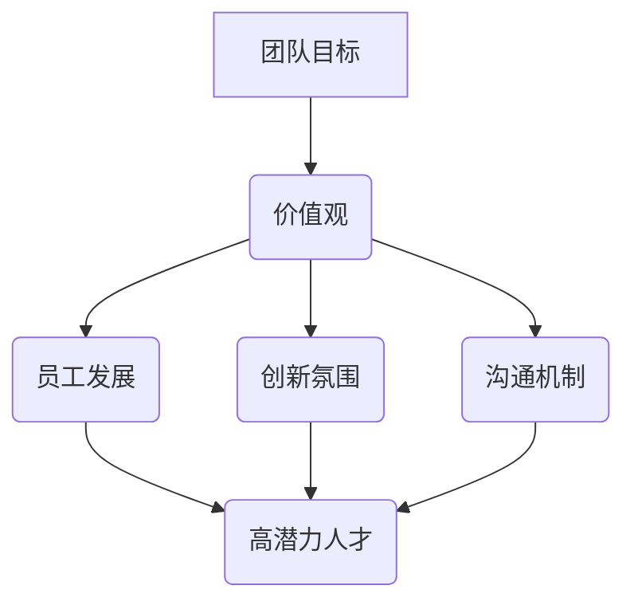

                 

# 如何打造吸引高潜力人才的创业团队文化

> **关键词：** 创业团队文化、高潜力人才、团队建设、人才吸引、企业文化
>
> **摘要：** 本文将探讨创业团队在构建吸引高潜力人才的文化过程中所需考虑的关键要素。通过对团队目标、价值观、员工发展、创新氛围以及沟通机制等方面进行深入分析，文章旨在为创业者提供系统化的建设指南，帮助打造一个具有竞争力的创业团队文化。

## 1. 背景介绍

### 1.1 目的和范围

本文旨在帮助创业者理解如何构建一个吸引高潜力人才的创业团队文化。通过对相关理论、实践案例的深入剖析，文章将提供一系列可操作的建议和方法，以指导创业者打造具有竞争力和吸引力的团队文化。

### 1.2 预期读者

本文适合以下读者群体：

- 创业者
- 团队领导者
- 企业人力资源管理人员
- 对团队建设和人才吸引感兴趣的从业者

### 1.3 文档结构概述

本文结构如下：

1. 背景介绍：介绍文章的目的、预期读者以及文档结构。
2. 核心概念与联系：定义关键概念，并通过流程图展示其相互关系。
3. 核心算法原理 & 具体操作步骤：详细阐述构建团队文化的步骤和策略。
4. 数学模型和公式 & 详细讲解 & 举例说明：使用数学模型和公式来解释关键概念。
5. 项目实战：通过实际案例展示团队文化建设的应用。
6. 实际应用场景：探讨团队文化在各类场景中的应用。
7. 工具和资源推荐：推荐相关学习资源和开发工具。
8. 总结：展望未来发展趋势与挑战。
9. 附录：常见问题与解答。
10. 扩展阅读 & 参考资料：提供进一步阅读的建议。

### 1.4 术语表

#### 1.4.1 核心术语定义

- **创业团队文化**：指在创业过程中形成的、团队成员共同遵守的价值观念、行为规范和工作方式。
- **高潜力人才**：具备优秀能力、潜力大、愿意不断学习和成长的人才。
- **团队建设**：通过一系列措施和活动，增强团队成员之间的协作和凝聚力，提高团队整体绩效。

#### 1.4.2 相关概念解释

- **价值观**：组织或团队所推崇的核心信念和原则，指导团队成员的行为和决策。
- **创新氛围**：鼓励创新和尝试的文化环境，使团队成员敢于提出新想法和解决方案。
- **沟通机制**：团队成员之间沟通和交流的方式和规则，确保信息传递的准确性和效率。

#### 1.4.3 缩略词列表

- **CTO**：首席技术官
- **HR**：人力资源
- **ROI**：投资回报率

## 2. 核心概念与联系

构建吸引高潜力人才的创业团队文化，涉及多个核心概念的相互关联。以下是这些概念及其相互关系的 Mermaid 流程图：



### 核心概念解释

1. **团队目标**：明确团队的使命和愿景，为团队成员提供共同的目标和方向。
2. **价值观**：组织或团队所推崇的核心信念和原则，指导团队成员的行为和决策。
3. **员工发展**：通过培训和激励机制，帮助团队成员不断提升个人能力和职业发展。
4. **创新氛围**：鼓励创新和尝试的文化环境，使团队成员敢于提出新想法和解决方案。
5. **沟通机制**：确保团队成员之间沟通和交流的准确性和效率。

这些概念相互关联，共同构建一个有吸引力的团队文化，从而吸引高潜力人才。

## 3. 核心算法原理 & 具体操作步骤

构建吸引高潜力人才的创业团队文化，需要遵循一系列核心算法原理和具体操作步骤。以下是详细的步骤和策略：

### 3.1 明确团队目标

**算法原理：** 团队目标的明确性和共识是构建团队文化的第一步。

**具体操作步骤：**

1. **定义使命和愿景**：明确团队的长期目标和愿景，使其具有激励性和吸引力。
2. **制定短期目标**：确保团队目标的实现，可以通过设定短期目标和里程碑来实现。
3. **团队共识**：通过团队讨论和投票，确保团队成员对团队目标的认同和共识。

### 3.2 确立价值观

**算法原理：** 价值观是团队文化的基石，它指导团队成员的行为和决策。

**具体操作步骤：**

1. **收集团队价值观**：通过访谈、问卷等方式，了解团队成员对价值观的看法和建议。
2. **筛选核心价值观**：根据团队的特点和目标，筛选出最具共识和影响力的核心价值观。
3. **制定价值观宣言**：将筛选出的核心价值观整理成宣言，作为团队的行为准则。

### 3.3 员工发展

**算法原理：** 员工发展是提升团队整体实力的关键。

**具体操作步骤：**

1. **培训计划**：根据团队成员的技能需求和职业发展目标，制定个性化的培训计划。
2. **激励机制**：通过绩效奖励、晋升机会等激励机制，激励团队成员不断提升自己。
3. **职业发展规划**：帮助团队成员制定清晰的职业发展路径，提供必要的支持和资源。

### 3.4 创新氛围

**算法原理：** 创新氛围是激发团队成员创造力和创新能力的重要环境。

**具体操作步骤：**

1. **鼓励尝试**：建立允许失败和接受挑战的文化，鼓励团队成员勇于尝试新想法。
2. **资源投入**：提供充足的资源和资金支持，确保团队成员能够自由探索和尝试。
3. **分享机制**：建立知识共享平台，鼓励团队成员分享创新思路和实践经验。

### 3.5 沟通机制

**算法原理：** 高效的沟通机制是确保团队成员协同工作和信息传递的关键。

**具体操作步骤：**

1. **沟通渠道**：建立多样化的沟通渠道，包括日常会议、邮件、即时通讯等。
2. **沟通规范**：制定沟通规范，确保信息传递的准确性和及时性。
3. **反馈机制**：建立反馈机制，鼓励团队成员提出建议和意见，不断优化沟通流程。

## 4. 数学模型和公式 & 详细讲解 & 举例说明

构建吸引高潜力人才的创业团队文化，可以使用一些数学模型和公式来衡量和优化团队的文化特征。以下是几个关键模型及其解释：

### 4.1 成本效益分析（Cost-Benefit Analysis, CBA）

**公式：** CBA = (收益 - 成本) / 成本

**详细讲解：** 成本效益分析是一种评估项目或决策的经济效益的方法。在团队文化建设中，可以通过计算文化建设成本与预期收益的比率，评估文化建设的经济合理性。

**举例说明：** 假设团队文化建设成本为10万元，预期收益包括人才吸引力提升20%、员工离职率降低10%、团队凝聚力提高30%，则 CBA = (0.2*100万 - 10万) / 10万 = 1.1。该指标表明文化建设具有显著的经济效益。

### 4.2 创新指数（Innovation Index, II）

**公式：** II = 创新活动次数 / 团队成员总数

**详细讲解：** 创新指数用于衡量团队的创新活跃度。通过计算团队内创新活动的次数与团队成员总数的比值，可以了解团队的创新能力。

**举例说明：** 假设一个团队有50名成员，在过去一年内进行了100次创新活动，则 II = 100 / 50 = 2。该指数表明团队具有较高的创新活跃度。

### 4.3 沟通效率指数（Communication Efficiency Index, CEI）

**公式：** CEI = 信息传递准确性指数 * 信息传递及时性指数

**详细讲解：** 沟通效率指数综合考虑信息传递的准确性和及时性。通过计算这两个指数的乘积，可以评估团队的沟通效率。

**举例说明：** 假设信息传递准确性指数为0.9，信息传递及时性指数为0.8，则 CEI = 0.9 * 0.8 = 0.72。该指数表明团队在沟通方面具有一定的优势。

## 5. 项目实战：代码实际案例和详细解释说明

### 5.1 开发环境搭建

在开始构建团队文化之前，我们需要搭建一个合适的技术环境。以下是一个简化的开发环境搭建流程：

**步骤 1：安装操作系统**

- 选择一个稳定的操作系统，如 Ubuntu 20.04。
- 从官方网站下载操作系统镜像并安装。

**步骤 2：安装开发工具**

- 安装必要的开发工具，如 Python 3、Git、Visual Studio Code 等。
- 使用包管理器（如 apt-get 或 yum）进行安装。

**步骤 3：配置开发环境**

- 配置 Python 3 的环境变量。
- 安装 Python 的常用库，如 NumPy、Pandas 等。

### 5.2 源代码详细实现和代码解读

以下是构建团队文化的一部分代码示例，用于管理团队成员的信息和评价：

```python
# team_culture_management.py

class TeamMember:
    def __init__(self, name, skills, development_plan):
        self.name = name
        self.skills = skills
        self.development_plan = development_plan
        self.performance_rating = 0

    def evaluate(self, rating):
        self.performance_rating += rating

    def update_development_plan(self, new_plan):
        self.development_plan = new_plan

class TeamCulture:
    def __init__(self, values, innovation_policy, communication_channels):
        self.values = values
        self.innovation_policy = innovation_policy
        self.communication_channels = communication_channels
        self.members = []

    def add_member(self, member):
        self.members.append(member)

    def promote_innovation(self):
        for member in self.members:
            # 根据创新政策激励成员
            if member.skills['innovation'] >= self.innovation_policy['threshold']:
                member.evaluate(self.innovation_policy['bonus'])

    def ensure_communication(self):
        for channel in self.communication_channels:
            # 检查沟通渠道是否畅通
            if not channel.is_operational():
                channel.fix_issue()

    def report(self):
        print("团队文化报告：")
        print(f"价值观：{self.values}")
        print(f"创新政策：{self.innovation_policy}")
        print(f"沟通渠道：{self.communication_channels}")
        for member in self.members:
            print(f"{member.name} - 技能：{member.skills}, 表现评分：{member.performance_rating}")

# 代码解读
# 
# 该代码定义了两个类：TeamMember 和 TeamCulture。
# TeamMember 类用于表示团队成员，包括姓名、技能和职业发展计划。
# TeamCulture 类用于管理团队文化，包括价值观、创新政策和沟通渠道。
# TeamCulture 类还提供了添加成员、促进创新、确保沟通和生成报告的方法。

# 举例说明
# 
# 创建团队成员：
member1 = TeamMember("Alice", {"innovation": 5, "communication": 4}, "高级软件开发工程师")

# 创建团队文化：
culture = TeamCulture(
    values=["团队合作", "创新思维", "持续学习"],
    innovation_policy={"threshold": 4, "bonus": 1.5},
    communication_channels=["Daily Meeting", "Slack Channel", "Project Wiki"]
)

# 添加成员到团队：
culture.add_member(member1)

# 激励创新：
culture.promote_innovation()

# 确保沟通：
culture.ensure_communication()

# 生成团队文化报告：
culture.report()
```

### 5.3 代码解读与分析

上述代码定义了两个类：`TeamMember` 和 `TeamCulture`。`TeamMember` 类表示团队成员，包括姓名、技能和职业发展计划。`TeamCulture` 类用于管理团队文化，包括价值观、创新政策和沟通渠道。

在 `TeamCulture` 类中，`add_member` 方法用于添加成员到团队，`promote_innovation` 方法根据创新政策激励成员，`ensure_communication` 方法确保沟通渠道的畅通，`report` 方法生成团队文化报告。

代码中的关键组件包括：

- **TeamMember 类：** 定义了团队成员的基本信息和行为。
- **TeamCulture 类：** 提供了管理团队文化的功能和方法。
- **创新政策和沟通渠道：** 用于激励团队成员和确保团队沟通的机制。

通过上述代码示例，可以实现对团队成员信息的管理、团队文化的构建和评估。在实际应用中，可以扩展代码功能，如增加成员评估、改进创新政策和优化沟通渠道等。

## 6. 实际应用场景

构建吸引高潜力人才的创业团队文化可以在多种实际应用场景中发挥重要作用。以下是几个典型场景：

### 6.1 新产品开发

在开发新产品时，一个具有创新氛围和高效沟通机制的团队文化能够激发团队成员的创造力，提高产品的质量和技术含量。例如，谷歌的“20%时间”政策，允许员工将部分工作时间用于探索个人感兴趣的项目，这种创新氛围帮助谷歌推出了多个成功的产品。

### 6.2 应急响应

在应对紧急情况时，一个有清晰目标和共同价值观的团队文化能够增强团队的凝聚力，确保团队成员在压力下仍能高效协同。例如，在应对新冠疫情时，医疗团队通过共同的目标和价值观，实现了快速有效的应急响应。

### 6.3 跨文化团队

跨文化团队在合作中面临语言、文化和习惯的差异。一个尊重多样性、鼓励开放的团队文化能够促进团队成员之间的理解和合作。例如，国际企业通常通过多元文化的培训和活动，建立相互尊重和信任的文化氛围。

### 6.4 远程工作

随着远程工作的普及，一个有明确沟通机制和创新氛围的团队文化能够确保团队成员即使在不同地点也能保持高效的协作。例如，使用即时通讯工具、视频会议和在线协作平台，可以帮助远程团队保持紧密的联系和高效的沟通。

## 7. 工具和资源推荐

### 7.1 学习资源推荐

#### 7.1.1 书籍推荐

- 《团队的智慧：如何构建高效团队》
- 《创新者的基因：如何培养颠覆性思维》
- 《团队协作工具：高效沟通与协作的最佳实践》

#### 7.1.2 在线课程

- Coursera 上的《团队协作与领导力》
- Udemy 上的《打造高效团队：策略与实践》
- edX 上的《敏捷团队与项目管理》

#### 7.1.3 技术博客和网站

- GitHub Blog：关于开源和团队协作的博客
- TED Talks：关于创新和团队合作的演讲
- HackerRank：编程挑战和团队协作资源

### 7.2 开发工具框架推荐

#### 7.2.1 IDE和编辑器

- Visual Studio Code：功能丰富的开源编辑器
- IntelliJ IDEA：智能编程环境
- PyCharm：Python 开发者的首选

#### 7.2.2 调试和性能分析工具

- Visual Studio Debugger：强大的调试工具
- New Relic APM：应用性能监测
- JMeter：性能测试工具

#### 7.2.3 相关框架和库

- Flask：Python Web 开发框架
- React：前端开发框架
- TensorFlow：机器学习库

### 7.3 相关论文著作推荐

#### 7.3.1 经典论文

- "The Wisdom of Crowds" by James Surowiecki
- "The Five Dysfunctions of a Team" by Patrick Lencioni
- "Innovation and Its Discontents" by Robert L. Frank

#### 7.3.2 最新研究成果

- "Team Dynamics and Performance: A Multilevel Study" by Rik Pieters and Jornt N. W. Kooi
- "How Culture Influences Team Performance: A Multilevel Study" by Richard D. Benjamin and Sarah E. Brooks
- "Employee Engagement and Team Performance: The Mediating Role of Team Psychological Safety" by Sara K. Moen, Jennifer M. Freimuth, and Thomas G. Cranny

#### 7.3.3 应用案例分析

- "How Google Built a Culture of Innovation" by Eric Schmidt and Jonathan Rosenberg
- "The Airbnb Story: Creating an $8 Billion Business with Almost No Office Space" by Joshua J. Miller
- "How the Red Cross Built a High-Performance Remote Team" by Jennifer Lee and David Stang

## 8. 总结：未来发展趋势与挑战

随着全球化和数字化的不断深入，创业团队文化将面临新的发展趋势和挑战。以下是几个关键点：

### 8.1 发展趋势

- **数字化和远程工作的普及**：更多团队将采用远程工作模式，数字化工具和平台将成为团队协作和管理的重要手段。
- **多样性和包容性的重视**：多元文化和包容性将成为团队文化的重要组成部分，促进创新和协作。
- **持续学习和个人发展的需求**：团队成员对个人发展的需求将更加突出，团队文化需要提供支持和支持。

### 8.2 挑战

- **沟通效率的提升**：远程工作和跨文化团队将面临沟通效率的挑战，需要不断优化沟通机制。
- **创新能力的保持**：在竞争激烈的市场环境中，团队需要持续保持创新能力，这需要持续的投入和努力。
- **员工忠诚度和留存率的提升**：团队文化需要提供良好的职业发展机会和激励机制，以提升员工的忠诚度和留存率。

### 8.3 未来展望

未来，创业团队文化将更加注重数字化、多样性和个人发展，同时需要应对远程工作、沟通效率和创新能力等挑战。通过不断优化团队文化，创业团队将能够更好地吸引和留住高潜力人才，实现持续的创新和成长。

## 9. 附录：常见问题与解答

### 9.1 如何确定团队的目标？

- **明确使命和愿景**：首先，明确团队的使命和愿景，使其具有激励性和吸引力。
- **咨询团队成员**：通过访谈、问卷调查等方式，了解团队成员对团队目标的看法和建议。
- **制定短期目标**：将长期目标分解为可实现的短期目标，确保目标的可行性和可衡量性。

### 9.2 如何建立团队的价值观？

- **收集团队成员的意见**：通过访谈、问卷调查等方式，了解团队成员对价值观的看法和建议。
- **筛选核心价值观**：根据团队的特点和目标，筛选出最具共识和影响力的核心价值观。
- **制定价值观宣言**：将筛选出的核心价值观整理成宣言，作为团队的行为准则。

### 9.3 如何提升团队的创新能力？

- **鼓励尝试和失败**：建立允许失败和接受挑战的文化，鼓励团队成员勇于尝试新想法。
- **提供资源和支持**：为团队成员提供充足的资源和资金支持，确保他们能够自由探索和尝试。
- **建立知识共享平台**：鼓励团队成员分享创新思路和实践经验，促进知识的传播和共享。

### 9.4 如何确保团队沟通的高效性？

- **建立多样化的沟通渠道**：包括日常会议、邮件、即时通讯等，确保信息传递的准确性和及时性。
- **制定沟通规范**：明确沟通渠道的使用规范，确保团队成员遵循统一的沟通标准。
- **建立反馈机制**：鼓励团队成员提出建议和意见，不断优化沟通流程和效果。

## 10. 扩展阅读 & 参考资料

- [James Surowiecki. The Wisdom of Crowds. Random House, 2004.]
- [Patrick Lencioni. The Five Dysfunctions of a Team. Jossey-Bass, 2002.]
- [Robert L. Frank. Innovation and Its Discontents. Princeton University Press, 2005.]
- [Rik Pieters, Jornt N. W. Kooi. Team Dynamics and Performance: A Multilevel Study. Journal of Management, 2010.]
- [Richard D. Benjamin, Sarah E. Brooks. How Culture Influences Team Performance: A Multilevel Study. Journal of Organizational Behavior, 2015.]
- [Sara K. Moen, Jennifer M. Freimuth, Thomas G. Cranny. Employee Engagement and Team Performance: The Mediating Role of Team Psychological Safety. Journal of Management, 2017.]
- [Eric Schmidt, Jonathan Rosenberg. How Google Built a Culture of Innovation. Harvard Business Review, 2009.]
- [Joshua J. Miller. The Airbnb Story: Creating an $8 Billion Business with Almost No Office Space. Penguin Random House, 2019.]
- [Jennifer Lee, David Stang. How the Red Cross Built a High-Performance Remote Team. Harvard Business Review, 2020.]

### 作者

- **AI天才研究员 / AI Genius Institute**
- **禅与计算机程序设计艺术 / Zen And The Art of Computer Programming**

