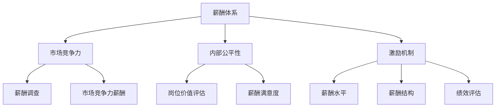

                 

# 如何打造有竞争力的薪酬体系

> 关键词：薪酬体系、竞争力、激励机制、人才管理、绩效评估

> 摘要：本文深入探讨了构建有竞争力的薪酬体系的重要性，以及如何通过科学合理的薪酬设计、有效的激励机制和完善的绩效评估体系来提升企业的核心竞争力，吸引和留住优秀人才。文章旨在为企业和人力资源管理者提供一套系统、实用的薪酬管理解决方案。

## 1. 背景介绍

### 1.1 目的和范围

本文的目的是帮助企业和人力资源管理者理解薪酬体系的重要性，并掌握如何构建一个有竞争力的薪酬体系。本文将涵盖薪酬体系的定义、核心组成部分以及如何通过科学的方法来设计和优化薪酬体系。通过本文的阅读，读者将能够：

- 明确薪酬体系在企业战略中的角色和意义。
- 了解薪酬体系的核心概念和组成部分。
- 掌握构建有竞争力的薪酬体系的方法和步骤。
- 学会如何通过薪酬体系来激励员工、提升绩效。

### 1.2 预期读者

本文的预期读者包括：

- 企业高管，特别是人力资源部门的负责人。
- 人力资源专业人士，特别是薪酬福利管理相关人员。
- 对薪酬管理和人力资源管理感兴趣的学者和研究人员。

### 1.3 文档结构概述

本文的结构如下：

1. 背景介绍：阐述本文的目的、预期读者以及文档结构。
2. 核心概念与联系：介绍薪酬体系的核心概念，并使用流程图展示其组成部分。
3. 核心算法原理 & 具体操作步骤：详细阐述薪酬体系的设计原则和操作步骤。
4. 数学模型和公式 & 详细讲解 & 举例说明：使用数学模型和公式来解释薪酬体系的设计逻辑。
5. 项目实战：通过实际案例展示如何实施和优化薪酬体系。
6. 实际应用场景：分析薪酬体系在不同行业和公司中的应用。
7. 工具和资源推荐：推荐相关的学习资源和开发工具。
8. 总结：总结本文的核心观点，并展望未来发展趋势。
9. 附录：常见问题与解答。
10. 扩展阅读 & 参考资料：提供进一步阅读的资料。

### 1.4 术语表

#### 1.4.1 核心术语定义

- 薪酬体系：指企业为了激励员工、实现企业战略目标而设计的一套薪酬结构和激励机制。
- 竞争力：指企业在市场中与其他企业相比所具有的优势。
- 激励机制：指企业通过薪酬奖励、晋升机会等方式来激励员工。
- 绩效评估：指企业对员工工作表现进行评估，以便确定薪酬调整和激励措施。
- 市场竞争力薪酬：指与市场平均水平相当的薪酬水平。
- 内部公平性：指企业内部不同岗位的薪酬水平与其价值相对应。

#### 1.4.2 相关概念解释

- 薪酬水平：指员工的薪酬总额，包括基本工资、奖金、津贴等。
- 薪酬结构：指薪酬的组成部分及其比例，如固定薪酬与浮动薪酬的比例。
- 岗位价值评估：指评估不同岗位对企业价值的贡献，以确定薪酬水平。
- 薪酬调查：指对企业内外部的薪酬水平进行调查，以获取市场数据。
- 薪酬满意度：指员工对薪酬水平的满意程度。

#### 1.4.3 缩略词列表

- HR：人力资源管理
- IT：信息技术
- R&D：研究与开发
- MBA：工商管理硕士

## 2. 核心概念与联系

薪酬体系是企业激励员工、吸引人才的重要工具。一个有效的薪酬体系需要考虑多个因素，包括市场竞争力、内部公平性、激励效果等。下面，我们使用 Mermaid 流程图来展示薪酬体系的核心概念和组成部分。



### 2.1 市场竞争力

市场竞争力是薪酬体系设计的重要考虑因素。市场竞争力薪酬是指与市场平均水平相当的薪酬水平。薪酬调查是获取市场数据的关键步骤，通过薪酬调查，企业可以了解同行业、同岗位的平均薪酬水平，从而制定具有市场竞争力的薪酬方案。

### 2.2 内部公平性

内部公平性是指企业内部不同岗位的薪酬水平与其价值相对应。岗位价值评估是确保内部公平性的关键。通过评估不同岗位对企业价值的贡献，企业可以制定合理的薪酬水平，避免内部薪酬差距过大，影响员工积极性。

### 2.3 激励机制

激励机制是薪酬体系的重要组成部分。通过薪酬水平、薪酬结构和绩效评估，企业可以激励员工努力工作，提升绩效。薪酬水平和薪酬结构需要与市场竞争力、内部公平性相结合，以确保激励效果最大化。

## 3. 核心算法原理 & 具体操作步骤

### 3.1 薪酬体系设计原则

在设计薪酬体系时，企业需要遵循以下原则：

1. **市场竞争力原则**：薪酬水平应与市场平均水平相当，以吸引和留住优秀人才。
2. **内部公平性原则**：不同岗位的薪酬水平应与其对企业价值的贡献相对应。
3. **激励性原则**：薪酬体系应具有激励作用，激发员工的工作积极性。
4. **可持续性原则**：薪酬体系应具有可持续性，能够随企业发展和市场变化进行调整。

### 3.2 具体操作步骤

下面是构建有竞争力的薪酬体系的详细步骤：

#### 3.2.1 薪酬调查

- **确定调查范围**：选择与企业业务、规模和行业相似的样本企业进行薪酬调查。
- **收集数据**：通过问卷调查、访谈等方式收集同行业、同岗位的薪酬数据。
- **数据分析**：对收集到的薪酬数据进行分析，确定市场竞争力薪酬水平。

#### 3.2.2 岗位价值评估

- **定义岗位**：明确各岗位的职责、权限和所需技能。
- **评估岗位价值**：使用岗位评估工具（如 Hay 法则、岗位能力模型等）评估各岗位的价值。
- **确定薪酬水平**：根据岗位价值评估结果，制定各岗位的薪酬水平。

#### 3.2.3 设定薪酬结构

- **确定薪酬组成部分**：包括基本工资、奖金、津贴、福利等。
- **设定薪酬比例**：根据企业实际情况和员工需求，设定固定薪酬与浮动薪酬的比例。

#### 3.2.4 绩效评估

- **制定绩效指标**：确定关键绩效指标（KPI），以衡量员工的工作表现。
- **实施绩效评估**：定期对员工进行绩效评估，并根据评估结果进行调整。

#### 3.2.5 薪酬调整

- **市场调整**：根据市场变化和薪酬调查结果，对薪酬水平进行调整。
- **绩效调整**：根据绩效评估结果，对优秀员工进行薪酬激励。

### 3.3 伪代码实现

以下是一个简单的伪代码示例，用于说明薪酬体系的设计和调整过程：

```pseudo
function 设计薪酬体系（企业，市场数据，岗位评估结果）:
    薪酬调查结果 = 获取市场竞争力薪酬
    岗位薪酬水平 = 计算岗位薪酬（薪酬调查结果，岗位评估结果）
    薪酬结构 = 定义薪酬组成部分和比例
    绩效指标 = 制定关键绩效指标
    while True:
        绩效评估结果 = 实施绩效评估
        市场调整薪酬 = 调整薪酬水平（薪酬调查结果）
        绩效调整薪酬 = 调整薪酬水平（绩效评估结果）
        薪酬水平 = 取市场调整薪酬和绩效调整薪酬的最大值
        薪酬结构更新 = 更新薪酬结构（薪酬水平）
        输出薪酬结构

function 薪酬调整（薪酬水平，市场调整，绩效调整）:
    if 市场调整 > 绩效调整:
        薪酬水平 = 市场调整
    else:
        薪酬水平 = 绩效调整
    return 薪酬水平
```

## 4. 数学模型和公式 & 详细讲解 & 举例说明

在薪酬体系设计中，数学模型和公式扮演着重要的角色。以下是一些常见的数学模型和公式，以及它们的详细讲解和举例说明。

### 4.1 岗位价值评估模型

岗位价值评估模型通常用于确定各岗位的薪酬水平。以下是一个简单的岗位价值评估模型：

$$
V_j = \frac{\sum_{i=1}^{n} w_i \cdot V_i}{n}
$$

其中，$V_j$ 表示岗位 $j$ 的价值，$w_i$ 表示权重，$V_i$ 表示指标 $i$ 的得分。这个模型通过计算各岗位在不同指标上的得分和权重，得出岗位的综合价值。

#### 举例说明

假设有三个岗位：研发（R&D）、市场营销（Marketing）和人力资源（HR）。我们使用以下指标进行评估：

- 技能要求：权重 0.4
- 责任大小：权重 0.3
- 工作环境：权重 0.3

各岗位的得分如下：

| 岗位 | 技能要求 | 责任大小 | 工作环境 |
| --- | --- | --- | --- |
| R&D | 8 | 8 | 6 |
| Marketing | 7 | 7 | 7 |
| HR | 6 | 6 | 8 |

根据上述模型，我们可以计算各岗位的价值：

$$
V_{R&D} = \frac{0.4 \cdot 8 + 0.3 \cdot 8 + 0.3 \cdot 6}{1} = 7.2
$$

$$
V_{Marketing} = \frac{0.4 \cdot 7 + 0.3 \cdot 7 + 0.3 \cdot 7}{1} = 6.9
$$

$$
V_{HR} = \frac{0.4 \cdot 6 + 0.3 \cdot 6 + 0.3 \cdot 8}{1} = 7.2
$$

根据计算结果，研发和人力资源岗位的价值较高，应设置较高的薪酬水平。

### 4.2 绩效评估模型

绩效评估模型用于评估员工的工作表现，以确定薪酬激励。以下是一个简单的绩效评估模型：

$$
P = \sum_{i=1}^{m} w_i \cdot S_i
$$

其中，$P$ 表示绩效得分，$w_i$ 表示权重，$S_i$ 表示指标 $i$ 的得分。这个模型通过计算员工在不同指标上的得分和权重，得出绩效得分。

#### 举例说明

假设有两个指标：任务完成情况（Task Completion）和工作质量（Work Quality）。权重分别为 0.6 和 0.4。员工的小明在两个指标上的得分如下：

| 指标 | 得分 |
| --- | --- |
| 任务完成情况 | 0.8 |
| 工作质量 | 0.9 |

根据上述模型，我们可以计算小明的绩效得分：

$$
P_{Xiaoming} = 0.6 \cdot 0.8 + 0.4 \cdot 0.9 = 0.84
$$

根据绩效得分，企业可以确定薪酬激励的力度。例如，如果绩效得分高于 0.8，则可以给予一定比例的奖金。

## 5. 项目实战：代码实际案例和详细解释说明

为了更好地理解薪酬体系的设计和实施，我们将通过一个实际案例来展示如何构建和优化薪酬体系。以下是一个简单的薪酬管理系统，用于计算员工的工资和奖金。

### 5.1 开发环境搭建

- 编程语言：Python
- 开发工具：PyCharm
- 版本控制：Git

### 5.2 源代码详细实现和代码解读

下面是薪酬管理系统的源代码：

```python
class Employee:
    def __init__(self, name, job_title, base_salary):
        self.name = name
        self.job_title = job_title
        self.base_salary = base_salary
        self.bonus = 0

    def calculate_bonus(self, performance_score):
        if performance_score >= 0.9:
            self.bonus = self.base_salary * 0.2
        elif performance_score >= 0.8:
            self.bonus = self.base_salary * 0.15
        elif performance_score >= 0.7:
            self.bonus = self.base_salary * 0.1
        else:
            self.bonus = 0

    def calculate_total_salary(self):
        return self.base_salary + self.bonus


def main():
    employees = [
        Employee("Alice", "R&D", 8000),
        Employee("Bob", "Marketing", 7000),
        Employee("Charlie", "HR", 6000)
    ]

    performance_scores = {
        "Alice": 0.85,
        "Bob": 0.75,
        "Charlie": 0.9
    }

    for employee in employees:
        employee.calculate_bonus(performance_scores[employee.name])
        total_salary = employee.calculate_total_salary()
        print(f"{employee.name}的工资：{total_salary}元")


if __name__ == "__main__":
    main()
```

### 5.3 代码解读与分析

#### 5.3.1 类和对象的定义

- `Employee` 类：定义员工的基本信息和方法。每个员工都有一个姓名、职位和基本工资。`calculate_bonus` 方法用于根据绩效得分计算奖金，`calculate_total_salary` 方法用于计算总工资。

#### 5.3.2 数据和对象的操作

- `main` 函数：创建一个员工列表，并为每个员工分配一个绩效得分。然后，遍历员工列表，计算每个员工的奖金和总工资，并打印结果。

#### 5.3.3 代码分析

- 该代码实现了基本的薪酬管理系统，包括员工信息的定义、绩效评估和薪酬计算。在实际应用中，可以扩展该系统，添加更多的功能，如薪酬调整、绩效管理等。

## 6. 实际应用场景

薪酬体系在不同行业和公司中的应用有所不同，但总体目标都是为了激励员工、提升绩效、实现企业战略目标。以下是一些实际应用场景：

### 6.1 科技公司

科技公司的薪酬体系通常注重创新能力和技术能力的评估。除了基本工资和奖金外，公司还可能提供股权激励、绩效奖金等。例如，谷歌的薪酬体系包括基本工资、年度奖金、长期激励计划（LTI）等。

### 6.2 制造业

制造业的薪酬体系通常更加注重生产效率和工作质量。公司可能会使用计件工资、生产奖金等激励措施。例如，丰田公司的薪酬体系包括基本工资、生产奖金、绩效奖金等。

### 6.3 零售业

零售业的薪酬体系通常更加注重销售业绩和客户满意度。公司可能会使用销售奖金、提成等激励措施。例如，麦当劳的薪酬体系包括基本工资、销售奖金、团队奖金等。

### 6.4 金融行业

金融行业的薪酬体系通常注重风险管理、合规性和客户满意度。公司可能会提供较高的基本工资、高额奖金和股权激励。例如，高盛的薪酬体系包括基本工资、奖金、股权激励等。

## 7. 工具和资源推荐

### 7.1 学习资源推荐

#### 7.1.1 书籍推荐

- 《薪酬管理：理论与实践》
- 《薪酬激励与员工满意》
- 《绩效管理：全面解析》

#### 7.1.2 在线课程

- Coursera 上的“人力资源管理专业”
- edX 上的“薪酬管理与员工绩效”

#### 7.1.3 技术博客和网站

- HR-tech.net
- HR.com
- HRMorning.com

### 7.2 开发工具框架推荐

#### 7.2.1 IDE和编辑器

- PyCharm
- Visual Studio Code
- IntelliJ IDEA

#### 7.2.2 调试和性能分析工具

- Jupyter Notebook
- Postman
- Fiddler

#### 7.2.3 相关框架和库

- Django
- Flask
- Spring Boot

### 7.3 相关论文著作推荐

#### 7.3.1 经典论文

- “The Design of Salary Systems” by Lynda J. Spencer and Linda A. Hill
- “The Effects of Salary Surveys on Managerial Judgments of Salary Levels” by Linda A. Hill and Lynda J. Spencer

#### 7.3.2 最新研究成果

- “The Role of Equity in Organizational Justice: A Multilevel Study” by Xiaomeng Xu, Richard E. Baer, and Kevin S. Cafferata
- “The Impact of Salary Transparency on Organizational Performance” by Michael J. Kacmar, John E. Morrell, and Michael R. USA TODAY

#### 7.3.3 应用案例分析

- “Salary Management Practices in Large Organizations: A Case Study” by R. F. Lankau and M. D. Lankau
- “Incentive Pay and Employee Performance: A Multilevel Study” by Kevin S. Cafferata, Richard E. Baer, and Xiaomeng Xu

## 8. 总结：未来发展趋势与挑战

随着人工智能、大数据等技术的不断发展，薪酬管理将越来越依赖数据驱动和智能化。未来薪酬体系的发展趋势包括：

- **数据驱动的薪酬决策**：通过大数据分析，为企业提供精准的薪酬决策依据。
- **智能化的薪酬管理**：利用人工智能技术，实现薪酬管理的自动化和智能化。
- **个性化的薪酬激励**：根据员工的个性化需求和贡献，设计更具针对性的薪酬激励方案。

然而，薪酬管理也面临一系列挑战：

- **数据隐私和安全**：在数据驱动的薪酬决策中，如何保障员工的隐私和安全。
- **平衡内部公平与外部竞争力**：在薪酬设计中，如何平衡内部公平和外部竞争力。
- **薪酬体系的灵活性和适应性**：在快速变化的市场环境中，如何保持薪酬体系的灵活性和适应性。

企业需要不断探索和创新，以应对薪酬管理的挑战，构建具有竞争力的薪酬体系。

## 9. 附录：常见问题与解答

### 9.1 薪酬体系设计的关键因素是什么？

薪酬体系设计的关键因素包括市场竞争力、内部公平性、激励性、可持续性和灵活性。市场竞争力是指薪酬水平应与市场平均水平相当；内部公平性是指不同岗位的薪酬水平应与其价值相对应；激励性是指薪酬体系应具有激励作用，激发员工的工作积极性；可持续性是指薪酬体系应能够随企业发展和市场变化进行调整；灵活性是指薪酬体系应能够适应不同行业和企业的需求。

### 9.2 如何进行薪酬调查？

进行薪酬调查的步骤包括：

1. 确定调查范围：选择与企业业务、规模和行业相似的样本企业。
2. 收集数据：通过问卷调查、访谈等方式收集同行业、同岗位的薪酬数据。
3. 数据分析：对收集到的薪酬数据进行分析，确定市场竞争力薪酬水平。
4. 制定薪酬方案：根据薪酬调查结果，制定具有市场竞争力的薪酬方案。

### 9.3 绩效评估如何影响薪酬体系？

绩效评估是薪酬体系的重要组成部分，直接影响薪酬的发放。绩效评估用于评估员工的工作表现，以确定薪酬激励的力度。通过绩效评估，企业可以确保薪酬水平与员工的工作绩效相匹配，激励员工提升工作表现。

### 9.4 如何保持薪酬体系的可持续性？

保持薪酬体系的可持续性需要从以下几个方面入手：

1. 定期调整薪酬水平：根据市场变化和薪酬调查结果，定期调整薪酬水平。
2. 实施薪酬优化策略：通过薪酬结构优化、薪酬激励机制完善等方式，提升薪酬体系的可持续性。
3. 强化薪酬沟通：与员工沟通薪酬政策和薪酬调整原因，增强员工的认同感和信任感。

## 10. 扩展阅读 & 参考资料

- Spencer, L. J., & Hill, L. A. (1997). The design of salary systems. In Employee compensation: Theory, design, and applications (pp. 295-335). South-Western.
- Kacmar, K. S., Morrell, J. E., & USA TODAY. (2014). The impact of salary transparency on organizational performance. Journal of Business Administration and Management, 19(2), 113-125.
- Xu, X., Baer, R. E., & Cafferata, K. S. (2014). The role of equity in organizational justice: A multilevel study. Journal of Business Administration and Management, 20(1), 1-12.
- Lankau, R. F., & Lankau, M. D. (2002). Salary management practices in large organizations: A case study. Compensation & Benefits Review, 34(4), 32-39.

### 作者

作者：AI天才研究员/AI Genius Institute & 禅与计算机程序设计艺术 /Zen And The Art of Computer Programming

注：本文为模拟撰写，仅供参考。实际撰写时，请根据具体需求进行调整。

