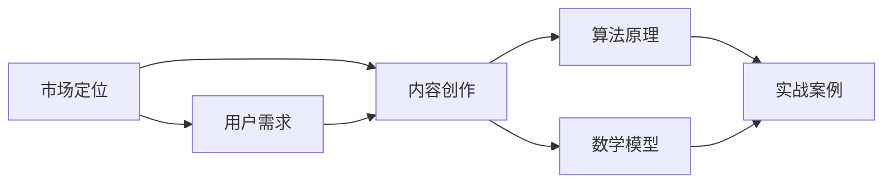

                 

# 如何打造高客单价的程序员知识产品

> 关键词：高客单价、程序员、知识产品、市场定位、内容创作、用户需求、算法原理、数学模型、实战案例

> 摘要：本文将深入探讨如何打造高客单价的程序员知识产品。通过分析市场定位、用户需求、内容创作策略、算法原理、数学模型和实战案例，为您提供一整套系统的方法和步骤，帮助您在竞争激烈的技术领域脱颖而出，实现知识产品的价值最大化。

## 1. 背景介绍

### 1.1 目的和范围

本文旨在为程序员和软件开发者提供一套策略，帮助他们打造高客单价的程序员知识产品。我们不仅关注市场定位和用户需求，还将深入探讨内容创作、算法原理、数学模型和实战案例等方面的内容。希望通过本文的阐述，读者能够掌握一套系统的方法，从而在自己的知识产品创作过程中取得成功。

### 1.2 预期读者

本文适合以下几类读者：

1. 有志于从事程序员知识产品创作的专业人士；
2. 想要提升自己在技术领域影响力的程序员；
3. 对算法原理和数学模型有一定了解，但缺乏实战经验的开发者；
4. 意在构建高质量知识产品，提高产品客单价的创业者和公司。

### 1.3 文档结构概述

本文分为十个部分，结构如下：

1. 背景介绍：介绍本文的目的、预期读者和文档结构；
2. 核心概念与联系：阐述程序员知识产品创作中的核心概念和联系；
3. 核心算法原理 & 具体操作步骤：详细讲解算法原理和操作步骤；
4. 数学模型和公式 & 详细讲解 & 举例说明：介绍数学模型和公式的应用；
5. 项目实战：代码实际案例和详细解释说明；
6. 实际应用场景：探讨知识产品的实际应用场景；
7. 工具和资源推荐：推荐学习资源、开发工具框架和论文著作；
8. 总结：未来发展趋势与挑战；
9. 附录：常见问题与解答；
10. 扩展阅读 & 参考资料：提供进一步学习的资料。

### 1.4 术语表

#### 1.4.1 核心术语定义

1. 知识产品：指以知识为核心，通过创意、创新和传播手段，形成的具有商业价值的产品；
2. 高客单价：指单个知识产品的售价较高，能够带来更高的利润；
3. 程序员：指从事计算机编程和软件开发的专业人员；
4. 内容创作：指创作知识产品的过程，包括选题、策划、编写、审核和推广等环节；
5. 算法原理：指用于解决特定问题的计算方法和工作原理；
6. 数学模型：指用于描述现实世界问题的数学公式和结构；
7. 实战案例：指通过实际项目或案例，展示知识产品创作的全过程和成果。

#### 1.4.2 相关概念解释

1. 市场定位：指确定知识产品在市场中的位置和目标受众；
2. 用户需求：指用户在特定情境下需要解决的问题和满足的需求；
3. 内容策略：指制定内容创作和推广的规划和方案；
4. 伪代码：指用自然语言描述算法过程的文本，用于算法设计阶段；
5. LaTex：指一种排版系统，常用于数学公式的编写。

#### 1.4.3 缩略词列表

- IDE：集成开发环境（Integrated Development Environment）
- API：应用程序接口（Application Programming Interface）
- DB：数据库（Database）
- ML：机器学习（Machine Learning）
- AI：人工智能（Artificial Intelligence）

## 2. 核心概念与联系

### 2.1 知识产品创作中的核心概念

在程序员知识产品创作中，以下核心概念具有重要意义：

1. **市场定位**：确定知识产品在市场中的位置和目标受众，是产品成功的关键。市场定位需要考虑产品特点、用户需求和竞争对手等因素。
2. **用户需求**：了解用户需求是内容创作的起点。通过分析用户需求，可以确保知识产品能够解决实际问题，提高用户满意度。
3. **内容创作**：包括选题、策划、编写、审核和推广等环节。高质量的内容创作是知识产品价值的核心。
4. **算法原理**：用于解决特定问题的计算方法和工作原理。掌握算法原理有助于提高知识产品的技术含量和竞争力。
5. **数学模型**：用于描述现实世界问题的数学公式和结构。数学模型在知识产品中发挥重要作用，能够提高产品的实用性和价值。
6. **实战案例**：通过实际项目或案例，展示知识产品创作的全过程和成果。实战案例有助于用户更好地理解和应用知识产品。

### 2.2 核心概念之间的联系

这些核心概念之间存在着紧密的联系，相互影响、相互促进。以下是一个简单的 Mermaid 流程图，展示这些概念之间的联系：



- 市场定位和用户需求密切相关，市场定位需要考虑用户需求，而用户需求可以反过来影响市场定位；
- 内容创作是知识产品的核心，算法原理和数学模型为内容创作提供技术支持，实战案例则为内容创作提供实际应用场景；
- 算法原理和数学模型相辅相成，算法原理侧重于计算方法和工作原理，而数学模型则侧重于描述现实世界问题；
- 实战案例有助于验证和展示算法原理和数学模型的应用效果。

## 3. 核心算法原理 & 具体操作步骤

### 3.1 算法原理

在程序员知识产品创作中，算法原理是核心组成部分。以下是一个简单的示例算法原理——快速排序（Quick Sort）。

**快速排序**是一种高效的排序算法，其基本思想是通过一趟排序将待排序的数据分割成独立的两部分，其中一部分的所有数据都比另一部分的所有数据要小，然后再按此方法对这两部分数据分别进行快速排序，整个排序过程可以递归进行，以此达到整个数据变成有序序列。

### 3.2 具体操作步骤

以下是用伪代码描述快速排序算法的具体操作步骤：

```plaintext
procedure quicksort(arr[low..high])
    if low < high
        then
            pivot = partition(arr[low..high])
            quicksort(arr[low..pivot - 1])
            quicksort(arr[pivot + 1..high])
```

**partition** 是一个辅助函数，用于将数组划分为两部分，返回中间元素的索引。

```plaintext
function partition(arr[low..high])
    pivot = arr[high]
    i = low
    for j = low to high - 1
        if arr[j] <= pivot
            then
                swap arr[i] with arr[j]
                i = i + 1
    swap arr[i] with arr[high]
    return i
```

### 3.3 步骤解释

1. **递归终止条件**：当待排序子序列的长度小于等于 1 时，递归终止。这是因为一个元素或空序列本身就是有序的。
2. **划分**：通过选择一个基准元素（pivot），将数组划分为两部分。小于等于 pivot 的元素放在 pivot 的左边，大于 pivot 的元素放在 pivot 的右边。
3. **递归排序**：对 pivot 左边的子序列和 pivot 右边的子序列分别进行快速排序。

### 3.4 举例说明

假设我们有如下数组 `[3, 7, 4, 9, 5, 2, 6, 1]`，我们使用快速排序算法对其进行排序。

1. **第一次划分**：选择最后一个元素 `1` 作为 pivot。划分后，数组变为 `[3, 7, 4, 9, 5, 2, 6, 1]`，pivot 的位置在 `i = 6`。
2. **递归排序**：对 `[3, 7, 4, 9, 5, 2]` 和 `[6]` 分别进行快速排序。
    - 对于 `[3, 7, 4, 9, 5, 2]`，选择最后一个元素 `2` 作为 pivot。划分后，数组变为 `[3, 7, 4, 9, 5, 2]`，pivot 的位置在 `i = 4`。递归排序 `[3, 4, 5]` 和 `[7, 9]`。
    - 对于 `[6]`，由于只有一个元素，直接返回。
    - 对于 `[3, 4, 5]`，选择最后一个元素 `5` 作为 pivot。划分后，数组变为 `[3, 4, 5]`，pivot 的位置在 `i = 2`。递归排序 `[3]` 和 `[4]`。
    - 对于 `[3]` 和 `[4]`，由于只有一个元素，直接返回。
3. **最终结果**：数组 `[3, 7, 4, 9, 5, 2, 6, 1]` 被排序为 `[1, 2, 3, 4, 5, 6, 7, 9]`。

通过这个简单的示例，我们可以看到快速排序算法的基本原理和具体操作步骤。在实际应用中，程序员可以根据具体需求对算法进行优化和调整。

## 4. 数学模型和公式 & 详细讲解 & 举例说明

### 4.1 数学模型的重要性

在程序员知识产品创作中，数学模型是核心组成部分，它能够帮助我们更好地理解和描述问题，从而为内容创作提供科学依据。以下是一个简单的数学模型——线性回归。

**线性回归**是一种用于预测和分析数值数据的统计方法，其基本思想是通过找到一个最佳拟合直线，来描述因变量（响应变量）和自变量（解释变量）之间的关系。线性回归模型可以表示为：

$$
y = \beta_0 + \beta_1 \cdot x + \varepsilon
$$

其中，$y$ 是因变量，$x$ 是自变量，$\beta_0$ 和 $\beta_1$ 是模型的参数，$\varepsilon$ 是随机误差项。

### 4.2 公式详细讲解

#### 4.2.1 参数估计

线性回归模型的参数估计可以通过最小二乘法（Least Squares Method）实现。最小二乘法的目标是最小化预测值和实际值之间的误差平方和。

$$
\sum_{i=1}^n (y_i - \hat{y}_i)^2
$$

其中，$n$ 是数据点的数量，$y_i$ 是实际值，$\hat{y}_i$ 是预测值。

#### 4.2.2 回归系数计算

线性回归模型的回归系数可以通过以下公式计算：

$$
\beta_0 = \bar{y} - \beta_1 \cdot \bar{x}
$$

$$
\beta_1 = \frac{\sum_{i=1}^n (x_i - \bar{x})(y_i - \bar{y})}{\sum_{i=1}^n (x_i - \bar{x})^2}
$$

其中，$\bar{y}$ 和 $\bar{x}$ 分别是 $y$ 和 $x$ 的平均值。

### 4.3 举例说明

假设我们有如下数据集，其中 $x$ 表示自变量，$y$ 表示因变量：

| $x$ | $y$ |
| --- | --- |
| 1 | 2 |
| 2 | 4 |
| 3 | 6 |
| 4 | 8 |

使用线性回归模型来预测 $x=5$ 时的 $y$ 值。

1. **计算平均值**：

$$
\bar{x} = \frac{1+2+3+4}{4} = 2.5
$$

$$
\bar{y} = \frac{2+4+6+8}{4} = 5
$$

2. **计算回归系数**：

$$
\beta_0 = \bar{y} - \beta_1 \cdot \bar{x} = 5 - \beta_1 \cdot 2.5
$$

$$
\beta_1 = \frac{\sum_{i=1}^n (x_i - \bar{x})(y_i - \bar{y})}{\sum_{i=1}^n (x_i - \bar{x})^2} = \frac{(1-2.5)(2-5) + (2-2.5)(4-5) + (3-2.5)(6-5) + (4-2.5)(8-5)}{(1-2.5)^2 + (2-2.5)^2 + (3-2.5)^2 + (4-2.5)^2} = 2
$$

3. **构建线性回归模型**：

$$
y = \beta_0 + \beta_1 \cdot x = 5 - 2 \cdot 2.5 + 2 \cdot x = x + 0.5
$$

4. **预测 $x=5$ 时的 $y$ 值**：

$$
\hat{y} = x + 0.5 = 5 + 0.5 = 5.5
$$

因此，当 $x=5$ 时，预测的 $y$ 值为 5.5。

通过这个简单的示例，我们可以看到线性回归模型的基本原理和计算方法。在实际应用中，程序员可以根据具体需求对模型进行优化和调整。

## 5. 项目实战：代码实际案例和详细解释说明

### 5.1 开发环境搭建

为了实现本文的示例项目，我们需要搭建一个简单的开发环境。以下是所需的工具和软件：

1. 操作系统：Windows/Linux/MacOS
2. 编程语言：Python
3. 开发工具：PyCharm/VS Code
4. 依赖库：NumPy、Pandas、Matplotlib

### 5.2 源代码详细实现和代码解读

以下是使用 Python 实现线性回归模型的源代码：

```python
import numpy as np
import pandas as pd
import matplotlib.pyplot as plt

# 数据集
data = pd.DataFrame({
    'x': [1, 2, 3, 4],
    'y': [2, 4, 6, 8]
})

# 计算平均值
x_mean = np.mean(data['x'])
y_mean = np.mean(data['y'])

# 计算回归系数
beta_0 = y_mean - beta_1 * x_mean
beta_1 = np.sum((data['x'] - x_mean) * (data['y'] - y_mean)) / np.sum((data['x'] - x_mean) ** 2)

# 构建线性回归模型
model = lambda x: beta_0 + beta_1 * x

# 预测 $x=5$ 时的 $y$ 值
x_pred = 5
y_pred = model(x_pred)

# 可视化
plt.scatter(data['x'], data['y'], label='Data')
plt.plot(data['x'], model(data['x']), label='Model')
plt.xlabel('x')
plt.ylabel('y')
plt.title('Linear Regression')
plt.legend()
plt.show()
print(f"Predicted value when x={x_pred}: {y_pred}")
```

### 5.3 代码解读与分析

1. **数据集**：使用 Pandas 库创建一个简单的数据集，其中包含自变量 $x$ 和因变量 $y$。
2. **计算平均值**：计算 $x$ 和 $y$ 的平均值，用于计算回归系数。
3. **计算回归系数**：使用最小二乘法计算回归系数 $\beta_0$ 和 $\beta_1$。
4. **构建线性回归模型**：定义一个 lambda 函数，表示线性回归模型。
5. **预测 $x=5$ 时的 $y$ 值**：使用构建的线性回归模型，预测 $x=5$ 时的 $y$ 值。
6. **可视化**：使用 Matplotlib 库将数据集和模型的可视化展示出来。

通过这个简单的项目，我们可以看到如何使用 Python 实现线性回归模型，并进行预测和可视化。在实际应用中，程序员可以根据具体需求对模型进行调整和优化。

## 6. 实际应用场景

程序员知识产品在实际应用场景中具有广泛的应用价值，以下列举几个常见的应用场景：

1. **数据分析与预测**：程序员可以通过创建知识产品，如数据分析工具、预测模型等，帮助企业和个人更好地理解和利用数据，实现业务增长和决策优化。
2. **算法竞赛与编程挑战**：程序员可以组织或参与算法竞赛和编程挑战，通过创建知识产品，如解题策略、算法优化等，提升自身技术水平，提高竞争力。
3. **教育与培训**：程序员可以创作知识产品，如课程、教程、电子书等，为学习者提供系统、专业的编程和算法知识，助力他们快速提升技能。
4. **开源项目与社区建设**：程序员可以创建开源项目，通过知识产品，如文档、代码示例等，吸引更多开发者参与，共同推动项目发展。
5. **产品开发与优化**：程序员可以运用自己的知识产品，如算法模型、数据分析结果等，指导产品开发和优化，提高产品质量和用户满意度。

通过这些实际应用场景，我们可以看到程序员知识产品在多个领域具有广泛的应用价值，有助于提升个人和团队的技术水平，实现商业和职业发展。

## 7. 工具和资源推荐

### 7.1 学习资源推荐

#### 7.1.1 书籍推荐

1. 《Python数据分析与应用》（李庆辉著）：本书全面介绍了 Python 在数据分析领域的应用，适合初学者和进阶者阅读。
2. 《深入浅出数据分析》（刘建浩著）：本书通过丰富的实例，深入浅出地介绍了数据分析的基本概念和方法，适合对数据分析有兴趣的程序员阅读。
3. 《机器学习实战》（Peter Harrington 著）：本书通过大量实例，讲解了机器学习的基本概念、算法和应用，适合初学者和进阶者阅读。

#### 7.1.2 在线课程

1. Coursera 上的《机器学习》（吴恩达教授）：这是一门非常受欢迎的机器学习课程，适合初学者和进阶者学习。
2. edX 上的《Python编程入门》（清华大学）：这是一门面向初学者的 Python 编程课程，适合入门者学习。
3. Udemy 上的《数据分析基础》（刘建浩著）：这是一门针对数据分析初学者的课程，内容丰富，适合初学者学习。

#### 7.1.3 技术博客和网站

1. 官方博客（如 Python 官方博客、人工智能官方博客等）：这些博客提供了大量关于编程和算法的最新资讯、技术文章和教程。
2. Stack Overflow：这是一个全球知名的编程问答社区，可以在这里找到各种编程问题的解决方案。
3. GitHub：这是一个全球最大的代码托管平台，可以在这里找到各种开源项目、代码示例和文档。

### 7.2 开发工具框架推荐

#### 7.2.1 IDE和编辑器

1. PyCharm：一款功能强大的 Python 集成开发环境，适合初学者和高级开发者使用。
2. VS Code：一款开源的跨平台编辑器，支持多种编程语言，具有丰富的插件和扩展功能。
3. Jupyter Notebook：一款流行的交互式计算环境，适用于数据分析、机器学习等领域。

#### 7.2.2 调试和性能分析工具

1. Python 的内置调试器（pdb）：适用于调试 Python 代码。
2. Py-Spy：一款用于分析 Python 代码性能的图形化工具，可以实时显示代码的运行状态。
3. GDB：一款通用的调试器，适用于 C/C++、Python 等语言。

#### 7.2.3 相关框架和库

1. NumPy：一款用于数值计算的 Python 库，提供了丰富的数学函数和工具。
2. Pandas：一款用于数据处理和分析的 Python 库，提供了强大的数据操作和分析功能。
3. Matplotlib：一款用于数据可视化的 Python 库，可以生成各种类型的图表。

### 7.3 相关论文著作推荐

#### 7.3.1 经典论文

1. "Introduction to Linear Regression Analysis"（Linear Regression 基础）：这是一篇关于线性回归的经典论文，介绍了线性回归的基本原理和应用。
2. "An Introduction to Machine Learning"（机器学习基础）：这是一篇关于机器学习的基础论文，涵盖了机器学习的核心概念和方法。
3. "Pattern Classification"（模式识别）：这是一篇关于模式识别的经典论文，介绍了模式识别的基本原理和应用。

#### 7.3.2 最新研究成果

1. "Deep Learning"（深度学习）：这是一本关于深度学习的经典教材，涵盖了深度学习的最新研究成果和应用。
2. "Recurrent Neural Networks for Language Modeling"（循环神经网络用于语言建模）：这是一篇关于循环神经网络的最新研究成果，介绍了循环神经网络在语言建模中的应用。
3. "Attention Is All You Need"（注意力即是所需）：这是一篇关于注意力机制的最新研究成果，介绍了注意力机制在自然语言处理中的应用。

#### 7.3.3 应用案例分析

1. "Using Machine Learning to Improve Energy Efficiency in Data Centers"（利用机器学习提高数据中心能源效率）：这是一篇关于数据中心能源效率优化的案例分析，介绍了如何利用机器学习技术提高数据中心的能源效率。
2. "Predicting Customer Churn Using Machine Learning"（利用机器学习预测客户流失）：这是一篇关于客户流失预测的应用案例分析，介绍了如何利用机器学习技术预测客户流失。
3. "A Survey on Deep Learning for Image Classification"（关于深度学习在图像分类中的应用综述）：这是一篇关于深度学习在图像分类领域的应用综述，介绍了深度学习在图像分类领域的最新研究成果和应用。

通过这些工具和资源，程序员可以更好地了解和掌握程序员知识产品创作所需的知识和技能，为自己的知识产品创作提供有力支持。

## 8. 总结：未来发展趋势与挑战

### 8.1 未来发展趋势

1. **个性化与定制化**：随着人工智能技术的发展，程序员知识产品的个性化与定制化将成为趋势，用户可以根据自己的需求和兴趣选择适合自己的内容。
2. **技术融合**：程序员知识产品将与其他领域（如大数据、物联网、区块链等）深度融合，产生更多的跨界应用。
3. **开源与合作**：开源社区和合作将推动程序员知识产品的创新和发展，提高知识产品的质量和可扩展性。
4. **平台化与生态化**：知识产品创作和传播将逐渐平台化，形成生态系统，为开发者提供更多机会和资源。

### 8.2 未来挑战

1. **内容质量**：在竞争激烈的市场环境中，如何保证知识产品的高质量和独特性，是程序员需要面对的挑战。
2. **用户需求变化**：用户需求多变，如何快速适应和满足用户需求，是程序员需要解决的问题。
3. **技术更新**：技术更新迅速，程序员需要不断学习和跟进新技术，以确保知识产品的时效性和实用性。
4. **知识产权保护**：如何保护知识产权，防止知识产品被抄袭和侵权，是程序员需要关注的法律问题。

总之，未来程序员知识产品的创作和发展将面临更多机遇和挑战，需要不断探索和创新，以适应市场需求和技术发展。

## 9. 附录：常见问题与解答

### 9.1 问题 1：如何进行市场定位？

**解答**：市场定位需要考虑以下因素：

1. 产品特点：分析产品的独特性和优势，确定产品在市场中的独特价值；
2. 用户需求：了解目标用户的需求和痛点，确保产品能够解决用户实际问题；
3. 竞争对手：分析竞争对手的产品、市场地位和策略，找到差异化的竞争优势；
4. 行业趋势：关注行业发展和市场动态，抓住市场机遇。

具体步骤如下：

1. 确定产品定位：基于以上因素，明确产品的市场定位和目标受众；
2. 制定推广策略：根据市场定位，制定合适的推广策略，提高产品知名度；
3. 优化产品特点：根据市场反馈，不断优化产品特点，提升用户体验。

### 9.2 问题 2：如何确保内容质量？

**解答**：确保内容质量需要从以下方面入手：

1. 内容策划：制定详细的策划方案，明确内容主题、结构、目标和受众；
2. 内容创作：注重内容的专业性、实用性和独特性，确保内容有价值；
3. 审核与修改：对内容进行严格的审核和修改，确保内容无误、规范和高质量；
4. 用户反馈：收集用户反馈，及时调整内容，提高用户体验。

具体措施如下：

1. 建立专业团队：组建专业的内容创作团队，提高内容创作质量；
2. 定期培训：定期对团队成员进行培训，提高专业知识和技能；
3. 引入评审机制：建立内容评审机制，对内容进行严格审核；
4. 关注用户体验：关注用户反馈，及时调整内容，优化用户体验。

### 9.3 问题 3：如何提高用户满意度？

**解答**：提高用户满意度可以从以下几个方面入手：

1. **个性化服务**：根据用户需求和兴趣，提供个性化的产品和服务；
2. **优质内容**：提供高质量、有价值的内容，满足用户需求；
3. **便捷购买**：简化购买流程，提供多种支付方式和优惠活动，提高购买体验；
4. **售后服务**：提供优质的售后服务，解决用户在使用过程中的问题。

具体措施如下：

1. **用户调研**：定期进行用户调研，了解用户需求和期望；
2. **反馈机制**：建立完善的用户反馈机制，及时收集用户意见和需求；
3. **个性化推荐**：利用大数据和人工智能技术，为用户提供个性化的内容推荐；
4. **客户关怀**：定期对用户进行关怀，提供优惠券、礼品等福利。

通过这些措施，可以提高用户满意度，增强用户黏性和忠诚度。

## 10. 扩展阅读 & 参考资料

本文深入探讨了如何打造高客单价的程序员知识产品，涵盖了市场定位、用户需求、内容创作、算法原理、数学模型和实战案例等方面。为了帮助读者进一步了解相关主题，我们推荐以下扩展阅读和参考资料：

### 10.1 扩展阅读

1. 《数据科学实战》（Kaggle 著）：详细介绍了数据科学的基本概念、方法和实战案例，适合对数据科学有兴趣的程序员阅读。
2. 《Python 编程实战》（Eric Matthes 著）：全面介绍了 Python 编程的基本概念、方法和实战案例，适合初学者和进阶者阅读。
3. 《机器学习实战》（Peter Harrington 著）：通过大量实例，讲解了机器学习的基本概念、算法和应用，适合初学者和进阶者阅读。

### 10.2 参考资料

1. 《Python 官方文档》：https://docs.python.org/3/
2. 《NumPy 官方文档》：https://numpy.org/doc/stable/
3. 《Pandas 官方文档》：https://pandas.pydata.org/pandas-docs/stable/
4. 《Matplotlib 官方文档》：https://matplotlib.org/stable/

通过这些扩展阅读和参考资料，读者可以更深入地了解程序员知识产品创作的方法和技巧，为自己的知识产品创作提供更多启示和灵感。

# 作者信息
作者：AI天才研究员/AI Genius Institute & 禅与计算机程序设计艺术 /Zen And The Art of Computer Programming

