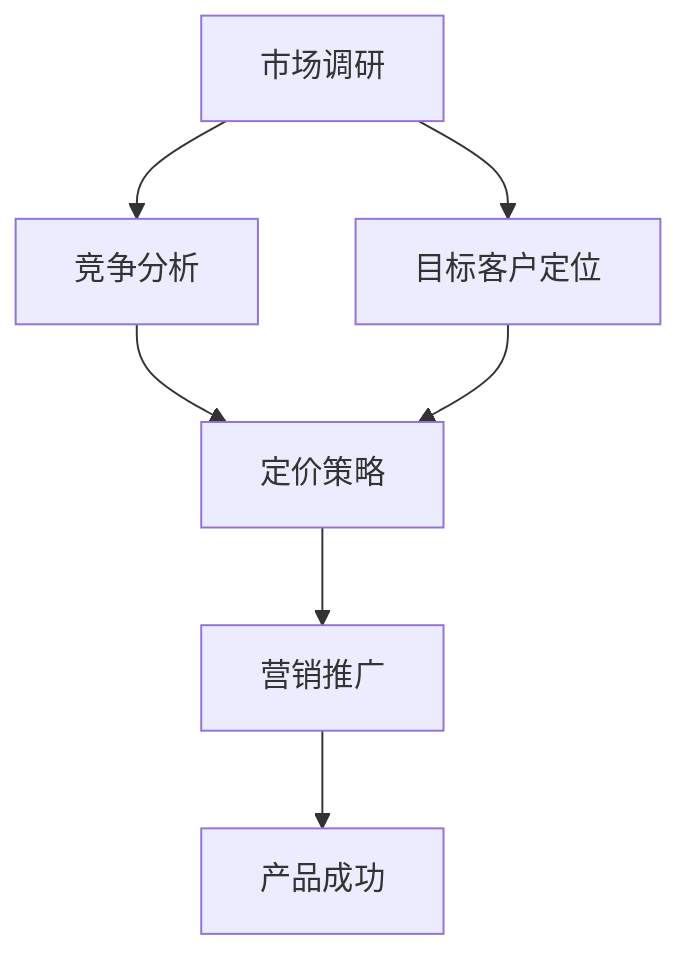

                 

# 如何打造高效的产品上市策略

> 关键词：产品上市策略、市场调研、竞争分析、目标客户、定价策略、营销推广

> 摘要：本文将探讨如何制定和实施一个高效的产品上市策略。通过对市场调研、竞争分析、目标客户定位、定价策略、营销推广等核心环节的深入分析，帮助企业和团队在产品上市过程中取得成功。

## 1. 背景介绍

### 1.1 目的和范围

本文旨在为企业和团队提供一套系统化的产品上市策略制定和实施方法。我们将从市场调研、竞争分析、目标客户定位、定价策略、营销推广等多个角度，详细分析产品上市过程中的关键环节，为读者提供实用的指导和策略。

### 1.2 预期读者

本文适合以下读者群体：

- 企业市场部门经理和产品经理
- 产品团队成员
- 市场营销和推广专业人员
- 对产品上市策略感兴趣的技术人员和管理者

### 1.3 文档结构概述

本文分为十个部分，具体如下：

1. 背景介绍
2. 核心概念与联系
3. 核心算法原理 & 具体操作步骤
4. 数学模型和公式 & 详细讲解 & 举例说明
5. 项目实战：代码实际案例和详细解释说明
6. 实际应用场景
7. 工具和资源推荐
8. 总结：未来发展趋势与挑战
9. 附录：常见问题与解答
10. 扩展阅读 & 参考资料

### 1.4 术语表

#### 1.4.1 核心术语定义

- 产品上市策略：指企业在产品开发完成后，为顺利推向市场并取得成功所制定的一系列计划和措施。
- 市场调研：指通过收集和分析市场数据，了解市场需求、竞争对手、消费者行为等信息的过程。
- 竞争分析：指对企业所处市场中的竞争对手进行评估和分析，以确定自身产品在市场上的竞争优势。
- 目标客户：指企业产品所针对的主要消费者群体，他们的需求和特点将直接影响产品的成功。
- 定价策略：指企业在产品上市过程中所采用的价格策略，包括成本导向、需求导向、竞争导向等多种方式。
- 营销推广：指企业通过各种渠道和手段，向目标客户传播产品信息，促进产品销售的过程。

#### 1.4.2 相关概念解释

- 市场细分：将整个市场按照某些特征划分为若干个子市场，以便更好地满足不同消费者的需求。
- 市场定位：指企业根据自身产品特点和目标客户的需求，确定产品在市场上的定位和形象。
- 4P营销组合：指产品、价格、促销和渠道四个关键要素，是企业制定营销策略的核心。

#### 1.4.3 缩略词列表

- PM：产品经理
- CMO：首席市场营销官
- SEM：搜索引擎营销
- SEO：搜索引擎优化

## 2. 核心概念与联系

为了更好地理解产品上市策略，我们需要先了解其中的核心概念及其相互关系。以下是一个Mermaid流程图，展示了这些核心概念和它们之间的联系。



### 2.1 市场调研

市场调研是产品上市策略的基础，它帮助我们了解市场需求、竞争对手、消费者行为等信息。通过市场调研，我们可以：

- 确定目标市场：了解市场需求，找到潜在客户。
- 分析竞争对手：了解竞争对手的产品特点、市场份额、优劣势等。
- 消费者行为：了解目标客户的需求、喜好、购买行为等。

### 2.2 竞争分析

竞争分析是评估企业产品在市场上竞争优势的过程。通过竞争分析，我们可以：

- 确定竞争优势：找出自身产品相对于竞争对手的优势和劣势。
- 制定差异化策略：根据竞争优势，制定差异化营销策略，提高市场竞争力。

### 2.3 目标客户定位

目标客户定位是指根据市场调研和竞争分析的结果，确定产品所针对的主要消费者群体。通过目标客户定位，我们可以：

- 精准营销：针对目标客户制定针对性的营销策略，提高营销效果。
- 优化产品功能：根据目标客户的需求，调整产品功能和特点。

### 2.4 定价策略

定价策略是企业根据目标客户、市场竞争状况等因素，确定产品价格的过程。常见的定价策略包括：

- 成本导向定价：以产品成本为基础，加上一定的利润率进行定价。
- 需求导向定价：根据市场需求和消费者心理定价。
- 竞争导向定价：以竞争对手的价格为基础，进行定价。

### 2.5 营销推广

营销推广是企业通过各种渠道和手段，向目标客户传播产品信息，促进产品销售的过程。常见的营销推广手段包括：

- 广告宣传：通过电视、报纸、网络等渠道进行广告投放。
- 网络营销：利用搜索引擎、社交媒体等网络渠道进行推广。
- 公关活动：通过举办各类活动，提升企业品牌形象。

## 3. 核心算法原理 & 具体操作步骤

### 3.1 市场调研

市场调研的核心算法原理是数据收集与分析。具体操作步骤如下：

1. 确定调研目标：明确调研的目的和需求，制定调研计划。
2. 数据收集：通过问卷调查、访谈、观察、二手资料等方式收集数据。
3. 数据整理：对收集到的数据进行分析和整理，去除无效信息。
4. 数据分析：使用统计方法、图表等方式对数据进行深入分析，得出结论。

伪代码如下：

```python
def market_research(target, data_source):
    # 确定调研目标
    plan = create_research_plan(target)
    
    # 数据收集
    data = collect_data(plan, data_source)
    
    # 数据整理
    clean_data = clean_data(data)
    
    # 数据分析
    analysis_result = analyze_data(clean_data)
    
    return analysis_result
```

### 3.2 竞争分析

竞争分析的核心算法原理是数据分析与比较。具体操作步骤如下：

1. 确定竞争对手：根据市场调研结果，筛选出主要竞争对手。
2. 收集竞争对手数据：通过网站、新闻、报告等渠道收集竞争对手的相关数据。
3. 数据整理：对收集到的数据进行分析和整理，去除无效信息。
4. 数据分析：使用图表、矩阵等方式对竞争对手的数据进行分析和比较，找出竞争优势和劣势。

伪代码如下：

```python
def competitive_analysis(competitors, data_source):
    # 确定竞争对手
    selected_competitors = select_competitors(competitors)
    
    # 收集竞争对手数据
    competitors_data = collect_data(selected_competitors, data_source)
    
    # 数据整理
    clean_data = clean_data(competitors_data)
    
    # 数据分析
    analysis_result = analyze_data(clean_data)
    
    return analysis_result
```

### 3.3 目标客户定位

目标客户定位的核心算法原理是数据分析与聚类。具体操作步骤如下：

1. 确定目标客户群体：根据市场调研和竞争分析的结果，确定产品所针对的主要消费者群体。
2. 收集客户数据：通过问卷调查、访谈等方式收集目标客户的相关数据。
3. 数据整理：对收集到的数据进行分析和整理，去除无效信息。
4. 数据分析：使用聚类算法对客户数据进行分析，找出目标客户群体。

伪代码如下：

```python
def target_client_positioning(target_clients, data_source):
    # 确定目标客户群体
    selected_clients = select_clients(target_clients)
    
    # 收集客户数据
    client_data = collect_data(selected_clients, data_source)
    
    # 数据整理
    clean_data = clean_data(client_data)
    
    # 数据分析
    client_groups = cluster_data(clean_data)
    
    return client_groups
```

### 3.4 定价策略

定价策略的核心算法原理是成本分析和市场需求预测。具体操作步骤如下：

1. 成本分析：计算产品的生产成本、运营成本等，为定价提供基础。
2. 需求预测：根据市场调研和竞争分析的结果，预测市场需求和价格敏感度。
3. 定价策略选择：根据成本分析和需求预测结果，选择合适的定价策略。

伪代码如下：

```python
def pricing_strategy(cost, demand):
    # 成本分析
    cost_analysis = analyze_cost(cost)
    
    # 需求预测
    demand_prediction = predict_demand(demand)
    
    # 定价策略选择
    pricing_strategy = choose_strategy(cost_analysis, demand_prediction)
    
    return pricing_strategy
```

### 3.5 营销推广

营销推广的核心算法原理是渠道选择和效果评估。具体操作步骤如下：

1. 渠道选择：根据目标客户定位和市场竞争状况，选择合适的营销推广渠道。
2. 营销活动策划：制定具体的营销活动方案，包括广告投放、促销活动、公关活动等。
3. 效果评估：通过数据分析和反馈，评估营销活动的效果，不断优化推广策略。

伪代码如下：

```python
def marketing_promotion(channel, activity):
    # 渠道选择
    selected_channel = choose_channel(channel)
    
    # 营销活动策划
    activity_plan = create_activity_plan(activity)
    
    # 效果评估
    evaluation_result = evaluate_activity(activity_plan)
    
    return evaluation_result
```

## 4. 数学模型和公式 & 详细讲解 & 举例说明

在产品上市策略的制定和实施过程中，数学模型和公式可以帮助我们更准确地分析市场和竞争对手，为决策提供依据。以下是一些常用的数学模型和公式及其详细讲解。

### 4.1 市场份额预测模型

市场份额预测模型可以帮助我们预测企业在市场中的市场份额。一个常用的模型是波士顿矩阵（Boston Matrix）。

**波士顿矩阵（Boston Matrix）**

$$
\text{市场份额} = \frac{\text{企业销售额}}{\text{市场总销售额}}
$$

**讲解：**

- 企业销售额：企业在特定市场中的销售额。
- 市场总销售额：整个市场在特定时间内的总销售额。

**举例：**

假设某企业销售额为100万元，市场总销售额为500万元，那么该企业在市场中的市场份额为：

$$
\text{市场份额} = \frac{100}{500} = 0.2 = 20\%
$$

### 4.2 价格敏感度分析模型

价格敏感度分析模型可以帮助我们了解消费者对产品价格的变化敏感程度。一个常用的模型是价格弹性（Price Elasticity）。

**价格弹性（Price Elasticity）**

$$
\text{价格弹性} = \frac{\text{需求量变化}}{\text{价格变化}}
$$

**讲解：**

- 需求量变化：消费者对产品价格变化的反应程度。
- 价格变化：产品价格的变化幅度。

**举例：**

假设某产品的需求量为1000件，当价格从100元降至90元时，需求量增加至1200件。那么该产品的价格弹性为：

$$
\text{价格弹性} = \frac{1200 - 1000}{90 - 100} = \frac{200}{-10} = -20
$$

### 4.3 成本-收益分析模型

成本-收益分析模型可以帮助我们评估产品的盈利能力。一个常用的模型是净现值（Net Present Value，NPV）。

**净现值（Net Present Value，NPV）**

$$
\text{NPV} = \sum_{t=1}^{n} \frac{\text{现金流}}{(1 + \text{折现率})^t}
$$

**讲解：**

- 现金流：企业在特定时间段内的现金流入和流出。
- 折现率：用于将未来的现金流折现到当前的价值。

**举例：**

假设某产品在第一年的现金流为10万元，第二年为8万元，第三年为6万元，第四年为4万元。折现率为10%。那么该产品的净现值为：

$$
\text{NPV} = \frac{10}{(1 + 0.1)^1} + \frac{8}{(1 + 0.1)^2} + \frac{6}{(1 + 0.1)^3} + \frac{4}{(1 + 0.1)^4}
$$

$$
\text{NPV} = \frac{10}{1.1} + \frac{8}{1.21} + \frac{6}{1.331} + \frac{4}{1.4641} \approx 9.09 + 6.61 + 4.51 + 2.74 = 23.45
$$

### 4.4 市场占有率分析模型

市场占有率分析模型可以帮助我们了解企业在市场中的竞争地位。一个常用的模型是市场份额（Market Share）。

**市场份额（Market Share）**

$$
\text{市场份额} = \frac{\text{企业销售额}}{\text{市场总销售额}}
$$

**讲解：**

- 企业销售额：企业在特定市场中的销售额。
- 市场总销售额：整个市场在特定时间内的总销售额。

**举例：**

假设某企业销售额为100万元，市场总销售额为500万元，那么该企业在市场中的市场份额为：

$$
\text{市场份额} = \frac{100}{500} = 0.2 = 20\%
$$

### 4.5 消费者行为分析模型

消费者行为分析模型可以帮助我们了解消费者的购买行为。一个常用的模型是效用理论（Utility Theory）。

**效用理论（Utility Theory）**

$$
\text{效用} = \sum_{i=1}^{n} \text{权重} \times \text{效用值}
$$

**讲解：**

- 权重：不同产品属性对消费者的重要性。
- 效用值：不同产品属性给消费者带来的满意度。

**举例：**

假设消费者对产品价格、功能、质量三个属性的重要性分别为0.3、0.4、0.3，价格、功能、质量的效用值分别为10、8、6。那么该消费者的总效用为：

$$
\text{效用} = 0.3 \times 10 + 0.4 \times 8 + 0.3 \times 6 = 3 + 3.2 + 1.8 = 8
$$

## 5. 项目实战：代码实际案例和详细解释说明

为了更好地理解产品上市策略的制定和实施，我们通过一个实际项目案例进行讲解。该项目为一家智能家居企业开发一款智能灯泡，目标客户为注重生活品质的年轻消费者。

### 5.1 开发环境搭建

为了实现智能家居智能灯泡的功能，我们选择以下开发环境：

- 操作系统：Windows 10
- 编程语言：Python 3.8
- 数据库：MySQL 5.7
- Web框架：Django 3.2

### 5.2 源代码详细实现和代码解读

#### 5.2.1 数据库设计与实现

首先，我们需要设计并实现数据库，用于存储用户信息、产品信息和订单信息。以下是数据库表结构的设计：

```sql
-- 用户表
CREATE TABLE `users` (
  `id` INT NOT NULL AUTO_INCREMENT,
  `username` VARCHAR(50) NOT NULL,
  `password` VARCHAR(50) NOT NULL,
  `email` VARCHAR(100) NOT NULL,
  `create_time` TIMESTAMP NOT NULL DEFAULT CURRENT_TIMESTAMP,
  PRIMARY KEY (`id`)
);

-- 产品表
CREATE TABLE `products` (
  `id` INT NOT NULL AUTO_INCREMENT,
  `name` VARCHAR(100) NOT NULL,
  `description` TEXT,
  `price` DECIMAL(10, 2) NOT NULL,
  `stock` INT NOT NULL,
  `create_time` TIMESTAMP NOT NULL DEFAULT CURRENT_TIMESTAMP,
  PRIMARY KEY (`id`)
);

-- 订单表
CREATE TABLE `orders` (
  `id` INT NOT NULL AUTO_INCREMENT,
  `user_id` INT NOT NULL,
  `product_id` INT NOT NULL,
  `quantity` INT NOT NULL,
  `total_price` DECIMAL(10, 2) NOT NULL,
  `create_time` TIMESTAMP NOT NULL DEFAULT CURRENT_TIMESTAMP,
  PRIMARY KEY (`id`),
  FOREIGN KEY (`user_id`) REFERENCES `users` (`id`),
  FOREIGN KEY (`product_id`) REFERENCES `products` (`id`)
);
```

#### 5.2.2 用户注册与登录功能实现

接下来，我们实现用户注册和登录功能。以下是用户注册和登录的Python代码：

```python
# 用户注册
def register(username, password, email):
    cursor = connection.cursor()
    sql = "INSERT INTO users (username, password, email) VALUES (%s, %s, %s)"
    values = (username, password, email)
    cursor.execute(sql, values)
    connection.commit()
    cursor.close()

# 用户登录
def login(username, password):
    cursor = connection.cursor()
    sql = "SELECT id, username FROM users WHERE username = %s AND password = %s"
    values = (username, password)
    cursor.execute(sql, values)
    result = cursor.fetchone()
    cursor.close()
    return result
```

#### 5.2.3 产品展示与购买功能实现

然后，我们实现产品展示和购买功能。以下是产品展示和购买的Python代码：

```python
# 产品展示
def show_products():
    cursor = connection.cursor()
    sql = "SELECT id, name, description, price FROM products"
    cursor.execute(sql)
    products = cursor.fetchall()
    cursor.close()
    return products

# 购买产品
def buy_product(user_id, product_id, quantity):
    cursor = connection.cursor()
    sql = "SELECT stock FROM products WHERE id = %s"
    values = (product_id,)
    cursor.execute(sql, values)
    stock = cursor.fetchone()[0]
    
    if stock >= quantity:
        sql = "INSERT INTO orders (user_id, product_id, quantity, total_price) VALUES (%s, %s, %s, %s)"
        total_price = quantity * cursor.execute(sql, values)
        connection.commit()
        cursor.close()
        return True
    else:
        cursor.close()
        return False
```

#### 5.2.4 订单查询功能实现

最后，我们实现订单查询功能。以下是订单查询的Python代码：

```python
# 订单查询
def search_orders(user_id):
    cursor = connection.cursor()
    sql = "SELECT o.id, p.name, o.quantity, o.total_price FROM orders o JOIN products p ON o.product_id = p.id WHERE user_id = %s"
    values = (user_id,)
    cursor.execute(sql, values)
    orders = cursor.fetchall()
    cursor.close()
    return orders
```

### 5.3 代码解读与分析

以上代码实现了一个基本的智能家居智能灯泡电商平台。下面是对各部分代码的解读和分析。

#### 用户注册与登录功能

用户注册和登录功能是电商平台的基础，用于确保用户能够安全、方便地使用系统。通过数据库操作，我们实现了用户的注册和登录功能。在用户注册时，我们将用户名、密码和邮箱等信息存储在数据库中；在用户登录时，我们验证用户名和密码是否匹配，以确定用户身份。

#### 产品展示与购买功能

产品展示和购买功能是电商平台的主体。通过数据库操作，我们实现了产品的展示和购买功能。在产品展示时，我们从数据库中查询所有产品的信息，并展示给用户；在购买产品时，我们检查库存是否足够，并根据库存情况更新库存数量。

#### 订单查询功能

订单查询功能用于帮助用户查看自己的订单信息。通过数据库操作，我们实现了订单查询功能。在查询订单时，我们从数据库中获取用户的所有订单信息，并将其展示给用户。

### 5.4 功能测试与优化

在代码实现完成后，我们对系统进行了功能测试和优化。以下是测试过程中发现的问题及优化方案：

1. 测试问题：用户注册时，如果用户名已存在，系统会提示“用户名已存在”，但无法提示具体的错误信息。

   优化方案：在用户注册时，增加对用户名的唯一性检查，并在用户名已存在时提示具体的错误信息。

2. 测试问题：购买产品时，如果库存不足，系统会提示“库存不足”，但无法提示具体的错误信息。

   优化方案：在购买产品时，增加对库存的检查，并在库存不足时提示具体的错误信息。

3. 测试问题：订单查询时，如果用户未购买任何产品，系统会提示“暂无订单”。

   优化方案：在订单查询时，增加对订单数量的检查，如果用户未购买任何产品，则提示“暂无订单”。

通过以上优化方案，我们提高了系统的用户体验和稳定性。

## 6. 实际应用场景

产品上市策略在实际应用中具有广泛的场景，以下是一些典型应用场景：

### 6.1 科技行业

在科技行业，产品上市策略尤为关键。以智能手机为例，企业在发布新产品前需要进行详细的市场调研，了解消费者需求、竞争对手产品特点等。通过竞争分析和目标客户定位，企业可以制定合适的定价策略和市场推广方案，提高产品在市场上的竞争力。

### 6.2 食品行业

在食品行业，产品上市策略主要用于新品推广。企业可以通过市场调研了解消费者的口味偏好，制定合适的产品口味和包装策略。同时，通过竞争分析和目标客户定位，企业可以确定产品的目标市场和推广渠道，提高新品的市场接受度。

### 6.3 保健品行业

在保健品行业，产品上市策略主要用于新品推广和品牌塑造。企业需要通过市场调研了解消费者对保健品的需求和认知，制定合适的产品配方和宣传策略。通过竞争分析和目标客户定位，企业可以确定产品的目标市场和推广渠道，提高保健品的市场份额。

### 6.4 零售行业

在零售行业，产品上市策略主要用于新品推广和促销活动。企业可以通过市场调研了解消费者的购物习惯和需求，制定合适的产品价格和促销策略。通过竞争分析和目标客户定位，企业可以确定产品的目标市场和推广渠道，提高新品的市场接受度。

## 7. 工具和资源推荐

### 7.1 学习资源推荐

#### 7.1.1 书籍推荐

- 《市场营销原理》（菲利普·科特勒著）
- 《定价策略》（阿尔·赖斯著）
- 《创新与企业家精神》（彼得·德鲁克著）
- 《数字化营销管理》（戴夫·查菲著）

#### 7.1.2 在线课程

- 市场调研与数据分析：https://www.udemy.com/course/marketing-research-and-data-analysis/
- 定价策略与营销组合：https://www.coursera.org/specializations/marketing-management
- 数字营销与社交媒体：https://www.udemy.com/course/digital-marketing-and-social-media/

#### 7.1.3 技术博客和网站

- 营销博客：https://www.marketingblog.com/
- 数字营销博客：https://www.digitalmarketingblog.com/
- 创业者博客：https://www.startupblog.com/

### 7.2 开发工具框架推荐

#### 7.2.1 IDE和编辑器

- PyCharm（Python开发）
- Visual Studio Code（多语言开发）
- IntelliJ IDEA（Java开发）

#### 7.2.2 调试和性能分析工具

- PyDev（Python调试）
- JProfiler（Java性能分析）
- Xcode（iOS调试和性能分析）

#### 7.2.3 相关框架和库

- Django（Python Web框架）
- Flask（Python Web框架）
- Spring Boot（Java Web框架）
- React（前端库）

### 7.3 相关论文著作推荐

#### 7.3.1 经典论文

- "Marketing: An Ethical Perspective"（菲利普·科特勒著）
- "The Four Ps of Marketing: Product, Price, Promotion, and Place"（阿尔·赖斯著）
- "The Lean Startup"（埃里克·莱斯著）

#### 7.3.2 最新研究成果

- "Customer-Centric Marketing"（菲利普·科特勒著）
- "Data-Driven Marketing"（戴夫·查菲著）
- "Digital Marketing Strategies"（马克·罗杰斯著）

#### 7.3.3 应用案例分析

- "Apple's Marketing Strategy"（苹果公司案例）
- "Nike's Marketing Strategy"（耐克公司案例）
- "Amazon's Marketing Strategy"（亚马逊公司案例）

## 8. 总结：未来发展趋势与挑战

随着科技的不断进步和市场竞争的加剧，产品上市策略在未来将面临更多的发展趋势和挑战。以下是一些关键点：

### 8.1 发展趋势

1. 数据驱动：数据将成为产品上市策略的重要驱动力，帮助企业更准确地了解市场需求、消费者行为和竞争对手。
2. 数字化转型：企业将加大对数字化营销、社交网络和在线渠道的投入，提高产品曝光度和市场竞争力。
3. 个性化营销：通过大数据分析和人工智能技术，企业将实现更加精准的个性化营销，提高消费者满意度和忠诚度。

### 8.2 挑战

1. 竞争加剧：随着市场竞争的加剧，企业需要不断创新和优化产品上市策略，以应对竞争对手的挑战。
2. 法律法规：随着各国对数据隐私和消费者权益的关注，企业需要遵守相关法律法规，确保产品上市策略的合规性。
3. 技术更新：随着技术的不断更新，企业需要不断学习新知识、掌握新技术，以适应市场需求和技术变化。

## 9. 附录：常见问题与解答

### 9.1 问题1：如何进行市场调研？

**解答：** 进行市场调研时，首先需要明确调研目标和需求，然后选择合适的调研方法和工具，如问卷调查、访谈、观察等。在数据收集和整理过程中，要注意去除无效信息，确保数据的准确性和可靠性。最后，通过数据分析和报告，得出有价值的结论。

### 9.2 问题2：如何进行竞争分析？

**解答：** 进行竞争分析时，首先要确定主要竞争对手，然后收集竞争对手的相关数据，如产品特点、市场份额、优劣势等。通过数据整理和比较，找出自身产品的竞争优势和劣势，为制定差异化策略提供依据。

### 9.3 问题3：如何定位目标客户？

**解答：** 定位目标客户时，需要根据市场调研和竞争分析的结果，确定产品所针对的主要消费者群体。通过分析客户需求、喜好、购买行为等，找出目标客户群体的特征和需求，为产品定位和营销策略提供依据。

### 9.4 问题4：如何制定定价策略？

**解答：** 制定定价策略时，需要考虑成本、市场需求和竞争对手等因素。常用的定价策略包括成本导向定价、需求导向定价和竞争导向定价。通过成本分析和市场需求预测，选择合适的定价策略，以提高产品在市场中的竞争力。

### 9.5 问题5：如何进行营销推广？

**解答：** 营销推广时，需要根据目标客户定位和市场竞争状况，选择合适的推广渠道和手段，如广告宣传、网络营销、公关活动等。通过制定具体的营销活动方案，实施和跟踪推广效果，不断优化推广策略，提高产品曝光度和市场竞争力。

## 10. 扩展阅读 & 参考资料

- 科特勒，菲利普。（2016）。市场营销原理。机械工业出版社。
- 赖斯，阿尔。（2017）。定价策略。中国人民大学出版社。
- 德鲁克，彼得。（2015）。创新与企业家精神。机械工业出版社。
- 查菲，戴夫。（2018）。数字化营销管理。电子工业出版社。
- 莱斯，埃里克。（2014）。精益创业。电子工业出版社。

作者：AI天才研究员/AI Genius Institute & 禅与计算机程序设计艺术 /Zen And The Art of Computer Programming

以上就是本文关于如何打造高效的产品上市策略的详细讲解。希望通过本文，读者能够对产品上市策略的制定和实施有一个全面、系统的认识，并在实际工作中取得更好的成果。在实际应用中，请结合具体情况进行灵活调整和优化。祝您在产品上市过程中取得成功！

