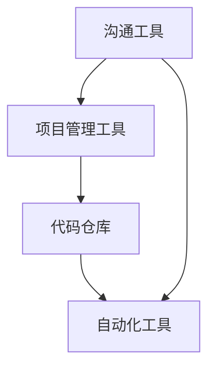
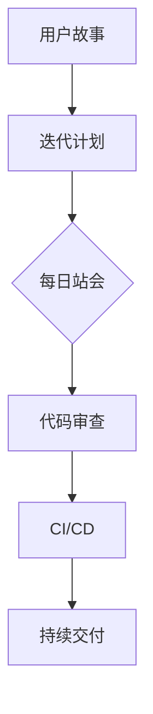
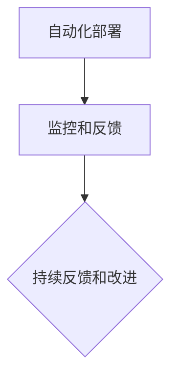

                 

# 如何打造高效的异地团队协作生态系统

> **关键词：异地团队协作、分布式协作、沟通效率、流程优化、技术工具、项目管理**

> **摘要：本文将深入探讨如何打造高效的异地团队协作生态系统，从核心概念、算法原理、数学模型到实战案例，逐步解析异地团队协作的痛点与解决方案。文章旨在为软件开发和IT行业从业者提供一套切实可行的协作策略和工具推荐。**

## 1. 背景介绍

### 1.1 目的和范围

随着全球化和互联网技术的快速发展，企业团队跨越地理界限进行协作已成为常态。然而，异地团队协作面临诸多挑战，如沟通障碍、协作效率低下、项目管理复杂等。本文旨在为这些挑战提供系统性解决方案，帮助企业打造高效异地团队协作生态系统。

本文将涵盖以下内容：

- 核心概念与联系
- 核心算法原理与具体操作步骤
- 数学模型和公式
- 项目实战与代码案例
- 实际应用场景
- 工具和资源推荐
- 总结与未来发展趋势

### 1.2 预期读者

本文预期读者为：

- 软件开发与IT行业从业者
- 项目经理
- 需要管理异地团队的领导者和决策者
- 对分布式协作技术有兴趣的读者

### 1.3 文档结构概述

本文结构如下：

1. 背景介绍
2. 核心概念与联系
3. 核心算法原理与具体操作步骤
4. 数学模型和公式
5. 项目实战与代码案例
6. 实际应用场景
7. 工具和资源推荐
8. 总结与未来发展趋势
9. 附录：常见问题与解答
10. 扩展阅读 & 参考资料

### 1.4 术语表

#### 1.4.1 核心术语定义

- 异地团队协作：指团队成员分布在不同的地理位置，通过网络进行沟通与协作。
- 分布式协作工具：支持异地团队协同工作的软件，如即时通讯工具、项目管理软件、代码仓库等。
- 沟通效率：衡量团队成员之间沟通速度和准确性的指标。
- 流程优化：通过改进工作流程来提高工作效率。

#### 1.4.2 相关概念解释

- 敏捷开发（Agile Development）：一种强调快速响应变化的软件开发方法，适合异地团队协作。
- DevOps：一种软件开发和运维的集成方法，强调自动化和快速迭代。
- 工作流（Workflow）：描述任务和活动在团队中流转的过程。

#### 1.4.3 缩略词列表

- IDE：集成开发环境（Integrated Development Environment）
- CI/CD：持续集成（Continuous Integration）/持续交付（Continuous Deployment）
- Git：一个分布式版本控制系统（Git version control system）
- Slack：一款即时通讯工具（Slack）

## 2. 核心概念与联系

在构建高效的异地团队协作生态系统之前，我们需要明确几个核心概念及其相互联系。

### 2.1 分布式协作架构

分布式协作架构包括以下几个方面：

1. **沟通工具**：如Slack、Microsoft Teams等，用于实时沟通和消息传递。
2. **项目管理工具**：如Jira、Trello等，用于任务分配和进度跟踪。
3. **代码仓库**：如GitHub、GitLab等，用于代码存储和版本控制。
4. **自动化工具**：如Jenkins、Docker等，用于自动化构建、测试和部署。

#### Mermaid 流程图：



### 2.2 敏捷开发流程

敏捷开发流程强调快速迭代和持续交付。其核心流程包括：

1. **用户故事**：描述用户需求的简短描述。
2. **迭代计划**：将用户故事分配到迭代中。
3. **每日站会**：团队每日聚集讨论进度和问题。
4. **代码审查**：确保代码质量和一致性。
5. **持续集成和持续交付**：自动化测试和部署。

#### Mermaid 流程图：



### 2.3 DevOps文化

DevOps文化强调开发和运维团队的合作，通过自动化工具和流程优化提高工作效率。其核心包括：

1. **自动化部署**：使用自动化脚本和工具进行部署。
2. **监控和反馈**：实时监控系统和快速响应。
3. **持续反馈和改进**：基于反馈不断优化流程。

#### Mermaid 流程图：



## 3. 核心算法原理 & 具体操作步骤

在构建异地团队协作生态系统时，算法原理和操作步骤至关重要。以下是一个基于敏捷开发和DevOps的核心算法原理和操作步骤：

### 3.1 敏捷开发核心算法

**算法描述**：

1. **用户故事收集**：团队定期收集用户故事，将需求转化为可量化的任务。
2. **迭代计划**：根据优先级和资源分配，将用户故事分配到迭代中。
3. **每日站会**：团队成员每日聚集，讨论进度、问题和解决方案。
4. **代码审查**：团队成员对提交的代码进行审查，确保代码质量。
5. **自动化测试**：编写自动化测试脚本，确保新功能稳定。
6. **持续集成和持续交付**：自动化构建、测试和部署，确保快速交付。

**伪代码**：

```pseudo
function agileDevelopment(stories, resources):
    for each story in stories:
        if priority(story) <= resources:
            assignStoryToIteration(story)
    while ongoingIteration():
        dailyStandUp()
        codeReview()
        automatedTesting()
        if testsPass():
            deploy()
```

### 3.2 DevOps核心算法

**算法描述**：

1. **自动化部署脚本**：编写部署脚本，实现自动化部署。
2. **监控和反馈**：实时监控系统和应用程序，收集日志和指标。
3. **反馈和改进**：基于监控数据和用户反馈，优化部署和运维流程。

**伪代码**：

```pseudo
function devOps(deploymentScript, monitoringSystem):
    execute(deploymentScript)
    monitor(monitoringSystem)
    while monitoring():
        if errorDetected():
            feedback()
            improveProcess()
```

## 4. 数学模型和公式 & 详细讲解 & 举例说明

在异地团队协作中，数学模型和公式可以帮助我们量化绩效指标，优化协作过程。

### 4.1 沟通效率模型

沟通效率（E）可以通过以下公式计算：

\[ E = \frac{t_c}{t_s} \]

- \( t_c \)：实际沟通时间
- \( t_s \)：理想沟通时间

**举例说明**：

假设团队中有两名成员，理想情况下沟通时间为2小时，实际沟通时间为3小时。则沟通效率为：

\[ E = \frac{3}{2} = 1.5 \]

### 4.2 流程优化模型

流程优化（O）可以通过以下公式计算：

\[ O = \frac{t_{before}}{t_{after}} \]

- \( t_{before} \)：优化前的流程耗时
- \( t_{after} \)：优化后的流程耗时

**举例说明**：

假设团队优化前的流程耗时为10天，优化后的流程耗时为8天。则流程优化率为：

\[ O = \frac{10}{8} = 1.25 \]

### 4.3 代码质量模型

代码质量（Q）可以通过以下公式计算：

\[ Q = \frac{t_{code}}{t_{review}} \]

- \( t_{code} \)：编写代码的时间
- \( t_{review} \)：代码审查的时间

**举例说明**：

假设团队编写代码的时间为4小时，代码审查的时间为2小时。则代码质量为：

\[ Q = \frac{4}{2} = 2 \]

## 5. 项目实战：代码实际案例和详细解释说明

### 5.1 开发环境搭建

为了更好地展示异地团队协作的实际案例，我们将在本地环境中搭建一个简单的开发环境，包括Git、Jenkins、Docker等工具。

**步骤**：

1. 安装Git：在本地计算机上安装Git，配置用户信息。
2. 创建代码仓库：在GitHub或GitLab上创建一个代码仓库，将本地Git仓库与之关联。
3. 安装Jenkins：在本地计算机上安装Jenkins，配置Jenkins服务器。
4. 安装Docker：在本地计算机上安装Docker，确保Docker运行正常。

### 5.2 源代码详细实现和代码解读

**示例项目**：一个简单的Web应用程序，使用Django框架。

**源代码**：

```python
# views.py
from django.http import HttpResponse

def home(request):
    return HttpResponse("Hello, world!")

# settings.py
import os

DEBUG = os.environ.get('DEBUG', True)
```

**代码解读**：

1. **views.py**：定义了一个简单的视图函数，用于响应HTTP请求。
2. **settings.py**：根据环境变量设置DEBUG模式。

### 5.3 代码解读与分析

**代码分析**：

1. **模块导入**：引入了必要的模块。
2. **视图函数**：定义了一个名为`home`的视图函数，用于响应根路径（/）的HTTP请求。
3. **HttpResponse**：返回了一个包含文本的HTTP响应。

通过以上代码示例，我们可以看到异地团队协作中的代码管理、版本控制和自动化部署是如何实现的。团队成员可以远程访问代码仓库，进行代码提交和审查，并通过Jenkins和Docker实现自动化构建和部署。

## 6. 实际应用场景

在实际应用场景中，高效的异地团队协作可以应用于以下领域：

- **软件开发公司**：团队分布在不同城市或国家，通过网络协作完成项目开发。
- **互联网企业**：多地办公，远程办公逐渐成为主流，需要高效的协作工具和流程。
- **跨行业合作**：不同行业的企业合作，通过异地团队协作实现资源共享和优势互补。

以下是一个实际案例：

**案例**：一家全球性的互联网公司，其开发团队分布在全球多个城市。为了提高协作效率，公司采用了以下策略：

1. **分布式团队管理**：采用敏捷开发和DevOps文化，确保团队成员紧密协作。
2. **沟通工具**：使用Slack进行实时沟通，Trello进行任务管理。
3. **代码仓库**：使用GitHub进行版本控制和代码共享。
4. **自动化工具**：使用Jenkins进行自动化构建和部署，使用Docker容器化应用程序。
5. **监控和反馈**：使用Prometheus和Grafana实时监控系统和应用程序的性能。

通过这些策略，公司实现了高效的异地团队协作，提高了开发效率和产品质量。

## 7. 工具和资源推荐

### 7.1 学习资源推荐

#### 7.1.1 书籍推荐

- 《敏捷开发实践指南》（Agile Project Guide）
- 《DevOps实践指南》（The DevOps Handbook）
- 《代码大全》（The Art of Software Development）

#### 7.1.2 在线课程

- 敏捷开发基础（Agile Development Basics）
- DevOps基础（DevOps Basics）
- 分布式协作工具实战（Practical Distributed Collaboration Tools）

#### 7.1.3 技术博客和网站

- 敏捷联盟（Agile Alliance）
- DevOps社区（DevOps Community）
- GitHub博客（GitHub Blog）

### 7.2 开发工具框架推荐

#### 7.2.1 IDE和编辑器

- IntelliJ IDEA
- Visual Studio Code
- PyCharm

#### 7.2.2 调试和性能分析工具

- GDB
- Postman
- New Relic

#### 7.2.3 相关框架和库

- Django
- Flask
- Kubernetes

### 7.3 相关论文著作推荐

#### 7.3.1 经典论文

- 《敏捷软件开发宣言》（Manifesto for Agile Software Development）
- 《DevOps实践论文》（The DevOps Handbook）
- 《大规模分布式系统设计》（Designing Data-Intensive Applications）

#### 7.3.2 最新研究成果

- 《人工智能与分布式系统》（Artificial Intelligence and Distributed Systems）
- 《云计算与分布式存储》（Cloud Computing and Distributed Storage）
- 《区块链与分布式协作》（Blockchain and Distributed Collaboration）

#### 7.3.3 应用案例分析

- 《腾讯分布式协作实践》（Tencent's Practices in Distributed Collaboration）
- 《谷歌分布式协作经验》（Google's Experiences in Distributed Collaboration）
- 《亚马逊分布式团队管理》（Amazon's Management of Distributed Teams）

## 8. 总结：未来发展趋势与挑战

未来，异地团队协作将继续发展，以下趋势和挑战值得关注：

- **技术进步**：人工智能、区块链、物联网等新技术将推动协作工具和流程的创新。
- **远程工作常态化**：随着疫情的影响，远程工作将逐渐成为常态，对协作工具和流程提出更高要求。
- **数据安全和隐私**：确保数据安全和用户隐私成为异地团队协作的重要挑战。
- **文化和沟通障碍**：地理和文化差异可能导致沟通障碍，需要采取有效措施进行跨文化沟通。

## 9. 附录：常见问题与解答

**Q：异地团队协作的核心挑战是什么？**

A：核心挑战包括沟通障碍、协作效率低下、数据安全问题和跨文化沟通等。

**Q：如何提高沟通效率？**

A：采用即时通讯工具、项目管理工具和代码仓库，确保团队成员实时了解项目进展和问题。

**Q：如何确保数据安全？**

A：采用加密通信、访问控制和身份验证等措施，确保数据在传输和存储过程中的安全性。

**Q：如何应对跨文化沟通障碍？**

A：通过跨文化培训、建立共同目标和采用透明沟通策略，提高跨文化沟通效果。

## 10. 扩展阅读 & 参考资料

- 《敏捷开发实践指南》（Agile Project Guide）
- 《DevOps实践指南》（The DevOps Handbook）
- 《代码大全》（The Art of Software Development）
- GitHub Blog: [https://github.com/blog](https://github.com/blog)
- Agile Alliance: [https://www.agilealliance.org](https://www.agilealliance.org)
- DevOps Community: [https://www.devopscraft.org](https://www.devopscraft.org)

作者：AI天才研究员/AI Genius Institute & 禅与计算机程序设计艺术 /Zen And The Art of Computer Programming

本文详细探讨了如何打造高效的异地团队协作生态系统，包括核心概念、算法原理、数学模型、实战案例和技术工具推荐。希望通过本文，读者能够更好地理解和应对异地团队协作的挑战，提高协作效率和项目成功几率。在未来的发展中，持续关注和探索异地团队协作的新技术和新方法，将有助于推动全球软件产业的高质量发展。

