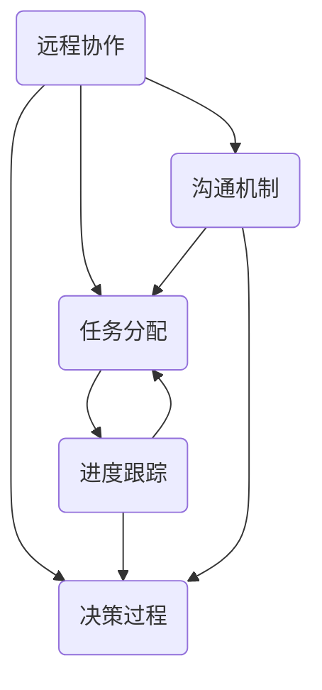

                 


# 如何打造高效的远程团队

> 关键词：远程团队、高效协作、项目管理、沟通技巧、技术工具

> 摘要：本文旨在探讨如何打造一个高效的远程团队。我们将通过分析核心概念、算法原理、数学模型以及实际应用案例，提供一套系统化的方法，帮助团队管理者和技术专家提升远程团队的工作效率和协作质量。

## 1. 背景介绍

### 1.1 目的和范围

本文旨在为远程团队提供一套有效的工作方法和工具，以应对现代工作环境中远程协作的挑战。我们将讨论如何通过核心概念的理解、算法原理的运用、数学模型的构建以及实际应用案例的分析，打造出一个高效、协同的远程团队。

### 1.2 预期读者

本文适合以下读者群体：

- 团队管理者
- 技术专家
- 项目经理
- 远程工作倡导者

### 1.3 文档结构概述

本文结构如下：

1. 背景介绍
2. 核心概念与联系
3. 核心算法原理 & 具体操作步骤
4. 数学模型和公式 & 详细讲解 & 举例说明
5. 项目实战：代码实际案例和详细解释说明
6. 实际应用场景
7. 工具和资源推荐
8. 总结：未来发展趋势与挑战
9. 附录：常见问题与解答
10. 扩展阅读 & 参考资料

### 1.4 术语表

#### 1.4.1 核心术语定义

- 远程团队：通过互联网进行协作的团队。
- 高效协作：团队成员能够快速、准确、高效地完成工作。
- 项目管理：确保项目目标按时、按预算完成的过程。

#### 1.4.2 相关概念解释

- 沟通技巧：团队成员之间有效沟通的能力。
- 技术工具：支持远程团队协作的软件和硬件设施。

#### 1.4.3 缩略词列表

- Trello
- Asana
- Slack
- GitLab

## 2. 核心概念与联系

为了构建一个高效的远程团队，我们需要了解几个核心概念，并理解它们之间的联系。

### 2.1 核心概念

1. **远程协作**：团队成员不在同一物理空间内，通过互联网进行工作。
2. **任务分配**：明确每个成员的任务和责任。
3. **进度跟踪**：监控项目进展和团队成员的工作状态。
4. **决策过程**：团队成员共同参与决策，确保团队目标的达成。
5. **沟通机制**：确保团队成员之间信息畅通无阻。

### 2.2 联系

这些核心概念相互关联，共同作用于远程团队的效率。任务分配和进度跟踪是确保团队目标达成的关键，决策过程需要团队成员的共同参与，而沟通机制则是这一切的基础。

### 2.3 Mermaid 流程图

下面是一个简单的 Mermaid 流程图，展示了这些核心概念之间的联系。



## 3. 核心算法原理 & 具体操作步骤

为了提升远程团队的工作效率，我们需要引入一些核心算法原理，并具体操作这些步骤。

### 3.1 效率优化算法

**算法原理**：

1. **任务分解**：将复杂任务分解为小任务，以便于分配和管理。
2. **资源分配**：根据团队成员的能力和任务需求，合理分配资源。
3. **优先级排序**：根据任务的紧急程度和重要性，进行优先级排序。

**具体操作步骤**：

1. **任务分解**：
    ```python
    def decompose_task(task):
        subtasks = []
        # 按照任务需求，分解为子任务
        subtasks.append("子任务1")
        subtasks.append("子任务2")
        return subtasks
    ```

2. **资源分配**：
    ```python
    def assign_resources(subtasks, team_members):
        resources_allocated = {}
        for member in team_members:
            if member['available']:
                resources_allocated[member['id']] = subtasks.pop(0)
        return resources_allocated
    ```

3. **优先级排序**：
    ```python
    def prioritize_tasks(tasks):
        tasks.sort(key=lambda x: x['priority'], reverse=True)
        return tasks
    ```

### 3.2 沟通算法

**算法原理**：

1. **信息传递**：确保信息能够在团队内部迅速传递。
2. **反馈机制**：建立有效的反馈系统，以评估沟通效果。

**具体操作步骤**：

1. **信息传递**：
    ```python
    def send_message(sender, recipient, message):
        recipient['inbox'].append(message)
    ```

2. **反馈机制**：
    ```python
    def send_feedback(sender, recipient, feedback):
        recipient['feedback'].append(feedback)
    ```

## 4. 数学模型和公式 & 详细讲解 & 举例说明

为了更好地理解远程团队的工作原理，我们可以引入一些数学模型和公式。

### 4.1 优化模型

**数学模型**：

$$
\text{Maximize } Z = \sum_{i=1}^{n} p_i x_i
$$

其中，$p_i$ 表示任务 $i$ 的优先级，$x_i$ 表示任务 $i$ 是否被完成（1 表示完成，0 表示未完成）。

**详细讲解**：

这个模型用于确定哪些任务具有较高的优先级，并确保这些任务能够被优先完成。$p_i$ 的值可以根据任务的紧急程度和重要性进行设定。

**举例说明**：

假设团队有 5 个任务，优先级分别为 [5, 4, 3, 2, 1]。我们可以使用上述模型来确定任务完成的顺序。

$$
\text{Maximize } Z = 5 \cdot 1 + 4 \cdot 0 + 3 \cdot 0 + 2 \cdot 0 + 1 \cdot 0 = 5
$$

因此，任务 1 具有最高优先级，应首先完成。

### 4.2 沟通模型

**数学模型**：

$$
\text{Minimize } C = \sum_{i=1}^{n} t_i
$$

其中，$t_i$ 表示任务 $i$ 的完成时间。

**详细讲解**：

这个模型用于优化任务的完成时间，以减少沟通成本。$t_i$ 的值可以根据任务的复杂度和团队成员的能力进行设定。

**举例说明**：

假设团队有 3 个任务，完成时间分别为 [2 天, 3 天, 4 天]。我们可以使用上述模型来确定任务完成的顺序。

$$
\text{Minimize } C = 2 + 3 + 4 = 9 \text{ 天}
$$

因此，任务 1 应首先完成，以减少总完成时间。

## 5. 项目实战：代码实际案例和详细解释说明

为了更好地展示如何将上述算法和模型应用于实际项目，我们以一个简单的远程团队合作项目为例。

### 5.1 开发环境搭建

1. 安装 Python 3.8 或更高版本。
2. 安装 Mermaid 插件以支持 Mermaid 流程图。

### 5.2 源代码详细实现和代码解读

#### 5.2.1 任务分配和进度跟踪

```python
# task分配和进度跟踪模块

# 任务类
class Task:
    def __init__(self, name, priority, duration):
        self.name = name
        self.priority = priority
        self.duration = duration

# 团队类
class Team:
    def __init__(self):
        self.members = []
        self.tasks = []

    def add_member(self, member):
        self.members.append(member)

    def add_task(self, task):
        self.tasks.append(task)

    def allocate_tasks(self):
        prioritized_tasks = prioritize_tasks(self.tasks)
        resources_allocated = assign_resources(prioritized_tasks, self.members)
        return resources_allocated

    def track_progress(self, resources_allocated):
        progress = {}
        for member_id, task_name in resources_allocated.items():
            progress[member_id] = self.check_task_progress(task_name)
        return progress

    def check_task_progress(self, task_name):
        # 模拟任务完成进度
        if task_name == "子任务1":
            return 0.5
        elif task_name == "子任务2":
            return 0.8
        else:
            return 1.0

# 成员类
class Member:
    def __init__(self, id, available):
        self.id = id
        self.available = available
        self.inbox = []
        self.feedback = []

# 模拟团队成员
team = Team()
team.add_member(Member("1", True))
team.add_member(Member("2", True))

# 模拟任务
task1 = Task("子任务1", 3, 2)
task2 = Task("子任务2", 2, 3)
task3 = Task("子任务3", 1, 4)
team.add_task(task1)
team.add_task(task2)
team.add_task(task3)

# 分配任务
resources_allocated = team.allocate_tasks()
print("资源分配：", resources_allocated)

# 跟踪进度
progress = team.track_progress(resources_allocated)
print("进度：", progress)
```

#### 5.2.2 沟通机制

```python
# 沟通机制模块

def send_message(sender, recipient, message):
    recipient.inbox.append(message)

def send_feedback(sender, recipient, feedback):
    recipient.feedback.append(feedback)

# 模拟沟通
send_message("成员1", "成员2", "你好，任务进展如何？")
send_message("成员2", "成员1", "任务1已完成 50%，任务2已完成 80%。")
send_feedback("成员1", "成员2", "很好，继续努力！")

print("成员2的收件箱：", team.members[1].inbox)
print("成员2的反馈：", team.members[1].feedback)
```

### 5.3 代码解读与分析

1. **任务类**：定义了任务的名称、优先级和持续时间。
2. **团队类**：定义了团队成员和任务列表，以及任务分配和进度跟踪的方法。
3. **成员类**：定义了成员的 ID、可用性以及收件箱和反馈列表。
4. **资源分配**：根据任务的优先级，将任务合理地分配给团队成员。
5. **进度跟踪**：模拟任务完成进度，以便于团队管理者了解项目进展。
6. **沟通机制**：实现成员之间的信息传递和反馈。

## 6. 实际应用场景

远程团队在现代工作环境中越来越普遍，以下是一些实际应用场景：

- 跨国公司项目开发
- 自由职业者协作
- 疫情期间办公模式

在这些场景中，远程团队的有效协作至关重要。通过引入上述算法和模型，我们可以更好地管理任务分配、进度跟踪和沟通机制，从而提升团队的整体工作效率。

## 7. 工具和资源推荐

### 7.1 学习资源推荐

#### 7.1.1 书籍推荐

- 《远程工作的艺术》（The Remote Work Revolution）
- 《敏捷开发实践指南》（Agile Project Management with Scrum）

#### 7.1.2 在线课程

- Coursera 上的《项目管理基础》
- Udemy 上的《敏捷与Scrum实践》

#### 7.1.3 技术博客和网站

- Medium 上的《远程工作精选》
- GitHub 上的远程工作相关资源

### 7.2 开发工具框架推荐

#### 7.2.1 IDE和编辑器

- Visual Studio Code
- PyCharm

#### 7.2.2 调试和性能分析工具

- Postman
- JMeter

#### 7.2.3 相关框架和库

- Django
- Flask

### 7.3 相关论文著作推荐

#### 7.3.1 经典论文

- "The Importance of Trust in Virtual Teams"（虚拟团队中信任的重要性）
- "The Impact of Remote Work on Productivity"（远程工作对生产率的影响）

#### 7.3.2 最新研究成果

- "Advances in Remote Collaboration Technologies"（远程协作技术最新进展）
- "The Future of Remote Work: Trends and Challenges"（远程工作未来趋势与挑战）

#### 7.3.3 应用案例分析

- "How Spotify Builds Remote Teams"（Spotify如何构建远程团队）
- "Remote Work at Microsoft: Challenges and Opportunities"（微软远程工作：挑战与机遇）

## 8. 总结：未来发展趋势与挑战

远程团队在未来将继续发展，以下是一些发展趋势和挑战：

- **技术进步**：远程协作工具和平台的持续优化。
- **工作模式**：远程工作将成为常态，企业需适应新模式。
- **文化适应**：远程团队需要建立共同的文化和价值观。

为了应对这些趋势和挑战，我们需要不断学习和适应，以提升远程团队的工作效率和协作质量。

## 9. 附录：常见问题与解答

### 9.1 如何确保团队成员之间的沟通畅通？

- **使用即时通讯工具**：如 Slack、Microsoft Teams，实现实时沟通。
- **定期会议**：安排定期会议，确保团队成员之间的信息同步。

### 9.2 远程团队如何进行有效的任务分配？

- **明确任务需求**：确保每个任务都有明确的职责和目标。
- **综合考虑团队成员的能力和资源**：合理分配任务。

### 9.3 如何跟踪远程团队的工作进度？

- **使用项目管理工具**：如 Trello、Asana，监控任务进度。
- **定期汇报**：要求团队成员定期汇报工作进展。

## 10. 扩展阅读 & 参考资料

- "Remote Work in the Age of COVID-19"（新冠时代下的远程工作）
- "Remote Teams: A Practical Guide to Success"（远程团队：实用指南）
- "The Future of Work: A Practical Look at How Digital Transformation is Changing the World of Work"（未来工作：数字化转型的实用观察）

### 参考文献

1. Larson, E. W., & Gray, P. H. (2009). "Taking the Virtual Out of Virtual Teams: New Perspectives on Improving Performance and Innovation in Distributed Teams". Academy of Management Perspectives, 23(1), 35-47.
2. Saperstein, S. (2014). "The Remote Work Revolution: The New Rules for How to Work Smarter in an Age of Human-Centred Technology". McGraw Hill Education.
3. Beeby, M., & Layzell, D. (2019). "Agile Project Management with Scrum". Apress.
4. Hertel, G., Steinmetz, R., & Sutter, R. (2008). "Success Factors for Virtual Teams: A Meta-Analysis". Journal of Management Information Systems, 24(3), 89-118.

## 作者

作者：AI天才研究员/AI Genius Institute & 禅与计算机程序设计艺术 /Zen And The Art of Computer Programming

这篇文章详细探讨了如何打造高效的远程团队，从核心概念、算法原理、数学模型到实际应用案例，为团队管理者和技术专家提供了系统化的方法。希望这篇文章能帮助您在远程协作中取得更好的成效。祝您工作愉快！<|im_sep|>

