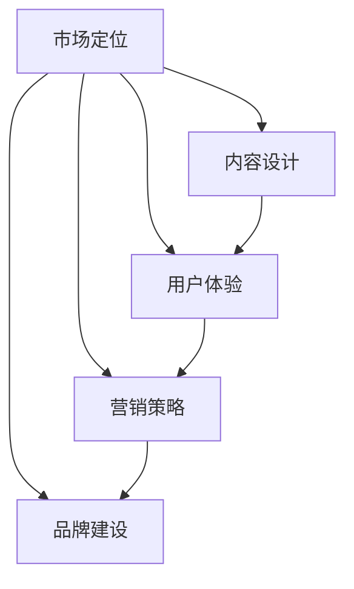

                 

# 如何打造高认可度的程序员知识付费产品

> 关键词：程序员，知识付费产品，市场定位，内容设计，用户体验，营销策略，品牌建设

> 摘要：本文旨在探讨如何打造高认可度的程序员知识付费产品。通过分析市场需求、用户行为、内容设计和营销策略等方面，为程序员知识付费产品的开发者提供实用的指导和建议。

## 1. 背景介绍

### 1.1 目的和范围

本文的目标是帮助程序员知识付费产品的开发者了解市场趋势，明确目标用户群体，设计高质量的内容，制定有效的营销策略，从而打造出高认可度的知识付费产品。

本文的范围包括以下几个方面：

- 市场定位和用户分析
- 内容设计和用户体验
- 营销策略和品牌建设
- 工具和资源的推荐

### 1.2 预期读者

本文的预期读者包括：

- 程序员知识付费产品的开发者
- 对程序员知识付费市场感兴趣的研究人员
- 对编程和技术有兴趣的学习者

### 1.3 文档结构概述

本文的结构如下：

- 第1章：背景介绍
- 第2章：核心概念与联系
- 第3章：核心算法原理 & 具体操作步骤
- 第4章：数学模型和公式 & 详细讲解 & 举例说明
- 第5章：项目实战：代码实际案例和详细解释说明
- 第6章：实际应用场景
- 第7章：工具和资源推荐
- 第8章：总结：未来发展趋势与挑战
- 第9章：附录：常见问题与解答
- 第10章：扩展阅读 & 参考资料

### 1.4 术语表

#### 1.4.1 核心术语定义

- 程序员知识付费产品：以付费形式提供给程序员的各类知识服务，包括在线课程、电子书、编程工具、技术博客等。
- 市场定位：确定产品在市场中的位置，包括目标用户、竞争对手和差异化优势。
- 内容设计：设计适合目标用户的学习内容和教学方式。
- 用户体验：用户在使用产品过程中的感受和体验。
- 营销策略：推广产品的策略和方法。
- 品牌建设：建立和维护产品在市场上的品牌形象。

#### 1.4.2 相关概念解释

- 在线教育：利用互联网技术进行教育和学习的方式。
- 付费用户：为产品付费的用户。
- 用户粘性：用户对产品的忠诚度和依赖程度。

#### 1.4.3 缩略词列表

- HTML：超文本标记语言（HyperText Markup Language）
- CSS：层叠样式表（Cascading Style Sheets）
- JS：JavaScript
- API：应用程序编程接口（Application Programming Interface）
- SEO：搜索引擎优化（Search Engine Optimization）
- SMM：社交媒体营销（Social Media Marketing）

## 2. 核心概念与联系

在打造高认可度的程序员知识付费产品时，需要关注以下几个核心概念和它们之间的联系：

1. **市场定位**：明确目标用户和竞争对手，找到差异化的市场定位。
2. **内容设计**：设计满足用户需求的内容，包括课程、电子书、编程工具等。
3. **用户体验**：优化用户在使用产品过程中的体验，提高用户粘性。
4. **营销策略**：制定有效的推广策略，提高产品知名度和用户转化率。
5. **品牌建设**：建立和维护产品在市场上的品牌形象。

下面是一个简单的 Mermaid 流程图，展示了这些核心概念之间的关系：



## 3. 核心算法原理 & 具体操作步骤

在程序员知识付费产品的开发过程中，算法原理和操作步骤是关键因素。以下是一个简单的算法原理和操作步骤的伪代码：

```plaintext
算法：打造高认可度的程序员知识付费产品

步骤：
1. 确定市场定位（目标用户、竞争对手、差异化优势）
2. 设计内容（课程、电子书、编程工具等）
3. 优化用户体验（界面设计、互动功能、学习路径等）
4. 制定营销策略（SEO、SMM、广告投放等）
5. 建立品牌形象（品牌设计、口碑营销、活动推广等）

伪代码：
```

接下来，我们将详细讲解每个步骤的算法原理和操作步骤。

### 3.1 确定市场定位

市场定位是产品成功的关键。以下是一个简单的市场定位算法原理和操作步骤：

```plaintext
算法：确定市场定位

步骤：
1. 收集市场信息（目标用户需求、竞争对手分析、行业趋势等）
2. 确定目标用户（年龄、性别、职业、兴趣等）
3. 分析竞争对手（产品特点、价格、市场占有率等）
4. 确定差异化优势（产品独特性、服务质量、品牌知名度等）
5. 确定市场定位策略（价格定位、品牌定位、渠道定位等）

伪代码：
```

### 3.2 设计内容

内容设计是程序员知识付费产品的核心。以下是一个简单的内容设计算法原理和操作步骤：

```plaintext
算法：设计内容

步骤：
1. 确定课程主题（编程语言、框架、算法等）
2. 设计课程大纲（章节、知识点、实战案例等）
3. 确定电子书内容（技术文档、教程、案例分析等）
4. 设计编程工具（代码编辑器、调试工具、集成开发环境等）
5. 确定内容更新策略（定期更新、用户反馈改进等）

伪代码：
```

### 3.3 优化用户体验

用户体验是用户粘性的关键。以下是一个简单的用户体验优化算法原理和操作步骤：

```plaintext
算法：优化用户体验

步骤：
1. 设计用户界面（简洁、直观、易操作）
2. 添加互动功能（评论、问答、在线讨论等）
3. 确定学习路径（个性化推荐、阶段性测试等）
4. 优化响应速度（提高服务器性能、优化代码等）
5. 收集用户反馈（问卷调查、用户调研等）
6. 根据反馈进行改进（界面优化、功能改进等）

伪代码：
```

### 3.4 制定营销策略

营销策略是提高产品知名度和用户转化率的关键。以下是一个简单的营销策略算法原理和操作步骤：

```plaintext
算法：制定营销策略

步骤：
1. 确定目标市场（年龄、性别、职业、兴趣等）
2. 确定营销渠道（搜索引擎、社交媒体、内容营销等）
3. 制定推广计划（广告投放、活动推广、内容营销等）
4. 确定营销预算（预算分配、效果评估等）
5. 监控营销效果（用户转化率、点击率、ROI等）
6. 根据效果调整策略（优化广告投放、内容推广等）

伪代码：
```

### 3.5 建立品牌形象

品牌形象是产品在市场中的口碑和信誉。以下是一个简单的品牌形象建设算法原理和操作步骤：

```plaintext
算法：建立品牌形象

步骤：
1. 设计品牌标识（LOGO、色彩、字体等）
2. 制定品牌口号（简洁、有力、易于传播等）
3. 建立官方网站（设计、内容、SEO等）
4. 进行口碑营销（用户评价、案例分享、推荐等）
5. 参与行业活动（展会、研讨会、论坛等）
6. 合作伙伴关系（行业联盟、战略合作等）

伪代码：
```

## 4. 数学模型和公式 & 详细讲解 & 举例说明

在程序员知识付费产品的开发和运营中，数学模型和公式是重要的工具。以下是一个简单的数学模型和公式的详细讲解及举例说明：

### 4.1 用户转化率

用户转化率是衡量营销策略效果的重要指标。用户转化率可以用以下公式表示：

$$
\text{用户转化率} = \frac{\text{付费用户数}}{\text{访客数}} \times 100\%
$$

#### 详细讲解：

- **付费用户数**：在特定时间内，为产品付费的用户数量。
- **访客数**：在特定时间内，访问产品的用户数量。

#### 举例说明：

假设某程序员知识付费产品在一个月内吸引了1000名访客，其中有200名用户付费，那么该产品的用户转化率为：

$$
\text{用户转化率} = \frac{200}{1000} \times 100\% = 20\%
$$

### 4.2 营销ROI

营销ROI（投资回报率）是衡量营销投入效果的重要指标。营销ROI可以用以下公式表示：

$$
\text{营销ROI} = \frac{\text{收益} - \text{投入}}{\text{投入}} \times 100\%
$$

#### 详细讲解：

- **收益**：在特定时间内，通过营销活动获得的收入。
- **投入**：在特定时间内，用于营销活动的支出。

#### 举例说明：

假设某程序员知识付费产品在一个月内通过营销活动获得了10000元收入，支出为5000元，那么该产品的营销ROI为：

$$
\text{营销ROI} = \frac{10000 - 5000}{5000} \times 100\% = 100\%
$$

### 4.3 用户生命周期价值

用户生命周期价值（CLV）是衡量用户对企业贡献的重要指标。CLV可以用以下公式表示：

$$
\text{CLV} = \text{平均订单价值} \times \text{订单频率} \times \text{顾客生命周期}
$$

#### 详细讲解：

- **平均订单价值**：在特定时间内，用户平均每次购买的金额。
- **订单频率**：在特定时间内，用户平均购买的次数。
- **顾客生命周期**：用户从首次购买到不再购买的时间段。

#### 举例说明：

假设某程序员知识付费产品的用户在一个月内的平均订单价值为100元，订单频率为2次，顾客生命周期为12个月，那么该产品的用户生命周期价值为：

$$
\text{CLV} = 100 \times 2 \times 12 = 2400 \text{元}
$$

## 5. 项目实战：代码实际案例和详细解释说明

### 5.1 开发环境搭建

为了更好地展示程序员知识付费产品的开发过程，我们将以一个简单的在线课程平台为例，介绍开发环境的搭建。

#### 工具和框架推荐：

- **前端框架**：React.js
- **后端框架**：Node.js + Express
- **数据库**：MongoDB
- **开发环境**：Visual Studio Code

#### 操作步骤：

1. 安装Node.js和MongoDB。
2. 创建新的React.js项目。
3. 安装并配置Express后端框架。
4. 配置MongoDB数据库连接。
5. 创建API接口，用于处理用户请求。

### 5.2 源代码详细实现和代码解读

以下是一个简单的React.js前端代码示例，用于显示在线课程列表：

```jsx
import React, { useState, useEffect } from 'react';
import axios from 'axios';

const CourseList = () => {
  const [courses, setCourses] = useState([]);

  useEffect(() => {
    const fetchCourses = async () => {
      try {
        const response = await axios.get('/api/courses');
        setCourses(response.data);
      } catch (error) {
        console.error('Error fetching courses:', error);
      }
    };

    fetchCourses();
  }, []);

  return (
    <div>
      <h1>在线课程列表</h1>
      <ul>
        {courses.map(course => (
          <li key={course.id}>{course.title}</li>
        ))}
      </ul>
    </div>
  );
};

export default CourseList;
```

#### 代码解读：

- **import语句**：引入React、axios等依赖库。
- **CourseList组件**：定义CourseList组件，包含状态和生命周期方法。
- **useState钩子**：用于管理courses状态。
- **useEffect钩子**：在组件加载时，调用fetchCourses异步获取课程数据。
- **axios.get('/api/courses')**：使用axios库发送GET请求，获取课程数据。
- **map函数**：将courses数组转换为列表项。

### 5.3 代码解读与分析

以上代码展示了如何使用React.js和axios库构建一个简单的在线课程列表组件。以下是代码解读与分析：

- **React组件结构**：组件由JSX代码组成，包含状态（state）和生命周期方法。
- **异步数据获取**：使用useEffect钩子异步获取课程数据，避免阻塞组件渲染。
- **状态管理**：使用useState钩子管理courses状态。
- **列表渲染**：使用.map函数将courses数组渲染为列表项。

通过以上实战案例，我们可以看到如何使用React.js和axios库搭建一个简单的程序员知识付费产品前端。接下来，我们将介绍如何使用Node.js和Express框架搭建后端，以及如何配置MongoDB数据库连接。

## 6. 实际应用场景

程序员知识付费产品在实际应用中有着广泛的应用场景。以下是一些典型的实际应用场景：

### 6.1 在线编程课程

在线编程课程是程序员知识付费产品最常见的应用场景之一。开发者可以通过在线课程教授编程语言、框架、算法等知识，为学生提供系统化的学习路径。例如，React.js、Vue.js、Django等前端和后端框架的在线课程。

### 6.2 编程工具和插件

编程工具和插件是程序员知识付费产品的另一种形式。开发者可以开发代码编辑器、调试工具、集成开发环境等，为用户提供便捷的开发体验。例如，VS Code插件、Webstorm插件等。

### 6.3 技术文档和教程

技术文档和教程是程序员知识付费产品的另一种形式。开发者可以撰写技术文档、教程、案例分析等，为用户提供深入的技术知识和实践经验。例如，Python、Java等技术文档和教程。

### 6.4 知识竞赛和挑战

知识竞赛和挑战是程序员知识付费产品的另一种形式。开发者可以组织编程竞赛、黑客松等活动，激发程序员的创造力和技术热情。例如，LeetCode竞赛、Google Code Jam等。

### 6.5 企业培训和服务

企业培训和服务是程序员知识付费产品的另一种形式。开发者可以为企业提供定制化的培训服务，包括技术培训、团队建设、技术咨询等。例如，大型互联网企业的技术培训和咨询服务。

## 7. 工具和资源推荐

### 7.1 学习资源推荐

#### 7.1.1 书籍推荐

- 《代码大全》
- 《设计模式：可复用面向对象软件的基础》
- 《深度学习》
- 《图解设计模式》
- 《编程珠玑》

#### 7.1.2 在线课程

- Coursera
- Udemy
- edX
- Pluralsight
- LinkedIn Learning

#### 7.1.3 技术博客和网站

- Medium
- HackerRank
- Stack Overflow
- GitHub
- InfoQ

### 7.2 开发工具框架推荐

#### 7.2.1 IDE和编辑器

- Visual Studio Code
- IntelliJ IDEA
- Webstorm
- Sublime Text
- Atom

#### 7.2.2 调试和性能分析工具

- Chrome DevTools
- Firefox Developer Tools
- Wireshark
- LoadRunner
- New Relic

#### 7.2.3 相关框架和库

- React.js
- Angular
- Vue.js
- Django
- Flask
- Spring Boot
- TensorFlow
- PyTorch

### 7.3 相关论文著作推荐

#### 7.3.1 经典论文

- 《计算机程序的构造和解释》
- 《大规模分布式存储系统：架构设计与实现原理》
- 《深度学习：概率视角》
- 《计算机网络：自顶向下方法》
- 《设计模式：可复用面向对象软件的基础》

#### 7.3.2 最新研究成果

- 《人工智能：一种现代的方法》
- 《大数据技术导论》
- 《云计算：概念、架构与编程》
- 《区块链技术指南》
- 《边缘计算：原理与应用》

#### 7.3.3 应用案例分析

- 《阿里巴巴技术图谱》
- 《谷歌如何工作》
- 《亚马逊的技术之路》
- 《微软技术创新故事》
- 《腾讯技术探索》

## 8. 总结：未来发展趋势与挑战

随着技术的不断进步和在线教育的普及，程序员知识付费产品市场将呈现以下发展趋势：

- **内容多样化**：用户需求将更加多样化，知识付费产品将提供更多编程语言、框架、工具等方面的内容。
- **个性化推荐**：基于大数据和人工智能技术，知识付费产品将实现更精准的个性化推荐，提高用户满意度。
- **互动性增强**：知识付费产品将增加互动功能，如直播授课、实时问答等，提高用户参与度。
- **国际化发展**：随着全球化的推进，知识付费产品将走向国际化，为全球程序员提供知识服务。

然而，面对激烈的市场竞争，程序员知识付费产品开发者也面临着以下挑战：

- **内容质量**：确保知识付费产品的内容质量，满足用户需求。
- **用户体验**：优化用户体验，提高用户粘性。
- **营销策略**：制定有效的营销策略，提高产品知名度。
- **品牌建设**：建立和维护良好的品牌形象，赢得用户信任。

开发者需要紧跟市场趋势，不断优化产品和服务，以满足用户需求，实现可持续发展。

## 9. 附录：常见问题与解答

### 9.1 程序员知识付费产品有哪些优点？

程序员知识付费产品具有以下优点：

- **系统化学习**：提供系统化的学习路径，帮助用户快速提升技能。
- **高质量内容**：知识付费产品通常由专家编写，内容质量高。
- **灵活便捷**：用户可以根据自己的需求和时间安排学习。
- **互动性高**：知识付费产品通常提供互动功能，如问答、讨论等，提高用户参与度。

### 9.2 程序员知识付费产品的营销策略有哪些？

程序员知识付费产品的营销策略包括：

- **内容营销**：通过撰写高质量的技术博客、教程等，吸引潜在用户。
- **社交媒体营销**：利用社交媒体平台，如微博、知乎等，宣传产品。
- **广告投放**：在各大平台投放广告，提高产品知名度。
- **合作伙伴**：与相关企业和平台合作，扩大用户群体。
- **口碑营销**：通过用户评价和推荐，提高产品信誉。

### 9.3 程序员知识付费产品的用户体验如何优化？

程序员知识付费产品的用户体验优化包括：

- **界面设计**：简洁、直观、易操作。
- **互动功能**：提供问答、讨论、在线直播等功能，增加用户参与度。
- **学习路径**：根据用户需求设计个性化的学习路径。
- **反馈机制**：收集用户反馈，及时优化产品。
- **性能优化**：提高页面加载速度，降低延迟。

## 10. 扩展阅读 & 参考资料

- 《程序员知识付费产品设计与运营》
- 《在线教育市场分析报告》
- 《深度学习技术与应用》
- 《前端工程化实战》
- 《后端架构：设计、实现与优化》

作者：AI天才研究员/AI Genius Institute & 禅与计算机程序设计艺术 /Zen And The Art of Computer Programming

<|end|>

