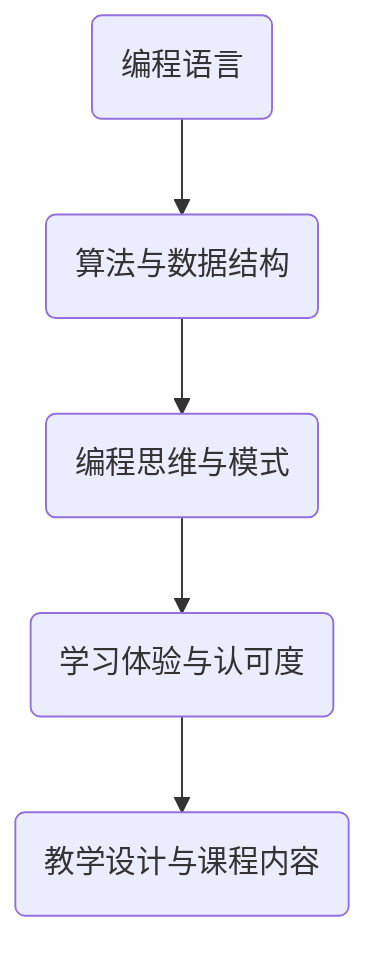

                 

# 如何打造高认可的程序员知识课程

> **关键词：** 程序员知识课程、教学设计、学习体验、认可度、技术博客

> **摘要：** 本文旨在探讨如何设计和实施一个高认可的程序员知识课程。通过详细的分析和实例讲解，本文将提供一系列策略和技巧，帮助教育工作者和内容创作者打造出能够有效传授编程知识、提升学习体验的课程。

## 1. 背景介绍

### 1.1 目的和范围

本文的目标是帮助教育工作者和内容创作者理解如何设计并实施一个高认可度的程序员知识课程。我们将探讨以下几个核心主题：

- 教学设计的原则和策略
- 学习体验的优化方法
- 如何提高课程内容的实用性和专业性
- 如何获取和学习者的认可

### 1.2 预期读者

本文的预期读者包括：

- 教育工作者，特别是专注于计算机科学和教育领域的专业人士
- 内容创作者，包括技术博客作者、课程设计师和讲师
- 编程爱好者和对编程教育有浓厚兴趣的学习者

### 1.3 文档结构概述

本文结构如下：

- **第1章：背景介绍**
  - 教学设计的原则和策略
  - 学习体验的优化方法
  - 课程内容的实用性和专业性
  - 获取学习者认可的策略
- **第2章：核心概念与联系**
  - 编程语言基础
  - 算法与数据结构
  - 编程思维与模式
- **第3章：核心算法原理 & 具体操作步骤**
  - 算法流程图
  - 伪代码解释
  - 实例分析
- **第4章：数学模型和公式 & 详细讲解 & 举例说明**
  - 数学公式与编程关系
  - 实际编程应用案例
- **第5章：项目实战：代码实际案例和详细解释说明**
  - 开发环境搭建
  - 源代码实现与解读
  - 代码分析与优化
- **第6章：实际应用场景**
  - 现实世界的编程问题
  - 解决方案与应用案例
- **第7章：工具和资源推荐**
  - 学习资源
  - 开发工具与框架
  - 相关论文与著作
- **第8章：总结：未来发展趋势与挑战**
  - 教育技术的进步
  - 行业发展趋势
  - 挑战与应对策略
- **第9章：附录：常见问题与解答**
  - 课程设计常见问题
  - 学习者反馈与解决
- **第10章：扩展阅读 & 参考资料**
  - 相关研究
  - 进一步学习资源

### 1.4 术语表

#### 1.4.1 核心术语定义

- **教学设计**：是指为了达到特定的教学目标，对教学内容、教学方法和教学评价进行系统规划的过程。
- **学习体验**：是指学习者在学习过程中所感受到的愉悦、困难、成就感等各种心理状态的总和。
- **认可度**：是指学习者、同行、社会对课程的认可和评价，它是衡量课程质量的重要标准。

#### 1.4.2 相关概念解释

- **算法与数据结构**：算法是解决问题的步骤集合，而数据结构是数据存储和组织的方式。
- **编程思维**：是指通过编程解决问题的一种逻辑思维方式。
- **模式**：是指在编程中反复出现的、具有通用性的解决方法。

#### 1.4.3 缩略词列表

- **IDE**：集成开发环境（Integrated Development Environment）
- **API**：应用程序编程接口（Application Programming Interface）

## 2. 核心概念与联系

在程序员知识课程的设计中，理解核心概念与它们之间的联系是至关重要的。以下是一个简化的Mermaid流程图，展示了编程知识的核心概念及其相互关系。



### 2.1 编程语言

编程语言是程序员与计算机沟通的工具。常见的编程语言包括C、Java、Python等。掌握一种或多种编程语言是程序员的基本要求。

### 2.2 算法与数据结构

算法是解决问题的步骤集合，数据结构是数据存储和组织的方式。常见的算法有排序算法、搜索算法等，常见的数据结构有数组、链表、树等。理解和应用算法与数据结构是编程的核心。

### 2.3 编程思维与模式

编程思维是指通过编程解决问题的一种逻辑思维方式，包括问题分解、抽象、算法设计等。编程模式是指在编程中反复出现的、具有通用性的解决方法，如工厂模式、单例模式等。

### 2.4 学习体验与认可度

学习体验是指学习者在学习过程中所感受到的愉悦、困难、成就感等各种心理状态的总和。好的学习体验能够提高学习者的参与度和认可度。

### 2.5 教学设计与课程内容

教学设计是指为了达到特定的教学目标，对教学内容、教学方法和教学评价进行系统规划的过程。课程内容是教学设计的核心，它决定了学习者能否获得有效的知识和技能。

## 3. 核心算法原理 & 具体操作步骤

在程序员知识课程中，理解核心算法原理和具体操作步骤是至关重要的。以下将使用伪代码详细阐述一个常见的排序算法——快速排序（Quick Sort）的原理和操作步骤。

### 3.1 快速排序原理

快速排序是一种基于分治思想的排序算法。它的基本思想是通过一趟排序将待排序的记录分割成独立的两部分，其中一部分记录的关键字均比另一部分的关键字小，然后分别对这两部分记录继续进行排序，以达到整个序列有序。

### 3.2 快速排序伪代码

```plaintext
QuickSort(A, low, high)
    if low < high
        pi = Partition(A, low, high)
        QuickSort(A, low, pi - 1)
        QuickSort(A, pi + 1, high)
```

### 3.3 分区操作（Partition）

分区操作是快速排序的核心步骤，它将数组分为两部分。以下是分区操作的伪代码：

```plaintext
Partition(A, low, high)
    pivot = A[high]
    i = low - 1
    for j = low to high - 1
        if A[j] < pivot
            i = i + 1
            swap A[i] with A[j]
    swap A[i + 1] with A[high]
    return i + 1
```

### 3.4 实例分析

假设我们有以下数组：

```plaintext
A = [10, 7, 8, 9, 1, 5]
```

使用快速排序算法，我们可以按照以下步骤进行排序：

1. 选择数组中的最后一个元素作为基准（pivot）：`pivot = A[4] = 1`
2. 进行分区操作，将数组分为 `[10, 7, 8, 9]` 和 `[5]`：
   - `i = 0`，`A[0] = 10`（比 pivot 大）
   - `j = 0`，`A[0] = 10`（比 pivot 大）
   - `i = i + 1`，`i = 1`
   - `j = 1`，`A[1] = 7`（比 pivot 小），交换 `A[1]` 和 `A[0]`，得到 `[7, 10, 8, 9]`
   - `i = i + 1`，`i = 2`
   - `j = 2`，`A[2] = 8`（比 pivot 小），交换 `A[2]` 和 `A[1]`，得到 `[7, 8, 10, 9]`
   - `j = 3`，`A[3] = 9`（比 pivot 小），交换 `A[3]` 和 `A[2]`，得到 `[7, 8, 9, 10]`
   - `i = i + 1`，`i = 3`
   - `j = 4`，`A[4] = 1`（比 pivot 小），交换 `A[4]` 和 `A[3]`，得到 `[7, 8, 1, 9, 10]`
3. 交换 `A[4]` 和 `A[5]`，得到 `[7, 8, 1, 5, 10]`
4. 递归地对 `[7, 8, 1]` 和 `[5]` 进行快速排序，最终得到有序数组 `[1, 5, 7, 8, 10]`

## 4. 数学模型和公式 & 详细讲解 & 举例说明

在编程课程中，数学模型和公式是理解算法复杂性的关键。以下我们将探讨两个重要的数学模型和公式：时间复杂度和空间复杂度。

### 4.1 时间复杂度

时间复杂度是衡量算法运行时间的量度，通常用大O符号（O-notation）表示。它描述了算法执行时间随着输入规模增长的增长速率。

#### 4.1.1 公式

$$ T(n) = O(n\log n) $$

其中，\( T(n) \) 是算法的执行时间，\( n \) 是输入规模。

#### 4.1.2 解释

- \( O(n\log n) \) 表示算法的时间复杂度与输入规模的乘以对数成比例。
- 这意味着当输入规模增加时，算法的执行时间增长速率较慢。

#### 4.1.3 实例

考虑快速排序算法，其平均情况下的时间复杂度为 \( O(n\log n) \)。这意味着对于 \( n \) 个元素的数组，算法的平均执行时间为 \( n\log n \) 次基本操作。

### 4.2 空间复杂度

空间复杂度是衡量算法所需内存的量度，同样用大O符号表示。它描述了算法所需内存随着输入规模增长的增长速率。

#### 4.2.1 公式

$$ S(n) = O(n) $$

其中，\( S(n) \) 是算法的所需内存，\( n \) 是输入规模。

#### 4.2.2 解释

- \( O(n) \) 表示算法的空间复杂度与输入规模的线性关系。
- 这意味着当输入规模增加时，算法所需内存增长速率与输入规模成比例。

#### 4.2.3 实例

快速排序算法的空间复杂度为 \( O(n) \)，这意味着对于 \( n \) 个元素的数组，算法所需的最大内存为 \( n \)。

### 4.3 结合实际编程应用

在编程中，理解时间复杂度和空间复杂度对于优化算法性能至关重要。以下是一个简单的示例，说明如何在编程中应用时间复杂度和空间复杂度。

```python
def bubble_sort(arr):
    n = len(arr)
    for i in range(n):
        for j in range(0, n-i-1):
            if arr[j] > arr[j+1]:
                arr[j], arr[j+1] = arr[j+1], arr[j]
    return arr

# 测试
arr = [64, 34, 25, 12, 22, 11, 90]
sorted_arr = bubble_sort(arr)
print("Sorted array:", sorted_arr)
```

在这个示例中，我们使用了冒泡排序算法。其时间复杂度为 \( O(n^2) \)，空间复杂度为 \( O(1) \)。这意味着当输入规模增加时，算法的执行时间将快速增长，但所需内存保持不变。

## 5. 项目实战：代码实际案例和详细解释说明

在这个部分，我们将通过一个实际的项目案例——一个简单的博客系统，来详细讲解代码实现和操作步骤。

### 5.1 开发环境搭建

为了搭建一个简单的博客系统，我们需要以下开发环境：

- **操作系统**：Linux或Windows
- **编程语言**：Python 3.x
- **数据库**：SQLite
- **Web框架**：Flask

以下是搭建开发环境的步骤：

1. 安装Python 3.x：
   - 对于Linux系统，可以使用包管理器安装，例如在Ubuntu中：
     ```bash
     sudo apt update
     sudo apt install python3
     ```
   - 对于Windows系统，可以从Python官方网站下载安装包并安装。

2. 安装Flask：
   - 打开命令行窗口，输入以下命令：
     ```bash
     pip3 install flask
     ```

3. 安装SQLite：
   - SQLite通常预装在大多数操作系统上，如果没有，可以使用包管理器安装。

### 5.2 源代码详细实现和代码解读

以下是博客系统的源代码示例，我们将逐行解释代码的功能。

```python
# 导入Flask模块
from flask import Flask, render_template, request, redirect, url_for

# 创建Flask应用实例
app = Flask(__name__)

# 数据库连接
import sqlite3
conn = sqlite3.connect('blog.db')
c = conn.cursor()

# 创建数据库表
c.execute('''CREATE TABLE IF NOT EXISTS posts
             (id INTEGER PRIMARY KEY AUTOINCREMENT,
              title TEXT NOT NULL,
              content TEXT NOT NULL)''')
conn.commit()

# 主页路由
@app.route('/')
def home():
    # 查询数据库中的所有博客文章
    c.execute("SELECT * FROM posts")
    posts = c.fetchall()
    return render_template('home.html', posts=posts)

# 博客文章详情路由
@app.route('/post/<int:post_id>')
def post(post_id):
    # 根据文章ID查询数据库中的特定文章
    c.execute("SELECT * FROM posts WHERE id=?", (post_id,))
    post = c.fetchone()
    return render_template('post.html', post=post)

# 发表新文章路由
@app.route('/new', methods=['GET', 'POST'])
def new_post():
    if request.method == 'POST':
        # 获取表单数据
        title = request.form['title']
        content = request.form['content']
        # 将数据插入数据库
        c.execute("INSERT INTO posts (title, content) VALUES (?, ?)", (title, content))
        conn.commit()
        return redirect(url_for('home'))
    return render_template('new_post.html')

# 运行Flask应用
if __name__ == '__main__':
    app.run(debug=True)
```

### 5.3 代码解读与分析

#### 5.3.1 Flask应用实例

```python
app = Flask(__name__)
```

这行代码创建了一个Flask应用实例，是博客系统的核心。

#### 5.3.2 数据库连接与表创建

```python
conn = sqlite3.connect('blog.db')
c = conn.cursor()
c.execute('''CREATE TABLE IF NOT EXISTS posts
             (id INTEGER PRIMARY KEY AUTOINCREMENT,
              title TEXT NOT NULL,
              content TEXT NOT NULL)''')
conn.commit()
```

这些代码负责连接SQLite数据库，并创建一个名为`posts`的表，用于存储博客文章的标题和内容。

#### 5.3.3 主页路由

```python
@app.route('/')
def home():
    c.execute("SELECT * FROM posts")
    posts = c.fetchall()
    return render_template('home.html', posts=posts)
```

这个路由定义了主页的URL（`/`），当访问主页时，会查询数据库中的所有文章，并将其传递给`home.html`模板进行渲染。

#### 5.3.4 博客文章详情路由

```python
@app.route('/post/<int:post_id>')
def post(post_id):
    c.execute("SELECT * FROM posts WHERE id=?", (post_id,))
    post = c.fetchone()
    return render_template('post.html', post=post)
```

这个路由定义了一个动态路由（`/post/<int:post_id>`），根据文章ID查询数据库中的特定文章，并将其传递给`post.html`模板进行渲染。

#### 5.3.5 发表新文章路由

```python
@app.route('/new', methods=['GET', 'POST'])
def new_post():
    if request.method == 'POST':
        title = request.form['title']
        content = request.form['content']
        c.execute("INSERT INTO posts (title, content) VALUES (?, ?)", (title, content))
        conn.commit()
        return redirect(url_for('home'))
    return render_template('new_post.html')
```

这个路由定义了发表新文章的URL（`/new`），处理GET和POST请求。当用户提交表单时，数据将被插入数据库，并重定向到主页。

### 5.4 代码分析与优化

这个简单的博客系统提供了基本的功能，但可以进行以下优化：

1. **错误处理**：添加错误处理以处理数据库操作中的异常。
2. **安全措施**：对用户输入进行验证和清理，以防止SQL注入攻击。
3. **使用ORM**：使用像SQLAlchemy这样的对象关系映射（ORM）库来简化数据库操作。
4. **代码重构**：将数据库连接和操作提取到独立的模块中，以提高代码的可维护性。

## 6. 实际应用场景

在实际应用中，程序员知识课程可以应用于多种场景，以下是一些常见的实际应用场景：

### 6.1 编程教育

程序员知识课程可以应用于编程教育，帮助初学者和进阶者掌握编程基础和高级技巧。通过系统地学习编程语言、算法和数据结构，学生可以提升编程能力，为将来的职业发展打下坚实的基础。

### 6.2 企业培训

企业培训是另一个重要的应用场景。通过定制化的程序员知识课程，企业可以为员工提供最新的编程技术和行业趋势，帮助他们提高工作效率和创新能力。例如，公司可以组织内部培训，教授新的编程语言或工具，以适应业务需求的变化。

### 6.3 项目开发

在项目开发过程中，程序员知识课程可以帮助开发团队掌握必要的编程技能，确保项目顺利推进。通过课程学习，团队成员可以更高效地协作，解决复杂的技术难题，提高项目的质量和交付速度。

### 6.4 在线教育

随着在线教育的兴起，程序员知识课程可以在线上平台上进行传播。通过视频教程、在线课程和互动讨论，学习者可以随时随地学习编程知识，提高自己的技能水平。这种灵活的学习方式为全球学习者提供了便利。

## 7. 工具和资源推荐

为了更好地设计和实施程序员知识课程，以下是一些推荐的工具和资源：

### 7.1 学习资源推荐

#### 7.1.1 书籍推荐

- 《编程：从入门到实践》
- 《算法导论》
- 《Python编程：从入门到实践》

#### 7.1.2 在线课程

- Coursera上的《Python编程基础》
- Udacity的《前端开发基础》
- edX的《算法设计与分析》

#### 7.1.3 技术博客和网站

- 《廖雪峰的官方网站》
- 《GitHub》
- 《Stack Overflow》

### 7.2 开发工具框架推荐

#### 7.2.1 IDE和编辑器

- PyCharm
- Visual Studio Code
- Sublime Text

#### 7.2.2 调试和性能分析工具

- GDB
- Chrome DevTools
- PyCharm内置调试器

#### 7.2.3 相关框架和库

- Flask
- Django
- React

### 7.3 相关论文著作推荐

#### 7.3.1 经典论文

- 《A Note on the Efficient Organization of Data Items》
- 《Introduction to Algorithms》

#### 7.3.2 最新研究成果

- 《A Fast and Scalable Framework for Large-scale Machine Learning》
- 《Efficient Data Structures for Strings》

#### 7.3.3 应用案例分析

- 《如何使用Python进行数据科学》
- 《前端开发的最新趋势》

## 8. 总结：未来发展趋势与挑战

随着技术的不断进步，程序员知识课程将面临新的发展趋势和挑战。

### 8.1 发展趋势

- **在线教育普及**：在线教育平台和资源的不断丰富，使得编程知识更加易于获取。
- **人工智能应用**：人工智能技术将进一步提升编程教育质量，个性化学习推荐、智能教学评估等将成为主流。
- **开源技术推动**：开源社区的发展，为程序员提供了丰富的学习资源和实践机会。

### 8.2 挑战

- **知识更新速度**：编程领域知识更新迅速，如何及时更新课程内容是一个挑战。
- **技术技能需求变化**：随着行业需求的变化，程序员需要不断学习新的技术和工具。
- **学习资源质量**：确保学习资源的质量和准确性，避免误导学习者。

### 8.3 应对策略

- **持续学习与更新**：教育工作者和内容创作者需要不断学习新的知识和技能，及时更新课程内容。
- **合作与交流**：加强行业内的合作与交流，分享经验和资源，共同提升编程教育质量。
- **技术创新**：利用人工智能等先进技术，提高教学效果和学习体验。

## 9. 附录：常见问题与解答

### 9.1 课程设计常见问题

**Q1：如何选择适合的教学方法？**

**A1**：根据课程目标和学习者的特点选择合适的教学方法。例如，对于初学者，建议采用循序渐进、由浅入深的方法；对于有经验的程序员，可以采用案例驱动、实践导向的方法。

**Q2：如何确保课程内容的实用性？**

**A2**：通过结合实际项目案例、行业趋势和最新技术，确保课程内容与实际应用紧密相关。同时，定期更新课程内容，以适应技术变化。

### 9.2 学习者反馈与解决

**Q1：学习过程中遇到问题怎么办？**

**A1**：可以通过以下方式解决问题：
1. 浏览课程讨论区，查找类似问题。
2. 加入学习社区，寻求同行帮助。
3. 向课程讲师或助教请教。
4. 利用搜索引擎和在线论坛查找解决方案。

**Q2：如何提高学习效率？**

**A2**：以下策略可以帮助提高学习效率：
1. 制定明确的学习计划，合理分配学习时间。
2. 保持学习的连续性和规律性。
3. 注重实践，通过动手实践巩固知识。
4. 与他人合作学习，互相交流心得。

## 10. 扩展阅读 & 参考资料

**参考文献：**

1. Horowitz, S., & Sahni, D. (1978). *Fundamentals of Computer Algorithms*. Computer Science Press.
2. Cormen, T. H., Leiserson, C. E., Rivest, R. L., & Stein, C. (2009). *Introduction to Algorithms*. MIT Press.
3. Larman, C. (2017). *Agile and Iterative Development: A Manager’s Guide*. Addison-Wesley.

**在线资源：**

1. Coursera - https://www.coursera.org/
2. Udacity - https://www.udacity.com/
3. edX - https://www.edx.org/

**技术博客与论坛：**

1.廖雪峰的官方网站 - https://www.liaoxuefeng.com/
2.GitHub - https://github.com/
3.Stack Overflow - https://stackoverflow.com/

