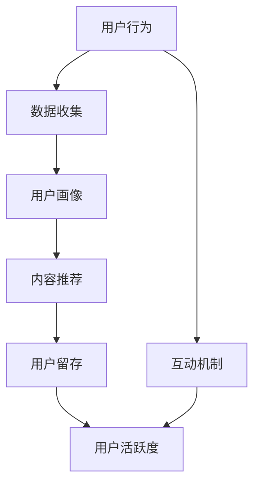

                 

# 如何提高知识付费产品的用户活跃度

> 关键词：知识付费、用户活跃度、用户留存、互动设计、算法推荐、内容优化、用户分析

> 摘要：本文将深入探讨如何提高知识付费产品的用户活跃度。通过分析用户行为、应用算法推荐、优化内容体验，以及构建有效的互动机制，我们旨在为知识付费产品的开发者提供实用的策略和方法，帮助他们在激烈的市场竞争中脱颖而出。

## 1. 背景介绍

### 1.1 目的和范围

本文旨在为知识付费产品的开发者和运营团队提供一套系统的策略，以提升产品的用户活跃度。我们将重点关注以下几个方面：

1. 用户行为分析
2. 算法推荐系统
3. 内容优化策略
4. 互动机制设计

### 1.2 预期读者

本文适用于：

- 知识付费产品的开发者
- 数字产品经理
- 数据分析师
- 内容创作者

### 1.3 文档结构概述

本文将按照以下结构进行展开：

1. 背景介绍
2. 核心概念与联系
3. 核心算法原理与具体操作步骤
4. 数学模型与公式
5. 项目实战：代码实际案例
6. 实际应用场景
7. 工具和资源推荐
8. 总结：未来发展趋势与挑战
9. 附录：常见问题与解答
10. 扩展阅读与参考资料

### 1.4 术语表

#### 1.4.1 核心术语定义

- 用户活跃度：指用户在知识付费产品上参与互动、学习、消费的频率和深度。
- 知识付费：用户为获取特定知识或技能而付费的商业模式。
- 用户留存：指用户在一段时间后继续使用产品的比率。

#### 1.4.2 相关概念解释

- 用户行为分析：通过收集和分析用户在使用产品时的行为数据，以了解用户需求和行为模式。
- 算法推荐：利用机器学习算法，根据用户的历史行为和偏好推荐相关内容。

#### 1.4.3 缩略词列表

- NLP：自然语言处理（Natural Language Processing）
- ML：机器学习（Machine Learning）
- ARPU：每用户平均收入（Average Revenue Per User）
- DAU：日活跃用户数（Daily Active Users）
- MAU：月活跃用户数（Monthly Active Users）

## 2. 核心概念与联系

在提高知识付费产品的用户活跃度之前，我们首先需要理解一些核心概念及其相互关系。以下是一个简化的Mermaid流程图，展示了这些概念之间的联系。



### 2.1 用户行为分析

用户行为分析是提高用户活跃度的第一步。通过收集用户在产品中的行为数据，如浏览、搜索、购买、互动等，我们可以构建用户画像，了解用户的需求和偏好。

### 2.2 数据收集

数据收集是用户行为分析的基础。我们可以通过日志、API接口、埋点等技术手段，实时收集用户在产品中的操作数据。

### 2.3 用户画像

用户画像是对用户需求的抽象表示。通过分析用户行为数据，我们可以为每个用户构建一个详细的画像，包括年龄、职业、兴趣、购买习惯等。

### 2.4 内容推荐

基于用户画像，我们可以利用算法推荐系统，为用户推荐他们可能感兴趣的内容。推荐系统可以显著提高用户的粘性，从而提升活跃度。

### 2.5 用户留存

用户留存是衡量产品成功与否的重要指标。通过设计有效的互动机制，如社区讨论、直播互动等，我们可以提高用户的留存率。

### 2.6 用户活跃度

用户活跃度是用户在产品中的参与程度和频率的度量。通过分析用户活跃度，我们可以了解产品的受欢迎程度，并优化产品体验。

## 3. 核心算法原理与具体操作步骤

### 3.1 算法原理

为了提高知识付费产品的用户活跃度，我们主要依赖以下三种算法：

1. **协同过滤算法**：通过分析用户的历史行为，找到相似用户并推荐他们喜欢的内容。
2. **基于内容的推荐算法**：根据内容的特征和标签，为用户推荐相似的内容。
3. **深度学习算法**：利用用户的深层特征，进行更加精确的推荐。

### 3.2 具体操作步骤

#### 3.2.1 数据预处理

```python
# 伪代码：数据预处理
data = load_data()  # 加载用户行为数据
clean_data = preprocess_data(data)  # 数据清洗
```

#### 3.2.2 特征提取

```python
# 伪代码：特征提取
features = extract_features(clean_data)  # 提取用户特征
content_features = extract_content_features(data)  # 提取内容特征
```

#### 3.2.3 模型训练

```python
# 伪代码：模型训练
model = train_model(features, labels)  # 训练协同过滤模型
content_model = train_content_model(content_features, labels)  # 训练基于内容的模型
```

#### 3.2.4 内容推荐

```python
# 伪代码：内容推荐
user_id = get_user_id()  # 获取当前用户ID
user_interests = get_user_interests(user_id)  # 获取用户兴趣特征
recommendations = generate_recommendations(user_interests, model, content_model)  # 生成推荐列表
```

## 4. 数学模型与公式

### 4.1 协同过滤算法

协同过滤算法的核心是计算用户之间的相似度和内容之间的相似度。以下是一个简化的数学模型：

#### 4.1.1 用户相似度计算

$$
sim(u_i, u_j) = \frac{\sum_{k=1}^{n} r_{ik} r_{jk}}{\sqrt{\sum_{k=1}^{n} r_{ik}^2 \sum_{k=1}^{n} r_{jk}^2}}
$$

其中，$r_{ik}$ 表示用户 $u_i$ 对内容 $k$ 的评分。

#### 4.1.2 内容相似度计算

$$
sim(c_i, c_j) = \frac{\sum_{u \in U} w_{ui} w_{uj}}{\sqrt{\sum_{u \in U} w_{ui}^2 \sum_{u \in U} w_{uj}^2}}
$$

其中，$w_{ui}$ 表示用户 $u$ 对内容 $i$ 的权重。

### 4.2 基于内容的推荐算法

基于内容的推荐算法主要依赖于内容的特征和标签。以下是一个简化的数学模型：

$$
sim(c_i, c_j) = \frac{cos(\theta_i, \theta_j)}{||\theta_i|| \ ||\theta_j||}
$$

其中，$\theta_i$ 和 $\theta_j$ 分别表示内容 $i$ 和 $j$ 的特征向量。

## 5. 项目实战：代码实际案例

### 5.1 开发环境搭建

在开始编写代码之前，我们需要搭建一个合适的开发环境。以下是搭建环境的基本步骤：

1. 安装Python环境（推荐使用Python 3.8及以上版本）
2. 安装依赖库（如scikit-learn、numpy、pandas等）
3. 配置数据存储和读取工具（如MySQL、MongoDB等）

### 5.2 源代码详细实现和代码解读

以下是实现协同过滤推荐算法的示例代码：

```python
import numpy as np
from sklearn.metrics.pairwise import cosine_similarity

def collaborative_filter(train_data, user_id, content_id, k=5):
    # 计算用户相似度矩阵
    user_similarity = cosine_similarity(train_data, k=k)
    
    # 计算用户评分预测
    user_ratings = np.dot(user_similarity[user_id], train_data) / (np.linalg.norm(user_similarity[user_id], axis=1) + 1e-5)
    
    # 获取用户对内容的预测评分
    predicted_rating = user_ratings[content_id]
    
    return predicted_rating

# 测试代码
train_data = np.array([[5, 4, 0], [4, 5, 2], [0, 2, 5]])
user_id = 0
content_id = 2
predicted_rating = collaborative_filter(train_data, user_id, content_id)
print(f"Predicted rating: {predicted_rating}")
```

### 5.3 代码解读与分析

1. **数据预处理**：首先，我们需要准备训练数据集。这里我们使用了一个简单的二维数组，表示用户对内容的评分。
2. **用户相似度计算**：使用余弦相似度计算用户之间的相似度。余弦相似度是一种衡量两个向量之间夹角的余弦值的指标，取值范围在[-1, 1]之间。
3. **用户评分预测**：基于用户相似度矩阵，计算用户对内容的预测评分。这里我们使用了点积的方法，将用户相似度矩阵与训练数据相乘，得到预测评分。
4. **测试代码**：最后，我们使用一个简单的测试数据集，验证协同过滤算法的预测效果。

## 6. 实际应用场景

知识付费产品的用户活跃度提升在多个领域有着广泛的应用。以下是一些典型的应用场景：

1. **在线教育**：通过用户行为分析，为学习者推荐适合的课程和资源，提高学习效果和参与度。
2. **职业技能培训**：为学员推荐与其职业发展相关的知识和技能，提高他们的职业竞争力。
3. **专业咨询**：为用户推荐与其需求相关的专家和报告，提高咨询服务的质量和用户满意度。
4. **知识分享平台**：通过内容推荐，促进用户之间的知识交流和互动，增加平台活跃度。

## 7. 工具和资源推荐

### 7.1 学习资源推荐

#### 7.1.1 书籍推荐

- 《推荐系统实践》
- 《数据挖掘：概念与技术》
- 《机器学习实战》

#### 7.1.2 在线课程

- Coursera上的《推荐系统设计与评估》
- Udacity的《机器学习工程师纳米学位》
- edX上的《数据科学专项课程》

#### 7.1.3 技术博客和网站

- [KDNuggets](https://www.kdnuggets.com/)
- [Medium上的数据科学专题](https://medium.com/topic/data-science)
- [Stack Overflow](https://stackoverflow.com/)

### 7.2 开发工具框架推荐

#### 7.2.1 IDE和编辑器

- PyCharm
- VSCode
- Jupyter Notebook

#### 7.2.2 调试和性能分析工具

- Python的pdb
- Visual Studio的性能分析工具
- JMeter

#### 7.2.3 相关框架和库

- TensorFlow
- PyTorch
- scikit-learn

### 7.3 相关论文著作推荐

#### 7.3.1 经典论文

- [Collaborative Filtering](https://www.cs.ubc.ca/~hill/Courses/CPS574-04W/readings/Brent_Collaborative_Filtering.pdf)
- [Matrix Factorization Techniques for recommender systems](https://www.dbs.uzh.ch/dokumente/lectures/ai3/courses_2004_2005/matfact_papers/mat(factor)_15_ButlerEtAl1998.pdf)
- [Content-Based Image Retrieval with SIMPLIcity: An Application to Multimedia Databases](https://www.microsoft.com/en-us/research/publication/content-based-image-retrieval-with-simplicity-an-application-to-multimedia-databases/)

#### 7.3.2 最新研究成果

- [Exploring Technical Debt in Recommender Systems: Challenges and Opportunities](https://dl.acm.org/doi/10.1145/3349151.3375945)
- [Deep Learning for Recommender Systems](https://dl.acm.org/doi/abs/10.1145/3157655.3157670)
- [Recommending the Next Chapter in Your Book](https://arxiv.org/abs/1910.04799)

#### 7.3.3 应用案例分析

- [如何提高Netflix的用户活跃度](https://www.netflix.com/watch/rid=1106017793)
- [亚马逊的推荐算法](https://www.amazon.com/review/product/B00006FVLO/)
- [阿里巴巴的个性化推荐系统](https://www.alibaba.com/news/china-alibaba-to-boost-ai-technology-recommendation-systems-1.766099)

## 8. 总结：未来发展趋势与挑战

随着人工智能技术的不断发展，知识付费产品的用户活跃度将迎来新的机遇和挑战。以下是一些未来发展趋势：

1. **个性化推荐**：利用深度学习等先进技术，实现更加精准的个性化推荐，提高用户满意度。
2. **多模态内容**：结合文本、图片、视频等多模态内容，提供更加丰富和多样的知识体验。
3. **社区互动**：加强用户之间的互动和交流，提高社区的活跃度和用户粘性。
4. **隐私保护**：在用户行为分析和推荐算法中，加强对用户隐私的保护，遵守相关法律法规。

## 9. 附录：常见问题与解答

### 9.1 什么是协同过滤算法？

协同过滤算法是一种基于用户行为和偏好的推荐算法，它通过分析用户之间的相似度或内容之间的相似度，为用户推荐他们可能感兴趣的内容。

### 9.2 如何处理稀疏数据集？

稀疏数据集是协同过滤算法面临的主要挑战之一。可以通过以下方法处理稀疏数据集：

- **填充缺失值**：使用平均值、中值或其他统计指标填充缺失值。
- **数据降维**：使用PCA（主成分分析）等方法降低数据维度，减少数据稀疏性。
- **矩阵分解**：使用矩阵分解技术，如ALS（交替最小二乘法），恢复潜在的用户-内容矩阵。

### 9.3 推荐系统的评估指标有哪些？

推荐系统的评估指标包括：

- **准确率（Precision）**：预测为正样本的推荐项中实际为正样本的比例。
- **召回率（Recall）**：实际为正样本的推荐项中被预测为正样本的比例。
- **F1值**：准确率和召回率的调和平均值。
- **MAE（平均绝对误差）**：预测值与真实值之间的平均绝对差值。
- **RMSE（均方根误差）**：预测值与真实值之间的均方根差值。

## 10. 扩展阅读与参考资料

- [推荐系统实践](https://www.amazon.com/Recommender-Systems-Introduction-Techniques-Methods/dp/0124077714)
- [数据挖掘：概念与技术](https://www.amazon.com/Data-Mining-Concepts-Techniques-Handbook/dp/0131467267)
- [机器学习实战](https://www.amazon.com/Machine-Learning-In-Action-Concepts-Examples/dp/149194598X)
- [KDNuggets](https://www.kdnuggets.com/)
- [Medium上的数据科学专题](https://medium.com/topic/data-science)
- [Stack Overflow](https://stackoverflow.com/)

---

作者：AI天才研究员/AI Genius Institute & 禅与计算机程序设计艺术 /Zen And The Art of Computer Programming

---

本文详细探讨了如何提高知识付费产品的用户活跃度，通过用户行为分析、算法推荐、内容优化和互动机制设计等多方面策略，为知识付费产品的开发者和运营团队提供了实用的指导。随着人工智能技术的不断发展，知识付费产品将在未来迎来更多的机遇和挑战，我们期待看到更多创新和突破。在文章的最后，我们也为读者推荐了一些相关的学习资源和工具，希望对您的学习和实践有所帮助。

