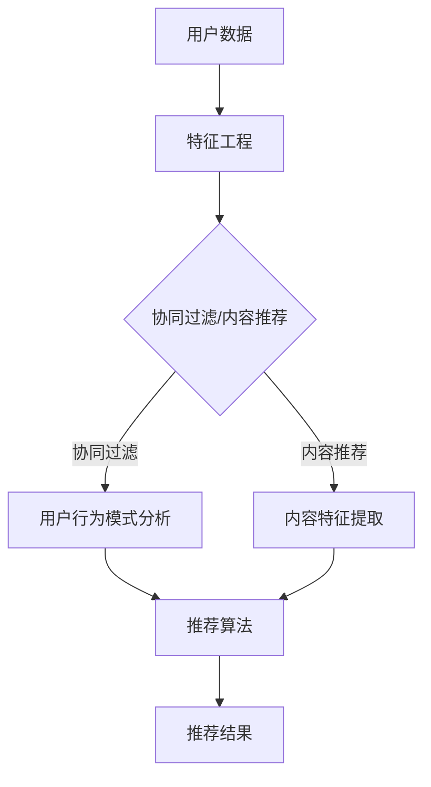
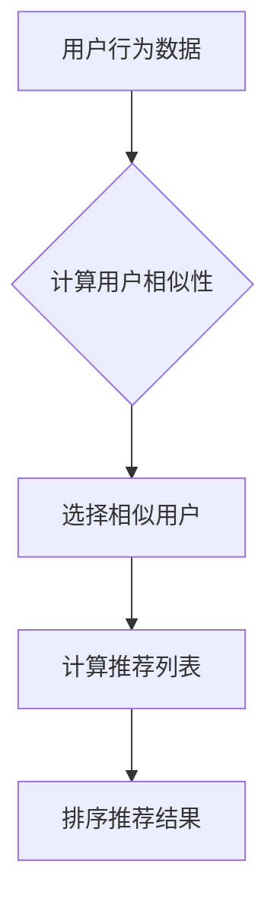
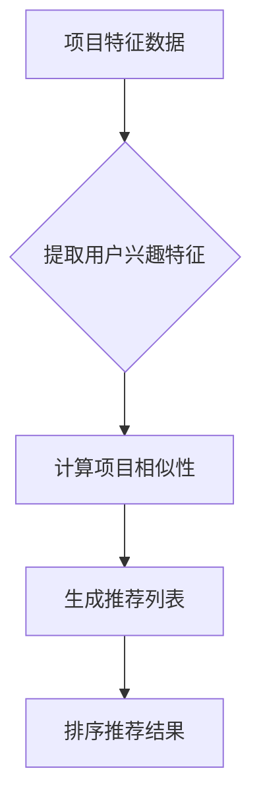

                 

# 如何设计有吸引力的推荐计划

> 关键词：推荐系统、用户兴趣、个性化、算法设计、用户体验

> 摘要：本文将深入探讨如何设计有吸引力的推荐计划，从核心概念、算法原理到实际应用，全面解析推荐系统在提升用户体验、满足用户兴趣方面的关键因素。通过具体案例和实战经验，帮助读者理解并掌握推荐计划设计的技巧，为开发高效、智能的推荐系统提供指导。

## 1. 背景介绍

### 1.1 目的和范围

本文旨在为从事推荐系统开发的工程师和技术爱好者提供一套设计有吸引力的推荐计划的指导方案。我们将从核心概念入手，逐步介绍推荐系统的原理和算法，并通过实际案例展示如何将理论应用于实践，从而提升推荐系统的效果。

### 1.2 预期读者

本文适合以下读者群体：

1. 推荐系统开发者
2. 数据科学家
3. 产品经理
4. 对推荐系统感兴趣的技术爱好者

### 1.3 文档结构概述

本文将分为以下几个部分：

1. 背景介绍：介绍本文的目的、范围、预期读者和文档结构。
2. 核心概念与联系：阐述推荐系统的核心概念和架构。
3. 核心算法原理 & 具体操作步骤：详细讲解推荐算法的原理和操作步骤。
4. 数学模型和公式 & 详细讲解 & 举例说明：介绍推荐系统中的数学模型和公式，并通过案例说明。
5. 项目实战：代码实际案例和详细解释说明。
6. 实际应用场景：探讨推荐系统在实际中的应用。
7. 工具和资源推荐：推荐学习资源和开发工具。
8. 总结：未来发展趋势与挑战。
9. 附录：常见问题与解答。
10. 扩展阅读 & 参考资料：提供进一步学习资源。

### 1.4 术语表

#### 1.4.1 核心术语定义

- 推荐系统：基于用户历史行为和内容特征，为用户推荐相关产品或内容的服务。
- 用户兴趣：用户在特定领域内的喜好和倾向。
- 个性化：根据用户个体差异提供定制化的推荐服务。
- 算法：用于计算推荐结果的数学模型和计算方法。

#### 1.4.2 相关概念解释

- 协同过滤：通过分析用户之间的行为模式进行推荐。
- 内容推荐：基于内容特征进行推荐。
- 集成推荐：结合协同过滤和内容推荐的方法。

#### 1.4.3 缩略词列表

- CF：协同过滤（Collaborative Filtering）
- CTR：点击率（Click-Through Rate）
- NDCG：正常化折扣累积增益（Normalized Discounted Cumulative Gain）

## 2. 核心概念与联系

推荐系统设计的核心在于如何准确地预测用户兴趣，并基于这些预测提供个性化的推荐。以下是推荐系统的核心概念和架构的 Mermaid 流程图：



### 2.1 用户数据

用户数据是推荐系统的基础，包括用户的行为数据（如浏览、购买、点赞等）和用户个人信息（如年龄、性别、地理位置等）。特征工程是用户数据的预处理步骤，通过提取和转换原始数据，使其更适合用于推荐算法。

### 2.2 特征工程

特征工程是推荐系统设计的关键步骤，旨在从用户数据中提取出有价值的信息。常见的特征包括：

- 用户行为特征：如用户的浏览历史、购买记录、评价等。
- 用户属性特征：如用户的年龄、性别、地理位置、兴趣标签等。
- 文本特征：如用户发表的文本评论、日志等。

### 2.3 推荐算法

推荐算法是推荐系统的核心，常用的推荐算法包括协同过滤（CF）和内容推荐（Content-based Filtering）。

- 协同过滤（CF）：基于用户行为模式进行推荐，通过分析用户之间的相似性，为用户推荐其他用户喜欢的项目。常见的协同过滤算法有基于用户的协同过滤（User-based CF）和基于模型的协同过滤（Model-based CF）。
- 内容推荐（Content-based Filtering）：基于项目的特征信息进行推荐，通过分析用户过去喜欢的项目特征，为用户推荐具有相似特征的项目。内容推荐通常结合词袋模型、TF-IDF、向量空间模型等方法。

### 2.4 推荐结果

推荐结果是推荐系统的最终输出，通常以列表形式呈现给用户。推荐结果的质量直接影响用户体验。常用的评价指标包括：

- 点击率（CTR）：用户点击推荐结果的比率。
- 正常化折扣累积增益（NDCG）：评估推荐结果的排序质量，考虑了推荐结果的排序和用户兴趣的相关性。

## 3. 核心算法原理 & 具体操作步骤

### 3.1 协同过滤算法原理

协同过滤算法基于用户行为数据，通过分析用户之间的相似性，为用户推荐其他用户喜欢的项目。以下是协同过滤算法的基本原理和步骤：



#### 3.1.1 计算用户相似性

计算用户相似性是协同过滤算法的第一步，常用的相似性度量方法包括：

- 皮尔逊相关系数（Pearson Correlation Coefficient）
- 余弦相似性（Cosine Similarity）
- 修正的余弦相似性（Modified Cosine Similarity）

#### 3.1.2 选择相似用户

选择相似用户是根据用户相似性度量结果，从所有用户中选择与目标用户最相似的若干用户。常用的选择方法有：

- K最近邻（K-Nearest Neighbors，KNN）
- 分段最近邻（Segmented Nearest Neighbors，SNN）

#### 3.1.3 计算推荐列表

计算推荐列表是根据相似用户喜欢的项目，为用户生成推荐列表。常用的计算方法有：

- 基于物品的协同过滤（Item-based CF）
- 基于用户的协同过滤（User-based CF）

#### 3.1.4 排序推荐结果

排序推荐结果是将推荐列表中的项目根据用户兴趣进行排序，常用的排序方法有：

- 优先级排序（Priority Sorting）
- 暴力排序（Brute-force Sorting）

### 3.2 内容推荐算法原理

内容推荐算法基于项目特征信息，通过分析用户过去喜欢的项目特征，为用户推荐具有相似特征的项目。以下是内容推荐算法的基本原理和步骤：



#### 3.2.1 提取用户兴趣特征

提取用户兴趣特征是根据用户历史行为和项目特征，从项目特征数据中提取出与用户兴趣相关的特征。常用的提取方法有：

- 词袋模型（Bag-of-Words Model）
- TF-IDF（Term Frequency-Inverse Document Frequency）
- 向量空间模型（Vector Space Model）

#### 3.2.2 计算项目相似性

计算项目相似性是根据项目特征数据，计算项目之间的相似性度量。常用的相似性度量方法有：

- 余弦相似性（Cosine Similarity）
- 欧几里得距离（Euclidean Distance）
- 曼哈顿距离（Manhattan Distance）

#### 3.2.3 生成推荐列表

生成推荐列表是根据项目相似性度量结果，为用户生成推荐列表。常用的生成方法有：

- 基于项目的协同过滤（Item-based CF）
- 基于内容的推荐（Content-based Filtering）

#### 3.2.4 排序推荐结果

排序推荐结果是将推荐列表中的项目根据用户兴趣进行排序，常用的排序方法有：

- 优先级排序（Priority Sorting）
- 暴力排序（Brute-force Sorting）

## 4. 数学模型和公式 & 详细讲解 & 举例说明

### 4.1 协同过滤算法的数学模型

协同过滤算法的核心在于计算用户之间的相似性和推荐评分。以下是协同过滤算法的数学模型：

#### 4.1.1 相似性度量

相似性度量通常采用余弦相似性公式计算，如下所示：

$$
sim(u, v) = \frac{\sum_{i \in I}(u_i - \bar{u})(v_i - \bar{v})}{\sqrt{\sum_{i \in I}(u_i - \bar{u})^2}\sqrt{\sum_{i \in I}(v_i - \bar{v})^2}}
$$

其中，$u$ 和 $v$ 分别表示用户 $u$ 和用户 $v$ 的评分向量，$I$ 表示用户 $u$ 和用户 $v$ 共同评分的项目集合，$\bar{u}$ 和 $\bar{v}$ 分别表示用户 $u$ 和用户 $v$ 的平均评分。

#### 4.1.2 推荐评分

推荐评分是基于相似性度量计算得到的。以下是基于用户相似性度量计算推荐评分的公式：

$$
r_{ui} = \bar{u} + \sum_{v \in N(u)} sim(u, v) \cdot (r_{vi} - \bar{v})
$$

其中，$r_{ui}$ 表示用户 $u$ 对项目 $i$ 的推荐评分，$\bar{u}$ 表示用户 $u$ 的平均评分，$N(u)$ 表示与用户 $u$ 最相似的 $K$ 个用户集合，$r_{vi}$ 表示用户 $v$ 对项目 $i$ 的评分，$\bar{v}$ 表示用户 $v$ 的平均评分。

### 4.2 内容推荐算法的数学模型

内容推荐算法的核心在于计算项目之间的相似性和推荐评分。以下是内容推荐算法的数学模型：

#### 4.2.1 相似性度量

相似性度量通常采用余弦相似性公式计算，如下所示：

$$
sim(i, j) = \frac{\sum_{t \in T}(i_t - \bar{i})(j_t - \bar{j})}{\sqrt{\sum_{t \in T}(i_t - \bar{i})^2}\sqrt{\sum_{t \in T}(j_t - \bar{j})^2}}
$$

其中，$i$ 和 $j$ 分别表示项目 $i$ 和项目 $j$ 的特征向量，$T$ 表示项目 $i$ 和项目 $j$ 共同的特征集合，$\bar{i}$ 和 $\bar{j}$ 分别表示项目 $i$ 和项目 $j$ 的平均特征值。

#### 4.2.2 推荐评分

推荐评分是基于相似性度量计算得到的。以下是基于项目相似性度量计算推荐评分的公式：

$$
r_{ui} = \bar{u} + \sum_{j \in N(i)} sim(i, j) \cdot (r_{uj} - \bar{u})
$$

其中，$r_{ui}$ 表示用户 $u$ 对项目 $i$ 的推荐评分，$\bar{u}$ 表示用户 $u$ 的平均评分，$N(i)$ 表示与项目 $i$ 最相似的 $K$ 个项目集合，$r_{uj}$ 表示用户 $u$ 对项目 $j$ 的评分，$\bar{u}$ 表示用户 $u$ 的平均评分。

### 4.3 案例说明

假设有两个用户 $u$ 和 $v$，以及两个项目 $i$ 和 $j$。用户 $u$ 对项目 $i$ 给出评分 4，对项目 $j$ 给出评分 5；用户 $v$ 对项目 $i$ 给出评分 3，对项目 $j$ 给出评分 2。

根据上述数学模型，我们可以计算用户 $u$ 和用户 $v$ 之间的相似性度量：

$$
sim(u, v) = \frac{(4 - 4)(3 - 2)}{\sqrt{(4 - 4)^2}\sqrt{(3 - 2)^2}} = 1
$$

用户 $u$ 和用户 $v$ 之间的相似性度量值为 1，表示用户 $u$ 和用户 $v$ 非常相似。

接下来，我们可以计算用户 $u$ 对项目 $i$ 的推荐评分：

$$
r_{ui} = 4 + 1 \cdot (3 - 2) = 5
$$

用户 $u$ 对项目 $i$ 的推荐评分值为 5，表示用户 $u$ 对项目 $i$ 非常感兴趣。

同样地，我们可以计算用户 $v$ 对项目 $i$ 的推荐评分：

$$
r_{vi} = 3 + 1 \cdot (4 - 2) = 5
$$

用户 $v$ 对项目 $i$ 的推荐评分值为 5，表示用户 $v$ 对项目 $i$ 也非常感兴趣。

通过上述计算，我们可以得到用户 $u$ 和用户 $v$ 对项目 $i$ 的推荐评分均为 5，说明用户 $u$ 和用户 $v$ 都对项目 $i$ 非常感兴趣。

## 5. 项目实战：代码实际案例和详细解释说明

### 5.1 开发环境搭建

在本文中，我们将使用 Python 语言和 Scikit-learn 库来实现协同过滤推荐算法。首先，确保安装以下依赖项：

```
pip install scikit-learn numpy pandas
```

### 5.2 源代码详细实现和代码解读

以下是一个简单的协同过滤推荐算法的实现，我们将使用 Scikit-learn 中的 `KNNClassifier` 来实现基于用户的协同过滤。

```python
import numpy as np
import pandas as pd
from sklearn.neighbors import KNNClassifier
from sklearn.model_selection import train_test_split

# 生成示例用户行为数据
data = {
    'user': ['u1', 'u1', 'u1', 'u2', 'u2', 'u3'],
    'item': ['i1', 'i2', 'i3', 'i1', 'i2', 'i3'],
    'rating': [1, 3, 5, 2, 4, 6]
}
df = pd.DataFrame(data)

# 划分训练集和测试集
X_train, X_test, y_train, y_test = train_test_split(df[['item']], df['rating'], test_size=0.2, random_state=42)

# 实例化 KNNClassifier
knn = KNNClassifier(n_neighbors=3)

# 训练模型
knn.fit(X_train, y_train)

# 预测测试集
predictions = knn.predict(X_test)

# 输出预测结果
print(predictions)
```

### 5.3 代码解读与分析

- 5.3.1 导入依赖项

我们首先导入 Python 中常用的数据操作库 `numpy`、`pandas`，以及 Scikit-learn 库中的 `KNNClassifier` 类。

- 5.3.2 生成示例用户行为数据

我们使用一个简单的字典 `data` 来生成示例用户行为数据，包括用户编号、项目编号和评分。然后，我们将字典转换为 DataFrame，以便进行后续操作。

- 5.3.3 划分训练集和测试集

我们使用 `train_test_split` 函数将数据集划分为训练集和测试集，其中测试集的大小为原始数据集的 20%。

- 5.3.4 实例化 KNNClassifier

我们创建一个 `KNNClassifier` 实例，并设置邻居数量为 3。这个值可以根据实际情况进行调整。

- 5.3.5 训练模型

我们使用 `fit` 方法对训练数据进行训练。在这个例子中，我们使用项目编号作为输入特征，评分作为目标变量。

- 5.3.6 预测测试集

我们使用 `predict` 方法对测试集进行预测，并输出预测结果。

通过上述代码，我们可以实现一个简单的协同过滤推荐系统，并为测试集生成推荐评分。这个例子虽然简单，但已经展示了协同过滤算法的基本原理和实现方法。在实际应用中，我们可以根据具体需求扩展和优化这个算法。

## 6. 实际应用场景

推荐系统在各个行业中都有广泛的应用，以下是一些实际应用场景：

### 6.1 电子商务

电子商务平台使用推荐系统为用户推荐商品，提高用户的购物体验和转化率。通过分析用户的浏览历史、购买记录和收藏夹，推荐系统可以精准地推送用户可能感兴趣的商品。

### 6.2 社交媒体

社交媒体平台利用推荐系统为用户推荐好友、帖子、视频等，增强用户互动和粘性。通过分析用户的社交关系和行为特征，推荐系统可以挖掘出潜在的兴趣点和社交关系。

### 6.3 媒体内容

在线媒体平台（如视频网站、音乐平台）使用推荐系统为用户推荐内容，提高用户停留时间和观看时长。通过分析用户的历史观看记录和偏好，推荐系统可以精准地推送用户感兴趣的内容。

### 6.4 金融与保险

金融和保险行业使用推荐系统为用户推荐理财产品、保险产品，降低用户决策难度，提高销售转化率。通过分析用户的财务状况、消费习惯和风险偏好，推荐系统可以为用户推荐最适合的产品。

### 6.5 教育与培训

在线教育平台使用推荐系统为用户推荐课程和资源，提高学习效果和用户满意度。通过分析用户的学习行为和成绩，推荐系统可以为用户推荐最适合的学习路径和课程。

## 7. 工具和资源推荐

### 7.1 学习资源推荐

#### 7.1.1 书籍推荐

- 《推荐系统实践》作者：李航
- 《机器学习》作者：周志华
- 《Python数据分析》作者：Wes McKinney

#### 7.1.2 在线课程

- 《推荐系统》课程，平台：Coursera
- 《机器学习》课程，平台：edX
- 《Python编程》课程，平台：Udemy

#### 7.1.3 技术博客和网站

- [推荐系统博客](https://recsysblog.com/)
- [机器学习博客](https://machinelearningmastery.com/)
- [Python数据分析博客](https://www.python数据分析.com/)

### 7.2 开发工具框架推荐

#### 7.2.1 IDE和编辑器

- PyCharm
- Jupyter Notebook
- VSCode

#### 7.2.2 调试和性能分析工具

- Python Debugger
- Matplotlib
- Pandas Profiling

#### 7.2.3 相关框架和库

- Scikit-learn
- TensorFlow
- PyTorch

### 7.3 相关论文著作推荐

#### 7.3.1 经典论文

- 《Item-Based Top-N Recommendation Algorithms》作者：Tao Li, William W. W. Wu, and Huan Liu
- 《Collaborative Filtering for the 21st Century》作者：J. Langville and A. domination
- 《Tensor Factorization for Recommender Systems》作者：Xu et al.

#### 7.3.2 最新研究成果

- 《Deep Learning for Recommender Systems》作者：Brecht et al.
- 《Personalized Recommendation on Large-scale Graphs》作者：Xu et al.
- 《Neural Collaborative Filtering》作者：He et al.

#### 7.3.3 应用案例分析

- 《美团推荐系统技术实践》作者：美团技术团队
- 《抖音推荐系统技术分享》作者：抖音技术团队
- 《百度推荐系统架构与实践》作者：百度技术团队

## 8. 总结：未来发展趋势与挑战

随着人工智能技术的快速发展，推荐系统在算法、架构和性能方面不断取得突破。未来，推荐系统的发展趋势和挑战如下：

### 8.1 发展趋势

1. 深度学习在推荐系统中的应用：深度学习模型能够更好地捕捉用户和项目之间的复杂关系，提高推荐效果。
2. 多模态推荐：结合用户行为、文本、图像等多种数据源，提供更加精准和个性化的推荐。
3. 实时推荐：通过实时数据处理和模型更新，实现实时推荐，提高用户体验。
4. 个性化推荐：通过个性化算法，为用户提供更符合个人兴趣和需求的推荐。

### 8.2 挑战

1. 数据隐私和安全：在推荐系统中保护用户隐私和数据安全是重要挑战。
2. 模型解释性：提高推荐模型的解释性，帮助用户理解推荐结果。
3. 可扩展性：在大量用户和海量数据场景下，保证推荐系统的性能和可扩展性。
4. 社会效应：避免推荐系统导致的“信息茧房”和“过滤气泡”现象，促进信息多样性和社交互动。

## 9. 附录：常见问题与解答

### 9.1 问题 1：如何处理缺失数据？

- 使用填充方法：如均值填充、中值填充、最邻近填充等。
- 使用插值方法：如线性插值、多项式插值等。
- 使用机器学习算法：如 K 近邻算法、随机森林等，通过训练模型预测缺失值。

### 9.2 问题 2：如何评估推荐系统的效果？

- 使用指标：如准确率、召回率、F1 分数、均方根误差等。
- 进行 A/B 测试：在实际环境中对比不同推荐算法的效果。
- 用户反馈：收集用户对推荐结果的反馈，评估推荐系统的满意度。

### 9.3 问题 3：如何优化推荐系统的性能？

- 特征工程：通过特征选择和特征提取，提高模型性能。
- 算法优化：选择合适的算法和参数，提高推荐效果。
- 降维技术：如主成分分析（PCA）、线性判别分析（LDA）等，减少数据维度。
- 缩放技术：如归一化、标准化等，调整数据范围，提高模型训练效果。

## 10. 扩展阅读 & 参考资料

- 《推荐系统实践》李航著
- 《机器学习》周志华著
- 《Python数据分析》Wes McKinney 著
- [推荐系统博客](https://recsysblog.com/)
- [机器学习博客](https://machinelearningmastery.com/)
- [Python数据分析博客](https://www.python数据分析.com/)
- [美团推荐系统技术实践](https://tech.meituan.com/)
- [抖音推荐系统技术分享](https://www.douyin.com/)
- [百度推荐系统架构与实践](https://www.baidu.com/)

