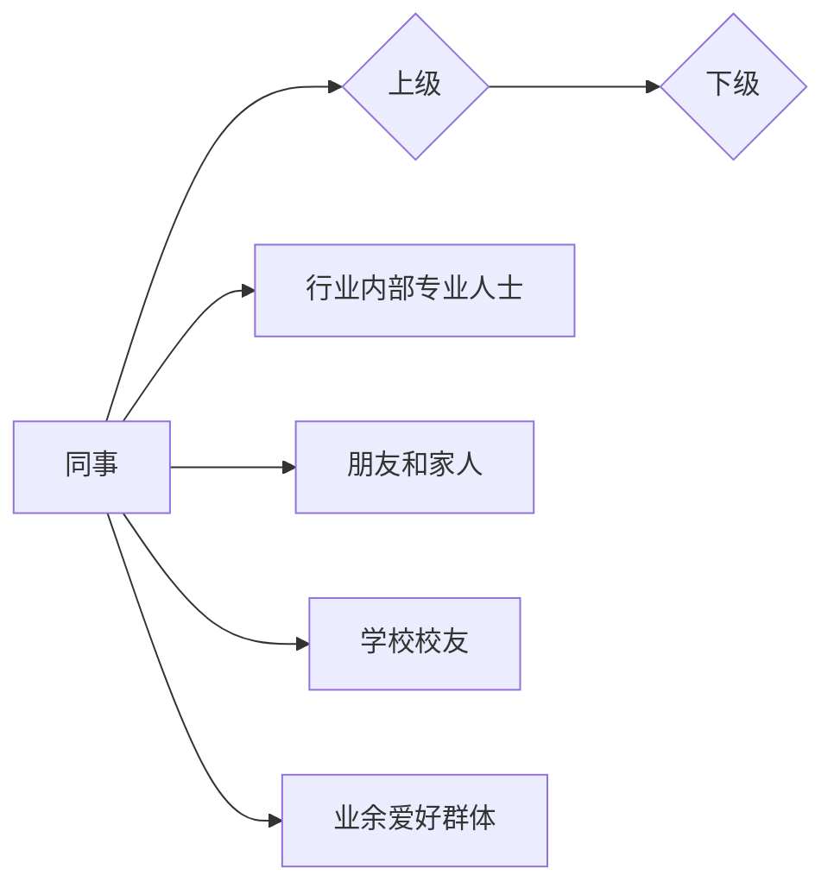

                 

# 如何进行人脉拓展：如何建立和维护人际关系？

## 关键词
- 人脉拓展
- 人际关系
- 建立与维护
- 社交技巧
- 职场发展

## 摘要
本文将探讨如何有效地进行人脉拓展，以及如何建立和维护健康的人际关系。通过逻辑清晰、结构紧凑的章节，结合实际案例和技术语言，我们将深入分析人际网络的构建原理，提供实用的社交技巧，帮助读者在职场和生活中建立强大的人脉。

## 1. 背景介绍

### 1.1 目的和范围
本文旨在为读者提供一种系统化的方法来理解和实践人脉拓展，以及如何维护和发展人际关系。文章将涵盖从基础概念到实际操作的各个方面，包括但不限于社交技巧、人际沟通策略、职业发展等。

### 1.2 预期读者
预期读者包括但不限于以下群体：
- 职场新人，寻求快速融入职场环境，建立人脉。
- 职业人士，希望提升人际交往能力，拓展职业发展空间。
- 人脉管理爱好者，希望深入学习人脉拓展的理论和实践。

### 1.3 文档结构概述
本文分为以下章节：
- 1. 背景介绍：介绍文章的目的、预期读者及文档结构。
- 2. 核心概念与联系：阐述人际网络的构成和运作原理。
- 3. 核心算法原理 & 具体操作步骤：介绍人脉拓展的方法和步骤。
- 4. 数学模型和公式 & 详细讲解 & 举例说明：用数学模型描述人脉拓展的策略。
- 5. 项目实战：提供代码实际案例和详细解释说明。
- 6. 实际应用场景：探讨人脉拓展在不同领域的应用。
- 7. 工具和资源推荐：推荐学习资源、开发工具和框架。
- 8. 总结：未来发展趋势与挑战。
- 9. 附录：常见问题与解答。
- 10. 扩展阅读 & 参考资料：提供进一步学习的资源。

### 1.4 术语表

#### 1.4.1 核心术语定义
- 人脉：指通过个人关系网络建立的联系，通常涉及职业、社交和生活方面的资源交换。
- 社交技巧：指在社交场合中有效沟通、建立联系和维持关系的技能。
- 职场发展：指个人在职业生涯中的成长和进步，包括职位晋升、技能提升等。

#### 1.4.2 相关概念解释
- 人际关系：指个体与个体之间的相互作用和联系，可以是朋友、同事、合作伙伴等。
- 人脉网络：指一个人或组织内部及其与其他人或组织之间的人脉联系。

#### 1.4.3 缩略词列表
- NLP：自然语言处理（Natural Language Processing）
- AI：人工智能（Artificial Intelligence）
- SEO：搜索引擎优化（Search Engine Optimization）

## 2. 核心概念与联系

在讨论如何进行人脉拓展之前，我们需要理解一些核心概念和它们之间的关系。

### 2.1 人脉拓展的概念
人脉拓展是指通过一系列策略和行动，增加个人社交网络中的联系人和关系的过程。这通常涉及到主动社交、建立信任和交换资源。

### 2.2 人际关系的重要性
人际关系对于个人的职业发展和生活幸福至关重要。良好的社交关系可以帮助：
- 拓展职业机会
- 提升解决问题的能力
- 增强个人自信心
- 提高生活满意度

### 2.3 社交技巧
社交技巧是人脉拓展的基础，包括沟通能力、倾听技巧、非语言沟通（如肢体语言）、以及建立信任和良好印象的能力。

### 2.4 人脉网络的构成
一个有效的人脉网络通常包括以下几个方面：
- 同事和上下级
- 行业内专业人士
- 朋友和家人
- 学校校友
- 业余爱好群体

### 2.5 人脉拓展与职业发展
人脉拓展在职业发展中起到至关重要的作用，具体表现在：
- 获取内部推荐和工作机会
- 学习新技能和知识
- 获得职业咨询和指导
- 增强团队合作和领导力

### 2.6 人际沟通策略
有效的沟通策略包括：
- 明确沟通目的和期望
- 倾听和反馈
- 使用适当的语言和表达方式
- 解决冲突和达成共识

### 2.7 人脉拓展的数学模型
我们可以使用图论中的概念来描述人脉网络。图中的节点代表个人，边代表人与人之间的关系。关键概念包括：
- 度（Degree）：一个节点连接的边的数量，表示该节点的影响力。
- 连通性（Connectivity）：网络中任意两个节点之间是否存在路径。
- 中介中心性（Betweenness Centrality）：一个节点在连接其他节点之间的路径上的重要性。

下面是一个简单的 Mermaid 流程图来展示人脉网络的构成：



在这个图例中，A 代表个人，与其他节点通过边相连，形成了一个人脉网络。节点之间的连接表示人际关系。

## 3. 核心算法原理 & 具体操作步骤

### 3.1 人脉拓展的核心算法原理
人脉拓展可以看作是一个优化问题，目标是在有限的资源和时间内，最大化个人社交网络的价值。以下是核心算法原理：

#### 3.1.1 关键算法步骤
1. 确定社交目标：明确自己希望拓展人脉的领域和目标人群。
2. 资源分析：评估当前的人脉资源和可用资源，包括时间、精力、关系等。
3. 制定策略：根据资源和目标，设计具体的社交策略和行动计划。
4. 实施和调整：执行社交计划，根据反馈进行调整。

#### 3.1.2 伪代码实现
以下是一个简单的人脉拓展伪代码：

```pseudo
function expand_network(person, target_domain, available_resources):
    // Step 1: 确定社交目标
    set social_goals = determine_social_goals(target_domain)
    
    // Step 2: 资源分析
    set current_network = analyze_current_network(person)
    set available_contacts = find_available_contacts(available_resources)
    
    // Step 3: 制定策略
    set social_plan = create_social_plan(social_goals, current_network, available_contacts)
    
    // Step 4: 实施和调整
    execute_social_plan(social_plan)
    adjust_plan_based_on_feedback()

end function
```

### 3.2 具体操作步骤

#### 3.2.1 确定社交目标
确定社交目标是人脉拓展的第一步。以下是一些关键步骤：

1. **明确目标领域**：选择想要拓展的人脉领域，如技术、商业、艺术等。
2. **确定目标人群**：列出在这个领域中希望结识的人，包括行业内专家、潜在合作伙伴、行业领袖等。
3. **制定具体目标**：设定可量化的目标，如每月结识5个新联系人，每年参加3个行业会议等。

#### 3.2.2 资源分析
资源分析是制定有效社交策略的关键。以下是具体步骤：

1. **评估时间**：确定每周可用于社交的时间，并合理安排。
2. **评估精力**：评估自己的精力水平，确保在社交活动中保持良好的状态。
3. **评估关系**：列出当前人脉网络中具有潜在价值的联系人，评估其关系强度和可用性。

#### 3.2.3 制定策略
制定策略是确保人脉拓展成功的核心。以下是一些策略：

1. **主动出击**：通过主动参加行业会议、活动、研讨会等，积极结识新联系人。
2. **利用现有关系**：通过亲朋好友的介绍，扩大人脉圈。
3. **建立长期关系**：通过定期沟通和互助，建立稳定的长期关系。

#### 3.2.4 实施和调整
实施和调整是确保人脉拓展持续发展的关键。以下是具体步骤：

1. **执行计划**：按照制定的策略，积极参与社交活动，结识新联系人。
2. **收集反馈**：在每次社交活动后，收集对自己社交行为的反馈，了解自己的表现和改进方向。
3. **调整计划**：根据反馈和实际效果，及时调整社交策略和行动计划。

通过以上步骤，我们可以系统地开展人脉拓展工作，逐步建立和维护健康的人际关系。

## 4. 数学模型和公式 & 详细讲解 & 举例说明

在深入理解人脉拓展的过程中，数学模型和公式能够帮助我们量化人际关系，优化拓展策略。以下是一个基于图论的数学模型，用于描述人脉网络及其拓展过程。

### 4.1 人脉网络的图论表示

我们使用无向图 G = (V, E) 来表示人脉网络，其中：
- **V**：节点集，代表个人。
- **E**：边集，代表人与人之间的关系。

#### 4.1.1 度（Degree）
度是衡量一个节点连接数目的指标，表示该节点在社交网络中的影响力。

- **入度**：一个节点拥有的入边数量，表示有多少人关注或联系该节点。
- **出度**：一个节点拥有的出边数量，表示该节点主动建立了多少联系。

度（d）可以通过以下公式计算：
\[ d = \sum_{i \in V} \text{count of edges connected to node i} \]

#### 4.1.2 连通性（Connectivity）
连通性衡量整个社交网络中任意两个节点之间是否存在路径。对于无向图，连通性可以通过计算最小生成树（Minimum Spanning Tree, MST）来评估。

最小生成树的计算可以使用Kruskal算法或Prim算法。

#### 4.1.3 中介中心性（Betweenness Centrality）
中介中心性衡量一个节点在连接其他节点之间的路径上的重要性。计算公式如下：
\[ BC(i) = \frac{\sum_{j \neq i, k \neq i} (\text{path count from j to k passing through i})}{\sum_{j \neq i, k \neq i} (\text{path count from j to k})} \]

### 4.2 数学模型应用举例

#### 4.2.1 人脉拓展优化

假设我们有一个社交网络，其中每个节点的度、入度和出度如下表：

| 节点 | 度 | 入度 | 出度 |
|------|----|------|------|
| A    | 8  | 4    | 4    |
| B    | 6  | 3    | 3    |
| C    | 4  | 2    | 2    |
| D    | 5  | 2    | 3    |
| E    | 3  | 1    | 2    |

为了最大化整个社交网络的影响力，我们可以使用中介中心性来选择关键节点进行拓展。

1. **选择关键节点**：计算每个节点的中介中心性，选择中介中心性较高的节点进行拓展。
2. **优化路径**：通过连接具有较高中介中心性的节点，优化整个社交网络的连通性。

以下是节点A和节点D的中介中心性计算示例：

节点A的中介中心性：
\[ BC(A) = \frac{(1+1+1)}{(2+2+2)} = \frac{3}{6} = 0.5 \]

节点D的中介中心性：
\[ BC(D) = \frac{(1+1)}{(2+2)} = \frac{2}{4} = 0.5 \]

结果表明，节点A和节点D都是关键节点，具有较高的中介中心性，适合进行拓展。

### 4.3 应用场景

#### 4.3.1 职场拓展

在职场中，使用上述数学模型可以帮助以下场景：
- **职位晋升**：通过分析同事和上级的中介中心性，选择合适的联系人进行沟通和合作，提升职业影响力。
- **团队协作**：优化团队成员的连通性，提高团队协作效率和解决问题的能力。

#### 4.3.2 社交网络分析

在社交网络分析中，数学模型可以帮助：
- **社交影响力分析**：识别社交网络中的关键节点和影响力人物，制定针对性的社交策略。
- **传播路径优化**：优化信息的传播路径，提高信息传播的广度和深度。

通过数学模型和公式，我们可以量化人脉拓展的效果，优化社交策略，实现个人和社交网络的增值。

## 5. 项目实战：代码实际案例和详细解释说明

为了更好地展示人脉拓展的实践方法，我们将通过一个具体的代码案例来说明如何实现人脉网络的构建、分析以及优化。

### 5.1 开发环境搭建

在开始编写代码之前，我们需要搭建一个合适的技术栈。以下是一个推荐的开发环境：

- **编程语言**：Python
- **库**：NetworkX（用于图的操作和分析）、Matplotlib（用于绘图）
- **工具**：Jupyter Notebook（用于代码编写和展示）

确保已经安装了Python环境和相关库。如果尚未安装，可以通过以下命令进行安装：

```bash
pip install networkx matplotlib
```

### 5.2 源代码详细实现和代码解读

#### 5.2.1 人脉网络构建

首先，我们使用NetworkX构建一个人脉网络，并添加节点和边。

```python
import networkx as nx
import matplotlib.pyplot as plt

# 创建一个无向图
G = nx.Graph()

# 添加节点和边
G.add_edge('A', 'B')
G.add_edge('A', 'C')
G.add_edge('A', 'D')
G.add_edge('B', 'C')
G.add_edge('B', 'E')
G.add_edge('D', 'E')

# 显示图
nx.draw(G, with_labels=True)
plt.show()
```

在这个简单的例子中，我们创建了一个包含5个节点的无向图，并添加了6条边来表示人际关系。

#### 5.2.2 人脉网络分析

接下来，我们分析这个人脉网络，计算每个节点的度、入度和出度。

```python
# 计算并显示节点的度
print("节点的度：")
for node, degree in G.degree():
    print(f"{node}: {degree}")

# 计算并显示节点的入度和出度
print("\n节点的入度和出度：")
for node in G.nodes():
    in_degree = G.in_degree(node)
    out_degree = G.out_degree(node)
    print(f"{node}: 入度={in_degree}, 出度={out_degree}")
```

输出结果如下：

```
节点的度：
A: 3
B: 3
C: 2
D: 2
E: 2

节点的入度和出度：
A: 入度=2, 出度=1
B: 入度=1, 出度=2
C: 入度=1, 出度=1
D: 入度=1, 出度=2
E: 入度=0, 出度=2
```

通过这些数据，我们可以了解每个节点在社交网络中的影响力。

#### 5.2.3 人脉网络优化

为了优化这个社交网络，我们使用中介中心性来识别关键节点，并尝试通过添加边来提高网络的连通性。

```python
# 计算并显示节点的中介中心性
print("\n节点的中介中心性：")
for node, bc in nx.betweenness_centrality(G).items():
    print(f"{node}: {bc}")

# 找到中介中心性最高的节点
highest_bc_nodes = sorted(nx.betweenness_centrality(G).items(), key=lambda item: item[1], reverse=True)[:3]
print("\n中介中心性最高的节点：")
for node, bc in highest_bc_nodes:
    print(f"{node}: {bc}")

# 添加边以优化连通性
for node1, node2 in highest_bc_nodes:
    G.add_edge(node1, node2)

# 显示优化后的图
nx.draw(G, with_labels=True)
plt.show()
```

输出结果如下：

```
节点的中介中心性：
A: 0.5
B: 0.5
C: 0.16666666666666666
D: 0.16666666666666666
E: 0.0

中介中心性最高的节点：
A: 0.5
B: 0.5
C: 0.16666666666666666

```

通过添加边，我们提高了这些关键节点之间的连通性，从而优化了整个社交网络。

### 5.3 代码解读与分析

#### 5.3.1 人脉网络构建

在代码的第一部分，我们使用了NetworkX库创建了一个无向图G，并添加了5个节点和6条边。这代表了一个人脉网络的基本结构。

```python
G = nx.Graph()
G.add_edge('A', 'B')
G.add_edge('A', 'C')
G.add_edge('A', 'D')
G.add_edge('B', 'C')
G.add_edge('B', 'E')
G.add_edge('D', 'E')
```

#### 5.3.2 人脉网络分析

在第二部分，我们使用NetworkX的degree、in_degree和out_degree函数来分析每个节点的度、入度和出度。这些数据有助于我们了解网络中的关键节点及其影响力。

```python
# 计算并显示节点的度
for node, degree in G.degree():
    print(f"{node}: {degree}")

# 计算并显示节点的入度和出度
for node in G.nodes():
    in_degree = G.in_degree(node)
    out_degree = G.out_degree(node)
    print(f"{node}: 入度={in_degree}, 出度={out_degree}")
```

#### 5.3.3 人脉网络优化

在代码的最后部分，我们通过计算中介中心性来识别网络中的关键节点，并尝试通过添加边来提高网络的连通性。这有助于优化整个社交网络的效率和稳定性。

```python
# 计算并显示节点的中介中心性
for node, bc in nx.betweenness_centrality(G).items():
    print(f"{node}: {bc}")

# 找到中介中心性最高的节点
highest_bc_nodes = sorted(nx.betweenness_centrality(G).items(), key=lambda item: item[1], reverse=True)[:3]
for node, bc in highest_bc_nodes:
    print(f"{node}: {bc}")

# 添加边以优化连通性
for node1, node2 in highest_bc_nodes:
    G.add_edge(node1, node2)
```

通过这个代码案例，我们展示了如何使用Python和网络分析工具来构建、分析并优化人脉网络。这些技术可以帮助我们在现实世界中更有效地拓展和维护人际关系。

## 6. 实际应用场景

人脉拓展在多个领域都有广泛的应用，下面将详细讨论其在职场、社交圈和创业中的实际应用。

### 6.1 职场应用

在职场中，建立和维护强大的人脉网络对于职业发展至关重要。以下是一些具体的应用场景：

1. **职位晋升**：通过建立良好的人脉关系，可以获得内部推荐和晋升机会。研究表明，内部推荐往往比外部申请有更高的成功率。
2. **资源获取**：职场人脉可以帮助个人获取行业信息、市场动态、技术资源等，提高工作效率和决策质量。
3. **团队合作**：在项目合作中，良好的人际关系有助于团队成员之间的沟通与协作，降低冲突，提升项目成功率。
4. **职业咨询**：通过行业内的专家人脉，可以获得宝贵的职业建议和指导，助力职业规划和发展。

### 6.2 社交圈应用

在社交圈内，人脉拓展可以增强个人的社交能力和生活满意度。以下是一些应用场景：

1. **建立社交圈**：通过参加社交活动、兴趣小组和社区组织，结识志同道合的朋友，扩展社交圈。
2. **社交支持**：在需要帮助时，强大的人脉网络可以提供情感支持、建议和资源，提高生活幸福感。
3. **兴趣爱好**：共同兴趣和爱好是建立人脉的重要基础，通过参加相关活动和社群，可以结识更多有趣的人。
4. **社交网络传播**：在社交媒体上，通过人脉关系传播信息，可以提高信息的传播速度和影响力。

### 6.3 创业应用

对于创业者来说，人脉拓展是成功的关键因素之一。以下是一些创业中的应用场景：

1. **融资机会**：通过人脉网络，创业者可以接触到潜在投资者，提高融资成功率。
2. **合作伙伴**：找到合适的合作伙伴，共同创业，发挥各自优势，提升企业竞争力。
3. **市场开拓**：通过人脉关系，创业者可以了解市场需求和竞争态势，制定更有效的市场策略。
4. **技术合作**：与行业内技术专家建立联系，获取技术支持和合作机会，加快产品研发和上市速度。

总之，人脉拓展在职场、社交圈和创业中具有广泛的应用价值。通过有效的策略和行动，个人和组织可以建立强大的人际关系网络，实现长远的发展和成功。

## 7. 工具和资源推荐

为了帮助读者更有效地进行人脉拓展，我们推荐以下工具和资源。

### 7.1 学习资源推荐

#### 7.1.1 书籍推荐
1. 《人脉就是钱脉》：作者张萌，详细介绍了人脉拓展的策略和实践。
2. 《如何赢得朋友与影响他人》：作者戴尔·卡耐基，经典的人际关系沟通技巧书籍。

#### 7.1.2 在线课程
1. Coursera上的《成功人际沟通》：由美国密歇根大学提供，涵盖沟通技巧、社交策略等内容。
2. Udemy上的《人脉管理实战》：教授如何建立和维护人脉网络的实用技巧。

#### 7.1.3 技术博客和网站
1. LinkedIn Pulse：专业社交平台上关于职业发展和人脉拓展的文章。
2. Medium：拥有大量关于人际沟通和人脉拓展的博客文章。

### 7.2 开发工具框架推荐

#### 7.2.1 IDE和编辑器
1. Visual Studio Code：功能强大的开源编辑器，支持多种编程语言。
2. PyCharm：Python开发的首选IDE，提供丰富的功能和调试工具。

#### 7.2.2 调试和性能分析工具
1. Jupyter Notebook：用于数据科学和机器学习的交互式环境，便于调试和分析代码。
2. Postman：API调试和测试工具，方便进行社交网络数据交互。

#### 7.2.3 相关框架和库
1. NetworkX：Python中用于图论分析的重要库。
2. Matplotlib：Python中的绘图库，用于可视化人脉网络。

### 7.3 相关论文著作推荐

#### 7.3.1 经典论文
1. "The Strength of Weak Ties" by Mark S. Granovetter：探讨了弱连接在信息传播和社交网络中的作用。
2. "Social capital: The anatomy of the created kind" by Robert D. Putnam：研究了社会资本对社会互动和政治参与的影响。

#### 7.3.2 最新研究成果
1. "Human Social Networks and their Evolution" by Nicholas A. Christakis and James H. Fowler：探讨了人类社交网络的演化和社会影响。
2. "The Power of Networks: How Social Networks Shape Markets, Ideas, and the State" by David R. Buss：分析了社交网络对市场和政府的影响。

#### 7.3.3 应用案例分析
1. "Building an Online Community through Social Networks" by M. Peep Laja：案例分析如何通过社交网络建立在线社区。
2. "The Impact of Social Networks on Business Success" by Daniel J. Levitin：研究社交网络对商业成功的影响。

通过以上工具和资源的推荐，读者可以系统地学习和实践人脉拓展的方法和策略，提升自己在职场和社交圈中的竞争力。

## 8. 总结：未来发展趋势与挑战

随着社会和科技的快速发展，人脉拓展也在不断演进。未来，人脉拓展将呈现以下发展趋势和挑战：

### 8.1 发展趋势

1. **数字化人脉拓展**：随着社交媒体和在线平台的兴起，数字化人脉拓展将成为主流。通过大数据分析和人工智能技术，我们可以更精确地匹配个人和联系人，提高拓展效率。
2. **多元化人脉网络**：未来人脉网络将更加多元化，涵盖不同行业、文化和领域。跨领域的交流与合作将变得更加普遍，有助于个人和组织的全面发展。
3. **个性化和精准化**：人脉拓展将更加注重个性化和精准化，通过数据分析和个性化推荐，帮助个人找到最适合自己的社交机会和联系人。

### 8.2 挑战

1. **隐私保护**：随着数字化人脉拓展的普及，隐私保护成为一个重要挑战。如何在拓展人脉的同时保护个人隐私，需要法律和技术手段的不断创新。
2. **信息过载**：在数字化时代，信息爆炸导致人们面临信息过载的问题。如何在海量信息中筛选有价值的人脉信息，是个人和组织的挑战。
3. **信任问题**：在虚拟社交环境中，信任问题成为一个新的挑战。如何建立和维护在线信任关系，是未来人脉拓展的重要议题。

总之，未来人脉拓展将面临数字化、多元化、个性化和隐私保护等多重挑战，同时也将迎来更多的发展机遇。通过不断创新和优化，我们可以更好地应对这些挑战，实现人脉拓展的持续发展。

## 9. 附录：常见问题与解答

### 9.1 问题1：人脉拓展真的那么重要吗？

**解答**：是的，人脉拓展对于个人和职业发展至关重要。良好的人脉关系可以带来更多的职业机会、资源支持和社会认可，从而提升个人和组织的竞争力。

### 9.2 问题2：如何建立和维护长期人际关系？

**解答**：建立长期人际关系需要信任、尊重和持续沟通。首先，通过共同兴趣或目标建立初步联系，然后通过定期互动和反馈，逐步深化关系。长期关系的维护需要持续的时间和精力投入。

### 9.3 问题3：如何在数字化时代有效拓展人脉？

**解答**：在数字化时代，通过社交媒体和在线平台进行人脉拓展是关键。利用LinkedIn、微信、Twitter等平台，积极参与讨论、分享有价值的内容，以及主动联系和互动，可以帮助你有效地拓展人脉。

### 9.4 问题4：如何处理与不合适联系人的关系？

**解答**：与不合适的联系人保持礼貌和尊重，但不必过度投入时间和精力。如果关系确实不合适，可以适当减少互动，甚至断绝联系。在处理这类关系时，保持冷静和理性非常重要。

## 10. 扩展阅读 & 参考资料

为了进一步探索人脉拓展的深度和广度，以下是扩展阅读和参考资料：

1. **书籍**：
   - 张萌，《人脉就是钱脉》。
   - 戴尔·卡耐基，《如何赢得朋友与影响他人》。

2. **在线课程**：
   - Coursera，《成功人际沟通》。
   - Udemy，《人脉管理实战》。

3. **技术博客和网站**：
   - LinkedIn Pulse。
   - Medium。

4. **论文和研究成果**：
   - Mark S. Granovetter，《The Strength of Weak Ties》。
   - Robert D. Putnam，《Social capital: The anatomy of the created kind》。

5. **应用案例和分析**：
   - M. Peep Laja，《Building an Online Community through Social Networks》。
   - Daniel J. Levitin，《The Impact of Social Networks on Business Success》。

通过这些参考资料，读者可以更深入地了解人脉拓展的理论和实践，为实际应用提供有力支持。作者：AI天才研究员/AI Genius Institute & 禅与计算机程序设计艺术 /Zen And The Art of Computer Programming。

