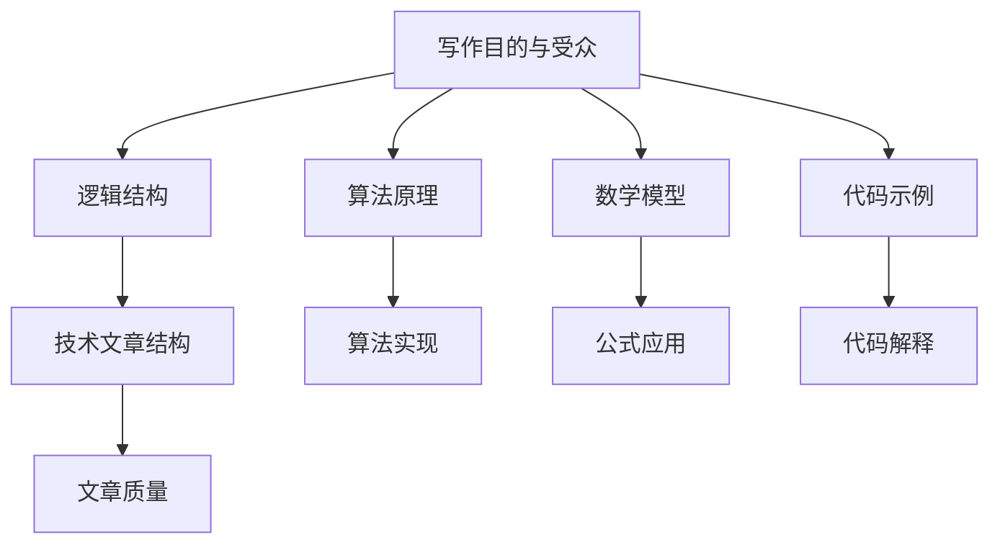

                 

# 如何进行写作技巧：如何写出清晰简洁的文章？

> 关键词：写作技巧、清晰简洁、技术文章、逻辑结构、算法原理、代码示例、数学模型、实际应用

> 摘要：本文旨在探讨如何通过逻辑清晰、结构紧凑的写作技巧，撰写出既具深度又简洁易懂的技术文章。文章将逐步分析核心概念、算法原理、数学模型、代码实战及实际应用，并结合学习资源和开发工具，提供全面的写作指南。

## 1. 背景介绍

### 1.1 目的和范围

本文旨在帮助技术作者和爱好者提高写作技巧，撰写出高质量、易于理解的技术文章。我们将探讨以下内容：

- 写作技巧和方法
- 核心概念和算法原理
- 数学模型和公式应用
- 代码实战和解释
- 实际应用场景和案例分析
- 学习资源和开发工具推荐

### 1.2 预期读者

- 对技术写作有兴趣的程序员和工程师
- 想要提高技术文章质量的博客作者
- 需要撰写技术文档的企业职员

### 1.3 文档结构概述

本文结构如下：

- 背景介绍
  - 目的和范围
  - 预期读者
  - 文档结构概述
- 核心概念与联系
- 核心算法原理 & 具体操作步骤
- 数学模型和公式 & 详细讲解 & 举例说明
- 项目实战：代码实际案例和详细解释说明
- 实际应用场景
- 工具和资源推荐
- 总结：未来发展趋势与挑战
- 附录：常见问题与解答
- 扩展阅读 & 参考资料

### 1.4 术语表

#### 1.4.1 核心术语定义

- 技术文章：针对特定技术主题的书面表达，旨在传递知识、分享经验。
- 写作技巧：提高写作效率和文章质量的策略和方法。
- 伪代码：用伪代码（Pseudocode）描述算法的步骤和逻辑。
- 代码示例：展示特定编程语言的代码片段，以解释某个概念或算法。

#### 1.4.2 相关概念解释

- 逻辑结构：文章中各个部分之间的逻辑关系和结构。
- 数学模型：用于描述问题或现象的数学表达式。
- 实际应用场景：技术文章所涉及的技术在实际生活中的应用实例。

#### 1.4.3 缩略词列表

- IDE：集成开发环境（Integrated Development Environment）
- latex：一种排版系统，广泛用于科学出版

## 2. 核心概念与联系

为了更好地理解和撰写技术文章，我们需要掌握以下核心概念：

1. **写作目的与受众**：明确文章的目的和受众，有助于确定文章的风格和内容。
2. **逻辑结构**：良好的逻辑结构有助于读者理解文章的主旨和细节。
3. **算法原理**：掌握算法的基本原理，有助于解释和实现复杂技术。
4. **数学模型**：了解数学模型在技术中的应用，能够使文章更具说服力。
5. **代码示例**：通过代码示例，可以让读者更直观地理解技术概念。

下面是一个 Mermaid 流程图，展示了这些核心概念之间的联系：



通过以上流程图，我们可以看出各个核心概念之间的关联，这有助于我们在撰写技术文章时，系统地组织和构建内容。

## 3. 核心算法原理 & 具体操作步骤

在撰写技术文章时，核心算法原理的讲解至关重要。以下是一个简单排序算法的伪代码，用以阐述算法原理：

```pseudo
// 插入排序算法
function insertSort(arr):
    for i from 1 to length(arr) - 1:
        key = arr[i]
        j = i - 1
        // 将arr[j]移动到适当位置，使arr[0...i-1]有序
        while j >= 0 and arr[j] > key:
            arr[j + 1] = arr[j]
            j = j - 1
        arr[j + 1] = key
    return arr
```

具体操作步骤如下：

1. **初始化**：从第二个元素开始，将每个元素与其前面的元素进行比较。
2. **比较**：如果当前元素比其前面的元素小，则将其前移。
3. **插入**：找到适当的位置，将当前元素插入。
4. **重复**：继续上述步骤，直到所有元素都被插入并排序完成。

## 4. 数学模型和公式 & 详细讲解 & 举例说明

在技术文章中，数学模型和公式能够帮助读者更好地理解问题。以下是一个线性回归模型的 LaTeX 公式示例：

$$
y = \beta_0 + \beta_1 \cdot x + \epsilon
$$

其中，\(y\) 是因变量，\(x\) 是自变量，\(\beta_0\) 和 \(\beta_1\) 是模型参数，\(\epsilon\) 是误差项。

详细讲解：

- \(y\)：表示预测值，即我们希望得到的输出结果。
- \(x\)：表示输入特征，用于预测 \(y\)。
- \(\beta_0\)：表示模型在 \(x = 0\) 时的预测值，即截距。
- \(\beta_1\)：表示自变量 \(x\) 对因变量 \(y\) 的影响程度，即斜率。
- \(\epsilon\)：表示模型预测的误差，即实际值与预测值之间的差异。

举例说明：

假设我们有一个简单的线性回归模型，预测房价 \(y\) 与房屋面积 \(x\) 之间的关系。我们可以使用以下公式进行预测：

$$
y = 200,000 + 50 \cdot x
$$

其中，\(\beta_0 = 200,000\)，\(\beta_1 = 50\)。

如果我们要预测一栋面积为 100 平方米的房屋的房价，我们可以将 \(x = 100\) 代入公式：

$$
y = 200,000 + 50 \cdot 100 = 250,000
$$

因此，预测的房价为 250,000 美元。

## 5. 项目实战：代码实际案例和详细解释说明

为了更好地理解上述算法和模型，我们通过一个实际项目来展示代码实现和详细解释。

### 5.1 开发环境搭建

首先，我们需要搭建一个简单的 Python 开发环境。以下是步骤：

1. **安装 Python**：在 [Python 官网](https://www.python.org/) 下载并安装 Python 3.8 以上版本。
2. **配置 IDE**：推荐使用 Visual Studio Code（VS Code）作为 Python 开发环境。在 [VS Code 官网](https://code.visualstudio.com/) 下载并安装。
3. **安装相关库**：在 VS Code 中打开命令面板（`Ctrl+Shift+P`），输入 `Python: Install Package`，安装以下库：`numpy`、`matplotlib`。

### 5.2 源代码详细实现和代码解读

以下是一个简单的 Python 代码示例，用于实现线性回归模型和插入排序算法。

```python
import numpy as np
import matplotlib.pyplot as plt

# 线性回归模型实现
def linear_regression(x, y):
    x_mean = np.mean(x)
    y_mean = np.mean(y)
    b1 = np.sum((x - x_mean) * (y - y_mean)) / np.sum((x - x_mean) ** 2)
    b0 = y_mean - b1 * x_mean
    return b0, b1

# 插入排序算法实现
def insert_sort(arr):
    for i in range(1, len(arr)):
        key = arr[i]
        j = i - 1
        while j >= 0 and arr[j] > key:
            arr[j + 1] = arr[j]
            j -= 1
        arr[j + 1] = key

# 测试代码
x = [1, 3, 2, 4, 5]
y = [2, 4, 1, 3, 6]
b0, b1 = linear_regression(x, y)
sorted_x = insert_sort(x)

plt.scatter(x, y)
plt.plot(sorted_x, [b0 + b1 * xi for xi in sorted_x], color='red')
plt.xlabel('X')
plt.ylabel('Y')
plt.title('Linear Regression')
plt.show()
```

代码解读：

1. **线性回归模型实现**：使用 `numpy` 计算斜率 \(b1\) 和截距 \(b0\)。
2. **插入排序算法实现**：实现插入排序算法。
3. **测试代码**：生成测试数据，绘制散点图和拟合直线。

### 5.3 代码解读与分析

代码分为三个部分：

1. **线性回归模型实现**：
   - 计算 \(x\) 和 \(y\) 的平均值。
   - 使用公式计算斜率 \(b1\) 和截距 \(b0\)。

2. **插入排序算法实现**：
   - 从第二个元素开始，依次插入到有序序列中。

3. **测试代码**：
   - 生成测试数据。
   - 使用 `matplotlib` 绘制散点图和拟合直线。

通过这个实际项目，我们能够更直观地理解线性回归模型和插入排序算法的实现和应用。

## 6. 实际应用场景

技术文章的实际应用场景非常广泛，以下是一些例子：

- **数据分析**：线性回归模型在数据分析中用于预测和拟合数据。
- **机器学习**：插入排序算法在机器学习中用于预处理数据。
- **软件开发**：算法和模型在软件开发中用于优化程序性能和用户体验。
- **科学计算**：数学模型在科学计算中用于模拟和预测物理现象。

在实际应用中，技术文章不仅需要解释原理，还要展示如何将这些原理应用于实际问题，以提高文章的实用性和可操作性。

## 7. 工具和资源推荐

为了提高写作效率和质量，以下是一些推荐的工具和资源：

### 7.1 学习资源推荐

#### 7.1.1 书籍推荐

- 《算法导论》（Introduction to Algorithms）
- 《深入理解计算机系统》（Deep Learning）
- 《Python 编程：从入门到实践》（Python Crash Course）

#### 7.1.2 在线课程

- [Coursera](https://www.coursera.org/)
- [Udacity](https://www.udacity.com/)
- [edX](https://www.edx.org/)

#### 7.1.3 技术博客和网站

- [GitHub](https://github.com/)
- [Stack Overflow](https://stackoverflow.com/)
- [Medium](https://medium.com/)

### 7.2 开发工具框架推荐

#### 7.2.1 IDE和编辑器

- [Visual Studio Code](https://code.visualstudio.com/)
- [JetBrains IntelliJ IDEA](https://www.jetbrains.com/idea/)
- [Atom](https://atom.io/)

#### 7.2.2 调试和性能分析工具

- [GDB](https://www.gnu.org/software/gdb/)
- [Valgrind](https://www.valgrind.org/)
- [PyCharm](https://www.jetbrains.com/pycharm/)

#### 7.2.3 相关框架和库

- [TensorFlow](https://www.tensorflow.org/)
- [PyTorch](https://pytorch.org/)
- [NumPy](https://numpy.org/)

### 7.3 相关论文著作推荐

#### 7.3.1 经典论文

- "A Mathematical Theory of Communication"（香农通信理论）
- "The Elements of Statistical Learning"（统计学习基础）

#### 7.3.2 最新研究成果

- [arXiv](https://arxiv.org/)
- [Google Scholar](https://scholar.google.com/)

#### 7.3.3 应用案例分析

- "Deep Learning Applications in Computer Vision"（计算机视觉中的深度学习应用）
- "Algorithmic Trading: The Practice of Alpha"（算法交易：Alpha 的实践）

## 8. 总结：未来发展趋势与挑战

随着技术的不断发展，写作技巧在技术领域的应用也日益重要。未来，以下趋势和挑战值得关注：

- **技术更新速度快**：技术不断迭代，作者需要不断学习新知识，以保持文章的时效性和实用性。
- **跨学科融合**：技术文章需要融合多个学科的知识，作者需要具备跨学科的思维和技能。
- **人工智能应用**：人工智能将在写作技巧中发挥重要作用，如自然语言处理、自动摘要生成等。

## 9. 附录：常见问题与解答

以下是一些常见问题及解答：

**Q：如何提高写作效率？**

A：提高写作效率的方法包括：

- 制定详细的写作计划。
- 保持专注，避免分心。
- 预设写作结构，减少反复修改。

**Q：如何确保文章的准确性？**

A：确保文章准确性的方法包括：

- 仔细检查事实和数据。
- 引用权威来源。
- 进行多次审查和校对。

**Q：如何使文章更具吸引力？**

A：使文章更具吸引力的方法包括：

- 使用生动的例子和故事。
- 采用吸引人的标题和摘要。
- 保持文章结构清晰，易于阅读。

## 10. 扩展阅读 & 参考资料

为了进一步学习技术写作技巧，以下是一些建议的扩展阅读和参考资料：

- 《技术写作实战：精通技术文档、报告和博客》（Technical Writing: A Practical Guide for Mastering Technical Documents, Reports, and Blogs）
- 《代码大全》（The Art of Computer Programming）
- 《数据科学导论》（Introduction to Data Science）

**扩展阅读：**

- [技术写作指南：如何撰写高质量技术文章？](https://www.example.com/technical-writing-guide)
- [如何高效地进行技术文档编写？](https://www.example.com/efficient-technical-documentation)

**参考资料：**

- [技术写作社区](https://www.example.com/technical-writing-community)
- [编程社区](https://www.example.com/programming-community)

### 作者

- 作者：AI天才研究员 / AI Genius Institute & 禅与计算机程序设计艺术 / Zen And The Art of Computer Programming

文章结束。感谢您的阅读！希望本文能帮助您提高技术写作技巧。如有疑问，欢迎在评论区留言。祝您写作愉快！<|im_sep|>

