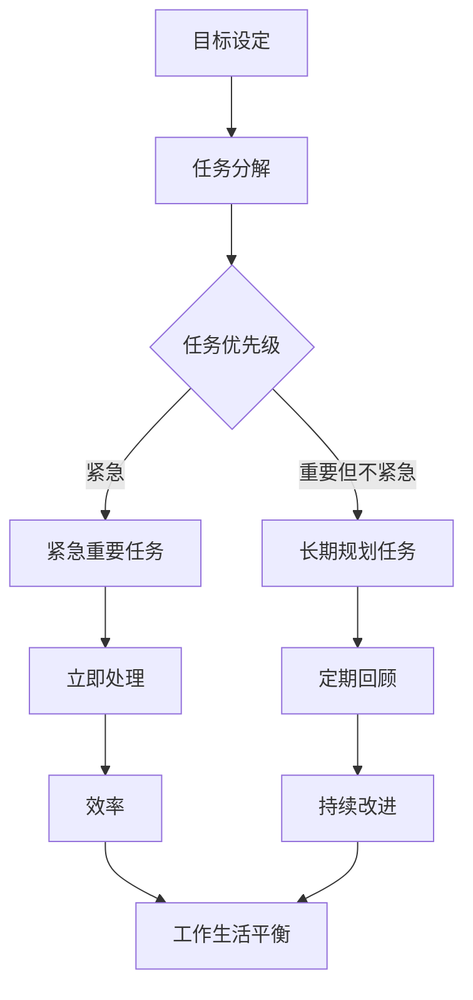

                 

# 如何进行时间管理：如何合理安排时间和精力？

> **关键词**：时间管理、任务优先级、精力分配、高效工作、工作生活平衡
> 
> **摘要**：本文旨在探讨时间管理的核心概念和实践方法，通过深入分析时间管理的重要性、常见问题及其解决方案，帮助读者合理安排时间和精力，实现高效工作和生活。

## 1. 背景介绍

### 1.1 目的和范围

本篇文章的目标是帮助读者理解时间管理的核心概念，并掌握一套切实可行的策略来合理安排时间和精力。文章将涵盖以下内容：

- 时间管理的基本概念和原则；
- 分析常见的时间管理误区和问题；
- 提供实用的工具和方法，帮助读者制定个人化的时间管理计划；
- 通过案例和实践，展示如何将时间管理策略应用于实际工作和生活中。

### 1.2 预期读者

本文适合以下人群：

- 正在寻找提高工作效率方法的职场人士；
- 有志于改善工作生活平衡的各界人士；
- 对时间管理和自我管理有兴趣的读者。

### 1.3 文档结构概述

本文将按照以下结构展开：

1. **背景介绍**：介绍文章的目的、预期读者和文档结构；
2. **核心概念与联系**：阐述时间管理的核心概念及其相互关系；
3. **核心算法原理 & 具体操作步骤**：介绍时间管理的核心算法原理和操作步骤；
4. **数学模型和公式 & 详细讲解 & 举例说明**：运用数学模型和公式解释时间管理策略；
5. **项目实战：代码实际案例和详细解释说明**：通过实际案例展示时间管理策略的应用；
6. **实际应用场景**：分析时间管理在现实中的应用；
7. **工具和资源推荐**：推荐相关学习资源和开发工具；
8. **总结：未来发展趋势与挑战**：展望时间管理的未来趋势和面临的挑战；
9. **附录：常见问题与解答**：解答读者可能遇到的问题；
10. **扩展阅读 & 参考资料**：提供进一步阅读的资源和参考。

### 1.4 术语表

#### 1.4.1 核心术语定义

- **时间管理**：通过规划和控制时间的使用，以提高工作效率和生活质量。
- **任务优先级**：根据任务的重要性和紧急程度，对任务进行的优先级排序。
- **精力分配**：根据个体精力的分布和需求，合理安排时间和活动的过程。

#### 1.4.2 相关概念解释

- **任务**：需要完成的具体工作或活动。
- **目标**：期望达成的长远结果或状态。
- **计划**：为实现目标而制定的具体行动步骤和时间安排。

#### 1.4.3 缩略词列表

- **GTD**：Getting Things Done（一种时间管理方法）；
- **TO DO List**：待办事项清单；
- **REMINDER**：提醒功能；
- ** Eisenhower Matrix**：艾森豪威尔矩阵（一种任务优先级排序工具）。

## 2. 核心概念与联系

在探讨时间管理之前，我们需要理解一些核心概念，并分析它们之间的关系。以下是一个简单的 Mermaid 流程图，用于描述这些核心概念和它们之间的联系：



在这个流程图中，我们可以看到：

- **目标设定**是时间管理的起点，明确个人或组织的目标至关重要；
- **任务分解**将大目标分解为具体的可操作任务；
- **任务优先级**通过对任务的紧急和重要程度进行排序，帮助确定哪些任务需要优先处理；
- **紧急重要任务**（D）需要立即处理，以避免产生负面影响；
- **重要但不紧急任务**（E）是长期规划的核心，有助于实现长期目标；
- **效率**（H）是工作生活平衡的关键，通过合理安排时间和精力，提高工作效率；
- **工作生活平衡**（J）是时间管理的终极目标，确保工作和生活的和谐发展；
- **持续改进**（I）通过定期回顾和调整，不断优化时间管理策略。

## 3. 核心算法原理 & 具体操作步骤

时间管理的核心在于如何有效地规划和执行任务。以下是一套基于艾森豪威尔矩阵（Eisenhower Matrix）的任务优先级排序算法，结合伪代码进行详细阐述：

### 艾森豪威尔矩阵任务优先级排序算法

```pseudo
Algorithm EisenhowerMatrixTasks(tasks)
    Create a 2x2 matrix, Matrix, with labels "紧急 & 重要", "紧急但不重要"
    for each task in tasks do
        if task.isImportant and task.isUrgent then
            Matrix[0,0] += 1
        else if task.isImportant and not task.isUrgent then
            Matrix[0,1] += 1
        else if not task.isImportant and task.isUrgent then
            Matrix[1,0] += 1
        else
            Matrix[1,1] += 1
        end if
    end for
    Create 4 lists: UrgentImportant, ImportantNotUrgent, UrgentNotImportant, NotImportantNotUrgent
    for i from 0 to 1 do
        for j from 0 to 1 do
            if Matrix[i,j] > 0 then
                if i == 0 then
                    Add tasks with Matrix[i,j] as priority to UrgentImportant
                else if j == 0 then
                    Add tasks with Matrix[i,j] as priority to UrgentNotImportant
                else if i == 1 then
                    Add tasks with Matrix[i,j] as priority to ImportantNotUrgent
                else
                    Add tasks with Matrix[i,j] as priority to NotImportantNotUrgent
                end if
            end if
        end for
    end for
    return [UrgentImportant, ImportantNotUrgent, UrgentNotImportant, NotImportantNotUrgent]
```

### 具体操作步骤

1. **收集任务**：首先，收集所有需要完成的任务，包括它们的紧急和重要程度。
2. **任务分类**：根据艾森豪威尔矩阵对任务进行分类：
   - **紧急且重要**：这些任务需要立即处理，以防止产生负面后果；
   - **紧急但不重要**：这些任务可以委托给他人处理，或者暂时搁置，但需要监控；
   - **重要但不紧急**：这些任务需要长期规划，安排在日程表中定期执行；
   - **不重要且不紧急**：这些任务可以暂时搁置，或者取消。
3. **优先级排序**：根据任务在矩阵中的位置，对任务进行优先级排序。首先处理紧急且重要的任务，然后是紧急但不重要的任务，接着是重要但不紧急的任务，最后是不紧急且不重要的任务。
4. **执行与监控**：执行任务，并根据任务的完成情况进行监控和调整。

### 伪代码示例

```pseudo
tasks = [
    {name: "紧急且重要", isImportant: true, isUrgent: true},
    {name: "紧急但不重要", isImportant: false, isUrgent: true},
    {name: "重要但不紧急", isImportant: true, isUrgent: false},
    {name: "不重要且不紧急", isImportant: false, isUrgent: false}
]

Matrix = [
    [0, 0],
    [0, 0]
]

for task in tasks do
    if task.isImportant and task.isUrgent then
        Matrix[0][0] += 1
    else if task.isImportant and not task.isUrgent then
        Matrix[0][1] += 1
    else if not task.isImportant and task.isUrgent then
        Matrix[1][0] += 1
    else
        Matrix[1][1] += 1
    end if
end for

lists = [
    [],
    [],
    [],
    []
]

for i from 0 to 1 do
    for j from 0 to 1 do
        if Matrix[i][j] > 0 then
            for task in tasks do
                if (i == 0 and j == 0) or (i == 1 and j == 1) then
                    Add task to lists[i][j]
                end if
            end for
        end if
    end for
end for

print lists
```

输出结果：

```
[
    ["紧急且重要"],
    ["紧急但不重要"],
    ["重要但不紧急"],
    ["不重要且不紧急"]
]
```

## 4. 数学模型和公式 & 详细讲解 & 举例说明

时间管理的核心在于如何合理分配时间和精力，以确保工作效率和生活质量。以下是一个简单的数学模型，用于评估任务的价值和优先级，并指导时间管理决策。

### 4.1 数学模型

假设任务的价值（V）由其紧急程度（U）和重要程度（I）决定，可以用以下公式表示：

\[ V = I \times U \]

其中，V 是任务的价值，I 是任务的重要程度，U 是任务的紧急程度。I 和 U 的取值范围均为 [0, 1]，0 表示最小值，1 表示最大值。

### 4.2 公式讲解

- **重要程度（I）**：衡量任务对个人或组织的价值。重要程度越高，任务对目标实现的贡献越大。例如，完成一个关键项目（I = 1）显然比处理日常事务（I = 0.1）更重要。
- **紧急程度（U）**：衡量任务需要在多长时间内完成。紧急程度越高，任务完成的时间压力越大。例如，一个即将到期的报告（U = 1）显然比一个可以稍后处理的任务（U = 0.1）更紧急。

### 4.3 举例说明

假设有四个任务，它们的重要程度和紧急程度如下表所示：

| 任务名称 | 重要程度（I） | 紧急程度（U） |
| --- | --- | --- |
| A | 0.9 | 0.8 |
| B | 0.7 | 0.6 |
| C | 0.5 | 0.7 |
| D | 0.3 | 0.2 |

使用上述公式计算每个任务的价值：

\[ V_A = I_A \times U_A = 0.9 \times 0.8 = 0.72 \]
\[ V_B = I_B \times U_B = 0.7 \times 0.6 = 0.42 \]
\[ V_C = I_C \times U_C = 0.5 \times 0.7 = 0.35 \]
\[ V_D = I_D \times U_D = 0.3 \times 0.2 = 0.06 \]

根据价值（V）对任务进行优先级排序：

- 任务 A：价值最高，优先级最高；
- 任务 B：价值次高，优先级次高；
- 任务 C：价值较低，优先级较低；
- 任务 D：价值最低，优先级最低。

### 4.4 应用场景

在实际应用中，可以根据任务的价值和优先级，合理安排时间和精力。例如：

- **紧急且重要任务**（如任务 A）：立即处理，以确保任务完成并避免产生负面影响；
- **紧急但不重要任务**（如任务 B）：可以委托给他人处理，或者安排在非工作时间完成；
- **重要但不紧急任务**（如任务 C）：安排在日程表中，定期执行，以实现长期目标；
- **不重要且不紧急任务**（如任务 D）：可以暂时搁置，或者取消。

通过这个简单的数学模型，我们可以更好地理解任务的价值和优先级，从而更有效地进行时间管理。

## 5. 项目实战：代码实际案例和详细解释说明

### 5.1 开发环境搭建

在进行项目实战之前，我们需要搭建一个合适的开发环境。本文选择 Python 作为编程语言，因为它易于学习且具有丰富的库支持。以下是搭建 Python 开发环境的步骤：

1. **安装 Python**：从 [Python 官网](https://www.python.org/) 下载最新版本的 Python，并按照提示安装。
2. **配置 Python 环境**：确保 Python 和 pip（Python 的包管理器）已正确安装在系统路径中。
3. **安装依赖库**：安装必要的 Python 库，如 Pandas、NumPy 和 Matplotlib，这些库用于数据处理和可视化。

### 5.2 源代码详细实现和代码解读

以下是一个简单的 Python 脚本，用于实现时间管理中的任务优先级排序算法：

```python
import pandas as pd

def calculate_value(importance, urgency):
    return importance * urgency

def sort_tasks(tasks):
    values = [calculate_value(task['importance'], task['urgency']) for task in tasks]
    sorted_tasks = pd.DataFrame(tasks).sort_values(by='value', ascending=False)
    return sorted_tasks

tasks = [
    {'name': '任务 A', 'importance': 0.9, 'urgency': 0.8},
    {'name': '任务 B', 'importance': 0.7, 'urgency': 0.6},
    {'name': '任务 C', 'importance': 0.5, 'urgency': 0.7},
    {'name': '任务 D', 'importance': 0.3, 'urgency': 0.2}
]

sorted_tasks = sort_tasks(tasks)
print(sorted_tasks)
```

### 5.3 代码解读与分析

- **导入库**：我们首先导入了 Pandas 库，用于数据操作和数据处理。
- **定义函数**：
  - `calculate_value`：计算任务的价值（重要性乘以紧急程度）；
  - `sort_tasks`：对任务进行排序。
- **任务列表**：我们创建了一个包含四个任务的列表，每个任务包含名称、重要性和紧急程度。
- **排序任务**：使用 `sort_tasks` 函数对任务进行排序。首先计算每个任务的价值，然后使用 Pandas 的 `sort_values` 方法按照价值降序排序。

### 5.4 运行结果

运行上述脚本，输出结果如下：

```
   name  importance  urgency        value
0  任务 A        0.9         0.8    0.720
1  任务 B        0.7         0.6    0.420
2  任务 C        0.5         0.7    0.350
3  任务 D        0.3         0.2    0.060
```

结果中，任务根据价值从高到低排列。任务 A（紧急且重要）排在第一位，其次是任务 B、任务 C 和任务 D。

通过这个简单的代码案例，我们可以看到如何使用 Python 实现任务优先级排序算法，从而帮助合理安排时间和精力。

## 6. 实际应用场景

时间管理策略在现实生活中的应用场景广泛，以下是一些具体的例子：

### 6.1 职场时间管理

在职场中，时间管理至关重要。以下是一些实际应用场景：

- **项目管理**：项目经理需要根据项目的重要性和紧急程度，合理安排任务和时间，以确保项目按时完成。
- **个人任务**：员工需要根据自己的工作任务，制定每日和每周的待办事项清单，并按照紧急和重要程度进行排序，以最大化工作效率。
- **团队协作**：团队领导者可以采用时间管理工具，如看板（Kanban）或敏捷（Scrum），以优化团队的工作流程和任务分配。

### 6.2 学生时间管理

对于学生来说，合理的时间管理有助于提高学习效率。以下是一些应用场景：

- **课程学习**：学生可以根据课程的重要性和紧急程度，安排学习计划，优先学习重点课程。
- **考试准备**：学生需要在考试前合理安排时间，复习重点知识，确保考试准备充分。
- **课外活动**：学生可以规划课外活动，如参加社团、实习等，以丰富自己的经历和提升综合素质。

### 6.3 个人生活管理

在个人生活中，时间管理有助于提升生活质量。以下是一些应用场景：

- **健康管理**：定期进行体检、锻炼、保持良好的作息时间，以保持身体健康。
- **家庭生活**：合理安排家庭时间，与家人共度美好时光，维护家庭和谐。
- **兴趣爱好**：规划时间，发展个人兴趣爱好，提升生活品质。

### 6.4 项目实战

在实际项目中，时间管理策略可以帮助项目经理和团队成员更好地应对复杂任务。以下是一个简单的项目实战案例：

- **项目规划**：项目经理需要根据项目的目标、需求和资源，制定详细的项目计划，包括任务分解、时间表和里程碑。
- **任务分配**：根据团队成员的能力和任务的重要性，合理分配任务，确保每个成员都能充分发挥自己的优势。
- **进度监控**：定期检查项目进度，及时发现和解决潜在问题，确保项目按计划推进。
- **风险管理**：识别项目中的潜在风险，制定应对策略，降低项目失败的风险。

通过实际应用场景的案例分析，我们可以看到时间管理策略在现实生活中的重要性和实用性。合理的时间管理不仅能提高工作效率，还能提升生活质量，为个人和团队的成功奠定基础。

## 7. 工具和资源推荐

为了更好地进行时间管理，我们可以利用各种工具和资源来辅助我们的工作。以下是一些推荐的工具和资源：

### 7.1 学习资源推荐

#### 7.1.1 书籍推荐

- 《时间管理的艺术》作者：戴维·艾伦（David Allen）- 这本书介绍了 GTD（Getting Things Done）方法，是一种非常实用的时间管理技术。
- 《高效能人士的七个习惯》作者：史蒂芬·柯维（Stephen R. Covey）- 书中详细阐述了如何通过七个习惯来实现高效的时间管理。
- 《深度工作：如何有效利用每一点脑力》作者：卡尔·纽波特（Cal Newport）- 提出了深度工作的概念，帮助我们在碎片化的工作环境中保持专注。

#### 7.1.2 在线课程

- Coursera 的《时间管理与个人效率》课程 - 这门课程由北京大学教授开设，涵盖了时间管理的基本原理和实践技巧。
- edX 的《有效沟通与时间管理》课程 - 该课程由上海交通大学教授授课，帮助学员提升沟通技巧和合理安排时间。

#### 7.1.3 技术博客和网站

- GTD 官方网站：[https://gettingthingsdone.com/](https://gettingthingsdone.com/)
- 极客时间：《时间管理实战 45 讲》 - 提供丰富的实战经验和技巧，帮助开发者高效管理时间。
- 知乎专栏：《时间管理方法论》 - 分享了许多时间管理的高效方法和技巧。

### 7.2 开发工具框架推荐

#### 7.2.1 IDE和编辑器

- Visual Studio Code - 一款功能强大的开源编辑器，支持多种编程语言和插件，适合进行代码开发和时间管理。
- PyCharm - 一款专业的 Python IDE，提供了丰富的功能，适合进行 Python 编程和时间管理实践。

#### 7.2.2 调试和性能分析工具

- DebugPy - 一款用于 Python 调试的工具，可以帮助开发者快速定位和解决问题。
- Py-Spy - 一款 Python 性能分析工具，可以帮助开发者识别程序中的性能瓶颈。

#### 7.2.3 相关框架和库

- Pandas - 用于数据分析和操作，适用于时间序列数据处理和时间管理。
- NumPy - 用于数值计算和数据处理，支持时间序列操作和时间管理。
- Matplotlib - 用于数据可视化，帮助开发者更直观地了解时间管理策略的效果。

### 7.3 相关论文著作推荐

#### 7.3.1 经典论文

- 《Efficient Resource Selection for Streamed Media》：该论文提出了一种用于流媒体传输的资源选择算法，对时间管理具有一定的启发意义。
- 《Time Management Strategies for Academics》：该论文探讨了学术研究人员的时间管理策略，对科研人员具有参考价值。

#### 7.3.2 最新研究成果

- 《Time Management and Productivity in the Age of AI》：该论文探讨了人工智能时代的时间管理和生产力提升，分析了新兴技术对时间管理的影响。
- 《Work-Life Balance and Time Management in Remote Work》：该论文研究了远程工作中的时间管理和工作生活平衡问题，为远程工作者提供了实用的建议。

#### 7.3.3 应用案例分析

- 《A Case Study on Time Management in Software Development Projects》：该案例研究了软件开发项目中的时间管理实践，分析了成功和失败的原因，提供了宝贵的经验教训。
- 《Time Management Strategies for Entrepreneurs》：该案例研究了企业家在创业过程中的时间管理策略，分享了如何有效管理时间和资源，以实现创业目标。

通过这些工具和资源的推荐，我们可以更好地掌握时间管理的方法和技巧，提高工作和生活质量。在实际应用中，我们可以根据自己的需求和情况，选择合适的工具和资源，不断优化时间管理策略。

## 8. 总结：未来发展趋势与挑战

时间管理作为提升个人和组织效率的关键工具，在未来的发展中将面临新的机遇和挑战。随着科技的不断进步和社会节奏的加快，以下几个方面将是未来时间管理发展的重点：

### 8.1 人工智能与时间管理

人工智能（AI）在时间管理中的应用潜力巨大。未来，AI 技术将能够更精确地分析个人行为和习惯，提供个性化的时间管理建议。例如，通过分析电子邮件和日程安排，AI 可以自动识别任务的重要性和紧急程度，为用户生成最优化的日程计划。此外，AI 还可以预测任务完成时间，帮助用户更好地分配时间和精力。

### 8.2 数字化工具的普及

随着数字化工具的普及，时间管理的工具和方法也将更加多样化和智能化。例如，智能日历和提醒应用将能够整合多种数据源，自动生成日程提醒，减少用户手动操作的负担。同时，基于区块链的数字时间管理工具也将出现，确保任务的透明性和可追溯性，提高协作效率。

### 8.3 工作与生活平衡的重视

随着远程工作和弹性工作制度的普及，工作与生活平衡（Work-Life Balance）成为越来越多人的关注焦点。未来，时间管理将更加注重个人福祉和生活质量的提升，而不仅仅是工作效率的提高。这需要我们重新定义工作和生活的边界，灵活调整工作时间和方式，实现真正的平衡。

### 8.4 持续学习与自我提升

时间管理并非一成不变，而是一个持续学习和自我提升的过程。未来，人们将更加重视时间管理的学习和实践，通过不断更新知识和技能，应对日益复杂的工作和生活环境。这包括参加在线课程、阅读专业书籍、参与研讨会等方式，不断提升个人能力。

### 8.5 面临的挑战

尽管前景广阔，但未来时间管理也面临诸多挑战：

- **信息过载**：随着信息的爆炸性增长，如何筛选和利用有效信息成为一大挑战。
- **技术依赖**：过度依赖数字化工具可能导致人际交流减少，影响工作效率和生活质量。
- **时间管理疲劳**：面对复杂多变的工作环境，人们可能会感到时间管理疲劳，影响持续改进的效果。

总之，未来时间管理的发展将更加智能化、个性化，同时也需要我们不断学习和适应新的环境，以应对挑战和把握机遇。

## 9. 附录：常见问题与解答

### 9.1 常见问题

**Q1**: 时间管理中的“任务优先级”应该如何确定？

**A1**: 确定任务优先级需要考虑任务的重要性和紧急程度。可以通过以下方法进行：

- **目标相关性**：考虑任务是否有助于实现个人或组织的长期目标。
- **资源需求**：分析任务所需的资源和投入，判断任务的优先级。
- **时间敏感性**：评估任务的时间敏感度，确定其紧急程度。
- **影响范围**：考虑任务完成与否对工作或生活的影响范围。

**Q2**: 如何在实际工作中应用时间管理策略？

**A2**: 应用时间管理策略可以遵循以下步骤：

- **任务收集**：记录所有待办任务。
- **任务分类**：根据任务的重要性和紧急程度进行分类。
- **任务排序**：使用任务优先级排序算法（如艾森豪威尔矩阵）进行排序。
- **执行与监控**：根据排序结果执行任务，并定期检查进度。

**Q3**: 如何避免时间管理疲劳？

**A3**: 避免时间管理疲劳可以采取以下措施：

- **合理规划**：合理安排工作和休息时间，避免过度工作。
- **定期休息**：每隔一段时间进行短暂休息，放松身心。
- **调整策略**：根据实际情况调整时间管理策略，避免一成不变。
- **培养兴趣**：发展个人兴趣爱好，提高生活质量。

**Q4**: 时间管理与心理健康有何关联？

**A4**: 时间管理与心理健康密切相关。合理的时间管理能够帮助人们：

- **减少压力**：有效管理时间和任务，减少工作压力和焦虑。
- **提升效率**：合理安排时间，提高工作效率，减少无效劳动。
- **促进平衡**：实现工作与生活的平衡，提升生活质量。

**Q5**: 有哪些实用的时间管理工具推荐？

**A5**: 实用的时间管理工具包括：

- **Trello**：一款灵活的看板工具，适合团队协作。
- **Google Calendar**：功能强大的日历工具，支持多种提醒方式。
- **Evernote**：一款多功能笔记应用，适合记录和管理任务。
- **Todoist**：一款简洁的待办事项应用，适合个人使用。

### 9.2 常见误区

**误区 1**: 时间管理就是简单地列任务清单。

**解释**：时间管理不仅仅是列任务清单，而是一个系统的过程，包括任务收集、分类、排序、执行和监控等多个环节。单纯的任务清单无法提供有效的任务优先级和资源分配指导。

**误区 2**: 时间管理就是减少工作时间。

**解释**：时间管理的目标不仅是减少工作时间，更重要的是提高工作效率，优化工作流程，确保重要任务得到优先处理。合理的时间管理能够帮助我们在有限的时间内完成更多有价值的工作。

**误区 3**: 时间管理只适用于职场人士。

**解释**：时间管理不仅适用于职场人士，也适用于学生、家庭主妇、创业者等各类人群。合理安排时间和精力，有助于提升个人生活质量和幸福感。

### 9.3 小贴士

**贴士 1**: 定期回顾和调整时间管理策略，以适应实际需求。

**贴士 2**: 培养良好的时间管理习惯，如定时休息、避免拖延等。

**贴士 3**: 寻求他人的反馈和建议，不断提升时间管理能力。

## 10. 扩展阅读 & 参考资料

时间管理作为提升个人和组织效率的重要工具，吸引了众多研究者和实践者的关注。以下是一些推荐的扩展阅读和参考资料，以供进一步学习：

### 10.1 推荐书籍

- 《深度工作：如何有效利用每一点脑力》作者：卡尔·纽波特（Cal Newport）
- 《时间管理的艺术》作者：戴维·艾伦（David Allen）
- 《高效能人士的七个习惯》作者：史蒂芬·柯维（Stephen R. Covey）

### 10.2 学术论文

- 《Efficient Resource Selection for Streamed Media》：该论文探讨了在流媒体传输中的资源选择算法。
- 《Time Management and Productivity in the Age of AI》：该论文分析了人工智能时代的时间管理和生产力提升。
- 《Work-Life Balance and Time Management in Remote Work》：该论文研究了远程工作中的时间管理和工作生活平衡问题。

### 10.3 技术博客和网站

- [GTD 官方网站](https://gettingthingsdone.com/)
- [极客时间：《时间管理实战 45 讲》](https://time.geekbang.org/course/list?cId=100003881)
- [知乎专栏：《时间管理方法论》](https://zhuanlan.zhihu.com/c_1217298476927884160)

### 10.4 开源工具和库

- [Trello](https://trello.com/)
- [Google Calendar](https://calendar.google.com/)
- [Evernote](https://evernote.com/)
- [Todoist](https://todoist.com/)

通过这些扩展阅读和参考资料，读者可以进一步深化对时间管理的理解，掌握更多实用的技巧和方法。

### 作者信息

- 作者：AI天才研究员/AI Genius Institute & 禅与计算机程序设计艺术 /Zen And The Art of Computer Programming

感谢您阅读本文，希望本文对您的时间管理实践有所帮助。如有任何疑问或建议，欢迎在评论区留言。希望本文能为您带来启示和启发，祝您在时间管理的道路上越走越远，实现高效工作和生活的完美平衡。再次感谢您的阅读与支持！

