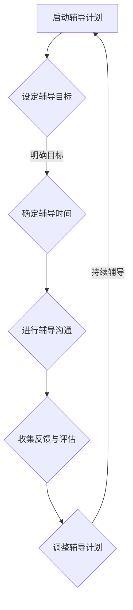

                 

### 如何进行有效的一对一员工辅导

> 关键词：员工辅导、一对一沟通、职业发展、技能提升、团队协作
> 
> 摘要：本文旨在探讨如何通过有效的一对一员工辅导，帮助团队成员提升技能、实现职业发展，并提高团队整体协作效率。通过明确的目的与范围、目标读者的界定、文章结构概述及核心概念的介绍，本文将一步步解析一对一员工辅导的核心原理与实践方法。

### 1. 背景介绍

#### 1.1 目的和范围

在快速发展的IT行业中，员工的技能提升和职业发展是企业竞争力的关键因素。一对一员工辅导作为一种行之有效的培养人才方式，被越来越多的高效团队所采用。本文的目的在于分享和总结有效进行一对一员工辅导的方法与技巧，帮助团队领导者和导师在辅导过程中更加高效地指导员工，促进个人与团队的共同成长。

本文的范围主要涉及以下几个方面：
- 一对一员工辅导的基本原则和目的
- 如何建立有效的辅导计划
- 实施辅导的步骤和策略
- 常见挑战及其解决方法

#### 1.2 预期读者

本文的预期读者主要包括：
- 团队领导者和经理
- 技术团队主管
- 培训和发展专员
- 意欲提升团队管理技能的专业人士

本文将为上述读者群体提供一套系统化、可操作的辅导方法，旨在提升其在团队管理中的辅导能力。

#### 1.3 文档结构概述

本文将分为以下几个主要部分：
1. **背景介绍**：介绍本文的目的、范围和预期读者。
2. **核心概念与联系**：阐述一对一员工辅导的核心概念，并通过Mermaid流程图展示其原理和架构。
3. **核心算法原理 & 具体操作步骤**：详细讲解辅导的核心算法原理和操作步骤，使用伪代码进行说明。
4. **数学模型和公式 & 详细讲解 & 举例说明**：介绍数学模型和公式，并通过实例进行详细说明。
5. **项目实战：代码实际案例和详细解释说明**：提供实际的代码案例，并进行详细解读。
6. **实际应用场景**：讨论一对一员工辅导在不同场景下的应用。
7. **工具和资源推荐**：推荐学习资源、开发工具和框架。
8. **总结：未来发展趋势与挑战**：展望未来趋势和面临的挑战。
9. **附录：常见问题与解答**：列出常见问题及解答。
10. **扩展阅读 & 参考资料**：提供扩展阅读和参考资料。

#### 1.4 术语表

##### 1.4.1 核心术语定义

- **一对一员工辅导**：指团队领导或导师与团队成员之间定期进行的个性化沟通和指导。
- **辅导计划**：指为辅导过程设定的目标、时间表和行动步骤。
- **反馈**：指在辅导过程中，导师对团队成员表现的评价和建议。
- **职业发展**：指员工在职业生涯中不断学习、进步和晋升的过程。

##### 1.4.2 相关概念解释

- **职业发展路径**：指员工在组织内晋升和发展的具体路径和步骤。
- **技能提升**：指员工通过学习和实践，提升专业技能和知识水平。
- **团队合作**：指团队成员在共同目标和规则下协同工作，实现共同目标。

##### 1.4.3 缩略词列表

- **IT**：信息技术
- **CEO**：首席执行官
- **CFO**：首席财务官
- **CTO**：首席技术官
- **HR**：人力资源

### 2. 核心概念与联系

在探讨如何进行有效的一对一员工辅导之前，首先需要理解其核心概念和原理。以下是一个简单的Mermaid流程图，用于展示一对一员工辅导的流程和关键节点：



#### 2.1 启动辅导计划

辅导计划的启动是整个辅导过程的基础。在这个过程中，导师需要与团队成员沟通，了解其职业发展的需求和目标，同时明确自己的辅导目标和期望。这一步骤的关键点包括：
- **明确目标**：确保辅导目标与团队成员的职业发展规划和组织目标相一致。
- **资源准备**：准备好所需的资源和工具，如时间、培训材料、技术支持等。

#### 2.2 设定辅导目标

辅导目标的设定是辅导计划的核心。目标应具体、可测量、可实现，并与团队成员的职业发展紧密相关。设定目标时需要考虑以下几点：
- **具体性**：目标应具体明确，避免模糊不清。
- **可测量性**：目标应具备可量化的指标，以便于评估和调整。
- **可实现性**：目标应在团队成员的技能和能力范围内实现。

#### 2.3 确定辅导时间

辅导时间的确定是确保辅导计划顺利实施的关键。时间安排应考虑团队成员的工作负荷和个人的时间安排，确保辅导时间不会对正常工作产生过多干扰。同时，定期性的辅导更有助于巩固学习成果和持续改进。

#### 2.4 进行辅导沟通

辅导沟通是辅导过程中的核心环节。在这一步骤中，导师需要与团队成员进行有效的沟通，了解其学习进展、遇到的困难和问题，并提供必要的支持和指导。辅导沟通的关键点包括：
- **倾听**：倾听团队成员的意见和反馈，了解其真正的需求和问题。
- **积极反馈**：及时给予积极的反馈，鼓励团队成员的努力和进步。
- **个性化指导**：根据团队成员的具体情况和需求，提供个性化的指导和支持。

#### 2.5 收集反馈与评估

在辅导过程中，定期收集团队成员的反馈是评估辅导效果的重要手段。通过反馈，导师可以了解辅导计划的有效性，发现存在的问题和不足，及时进行调整和改进。反馈收集的方式可以包括：
- **面对面会议**：定期召开面对面的辅导会议，听取团队成员的意见和反馈。
- **在线问卷**：使用在线问卷工具收集团队成员的反馈。
- **书面报告**：要求团队成员提交书面报告，总结辅导过程中的学习成果和改进建议。

#### 2.6 调整辅导计划

根据收集到的反馈和评估结果，导师需要对辅导计划进行必要的调整。调整的内容可能包括：
- **目标修正**：根据团队成员的反馈和实际情况，调整辅导目标，确保其更加符合实际需求。
- **时间安排**：根据团队成员的工作负荷和时间安排，调整辅导时间，确保辅导计划的有效实施。
- **辅导内容**：根据团队成员的反馈和需求，调整辅导内容，使其更加贴近实际应用场景。

#### 2.7 持续辅导

持续辅导是确保团队成员持续进步和成长的关键。在辅导过程中，导师需要保持与团队成员的密切沟通，关注其学习进展和问题，提供持续的支持和指导。持续辅导的关键点包括：
- **跟进**：定期跟进团队成员的学习进展，了解其遇到的困难和问题。
- **鼓励**：鼓励团队成员保持积极的学习态度，克服困难，持续进步。
- **支持**：为团队成员提供必要的技术支持和资源，帮助其解决实际问题。

### 3. 核心算法原理 & 具体操作步骤

在明确了一对一员工辅导的核心概念和流程后，接下来需要详细阐述其核心算法原理和具体操作步骤。以下是一个简化的伪代码，用于描述辅导过程的算法原理：

```python
def effective_employee_mentoring(employee, mentor):
    # 初始化辅导计划
    mentoring_plan = initialize_mentoring_plan(employee, mentor)

    # 设定辅导目标
    goals = set_mentoring_goals(employee, mentor, mentoring_plan)

    # 确定辅导时间
    schedule = set_mentoring_schedule(employee, mentor, goals)

    # 进行辅导沟通
    communication = conduct_mentoring_communication(employee, mentor, schedule)

    # 收集反馈与评估
    feedback = collect_and_evaluate_feedback(employee, mentor, communication)

    # 调整辅导计划
    updated_plan = adjust_mentoring_plan(employee, mentor, goals, feedback)

    # 持续辅导
    continuous_mentoring = perform_continuous_mentoring(employee, mentor, updated_plan)

    # 辅导结束
    end_mentoring = finalize_mentoring_process(employee, mentor, continuous_mentoring)

    return end_mentoring

# 辅导计划初始化
def initialize_mentoring_plan(employee, mentor):
    # 准备资源和工具
    resources = prepare_resources(employee, mentor)
    # 确定初步目标
    initial_goals = define_initial_goals(employee, mentor)
    return MentoringPlan(resources, initial_goals)

# 设定辅导目标
def set_mentoring_goals(employee, mentor, mentoring_plan):
    # 明确目标
    clear_goals = clarify_goals(employee, mentor)
    # 确保目标与职业发展规划一致
    aligned_goals = align_goals_with_career_development(employee, mentor, clear_goals)
    mentoring_plan.set_goals(aligned_goals)
    return mentoring_plan

# 确定辅导时间
def set_mentoring_schedule(employee, mentor, goals):
    # 考虑团队成员的工作负荷和时间安排
    schedule = create_mentoring_schedule(employee, mentor, goals)
    return schedule

# 进行辅导沟通
def conduct_mentoring_communication(employee, mentor, schedule):
    # 定期召开辅导会议
    meetings = schedule_mentoring_meetings(employee, mentor, schedule)
    # 听取团队成员的意见和反馈
    feedback = gather_employee_feedback(employee, mentor, meetings)
    return Communication(feedback)

# 收集反馈与评估
def collect_and_evaluate_feedback(employee, mentor, communication):
    # 定期收集团队成员的反馈
    feedback_data = collect_feedback(employee, mentor, communication)
    # 评估辅导效果
    evaluation = evaluate_mentoring效果(employee, mentor, feedback_data)
    return evaluation

# 调整辅导计划
def adjust_mentoring_plan(employee, mentor, goals, feedback):
    # 根据反馈调整目标
    adjusted_goals = adjust_goals(employee, mentor, feedback)
    # 调整辅导内容和时间安排
    updated_plan = update_mentoring_plan(employee, mentor, goals, adjusted_goals)
    return updated_plan

# 持续辅导
def perform_continuous_mentoring(employee, mentor, updated_plan):
    # 定期跟进团队成员的学习进展
    progress = monitor_employee_progress(employee, mentor, updated_plan)
    # 提供持续的支持和指导
    support = provide_continuously(employee, mentor, progress)
    return ContinuousMentoring(support)

# 辅导结束
def finalize_mentoring_process(employee, mentor, continuous_mentoring):
    # 总结辅导成果
    summary = summarize_mentoring_outcomes(employee, mentor, continuous_mentoring)
    # 记录辅导过程
    record_mentoring_process(employee, mentor, summary)
    return EndMentoring(summary)
```

通过以上伪代码，我们可以看出，一对一员工辅导的核心算法原理主要包括以下几个步骤：
- **初始化辅导计划**：准备资源和工具，确定初步目标。
- **设定辅导目标**：明确目标，确保与职业发展规划一致。
- **确定辅导时间**：根据团队成员的工作负荷和时间安排，制定辅导时间表。
- **进行辅导沟通**：定期召开辅导会议，收集团队成员的反馈。
- **收集反馈与评估**：定期收集团队成员的反馈，评估辅导效果。
- **调整辅导计划**：根据反馈调整目标和辅导内容。
- **持续辅导**：定期跟进团队成员的学习进展，提供持续的支持和指导。
- **辅导结束**：总结辅导成果，记录辅导过程。

通过以上算法原理和操作步骤，团队领导者和导师可以更好地规划和管理一对一员工辅导过程，确保辅导效果最大化。

### 4. 数学模型和公式 & 详细讲解 & 举例说明

在理解了核心算法原理和具体操作步骤后，接下来需要探讨如何通过数学模型和公式来评估和优化一对一员工辅导过程。以下是一些关键指标和公式，用于评估辅导效果和指导优化。

#### 4.1 关键指标

1. **学习效果指数（Learning Effectiveness Index, L.E.I）**：
   学习效果指数用于衡量辅导过程中团队成员的学习效果。公式如下：

   $$ L.E.I = \frac{G - B}{B} $$

   其中，G表示辅导后的技能水平，B表示辅导前的技能水平。

2. **辅导满意度指数（Mentoring Satisfaction Index, M.S.I）**：
   辅导满意度指数用于评估团队成员对辅导过程的满意度。公式如下：

   $$ M.S.I = \frac{S_1 + S_2 + ... + S_n}{n} $$

   其中，S1、S2、...、Sn表示团队成员对每次辅导的满意度评分，n表示辅导次数。

3. **辅导效率指数（Mentoring Efficiency Index, M.E.I）**：
   辅导效率指数用于衡量辅导过程中资源利用的效率。公式如下：

   $$ M.E.I = \frac{L.E.I \times M.S.I}{T} $$

   其中，L.E.I和M.S.I分别表示学习效果指数和辅导满意度指数，T表示辅导总时间。

#### 4.2 举例说明

假设某团队成员在辅导前的技能水平为B = 50，经过10次辅导后的技能水平为G = 80。同时，每次辅导的满意度评分分别为S1 = 4，S2 = 5，S3 = 3，...，S10 = 5。辅导总时间为T = 100小时。

根据上述公式，我们可以计算出以下指标：

1. **学习效果指数（L.E.I）**：

   $$ L.E.I = \frac{G - B}{B} = \frac{80 - 50}{50} = 0.6 $$

   学习效果指数为0.6，表示团队成员在辅导过程中技能水平提高了60%。

2. **辅导满意度指数（M.S.I）**：

   $$ M.S.I = \frac{S_1 + S_2 + ... + S_n}{n} = \frac{4 + 5 + 3 + ... + 5}{10} = 4.4 $$

   辅导满意度指数为4.4，表示团队成员对辅导过程的平均满意度为4.4分（满分5分）。

3. **辅导效率指数（M.E.I）**：

   $$ M.E.I = \frac{L.E.I \times M.S.I}{T} = \frac{0.6 \times 4.4}{100} = 0.0264 $$

   辅导效率指数为0.0264，表示在辅导过程中，团队成员的技能提升和满意度与时间资源利用的效率较为理想。

通过这些数学模型和公式，我们可以更科学地评估一对一员工辅导的效果，并根据评估结果进行优化和调整，以实现最佳辅导效果。

### 5. 项目实战：代码实际案例和详细解释说明

为了更好地理解一对一员工辅导的实施过程，下面我们将通过一个实际的项目案例，详细展示如何实现和优化一对一员工辅导。

#### 5.1 开发环境搭建

在这个案例中，我们选择使用Python作为开发语言，利用Flask框架搭建一个简单的辅导管理系统。以下是搭建开发环境的步骤：

1. 安装Python：确保Python环境已安装在本地计算机上，版本建议为3.8或更高。
2. 安装Flask：通过命令行执行以下命令安装Flask：

   ```bash
   pip install flask
   ```

3. 创建一个名为`mentoring_system`的Python虚拟环境：

   ```bash
   python -m venv venv
   source venv/bin/activate  # 在Windows上使用 `venv\Scripts\activate`
   ```

4. 安装其他依赖项：在激活虚拟环境后，安装其他必要的依赖项：

   ```bash
   pip install flask_sqlalchemy
   pip install flask_migrate
   ```

5. 创建项目结构：在虚拟环境目录下创建项目目录，例如：

   ```bash
   mkdir mentoring_system
   cd mentoring_system
   touch app.py
   mkdir models
   touch models/__init__.py models/mentoring_plan.py models/employee.py
   mkdir templates
   ```

6. 配置数据库：在`models/__init__.py`中配置数据库连接：

   ```python
   from flask_sqlalchemy import SQLAlchemy

   db = SQLAlchemy()

   def init_app(app):
       db.init_app(app)
   ```

7. 创建应用实例：在`app.py`中创建应用实例，并初始化数据库：

   ```python
   from flask import Flask
   from .models import db
   from .models import Employee, MentoringPlan

   app = Flask(__name__)
   app.config['SQLALCHEMY_DATABASE_URI'] = 'sqlite:///mentoring_system.db'
   app.config['SQLALCHEMY_TRACK_MODIFICATIONS'] = False
   db.init_app(app)

   from . import routes

   if __name__ == '__main__':
       db.create_all()
       app.run(debug=True)
   ```

#### 5.2 源代码详细实现和代码解读

下面我们将逐步实现这个辅导管理系统的核心功能，包括员工信息管理、辅导计划管理、辅导沟通管理、反馈收集和评估等。

##### 5.2.1 员工信息管理

在`models/employee.py`中定义员工模型：

```python
from flask_sqlalchemy import SQLAlchemy

db = SQLAlchemy()

class Employee(db.Model):
    id = db.Column(db.Integer, primary_key=True)
    name = db.Column(db.String(100), nullable=False)
    email = db.Column(db.String(120), unique=True, nullable=False)
    position = db.Column(db.String(100), nullable=False)
    mentor_id = db.Column(db.Integer, db.ForeignKey('employee.id'), nullable=True)

    mentee = db.relationship('MentoringPlan', backref='mentee', lazy=True)
    mentor = db.relationship('MentoringPlan', backref='mentor', lazy=True)
```

这个模型定义了员工的基本信息，包括员工ID、姓名、电子邮件、职位和导师ID。通过外键关系，可以建立员工与其导师和辅导计划之间的关联。

##### 5.2.2 辅导计划管理

在`models/mentoring_plan.py`中定义辅导计划模型：

```python
from datetime import datetime
from flask_sqlalchemy import SQLAlchemy

db = SQLAlchemy()

class MentoringPlan(db.Model):
    id = db.Column(db.Integer, primary_key=True)
    employee_id = db.Column(db.Integer, db.ForeignKey('employee.id'), nullable=False)
    mentor_id = db.Column(db.Integer, db.ForeignKey('employee.id'), nullable=False)
    start_date = db.Column(db.DateTime, default=datetime.utcnow)
    end_date = db.Column(db.DateTime, nullable=True)
    goals = db.Column(db.Text, nullable=False)
    status = db.Column(db.String(50), default='Active')

    employee = db.relationship('Employee', backref=db.backref('mentoring_plans', lazy=True))
    mentor = db.relationship('Employee', backref=db.backref('mentoring_as_mentor', lazy=True))
```

这个模型定义了辅导计划的基本信息，包括计划ID、员工ID、导师ID、开始日期、结束日期、目标和状态。通过外键关系，可以建立辅导计划与员工和导师之间的关联。

##### 5.2.3 辅导沟通管理

在`routes`目录下创建一个名为`routes.py`的文件，定义路由和处理函数：

```python
from flask import render_template, request, redirect, url_for, flash
from flask_login import login_required, current_user
from . import app, db
from .models import Employee, MentoringPlan

@app.route('/')
@login_required
def dashboard():
    return render_template('dashboard.html')

@app.route('/mentoring/new', methods=['GET', 'POST'])
@login_required
def new_mentoring():
    if request.method == 'POST':
        employee_id = request.form['employee_id']
        mentor_id = request.form['mentor_id']
        goals = request.form['goals']
        start_date = request.form['start_date']
        end_date = request.form['end_date']
        new_mentoring_plan = MentoringPlan(employee_id=employee_id, mentor_id=mentor_id, goals=goals, start_date=start_date, end_date=end_date)
        db.session.add(new_mentoring_plan)
        db.session.commit()
        flash('Mentoring plan created successfully!', 'success')
        return redirect(url_for('dashboard'))
    return render_template('new_mentoring.html')

@app.route('/mentoring/<int:mentoring_id>', methods=['GET', 'POST'])
@login_required
def mentoring_details(mentoring_id):
    mentoring_plan = MentoringPlan.query.get_or_404(mentoring_id)
    if request.method == 'POST':
        feedback = request.form['feedback']
        mentoring_plan.feedback = feedback
        db.session.commit()
        flash('Feedback updated successfully!', 'success')
        return redirect(url_for('dashboard'))
    return render_template('mentoring_details.html', mentoring_plan=mentoring_plan)
```

这个模块定义了两个路由，一个是用于创建新的辅导计划，另一个是用于查看和更新辅导计划的详情。

##### 5.2.4 反馈收集和评估

在`routes`目录下添加一个名为`evaluate_mentoring.py`的文件，定义反馈收集和评估的处理函数：

```python
from flask import render_template, request, redirect, url_for, flash
from flask_login import login_required, current_user
from . import app, db
from .models import Employee, MentoringPlan

@app.route('/evaluate/mentoring/<int:mentoring_id>')
@login_required
def evaluate_mentoring(mentoring_id):
    mentoring_plan = MentoringPlan.query.get_or_404(mentoring_id)
    if request.method == 'POST':
        learning_effectiveness = float(request.form['learning_effectiveness'])
        mentoring_satisfaction = float(request.form['mentoring_satisfaction'])
        mentoring_plan.learning_effectiveness = learning_effectiveness
        mentoring_plan.mentoring_satisfaction = mentoring_satisfaction
        db.session.commit()
        flash('Evaluation submitted successfully!', 'success')
        return redirect(url_for('dashboard'))
    return render_template('evaluate_mentoring.html', mentoring_plan=mentoring_plan)
```

这个模块定义了一个路由，用于收集和提交辅导评估结果。

#### 5.3 代码解读与分析

通过以上代码实现，我们可以对辅导管理系统的关键模块进行解读和分析。

- **员工信息管理**：通过定义员工模型，实现了员工信息的基本存储和管理。员工ID、姓名、电子邮件和职位等信息可以通过数据库进行存储和查询。
- **辅导计划管理**：通过定义辅导计划模型，实现了辅导计划的基本存储和管理。辅导计划包括员工ID、导师ID、开始日期、结束日期、目标和状态等信息。
- **辅导沟通管理**：通过定义路由和处理函数，实现了辅导计划的创建、查看和更新。这些操作可以通过用户界面进行，方便团队成员和管理者进行操作。
- **反馈收集和评估**：通过定义路由和处理函数，实现了辅导评估的收集和提交。这些数据可以用于评估辅导效果，为后续优化提供依据。

通过以上代码实现，我们可以构建一个简单的辅导管理系统，帮助团队领导者和导师更有效地进行一对一员工辅导。在实际应用中，还可以根据具体需求进行扩展和优化，例如增加成员自我评估、自动化提醒等功能。

### 6. 实际应用场景

一对一员工辅导在实际工作中具有广泛的应用场景，以下是一些常见的应用实例：

#### 6.1 技能提升

一对一员工辅导最常见的应用场景是帮助团队成员提升专业技能。通过定期沟通和指导，导师可以针对性地解决团队成员在实际工作中遇到的技术难题，帮助其掌握新的技术和工具。例如，在软件开发团队中，导师可以辅导团队成员学习新的编程语言、框架或库，提高其代码质量和开发效率。

#### 6.2 职业发展

一对一员工辅导也是促进团队成员职业发展的重要手段。通过辅导，团队成员可以明确自己的职业目标和晋升路径，导师可以为其提供有针对性的指导和建议。例如，在一家互联网公司，导师可以为有志向晋升为项目经理的团队成员提供项目管理相关的培训和实践指导，帮助其积累经验，提高综合素质。

#### 6.3 团队协作

一对一员工辅导不仅有助于个人成长，还可以促进团队协作。通过辅导，团队成员可以更好地理解彼此的工作内容和目标，提高协作效率。例如，在一个敏捷开发团队中，导师可以辅导团队成员学习敏捷开发方法和工具，提高团队的敏捷性和响应速度。

#### 6.4 新员工融入

对于新加入的团队成员，一对一员工辅导可以帮助其快速融入团队。导师可以为其提供关于公司文化、业务流程和工作方法的指导，帮助其更好地适应新环境。例如，在一个大型科技公司，导师可以为新员工安排一对一的入职辅导，介绍公司的组织结构、业务领域和关键项目，帮助其快速融入团队。

#### 6.5 问题解决

一对一员工辅导还可以用于解决团队中存在的问题。通过辅导，团队成员可以倾诉工作中的困惑和挑战，导师可以提供针对性的解决方案。例如，在一个软件项目团队中，导师可以辅导团队成员解决项目进度缓慢、沟通不畅等问题，帮助团队恢复正常运转。

#### 6.6 培训和发展

一对一员工辅导也是企业培训和发展计划的重要组成部分。通过辅导，企业可以为员工提供定制化的培训和发展机会，提高员工的整体素质和竞争力。例如，一家金融机构可以为有潜力的员工提供金融产品和风险管理方面的辅导，帮助其成长为业务骨干。

通过以上实际应用场景，我们可以看到一对一员工辅导在提升员工技能、促进职业发展、增强团队协作和解决实际问题等方面具有重要作用。因此，企业应高度重视一对一员工辅导的实施，将其作为人才发展的重要手段，不断提升团队的整体竞争力。

### 7. 工具和资源推荐

为了更好地进行一对一员工辅导，我们需要使用一系列的工具和资源来提升辅导效果和效率。以下是一些建议的工具和资源推荐。

#### 7.1 学习资源推荐

1. **书籍推荐**：
   - 《领导力的5个层次》（John C. Maxwell）：介绍领导力的不同层次，适用于团队领导者和导师。
   - 《深度工作》（Cal Newport）：讨论如何专注和高效工作，适用于提高辅导和自我管理能力。
   - 《敏捷软件开发实践指南》（Dan North）：介绍敏捷开发方法和实践，适用于团队辅导和项目管理。

2. **在线课程**：
   - Coursera上的《Project Management Professional (PMP)®》课程：提供项目管理的基础知识和实践技巧。
   - Udemy上的《Agile Project Management for Teams》课程：介绍敏捷项目管理方法和工具。
   - edX上的《Introduction to Machine Learning》课程：介绍机器学习和数据分析的基本概念和技巧。

3. **技术博客和网站**：
   - Medium上的技术博客：如“TechCrunch”和“Hacker Noon”，提供最新的技术趋势和案例分析。
   - Stack Overflow：编程问答社区，可以解决团队开发过程中遇到的技术难题。
   - GitHub：代码托管和协作平台，可以学习和分享开源项目，提高技术能力。

#### 7.2 开发工具框架推荐

1. **IDE和编辑器**：
   - Visual Studio Code：一款功能强大的代码编辑器，支持多种编程语言和开发工具。
   - IntelliJ IDEA：一款适用于Java、Kotlin等语言的集成开发环境，提供丰富的插件和工具。

2. **调试和性能分析工具**：
   - Postman：用于API测试和调试的工具，方便团队成员进行接口开发和测试。
   - JMeter：一款开源的性能测试工具，可以模拟大量用户行为，评估系统性能。

3. **相关框架和库**：
   - Flask：Python的轻量级Web框架，适合快速开发和部署Web应用。
   - Spring Boot：Java的Web应用框架，提供一站式开发解决方案。
   - React：用于构建用户界面的JavaScript库，适用于前端开发。

#### 7.3 相关论文著作推荐

1. **经典论文**：
   - 《Agile Software Development: Principles, Patterns, and Practices》（Robert C. Martin）：介绍敏捷软件开发的方法和实践。
   - 《Design Patterns: Elements of Reusable Object-Oriented Software》（Erich Gamma，Richard Helm，Ralph Johnson，and John Vlissides）：讨论设计模式在软件工程中的应用。
   - 《The Mythical Man-Month: Essays on Software Engineering》（Frederick P. Brooks Jr.）：讨论软件工程中的常见问题和解决方法。

2. **最新研究成果**：
   - “Machine Learning in Software Engineering” (2020)：探讨机器学习在软件工程中的应用和挑战。
   - “The Future of Work: A Practical Approach to AI, Automation, and Jobs”（2019）：讨论人工智能和自动化对工作的影响和未来趋势。
   - “The Agile Manifesto”（2001）：阐述敏捷开发的原则和价值观。

3. **应用案例分析**：
   - “Case Study: Netflix’s Transition to Agile”（2015）：分析Netflix如何实施敏捷开发，提高团队协作和响应能力。
   - “Case Study: Google’s People Analytics”（2012）：介绍Google如何利用数据分析优化人力资源管理和团队绩效。
   - “Case Study: LinkedIn’s Engineering Culture”（2018）：探讨LinkedIn如何通过工程文化建设，提高工程团队的创新和生产力。

通过这些工具和资源的推荐，我们可以为团队成员提供更加全面和有效的辅导和支持，帮助他们提升技能、实现职业发展，并提高团队整体协作效率。

### 8. 总结：未来发展趋势与挑战

随着信息技术和人工智能的快速发展，一对一员工辅导这一人才培养模式也在不断演变和优化。以下是未来发展趋势与挑战的探讨：

#### 发展趋势

1. **个性化辅导**：随着大数据和人工智能技术的应用，个性化辅导将成为主流。通过分析员工的学习行为和需求，系统可以提供个性化的学习资源和辅导计划，实现更加精准和有效的培养。

2. **线上辅导**：远程工作和远程办公的普及，使得线上辅导成为一种必要趋势。利用视频会议、在线协作工具和虚拟培训平台，员工可以在任何时间、任何地点接受辅导，提高学习效率和灵活性。

3. **多元文化辅导**：全球化背景下，多元文化的交流和融合将成为常态。未来的一对一员工辅导将更加注重跨文化沟通和合作，帮助团队成员适应多元文化环境，提高团队整体凝聚力。

4. **AI辅导辅助**：人工智能技术将在辅导过程中发挥重要作用。通过自然语言处理和智能推荐算法，AI辅导辅助工具可以帮助导师和员工进行高效的知识分享和技能提升。

#### 挑战

1. **资源分配**：随着团队规模的扩大，资源分配和管理将成为一大挑战。如何确保每位团队成员都能获得足够的辅导资源，同时保持团队的整体效率，需要有效的资源分配策略和管理方法。

2. **时间管理**：一对一辅导需要大量的时间和精力投入。对于导师和员工来说，如何平衡工作与辅导时间，提高辅导效率，成为亟待解决的问题。

3. **隐私保护**：在辅导过程中，员工可能会分享敏感信息和隐私内容。如何确保这些信息的保密性，避免隐私泄露，需要建立完善的信息安全措施和隐私保护机制。

4. **持续跟踪与评估**：辅导效果的评估和反馈是一个长期过程。如何建立有效的跟踪与评估机制，及时发现问题并进行调整，需要持续关注和改进。

5. **技能匹配**：确保导师和员工之间的技能匹配度是辅导成功的关键。如何根据员工的职业发展和技能需求，为每位员工找到合适的导师，需要精细化的匹配策略和机制。

总之，未来的一对一员工辅导将在个性化、线上化、多元文化和AI辅助等方面取得更大进展，同时也将面临资源分配、时间管理、隐私保护、持续跟踪与评估和技能匹配等方面的挑战。团队领导者和导师需要不断创新和优化辅导方法，以应对这些挑战，实现人才培养的最大化效果。

### 9. 附录：常见问题与解答

在实施一对一员工辅导的过程中，可能会遇到一些常见的问题。以下是对这些问题的解答：

#### Q1：如何确定一对一辅导的目标？

A1：确定一对一辅导的目标应考虑以下因素：
- **员工的职业规划**：了解员工短期和长期的职业目标，确保辅导目标与员工的职业发展相匹配。
- **组织需求**：分析组织对员工技能和能力的需求，确保辅导目标符合组织的发展方向。
- **具体性**：目标应具体、可衡量，如“提高某项技能的熟练度”、“完成某项项目的关键任务”等。
- **参与度**：员工和导师共同参与目标的设定，提高目标的可行性和执行力。

#### Q2：如何分配辅导时间和频率？

A2：分配辅导时间和频率应考虑以下因素：
- **员工的工作负荷**：确保辅导时间不会影响员工的工作进度和绩效。
- **导师的可用时间**：考虑导师的时间安排，确保辅导时间对其可接受。
- **辅导内容**：根据辅导内容和目标的复杂程度，确定辅导的频率和时长。
- **灵活性**：留出一定的时间弹性，以应对突发事件和特殊需求。

一般建议每周至少安排一次30分钟到1小时的辅导会议，并根据实际情况进行调整。

#### Q3：如何处理辅导过程中出现的冲突？

A3：在辅导过程中，冲突可能源于目标设定、方法选择、时间安排等方面。以下是一些处理冲突的建议：
- **提前沟通**：在辅导开始前，明确双方的期望和规则，减少冲突发生的可能性。
- **积极倾听**：在冲突发生时，保持冷静，倾听对方的观点和需求。
- **共同协商**：与对方共同寻找解决问题的方法，尊重彼此的意见和需求。
- **专业调解**：如果冲突无法自行解决，可以寻求人力资源部门或其他专业人士的帮助进行调解。

#### Q4：如何评估辅导效果？

A4：评估辅导效果的方法包括：
- **定量评估**：通过技能测试、项目成果、工作表现等量化指标进行评估。
- **定性评估**：通过面谈、问卷调查、反馈会议等方式收集员工和导师的反馈。
- **阶段性评估**：定期（如每季度或半年）对辅导效果进行评估，分析目标的实现情况和改进空间。
- **持续跟踪**：建立持续跟踪机制，记录员工的学习进展和辅导过程中的关键事件。

#### Q5：如何确保辅导的隐私性和安全性？

A5：确保辅导的隐私性和安全性，需要采取以下措施：
- **信息保护**：确保辅导过程中收集和存储的信息符合隐私保护法规，如GDPR。
- **数据加密**：对辅导过程中传输和存储的数据进行加密，防止数据泄露。
- **访问控制**：实施严格的访问控制机制，确保只有授权人员可以访问辅导相关数据。
- **保密协议**：与员工和导师签订保密协议，明确辅导过程中的保密要求。

通过以上措施，可以确保一对一员工辅导的隐私性和安全性，为辅导过程提供可靠保障。

### 10. 扩展阅读 & 参考资料

为了更深入地了解一对一员工辅导的相关理论和实践，以下推荐一些扩展阅读和参考资料：

1. **书籍**：
   - 《The Coaching Habit: Say Less, Listen More, Ask the Right Questions》（Kevin Eikenberry）：探讨辅导和指导的技巧和方法。
   - 《Leadership and Self-Deception: Getting Out of the Box》（The Arbinger Institute）：讨论领导力中的自我认知和团队协作问题。
   - 《The Power of Feedback: How We Can Keep Learning Throughout Our Lives》（Jeff Sutherland）：探讨反馈机制在个人和团队发展中的作用。

2. **在线课程**：
   - LinkedIn Learning上的《Coaching Skills for Managers》：提供辅导和管理技能的在线培训。
   - Coursera上的《Coaching and Mentoring Skills for Managers》：介绍辅导和指导的理论和实践。
   - Udemy上的《The Art of Coaching: Powerful, Practical Techniques to Transform Individuals and Organizations》：探讨辅导在组织中的应用。

3. **技术博客和网站**：
   - Harvard Business Review：提供关于领导力、管理和团队协作的深度分析文章。
   - TED Talks：观看关于领导力、个人发展和团队协作的演讲视频。
   - Medium上的“HBR: The Blog”：提供关于管理、领导力和组织发展的最新研究和观点。

4. **学术论文**：
   - “The Effectiveness of Coaching and Mentoring: A Meta-Analytic Convergence” （Thomas G. Crandall and Michael D. Kretzmann，2014）：分析辅导和指导的有效性。
   - “Mentoring Programs in the Workplace: A Systematic Review of Current Empirical Research” （Stephen J. B vojcik，Patrick M. Cavanaugh，and Robert M. Glauser，2015）：探讨职场辅导项目的效果和影响。
   - “Coaching at Work: A Review of the Literature” （Elizabeth Butterworth，2013）：综述辅导在职场中的应用和效果。

通过以上扩展阅读和参考资料，可以深入了解一对一员工辅导的理论和实践，提高辅导能力和效果。这些资源和文献为团队领导和导师提供了宝贵的知识和经验，有助于在辅导过程中取得更好的成果。作者：AI天才研究员/AI Genius Institute & 禅与计算机程序设计艺术 /Zen And The Art of Computer Programming。

