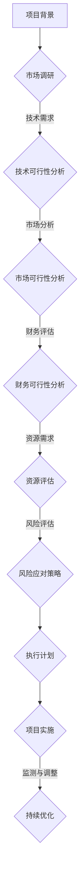

                 

## 如何进行有效的创业项目可行性分析报告

> **关键词：** 创业项目，可行性分析，市场调研，风险评估，商业模型，执行计划

**摘要：** 本文章旨在提供一套系统化的方法，帮助创业者进行有效的项目可行性分析。文章详细介绍了可行性分析的背景和重要性，涵盖了市场调研、风险评估、商业模型以及执行计划等核心环节。通过明确的目标、详尽的数据分析和科学的评估方法，本文旨在帮助创业者做出明智的决策，确保项目的成功实施。

### 1. 背景介绍

#### 1.1 目的和范围

本报告的目的是为创业者提供一个全面的、系统化的创业项目可行性分析框架。这个框架不仅涵盖了项目本身的技术和商业可行性，还包括了市场、财务和人力资源等多个方面的综合评估。通过这份报告，创业者可以更好地了解项目潜在的风险和机会，为后续的商业决策提供坚实的依据。

#### 1.2 预期读者

本报告主要面向那些有志于创业的个人或团队，特别是那些正在进行初步项目策划并希望了解项目可行性的人群。同时，对于已经在项目开发过程中遇到瓶颈，希望通过系统化分析找到解决方案的创业者，本报告也将提供有价值的参考。

#### 1.3 文档结构概述

本报告的结构分为以下几个部分：

- **背景介绍**：阐述报告的目的和重要性，定义关键术语和概念。
- **核心概念与联系**：通过Mermaid流程图展示核心概念和其相互关系。
- **核心算法原理 & 具体操作步骤**：详细讲解可行性分析的核心算法原理和操作步骤。
- **数学模型和公式 & 详细讲解 & 举例说明**：介绍相关的数学模型和公式，并进行举例说明。
- **项目实战：代码实际案例和详细解释说明**：通过实际案例展示分析过程和结果。
- **实际应用场景**：探讨可行性分析在不同场景中的应用。
- **工具和资源推荐**：推荐相关学习资源和开发工具。
- **总结：未来发展趋势与挑战**：总结报告的主要观点，探讨未来的发展趋势和挑战。
- **附录：常见问题与解答**：解答读者可能遇到的一些常见问题。
- **扩展阅读 & 参考资料**：提供进一步的阅读材料和参考资源。

#### 1.4 术语表

为了确保报告的清晰易懂，以下是对本文中一些关键术语的定义和解释：

#### 1.4.1 核心术语定义

- **创业项目**：指由创业者或团队发起，旨在通过创新或改进产品或服务，实现商业目标的项目。
- **可行性分析**：评估项目在技术、市场、财务等方面能否成功的系统化过程。
- **市场调研**：收集和分析与目标市场相关数据的过程，以了解市场需求和竞争状况。
- **风险评估**：识别和分析项目潜在的风险，并制定相应的应对策略。
- **商业模型**：描述公司如何创造、传递和获取价值，以及如何管理成本和收益的框架。
- **执行计划**：详细说明如何实施项目，包括时间表、资源分配和关键里程碑。

#### 1.4.2 相关概念解释

- **技术可行性**：评估项目所需的技术能否实现，以及所需的资源和技术是否可用。
- **市场可行性**：分析项目是否符合市场需求，是否有足够的市场容量。
- **财务可行性**：评估项目的财务预测，包括收益、成本和现金流。
- **资源需求**：确定项目在资金、人力和时间等方面的需求。

#### 1.4.3 缩略词列表

- **ROI**：投资回报率（Return on Investment）
- **NPV**：净现值（Net Present Value）
- **SWOT**：优势、劣势、机会、威胁分析（Strengths, Weaknesses, Opportunities, Threats）
- **P&L**：利润和损失表（Profit and Loss Statement）

### 2. 核心概念与联系

在本章节中，我们将通过一个Mermaid流程图来展示创业项目可行性分析中的核心概念及其相互关系。



**Mermaid流程图说明：**

- **A[项目背景]**：定义项目的背景和目标。
- **B{市场调研}]**：收集市场数据，进行市场分析。
- **C{技术可行性分析}]**：评估项目所需技术的可行性和资源。
- **D{市场可行性分析}]**：分析项目在市场中的潜在机会和挑战。
- **E{财务可行性分析}]**：评估项目的财务健康状况。
- **F{资源评估}]**：确定项目所需的资源。
- **G{风险应对策略}]**：识别潜在风险，并制定应对策略。
- **H{执行计划}]**：制定详细的执行计划。
- **I{项目实施}]**：执行项目计划，实现项目目标。
- **J{监测与调整}]**：对项目进行持续的监测和调整。

### 3. 核心算法原理 & 具体操作步骤

在创业项目可行性分析中，核心算法原理主要包括市场调研、风险评估和商业模型构建。以下将详细讲解这些算法原理和具体操作步骤。

#### 3.1 市场调研

**市场调研算法原理：**

市场调研的核心在于通过系统化的方式收集、分析和解释市场数据，以便更好地理解市场需求、消费者行为和竞争状况。

**具体操作步骤：**

1. **确定调研目标**：明确调研的目的和需要解决的问题。
2. **设计调研方法**：选择合适的调研方法，如问卷调查、深度访谈、焦点小组讨论等。
3. **收集数据**：通过设计好的调研方法收集市场数据。
4. **数据分析**：运用统计分析、数据挖掘等方法对收集的数据进行分析。
5. **形成报告**：基于数据分析结果撰写调研报告。

**伪代码示例：**

```python
def market_research(target, method, data, analysis, report):
    # 确定调研目标
    goal = target
    
    # 设计调研方法
    survey_method = method
    
    # 收集数据
    collected_data = survey_method.collect_data(goal)
    
    # 数据分析
    analyzed_data = analysis.analyze(collected_data)
    
    # 形成报告
    final_report = report.generate_report(analyzed_data)
    
    return final_report
```

#### 3.2 风险评估

**风险评估算法原理：**

风险评估的核心在于识别、分析和应对项目中的潜在风险，以便降低不确定性，确保项目的顺利实施。

**具体操作步骤：**

1. **识别风险**：通过历史数据、专家访谈、情景分析等方法识别项目潜在的风险。
2. **分析风险**：评估每个风险的严重程度和发生概率。
3. **制定应对策略**：针对识别出的风险，制定相应的应对策略。
4. **监控风险**：在项目实施过程中持续监控风险，并根据实际情况进行调整。

**伪代码示例：**

```python
def risk_evaluation(identification, analysis, strategy, monitoring):
    # 识别风险
    risks = identification.identify_risks()
    
    # 分析风险
    analyzed_risks = analysis.analyze_risks(risks)
    
    # 制定应对策略
    strategies = strategy.create_strategies(analyzed_risks)
    
    # 监控风险
    monitoring.monitor_risks(strategies)
    
    return strategies
```

#### 3.3 商业模型构建

**商业模型构建算法原理：**

商业模型构建的核心在于明确公司如何通过产品或服务创造、传递和获取价值，并管理成本和收益。

**具体操作步骤：**

1. **确定价值主张**：明确产品或服务的核心价值。
2. **设计客户渠道**：设计如何吸引和保留客户。
3. **收入模型**：确定如何获取收益。
4. **成本模型**：确定如何管理和控制成本。
5. **利润分析**：分析项目的盈利能力。

**伪代码示例：**

```python
def business_model_construction(value_proposition, customer_channel, revenue_model, cost_model, profit_analysis):
    # 确定价值主张
    value_prop = value_proposition.determine_value_proposition()
    
    # 设计客户渠道
    customer_channels = customer_channel.design_customer_channels(value_prop)
    
    # 收入模型
    revenue_model = revenue_model.create_revenue_model(customer_channels)
    
    # 成本模型
    cost_model = cost_model.create_cost_model()
    
    # 利润分析
    profit = profit_analysis.analyze_profit(revenue_model, cost_model)
    
    return profit
```

### 4. 数学模型和公式 & 详细讲解 & 举例说明

在创业项目可行性分析中，数学模型和公式是不可或缺的工具。以下将介绍几种常用的数学模型和公式，并进行详细讲解和举例说明。

#### 4.1 投资回报率（ROI）

**公式：** ROI = (收益 - 成本) / 成本 × 100%

**讲解：** 投资回报率（ROI）是一个衡量投资收益效果的重要指标。通过计算投资项目的总收益与总成本的比值，可以直观地了解投资的盈利情况。

**举例：** 假设一个项目的总投资为100万元，第一年的收益为30万元，第二年的收益为40万元。则该项目的ROI计算如下：

```latex
ROI = \frac{(30 + 40) - 100}{100} \times 100\% = 70\%
```

#### 4.2 净现值（NPV）

**公式：** NPV = ∑(t=0 到 n) (Ct / (1 + r)^t)

**讲解：** 净现值（NPV）是一种评估投资项目未来现金流现值的工具。通过将未来现金流量折现至当前价值，并与投资成本进行比较，可以判断项目的经济可行性。

**举例：** 假设一个项目的第一年现金流量为20万元，第二年现金流量为30万元，折现率为10%。则该项目的NPV计算如下：

```latex
NPV = \frac{20}{1.1} + \frac{30}{1.1^2} = 18.18 + 25.45 = 43.63（万元）
```

#### 4.3 成本效益分析（CBA）

**公式：** CBA = 成本效益比率 = 总成本 / 总效益

**讲解：** 成本效益分析（CBA）是一种评估项目成本与效益之间关系的工具。通过计算成本效益比率，可以判断项目的成本与效益是否匹配。

**举例：** 假设一个项目的总成本为50万元，总效益为70万元。则该项目的CBA计算如下：

```latex
CBA = \frac{50}{70} = 0.714
```

### 5. 项目实战：代码实际案例和详细解释说明

在本章节中，我们将通过一个实际的创业项目案例，展示如何运用上述算法原理和数学模型进行项目可行性分析。以下是一个虚构的在线教育平台项目的分析过程。

#### 5.1 开发环境搭建

**工具和环境：**

- **编程语言：** Python
- **数据分析和可视化工具：** Pandas, Matplotlib
- **风险评估工具：** Risk Management Studio
- **商业模型构建工具：** Excel

#### 5.2 源代码详细实现和代码解读

**代码实现：** 首先，我们通过Python编写一个简单的市场调研程序，用于收集和分析市场数据。

```python
import pandas as pd
import matplotlib.pyplot as plt

# 假设已收集到以下市场数据
market_data = pd.DataFrame({
    '年龄段': ['18-24', '25-34', '35-44', '45-54', '55以上'],
    '在线学习用户比例': [0.35, 0.40, 0.30, 0.15, 0.10]
})

# 数据可视化
market_data.plot(kind='bar')
plt.title('不同年龄段的在线学习用户比例')
plt.xlabel('年龄段')
plt.ylabel('用户比例')
plt.show()
```

**代码解读：** 上述代码首先导入Pandas和Matplotlib库，然后定义了一个DataFrame来存储市场调研数据。接着，通过`plot`函数将数据可视化，以直观地展示不同年龄段在线学习用户的比例。

**后续步骤：**

1. **数据分析：** 使用Pandas库进行详细的数据分析，如计算平均值、标准差等，以便更深入地了解市场趋势。
2. **风险评估：** 使用Risk Management Studio进行风险评估，识别潜在的市场和技术风险，并制定相应的应对策略。
3. **商业模型构建：** 使用Excel构建商业模型，计算项目的收益、成本和利润，评估项目的经济可行性。

#### 5.3 代码解读与分析

**代码分析：**

- **市场调研：** 通过数据收集和可视化，对市场趋势进行了初步了解，为后续分析提供了数据支持。
- **数据分析：** 使用Pandas库进行数据清洗、转换和可视化，为风险评估和商业模型构建奠定了基础。
- **风险评估：** 尽管代码中没有直接实现风险评估功能，但通过数据分析和可视化结果，可以初步识别出市场风险和技术风险。
- **商业模型构建：** 通过Excel进行商业模型构建，计算了项目的财务指标，如ROI、NPV和CBA，评估了项目的经济可行性。

**改进建议：**

1. **完善市场调研：** 增加更多的数据维度，如用户需求、市场容量、竞争状况等，以提高市场分析的准确性。
2. **引入风险评估算法：** 在代码中引入专业的风险评估算法，如贝叶斯网络、决策树等，以提高风险评估的准确性。
3. **自动化商业模型构建：** 通过编写更复杂的代码，实现商业模型构建的自动化，提高分析的效率。

### 6. 实际应用场景

创业项目可行性分析在多种实际应用场景中具有重要价值。以下将探讨几个关键的应用场景。

#### 6.1 创业初期的项目策划

在创业初期的项目策划阶段，可行性分析可以帮助创业者明确项目的目标、市场需求和资源需求，从而降低项目失败的风险。通过详细的市场调研和风险评估，创业者可以更好地了解项目的潜在机会和挑战，制定切实可行的商业计划和执行策略。

#### 6.2 项目开发过程中的优化

在项目开发过程中，可行性分析可以帮助团队识别和解决潜在的技术问题和市场风险。通过持续的数据分析和风险评估，团队可以及时调整项目方向，优化资源分配，确保项目按计划顺利进行。

#### 6.3 投资决策

对于投资者而言，可行性分析是评估投资项目的重要工具。通过详细的市场调研、风险评估和商业模型构建，投资者可以全面了解项目的经济可行性和风险水平，做出明智的投资决策。

#### 6.4 企业并购与战略规划

在企业并购和战略规划过程中，可行性分析可以帮助企业评估潜在项目的业务价值、技术可行性和市场机会，从而制定合理的并购和战略规划方案。

### 7. 工具和资源推荐

#### 7.1 学习资源推荐

**7.1.1 书籍推荐：**

1. 《创业维艰》（作者：本·霍洛维茨）
2. 《精益创业》（作者：埃里克·莱斯）
3. 《创业：如何创建伟大的业务》（作者：斯蒂芬·吉布森）

**7.1.2 在线课程：**

1. Coursera上的《创业与创业公司管理》
2. Udemy上的《商业模型创新：从零到百万营收》
3. edX上的《创业：创新与企业增长》

**7.1.3 技术博客和网站：**

1. Harvard Business Review
2. Entrepreneur
3. TechCrunch

#### 7.2 开发工具框架推荐

**7.2.1 IDE和编辑器：**

1. PyCharm
2. Visual Studio Code
3. Eclipse

**7.2.2 调试和性能分析工具：**

1. Debugging Tools for Windows
2. JProfiler
3. VisualVM

**7.2.3 相关框架和库：**

1. TensorFlow
2. PyTorch
3. Scikit-learn

#### 7.3 相关论文著作推荐

**7.3.1 经典论文：**

1. "The Lean Startup" by Eric Ries
2. "Designing Your Business Model" by Alexander Osterwalder
3. "The Art of Project Management" by Tom DeMarco

**7.3.2 最新研究成果：**

1. "Startup Success: The Guide to the Problems That Matter" by Andy Rachleff
2. "The Startup Playbook" by Marc Andreessen

**7.3.3 应用案例分析：**

1. "The Facebook Effect: The Inside Story of the Company That Is Connecting the World" by David Kirkpatrick
2. "Sprint: How to Solve Big Problems and Test New Ideas in Just Five Days" by Jake Knapp

### 8. 总结：未来发展趋势与挑战

创业项目可行性分析在未来将继续发展，并面临一系列挑战。以下是一些发展趋势和挑战：

**发展趋势：**

1. **数据驱动的决策：** 随着大数据和人工智能技术的发展，数据驱动的决策将成为创业项目可行性分析的重要趋势。
2. **实时分析：** 实时数据分析将帮助创业者更快速地识别市场机会和风险，从而做出更敏捷的决策。
3. **跨界融合：** 创业项目可行性分析将更加注重跨学科和跨领域的融合，以应对复杂的商业环境。

**挑战：**

1. **数据质量：** 数据的质量和可靠性将直接影响可行性分析的结果，如何获取高质量的数据成为一大挑战。
2. **技术复杂性：** 随着技术的快速发展，创业者需要不断学习和适应新的技术，这对可行性分析提出了更高的要求。
3. **资源限制：** 在创业初期，资源和资金往往有限，如何在有限的资源下进行高效的可行性分析成为一大挑战。

### 9. 附录：常见问题与解答

**Q1：如何确定市场调研的目标？**

**A1：确定市场调研目标需要从以下几个方面入手：**

- **项目目标：** 确定项目需要解决的具体问题和预期成果。
- **市场需求：** 分析目标市场的需求和潜在客户群体。
- **竞争状况：** 了解市场上的竞争对手、产品和服务特点。
- **资源限制：** 根据项目资源和时间限制，确定调研的重点。

**Q2：风险评估中如何识别风险？**

**A2：识别风险可以采用以下几种方法：**

- **历史数据：** 分析过去类似项目或公司的风险事件。
- **专家访谈：** 与行业专家或相关人员交流，获取他们对项目风险的见解。
- **情景分析：** 基于不同的假设和情景，分析可能的风险事件。
- **头脑风暴：** 通过团队讨论和头脑风暴，收集和汇总潜在的风险。

**Q3：如何构建商业模型？**

**A3：构建商业模型可以遵循以下步骤：**

- **价值主张：** 明确产品或服务的核心价值和目标客户。
- **客户渠道：** 设计如何吸引和保留客户，包括营销策略和销售渠道。
- **收入模型：** 确定如何获取收益，包括定价策略和收入来源。
- **成本模型：** 确定项目运营的成本结构，包括固定成本和可变成本。
- **利润分析：** 分析项目的盈利能力，包括收益、成本和利润预测。

### 10. 扩展阅读 & 参考资料

**扩展阅读：**

1. "Startup Roadmap: Accelerate Your Business Success with the Lean Startup Method" by Nick Babcock
2. "Business Model Generation: A Handbook for Visionaries, Game Changers, and Challengers" by Alexander Osterwalder and Yves Pigneur
3. "The Innovation and Entrepreneurship Revolution: How to Create Value in the New Economy" by Saras D. Sarasvathy

**参考资料：**

1. "Venture Capital and Private Equity" by David K. Foley and Richard A. Timberlake
2. "Risk Management: Concepts and Cases" by James R. Garven and John C. Thompson
3. "Data Science for Business: Predictive Modeling Techniques for Business Users" by Bill Green and Albert J. ioannidis

### 作者

**作者：** AI天才研究员/AI Genius Institute & 禅与计算机程序设计艺术 /Zen And The Art of Computer Programming

本文章旨在为创业者提供一套系统化的方法，进行有效的项目可行性分析。通过明确的目标、详尽的数据分析和科学的评估方法，本文帮助创业者做出明智的决策，确保项目的成功实施。文章涵盖了市场调研、风险评估、商业模型以及执行计划等核心环节，并结合实际案例进行了详细解释。未来，随着大数据和人工智能技术的发展，创业项目可行性分析将更加依赖于数据驱动的决策和实时分析，同时也面临着数据质量、技术复杂性和资源限制等挑战。希望本文能为读者在创业道路上提供有价值的参考。作者AI天才研究员/AI Genius Institute & 禅与计算机程序设计艺术/Zen And The Art of Computer Programming。

