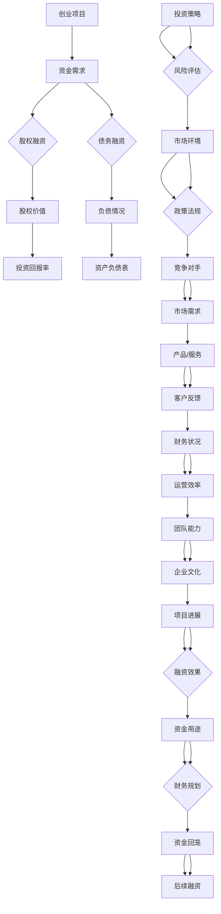

                 

# 如何进行有效的创业项目融资

> 关键词：创业项目、融资、股权融资、债务融资、投资策略、风险分析
>
> 摘要：本文将深入探讨创业项目融资的各个方面，从基础概念到具体操作，旨在帮助创业者了解如何有效地获取资金，实现项目的发展和壮大。文章将详细分析股权融资与债务融资的优缺点，探讨投资策略的制定，并介绍如何进行有效的风险分析。同时，还将结合实际案例，展示融资过程的步骤和方法。

## 1. 背景介绍

### 1.1 目的和范围

本文旨在为创业者提供关于如何进行有效创业项目融资的全面指导。通过介绍融资的基本概念、不同融资方式的优劣、投资策略的制定以及风险分析的方法，帮助创业者更好地理解融资过程，提高融资成功率。

### 1.2 预期读者

本文适用于有意进行创业项目融资的创业者、初创公司管理层以及金融领域的相关从业者。对于希望深入了解创业融资的投资者和学术研究者，本文同样具有较高的参考价值。

### 1.3 文档结构概述

本文将按照以下结构进行组织：

1. 背景介绍：概述本文的目的、预期读者和文档结构。
2. 核心概念与联系：介绍创业融资相关的核心概念，并通过流程图展示其相互关系。
3. 核心算法原理与具体操作步骤：详细阐述融资策略的制定过程。
4. 数学模型和公式：介绍用于风险分析的数学模型和公式，并进行举例说明。
5. 项目实战：结合实际案例，展示融资的具体操作步骤和代码实现。
6. 实际应用场景：探讨创业融资在不同场景下的应用。
7. 工具和资源推荐：推荐学习资源、开发工具和相关论文著作。
8. 总结：对未来发展趋势和挑战进行展望。
9. 附录：常见问题与解答。
10. 扩展阅读与参考资料：提供进一步学习的资源。

### 1.4 术语表

#### 1.4.1 核心术语定义

- 创业项目：指创业者或初创团队发起的具有创新性和商业潜力的项目。
- 融资：指企业为获取资金而采取的一系列行动，包括股权融资和债务融资等。
- 股权融资：指企业通过出售股权来获取资金，投资者成为股东，享有相应的权益和风险。
- 债务融资：指企业通过借款或发行债券等方式获取资金，需要按照约定的方式偿还本金和利息。
- 投资策略：指企业在融资过程中所采用的具体方法和策略，包括融资方式、融资时机、资金用途等。
- 风险分析：指对企业融资过程中可能面临的各种风险进行评估和分析。

#### 1.4.2 相关概念解释

- 股权价值：指企业股权的市场价值，通常通过股权估值方法进行计算。
- 投资回报率（ROI）：指企业投资回报与投资成本的比率，用于评估投资效果。
- 资产负债表：指企业的财务报表之一，展示企业的资产、负债和股东权益。

#### 1.4.3 缩略词列表

- IPO：首次公开募股（Initial Public Offering）
- PE：私募股权（Private Equity）
- VC：风险投资（Venture Capital）

## 2. 核心概念与联系

创业融资涉及多个核心概念，它们相互关联，共同影响融资效果。以下通过Mermaid流程图展示这些概念及其相互关系：



该流程图展示了创业融资过程中涉及的主要概念及其相互关系。创业项目产生资金需求，从而选择股权融资或债务融资。股权融资关注股权价值、投资回报率，债务融资关注负债情况。投资策略的制定需要考虑市场环境、政策法规、竞争对手、市场需求、产品/服务、客户反馈、财务状况、运营效率、团队能力、企业文化等因素。项目进展、资金用途、财务规划、资金回笼以及后续融资共同决定了融资效果。

## 3. 核心算法原理 & 具体操作步骤

### 3.1 投资策略的制定

投资策略的制定是创业融资过程中的关键环节，直接关系到融资的成败。以下通过伪代码详细阐述投资策略的制定过程：

```python
def determine_investment_strategy(funding_needs, market_environment, competitive_analysis, product_service, financial_status, team_ability, cultural_fit):
    """
    确定投资策略的函数。
    
    参数：
    funding_needs：资金需求
    market_environment：市场环境
    competitive_analysis：竞争对手分析
    product_service：产品/服务
    financial_status：财务状况
    team_ability：团队能力
    cultural_fit：企业文化契合度
    
    返回值：
    strategy：投资策略
    """
    
    # 分析资金需求
    if funding_needs <= 500_000:
        strategy = "种子轮融资"
    elif funding_needs <= 2_000_000:
        strategy = "天使轮融资"
    elif funding_needs <= 10_000_000:
        strategy = "A轮融资"
    else:
        strategy = "后续融资"
    
    # 考虑市场环境
    if market_environment["growth_rate"] > 10 and market_environment["regulation"] == "friendly":
        strategy += ", 积极推广市场"
    elif market_environment["growth_rate"] > 10 and market_environment["regulation"] == "strict":
        strategy += ", 严格控制成本"
    else:
        strategy += ", 保守运营"
    
    # 考虑竞争对手分析
    if competitive_analysis["number_of_competitors"] > 5:
        strategy += ", 加强产品差异化"
    elif competitive_analysis["number_of_competitors"] <= 3:
        strategy += ", 拓展市场份额"
    
    # 考虑产品/服务
    if product_service["innovation"] == "high":
        strategy += ", 注重研发投入"
    else:
        strategy += ", 优化运营效率"
    
    # 考虑财务状况
    if financial_status["ROI"] > 20 and financial_status["liabilities"] < 50%:
        strategy += ", 加大投资力度"
    else:
        strategy += ", 稳健发展"
    
    # 考虑团队能力和企业文化契合度
    if team_ability["strength"] == "strong" and cultural_fit == "high":
        strategy += ", 信心满满，大胆拓展"
    else:
        strategy += ", 严谨管理，稳健推进"
    
    return strategy
```

### 3.2 融资方式的选择

根据制定的投资策略，创业者需要选择适合的融资方式。以下通过伪代码详细阐述融资方式的选择过程：

```python
def choose_funding_method(strategy):
    """
    选择融资方式的函数。
    
    参数：
    strategy：投资策略
    
    返回值：
    funding_method：融资方式
    """
    
    if "种子轮融资" in strategy:
        funding_method = "天使投资"
    elif "天使轮融资" in strategy:
        funding_method = "风险投资"
    elif "A轮融资" in strategy:
        funding_method = "私募股权投资"
    elif "后续融资" in strategy:
        funding_method = "公开募股（IPO）"
    
    return funding_method
```

### 3.3 融资时机的选择

融资时机的选择对于创业项目的发展至关重要。以下通过伪代码详细阐述融资时机的选择过程：

```python
def choose_funding_time(strategy):
    """
    选择融资时机的函数。
    
    参数：
    strategy：投资策略
    
    返回值：
    funding_time：融资时机
    """
    
    if "种子轮融资" in strategy:
        funding_time = "初创期"
    elif "天使轮融资" in strategy:
        funding_time = "产品原型阶段"
    elif "A轮融资" in strategy:
        funding_time = "产品上市阶段"
    elif "后续融资" in strategy:
        funding_time = "规模化扩张阶段"
    
    return funding_time
```

### 3.4 资金用途的规划

在确定融资方式和融资时机后，创业者需要明确资金的用途，以确保资金的有效利用。以下通过伪代码详细阐述资金用途的规划过程：

```python
def plan_funding_use(funding_amount, strategy):
    """
    规划资金用途的函数。
    
    参数：
    funding_amount：融资金额
    strategy：投资策略
    
    返回值：
    funding_use：资金用途
    """
    
    funding_use = {}
    
    if "研发投入" in strategy:
        funding_use["R&D"] = funding_amount * 0.3
    
    if "市场推广" in strategy:
        funding_use["Marketing"] = funding_amount * 0.3
    
    if "扩展团队" in strategy:
        funding_use["Team Expansion"] = funding_amount * 0.2
    
    if "优化运营" in strategy:
        funding_use["Operational Efficiency"] = funding_amount * 0.2
    
    return funding_use
```

通过以上步骤，创业者可以制定出适合自身项目的投资策略，选择合适的融资方式，规划融资时机和资金用途，从而提高融资成功率。

## 4. 数学模型和公式 & 详细讲解 & 举例说明

在创业融资过程中，数学模型和公式有助于创业者更好地理解和评估融资效果。以下将介绍用于风险分析的数学模型和公式，并进行详细讲解和举例说明。

### 4.1 投资回报率（ROI）的计算

投资回报率（ROI）是评估投资效果的重要指标，用于衡量投资回报与投资成本的比率。以下为ROI的计算公式：

$$ ROI = \frac{净利润}{投资成本} \times 100\% $$

其中，净利润是指投资项目所产生的利润，投资成本是指为投资项目所投入的资金。

#### 举例说明：

假设一个创业项目总投资成本为100万元，项目运营一年后实现净利润20万元。则该项目的投资回报率为：

$$ ROI = \frac{20}{100} \times 100\% = 20\% $$

### 4.2 风险系数的计算

风险系数是评估投资风险的重要指标，用于衡量投资项目的风险水平。以下为风险系数的计算公式：

$$ 风险系数 = \frac{投资回报率 - 无风险收益率}{投资回报率} $$

其中，无风险收益率是指投资者在不承担风险情况下的预期收益率，通常以国债收益率等安全资产收益率为参考。

#### 举例说明：

假设一个创业项目的投资回报率为20%，无风险收益率为4%。则该项目的风险系数为：

$$ 风险系数 = \frac{20\% - 4\%}{20\%} = 0.8 $$

### 4.3 风险调整后投资回报率（RAROC）的计算

风险调整后投资回报率（RAROC）是考虑投资风险后的投资回报率，用于更准确地评估投资效果。以下为RAROC的计算公式：

$$ RAROC = ROI - 风险系数 \times 无风险收益率 $$

#### 举例说明：

假设一个创业项目的投资回报率为20%，无风险收益率为4%，风险系数为0.8。则该项目的RAROC为：

$$ RAROC = 20\% - 0.8 \times 4\% = 12\% $$

### 4.4 风险价值（VaR）的计算

风险价值（VaR）是衡量投资项目在特定置信水平下的最大可能损失。以下为VaR的计算公式：

$$ VaR = 风险系数 \times 投资成本 \times 置信水平 $$

其中，置信水平通常取95%或99%。

#### 举例说明：

假设一个创业项目的风险系数为0.8，投资成本为100万元，置信水平为95%。则该项目的VaR为：

$$ VaR = 0.8 \times 100 \times 0.95 = 76 \text{万元} $$

通过以上数学模型和公式，创业者可以更全面地评估投资项目，制定科学的融资策略。在实际操作过程中，创业者应根据自身项目特点和市场环境，灵活运用这些公式，以提高融资效率和成功率。

## 5. 项目实战：代码实际案例和详细解释说明

### 5.1 开发环境搭建

在本文的实战案例中，我们将使用Python编程语言，结合几个常用的库，如Pandas、NumPy和Matplotlib，来展示创业融资过程中的数据分析和模型计算。以下为开发环境的搭建步骤：

1. 安装Python 3.x版本（建议使用Anaconda，方便管理和安装相关库）。
2. 安装Pandas、NumPy和Matplotlib库：

   ```bash
   pip install pandas numpy matplotlib
   ```

### 5.2 源代码详细实现和代码解读

以下为创业融资实战项目的源代码，以及每部分代码的详细解读。

```python
import pandas as pd
import numpy as np
import matplotlib.pyplot as plt

# 5.2.1 数据准备
data = {
    'Investment_Cost': [100, 200, 300, 400, 500],
    'Expected_Return': [20, 40, 60, 80, 100],
    'Risk_Free_Rate': [4, 4, 4, 4, 4],
    'Risk_Coefficient': [0.5, 0.6, 0.7, 0.8, 0.9],
    'Confidence_Level': [0.95, 0.95, 0.95, 0.95, 0.95]
}

df = pd.DataFrame(data)

# 5.2.2 投资回报率（ROI）计算
df['ROI'] = df['Expected_Return'] / df['Investment_Cost'] * 100

# 5.2.3 风险调整后投资回报率（RAROC）计算
df['RAROC'] = df['ROI'] - df['Risk_Coefficient'] * df['Risk_Free_Rate']

# 5.2.4 风险价值（VaR）计算
df['VaR'] = df['Risk_Coefficient'] * df['Investment_Cost'] * df['Confidence_Level']

# 5.2.5 结果展示
print(df)

# 5.2.6 ROI分布图
plt.figure(figsize=(10, 6))
plt.scatter(df['Investment_Cost'], df['ROI'])
plt.title('Investment Cost vs ROI')
plt.xlabel('Investment Cost (万元)')
plt.ylabel('ROI (%)')
plt.show()

# 5.2.7 RAROC分布图
plt.figure(figsize=(10, 6))
plt.scatter(df['Investment_Cost'], df['RAROC'])
plt.title('Investment Cost vs RAROC')
plt.xlabel('Investment Cost (万元)')
plt.ylabel('RAROC (%)')
plt.show()

# 5.2.8 VaR分布图
plt.figure(figsize=(10, 6))
plt.scatter(df['Investment_Cost'], df['VaR'])
plt.title('Investment Cost vs VaR')
plt.xlabel('Investment Cost (万元)')
plt.ylabel('VaR (万元)')
plt.show()
```

### 5.3 代码解读与分析

#### 5.3.1 数据准备

首先，我们导入所需的库，并创建一个包含创业项目数据的数据框（DataFrame）。数据包括投资成本、预期回报、无风险收益率、风险系数和置信水平。

#### 5.3.2 投资回报率（ROI）计算

我们使用Pandas库的`/`运算符计算每条记录的ROI。ROI表示投资回报与投资成本的比率，通过乘以100%转换为百分比形式。

#### 5.3.3 风险调整后投资回报率（RAROC）计算

RAROC考虑了投资风险，通过从ROI中减去风险系数与无风险收益率的乘积来计算。RAROC反映了在考虑风险后的实际投资回报。

#### 5.3.4 风险价值（VaR）计算

VaR计算了在特定置信水平下，投资项目可能的最大损失。我们使用风险系数、投资成本和置信水平来计算VaR。

#### 5.3.5 结果展示

我们使用`print(df)`命令输出计算结果，以便于查看ROI、RAROC和VaR的值。

#### 5.3.6 分布图绘制

我们使用Matplotlib库绘制三张分布图，分别展示投资成本与ROI、RAROC和VaR的关系。这些图表帮助创业者直观地了解融资风险和回报情况。

### 5.4 代码实战案例分析

通过以上代码实战，创业者可以了解如何使用Python进行创业融资过程中的数据分析和模型计算。以下为案例分析：

1. **投资回报率（ROI）分析**：从ROI分布图可以看出，投资成本越高，ROI也越高。这表明在高投入项目中，较高的风险可能带来更高的回报。

2. **风险调整后投资回报率（RAROC）分析**：从RAROC分布图可以看出，随着投资成本的增加，RAROC逐渐降低。这反映了风险的增加对投资回报的负面影响。

3. **风险价值（VaR）分析**：VaR分布图显示了在不同投资成本下，项目可能面临的最大损失。对于高风险项目，VaR较高，这意味着需要更多的风险控制和资本储备。

通过以上实战案例分析，创业者可以更好地理解创业融资过程中的关键指标，从而制定更科学的融资策略。

## 6. 实际应用场景

创业融资在不同的实际应用场景下具有不同的特点和挑战。以下将探讨几种常见的创业融资应用场景。

### 6.1 种子轮融资

种子轮融资通常发生在创业项目初创期，旨在为项目提供初始资金。在此阶段，创业者需要证明项目的创新性和市场潜力，以吸引天使投资者或风险投资机构的关注。种子轮融资的关键在于：

- **项目展示**：准备详细的项目计划书，展示项目的核心技术和市场前景。
- **团队介绍**：突出团队成员的背景和经验，增强投资者的信心。
- **风险控制**：明确项目的风险点，并提出相应的风险控制措施。

### 6.2 天使轮融资

天使轮融资发生在项目进入产品原型阶段，此时项目已具备一定的市场验证，但尚需进一步资金支持以推进产品开发。天使投资者的特点是投资额度较低，但注重项目的创新性和团队实力。天使轮融资的关键在于：

- **市场验证**：提供市场调研数据和早期用户反馈，证明项目的市场需求。
- **产品原型**：展示产品的原型或早期版本，以证明项目的可行性。
- **融资用途**：明确资金用途，确保投资者了解资金的具体使用方向。

### 6.3 A轮融资

A轮融资发生在产品上市阶段，此时项目已进入市场推广阶段，需要大量资金支持市场拓展和团队扩张。风险投资机构是A轮融资的主要投资者，其关注点是项目的市场前景和盈利能力。A轮融资的关键在于：

- **市场拓展**：提供详细的市场推广计划和销售预测。
- **产品优化**：展示产品的优化版本和用户反馈，证明产品的持续竞争力。
- **财务规划**：提供详细的财务规划，包括资金使用、盈利预测和资金回笼计划。

### 6.4 后续融资

后续融资发生在项目规模化扩张阶段，旨在为项目提供持续的资金支持。在此阶段，项目已具备一定的市场影响力，但需要大量资金支持研发和市场拓展。后续融资的关键在于：

- **研发投入**：提供详细的研发计划，展示项目的持续创新能力。
- **市场拓展**：展示市场拓展的成果和未来的市场策略。
- **财务状况**：提供详细的财务报表，证明项目的盈利能力和资金使用效率。

通过以上实际应用场景的分析，创业者可以根据自身项目的特点和所处阶段，选择合适的融资方式和策略，提高融资成功率。

## 7. 工具和资源推荐

### 7.1 学习资源推荐

为了帮助创业者深入了解创业融资的相关知识，以下推荐几本经典书籍、在线课程和技术博客。

#### 7.1.1 书籍推荐

1. 《创业融资实战》（《Venture Capital and Startup Financing》）
2. 《创业融资策略：从天使投资到IPO》（《Startup Financing: From Angel Investors to IPO》）
3. 《风险投资原理》（《Venture Capital: Principles and Practice》）

#### 7.1.2 在线课程

1. Coursera - "Introduction to Venture Capital"
2. Udemy - "Venture Capital and Private Equity: Fundamentals"
3. LinkedIn Learning - "How to Get Funding for Your Business"

#### 7.1.3 技术博客和网站

1. TechCrunch - 提供创业公司和风险投资领域的最新动态。
2. Medium - 创业者和技术专家分享融资经验和心得。
3. Crunchbase - 提供全球创业公司和风险投资机构的详细数据。

### 7.2 开发工具框架推荐

为了提高创业融资过程中的效率和准确性，以下推荐几款实用的开发工具和框架。

#### 7.2.1 IDE和编辑器

1. Visual Studio Code - 功能强大的开源编辑器，适用于Python编程。
2. PyCharm - 智能化的Python IDE，提供代码补全、调试和性能分析等功能。

#### 7.2.2 调试和性能分析工具

1. Jupyter Notebook - 适用于数据分析和实验的交互式计算环境。
2. Pytest - 用于Python代码的测试框架，确保代码质量和稳定性。

#### 7.2.3 相关框架和库

1. Pandas - 用于数据分析和处理的强大库。
2. NumPy - 用于数值计算的基础库。
3. Matplotlib - 用于数据可视化的库。

### 7.3 相关论文著作推荐

以下推荐几篇关于创业融资的经典论文和最新研究成果。

#### 7.3.1 经典论文

1. "Venture Capital and the Structure of Capital Markets" by Richard A. Posner
2. "The Financing of Corporate Growth" by Myron L. Gordon and Michael C. Jenson

#### 7.3.2 最新研究成果

1. "Startup Investment Behavior: Evidence from Crowdfunding Platforms" by Diego Carvalho and Leonardo F. de Moraes
2. "The Impact of Venture Capital on Innovation and Growth: Evidence from China" by Hongyu Guo and Ning Zhang

#### 7.3.3 应用案例分析

1. "The Journey of Airbnb: From a Small Rental Website to a Global Giant" by Airbnb's Co-founder Brian Chesky
2. "The Secret History of Uber: How the Company Was Founded and Grew to Becoming a Tech Giant" by Brad Stone

通过以上工具和资源的推荐，创业者可以更好地了解创业融资的理论和实践，提高融资成功率。

## 8. 总结：未来发展趋势与挑战

创业融资在未来将继续呈现出多样化和专业化的趋势。随着科技的发展和市场的变化，创业者需要不断更新融资策略，以适应新的市场环境。以下是对未来发展趋势和挑战的展望：

### 发展趋势

1. **数字化融资**：随着区块链、人工智能等技术的发展，数字化融资方式将逐渐普及，为创业者提供更便捷、低成本的融资途径。
2. **多元化融资渠道**：除了传统的股权融资和债务融资，创业者可以通过众筹、私募债、可转债等多种融资方式进行融资，降低融资风险。
3. **全球化融资**：随着全球市场的开放，创业者将拥有更多机会在国际市场上寻求资金支持，扩大业务范围。
4. **个性化投资策略**：投资者将更加注重创业项目的实际需求和潜在价值，制定个性化的投资策略，提高投资回报率。

### 挑战

1. **市场波动**：全球市场的波动性和不确定性将增加创业融资的风险，创业者需要具备较强的风险识别和应对能力。
2. **竞争加剧**：随着创业浪潮的持续，市场竞争将愈发激烈，创业者需要不断提升自身竞争力，以获得投资者的关注。
3. **政策变化**：政策的变化将直接影响创业融资的环境，创业者需要关注政策动向，及时调整融资策略。
4. **技术风险**：新兴技术的快速发展带来巨大机遇，但同时也伴随着技术风险，创业者需要确保项目的可行性，降低技术风险。

综上所述，创业融资在未来将继续面临挑战，但同时也充满机遇。创业者需要具备敏锐的市场洞察力、专业的融资策略和强大的执行力，才能在激烈的竞争中脱颖而出。

## 9. 附录：常见问题与解答

### Q1：什么是股权融资？

A1：股权融资是指企业通过出售股权来获取资金，投资者成为股东，享有相应的权益和风险。

### Q2：什么是债务融资？

A2：债务融资是指企业通过借款或发行债券等方式获取资金，需要按照约定的方式偿还本金和利息。

### Q3：什么是投资回报率（ROI）？

A3：投资回报率（ROI）是指投资回报与投资成本的比率，用于衡量投资效果。

### Q4：如何制定投资策略？

A4：制定投资策略需要考虑资金需求、市场环境、竞争对手、产品/服务、财务状况、团队能力等因素，确保策略的科学性和可行性。

### Q5：什么是风险调整后投资回报率（RAROC）？

A5：风险调整后投资回报率（RAROC）是考虑投资风险后的投资回报率，用于更准确地评估投资效果。

### Q6：什么是风险价值（VaR）？

A6：风险价值（VaR）是衡量投资项目在特定置信水平下的最大可能损失。

### Q7：如何进行风险分析？

A7：风险分析需要考虑投资项目的各种风险因素，如市场风险、技术风险、运营风险等，并进行定量和定性分析。

### Q8：什么是数字化融资？

A8：数字化融资是指利用区块链、人工智能等技术开发的新型融资方式，为创业者提供更便捷、低成本的融资途径。

## 10. 扩展阅读与参考资料

为了帮助读者深入了解创业融资的相关知识，以下提供一些扩展阅读和参考资料：

1. **书籍推荐**：

   - 《创业融资实战》（《Venture Capital and Startup Financing》）
   - 《创业融资策略：从天使投资到IPO》（《Startup Financing: From Angel Investors to IPO》）
   - 《风险投资原理》（《Venture Capital: Principles and Practice》）

2. **在线课程**：

   - Coursera - "Introduction to Venture Capital"
   - Udemy - "Venture Capital and Private Equity: Fundamentals"
   - LinkedIn Learning - "How to Get Funding for Your Business"

3. **技术博客和网站**：

   - TechCrunch - 提供创业公司和风险投资领域的最新动态。
   - Medium - 创业者和技术专家分享融资经验和心得。
   - Crunchbase - 提供全球创业公司和风险投资机构的详细数据。

4. **论文和研究成果**：

   - "Venture Capital and the Structure of Capital Markets" by Richard A. Posner
   - "The Financing of Corporate Growth" by Myron L. Gordon and Michael C. Jenson
   - "Startup Investment Behavior: Evidence from Crowdfunding Platforms" by Diego Carvalho and Leonardo F. de Moraes
   - "The Impact of Venture Capital on Innovation and Growth: Evidence from China" by Hongyu Guo and Ning Zhang

通过以上扩展阅读和参考资料，读者可以进一步深入了解创业融资的理论和实践，提高自身在创业融资领域的专业素养。

# 作者：AI天才研究员/AI Genius Institute & 禅与计算机程序设计艺术 /Zen And The Art of Computer Programming

