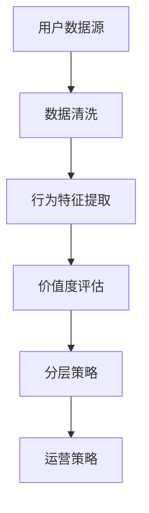

                 

# 如何进行有效的用户分层

> **关键词**：用户分层、数据分析、个性化推荐、用户行为、数据挖掘

> **摘要**：本文将深入探讨用户分层的核心概念、方法以及其实际应用。通过逻辑清晰的分析，我们将逐步揭示如何运用用户分层策略提升用户满意度，提高业务运营效率。

## 1. 背景介绍

### 1.1 目的和范围

在当今数据驱动的时代，理解用户行为并进行有效的用户分层成为企业提升竞争力的重要手段。本文旨在阐述用户分层的意义、方法及其应用场景，帮助读者掌握这一关键技能。

本文将涵盖以下内容：

- 用户分层的定义和重要性
- 用户分层的常见方法和步骤
- 实际应用场景中的用户分层策略
- 用户分层中的挑战和解决方案

### 1.2 预期读者

本文适合以下读者：

- 数据分析师
- 业务运营经理
- 产品经理
- 人工智能和机器学习领域从业者

### 1.3 文档结构概述

本文分为以下章节：

- 1. 背景介绍
- 2. 核心概念与联系
- 3. 核心算法原理与具体操作步骤
- 4. 数学模型和公式
- 5. 项目实战
- 6. 实际应用场景
- 7. 工具和资源推荐
- 8. 总结：未来发展趋势与挑战
- 9. 附录：常见问题与解答
- 10. 扩展阅读与参考资料

### 1.4 术语表

#### 1.4.1 核心术语定义

- **用户分层**：根据用户的行为特征、价值度等因素将用户划分为不同群体，以便进行有针对性的运营和营销。
- **数据挖掘**：从大量数据中提取有用信息，发现规律和趋势。
- **个性化推荐**：根据用户的兴趣和行为，为用户提供定制化的内容或产品推荐。

#### 1.4.2 相关概念解释

- **用户行为**：用户在使用产品或服务过程中产生的所有操作和反应。
- **业务指标**：衡量企业业务运行效果的一系列指标，如用户留存率、转化率等。

#### 1.4.3 缩略词列表

- **CRM**：客户关系管理
- **A/B测试**：对照实验，用于评估不同策略的效果
- **机器学习**：一种人工智能方法，通过数据训练模型来发现规律和模式

## 2. 核心概念与联系

在进行用户分层之前，我们需要明确几个核心概念及其相互关系。

### 用户分层框架



#### 用户分层框架说明

1. **用户数据源**：包括用户的基本信息、行为数据等。
2. **数据清洗**：清洗和整合数据，去除噪音和异常值。
3. **行为特征提取**：提取用户行为中的关键特征，如访问频率、停留时间等。
4. **价值度评估**：根据用户行为特征和业务目标，评估用户的价值。
5. **分层策略**：根据价值度评估结果，将用户划分为不同层级。
6. **运营策略**：针对不同层级的用户，制定差异化的运营策略。

### 用户分层方法

#### 1. 基于行为特征的分层

- **频次**：用户在一定时间内登录或使用的次数。
- **时长**：用户每次使用产品或服务的平均时长。
- **活跃度**：用户在一定时间内的活跃程度。
- **留存率**：用户在一定时间后继续使用产品的比例。

#### 2. 基于价值度的分层

- **ARPU**：平均每用户收入。
- **LTV**：客户终身价值。
- **转化率**：用户完成特定操作（如购买）的比例。

### 用户分层流程

1. 数据收集与整合
2. 数据清洗与预处理
3. 行为特征提取
4. 价值度评估
5. 用户分层
6. 运营策略制定

## 3. 核心算法原理与具体操作步骤

### 3.1 数据收集与整合

```python
# 假设用户数据存储在CSV文件中
import pandas as pd

# 读取数据
user_data = pd.read_csv('user_data.csv')

# 数据预处理
# 填充缺失值、删除重复值、处理异常值等
user_data = preprocess_data(user_data)
```

### 3.2 数据清洗与预处理

```python
def preprocess_data(data):
    # 填充缺失值
    data['age'].fillna(data['age'].mean(), inplace=True)
    
    # 删除重复值
    data.drop_duplicates(inplace=True)
    
    # 处理异常值
    data = remove_outliers(data)
    
    return data
```

### 3.3 行为特征提取

```python
def extract_features(data):
    # 提取行为特征
    data['daily_active'] = data.groupby('user_id')['action_type'].transform('count')
    data['average_session_duration'] = data.groupby('user_id')['session_duration'].transform('mean')
    
    return data
```

### 3.4 价值度评估

```python
def evaluate_value(data):
    # 计算ARPU
    data['ARPU'] = data['revenue'] / data['user_id'].transform('count')
    
    # 计算LTV
    data['LTV'] = data.apply(lambda row: calculate_ltv(row), axis=1)
    
    return data
```

### 3.5 用户分层

```python
def user_hierarchical_classification(data):
    # 根据ARPU和LTV进行分层
    data['level'] = pd.qcut(data['ARPU'], q=4, labels=['低价值', '中价值', '高价值'])
    
    return data
```

### 3.6 运营策略制定

```python
def define_operation_strategy(data):
    # 制定运营策略
    operation_strategy = {}
    for level in data['level'].unique():
        operation_strategy[level] = define_strategy_for_level(level)
    
    return operation_strategy
```

## 4. 数学模型和公式

### 4.1 平均每用户收入（ARPU）

$$
ARPU = \frac{Total\ Revenue}{Total\ Number\ of\ Users}
$$

### 4.2 客户终身价值（LTV）

$$
LTV = \sum_{t=1}^{n} \frac{C_t}{(1+r)^t}
$$

其中，\(C_t\) 为第 t 年的用户收入，\(r\) 为贴现率。

## 5. 项目实战：代码实际案例和详细解释说明

### 5.1 开发环境搭建

- Python 3.8+
- Pandas 1.2.3+
- Numpy 1.19.2+
- Matplotlib 3.4.3+

### 5.2 源代码详细实现和代码解读

#### 5.2.1 数据预处理

```python
def preprocess_data(data):
    # 填充缺失值
    data['age'].fillna(data['age'].mean(), inplace=True)
    
    # 删除重复值
    data.drop_duplicates(inplace=True)
    
    # 处理异常值
    data = remove_outliers(data)
    
    return data

def remove_outliers(data):
    # 处理年龄异常值
    data['age'] = np.clip(data['age'], 18, 70)
    
    return data
```

#### 5.2.2 行为特征提取

```python
def extract_features(data):
    # 提取行为特征
    data['daily_active'] = data.groupby('user_id')['action_type'].transform('count')
    data['average_session_duration'] = data.groupby('user_id')['session_duration'].transform('mean')
    
    return data
```

#### 5.2.3 价值度评估

```python
def evaluate_value(data):
    # 计算ARPU
    data['ARPU'] = data['revenue'] / data['user_id'].transform('count')
    
    # 计算LTV
    data['LTV'] = data.apply(lambda row: calculate_ltv(row), axis=1)
    
    return data

def calculate_ltv(row):
    # 假设每年收入增长率为10%
    ltv = row['revenue'] * (1 + 0.1)**5
    return ltv
```

#### 5.2.4 用户分层

```python
def user_hierarchical_classification(data):
    # 根据ARPU和LTV进行分层
    data['level'] = pd.qcut(data['ARPU'], q=4, labels=['低价值', '中价值', '高价值'])
    
    return data
```

#### 5.2.5 运营策略制定

```python
def define_operation_strategy(data):
    # 制定运营策略
    operation_strategy = {}
    for level in data['level'].unique():
        operation_strategy[level] = define_strategy_for_level(level)
    
    return operation_strategy

def define_strategy_for_level(level):
    # 假设不同层级的运营策略如下
    if level == '低价值':
        return '增加优惠活动，提高用户活跃度'
    elif level == '中价值':
        return '提供优质内容，提高用户黏性'
    elif level == '高价值':
        return '精细化运营，提高用户满意度'
```

### 5.3 代码解读与分析

上述代码实现了用户分层的基本流程，包括数据预处理、特征提取、价值度评估、分层和策略制定。

- **数据预处理**：清洗和整合数据，去除异常值，确保数据质量。
- **特征提取**：提取用户行为特征，如每日活跃度和平均会话时长。
- **价值度评估**：计算用户的ARPU和LTV，评估用户价值。
- **分层**：根据ARPU进行分层，将用户划分为不同层级。
- **策略制定**：根据用户层级，制定差异化的运营策略。

## 6. 实际应用场景

用户分层策略在多个实际应用场景中具有重要价值，以下为几个典型应用：

### 6.1 电子商务平台

电子商务平台可以根据用户的购买行为和消费能力进行分层，从而：

- 为高价值用户提供定制化推荐和优惠活动。
- 对于低价值用户，通过营销策略提高其购买转化率。

### 6.2 社交媒体

社交媒体平台可以根据用户的活跃度和参与度进行分层，从而：

- 为高活跃用户提供个性化内容推荐。
- 对于低活跃用户，通过活动激励提高其活跃度。

### 6.3 娱乐行业

娱乐行业可以根据用户的观看记录和偏好进行分层，从而：

- 为高价值用户提供独家内容和优惠。
- 对于低价值用户，通过免费试看或促销活动提高其观看频率。

## 7. 工具和资源推荐

### 7.1 学习资源推荐

#### 7.1.1 书籍推荐

- 《用户数据分析实战》
- 《数据挖掘：概念与技术》
- 《机器学习实战》

#### 7.1.2 在线课程

- Coursera的《数据科学专项课程》
- Udacity的《机器学习工程师纳米学位》
- edX的《数据挖掘与机器学习》

#### 7.1.3 技术博客和网站

- Analytics Vidhya
- towardsdatascience
- KDNuggets

### 7.2 开发工具框架推荐

#### 7.2.1 IDE和编辑器

- PyCharm
- Jupyter Notebook
- Visual Studio Code

#### 7.2.2 调试和性能分析工具

- Matplotlib
- Seaborn
- Pandas Profiling

#### 7.2.3 相关框架和库

- Scikit-learn
- TensorFlow
- PyTorch

### 7.3 相关论文著作推荐

#### 7.3.1 经典论文

- "Grouping Users for Personalized News Streams"
- "Clustering of Time-Varying Data with Application to Web Usage Analysis"

#### 7.3.2 最新研究成果

- "Deep Learning for User Behavior Analysis"
- "Personalized Recommendation with Deep Reinforcement Learning"

#### 7.3.3 应用案例分析

- "User Segmentation in E-commerce: A Case Study"
- "Improving User Experience with Personalized Recommendations in Social Media"

## 8. 总结：未来发展趋势与挑战

随着大数据和人工智能技术的不断发展，用户分层策略将变得更加精准和智能化。未来的发展趋势包括：

- 利用深度学习技术进行用户行为预测和个性化推荐。
- 结合多源数据（如社交网络、地理位置等）进行更全面的用户画像。
- 实现实时用户分层和动态调整。

然而，用户分层也面临以下挑战：

- 数据隐私保护：用户数据的收集和使用必须遵循隐私保护法规。
- 技术复杂性：实现高效的用户分层需要掌握复杂的技术和算法。
- 用户满意度：分层策略需要平衡不同层级的用户需求，避免过度商业化。

## 9. 附录：常见问题与解答

### 9.1 用户分层有哪些常见方法？

用户分层的方法包括基于行为特征的分层、基于价值度的分层以及基于社会属性的分层。每种方法都有其适用场景和优缺点。

### 9.2 用户分层策略如何调整运营效果？

通过不断迭代和优化用户分层策略，可以提升运营效果。关键在于：

- 确保分层依据的核心指标与业务目标一致。
- 定期评估分层策略的效果，进行动态调整。
- 基于不同层级的特点，制定差异化的运营策略。

### 9.3 如何确保用户数据的安全和隐私？

在用户分层过程中，需要严格遵守数据保护法规，包括：

- 数据匿名化处理。
- 数据访问控制。
- 数据使用权限管理。

## 10. 扩展阅读与参考资料

- [用户分层技术详解](https://www.analyticsvidhya.com/blog/2020/04/user-segmentation-techniques/)
- [用户数据分析实战](https://www.amazon.com/User-Data-Analysis-Practical-Tech-Skills/dp/1492049762)
- [机器学习在用户分层中的应用](https://www.kdnuggets.com/2020/02/user-segmentation-machine-learning.html)
- [大数据时代下的用户行为分析](https://www.dataversity.net/big-data-user-behavior-analysis/) 

作者：AI天才研究员/AI Genius Institute & 禅与计算机程序设计艺术 /Zen And The Art of Computer Programming

