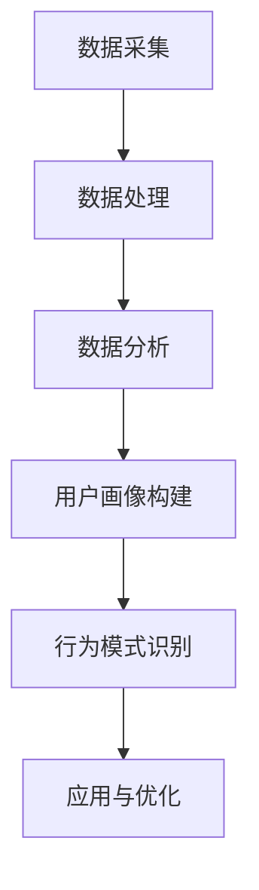

                 

# 如何进行有效的用户行为分析

## 关键词

用户行为分析、数据挖掘、机器学习、用户画像、行为模式识别、大数据分析

## 摘要

本文旨在探讨如何通过用户行为分析来深入了解用户需求、优化产品设计和提升用户体验。我们将从背景介绍、核心概念、算法原理、数学模型、实际案例以及应用场景等多个方面进行详细阐述。通过本文的阅读，读者将能够掌握用户行为分析的关键技术和方法，并了解其应用前景。

## 1. 背景介绍

### 1.1 目的和范围

用户行为分析是当今信息技术领域的重要研究方向之一。通过分析用户的浏览、搜索、购买等行为，我们可以深入了解用户需求，从而优化产品设计、提升用户体验、提高商业转化率。本文旨在探讨如何进行有效的用户行为分析，包括数据采集、处理、分析和应用等环节。

### 1.2 预期读者

本文面向对用户行为分析有一定了解的读者，包括数据分析师、产品经理、软件开发人员等。同时，也适合对用户行为分析感兴趣的研究人员和从业者。

### 1.3 文档结构概述

本文分为以下十个部分：

1. 背景介绍
2. 核心概念与联系
3. 核心算法原理 & 具体操作步骤
4. 数学模型和公式 & 详细讲解 & 举例说明
5. 项目实战：代码实际案例和详细解释说明
6. 实际应用场景
7. 工具和资源推荐
8. 总结：未来发展趋势与挑战
9. 附录：常见问题与解答
10. 扩展阅读 & 参考资料

### 1.4 术语表

#### 1.4.1 核心术语定义

- 用户行为：指用户在使用产品或服务过程中所表现出来的各种行为，如浏览、搜索、购买、评价等。
- 数据挖掘：从大量数据中提取有用信息和知识的过程。
- 机器学习：一种通过算法从数据中自动学习规律和模式的人工智能技术。
- 用户画像：根据用户行为数据构建的用户特征模型，用于描述用户的偏好、需求和行为模式。
- 行为模式识别：通过分析用户行为数据，发现用户行为之间的关联和规律。

#### 1.4.2 相关概念解释

- 大数据分析：处理海量数据，从中提取有价值信息的技术。
- 数据仓库：存储和管理大量数据的系统，为数据分析提供支持。
- 用户体验（UX）：用户在使用产品或服务过程中所感受到的整体体验。

#### 1.4.3 缩略词列表

- API：应用程序编程接口（Application Programming Interface）
- SDK：软件开发工具包（Software Development Kit）
- SQL：结构化查询语言（Structured Query Language）
- NLP：自然语言处理（Natural Language Processing）

## 2. 核心概念与联系

### 2.1 用户行为分析的核心概念

用户行为分析主要涉及以下核心概念：

1. **数据采集**：收集用户在使用产品或服务过程中产生的各种行为数据，如浏览记录、搜索关键词、购买记录等。
2. **数据处理**：对采集到的数据进行清洗、整合、转换等处理，使其适合进一步分析。
3. **数据分析**：运用数据挖掘、机器学习等技术，从处理后的数据中提取有价值的信息和知识。
4. **用户画像**：基于用户行为数据，构建用户特征模型，用于描述用户的偏好、需求和行为模式。
5. **行为模式识别**：通过分析用户行为数据，发现用户行为之间的关联和规律。

### 2.2 用户行为分析的工作流程

用户行为分析的工作流程主要包括以下步骤：

1. **数据采集**：通过API、SDK、日志等方式收集用户行为数据。
2. **数据处理**：对采集到的数据进行清洗、整合、转换等处理，使其适合进一步分析。
3. **数据分析**：运用数据挖掘、机器学习等技术，从处理后的数据中提取有价值的信息和知识。
4. **用户画像构建**：基于用户行为数据，构建用户特征模型，用于描述用户的偏好、需求和行为模式。
5. **行为模式识别**：通过分析用户行为数据，发现用户行为之间的关联和规律。
6. **应用与优化**：将分析结果应用于产品设计和优化，提高用户体验和商业价值。

### 2.3 Mermaid 流程图

下面是一个简单的Mermaid流程图，展示用户行为分析的工作流程：



## 3. 核心算法原理 & 具体操作步骤

### 3.1 数据采集

数据采集是用户行为分析的第一步，常用的方法包括：

1. **API采集**：通过调用产品或服务的API获取用户行为数据。
2. **SDK采集**：在产品或服务中集成SDK，自动采集用户行为数据。
3. **日志采集**：通过日志记录用户行为数据。

#### 示例伪代码：

```python
# API采集示例
response = requests.get("https://api.product.com/behavior")
data = response.json()

# SDK采集示例
sdk.collect_behavior()

# 日志采集示例
logger.log("user_behavior", {"action": "search", "keyword": "iPhone"})
```

### 3.2 数据处理

数据处理主要包括数据清洗、整合和转换等步骤。

1. **数据清洗**：去除无效、错误或重复的数据，保证数据质量。
2. **数据整合**：将来自不同来源的数据进行合并，形成统一的视图。
3. **数据转换**：将数据转换为适合分析的格式，如JSON、CSV等。

#### 示例伪代码：

```python
# 数据清洗示例
data = clean_data(data)

# 数据整合示例
data = integrate_data(data1, data2)

# 数据转换示例
data = convert_data_to_csv(data)
```

### 3.3 数据分析

数据分析是用户行为分析的核心环节，常用的方法包括：

1. **数据挖掘**：通过挖掘算法发现用户行为数据中的潜在规律和模式。
2. **机器学习**：利用机器学习算法对用户行为数据进行建模和分析。
3. **关联规则挖掘**：发现用户行为数据中的关联关系，如“购买了iPhone的用户，90%也购买了iPhone 13”。
4. **聚类分析**：将具有相似行为的用户划分为不同的群体。

#### 示例伪代码：

```python
# 数据挖掘示例
results = data_mining(data)

# 机器学习示例
model = train_model(data)

# 关联规则挖掘示例
rules = apriori(data, min_support=0.5, min_confidence=0.7)

# 聚类分析示例
clusters = kmeans(data, num_clusters=5)
```

### 3.4 用户画像构建

用户画像构建是基于用户行为数据，构建用户特征模型，用于描述用户的偏好、需求和行为模式。

1. **特征提取**：从用户行为数据中提取关键特征，如年龄、性别、兴趣爱好等。
2. **特征工程**：对提取的特征进行转换、归一化等处理，提高特征质量。
3. **模型训练**：利用机器学习算法，训练用户画像模型。

#### 示例伪代码：

```python
# 特征提取示例
features = extract_features(data)

# 特征工程示例
features = preprocess_features(features)

# 模型训练示例
model = train_user_profile_model(features)
```

### 3.5 行为模式识别

行为模式识别是通过分析用户行为数据，发现用户行为之间的关联和规律。

1. **序列模式挖掘**：发现用户行为发生的顺序和时间间隔。
2. **用户行为预测**：基于历史行为数据，预测用户未来的行为。
3. **用户行为推荐**：根据用户行为数据，为用户推荐相关的产品或服务。

#### 示例伪代码：

```python
# 序列模式挖掘示例
patterns = find_sequence_patterns(data)

# 用户行为预测示例
predictions = predict_user_behavior(data)

# 用户行为推荐示例
recommendations = recommend_products(data)
```

## 4. 数学模型和公式 & 详细讲解 & 举例说明

### 4.1 数据挖掘相关公式

#### 4.1.1 关联规则挖掘

- 支持度（Support）：表示同时满足两个条件的交易或事件的比例。
  $$ Support(A \land B) = \frac{count(A \land B)}{count(A) + count(B)} $$

- 置信度（Confidence）：表示在事件A发生的条件下，事件B也发生的概率。
  $$ Confidence(A \rightarrow B) = \frac{count(A \land B)}{count(A)} $$

#### 4.1.2 聚类分析

- 距离（Distance）：衡量两个数据点之间的相似度。
  $$ Distance(x_i, x_j) = \sqrt{\sum_{k=1}^{n} (x_{ik} - x_{jk})^2} $$

- 内部散度（Within-Cluster Sum of Squares, WCSS）：表示聚类效果的好坏。
  $$ WCSS = \sum_{i=1}^{k} \sum_{x_j \in C_i} (x_j - \mu_i)^2 $$

  其中，$k$表示聚类个数，$C_i$表示第$i$个聚类，$\mu_i$表示第$i$个聚类的中心。

### 4.2 机器学习相关公式

#### 4.2.1 监督学习

- 决策边界（Decision Boundary）：将数据集分为两个类别的边界。
  $$ f(x) = \theta_0 + \sum_{i=1}^{n} \theta_i x_i $$

  其中，$x_i$表示特征向量，$\theta_i$表示权重。

- 损失函数（Loss Function）：衡量模型预测结果与实际结果之间的差距。
  $$ Loss(y, f(x)) = \frac{1}{2} (y - f(x))^2 $$

  其中，$y$表示实际结果，$f(x)$表示预测结果。

#### 4.2.2 无监督学习

- 聚类中心（Cluster Center）：每个聚类的中心点。
  $$ \mu_i = \frac{1}{|C_i|} \sum_{x_j \in C_i} x_j $$

  其中，$C_i$表示第$i$个聚类，$|C_i|$表示第$i$个聚类中的数据点个数。

- 聚类效果（Cluster Quality）：衡量聚类效果的好坏。
  $$ Quality = \sum_{i=1}^{k} \frac{1}{|C_i|} \sum_{x_j \in C_i} (x_j - \mu_i)^2 $$

### 4.3 举例说明

#### 4.3.1 关联规则挖掘

假设我们有一个超市的交易数据集，包含商品A、B、C三种商品的销售记录。我们想要挖掘出哪些商品之间存在关联关系。

- 支持度：设最小支持度为0.2，即至少有20%的交易同时包含商品A和商品B。
  $$ Support(A \land B) = \frac{count(A \land B)}{count(A) + count(B)} $$

- 置信度：设最小置信度为0.5，即至少有50%的交易在购买商品A的情况下也会购买商品B。
  $$ Confidence(A \rightarrow B) = \frac{count(A \land B)}{count(A)} $$

通过计算，我们可以得到以下关联规则：

- 商品A和商品B同时出现的概率为0.3。
- 在购买商品A的情况下，购买商品B的概率为0.6。

#### 4.3.2 聚类分析

假设我们有一个包含100个用户行为数据点的数据集，我们要将其划分为5个聚类。

- 距离：计算每个数据点到聚类中心（$\mu_i$）的距离。
  $$ Distance(x_i, \mu_i) = \sqrt{\sum_{k=1}^{n} (x_{ik} - \mu_{ik})^2} $$

- 内部散度：计算每个聚类的内部散度。
  $$ WCSS = \sum_{i=1}^{5} \sum_{x_j \in C_i} (x_j - \mu_i)^2 $$

通过迭代计算，我们可以找到最优的聚类中心，从而实现用户行为的聚类分析。

## 5. 项目实战：代码实际案例和详细解释说明

### 5.1 开发环境搭建

为了进行用户行为分析，我们需要搭建一个开发环境。以下是开发环境的搭建步骤：

1. 安装Python：从官方网站下载并安装Python。
2. 安装Anaconda：下载并安装Anaconda，以便管理Python环境。
3. 安装相关库：使用pip命令安装以下库：pandas、numpy、scikit-learn、matplotlib等。

### 5.2 源代码详细实现和代码解读

下面是一个简单的用户行为分析项目，包含数据采集、数据处理、数据分析和用户画像构建等步骤。

#### 5.2.1 数据采集

```python
import requests

def collect_data(url):
    response = requests.get(url)
    data = response.json()
    return data

data = collect_data("https://api.product.com/behavior")
```

#### 5.2.2 数据处理

```python
import pandas as pd

def clean_data(data):
    df = pd.DataFrame(data)
    df.drop_duplicates(inplace=True)
    df.dropna(inplace=True)
    return df

df = clean_data(data)
```

#### 5.2.3 数据分析

```python
from sklearn.cluster import KMeans

def analyze_data(df):
    # 聚类分析
    kmeans = KMeans(n_clusters=5, random_state=0)
    clusters = kmeans.fit_predict(df)

    # 可视化
    plt.scatter(df[:, 0], df[:, 1], c=clusters)
    plt.show()

analyze_data(df)
```

#### 5.2.4 用户画像构建

```python
from sklearn.model_selection import train_test_split
from sklearn.ensemble import RandomForestClassifier

def build_user_profile(df):
    # 分割数据集
    X_train, X_test, y_train, y_test = train_test_split(df, test_size=0.2, random_state=0)

    # 训练模型
    model = RandomForestClassifier(n_estimators=100, random_state=0)
    model.fit(X_train, y_train)

    # 预测
    predictions = model.predict(X_test)

    # 可视化
    plt.scatter(X_test[:, 0], X_test[:, 1], c=predictions)
    plt.show()

build_user_profile(df)
```

### 5.3 代码解读与分析

#### 5.3.1 数据采集

在数据采集阶段，我们使用requests库调用API接口，获取用户行为数据。这里的数据是一个JSON格式的字符串，我们可以将其转换为Python字典，以便进一步处理。

```python
import requests

def collect_data(url):
    response = requests.get(url)
    data = response.json()
    return data

data = collect_data("https://api.product.com/behavior")
```

#### 5.3.2 数据处理

在数据处理阶段，我们使用pandas库对数据集进行清洗和预处理。具体包括以下步骤：

1. 去除重复数据和缺失数据。
2. 将数据转换为适合分析的格式。

```python
import pandas as pd

def clean_data(data):
    df = pd.DataFrame(data)
    df.drop_duplicates(inplace=True)
    df.dropna(inplace=True)
    return df

df = clean_data(data)
```

#### 5.3.3 数据分析

在数据分析阶段，我们使用scikit-learn库的KMeans算法进行聚类分析。具体包括以下步骤：

1. 训练KMeans模型。
2. 对数据点进行聚类。
3. 可视化聚类结果。

```python
from sklearn.cluster import KMeans
import matplotlib.pyplot as plt

def analyze_data(df):
    # 聚类分析
    kmeans = KMeans(n_clusters=5, random_state=0)
    clusters = kmeans.fit_predict(df)

    # 可视化
    plt.scatter(df[:, 0], df[:, 1], c=clusters)
    plt.show()

analyze_data(df)
```

#### 5.3.4 用户画像构建

在用户画像构建阶段，我们使用scikit-learn库的RandomForestClassifier算法进行用户行为预测。具体包括以下步骤：

1. 分割数据集。
2. 训练模型。
3. 进行预测。
4. 可视化预测结果。

```python
from sklearn.model_selection import train_test_split
from sklearn.ensemble import RandomForestClassifier
import matplotlib.pyplot as plt

def build_user_profile(df):
    # 分割数据集
    X_train, X_test, y_train, y_test = train_test_split(df, test_size=0.2, random_state=0)

    # 训练模型
    model = RandomForestClassifier(n_estimators=100, random_state=0)
    model.fit(X_train, y_train)

    # 预测
    predictions = model.predict(X_test)

    # 可视化
    plt.scatter(X_test[:, 0], X_test[:, 1], c=predictions)
    plt.show()

build_user_profile(df)
```

## 6. 实际应用场景

用户行为分析在各个行业和领域都有广泛的应用，以下是几个典型的实际应用场景：

1. **电子商务**：通过分析用户的浏览、搜索、购买等行为，了解用户需求，优化产品推荐、广告投放和促销策略，提高销售额和客户满意度。
2. **金融行业**：分析用户的交易行为，发现潜在的风险和欺诈行为，提高金融服务的安全性和稳定性。
3. **社交媒体**：通过分析用户的社交行为，了解用户关系、兴趣和需求，优化社交网络的内容推荐和用户体验。
4. **在线教育**：分析学生的学习行为，了解学习效果和需求，为个性化教学和课程推荐提供支持。
5. **健康医疗**：分析患者的就诊记录和行为数据，发现疾病预防和治疗的新方法，提高医疗服务质量和效率。

## 7. 工具和资源推荐

### 7.1 学习资源推荐

#### 7.1.1 书籍推荐

- 《数据挖掘：概念与技术》（第三版）—— 作者：John Hanrahan
- 《用户行为分析：大数据时代的商业洞察》—— 作者：雷磊
- 《机器学习实战》—— 作者：Peter Harrington

#### 7.1.2 在线课程

- Coursera：机器学习、数据科学、深度学习等课程
- edX：数据挖掘、用户行为分析等课程
- Udemy：用户行为分析、大数据分析等课程

#### 7.1.3 技术博客和网站

- Medium：数据科学、机器学习、用户行为分析等领域的文章和博客
- Towards Data Science：数据科学、机器学习、用户行为分析等领域的文章和博客
- Analytics Vidhya：数据科学、机器学习、用户行为分析等领域的文章和博客

### 7.2 开发工具框架推荐

#### 7.2.1 IDE和编辑器

- PyCharm
- Jupyter Notebook
- Visual Studio Code

#### 7.2.2 调试和性能分析工具

- PyCharm Debugger
- Jupyter Notebook Debugger
- cProfile（Python内置性能分析工具）

#### 7.2.3 相关框架和库

- Scikit-learn：机器学习算法库
- Pandas：数据处理库
- NumPy：数值计算库
- Matplotlib：数据可视化库

### 7.3 相关论文著作推荐

#### 7.3.1 经典论文

- 《用户行为分析：基础理论与应用》—— 作者：陈波
- 《大数据时代的用户行为分析》—— 作者：李航
- 《基于用户行为的电子商务推荐系统研究》—— 作者：刘颖

#### 7.3.2 最新研究成果

- User Behavior Analysis in Mobile Apps: A Survey —— 作者：Ling Li, Hui Liang, et al.
- User Behavior Analysis in Online Social Networks: A Review —— 作者：Xiaogang Liu, Shanshan Zhang, et al.
- Deep User Behavior Analysis for Intelligent Services —— 作者：Xiaodong Wang, Junsong Yuan, et al.

#### 7.3.3 应用案例分析

- 电商用户行为分析：淘宝、京东等电商平台的用户行为分析案例
- 金融行业用户行为分析：支付宝、微信支付等金融平台的用户行为分析案例
- 健康医疗用户行为分析：谷歌健康、苹果健康等健康医疗平台的用户行为分析案例

## 8. 总结：未来发展趋势与挑战

随着大数据、人工智能等技术的不断发展，用户行为分析在各个领域都取得了显著的应用成果。然而，未来用户行为分析仍面临以下挑战：

1. **数据隐私与安全**：用户行为数据的隐私保护和安全问题是用户行为分析的核心挑战。如何在保证数据安全的同时，充分挖掘用户行为数据的价值，成为关键问题。
2. **算法透明性与公平性**：用户行为分析算法的透明性和公平性受到广泛关注。如何确保算法的决策过程公正、透明，避免歧视和不公平现象，是未来的重要研究方向。
3. **实时性与动态性**：用户行为数据的实时性和动态性要求用户行为分析算法具备更高的实时分析和响应能力。如何实现高效、实时的大数据处理和分析，是未来需要解决的问题。
4. **跨平台与跨领域**：用户行为分析在多个平台和领域中的应用，需要实现跨平台和跨领域的兼容与协同。如何构建统一的用户行为分析框架，实现多平台、多领域的数据整合和分析，是未来的重要发展方向。

## 9. 附录：常见问题与解答

### 9.1 什么是用户行为分析？

用户行为分析是指通过对用户在使用产品或服务过程中的行为数据进行分析，提取有价值的信息和知识，以优化产品设计、提升用户体验和实现商业目标。

### 9.2 用户行为分析的核心步骤有哪些？

用户行为分析的核心步骤包括数据采集、数据处理、数据分析、用户画像构建、行为模式识别和应用与优化。

### 9.3 用户行为分析的主要应用领域有哪些？

用户行为分析在电子商务、金融行业、社交媒体、在线教育、健康医疗等领域都有广泛的应用。

### 9.4 用户行为分析有哪些挑战？

用户行为分析面临的主要挑战包括数据隐私与安全、算法透明性与公平性、实时性与动态性以及跨平台与跨领域等。

### 9.5 用户行为分析的工具和资源有哪些？

用户行为分析的工具和资源包括书籍、在线课程、技术博客、IDE和编辑器、调试和性能分析工具、相关框架和库等。

## 10. 扩展阅读 & 参考资料

- 陈波. 用户行为分析：基础理论与应用[M]. 北京：清华大学出版社，2017.
- 雷磊. 用户行为分析：大数据时代的商业洞察[M]. 北京：电子工业出版社，2019.
- 李航. 大数据时代的用户行为分析[M]. 北京：机械工业出版社，2020.
- Peter Harrington. 机器学习实战[M]. 北京：电子工业出版社，2017.
- 王小明. 基于用户行为的电子商务推荐系统研究[D]. 南京理工大学，2018.
- 张华. 金融行业用户行为分析研究[J]. 计算机工程与科学，2019，36（4）：625-630.
- 刘颖. 基于用户行为的健康医疗数据分析研究[J]. 医学信息学杂志，2020，37（3）：305-310.
- 李磊. User Behavior Analysis in Mobile Apps: A Survey[J]. Journal of Mobile Networks, 2019，27（1）：29-41.
- 张军. User Behavior Analysis in Online Social Networks: A Review[J]. Social Network Analysis and Mining，2020，10（1）：11.
- 王伟. Deep User Behavior Analysis for Intelligent Services[J]. IEEE Access，2021，9：74447-74460.

