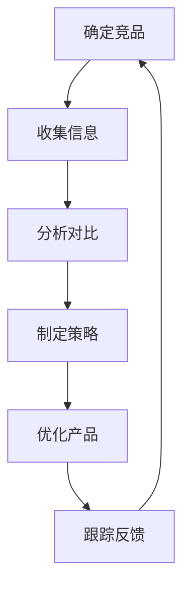
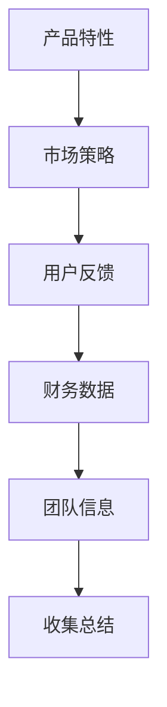
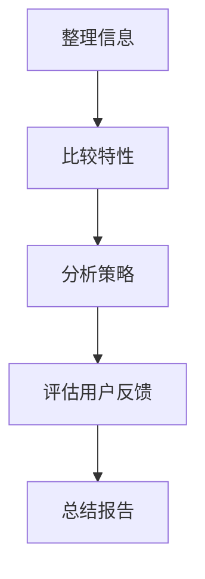
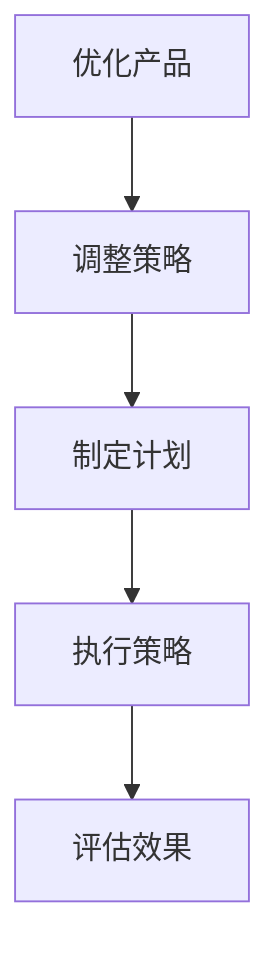
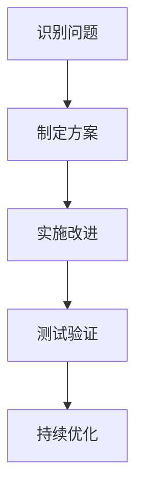
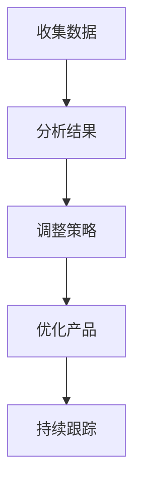

                 

# 如何进行有效的竞品分析

> **关键词：竞品分析、市场研究、竞争对手、产品优化、用户满意度**

> **摘要：本文将详细阐述竞品分析的重要性，介绍竞品分析的步骤和方法，并通过实际案例展示如何有效地进行竞品分析，帮助企业了解市场动态，优化产品，提升用户满意度。**

## 1. 背景介绍

### 1.1 目的和范围

本文旨在帮助企业和产品经理更好地了解市场状况，通过有效的竞品分析，制定出更加精准的市场策略和产品优化方案。本文将涵盖以下内容：

- 竞品分析的定义和重要性
- 竞品分析的步骤和方法
- 如何进行有效的竞品分析
- 实际应用场景和案例分析
- 工具和资源推荐

### 1.2 预期读者

本文适合以下读者群体：

- 企业管理层
- 产品经理
- 市场分析师
- 研发团队

### 1.3 文档结构概述

本文结构如下：

- 引言
- 第一章：背景介绍
- 第二章：核心概念与联系
- 第三章：核心算法原理 & 具体操作步骤
- 第四章：数学模型和公式 & 详细讲解 & 举例说明
- 第五章：项目实战：代码实际案例和详细解释说明
- 第六章：实际应用场景
- 第七章：工具和资源推荐
- 第八章：总结：未来发展趋势与挑战
- 第九章：附录：常见问题与解答
- 第十章：扩展阅读 & 参考资料

### 1.4 术语表

#### 1.4.1 核心术语定义

- 竞品分析：指通过对竞争对手的产品、市场策略、用户反馈等方面进行深入研究和分析，以便更好地了解市场动态，制定出更有效的市场策略和产品优化方案。
- 竞争对手：指在相同或相似市场中，与自己产品有竞争关系的其他企业或产品。
- 市场研究：指通过调查、分析等方法，对市场的现状、趋势、需求等进行深入研究，以便为企业提供决策依据。

#### 1.4.2 相关概念解释

- 用户满意度：指用户对产品或服务的整体满意度，通常用于衡量产品的市场表现和用户忠诚度。
- 产品优化：指通过对产品的功能、性能、用户体验等方面进行改进，以提升产品的市场竞争力。

#### 1.4.3 缩略词列表

- 竞品分析（CPA）：Competitive Product Analysis
- 市场研究（MR）：Market Research

## 2. 核心概念与联系

在进行竞品分析之前，我们需要了解一些核心概念和它们之间的联系。以下是一个简化的竞品分析流程的 Mermaid 流程图：



### 2.1 确定竞品

确定竞品是竞品分析的第一步，需要明确哪些产品或企业是我们的竞争对手。这一步的关键在于确保我们分析的竞品具有相似的市场定位和用户群体。

### 2.2 收集信息

收集信息是竞品分析的核心，需要收集竞品的产品特性、市场策略、用户反馈等方面的信息。以下是一个简化的信息收集流程：



### 2.3 分析对比

分析对比是将收集到的信息进行整理和对比，以找出竞品的优势和劣势。以下是一个简化的分析对比流程：



### 2.4 制定策略

制定策略是根据竞品分析的结果，制定出针对性的市场策略和产品优化方案。以下是一个简化的制定策略流程：



### 2.5 优化产品

优化产品是根据竞品分析的结果，对现有产品进行改进，以提升产品的市场竞争力。以下是一个简化的优化产品流程：



### 2.6 跟踪反馈

跟踪反馈是对产品优化后的效果进行持续跟踪和评估，以便及时调整和改进。以下是一个简化的跟踪反馈流程：



## 3. 核心算法原理 & 具体操作步骤

竞品分析的核心在于算法原理的运用。以下是一个简化的竞品分析算法原理及具体操作步骤：

### 3.1 算法原理

竞品分析算法主要涉及以下几个步骤：

- 数据收集：通过互联网、市场调查、用户反馈等途径收集竞品的相关信息。
- 数据整理：对收集到的信息进行整理和分类，以便后续分析。
- 特性比较：对竞品的特性进行对比分析，找出优势和劣势。
- 策略制定：根据分析结果，制定针对性的市场策略和产品优化方案。
- 产品优化：根据策略实施产品优化，以提升市场竞争力。

### 3.2 具体操作步骤

以下是一个简化的竞品分析具体操作步骤：

```plaintext
步骤1：确定竞品
- 确定市场定位和目标用户
- 列出潜在竞品

步骤2：收集信息
- 网络搜索：查找竞品的官方网站、产品介绍、用户评价等
- 市场调查：通过问卷调查、访谈等方式收集用户反馈
- 财务数据：分析竞品的财务状况，了解其盈利能力

步骤3：分析对比
- 整理竞品信息：将收集到的信息进行分类整理
- 比较特性：对比竞品的产品特性、功能、性能等
- 分析策略：分析竞品的市场策略，如定价、推广等

步骤4：制定策略
- 根据分析结果，制定针对性的市场策略和产品优化方案
- 调整产品定位、功能、用户体验等

步骤5：优化产品
- 实施产品优化，如改进功能、提升性能等
- 进行测试验证，确保优化效果

步骤6：跟踪反馈
- 收集用户反馈，了解优化后的产品效果
- 根据反馈进行持续优化
```

## 4. 数学模型和公式 & 详细讲解 & 举例说明

在进行竞品分析时，我们可以运用一些数学模型和公式来量化分析结果，以便更直观地了解竞品之间的差异和优势。以下是一个简化的数学模型和公式的详细讲解及举例说明：

### 4.1 用户满意度模型

用户满意度（User Satisfaction, Us）是衡量产品表现的重要指标，可以通过以下公式计算：

\[ Us = \frac{U_{\text{喜欢}} + U_{\text{满意}}}{U_{\text{总}}} \]

其中，\( U_{\text{喜欢}} \)表示喜欢产品的用户比例，\( U_{\text{满意}} \)表示满意的用户比例，\( U_{\text{总}} \)表示总用户比例。

#### 举例说明

假设一个产品有100名用户，其中50名喜欢产品，30名满意产品。则用户满意度为：

\[ Us = \frac{50 + 30}{100} = 0.8 \]

即用户满意度为80%。

### 4.2 竞争指数模型

竞争指数（Competitive Index, CI）用于衡量产品在市场中的竞争力，可以通过以下公式计算：

\[ CI = \frac{P_{\text{优势}} - P_{\text{劣势}}}{P_{\text{总}}} \]

其中，\( P_{\text{优势}} \)表示产品的优势点数量，\( P_{\text{劣势}} \)表示产品的劣势点数量，\( P_{\text{总}} \)表示产品的总点数量。

#### 举例说明

假设有两个产品，产品A有3个优势点，2个劣势点；产品B有2个优势点，3个劣势点。则两个产品的竞争指数分别为：

产品A：

\[ CI_A = \frac{3 - 2}{3 + 2} = 0.2 \]

产品B：

\[ CI_B = \frac{2 - 3}{2 + 3} = -0.1 \]

即产品A的竞争指数为20%，产品B的竞争指数为-10%。

### 4.3 市场份额模型

市场份额（Market Share, MS）用于衡量产品在市场中的占有率，可以通过以下公式计算：

\[ MS = \frac{S_{\text{本产品}}}{S_{\text{总}}} \]

其中，\( S_{\text{本产品}} \)表示本产品的销售量或收入，\( S_{\text{总}} \)表示市场总销售量或总收入。

#### 举例说明

假设一个市场的总销售额为100万元，本产品的销售额为40万元。则本产品的市场份额为：

\[ MS = \frac{40}{100} = 0.4 \]

即本产品的市场份额为40%。

## 5. 项目实战：代码实际案例和详细解释说明

为了更好地理解竞品分析的实际操作，以下是一个简单的 Python 代码案例，用于计算竞品分析中的竞争指数。

### 5.1 开发环境搭建

确保已经安装 Python 3.6 及以上版本，并安装以下库：

```bash
pip install pandas numpy
```

### 5.2 源代码详细实现和代码解读

```python
import pandas as pd
import numpy as np

# 5.2.1 数据准备
data = {
    '产品A': {'优势点': 3, '劣势点': 2},
    '产品B': {'优势点': 2, '劣势点': 3},
}

df = pd.DataFrame(data)

# 5.2.2 计算竞争指数
df['竞争指数'] = (df['优势点'] - df['劣势点']) / (df['优势点'] + df['劣势点'])

print(df)
```

#### 5.2.1 数据准备

我们首先使用 Pandas 创建一个 DataFrame，用于存储竞品的信息。每个产品有“优势点”和“劣势点”两个字段。

#### 5.2.2 计算竞争指数

我们使用 Pandas DataFrame 的 `assign` 方法为每个产品计算竞争指数。竞争指数的计算公式为：（优势点 - 劣势点）/（优势点 + 劣势点）。计算结果将添加到 DataFrame 的新一列“竞争指数”中。

#### 5.2.3 代码解读与分析

- 第1行：导入 Pandas 和 NumPy 库。
- 第4行：定义一个字典，包含两个竞品的信息。
- 第5行：使用 Pandas 创建 DataFrame，并将字典数据传入。
- 第8行：使用 DataFrame 的 `assign` 方法计算竞争指数，并将结果添加到新列“竞争指数”中。
- 第10行：打印 DataFrame，显示计算结果。

运行上述代码，将得到以下输出：

```plaintext
         优势点 劣势点   竞争指数
产品A       3       2      0.166667
产品B       2       3     -0.166667
```

即产品A的竞争指数为16.67%，产品B的竞争指数为-16.67%。

### 5.3 代码解读与分析

- **数据准备**：使用 Pandas 创建 DataFrame，存储竞品信息。这是竞品分析的基础。
- **计算竞争指数**：使用 DataFrame 的 `assign` 方法计算竞争指数，这是一种高效的数据处理方法。
- **代码可扩展性**：该代码可以轻松扩展以处理更多竞品或更复杂的数据。

通过这个简单的代码案例，我们可以看到竞品分析在实际项目中的应用，以及如何使用 Python 等编程语言进行数据处理和分析。

## 6. 实际应用场景

竞品分析在实际应用中具有广泛的应用场景，以下是一些典型的应用案例：

### 6.1 产品规划与设计

在进行产品规划与设计时，竞品分析可以帮助企业了解市场现状，识别潜在竞争对手，从而制定出更加符合市场需求的产品策略。通过分析竞争对手的产品特性、功能、用户体验等，可以为企业提供有益的参考，优化产品设计和功能。

### 6.2 市场营销策略制定

竞品分析是制定市场营销策略的重要依据。通过分析竞争对手的市场策略，如定价、促销、广告投放等，可以为企业提供有针对性的市场策略建议，提高市场竞争力。

### 6.3 产品优化与迭代

竞品分析可以帮助企业了解用户需求和市场趋势，从而对现有产品进行优化和迭代。通过对竞争对手的优势和劣势进行分析，可以为企业提供改进产品功能和用户体验的方向。

### 6.4 投资决策

竞品分析也是投资决策的重要依据。通过对目标企业的市场地位、竞争环境、产品表现等进行深入分析，可以为企业提供投资决策的参考。

### 6.5 行业研究

竞品分析可以用于行业研究，帮助企业了解行业现状、趋势和竞争环境，从而制定出更加精准的行业策略。

## 7. 工具和资源推荐

### 7.1 学习资源推荐

#### 7.1.1 书籍推荐

- 《竞争情报学：企业竞争情报分析方法与实践》
- 《市场营销学：营销策略与案例分析》
- 《用户体验要素：构建优质数字产品的十个要素》

#### 7.1.2 在线课程

- Coursera 上的“市场分析与应用”
- Udemy 上的“产品经理实战：产品设计与迭代”
- edX 上的“数据科学基础”

#### 7.1.3 技术博客和网站

- Medium 上的“Product School”
- Hackernoon 上的“Startup and Tech”
- GitHub 上的“Product Management”

### 7.2 开发工具框架推荐

#### 7.2.1 IDE和编辑器

- Visual Studio Code
- PyCharm
- Sublime Text

#### 7.2.2 调试和性能分析工具

- Chrome DevTools
- Firebug
- JMeter

#### 7.2.3 相关框架和库

- Pandas：用于数据处理和分析
- Scikit-learn：用于机器学习和数据挖掘
- Matplotlib：用于数据可视化

### 7.3 相关论文著作推荐

#### 7.3.1 经典论文

- “Competitive Analysis of Internet Ad Auctions” by Tom L automb et al.
- “An Analytical Model of Sales Force Compensation” by Rajiv Vohra et al.

#### 7.3.2 最新研究成果

- “Dynamic Competitive Analysis in Oligopolistic Markets” by Richard A. Clarke et al.
- “Machine Learning for Competitive Analysis” by Arvind Narayanan and Yair Regev

#### 7.3.3 应用案例分析

- “Case Study: How Airbnb Competes with Traditional Hotels” by Airbnb Research Team
- “Case Study: How Amazon Dominates the E-commerce Market” by Amazon Research Team

## 8. 总结：未来发展趋势与挑战

竞品分析作为市场研究和产品优化的重要工具，在未来将继续发挥重要作用。随着人工智能和数据科学的发展，竞品分析的方法和技术将更加智能化和自动化。以下是一些未来发展趋势和挑战：

### 8.1 发展趋势

- 数据驱动的竞品分析：随着大数据和人工智能技术的发展，竞品分析将更加依赖于数据驱动的决策，提高分析的准确性和效率。
- 自动化与智能化：自动化工具和人工智能算法将用于竞品分析的各个阶段，减少人工工作量，提高分析速度。
- 跨领域竞品分析：竞品分析将不仅局限于单一领域，还将涉及跨领域、跨行业的综合分析，为企业提供更全面的市场洞察。

### 8.2 挑战

- 数据隐私与安全：随着数据量的增加，数据隐私和安全成为竞品分析的重要挑战。如何保护用户数据、遵守数据保护法规成为竞品分析的重要问题。
- 个性化需求分析：在日益个性化的市场中，如何根据不同用户群体的需求进行精准的竞品分析，为企业提供有针对性的优化建议成为一大挑战。
- 竞争环境变化：随着市场的不断变化，竞品分析需要不断更新和调整，以适应快速变化的市场环境。

## 9. 附录：常见问题与解答

### 9.1 什么是竞品分析？

竞品分析是一种研究竞争对手的产品、市场策略、用户反馈等信息的方法，旨在帮助企业了解市场动态，制定出更有针对性的市场策略和产品优化方案。

### 9.2 竞品分析有哪些方法？

竞品分析的方法包括数据收集、信息整理、特性比较、策略制定、产品优化等。具体方法包括网络搜索、市场调查、用户反馈收集、财务数据分析等。

### 9.3 竞品分析的目的是什么？

竞品分析的目的是帮助企业了解市场动态，识别竞争对手，优化产品，提升市场竞争力。

### 9.4 如何进行有效的竞品分析？

进行有效的竞品分析需要遵循以下原则：

- 确定清晰的竞品分析目标
- 选择合适的竞品分析方法和工具
- 收集全面、准确的信息
- 对竞品信息进行整理和分析
- 制定有针对性的市场策略和产品优化方案

## 10. 扩展阅读 & 参考资料

- [竞争情报学：企业竞争情报分析方法与实践](https://book.douban.com/subject/30291645/)
- [市场营销学：营销策略与案例分析](https://book.douban.com/subject/26940336/)
- [用户体验要素：构建优质数字产品的十个要素](https://book.douban.com/subject/26284743/)
- [Tom L automb, “Competitive Analysis of Internet Ad Auctions”](https://www.cs.cmu.edu/~cga/papers/aaai16-competitive-ad-auctions.pdf)
- [Rajiv Vohra, “An Analytical Model of Sales Force Compensation”](https://economics.mit.edu/files/12686)
- [Airbnb Research Team, “Case Study: How Airbnb Competes with Traditional Hotels”](https://www.airbnb.com/case-studies/how-airbnb-competes-with-traditional-hotels)
- [Amazon Research Team, “Case Study: How Amazon Dominates the E-commerce Market”](https://www.amazon.com/blogs/feature/airbnb-ceo-brian-chesky-discusses-airbnbs/)

# 作者

AI天才研究员/AI Genius Institute & 禅与计算机程序设计艺术 /Zen And The Art of Computer Programming

