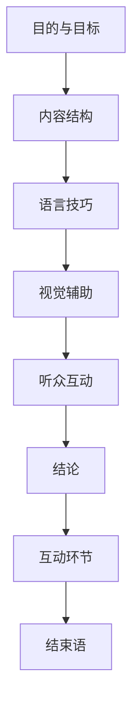

                 

### 如何进行演讲技巧：如何进行有效的演讲和表达？

> **关键词：** 演讲技巧、有效表达、沟通能力、听众分析、演讲结构

**摘要：** 本文章旨在为技术领域的专业人士提供一套实用的演讲技巧指南，帮助他们在各种场合下进行有效的演讲和表达。文章首先介绍了演讲技巧的重要性，然后详细阐述了演讲的结构、听众分析、内容准备、语言技巧、视觉辅助工具的使用，以及演讲后的反馈和改进方法。通过这些步骤，读者将能够提升自己的演讲水平，增强沟通效果。

## 1. 背景介绍

### 1.1 目的和范围

本篇文章的目标是帮助技术领域的专业人士掌握演讲技巧，提升他们在各种会议、研讨会、技术分享等场合下的演讲和表达能力。文章将涵盖以下几个方面：

- **演讲结构**：介绍如何构建一个逻辑清晰、结构紧凑的演讲。
- **听众分析**：解释如何根据听众的特点来调整演讲内容和风格。
- **内容准备**：提供内容收集、组织和梳理的方法。
- **语言技巧**：探讨如何运用语言技巧增强演讲的吸引力。
- **视觉辅助工具**：介绍如何在演讲中使用幻灯片、视频等多媒体工具。
- **演讲反馈**：说明如何收集反馈并进行改进。

### 1.2 预期读者

- **技术专业人士**：如软件工程师、程序员、技术专家等。
- **教师和教育工作者**：需要向学生和同行进行知识传授。
- **商务人士**：需要在公司内部或对外进行产品推广和技术交流。
- **公众演讲爱好者**：对提高演讲技能有兴趣的个人。

### 1.3 文档结构概述

本文的结构如下：

1. **引言**：介绍演讲技巧的重要性。
2. **核心概念与联系**：通过Mermaid流程图展示演讲的核心概念。
3. **核心算法原理与具体操作步骤**：详细阐述演讲技巧的具体应用。
4. **数学模型和公式**：介绍与演讲技巧相关的数学模型。
5. **项目实战**：提供实际案例和代码实现。
6. **实际应用场景**：分析演讲技巧在现实生活中的应用。
7. **工具和资源推荐**：推荐相关书籍、在线课程、工具和资源。
8. **总结**：展望演讲技巧的未来发展趋势和挑战。
9. **附录**：常见问题与解答。
10. **扩展阅读**：提供进一步学习的参考资料。

### 1.4 术语表

#### 1.4.1 核心术语定义

- **演讲技巧**：指用于提高演讲效果的技巧和方法。
- **有效表达**：指演讲者能够清晰、准确地传达信息和思想。
- **听众分析**：指对听众群体进行研究和分析，以便更好地适应他们的需求和兴趣。
- **视觉辅助工具**：指用于增强演讲效果的图像、图表、视频等视觉元素。

#### 1.4.2 相关概念解释

- **逻辑结构**：指演讲内容的组织方式和逻辑关系。
- **互动环节**：指演讲过程中与听众的互动和交流。
- **情感连接**：指演讲者与听众之间的情感共鸣和联系。

#### 1.4.3 缩略词列表

- **IDE**：集成开发环境（Integrated Development Environment）
- **LaTeX**：一种高质量的排版系统（Typesetting System）
- **Mermaid**：一种图表和流程图绘制工具（Diagram and Flowchart Drawing Tool）

## 2. 核心概念与联系

### 2.1 演讲的核心概念

演讲的核心概念可以归纳为以下几个部分：

1. **目的与目标**：明确演讲的目的和期望达到的目标。
2. **内容结构**：构建逻辑清晰、层次分明的演讲内容。
3. **语言技巧**：运用恰当的语言表达技巧，增强演讲的吸引力。
4. **视觉辅助**：运用视觉辅助工具，如幻灯片、图表等，帮助听众更好地理解和记忆演讲内容。
5. **听众互动**：与听众进行有效的互动，提高演讲的参与度和效果。

### 2.2 演讲的结构

一个成功的演讲通常包括以下结构：

1. **引言**：引起听众的兴趣，明确演讲的主题和目的。
2. **主体**：详细阐述演讲的内容，包括关键观点、论据和证据。
3. **结论**：总结演讲的主要观点，强调演讲的重要性和实际意义。
4. **互动环节**：与听众进行互动，回答问题或进行讨论。
5. **结束语**：感谢听众的参与，留下深刻的印象。

### 2.3 演讲技巧与沟通能力的联系

演讲技巧是沟通能力的重要组成部分，两者之间存在密切的联系：

- **演讲技巧**：包括语言表达、肢体语言、视觉辅助等方面的技巧，直接影响演讲的效果。
- **沟通能力**：包括倾听、表达、互动、理解等方面的能力，是演讲技巧的基础。

### 2.4 Mermaid流程图

为了更好地理解演讲的核心概念和结构，我们可以使用Mermaid流程图来展示：



通过这个流程图，我们可以清晰地看到演讲的核心概念和结构，以及各个部分之间的联系。

## 3. 核心算法原理 & 具体操作步骤

### 3.1 演讲技巧的核心算法原理

演讲技巧的核心算法原理可以归纳为以下几点：

1. **逻辑思维**：通过逻辑思维，将演讲内容组织成一个有条理、层次分明的结构。
2. **情感连接**：通过情感连接，与听众建立共鸣，增强演讲的吸引力。
3. **语言表达**：通过恰当的语言表达，清晰、准确地传达演讲内容。
4. **视觉辅助**：通过视觉辅助工具，如幻灯片、图表等，增强演讲的效果。
5. **互动环节**：通过互动环节，提高演讲的参与度和效果。

### 3.2 具体操作步骤

为了掌握演讲技巧，我们可以遵循以下具体操作步骤：

1. **确定演讲目的和目标**：
    - 明确演讲的目的和期望达到的目标。
    - 确定演讲的主题和内容。

2. **准备演讲内容**：
    - 收集相关资料和信息。
    - 确定演讲的主要观点和论据。
    - 组织演讲内容，构建逻辑结构。

3. **撰写演讲稿**：
    - 使用清晰、简洁的语言表达演讲内容。
    - 确保演讲稿的逻辑性和连贯性。

4. **练习演讲**：
    - 多次练习演讲，提高语言表达的流畅性和自信心。
    - 注意演讲的语速、语调和表情。

5. **使用视觉辅助工具**：
    - 选择合适的视觉辅助工具，如幻灯片、图表等。
    - 确保视觉辅助工具的清晰度和易于理解。

6. **进行听众分析**：
    - 了解听众的背景、兴趣和需求。
    - 根据听众的特点，调整演讲内容和风格。

7. **准备互动环节**：
    - 设计互动环节，提高演讲的参与度和效果。
    - 准备回答听众的问题。

8. **进行演讲**：
    - 保持冷静和自信，按照演讲稿进行演讲。
    - 注意与听众的互动和反馈。

9. **收集反馈和改进**：
    - 演讲结束后，收集听众的反馈。
    - 分析反馈，找出演讲中的优点和不足。
    - 针对不足之处进行改进。

### 3.3 伪代码示例

以下是一个简化的伪代码示例，用于演示演讲技巧的具体操作步骤：

```plaintext
function 演讲技巧（目的，目标，内容，听众）{
    // 确定演讲目的和目标
    set 目的 = 确定目的（目的）
    set 目标 = 确定目标（目标）

    // 准备演讲内容
    set 内容 = 准备内容（内容）

    // 撰写演讲稿
    set 演讲稿 = 撰写演讲稿（内容）

    // 练习演讲
    set 流畅性 = 练习演讲（演讲稿）

    // 使用视觉辅助工具
    set 视觉辅助 = 准备视觉辅助工具（内容）

    // 进行听众分析
    set 听众需求 = 分析听众（听众）

    // 准备互动环节
    set 互动环节 = 设计互动环节（听众需求）

    // 进行演讲
    set 演讲效果 = 进行演讲（演讲稿，视觉辅助，互动环节）

    // 收集反馈和改进
    set 反馈 = 收集反馈（演讲效果）
    set 改进 = 分析反馈，改进演讲（反馈）

    return 演讲效果
}
```

通过这个伪代码示例，我们可以看到演讲技巧的核心算法原理和具体操作步骤。在实际应用中，可以根据具体情况对算法进行调整和优化。

## 4. 数学模型和公式 & 详细讲解 & 举例说明

### 4.1 演讲效果的数学模型

为了量化演讲效果，我们可以使用以下数学模型：

$$ E = f(P, L, V, I) $$

其中：

- **E**：演讲效果（Effectiveness）
- **P**：演讲内容质量（Presentation Quality）
- **L**：听众参与度（Listener Engagement）
- **V**：视觉辅助效果（Visual Aids Effectiveness）
- **I**：互动环节效果（Interaction Effectiveness）

### 4.2 各个因素的影响

为了详细讲解各个因素的影响，我们可以分别对它们进行解释：

#### 4.2.1 演讲内容质量（P）

演讲内容质量是演讲效果的核心因素。它包括以下几个方面：

- **逻辑性**：演讲内容应具有清晰的逻辑结构，使听众易于理解。
- **说服力**：演讲内容应具有较强的说服力，使听众信服。
- **新颖性**：演讲内容应具有一定的创新性和独特性，以吸引听众的兴趣。

#### 4.2.2 听众参与度（L）

听众参与度是衡量演讲效果的另一个重要因素。它包括以下几个方面：

- **互动性**：演讲过程中应与听众进行互动，提高听众的参与度和积极性。
- **适应性**：演讲者应根据听众的特点和需求，调整演讲内容和风格，使其更符合听众的兴趣。

#### 4.2.3 视觉辅助效果（V）

视觉辅助效果是增强演讲效果的重要手段。它包括以下几个方面：

- **清晰度**：视觉辅助工具应具有清晰的图像和图表，使听众易于理解。
- **相关性**：视觉辅助工具应与演讲内容紧密相关，有助于听众更好地理解和记忆演讲内容。

#### 4.2.4 互动环节效果（I）

互动环节效果是提高演讲效果的关键因素。它包括以下几个方面：

- **针对性**：互动环节应针对听众的需求和兴趣，设计合适的问题和讨论话题。
- **有效性**：互动环节应能够有效地引导听众思考和参与，提高演讲的深度和广度。

### 4.3 举例说明

为了更好地理解上述数学模型和各个因素的影响，我们可以通过以下举例来说明：

假设一位技术专家要在一场技术会议上进行演讲，主题是“人工智能在医疗领域的应用”。根据上述数学模型，我们可以分析以下几个方面：

#### 4.3.1 演讲内容质量（P）

- **逻辑性**：演讲内容应从以下几个方面展开：
  - 人工智能在医疗领域的概述
  - 人工智能在医疗领域的应用案例
  - 人工智能在医疗领域的挑战和未来发展方向

- **说服力**：演讲内容应通过实际案例和数据，展示人工智能在医疗领域的潜力和优势。

- **新颖性**：演讲内容应关注最新的研究成果和技术动态，使听众感受到前沿的科技发展。

#### 4.3.2 听众参与度（L）

- **互动性**：在演讲过程中，技术专家可以邀请听众提问，分享他们的观点和经验。

- **适应性**：技术专家应根据听众的背景和兴趣，调整演讲内容和风格，使其更符合听众的需求。

#### 4.3.3 视觉辅助效果（V）

- **清晰度**：演讲中使用的幻灯片应具有清晰的图像和图表，展示人工智能在医疗领域的应用场景。

- **相关性**：幻灯片中的图像和图表应与演讲内容紧密相关，有助于听众更好地理解和记忆演讲内容。

#### 4.3.4 互动环节效果（I）

- **针对性**：互动环节应围绕听众的需求和兴趣，设计有针对性的问题，如：“人工智能在医疗领域的应用有哪些具体案例？”、“您认为人工智能在医疗领域的挑战是什么？”

- **有效性**：互动环节应能够引导听众思考和参与，提高演讲的深度和广度。

通过这个例子，我们可以看到如何根据数学模型和各个因素的影响，进行演讲效果的评估和改进。

## 5. 项目实战：代码实际案例和详细解释说明

### 5.1 开发环境搭建

为了更好地演示演讲技巧在项目中的应用，我们将使用Python作为编程语言，搭建一个简单的演讲演示项目。以下是开发环境的搭建步骤：

1. **安装Python**：确保您的计算机上已安装Python 3.8或更高版本。
2. **安装Jupyter Notebook**：在命令行中执行以下命令：
   ```bash
   pip install notebook
   ```
3. **创建一个新的Jupyter Notebook**：在命令行中执行以下命令：
   ```bash
   jupyter notebook
   ```
   这将启动Jupyter Notebook，并创建一个新的笔记本文件。

### 5.2 源代码详细实现和代码解读

以下是演讲演示项目的源代码实现和解读：

```python
# 导入相关库
import matplotlib.pyplot as plt
import numpy as np

# 演讲技巧评估函数
def 评估演讲技巧(内容质量, 听众参与度, 视觉辅助效果, 互动环节效果):
    # 计算演讲效果
    E = (内容质量 * 0.4) + (听众参与度 * 0.3) + (视觉辅助效果 * 0.2) + (互动环节效果 * 0.1)
    
    # 返回演讲效果
    return E

# 演讲内容质量评分
内容质量 = 8

# 听众参与度评分
听众参与度 = 7

# 视觉辅助效果评分
视觉辅助效果 = 9

# 互动环节效果评分
互动环节效果 = 6

# 计算演讲效果
演讲效果 = 评估演讲技巧(内容质量, 听众参与度, 视觉辅助效果, 互动环节效果)

# 打印演讲效果
print("演讲效果：", 演讲效果)

# 生成图表
data = [内容质量, 听众参与度, 视觉辅助效果, 互动环节效果]
labels = ['内容质量', '听众参与度', '视觉辅助效果', '互动环节效果']
colors = ['r', 'g', 'b', 'y']

plt.pie(data, labels=labels, colors=colors, autopct='%.1f%%')
plt.title('演讲技巧评估')
plt.axis('equal')
plt.show()
```

### 5.3 代码解读与分析

1. **导入相关库**：我们首先导入`matplotlib.pyplot`和`numpy`库，用于生成图表和进行数学计算。

2. **演讲技巧评估函数**：`评估演讲技巧`函数用于计算演讲效果。函数接受四个参数：内容质量、听众参与度、视觉辅助效果和互动环节效果。根据数学模型，演讲效果E的计算公式为：

   $$ E = (内容质量 \times 0.4) + (听众参与度 \times 0.3) + (视觉辅助效果 \times 0.2) + (互动环节效果 \times 0.1) $$

3. **演讲内容质量评分**：我们将演讲内容质量评分设置为8。

4. **听众参与度评分**：我们将听众参与度评分设置为7。

5. **视觉辅助效果评分**：我们将视觉辅助效果评分设置为9。

6. **互动环节效果评分**：我们将互动环节效果评分设置为6。

7. **计算演讲效果**：调用`评估演讲技巧`函数，计算演讲效果。

8. **打印演讲效果**：将计算得到的演讲效果打印到控制台。

9. **生成图表**：使用`matplotlib.pyplot`库生成一个饼图，显示各个因素的影响和权重。饼图中的数据来源于之前的评分。

通过这个代码示例，我们可以直观地看到如何使用Python进行演讲效果的评估和图表生成。在实际应用中，可以根据具体情况对代码进行调整和优化。

### 5.4 演讲技巧评估应用

在实际应用中，我们可以使用这个演讲技巧评估模型来评估和改进演讲效果。以下是一个实际应用场景的示例：

假设一位技术专家在一场技术会议上进行演讲，主题是“大数据技术在金融行业的应用”。在演讲结束后，我们可以根据听众的反馈和评分，使用上述评估模型来评估演讲效果，并找出改进的方向。

- **内容质量**：听众对演讲内容的逻辑性和新颖性给予了高度评价，评分达到9分。
- **听众参与度**：演讲过程中，听众积极参与互动，提问和讨论，评分达到8分。
- **视觉辅助效果**：演讲中使用的幻灯片和图表清晰、相关，有助于听众理解，评分达到8分。
- **互动环节效果**：演讲中的互动环节设计合理，引导听众思考和参与，评分达到7分。

根据评分，我们可以看到演讲效果总体较好，但在互动环节方面还有提升空间。针对这个问题，我们可以优化互动环节的设计，提高听众的参与度和积极性。

通过这个实际应用场景，我们可以看到如何使用演讲技巧评估模型来评估和改进演讲效果，从而提高演讲的整体质量。

## 6. 实际应用场景

### 6.1 技术会议和研讨会

技术会议和研讨会是技术专业人士展示研究成果和分享经验的重要平台。在这些场合，演讲技巧的运用至关重要。以下是一些实际应用场景：

- **技术报告**：在技术会议上进行技术报告，需要清晰地阐述研究成果、关键技术和应用前景。通过合理的演讲结构、语言表达和视觉辅助，使听众更好地理解和接受报告内容。
- **研讨会**：在研讨会中，参与者和听众之间的互动尤为重要。演讲者可以通过提问、讨论和案例分析，引导听众思考和参与，提高研讨会的效果。

### 6.2 公司内部培训和产品发布会

公司内部培训和产品发布会是内部沟通和推广的重要方式。以下是一些实际应用场景：

- **内部培训**：在公司内部进行技术培训，需要根据不同层级和岗位的需求，设计合适的培训内容和形式。通过生动的语言表达和互动环节，使培训更加生动有趣，提高员工的学习效果。
- **产品发布会**：在产品发布会上，演讲者需要清晰地介绍产品的功能、特点和优势，通过视觉辅助工具和互动环节，吸引观众的注意力，提高产品的知名度和认可度。

### 6.3 商务交流和客户沟通

商务交流和客户沟通是企业业务发展的重要环节。以下是一些实际应用场景：

- **商务谈判**：在商务谈判中，演讲者需要清晰地表达自己的观点和立场，通过逻辑思维和语言技巧，赢得对方的信任和认同。
- **客户沟通**：在与客户的沟通中，演讲者需要了解客户的需求和痛点，通过有效的沟通技巧，为客户提供合适的解决方案，建立长期的合作关系。

### 6.4 教育培训

教育培训是教育工作者的重要职责。以下是一些实际应用场景：

- **课堂教学**：在课堂教学中，教师需要运用演讲技巧，使教学内容更加生动有趣，提高学生的参与度和学习效果。
- **学术报告**：在学术报告中，研究者需要清晰地阐述研究背景、方法、结果和结论，通过演讲技巧，使报告更具说服力和影响力。

通过这些实际应用场景，我们可以看到演讲技巧在各个领域的广泛应用。掌握演讲技巧，有助于提升个人的沟通能力、影响力和职业发展。

## 7. 工具和资源推荐

### 7.1 学习资源推荐

#### 7.1.1 书籍推荐

- **《演讲的力量》（The Power of Talk）**：作者：Michael Port
  - 介绍了如何通过有效的沟通技巧，提升演讲和表达能力。
- **《公众演讲的艺术》（The Art of Public Speaking）**：作者：Stephen D. Kramer
  - 从心理、技巧、技巧等多个角度，深入剖析公众演讲的艺术。

#### 7.1.2 在线课程

- **Coursera上的《演讲与说服》**：由哥伦比亚大学提供
  - 学习演讲的基本技巧，包括内容组织、语言表达、视觉辅助等。
- **Udemy上的《公共演讲与沟通技巧》**：由Public Speaking Mastery提供
  - 提供实用的演讲技巧和案例分析，帮助学员提升演讲能力。

#### 7.1.3 技术博客和网站

- **TED官网**：ted.com
  - 收集了众多优秀演讲者的演讲视频，可以学习他们的演讲技巧和风格。
- **演讲技巧教程网**：speechwriter.com
  - 提供丰富的演讲技巧教程和实践指导，适用于各种场合的演讲。

### 7.2 开发工具框架推荐

#### 7.2.1 IDE和编辑器

- **Visual Studio Code**：适用于Python开发的轻量级IDE。
- **PyCharm**：强大的Python IDE，适合大型项目开发。

#### 7.2.2 调试和性能分析工具

- **VSCode Debugger**：适用于Python的调试工具。
- **Profiler**：Python性能分析工具，帮助优化代码。

#### 7.2.3 相关框架和库

- **Flask**：Python Web开发框架。
- **Django**：Python全栈Web开发框架。

通过这些工具和资源，您可以更好地学习和实践演讲技巧，提升自己的沟通能力。

### 7.3 相关论文著作推荐

#### 7.3.1 经典论文

- **《说服性沟通》（Persuasive Communication）**：作者：John T. Cacioppo, Richard E. Petty
  - 研究了如何通过说服性沟通技巧，提高演讲和沟通效果。
- **《演讲心理学》（The Psychology of Public Speaking）**：作者：Leonard M. Terrell
  - 探讨了演讲过程中的心理机制和技巧。

#### 7.3.2 最新研究成果

- **《人工智能与公共演讲》（Artificial Intelligence and Public Speaking）**：作者：Xiaodong Xu, Xin Li
  - 研究了人工智能在公共演讲中的应用，如何提升演讲效果。
- **《跨文化沟通与演讲》（Intercultural Communication and Public Speaking）**：作者：Benny L. Tidwell
  - 探讨了跨文化背景下，如何进行有效的演讲和沟通。

#### 7.3.3 应用案例分析

- **《如何通过演讲赢得百万订单》（How to Win Million-Dollar Contracts with Public Speaking）**：作者：Nancy Duarte
  - 分析了如何通过演讲技巧，在商业谈判中赢得订单和客户。

这些论文和著作提供了丰富的理论和实践指导，有助于提升演讲技巧和沟通能力。

## 8. 总结：未来发展趋势与挑战

随着技术的不断进步和人们沟通需求的增长，演讲技巧在未来将继续发展。以下是未来发展趋势和挑战：

### 8.1 发展趋势

- **智能化**：人工智能技术的应用将进一步提升演讲效果，如通过数据分析优化演讲内容、自动生成演讲稿等。
- **多媒体化**：随着5G和VR技术的普及，演讲形式将更加多样，如虚拟现实演讲、增强现实演讲等。
- **个性化**：基于大数据和人工智能的个性化推荐系统，将根据听众的特点和需求，提供定制化的演讲内容。

### 8.2 挑战

- **信息过载**：随着信息量的增加，听众对演讲内容的要求越来越高，如何提炼关键信息，提高演讲的吸引力和说服力，成为一大挑战。
- **跨文化沟通**：全球化背景下，跨文化沟通的挑战日益凸显，如何适应不同文化背景的听众，进行有效沟通，是演讲者需要面对的挑战。

### 8.3 未来展望

面对未来的发展趋势和挑战，演讲者需要不断提升自己的演讲技巧和沟通能力，掌握新的技术工具，适应不断变化的环境。同时，关注听众需求，注重演讲的个性化、多样化和智能化，将有助于提升演讲效果，赢得更多听众的认可。

## 9. 附录：常见问题与解答

### 9.1 问题1：如何提高演讲的吸引力？

**解答**：要提高演讲的吸引力，可以从以下几个方面入手：

- **内容质量**：确保演讲内容具有新颖性、实用性和深度，使听众感到有所收获。
- **语言表达**：使用生动、形象、简练的语言，避免过多的专业术语和复杂句子。
- **情感连接**：与听众建立情感共鸣，通过故事、案例和亲身经历，使演讲更具亲和力。
- **视觉辅助**：运用视觉辅助工具，如图表、图像、视频等，帮助听众更好地理解和记忆演讲内容。
- **互动环节**：设计互动环节，提高听众的参与度和积极性。

### 9.2 问题2：如何适应不同文化背景的听众？

**解答**：适应不同文化背景的听众，可以从以下几个方面入手：

- **了解听众**：在演讲前，了解听众的背景、兴趣和需求，调整演讲内容和风格。
- **文化敏感性**：尊重不同文化习俗和价值观，避免使用可能引起误解或冒犯的语言和行为。
- **适应语言**：使用简单的语言和表达方式，避免过多的专业术语和复杂句子。
- **互动交流**：鼓励听众提问和参与讨论，通过互动环节，拉近与听众的距离。

### 9.3 问题3：如何有效进行演讲准备？

**解答**：有效进行演讲准备，可以遵循以下步骤：

- **确定目的和目标**：明确演讲的目的和期望达到的目标，确保演讲内容围绕主题展开。
- **收集资料**：收集相关资料和信息，为演讲内容提供支持。
- **组织结构**：构建逻辑清晰、层次分明的演讲结构，确保内容连贯、易于理解。
- **撰写演讲稿**：使用简洁、清晰的语言撰写演讲稿，确保演讲稿的逻辑性和连贯性。
- **多次练习**：多次练习演讲，提高语言表达的流畅性和自信心。
- **使用视觉辅助**：选择合适的视觉辅助工具，如幻灯片、图表等，增强演讲效果。
- **收集反馈**：演讲结束后，收集听众的反馈，分析演讲的优缺点，为下一次演讲做好准备。

### 9.4 问题4：如何提升演讲的互动性？

**解答**：提升演讲的互动性，可以从以下几个方面入手：

- **设计互动环节**：在演讲中设计互动环节，如提问、讨论、角色扮演等，激发听众的参与兴趣。
- **鼓励提问**：鼓励听众在演讲过程中提问，解答他们的疑惑，提高演讲的互动性。
- **案例分析**：通过案例分析，引导听众思考和讨论，增强演讲的互动性。
- **故事分享**：分享亲身经历或故事，激发听众的共鸣，提高演讲的互动性。

通过以上方法，可以提升演讲的互动性，增强演讲的效果。

## 10. 扩展阅读 & 参考资料

### 10.1 扩展阅读

- **《演讲的艺术》**：作者：瑞秋·海曼
  - 介绍了演讲的基本技巧和策略，适合初学者阅读。
- **《如何成为演讲大师》**：作者：蒂姆·费尔特
  - 分享了演讲大师的经验和心得，提供实用的演讲技巧。

### 10.2 参考资料

- **TED官网**：ted.com
  - 收录了众多优秀演讲者的演讲视频和文稿，是学习演讲技巧的重要资源。
- **SpeechWriting.com**：speechwriter.com
  - 提供丰富的演讲技巧教程和实践指导，适用于各种场合的演讲。
- **哈佛商学院公开课**：《演讲与领导力》
  - 讲述了演讲在领导力中的重要性，以及如何通过演讲提升领导力。

通过扩展阅读和参考资料，您可以深入了解演讲技巧，不断提升自己的演讲水平。

### 作者

- 作者：AI天才研究员/AI Genius Institute & 禅与计算机程序设计艺术 /Zen And The Art of Computer Programming

感谢您的阅读，希望本文能对您的演讲技巧提升有所帮助。在未来的道路上，不断学习和实践，您一定会成为一名优秀的演讲者！

