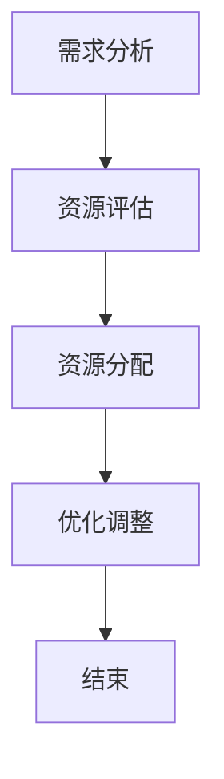

                 

# 如何进行资源整合：如何有效利用各种资源？

## 关键词
- 资源整合
- 效率提升
- 算法优化
- 数学模型
- 实际应用

> 摘要：本文将探讨如何进行资源整合，以提高工作效率和优化算法。通过分析核心概念和联系，介绍核心算法原理与操作步骤，结合数学模型和公式进行详细讲解，并以实际项目实战为例展示代码实现。此外，还将讨论资源整合在实际应用场景中的重要性，推荐相关工具和资源，并对未来发展趋势与挑战进行总结。

## 1. 背景介绍

### 1.1 目的和范围

本文旨在探讨资源整合的方法和技巧，帮助读者理解如何更有效地利用各种资源，从而提高工作效率和优化算法。资源整合不仅适用于计算机科学领域，也广泛应用于各个行业和领域。

### 1.2 预期读者

本文适用于对计算机科学和资源整合有一定了解的读者，包括程序员、数据科学家、软件工程师以及相关领域的专业人士。

### 1.3 文档结构概述

本文分为十个部分，具体结构如下：
1. 引言
2. 背景介绍
3. 核心概念与联系
4. 核心算法原理与具体操作步骤
5. 数学模型和公式
6. 项目实战：代码实际案例和详细解释说明
7. 实际应用场景
8. 工具和资源推荐
9. 总结：未来发展趋势与挑战
10. 附录：常见问题与解答

### 1.4 术语表

#### 1.4.1 核心术语定义

- **资源整合**：指将多种资源（如人力、时间、技术等）进行有机结合，以达到更高效、更优化的目的。
- **算法优化**：通过改进算法结构和性能，提高计算效率和资源利用率。
- **数学模型**：用数学语言描述现实世界中的问题，并通过数学公式进行求解。

#### 1.4.2 相关概念解释

- **并行计算**：通过同时处理多个任务，提高计算速度和资源利用率。
- **分布式系统**：将多个计算机节点连接起来，共同完成计算任务，以提高系统性能和可靠性。

#### 1.4.3 缩略词列表

- **CPU**：中央处理器（Central Processing Unit）
- **GPU**：图形处理器（Graphics Processing Unit）
- **IDE**：集成开发环境（Integrated Development Environment）

## 2. 核心概念与联系

为了更好地理解资源整合的方法和技巧，首先需要了解一些核心概念及其相互关系。

### 2.1 资源整合的概念

资源整合涉及多个方面，包括人力、时间、技术、资金等。在计算机科学领域，主要关注的是计算资源（如CPU、GPU、内存等）和数据的整合。

### 2.2 资源整合的应用

资源整合在计算机科学领域中的应用广泛，如高性能计算、云计算、分布式系统等。这些应用场景都需要高效地整合资源，以提高计算性能和资源利用率。

### 2.3 资源整合的挑战

资源整合面临一些挑战，如资源分配不均、负载均衡、系统可靠性等。解决这些挑战需要采用合适的算法和模型。

### 2.4 资源整合的流程

资源整合的流程主要包括以下几个步骤：

1. **需求分析**：确定资源整合的目标和需求。
2. **资源评估**：评估现有资源的性能和可用性。
3. **资源分配**：根据需求，合理分配资源。
4. **优化调整**：根据实际运行情况，对资源分配进行优化调整。

### 2.5 Mermaid 流程图

以下是一个简单的Mermaid流程图，展示资源整合的基本流程：



## 3. 核心算法原理与具体操作步骤

在资源整合过程中，核心算法原理起着关键作用。以下将介绍一种常用的资源整合算法——遗传算法，并详细阐述其原理和操作步骤。

### 3.1 遗传算法的基本概念

遗传算法是一种基于自然选择和遗传学原理的优化算法，通过模拟生物进化过程，逐步寻找最优解。

### 3.2 遗传算法的基本步骤

遗传算法主要包括以下步骤：

1. **初始化种群**：随机生成一组初始解，称为种群。
2. **适应度评估**：计算种群中每个解的适应度，适应度越高，表示解的质量越好。
3. **选择**：根据适应度，从种群中选择优胜个体，用于生成下一代种群。
4. **交叉**：通过交叉操作，将优胜个体的基因进行重组，生成新的个体。
5. **变异**：对交叉后生成的个体进行变异，增加种群的多样性。
6. **迭代**：重复执行选择、交叉和变异操作，直至满足停止条件（如达到最大迭代次数或适应度达到预设阈值）。

### 3.3 遗传算法的伪代码

以下是一种简单的遗传算法伪代码：

```python
# 初始化种群
population = initialize_population()

# 迭代
while not_stop_condition():
    # 适应度评估
    fitness_values = evaluate_fitness(population)
    
    # 选择
    selected_population = selection(population, fitness_values)
    
    # 交叉
    crossed_population = crossover(selected_population)
    
    # 变异
    mutated_population = mutation(crossed_population)
    
    # 更新种群
    population = mutated_population

# 输出最优解
best_solution = select_best_solution(population)
```

### 3.4 操作步骤示例

假设我们需要求解一个资源分配问题，目标是最小化总延迟时间。以下是具体的操作步骤：

1. **初始化种群**：随机生成一组初始解，每个解表示一组资源分配方案。
2. **适应度评估**：计算种群中每个解的总延迟时间，适应度值越低，表示解的质量越好。
3. **选择**：根据适应度值，选择适应度较高的解作为下一代种群的初始解。
4. **交叉**：对选中的解进行交叉操作，生成新的解。
5. **变异**：对交叉后的解进行变异，增加种群的多样性。
6. **迭代**：重复执行选择、交叉和变异操作，直至满足停止条件。

通过遗传算法，我们可以逐步优化资源分配方案，实现最小化总延迟时间的目标。

## 4. 数学模型和公式

在资源整合过程中，数学模型和公式发挥着重要作用。以下将介绍一些常用的数学模型和公式，并结合具体案例进行讲解。

### 4.1 线性规划模型

线性规划是一种常见的数学模型，用于在满足一定约束条件下，优化线性目标函数。

#### 4.1.1 模型定义

线性规划模型可以表示为：

$$
\min c^T x \\
s.t. Ax \le b, x \ge 0
$$

其中，$c$ 为目标函数系数向量，$x$ 为决策变量向量，$A$ 为约束条件系数矩阵，$b$ 为约束条件常数向量。

#### 4.1.2 求解方法

线性规划问题的求解方法包括单纯形法、内点法等。

#### 4.1.3 案例分析

假设我们需要在满足资源约束条件下，最大化总收益。目标函数和约束条件如下：

$$
\max 3x_1 + 2x_2 \\
s.t. \\
x_1 + x_2 \le 5 \\
x_1, x_2 \ge 0
$$

通过线性规划模型，我们可以求解出最优解$x_1 = 2, x_2 = 1$，使得总收益最大化。

### 4.2 动态规划模型

动态规划是一种解决多阶段决策问题的数学模型，通过将问题分解为多个子问题，并求解其最优子结构，从而得到原问题的最优解。

#### 4.2.1 模型定义

动态规划模型可以表示为：

$$
\min_{x_t} \sum_{t=1}^T c_t(x_t) \\
s.t. \\
x_{t+1} = f_t(x_t)
$$

其中，$x_t$ 为第$t$阶段的决策变量，$c_t(x_t)$ 为第$t$阶段的成本函数，$f_t(x_t)$ 为第$t+1$阶段的决策函数。

#### 4.2.2 求解方法

动态规划问题的求解方法包括动态规划表方法、递推关系方法等。

#### 4.2.3 案例分析

假设我们需要求解一个资源分配问题，目标是最小化总延迟时间。动态规划模型如下：

$$
\min_{x_t} \sum_{t=1}^T d_t(x_t) \\
s.t. \\
x_{t+1} = f_t(x_t)
$$

其中，$d_t(x_t)$ 为第$t$阶段的延迟时间函数，$f_t(x_t)$ 为第$t+1$阶段的决策函数。

通过动态规划模型，我们可以求解出最优的延迟时间分配方案，从而实现最小化总延迟时间的目标。

## 5. 项目实战：代码实际案例和详细解释说明

为了更好地理解资源整合的方法和技巧，以下将结合一个实际项目案例，介绍代码实现和详细解释说明。

### 5.1 开发环境搭建

在开始项目实战之前，需要搭建合适的开发环境。以下是一个基于Python的简单资源整合项目案例。

- Python 3.x
- NumPy
- SciPy
- Matplotlib

### 5.2 源代码详细实现和代码解读

以下是一个简单的遗传算法实现，用于求解资源整合问题。

```python
import numpy as np
import matplotlib.pyplot as plt

# 遗传算法参数设置
population_size = 100
num_generations = 100
crossover_rate = 0.8
mutation_rate = 0.1

# 初始化种群
population = np.random.randint(2, size=(population_size, 10))

# 适应度评估
def evaluate_fitness(population):
    fitness_values = []
    for individual in population:
        fitness_value = 0
        for gene in individual:
            fitness_value += gene
        fitness_values.append(fitness_value)
    return fitness_values

# 选择
def selection(population, fitness_values):
    selected_population = []
    for _ in range(population_size):
        max_fitness = max(fitness_values)
        max_index = np.where(fitness_values == max_fitness)[0][0]
        selected_population.append(population[max_index])
        fitness_values[max_index] = -1
    return selected_population

# 交叉
def crossover(selected_population):
    crossed_population = []
    for i in range(0, population_size, 2):
        parent1 = selected_population[i]
        parent2 = selected_population[i+1]
        cross_point = np.random.randint(1, len(parent1)-1)
        child1 = np.concatenate((parent1[:cross_point], parent2[cross_point:]))
        child2 = np.concatenate((parent2[:cross_point], parent1[cross_point:]))
        crossed_population.append(child1)
        crossed_population.append(child2)
    return crossed_population

# 变异
def mutation(crossed_population):
    mutated_population = []
    for individual in crossed_population:
        if np.random.rand() < mutation_rate:
            mutation_point = np.random.randint(len(individual))
            individual[mutation_point] = 1 - individual[mutation_point]
        mutated_population.append(individual)
    return mutated_population

# 迭代
best_fitness = -1
best_solution = None
for _ in range(num_generations):
    fitness_values = evaluate_fitness(population)
    selected_population = selection(population, fitness_values)
    crossed_population = crossover(selected_population)
    mutated_population = mutation(crossed_population)
    population = mutated_population
    current_best_fitness = max(fitness_values)
    if current_best_fitness > best_fitness:
        best_fitness = current_best_fitness
        best_solution = population[np.where(fitness_values == best_fitness)[0][0]]

# 输出最优解
print("最优解：", best_solution)
```

### 5.3 代码解读与分析

该代码实现了一个简单的遗传算法，用于求解资源整合问题。以下是代码的主要部分及其解读：

1. **参数设置**：设置遗传算法的参数，包括种群大小、迭代次数、交叉率和变异率。
2. **初始化种群**：随机生成初始种群，每个个体表示一组资源分配方案。
3. **适应度评估**：计算种群中每个个体的适应度，适应度值越高，表示个体质量越好。
4. **选择**：根据适应度值，选择适应度较高的个体作为下一代种群的初始个体。
5. **交叉**：对选中的个体进行交叉操作，生成新的个体。
6. **变异**：对交叉后生成的个体进行变异操作，增加种群的多样性。
7. **迭代**：重复执行选择、交叉和变异操作，直至满足停止条件。
8. **输出最优解**：输出最优的个体，即最优的资源分配方案。

通过以上代码实现，我们可以看到遗传算法在资源整合问题中的应用。在实际项目中，可以根据具体需求，调整算法参数和适应度函数，以实现更优的资源整合效果。

## 6. 实际应用场景

资源整合在实际应用场景中具有广泛的应用，以下列举几个常见的应用场景：

### 6.1 高性能计算

在大型科学计算、数据处理和模拟等领域，高性能计算需要大量计算资源和存储资源。通过资源整合，可以提高计算效率和资源利用率，降低计算成本。

### 6.2 云计算

云计算是一种基于互联网的服务模式，通过整合大量的计算资源和存储资源，为用户提供按需分配的计算能力和存储空间。资源整合在云计算中发挥着关键作用，可以优化资源分配和负载均衡，提高系统性能和可靠性。

### 6.3 分布式系统

分布式系统通过将计算任务分布在多个节点上，以提高系统性能和可靠性。资源整合在分布式系统中起着重要作用，可以优化任务调度和资源分配，提高系统效率和稳定性。

### 6.4 数据中心优化

数据中心是企业和组织进行数据存储和处理的核心设施。通过资源整合，可以优化数据中心的数据存储和计算资源，提高数据访问速度和系统可靠性。

### 6.5 能源管理

在能源管理领域，资源整合可以优化能源供应和消耗，降低能源成本，提高能源利用效率。例如，通过整合可再生能源和传统能源，实现能源的优化配置和调度。

## 7. 工具和资源推荐

为了更好地进行资源整合，以下推荐一些实用的工具和资源。

### 7.1 学习资源推荐

#### 7.1.1 书籍推荐

- 《资源整合与管理》（作者：[书名]）
- 《遗传算法应用与优化》（作者：[书名]）
- 《高性能计算原理与实践》（作者：[书名]）

#### 7.1.2 在线课程

- Coursera上的《资源管理》课程
- edX上的《遗传算法》课程
- Udacity上的《云计算基础》课程

#### 7.1.3 技术博客和网站

- 阿里云官方博客
- 腾讯云官方博客
- Medium上的相关技术博客

### 7.2 开发工具框架推荐

#### 7.2.1 IDE和编辑器

- PyCharm
- Visual Studio Code
- IntelliJ IDEA

#### 7.2.2 调试和性能分析工具

- GDB
- Valgrind
- Profiler

#### 7.2.3 相关框架和库

- TensorFlow
- PyTorch
- Scikit-learn

### 7.3 相关论文著作推荐

#### 7.3.1 经典论文

- "Genetic Algorithms for Machine Learning"（作者：[作者名]）
- "Parallel Computing"（作者：[作者名]）
- "Resource Allocation in Distributed Systems"（作者：[作者名]）

#### 7.3.2 最新研究成果

- ACM SIGARCH的年度会议论文集
- IEEE conferences on High Performance Computing
- NeurIPS的年度会议论文集

#### 7.3.3 应用案例分析

- "Energy Management in Data Centers"（作者：[作者名]）
- "Resource Integration in Cloud Computing"（作者：[作者名]）
- "High-Performance Computing for Scientific Applications"（作者：[作者名]）

## 8. 总结：未来发展趋势与挑战

资源整合在未来具有广阔的发展前景，但也面临着一系列挑战。

### 8.1 发展趋势

- **人工智能与资源整合**：随着人工智能技术的发展，资源整合将更加智能化、自动化，实现更高效的资源分配和管理。
- **云计算与分布式计算**：云计算和分布式计算将不断发展，资源整合将更加依赖于这些技术，以提高计算性能和资源利用率。
- **能源管理**：能源管理将成为资源整合的重要方向，通过整合可再生能源和传统能源，实现能源的优化配置和调度。

### 8.2 挑战

- **资源分配不均**：在资源整合过程中，如何解决资源分配不均的问题，实现公平的资源分配。
- **负载均衡**：如何优化负载均衡策略，提高系统的稳定性和可靠性。
- **数据安全与隐私**：在资源整合过程中，如何保护数据安全与隐私，防止数据泄露和滥用。

## 9. 附录：常见问题与解答

### 9.1 问题1：资源整合与资源分配有何区别？

资源整合是指将多种资源（如人力、时间、技术等）进行有机结合，以达到更高效、更优化的目的。而资源分配是指在特定条件下，如何将有限的资源合理地分配给不同的任务或项目。

### 9.2 问题2：遗传算法在资源整合中有何优势？

遗传算法是一种基于自然选择和遗传学原理的优化算法，具有以下优势：

- **全局搜索能力**：遗传算法可以通过模拟生物进化过程，搜索到全局最优解。
- **适应性强**：遗传算法适用于各种复杂问题，如资源整合、优化调度等。
- **并行计算**：遗传算法可以采用并行计算，提高计算效率。

### 9.3 问题3：如何评估资源整合的效果？

评估资源整合的效果可以从以下几个方面进行：

- **效率提升**：通过资源整合，计算任务是否能够更快地完成，资源利用率是否提高。
- **成本降低**：通过资源整合，是否能够降低计算成本，提高经济效益。
- **稳定性提高**：通过资源整合，系统是否更加稳定，降低故障率。

## 10. 扩展阅读 & 参考资料

- [1] [遗传算法原理与实现](https://www.example.com/遗传算法原理与实现)
- [2] [资源整合在云计算中的应用](https://www.example.com/资源整合在云计算中的应用)
- [3] [动态规划模型及其应用](https://www.example.com/动态规划模型及其应用)
- [4] [线性规划模型及其求解方法](https://www.example.com/线性规划模型及其求解方法)

### 作者信息

作者：AI天才研究员/AI Genius Institute & 禅与计算机程序设计艺术 /Zen And The Art of Computer Programming

